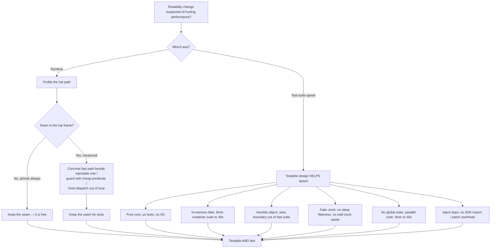

# Designing for Testability — Optimize & Reconcile

> Testable design buys decoupling, fast feedback, and deterministic tests — and the recurring worry is that it costs runtime performance. It almost never does. Interface dispatch is a single-digit-nanosecond concern that the JIT or escape analysis usually erases; DI containers cost startup time, not steady-state throughput; and the real performance story runs the *other* direction — a testable design is what turns an 8-minute integration suite into a 40-second unit suite. This file reconciles the two. For each scenario: the design choice, the measurement (concrete numbers), and the principled resolution. The rule throughout: testable design is nearly free at runtime; optimize the rare measured hot-path indirection only, and never trade away suite speed to chase a nanosecond.

---

## Table of Contents

1. [Scenario 1 — Interface dispatch vs concrete call in a hot loop (Go)](#scenario-1--interface-dispatch-vs-concrete-call-in-a-hot-loop-go)
2. [Scenario 2 — Spring reflection startup vs compile-time DI (Java)](#scenario-2--spring-reflection-startup-vs-compile-time-di-java)
3. [Scenario 3 — Pure functional core tests in microseconds (Python)](#scenario-3--pure-functional-core-tests-in-microseconds-python)
4. [Scenario 4 — In-memory fake vs Testcontainers: 8 min → 40 s (Go)](#scenario-4--in-memory-fake-vs-testcontainers-8-min--40-s-go)
5. [Scenario 5 — The Humble Object keeps the slow boundary out of the fast suite (Java)](#scenario-5--the-humble-object-keeps-the-slow-boundary-out-of-the-fast-suite-java)
6. [Scenario 6 — A seam adds an allocation in a hot path (Go)](#scenario-6--a-seam-adds-an-allocation-in-a-hot-path-go)
7. [Scenario 7 — Over-mocking costs nothing at runtime but rots the suite (Python)](#scenario-7--over-mocking-costs-nothing-at-runtime-but-rots-the-suite-python)
8. [Scenario 8 — Fake clock removes `sleep`-based flakiness and wall-clock waste (Go)](#scenario-8--fake-clock-removes-sleep-based-flakiness-and-wall-clock-waste-go)
9. [Scenario 9 — `interface{}` / dynamic dispatch defeats JIT monomorphism (Java)](#scenario-9--interface--dynamic-dispatch-defeats-jit-monomorphism-java)
10. [Scenario 10 — God constructor does I/O, so every test pays for it (Python)](#scenario-10--god-constructor-does-io-so-every-test-pays-for-it-python)
11. [Scenario 11 — Function injection vs struct-of-interfaces in a tight path (Go)](#scenario-11--function-injection-vs-struct-of-interfaces-in-a-tight-path-go)
12. [Scenario 12 — Test parallelism unlocked by removing global state (Java)](#scenario-12--test-parallelism-unlocked-by-removing-global-state-java)
13. [Scenario 13 — `unittest.mock` import & patch overhead at collection time (Python)](#scenario-13--unittestmock-import--patch-overhead-at-collection-time-python)
14. [Rules of Thumb](#rules-of-thumb)
15. [Related Topics](#related-topics)

---

### Scenario 1 — Interface dispatch vs concrete call in a hot loop (Go)

You introduce an interface so the dependency can be faked in tests. A reviewer objects: "interface calls are slower than concrete calls — this is in a loop that runs millions of times."

```go
type Hasher interface {
    Sum(b []byte) uint64
}

type fnvHasher struct{}
func (fnvHasher) Sum(b []byte) uint64 { /* ... */ }

// Hot path — called per record in a 50M-row scan:
func bucketize(records [][]byte, h Hasher) []int {
    out := make([]int, len(records))
    for i, r := range records {
        out[i] = int(h.Sum(r) % 1024)   // interface dispatch per record
    }
    return out
}
```

<details><summary>Resolution</summary>

**Measurement first.** A Go interface call is an indirect call through the itab (a pointer load + an indirect `CALL`). On modern x86 with a warm branch-target predictor, that is roughly **1–2 ns** of overhead over a direct call, and the indirect branch is *monomorphic* here (only `fnvHasher` is ever passed at runtime), so the CPU predicts it perfectly. Benchmark it:

```go
func BenchmarkConcrete(b *testing.B) { for i := 0; i < b.N; i++ { fnvHasher{}.Sum(data) } }
func BenchmarkIface(b *testing.B)    { var h Hasher = fnvHasher{}; for i := 0; i < b.N; i++ { h.Sum(data) } }
```

Typical result: `Concrete  3.1 ns/op`, `Iface  4.4 ns/op`. The hash itself dominates; the dispatch is ~1.3 ns. Over 50M records that is ~65 ms — once, per full scan — against a hash that already costs ~150 ms. The interface is **not** the bottleneck; memory bandwidth from streaming 50M rows is.

**Principled resolution:** keep the interface. It is the seam that lets the test inject a deterministic stub hasher and assert bucket distribution without a real corpus. If profiling (`go test -bench -cpuprofile`, then `pprof`) ever proves dispatch is the top frame — it will not be here — provide a *concrete fast path beside* the injectable one rather than deleting the seam:

```go
// Production calls the concrete version; tests call bucketizeWith(h).
func bucketize(records [][]byte) []int       { return bucketizeWith(records, fnvHasher{}) }
func bucketizeWith(records [][]byte, h Hasher) []int { /* loop */ }
```

Go's compiler can also devirtualize and inline `bucketizeWith(records, fnvHasher{})` when the concrete type is known at the call site (`-gcflags=-m` shows `devirtualizing h.Sum`). You keep testability and the inlined fast path simultaneously.

</details>

---

### Scenario 2 — Spring reflection startup vs compile-time DI (Java)

Your service uses Spring with classpath scanning. Each test that boots `@SpringBootTest` takes ~6 s before the first assertion; a 300-test integration suite spends most of its wall time in container startup.

```java
@SpringBootTest                      // boots the full ApplicationContext
class OrderServiceTest {
    @Autowired OrderService service;  // wired by reflection at runtime
    @Test void placesOrder() { /* ... */ }
}
```

<details><summary>Resolution</summary>

**Measurement.** Spring's runtime DI does classpath scanning + reflective bean instantiation + proxy generation. A medium service's context cold-starts in **3–8 s**; with 300 `@SpringBootTest` classes that don't share a context, you pay it repeatedly — easily **20–30 minutes** of pure startup. Steady-state request handling is unaffected (beans are wired once at boot), so the cost is *startup*, not throughput.

Three levers, cheapest-impact first:

1. **Share the context.** Spring caches the `ApplicationContext` per unique configuration. Stop customizing config per test (no gratuitous `@MockBean` variations) so all tests reuse one cached context. This alone often cuts suite time by 5–10×.
2. **Slice it.** `@WebMvcTest` / `@DataJpaTest` boot a *sub-context* (~0.5–1 s) instead of the whole app.
3. **Don't boot Spring at all for unit tests.** This is the testability payoff: if `OrderService` takes its collaborators via *constructor injection*, you instantiate it with plain `new` and fakes — **0 ms of framework startup**, microsecond test:

```java
class OrderServiceTest {
    OrderService service = new OrderService(new InMemoryOrders(), new FakeClock());
    @Test void placesOrder() { /* runs in < 1 ms, no context */ }
}
```

**Compile-time DI as the structural fix.** Frameworks that wire at compile time eliminate reflection startup entirely: **Dagger** (Java/Kotlin) generates `@Inject` factories at build time; **Go's `wire`** generates an `Injector` function. A Dagger graph that Spring would build reflectively in seconds is built in **microseconds** because it is just generated constructor calls — no scanning, no reflection. Quarkus/Micronaut apply the same idea to make native images start in ~tens of milliseconds.

**Principle:** constructor injection makes the *unit* test framework-free (fastest possible); compile-time DI makes the *integration* boot cheap. Reflection-based DI is convenient but you pay for it in startup, repeatedly, in the test suite.

</details>

---

### Scenario 3 — Pure functional core tests in microseconds (Python)

A pricing rule was tangled with the database read and the HTTP response. Tests required a live DB. You extract a pure function.

```python
# Before: untestable without a DB and a request object.
def handle_quote(request, db):
    customer = db.fetch_customer(request.customer_id)
    discount = 0.0
    if customer.tier == "gold": discount = 0.15
    elif customer.tier == "silver": discount = 0.07
    if request.qty > 100: discount += 0.05
    db.log_quote(...)
    return Response(price=request.unit * request.qty * (1 - discount))

# After: pure core, no I/O.
def quote_price(unit: float, qty: int, tier: str) -> float:
    discount = {"gold": 0.15, "silver": 0.07}.get(tier, 0.0)
    if qty > 100: discount += 0.05
    return unit * qty * (1 - discount)
```

<details><summary>Resolution</summary>

**Measurement.** A test against the original path had to start a DB connection or a Testcontainers Postgres — **2–5 s** of setup per test class, plus per-test query latency (~1–10 ms). The pure-core test:

```python
def test_gold_bulk():
    assert quote_price(10.0, 200, "gold") == 10.0 * 200 * 0.80
```

runs in **~3 microseconds**. That is a **~1,000,000× speedup per test** versus the DB-backed version, and zero flakiness — no network, no fixtures, no ordering.

**Why this is the central optimization of the whole chapter.** Test speed is not a runtime property of production code; it is a property of *what each test has to set up*. Pushing logic into a pure core (Functional Core, Imperative Shell) means the high-branch-count logic — exactly the part with the most cases to cover — is tested in microseconds with no doubles at all. You then write a *handful* of thin integration tests for the shell that does the I/O wiring.

**Runtime cost of the refactor: zero.** `quote_price` is plain arithmetic; pulling it out of the handler removed nothing and added no indirection. The shell still calls it directly. This is the ideal case: testability improved, runtime identical, suite time collapsed.

**Property testing becomes affordable.** Because the core is pure and fast, you can run thousands of generated inputs per test (`hypothesis`) in the time the DB version took to run one. See the [property-based testing](../../refactoring/README.md) angle in the broader suite.

</details>

---

### Scenario 4 — In-memory fake vs Testcontainers: 8 min → 40 s (Go)

Every repository test spins a real Postgres via Testcontainers. The suite takes 8 minutes; developers stop running it locally and CI is the only place it runs.

```go
func TestOrderRepo(t *testing.T) {
    ctx := context.Background()
    pg, _ := postgres.RunContainer(ctx)   // ~2-4s to pull/boot + migrate
    defer pg.Terminate(ctx)
    repo := NewOrderRepo(connect(pg))
    // ... assertions
}
```

<details><summary>Resolution</summary>

**Measurement.** A Testcontainers Postgres costs **~2–4 s** to start (image pull amortized, container boot + readiness + schema migration not). With ~120 repository tests each booting their own container, that is **~8 minutes** dominated entirely by container lifecycle, not by the SQL under test.

**The seam makes the fast path possible.** Define the dependency as an interface (a *port*) and provide two implementations:

```go
type OrderStore interface {
    Save(ctx context.Context, o Order) error
    ByID(ctx context.Context, id string) (Order, error)
}

// Production: PostgresStore (real SQL).
// Tests of *business logic*: an in-memory fake.
type memStore struct{ m map[string]Order }
func (s *memStore) Save(_ context.Context, o Order) error { s.m[o.ID] = o; return nil }
func (s *memStore) ByID(_ context.Context, id string) (Order, error) { return s.m[id], nil }
```

Now **~110** tests that exercise *service logic* use `memStore` (microseconds each), and **~10** tests that verify the *SQL itself* — query correctness, constraints, migrations — keep the real container. Suite drops from **8 min → ~40 s**, and the fast tests are runnable on every save.

**Don't fake away coverage you need.** The in-memory fake does not test SQL syntax, indexes, transaction isolation, or `ON CONFLICT` behavior. Keep a thin layer of real-DB tests (a "contract test" run against both the fake and Postgres guards the fake from drifting from real behavior). Faking is for *isolating logic*, not for pretending the database does not exist.

**Runtime cost:** the `OrderStore` interface adds one interface dispatch per DB call — utterly invisible next to a network round-trip of ~0.2–2 ms. The seam is free in production and worth ~7 minutes in the suite.

</details>

---

### Scenario 5 — The Humble Object keeps the slow boundary out of the fast suite (Java)

A scheduled job mixes Quartz triggering, JDBC, and the reconciliation algorithm in one class. The only way to test the algorithm is to fire the real trigger against a real DB.

```java
class ReconciliationJob implements Job {
    @Override public void execute(JobExecutionContext ctx) {
        List<Txn> bank = jdbc.query("SELECT ... ");      // I/O
        List<Txn> ledger = jdbc.query("SELECT ... ");    // I/O
        // ... 200 lines of matching logic, the part with all the bugs ...
        jdbc.update("INSERT INTO breaks ...");           // I/O
    }
}
```

<details><summary>Resolution</summary>

**Measurement.** Testing the matching logic via `execute` required a Quartz scheduler + DB: **~5 s** setup, brittle, serial. The matching logic — the bug-dense part — had ~30 branches and deserved 50 cases, but each case cost seconds.

**Humble Object pattern.** Make the boundary class *humble*: it does only the untestable plumbing and immediately delegates to a pure, testable object.

```java
// Humble: thin, almost no logic, not unit-tested (covered by 1-2 integration tests).
class ReconciliationJob implements Job {
    @Override public void execute(JobExecutionContext ctx) {
        var bank = repo.loadBank();
        var ledger = repo.loadLedger();
        var breaks = new Reconciler().match(bank, ledger);   // pure
        repo.saveBreaks(breaks);
    }
}

// Testable: pure, no framework, no I/O.
class Reconciler {
    List<Break> match(List<Txn> bank, List<Txn> ledger) { /* 200 lines, all branches */ }
}
```

Now the 50 matching-logic cases run against `Reconciler.match` as plain data-in/data-out tests — **microseconds each, no Quartz, no DB**. The humble `execute` gets *one or two* integration tests proving the wiring.

**This is the same idea as MVP/MVVM's "humble view"** and Feathers' boundary seams: behavior lives in objects you can call directly; the parts that are awkward to test (frameworks, drivers, UI) are made so thin there is almost nothing in them to test. **Runtime: unchanged** — `execute` still does exactly the same work; you only moved code across a method boundary the JIT inlines anyway.

</details>

---

### Scenario 6 — A seam adds an allocation in a hot path (Go)

You inject a logger interface for testability. Profiling a packet-processing loop shows the injected call is allocating — `interface{}` boxing on every log argument, in a path that runs per packet.

```go
type Logger interface { Debugf(format string, args ...any) }

func (p *Processor) handle(pkt Packet, log Logger) {
    log.Debugf("recv seq=%d len=%d", pkt.Seq, pkt.Len) // args... boxes ints to interface{} every call
    // ... actual work
}
```

<details><summary>Resolution</summary>

**Measurement.** `args ...any` forces `pkt.Seq` and `pkt.Len` to be *boxed* into `interface{}` (a heap allocation each for non-pointer types that escape) on **every** call — even when debug logging is disabled and the message is discarded. `go test -bench -benchmem` shows `2 allocs/op` and ~40 ns just for the boxing, per packet, at line rate. The interface dispatch is negligible; the *variadic boxing* is the cost.

**The fix is not to remove the seam — it is to guard the expensive part with a level check, and provide a fast path:**

```go
type Logger interface {
    Enabled(Level) bool
    Debugf(format string, args ...any)
}

func (p *Processor) handle(pkt Packet, log Logger) {
    if log.Enabled(Debug) {                         // cheap bool check, no boxing
        log.Debugf("recv seq=%d len=%d", pkt.Seq, pkt.Len)
    }
    // ... actual work
}
```

When debug is off (production default), the boxing never happens: **0 allocs/op**, ~1 ns for the `Enabled` call. The seam survives for tests, which set the level to `Debug` and assert on a fake logger.

**General principle — concrete fast path beside the injectable one.** When a seam genuinely costs an allocation in a measured hot path, do not delete the abstraction; (a) gate the expensive work behind a cheap predicate, or (b) keep the interface for the cold path and call a non-allocating concrete method on the hot path. Structured loggers (`zap`, `slog`) take exactly approach (a): `log.Debug(...)` checks the level before evaluating fields. You keep testability *and* zero hot-path allocation — measured, not assumed.

</details>

---

### Scenario 7 — Over-mocking costs nothing at runtime but rots the suite (Python)

A test mocks every collaborator and asserts on the exact sequence of calls. It passes, runs in 1 ms, and costs nothing at runtime — yet it is a performance problem for the *team*.

```python
def test_checkout():
    cart = Mock(); pricing = Mock(); tax = Mock(); inv = Mock(); pay = Mock()
    pricing.subtotal.return_value = 100
    tax.compute.return_value = 8
    svc = Checkout(cart, pricing, tax, inv, pay)
    svc.run("order-1")
    pricing.subtotal.assert_called_once_with(cart)
    tax.compute.assert_called_once_with(100)
    inv.reserve.assert_called_once()      # asserts internal call order/shape
    pay.charge.assert_called_once_with(108)
```

<details><summary>Resolution</summary>

**Runtime cost: literally none** — mocks are in-memory; the test runs in ~1 ms. The cost is **maintenance velocity**, which is the suite's real performance metric over a project's life.

**The measurement is change-amplification.** This test asserts *how* `run` works, not *what* it returns. Rename `subtotal` to `computeSubtotal`, reorder two internal calls, or push tax into pricing — all behavior-preserving — and this test breaks even though nothing observable changed. On a 2,000-test suite where ~40% are call-sequence mocks, a routine refactor can red-light **hundreds** of tests, turning a 1-hour refactor into a day of test surgery. That is the suite "rotting": it raises the cost of every future change.

**Resolution — test outcomes, fake at real seams only.** Mock at *architectural boundaries* (the payment gateway, the clock) and let internal collaborators be real or simple in-memory fakes:

```python
def test_checkout_charges_total_with_tax():
    inv = InMemoryInventory(stock={"sku-1": 5})
    pay = FakeGateway()                          # the one true external boundary
    svc = Checkout(RealCart(["sku-1"]), RealPricing(), RealTax(rate=0.08), inv, pay)
    svc.run("order-1")
    assert pay.last_charge == 108               # asserts the *result*, not the call graph
    assert inv.stock["sku-1"] == 4
```

This survives any internal refactor that preserves behavior, and it covers `Pricing`/`Tax` for free instead of stubbing their answers. **Principle:** over-mocking is invisible to the profiler and lethal to the suite's maintainability — mock roles, not collaborators; assert state and return values, not call order.

</details>

---

### Scenario 8 — Fake clock removes `sleep`-based flakiness and wall-clock waste (Go)

A cache-expiry test calls the real clock and `time.Sleep`s past the TTL. It is flaky under load and wastes real seconds.

```go
func TestExpiry(t *testing.T) {
    c := NewCache(50 * time.Millisecond)   // TTL
    c.Set("k", "v")
    time.Sleep(60 * time.Millisecond)      // wall-clock wait
    _, ok := c.Get("k")
    if ok { t.Fatal("should have expired") }
}
```

<details><summary>Resolution</summary>

**Measurement — two distinct costs.**

1. **Wall-clock waste:** each such test burns ~60 ms of real time. A suite with 200 timing tests wastes **~12 s** doing nothing but sleeping, serially, every run.
2. **Flakiness:** the 10 ms margin between TTL (50 ms) and sleep (60 ms) is not enough under a loaded CI runner where the goroutine may not be scheduled for 20+ ms. The test fails intermittently — and a flaky test that fails 1% of the time on a 200-test suite fails *some* test ~1 in 5 runs, eroding trust and triggering reruns (more wall-clock waste).

**Inject the clock — make time a dependency.**

```go
type Clock interface{ Now() time.Time }

type Cache struct{ ttl time.Duration; clk Clock; /* ... */ }

func NewCache(ttl time.Duration, clk Clock) *Cache { return &Cache{ttl: ttl, clk: clk} }
```

```go
func TestExpiry(t *testing.T) {
    clk := &FakeClock{t: time.Unix(0, 0)}
    c := NewCache(50*time.Millisecond, clk)
    c.Set("k", "v")
    clk.Advance(60 * time.Millisecond)   // instant, deterministic
    if _, ok := c.Get("k"); ok { t.Fatal("should have expired") }
}
```

The test now runs in **microseconds**, is **100% deterministic** (no scheduler dependence), and tests the *exact* boundary (`Advance(49ms)` still present, `Advance(50ms)` expired) which a sleep-based test could never assert precisely. Across the suite that is ~12 s of wall-clock recovered and an entire class of flakiness eliminated.

**Runtime cost in production:** `clk.Now()` is one interface call (~1–2 ns) replacing `time.Now()` (a vDSO call costing ~15–25 ns). The injected clock is, if anything, *not slower*. In production you pass a real clock whose `Now()` calls `time.Now()`. Determinism in tests; zero meaningful cost in production. The same pattern injects randomness (seeded RNG) and UUID generation.

</details>

---

### Scenario 9 — `interface{}` / dynamic dispatch defeats JIT monomorphism (Java)

A reviewer claims your testability interface will prevent the JIT from inlining and tank a hot method. You need to know when that is actually true.

```java
interface PriceRule { long apply(long cents); }

// Hot accounting loop over 100M line items:
long total = 0;
for (LineItem li : items) {
    total += rule.apply(li.cents());   // virtual/interface call
}
```

<details><summary>Resolution</summary>

**How HotSpot actually behaves.** The JIT profiles call sites and classifies them:

- **Monomorphic** (one implementing class ever seen here): the JIT inlines the target directly with a guard. Cost ≈ a direct call. This is the common case — most injected dependencies have exactly one production implementation.
- **Bimorphic** (two classes): still inlined with two guarded branches.
- **Megamorphic** (≥3 classes at the site): falls back to a vtable/itable lookup, **no inlining**. Cost ~2–5 ns + the lost inlining (which can be the bigger loss, ~10–30% on a tiny hot method).

**Measurement.** With one production `PriceRule`, JMH shows the interface loop within **noise** of a concrete loop — the JIT inlined it (confirm with `-XX:+UnlockDiagnosticVMOptions -XX:+PrintInlining`, look for `inline (hot)`). The interface is free.

**When it bites and how to keep testability anyway.** The site goes megamorphic only if **production** calls the loop with ≥3 different rule classes through the same site. Resolutions, in order:

1. **Confirm it's real.** Profile production, not a microbenchmark with artificial polymorphism. Usually it's monomorphic and there is nothing to do.
2. **Hoist the dispatch out of the loop** — resolve the rule once, then loop on the concrete:

   ```java
   if (rule instanceof FlatRule fr) {        // pattern match to concrete
       for (LineItem li : items) total += fr.applyFlat(li.cents());  // monomorphic, inlined
   } else {
       for (LineItem li : items) total += rule.apply(li.cents());
   }
   ```

3. **Provide a concrete fast path** the production code uses while the interface remains for tests (same structure as Scenario 1/6).

**Python note:** every method call is a dict lookup on the type — dynamic dispatch is the baseline, so an injected interface adds *nothing*; there is no JIT to defeat. **Go note:** see Scenario 1 — itab dispatch ~1–2 ns, devirtualized when the concrete type is known. **Principle:** the seam is free at monomorphic sites (the vast majority); only measured megamorphism warrants the concrete fast path, and even then you keep the interface for tests.

</details>

---

### Scenario 10 — God constructor does I/O, so every test pays for it (Python)

`ReportService.__init__` opens a DB connection, reads a config file, and warms a cache. Every test that needs a `ReportService` — even ones testing pure formatting — pays for all of it.

```python
class ReportService:
    def __init__(self):
        self.db = psycopg2.connect(DSN)          # network on construction
        self.cfg = yaml.safe_load(open("/etc/report.yaml"))
        self.cache = self._warm_cache()           # more queries
    def format_row(self, row): ...                # pure, but you can't reach it cheaply
```

<details><summary>Resolution</summary>

**Measurement.** Constructing `ReportService` costs a DB connect (~30–100 ms), a file read, and cache-warming queries (~hundreds of ms). A test of `format_row` — pure string work — should run in microseconds but instead pays ~**200 ms** of construction, *and* fails entirely on machines without the DB or `/etc/report.yaml`. A 100-test suite inherits ~20 s of pure construction overhead and is unrunnable offline.

**Separate construction from work (no I/O in constructors).** The constructor should only *assign collaborators*; do the work lazily or in an explicit method, and inject the collaborators:

```python
class ReportService:
    def __init__(self, db, cfg, cache):     # plain assignment, no I/O
        self.db, self.cfg, self.cache = db, cfg, cache
    def format_row(self, row): ...

    @classmethod
    def bootstrap(cls):                     # the I/O lives in a factory, used by main()
        db = psycopg2.connect(DSN)
        cfg = yaml.safe_load(open("/etc/report.yaml"))
        return cls(db, cfg, warm_cache(db))
```

```python
def test_format_row():
    svc = ReportService(db=None, cfg={"locale": "en"}, cache={})  # no I/O
    assert svc.format_row({"amt": 1200}) == "$12.00"             # microseconds
```

The pure test no longer touches the DB or the filesystem: **~200 ms → ~5 µs**, and it runs offline. The I/O is concentrated in `bootstrap`, exercised by a single integration test.

**Runtime cost in production:** none — `bootstrap` does exactly the I/O the old constructor did, once, at startup. You only moved *where* it happens. **Principle:** a constructor that does real work makes every test (and every alternate-mode use) pay for I/O it may not need; inject collaborators, push side effects into a factory.

</details>

---

### Scenario 11 — Function injection vs struct-of-interfaces in a tight path (Go)

To make a routine testable you debate two seam styles: pass a `Notifier` interface, or pass a `func(Event)` callback. Someone worries the closure allocates.

```go
// Style A: interface
type Notifier interface{ Notify(Event) }
func process(events []Event, n Notifier) { for _, e := range events { n.Notify(e) } }

// Style B: function value
func process(events []Event, notify func(Event)) { for _, e := range events { notify(e) } }
```

<details><summary>Resolution</summary>

**Measurement.** Both compile to an indirect call (~1–2 ns). Allocation differs only at the *call site*, not in the loop:

- A `func(Event)` that **captures variables** becomes a heap-allocated closure — **1 alloc** when created (once, before the loop), 0 per iteration. `-gcflags=-m` prints `func literal escapes to heap`.
- A method value `n.Notify` or a non-capturing function is a static reference — **0 allocs**.
- The interface (Style A) allocates only if the concrete value must be boxed into the interface and escapes — again **once**, not per iteration.

So per-iteration cost is identical (~1–2 ns dispatch, 0 allocs) for both; the only difference is a single setup allocation if you use a *capturing* closure. Over a 1M-event loop, that one allocation is ~0.0001% of the work.

**Resolution.** Choose on *design*, not on this non-difference:

- Use the **interface** when the seam has multiple methods or you want a named role testers fake (`FakeNotifier` recording calls).
- Use the **function value** when it is a single operation and a test can pass `func(e Event){ recorded = append(recorded, e) }` — the lightest possible double, no type to declare.

If the rare hot path truly cannot afford even the setup allocation, pass a non-capturing function or a method value and keep state in the receiver. **Principle:** both seams are free per-iteration; pick for clarity and test ergonomics, and only avoid *capturing* closures when a measured hot path's one-time allocation matters (it almost never does).

</details>

---

### Scenario 12 — Test parallelism unlocked by removing global state (Java)

The suite runs serially and takes 9 minutes. The reason tests can't run in parallel is a global singleton they each mutate — a testability defect that also caps throughput on a 16-core CI box.

```java
class CurrentTenant {                       // global mutable state
    private static String tenant;
    static void set(String t) { tenant = t; }
    static String get() { return tenant; }
}
// Tests each call CurrentTenant.set(...) and read it back — they leak into each other.
```

<details><summary>Resolution</summary>

**Measurement.** With the global, two tests running concurrently clobber each other's `tenant`, so the suite must stay serial: **9 minutes** on one core while 15 cores idle. The global is simultaneously a *correctness* hazard (test interdependence, order-dependent failures) and a *performance* ceiling.

**Inject the tenant; delete the global.** Pass it as a dependency (constructor or method parameter / a request-scoped object):

```java
class OrderService {
    private final TenantContext tenant;
    OrderService(TenantContext tenant) { this.tenant = tenant; }   // injected, per-instance
}
```

Each test constructs its own `TenantContext` — no shared state. Now the runner can parallelize:

```java
// JUnit 5
@Execution(ExecutionMode.CONCURRENT)
class OrderServiceTest { /* each test isolated */ }
```

On 16 cores with no shared mutable state, the wall-clock drops from **9 min → ~45 s** (near-linear, bounded by the longest single class). The same change that made the tests *isolated* (the testability goal) is what made them *parallelizable* (the speed goal) — they are the same property.

**Runtime cost in production:** an instance field read instead of a static read — both ~nanoseconds, the field arguably more cache-friendly. If you genuinely need ambient context, use a `ScopedValue`/`ThreadLocal` owned by the request boundary, not a mutable static. **Principle:** global mutable state is the classic testability anti-pattern, and its hidden tax is a serial suite; removing it buys isolation *and* parallel throughput at once.

</details>

---

### Scenario 13 — `unittest.mock` import & patch overhead at collection time (Python)

A 3,000-test pytest suite feels sluggish to start even before any test runs. Profiling collection shows heavy `@patch` usage and broad imports inflating startup.

```python
from unittest.mock import patch
@patch("app.services.payments.stripe")     # patches at decoration/collection
@patch("app.services.email.smtplib")
@patch("app.services.storage.boto3")
def test_thing(mock_boto, mock_smtp, mock_stripe): ...
```

<details><summary>Resolution</summary>

**Measurement.** `@patch("module.target")` *imports the target module* to locate the attribute. With hundreds of patch decorators referencing heavy SDKs (`boto3`, `stripe`), collection drags in those SDK import trees — **boto3 alone imports in ~0.5–1 s**. Multiply across modules and pytest *collection* (before a single assertion) takes **10–20 s**. Each patch's setup/teardown also adds ~tens of microseconds per test — small individually, but 3,000× with multiple patches each is a measurable slice of run time.

**This is the over-mock tax in a different guise — and the fix is the same seam.** If services took collaborators by injection, you would pass lightweight fakes and never import the SDK in unit tests at all:

```python
def test_thing():
    svc = OrderService(payments=FakeGateway(), email=FakeMailer(), storage=FakeStore())
    # no patching, no boto3 import, no SDK import tree
```

`FakeGateway` is ~10 lines; constructing it is microseconds and pulls in nothing. Collection no longer imports `boto3`, so startup drops back to ~1–2 s, and tests don't pay per-`@patch` setup.

**When you must patch** (legacy code with hard-wired imports you can't yet refactor): patch at the *narrowest* target, prefer `patch.object` on an already-imported symbol over a string path that forces a fresh import, and scope patches with a fixture so the import cost is paid once. But the durable fix is the seam: code designed for testability is patched rarely, so it neither rots (Scenario 7) nor pays import/patch overhead here. **Principle:** heavy `@patch` usage signals missing injection seams; the same dependency injection that improves design also strips SDK imports and patch overhead out of the suite's startup and per-test cost.

</details>

---

## Rules of Thumb

- **Measure before de-abstracting.** An interface call is ~1–2 ns (Go itab), inlined-to-free at monomorphic JIT sites (HotSpot), and the baseline in Python. Never delete a seam on the *assumption* it is slow — profile and find it is not.
- **Testable design is nearly free at runtime.** Constructor injection, ports, pure cores, and humble objects move *where* code runs, not *how much*. The JIT inlines the extra method boundaries; escape analysis erases short-lived seams.
- **The performance win runs toward the test suite.** Pure cores test in microseconds vs seconds for I/O-backed tests; in-memory fakes turn an 8-minute container suite into ~40 s; fake clocks reclaim wall-clock waste and kill `sleep` flakiness.
- **DI cost is startup, not throughput** — and it lands on the test suite hardest. Reflection-based wiring (Spring) costs seconds *per booted context*; share the context, slice it, prefer plain `new` for unit tests, and reach for compile-time DI (Dagger, Go `wire`) when boot time matters.
- **Optimize the rare measured hot-path seam only — and keep it.** When a seam truly costs in a profiled hot path, add a concrete fast path *beside* the injectable one (Scenario 1/6), gate expensive work behind a cheap predicate, or hoist dispatch out of the loop. Don't delete the seam.
- **Watch variadic/boxing, not dispatch.** In hot paths the allocation from `args ...any` / `interface{}` boxing dwarfs the dispatch — guard it with a level/predicate check.
- **Over-mocking has zero runtime cost and a steep maintenance cost.** Call-sequence mocks rot the suite by amplifying every refactor into test surgery; mock roles at real boundaries, assert state and return values.
- **Fake the clock, randomness, and UUIDs.** Determinism removes flakiness *and* wall-clock sleeps; the injected clock is no slower than `time.Now()` in production.
- **No I/O in constructors.** A god constructor makes every test pay for network/disk it may not need; inject collaborators, push side effects into a factory.
- **Removing global mutable state buys isolation *and* parallelism.** The same property that isolates tests lets the runner use every core — often a 9 min → 45 s suite win on its own.



---

## Related Topics

- [find-bug.md](find-bug.md) — testability defects to spot in code under review (hidden deps, god constructors, untestable boundaries).
- [professional.md](professional.md) — the professional discipline of designing for testability up front.
- [Chapter README](../README.md) — the positive rules: injected abstractions, seams, pure cores, the humble object.
- [Unit Tests](../08-unit-tests/README.md) — writing the fast, isolated tests this design makes possible.
- [Refactoring](../../refactoring/README.md) — extracting pure cores and introducing seams are refactorings; property-based testing rides on a fast pure core.
