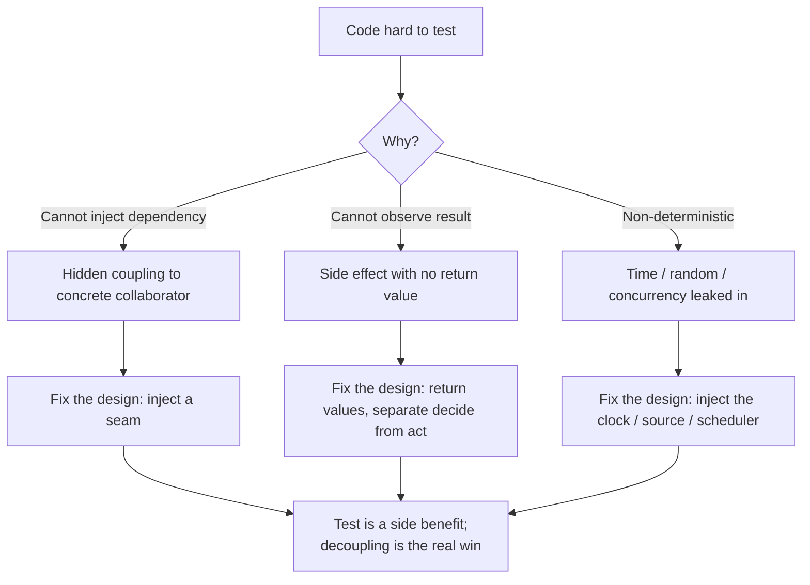
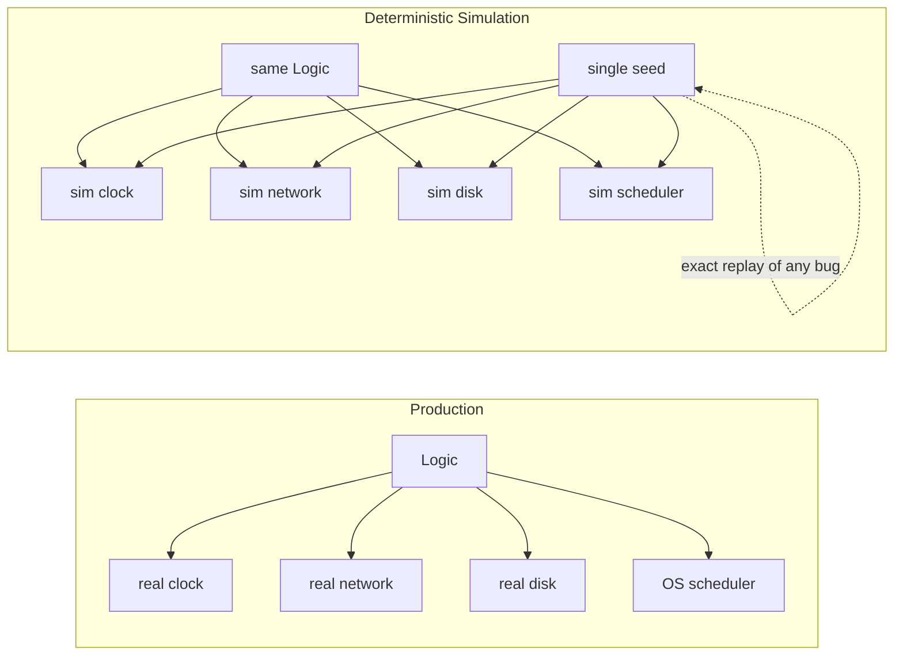

# Designing for Testability — Professional Level

> Focus: the deep end and the open debates. Where testability and design purity collide, where the schools disagree, and the theory underneath it all — controllability, observability, seams, the functional core, and deterministic simulation. Testability is not a property you bolt on; it is a *measurement* of how decoupled your design already is.

---

## Table of Contents

1. [Testability is a design metric, not a test metric](#testability-is-a-design-metric-not-a-test-metric)
2. [The two pillars: controllability and observability](#the-two-pillars-controllability-and-observability)
3. [Seams — Feathers' theory of dependency breaking](#seams--feathers-theory-of-dependency-breaking)
4. [Functional core, imperative shell](#functional-core-imperative-shell)
5. [London vs Detroit — how each school shapes design](#london-vs-detroit--how-each-school-shapes-design)
6. [The mock-heavy design trap](#the-mock-heavy-design-trap)
7. [The DHH critique: test-induced design damage](#the-dhh-critique-test-induced-design-damage)
8. [Property-based testing as a design force](#property-based-testing-as-a-design-force)
9. [Designing for determinism: time, randomness, concurrency, DST](#designing-for-determinism-time-randomness-concurrency-dst)
10. [Common Mistakes](#common-mistakes)
11. [Test Yourself](#test-yourself)
12. [Cheat Sheet](#cheat-sheet)
13. [Summary](#summary)
14. [Further Reading](#further-reading)
15. [Related Topics](#related-topics)

---

## Testability is a design metric, not a test metric

The single most useful reframing at this level: **testability measures coupling, not test coverage.** A class that is painful to test is telling you something about its design before you write a single assertion. Michael Feathers makes this explicit — the reason legacy code is hard to test is the same reason it is hard to change: dependencies you cannot replace (Feathers, *Working Effectively with Legacy Code*, 2004).

So "make it testable" is rarely the real goal. The real goal is decoupling; testability is the *instrument* that detects coupling early, at the point of construction rather than the point of failure. This is why the design-for-testability conversation belongs in a Clean Code chapter at all and not buried in a test framework manual.

The corollary cuts both ways and is the source of every debate in this chapter: if testability detects coupling, then *optimizing purely for testability* can also distort design — adding indirection that exists only to satisfy a test double. The professional skill is telling the two apart.



---

## The two pillars: controllability and observability

These terms come from **Design for Testability (DFT)** in hardware and control theory, and they transfer cleanly to software. A unit is testable to the degree that you can:

- **Controllability** — drive the unit into any state you want from its inputs. Can you set up the preconditions for the case you need to exercise? If a value is computed from `time.Now()` deep inside, you cannot control it; the input is hidden.
- **Observability** — see the unit's resulting state or output. Can you confirm what happened? A method that mutates a private field, logs to a global, and returns `void` has near-zero observability.

Every concrete testability technique maps to one or both pillars:

| Technique | Improves |
|---|---|
| Dependency injection | Controllability (substitute inputs) |
| Return a value instead of mutating in place | Observability |
| Inject the clock / RNG / ID generator | Controllability |
| Pure functions | Both (input fully controls output, output fully observable) |
| Humble Object (thin untestable shell) | Observability (move logic where it's observable) |
| Event sourcing / decision returned as data | Observability (assert on the decision, not the effect) |

Naming the two pillars is not academic. In a design review you can ask, precisely, *"how do I control this input?"* and *"how do I observe this outcome?"* — and if the answer to either is "you can't," you have found a design defect, independent of whether anyone is writing a test.

---

## Seams — Feathers' theory of dependency breaking

A **seam** is "a place where you can alter behavior in your program without editing in that place" (Feathers, 2004, Ch. 4). Every seam has an **enabling point** — the place where you choose which behavior is active. Feathers classifies seams by *when* the substitution happens:

- **Object seam** — substitution at runtime via polymorphism. You pass a different implementation of an interface. Enabling point: the call site / constructor. This is the seam most languages with virtual dispatch favor, and the one DI targets.
- **Link seam** — substitution at link/build time. You compile or link against a different artifact (a test build that links a fake `libpayments`, a Go build tag, a Bazel test-only dependency). Enabling point: the build configuration.
- **Preprocessing seam** — substitution before compilation via macros / code generation (`#ifdef TEST`). Common in C/C++; rare and usually a smell in managed languages.

The professional point Feathers makes: **object seams are preferable** because the enabling point is in the code and visible, link/preprocessing seams hide the substitution in build config where it rots. But link seams are invaluable in legacy code where you cannot afford to introduce an interface for a third-party static call.

**Go — link seam via build tags** (when you cannot inject):

```go
//go:build !test

package clock

import "time"

func Now() time.Time { return time.Now() }
```

```go
//go:build test

package clock

import "time"

var fixed = time.Date(2026, 1, 1, 0, 0, 0, 0, time.UTC)

func Now() time.Time { return fixed }
```

This is a legitimate seam, but note the enabling point is the `-tags test` flag — invisible to a reader of `clock.Now()`. Prefer the object seam (inject a `Clock`) unless retrofitting code you don't own.

**Java — Feathers' dependency-breaking techniques.** When there is no seam, Feathers' catalogue ("Extract Interface", "Parameterize Constructor", "Subclass and Override Method", "Extract and Override Call") creates one. *Subclass and Override Method* is the surgical move for legacy code that constructs its own collaborators:

```java
class ReportGenerator {
    public Report generate() {
        Data d = fetchData();          // hidden DB call
        return new Report(d);
    }
    protected Data fetchData() {       // make it a seam
        return database.query(...);
    }
}

// test-only subclass — the enabling point is `new`
class TestableReportGenerator extends ReportGenerator {
    @Override protected Data fetchData() { return STUB_DATA; }
}
```

This is not the *end state* — it is a legal foothold to get the code under test so you can then refactor toward real DI safely. Feathers' entire method is: get a characterization test in place using the cheapest seam available, *then* improve the design.

---

## Functional core, imperative shell

Gary Bernhardt's "Functional Core, Imperative Shell" (Bernhardt, *Boundaries*, 2012) is the architectural answer to "what should I be injecting in the first place?" The insight: **most code that needs test doubles shouldn't exist.**

- The **functional core** is pure: it takes data, returns data (including *decisions about what effects to perform*). It has no dependencies to inject because it has no dependencies. You test it with values — no mocks, no setup, no clock, fast and deterministic.
- The **imperative shell** is thin, does I/O, and contains the effects. It has few paths and little logic, so it needs few tests — often just integration tests.

The slogan: **a functional core needs no test doubles because pure code is controllable and observable by construction** — the input *is* the entire state, the output *is* the entire result.

The crucial design move is to make the core *return the decision as data* rather than perform it. The shell then executes the decision.

**Python — decision as data:**

```python
from dataclasses import dataclass

@dataclass(frozen=True)
class ChargeCustomer:      # an effect described as a value
    customer_id: str
    amount_cents: int

@dataclass(frozen=True)
class SendReceipt:
    email: str

# Functional core: pure. No DB, no payment gateway, no email client.
def settle_order(order, account_balance) -> list:
    if account_balance >= order.total:
        return [ChargeCustomer(order.customer_id, order.total),
                SendReceipt(order.email)]
    return []   # insufficient funds, no effects

# Imperative shell: dumb, executes whatever the core decided.
def run(order, gateway, mailer, accounts):
    for effect in settle_order(order, accounts.balance_of(order.customer_id)):
        match effect:
            case ChargeCustomer(cid, amt): gateway.charge(cid, amt)
            case SendReceipt(email):       mailer.send(email)
```

`settle_order` has every interesting branch and is tested with plain data — no `Mock(spec=PaymentGateway)`. The shell `run` has no branches worth testing in isolation. This is why Bernhardt argues most mocking is a symptom of effects tangled into logic, not an inherent need.

---

## London vs Detroit — how each school shapes design

These two schools of TDD produce *different designs from the same requirements* — this is the heart of the professional debate (the terminology and the deep treatment are from Vladimir Khorikov, *Unit Testing Principles, Practices, and Patterns*, 2020; the schools trace to the Chicago/London distinction in Freeman & Pryce vs Beck).

| | **Detroit / Classicist** (Beck, Khorikov) | **London / Mockist** (Freeman & Pryce, *GOOS*) |
|---|---|---|
| Unit of isolation | A *behavior*; collaborators are real unless slow/non-deterministic | A *class*; every collaborator is mocked |
| What a test verifies | Final state / output | Interactions (which methods were called) |
| Test doubles | Mostly fakes/stubs at the system edges | Mocks pervasive, one per collaborator |
| Design pressure | Toward cohesive objects with rich return values | Toward many small roles/interfaces (interface discovery) |
| Failure localisation | Coarser — a bug may fail several tests | Precise — one class breaks one test |
| Refactoring resilience | High — internal restructuring keeps tests green | Low — tests know the call graph |

The London school's genuine design contribution is **interface discovery** ("need-driven design" in Freeman & Pryce, *Growing Object-Oriented Software, Guided by Tests*, 2009): you discover the *roles* a collaborator must play by writing the test first and mocking the role you wish existed. This pushes toward small, intention-revealing interfaces.

The Detroit school's contribution is **refactoring resilience**: because tests assert on observable outcomes rather than the call graph, you can restructure internals freely. Khorikov's framing is sharp here: a test's value is a product of *four properties* — protection against regressions, resistance to refactoring, fast feedback, and maintainability — and mock-heavy tests systematically trade away resistance to refactoring.

The mature position is **not** to pick one tribe. Use mocks at the *boundaries you own with other parties* (Khorikov: "mock only unmanaged dependencies" — third-party APIs, message buses, anything where the interaction *is* the observable behavior). Use real objects for *managed dependencies* (your own database, in-process collaborators) where the call sequence is an implementation detail.

---

## The mock-heavy design trap

The anti-goal is the design where **tests are coupled to structure**. The promise of tests is that they *enable change* — you refactor with confidence because the tests catch regressions. A test that mocks every collaborator and asserts the exact sequence of calls inverts this: it *resists* change. Rename a method, split a class, reorder two independent calls, and a wall of tests goes red — none of them because behavior broke.

This is the failure mode where teams conclude "tests slow us down." They are right about *those* tests. The diagnosis is over-mockation, and it almost always co-occurs with two design smells:

1. **Interaction is being verified where state should be.** `verify(repo).save(any())` instead of asserting the repository *contains* the saved entity (use a fake repository — an in-memory implementation — and assert on its state).
2. **Mocks of types you own.** Mocking your own `OrderService` couples the test to your internal API. Mock the `PaymentGatewayClient` (a third party) — not your own service layer.

The "is mockist DI over-engineering?" debate lives here. Introducing an interface + DI container + mock *purely* so a unit test can be written — when the collaborator is fast, deterministic, and yours — adds indirection with negative value: harder navigation, a test that locks in structure, and no isolation benefit (the real collaborator would have been fine). Mark Seemann (*Dependency Injection Principles, Practices, and Patterns*, 2019) draws the line: DI is for *volatile* dependencies (I/O, non-determinism, things that change for non-design reasons). Injecting *stable* dependencies (a pure formatter, `String`, a math helper) is ceremony, not decoupling.

---

## The DHH critique: test-induced design damage

David Heinemeier Hansson's "Test-induced design damage" (2014) and the subsequent *Is TDD Dead?* conversations with Kent Beck and Martin Fowler are required reading at this level because they articulate the strongest argument *against* designing for testability — and the responses sharpen what testability should actually mean.

DHH's claim: TDD-by-the-book pressures you to (a) extract layers of indirection (service objects, ports, adapters) whose *only* justification is isolating the unit, (b) replace fast integration tests that exercise real behavior with mock-laden unit tests that verify nothing about the real system, and (c) end up with a design that is *worse* — more files, more indirection, more conceptual weight — in pursuit of a metric (isolated unit testability) that was never the goal.

The Beck/Fowler responses concede the failure mode is real but locate the error differently:

- **Fowler:** the damage comes from *mockist dogma plus shallow units*, not from testing per se. The cure is testing at the right granularity (his "self-testing code" doesn't require everything to be a mock-isolated unit; integration tests are tests too).
- **Beck:** TDD is a tool with a *cost/benefit envelope*; applying it to code that is naturally hard to isolate (a thin Rails controller wired to the framework) is using the wrong tool. He explicitly rejects "test isolation at any cost."

The synthesis a professional carries away: **design for testability means design for controllability and observability — not "make every class unit-testable in isolation."** If the natural design is a Humble Object (a thin shell with no logic, tested by an integration test) plus a pure core (tested with values), that is *more* testable and *less* damaged than shattering it into mock-isolated services. The damage DHH describes is real and is what you get when you confuse "testable" with "mockable."

---

## Property-based testing as a design force

Property-based testing (PBT) — QuickCheck (Claessen & Hughes, 2000) and its descendants Hypothesis (Python), jqwik (Java), Go's native `testing/quick` and fuzzing — changes *what testability means*. Example-based tests push you toward designs where you can construct specific scenarios. PBT pushes you toward designs with **statable invariants**: properties that hold for *all* inputs.

This is a design force because to write a property you must articulate what is *always true* of your function, and code that has clean invariants tends to be code with a pure, total core. Classic property categories double as design lenses:

- **Round-trip** — `decode(encode(x)) == x`. Forces serialization to be lossless and total. If you can't write this property, your codec has a hole.
- **Invariant** — `len(sort(xs)) == len(xs)` and output is ordered. Forces you to separate the *what* (ordering) from the *how*.
- **Idempotence** — `f(f(x)) == f(x)` for normalizers, dedupers, migrations.
- **Oracle / model-based** — compare against a slow obviously-correct reference. Forces a clean functional boundary you can re-implement trivially.

**Python (Hypothesis) — round-trip property:**

```python
from hypothesis import given, strategies as st

@given(st.dictionaries(st.text(), st.integers()))
def test_serialize_roundtrip(d):
    assert deserialize(serialize(d)) == d   # holds for ALL inputs
```

The deeper move is **stateful / model-based PBT** (Hypothesis `RuleBasedStateMachine`, jqwik `@StatefulProperty`): the framework generates *sequences* of operations against your object and checks invariants after each, comparing to a simple model. To make an object amenable to this, you are pushed toward a design where state transitions are explicit and observable — exactly the controllability/observability pillars, now exercised across the input *space* rather than a handful of examples.

---

## Designing for determinism: time, randomness, concurrency, DST

Non-determinism is the enemy of both controllability (you can't set the input) and observability (the same code produces different output). The fixes are all about *injecting the source of non-determinism as a dependency*.

**Time.** Never call the ambient clock inside logic. Inject a clock interface. Go's `time` has no interface, so the idiom is a function field or a small `Clock`:

```go
type Clock interface{ Now() time.Time }

type realClock struct{}
func (realClock) Now() time.Time { return time.Now() }

type fixedClock struct{ t time.Time }
func (c fixedClock) Now() time.Time { return c.t }

type Session struct {
    clock   Clock
    expires time.Time
}
func (s Session) IsExpired() bool { return s.clock.Now().After(s.expires) }
```

Java has `java.time.Clock` built for exactly this — `Clock.fixed(instant, zone)` in tests, `Clock.systemUTC()` in production. Python uses `time.monotonic`/`datetime.now` injected, or `freezegun`/`time-machine` to patch — but injection is cleaner than patching because it makes the dependency *visible in the signature*.

**Randomness and IDs.** Inject the RNG and the ID generator. A `func() uuid.UUID` field or a `Random` seeded deterministically in tests. The same applies to anything that "looks pure but isn't" — `os.Getenv`, the working directory, the locale.

**Concurrency — the hardest case.** Concurrent code is non-deterministic by nature: the scheduler chooses the interleaving. Two design strategies:

1. **Inject the scheduler / executor.** Pass an `Executor` (Java), an `asyncio` event loop, or a channel-driven worker you can step manually. In tests, use a *synchronous* executor so order is deterministic, or a controllable one that lets the test drive the interleaving.
2. **Remove shared mutable state.** A functional core with immutable data has no race; only the shell coordinates. Most "flaky concurrency test" pain is logic and effects tangled together — pull the logic out and the concurrency surface shrinks to something testable.

**Deterministic Simulation Testing (DST).** The frontier technique (FoundationDB's `flow`, TigerBeetle's VOPR, Antithesis, the Sled/Polar Signals work). The whole program is built on top of *injected* sources of non-determinism — clock, network, disk, scheduler, RNG — and the test harness replaces all of them with a deterministic simulation driven by a single seed. The harness can then explore millions of interleavings and, on failure, *replay the exact seed* to reproduce a distributed bug deterministically. DST is the logical endpoint of design-for-testability: **every** source of non-determinism is a seam, so the entire system becomes controllable and observable. You cannot retrofit DST onto a system that calls `time.Now()` and `rand.Int()` and opens sockets directly — it is a design discipline imposed from day one.



---

## Common Mistakes

- **Equating testability with coverage.** High coverage achieved by mocking everything produces refactor-fragile tests that prove nothing about real behavior. Testability is about controllability/observability of *real* logic.
- **Introducing DI for stable, in-process, pure dependencies.** Injecting a formatter or a math helper to "enable testing" is the over-engineering DHH and Seemann warn about. Inject *volatile* dependencies (I/O, time, randomness) only.
- **Mocking types you own.** Verifying `verify(myService).doThing()` couples tests to your internal API. Mock unmanaged dependencies (third-party clients, buses); use fakes + state assertions for your own collaborators.
- **Asserting interactions where state is observable.** `verify(repo).save(x)` instead of `assertThat(repo.find(id)).isEqualTo(x)`. Interaction tests are structural; state tests survive refactoring.
- **Calling `time.Now()` / `rand` / `uuid.New()` inside logic.** Hidden inputs destroy controllability. Inject them; in DST systems, *all* of them.
- **God constructors doing I/O.** A constructor that opens a DB connection cannot be instantiated in a test without the DB. Construction must be free of work (separate construction from use — see related: dependency-injection).
- **Trapping logic in a framework callback / `main` / UI handler.** It can only be tested through the whole framework. Apply the Humble Object pattern: the callback delegates immediately to a plain, testable object.
- **Treating PBT as "more example tests."** Its value is forcing you to *name invariants*; if you can't state one, that's a design signal, not a reason to skip PBT.

---

## Test Yourself

1. **A teammate says "this class isn't testable, let's add an interface and a mock." The collaborator is a pure, in-process date formatter. Good idea?**
   <details><summary>Answer</summary>
   No. A pure, deterministic, in-process dependency is *stable* — injecting and mocking it adds indirection with no isolation benefit (the real formatter would behave identically and is fast). This is the over-engineering Seemann and DHH warn about. Use the real formatter in the test. Reserve DI + doubles for *volatile* dependencies: I/O, time, randomness, third-party services.
   </details>

2. **Map controllability and observability onto a method `void process()` that reads `time.Now()`, mutates a private field, and logs.**
   <details><summary>Answer</summary>
   Controllability is broken: `time.Now()` is a hidden input you can't set. Observability is broken: the result is a private field mutation plus a log, neither easily asserted, and `void` returns nothing. Fixes: inject a `Clock` (restores controllability); return the computed value or expose state (restores observability). The method becomes testable *because* it became decoupled and explicit — testability was the symptom, coupling was the disease.
   </details>

3. **Why does the London (mockist) school produce more interfaces than the Detroit (classicist) school, and what's the cost?**
   <details><summary>Answer</summary>
   London is need-driven (Freeman & Pryce): you mock the *role* you wish a collaborator played, discovering small interfaces top-down. That yields interface discovery — fine-grained, intention-revealing roles. The cost is refactoring resistance: tests assert on the call graph, so internal restructuring breaks them even when behavior is unchanged. Khorikov frames it as trading "resistance to refactoring" for "precise failure localisation." The mature stance: mock only unmanaged dependencies; use real objects + state assertions for managed ones.
   </details>

4. **What is DHH's "test-induced design damage," and where do Beck/Fowler agree and disagree?**
   <details><summary>Answer</summary>
   DHH (2014): TDD-by-the-book pressures you into needless indirection (service/port/adapter layers) and mock-heavy unit tests that verify nothing real, producing a *worse* design in pursuit of isolated unit testability. Beck and Fowler concede the failure mode exists but blame mockist dogma + shallow units, not testing itself. Fowler: test at the right granularity (integration tests count). Beck: TDD has a cost/benefit envelope; don't force isolation on code naturally hard to isolate. Synthesis: design for controllability/observability, not for "every class mock-isolatable."
   </details>

5. **You have a function `apply_discount(cart, customer, now)`. A reviewer says passing `now` is ugly — just call the clock inside. Defend the parameter.**
   <details><summary>Answer</summary>
   Passing `now` makes time an explicit input, giving full controllability (test any date — expiry boundaries, time zones, leap seconds) and keeping the function pure (same inputs → same output, fully observable). Calling the clock inside hides an input, makes the function non-deterministic, and forces patching/freezing in tests. The "ugliness" is the dependency made honest. This is the functional-core discipline: push effects (clock reads) to the shell; keep the core a pure function of its arguments.
   </details>

6. **Distinguish object, link, and preprocessing seams. When is a link seam the right choice despite object seams being "better"?**
   <details><summary>Answer</summary>
   Object seam: runtime polymorphic substitution, enabling point at the call site (visible) — preferred. Link seam: build/link-time substitution (build tags, test-only artifacts), enabling point in build config (hidden). Preprocessing seam: pre-compile macros (`#ifdef`), C/C++ territory, usually a smell elsewhere. A link seam is the right choice in legacy code where introducing an interface around a third-party static call is too invasive or risky — Feathers uses the cheapest seam to get a characterization test in place, *then* refactors toward an object seam.
   </details>

7. **What design property does deterministic simulation testing (DST) demand, and why can't you retrofit it?**
   <details><summary>Answer</summary>
   DST demands that *every* source of non-determinism — clock, network, disk, scheduler, RNG — be an injected seam, so the harness can replace them with a deterministic simulation driven by one seed, explore many interleavings, and replay any failure exactly. You can't retrofit it because direct calls to `time.Now()`, `rand`, raw sockets, and OS threads are not substitutable — the non-determinism is baked in. DST is a from-day-one design discipline (FoundationDB, TigerBeetle), the logical endpoint of controllability + observability applied to the whole system.
   </details>

8. **Why is a round-trip property (`decode(encode(x)) == x`) a *design* tool and not just a test?**
   <details><summary>Answer</summary>
   To even state it you must commit to encode/decode being total and lossless over the input domain. If you can't make the property pass, you've found a design hole (an unrepresentable value, a lossy field) before it bites in production. PBT generalizes example tests into invariants; the act of naming an invariant forces a cleaner, more total functional boundary. Inability to state any property is itself a design signal that the function's contract is fuzzy.
   </details>

---

## Cheat Sheet

| Concept | One-liner |
|---|---|
| Testability ≈ coupling | Hard-to-test code is badly coupled code; the test is the detector, not the goal |
| Controllability | Can you drive the unit into the state you need from its inputs? |
| Observability | Can you see the resulting state/output? |
| Object seam | Runtime polymorphism; enabling point visible at the call site — preferred |
| Link seam | Build/link-time swap (build tags); use for legacy/third-party statics |
| Functional core / imperative shell | Pure logic returns decisions-as-data; thin shell executes effects |
| Detroit / classicist | Mock only at edges; assert on state; refactor-resilient |
| London / mockist | Mock collaborators; assert interactions; precise but refactor-fragile |
| Mock only unmanaged deps | Mock third-party/bus; use fakes + state for your own collaborators |
| Inject volatile, not stable | DI for I/O, time, randomness; not for pure in-process helpers |
| PBT as design force | If you can't state an invariant, the contract is unclear |
| DST | Every non-determinism source is a seam → seed-replayable bugs |
| Humble Object | Untestable boundary kept logic-free; logic lives where it's observable |

---

## Summary

At the professional level, "designing for testability" stops being a checklist of DI tricks and becomes a way of *reading* a design. The two pillars from DFT theory — controllability and observability — give you a precise vocabulary: when a unit is hard to test, name which pillar is broken and you have named the design defect. Feathers' seam theory tells you *where* you can intervene and at what cost; the object seam is preferred precisely because its enabling point is visible.

The deepest move is structural, not mechanical: Bernhardt's functional core / imperative shell eliminates most of the need for test doubles by pushing logic into pure code that is controllable and observable by construction — pure code needs no mocks. The London/Detroit debate, and DHH's test-induced-design-damage critique, all converge on one warning: optimizing for *mock-isolated unit testability* damages design, while optimizing for *controllability and observability of real logic* improves it. Mock unmanaged dependencies, use real objects with state assertions for your own, inject volatile dependencies only. Push further — property-based testing forces you to name invariants, and deterministic simulation testing makes *every* source of non-determinism a seam — and testability becomes not a tax on design but the same thing as good design.

---

## Further Reading

- Michael Feathers — *Working Effectively with Legacy Code* (2004). The definitive treatment of seams, enabling points, and dependency-breaking techniques.
- Vladimir Khorikov — *Unit Testing: Principles, Practices, and Patterns* (2020). The four properties of a good test; managed vs unmanaged dependencies; the London/Detroit analysis.
- Steve Freeman & Nat Pryce — *Growing Object-Oriented Software, Guided by Tests* (2009). The canonical London-school / need-driven design text.
- Gary Bernhardt — *Boundaries* talk and the "Functional Core, Imperative Shell" screencast (Destroy All Software, 2012).
- David Heinemeier Hansson — "Test-induced design damage" (2014) and the *Is TDD Dead?* series with Kent Beck and Martin Fowler.
- Mark Seemann — *Dependency Injection Principles, Practices, and Patterns* (2019). Volatile vs stable dependencies; when DI is and isn't warranted.
- Koen Claessen & John Hughes — "QuickCheck: A Lightweight Tool for Random Testing of Haskell Programs" (2000). The origin of property-based testing.
- Will Wilson — "Testing Distributed Systems w/ Deterministic Simulation" (FoundationDB, Strange Loop 2014); TigerBeetle VOPR docs for a modern DST treatment.

---

## Related Topics

- [senior.md](senior.md) — applying these techniques: DI, seams, the Humble Object in real code.
- [interview.md](interview.md) — testability questions across all levels.
- [Chapter README](../README.md) — the positive rules and anti-patterns overview.
- [Unit Tests](../08-unit-tests/README.md) — writing the tests this design enables (F.I.R.S.T., one-assert-per-test).
- [Pure Functions](../15-pure-functions/README.md) — the building block of the functional core.
- [Functional Programming](../../functional-programming/README.md) — immutability and purity as first-class design tools.
