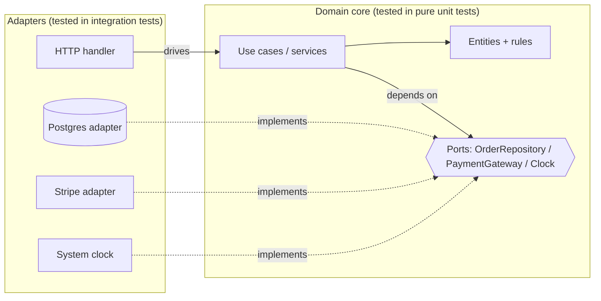

# Designing for Testability — Senior Level

> Focus: "How to architect?" — testability as a structural property of the whole system, not a per-class afterthought. Ports & adapters as testability-by-construction, a DI strategy that survives team scale, dragging legacy code under test, contract boundaries, test-data design, and enforcing all of it in review and CI.

---

## Table of Contents

1. [Testability is an architecture problem](#testability-is-an-architecture-problem)
2. [Hexagonal architecture as testability-by-construction](#hexagonal-architecture-as-testability-by-construction)
3. [DI strategy at scale: composition root vs. frameworks](#di-strategy-at-scale-composition-root-vs-frameworks)
4. [Dragging legacy code under test](#dragging-legacy-code-under-test)
5. [Contract and integration boundaries](#contract-and-integration-boundaries)
6. [Designing for test data](#designing-for-test-data)
7. [Injecting time, randomness, IDs, and flags platform-wide](#injecting-time-randomness-ids-and-flags-platform-wide)
8. [Enforcing testable structure in review and CI](#enforcing-testable-structure-in-review-and-ci)
9. [Flaky-test prevention by design](#flaky-test-prevention-by-design)
10. [Common Mistakes](#common-mistakes)
11. [Test Yourself](#test-yourself)
12. [Cheat Sheet](#cheat-sheet)
13. [Summary](#summary)
14. [Further Reading](#further-reading)
15. [Related Topics](#related-topics)

---

## Testability is an architecture problem

At the junior level, testability is "use interfaces, inject your dependencies." At team scale, that advice fails silently: every engineer applies it locally, and you still end up with a codebase where the domain logic can only be exercised by spinning up Postgres, Kafka, and a clock that ticks in real time. Testability does not emerge from a thousand local good decisions — it emerges from **one structural constraint applied globally**:

> Business logic must not import infrastructure. I/O lives at the edges; the core is pure and injectable.

If that single rule holds, fast unit tests are *free* — there is nothing to mock because the core takes its inputs as arguments and returns its outputs as values. If it does not hold, no amount of mocking discipline saves you; you are testing the framework, not your logic. Everything in this chapter is in service of making that rule true and keeping it true as the team grows.

The diagnostic is blunt: **how long does the test suite take to give a red/green signal on a domain rule change?** Milliseconds means the architecture is testable. Tens of seconds (containers booting) means infrastructure leaked into the core.

---

## Hexagonal architecture as testability-by-construction

Ports & adapters (Alistair Cockburn's *hexagonal architecture*, and the same idea in Uncle Bob's *clean architecture*) is not primarily about swapping databases. Its real payoff is testability: it makes the dependency direction point *inward*, so the domain never knows what concrete I/O exists.

- **Domain core** — pure functions and entities. No `import "database/sql"`, no `org.springframework`, no `requests`. Deterministic: same input, same output.
- **Ports** — interfaces the core *owns*, expressed in domain terms (`OrderRepository`, `PaymentGateway`, `Clock`).
- **Adapters** — implementations of those ports that talk to the outside world (Postgres adapter, Stripe adapter, system clock). Adapters depend on the core; the core never depends on adapters.



The arrows that matter are the dotted ones: adapters point *at* the ports. Reverse any of those arrows — let a use case `import` the Stripe SDK directly — and the hexagon collapses into a layered ball of mud where the core can't run without the network.

Concretely, in Go the port and core live inside the domain package, the adapter elsewhere:

```go
// domain/order.go — pure core, zero infrastructure imports
package domain

import (
    "context"
    "fmt"
    "time"
)

type Clock interface{ Now() time.Time }

type OrderRepository interface {
    Save(ctx context.Context, o Order) error
    FindByID(ctx context.Context, id OrderID) (Order, error)
}

type PaymentGateway interface {
    Charge(ctx context.Context, m Money) error
}

type PlaceOrder struct {
    repo  OrderRepository
    gw    PaymentGateway
    clock Clock
}

// Pure decision logic. Testable with fakes: no DB, no network, no real time.
func (uc PlaceOrder) Handle(ctx context.Context, cmd PlaceOrderCmd) (Order, error) {
    if cmd.Total.IsZero() {
        return Order{}, ErrEmptyOrder
    }
    o := Order{ID: cmd.ID, PlacedAt: uc.clock.Now(), Total: cmd.Total}
    if err := uc.gw.Charge(ctx, o.Total); err != nil {
        return Order{}, fmt.Errorf("charge: %w", err)
    }
    return o, uc.repo.Save(ctx, o)
}
```

The corresponding test needs nothing real:

```go
func TestPlaceOrder_ChargesAndSaves(t *testing.T) {
    repo := &fakeRepo{}                          // in-memory map
    gw := &fakeGateway{}                          // records calls
    clock := FixedClock{At: time.Unix(1000, 0)}
    uc := domain.PlaceOrder{repo: repo, gw: gw, clock: clock}

    o, err := uc.Handle(ctx, validCmd)

    require.NoError(t, err)
    require.Equal(t, time.Unix(1000, 0), o.PlacedAt) // deterministic time
    require.Len(t, gw.charges, 1)
}
```

**The humble object pattern** is the companion rule for the parts that *can't* be made pure — the HTTP handler, the Kafka consumer loop, the UI controller. Keep them dumb: parse input, call a use case, serialize output. No branching business logic. They become so thin that an integration test exercising them adds little risk, because all the decisions already live in the unit-tested core.

---

## DI strategy at scale: composition root vs. frameworks

Dependency injection is the mechanism that wires adapters into the core. At team scale the only DI question that matters is: **where does the graph get assembled, and who can see it?**

### The composition root

There must be exactly one place — the *composition root* — where concrete types are chosen and wired. In a service it's `main()` (or a `wire.go` / Spring `@Configuration`). Everywhere else, code receives its collaborators through **constructor injection** and never reaches for a global, a singleton, or `new ConcreteThing()`.

```python
# composition root: app/main.py — the ONLY file that knows concrete types
def build_app() -> App:
    pool = create_pool(settings.DATABASE_URL)
    clock = SystemClock()
    repo = PostgresOrderRepository(pool)
    gateway = StripeGateway(settings.STRIPE_KEY)
    place_order = PlaceOrder(repo=repo, gateway=gateway, clock=clock)
    return App(place_order=place_order)
```

Constructor injection beats setter/field injection for testability because it makes dependencies **mandatory and visible**: you cannot construct the object in an invalid, half-wired state, and the constructor signature is an honest list of what the unit needs. A class with eight constructor parameters is not a DI problem — it's a Single Responsibility smell shouting at you, which is exactly the feedback you want.

### Frameworks: what they buy, what they cost

| Approach | Languages | Wiring done at | Testability impact |
|---|---|---|---|
| **Manual composition root** | all | hand-written `main` | Best for tests — the graph is plain code; nothing to mock the container itself. Cost: boilerplate grows with the service. |
| **wire** (Google) | Go | **compile time** (codegen) | Excellent — generated code is just constructor calls; tests bypass it and wire fakes by hand. |
| **Guice / Dagger** | Java | runtime (Guice) / compile time (Dagger) | Dagger is wire-like (compile-time, fast, fails the build on a missing binding). Guice is reflective — runtime failures, slower, harder to reason about in tests. |
| **Spring** | Java | runtime (classpath scan + reflection) | Powerful but seductive: `@Autowired` field injection hides dependencies and tempts `@SpringBootTest` (boots the whole context) instead of a plain constructor call. Use constructor injection and avoid context-loading tests for pure logic. |
| **FastAPI `Depends`** | Python | request time | Great for adapters/endpoints; `app.dependency_overrides` swaps fakes cleanly in tests. Keep `Depends` out of the domain core — it couples logic to the web framework. |

The senior trade-off: a framework removes wiring boilerplate but adds a layer that can itself be wrong (missing binding, wrong scope, reflection magic). The decisive test is **can a unit test instantiate the class with `new`/the constructor and no container?** If yes, the framework is staying out of the way. If a unit test needs to boot Spring or start a DI container, the framework has leaked into your design and your "unit" tests are integration tests in disguise.

> **Anti-pattern to refuse in review:** `@Autowired private Foo foo;` (field injection) and constructor-injected *concrete* classes. Both make the dependency unmockable without reflection or a container. Inject interfaces through the constructor.

---

## Dragging legacy code under test

You inherit a 4,000-line `BillingService` that `new`s a database connection in its constructor and calls `System.currentTimeMillis()` in six places. You cannot rewrite it; you must change one rule inside it safely. This is Michael Feathers' *Working Effectively with Legacy Code* — where "legacy code" is defined as **code without tests**.

The dilemma: you need tests to refactor safely, but you need to refactor to make it testable. The way out is a sequence of *minimal, behavior-preserving* moves.

### 1. Characterization tests — pin current behavior

Don't assert what the code *should* do; assert what it *does*. Feed representative inputs, capture outputs, freeze them as assertions. These pass by construction and form a net. A useful trick: write an assertion you know is wrong (`assertEquals(0, result)`), run it, and let the failure message tell you the actual value — then encode that.

### 2. Find seams

A **seam** is a place where you can alter behavior without editing the code at that spot. Types:

- **Object seam** — replace a collaborator via subclass or interface (the cleanest).
- **Sprout method / sprout class** — when you must add new behavior to untestable code, write the new logic in a *new, fully tested* method or class, and call it from the old code with a one-line edit. The new code is born testable; the old mess stays untested but unchanged.
- **Wrap method / wrap class** — rename the old method, write a new one with the old name that calls the old logic plus your addition (or wrap the whole class in a decorator). Lets you intercept behavior without touching internals.

### 3. Break hidden dependencies

The constructor `new`s a `DbConnection`? Apply **Extract and Override Factory**: move the `new` into a `protected DbConnection makeConnection()` method, then subclass in the test to return a fake. The production path is unchanged; the test path overrides one method. (In languages without subclass-override, extract an interface and add a constructor parameter — *parameterize constructor*.)

```java
// Before: untestable — constructor does I/O
class BillingService {
    private final DbConnection db = new DbConnection(PROD_URL); // hidden dep
    long now() { return System.currentTimeMillis(); }           // hidden time
}

// After: seams added with minimal edits
class BillingService {
    protected DbConnection makeConnection() { return new DbConnection(PROD_URL); }
    protected long now() { return System.currentTimeMillis(); }
    private final DbConnection db = makeConnection();
}
// Test subclass overrides makeConnection() and now() — no production behavior change.
```

The senior judgment: **do the minimum to get the changed lines under test, not the whole class.** You are not refactoring the legacy beast today; you are installing a foothold so that *this change* is safe and the next person has slightly more grip than you did.

---

## Contract and integration boundaries

Hexagonal architecture tells you *what* to fake. It does not tell you *which* fakes are honest. The rule:

> **Fake what you own; verify the rest with the real thing.**

- **Owned dependencies** (your own repository port, your own clock): an in-memory fake is fine and fast. You control the contract, so a fake that obeys it is trustworthy.
- **Foreign systems** (Postgres, Kafka, Stripe, S3): a hand-written mock encodes *your belief* about their behavior, which drifts from reality. Verify against the real thing with **Testcontainers** — a throwaway Docker container of the actual dependency, booted per test class.

```python
# Integration test for the Postgres ADAPTER (not the domain core)
import pytest
from testcontainers.postgres import PostgresContainer

@pytest.fixture(scope="module")
def pg():
    with PostgresContainer("postgres:16") as c:
        yield c

def test_repository_roundtrips_an_order(pg):
    repo = PostgresOrderRepository(create_pool(pg.get_connection_url()))
    run_migrations(repo.pool)
    repo.save(an_order(id="o-1"))
    assert repo.find_by_id("o-1").id == "o-1"   # real SQL, real types, real constraints
```

This produces a clean test pyramid: thousands of pure unit tests over the core (milliseconds), a thin band of Testcontainers integration tests over each adapter (seconds), and a handful of end-to-end tests over the wired system.

For **contracts between your own services**, in-memory fakes drift just as badly. Use **consumer-driven contract testing** (Pact): the consumer publishes the requests it makes and responses it expects; the provider's CI replays them and fails if it would break the consumer. This catches integration breakage without a full end-to-end environment.

| Dependency kind | Test double | Why |
|---|---|---|
| Your own port | In-memory fake | You own the contract; fast; honest |
| Database | Testcontainers (real engine) | SQL dialects, constraints, types can't be faked accurately |
| Message broker | Testcontainers / embedded | Ordering & ack semantics matter |
| Third-party HTTP API | Recorded fixtures + contract test | Real calls are flaky/costly; record once, verify schema |
| Another team's service | Pact contract | Catches breakage without an E2E env |

---

## Designing for test data

When tests construct objects with 14-field constructors, every new required field breaks 300 tests. Test data is a design surface; treat it with the same care as production code.

- **Test Data Builders** — fluent builders with sensible defaults; each test overrides only the fields it cares about. Adding a field changes the builder's default, not 300 call sites.
- **Object Mother** — named factory methods for canonical fixtures (`anExpiredSubscription()`, `aFraudulentOrder()`). Best for a small set of well-known scenarios; combine with builders for variation.
- **Factories with randomized defaults** — generate valid-but-irrelevant values for unconstrained fields, so tests don't accidentally depend on a magic constant. (Beware: randomness in fixtures must be seeded — see flaky tests below.)

```java
// Builder: the test states only what's relevant to the behavior under test
Order order = anOrder()
        .withTotal(Money.of("EUR", 0))    // the ONLY thing this test cares about
        .build();                          // everything else: valid defaults

assertThrows(EmptyOrderException.class, () -> placeOrder.handle(order));
```

The senior signal: **a test should read as a sentence about behavior, with all irrelevant setup hidden.** If a test's arrange block is longer than its act+assert, the missing abstraction is a builder or an object mother.

---

## Injecting time, randomness, IDs, and flags platform-wide

The four classic sources of non-determinism — current time, randomness, generated IDs, and feature flags — must be **injectable as a platform decision, not per-class heroics.** If one team injects a `Clock` and another calls `time.Now()` directly, your suite is still flaky.

Make them ambient ports, provided once at the composition root:

| Non-determinism | Production adapter | Test fake |
|---|---|---|
| Time | `SystemClock` | `FixedClock(t)` / a clock you advance |
| Randomness | seeded `rand.Source` / `SecureRandom` | fixed-seed source → reproducible |
| IDs (UUID, ULID) | `RandomIDGenerator` | `SequentialIDGenerator` → `id-1, id-2, …` |
| Feature flags | LaunchDarkly/Unleash adapter | in-memory flag store set per test |

```go
type Clock interface{ Now() time.Time }
type IDGen interface{ New() string }

// Production: wired in main(). Tests: substitute deterministic versions.
type FixedClock struct{ At time.Time }
func (c FixedClock) Now() time.Time { return c.At }

type SeqID struct{ n int }
func (g *SeqID) New() string { g.n++; return fmt.Sprintf("id-%d", g.n) }
```

Enforce it: a custom lint / ArchUnit rule banning `time.Now()`, `Math.random()`, `uuid.New()`, and direct flag-SDK calls outside the adapter layer. Once the ban is in CI, determinism stops being a code-review nag and becomes a structural guarantee.

Feature flags deserve special mention: a flag read inside domain logic doubles its branches and makes every test depend on flag state. Read the flag at the edge, pass the *resolved decision* into the core as a plain boolean or strategy.

---

## Enforcing testable structure in review and CI

Testability rots the instant it isn't enforced. One leaked `import` and the next person copies the pattern. Make the rule executable.

**Architecture fitness functions** turn "the domain has no framework imports" into a failing test:

```java
// ArchUnit — runs as a normal JUnit test, fails the build on violation
@ArchTest
static final ArchRule domain_is_pure =
    noClasses().that().resideInAPackage("..domain..")
        .should().dependOnClassesThat()
        .resideInAnyPackage("..adapter..", "org.springframework..",
                            "javax.persistence..", "java.sql..");

@ArchTest
static final ArchRule no_field_injection =
    noFields().should().beAnnotatedWith(Autowired.class);
```

Equivalents per ecosystem:

- **Go** — `go-arch-lint`, or a `depguard` rule (via golangci-lint) forbidding `database/sql`, web frameworks, and `time` import inside `internal/domain/...`.
- **Python** — `import-linter` contracts: `domain` is an *independent layer* that may not import `adapters` or `fastapi`.

```toml
# .importlinter — "domain may not import infrastructure"
[importlinter:contract:domain-purity]
name = "Domain core is framework-free"
type = layers
layers =
    adapters
    application
    domain          # bottom layer: imported by all, imports none
```

**Review heuristics** (cheap to catch, expensive to leave):

- A `new ConcreteCollaborator()` inside a method body → hidden dependency; inject it.
- A `@SpringBootTest` / container-booting test for code that has no I/O → the unit isn't isolated; the design leaked.
- Business `if` inside an HTTP handler → logic trapped in a humble object that should be dumb.
- A `static` method holding a decision → unfakeable; convert to an injected collaborator.
- A test that needs `Thread.sleep` → time wasn't injected.

**CI tiering** keeps the feedback loop honest: run pure unit tests on every commit (seconds), Testcontainers integration tests on PR, full E2E nightly. If the unit tier ever needs Docker, a boundary has been crossed — fail loudly.

---

## Flaky-test prevention by design

Flakiness is overwhelmingly a *design* defect, not a test-author defect. The dominant causes, ranked, with the structural fix for each:

1. **Shared mutable global state** — singletons, static caches, a module-level connection. Test A mutates it, test B reads it; order-dependent failures appear under parallelism. **Fix:** no global mutable state. Each test constructs its own object graph (the composition root makes this cheap). If a legacy singleton blocks you, add a `reset()` seam, but treat that as debt.
2. **Real time / sleeps** — `sleep(100)` "to let the async finish" races the scheduler. **Fix:** injected clock + deterministic awaiting (poll a condition, don't sleep a guess).
3. **Unseeded randomness / IDs** — a fixture random value occasionally collides or trips a validation. **Fix:** seed everything; the fake `IDGen` is sequential.
4. **Test interdependence** — tests assume execution order or leftover DB rows. **Fix:** each test owns its data (Testcontainers per class, transactional rollback, or unique tenant IDs); never assume order.
5. **Network to real third parties** — flaky by nature. **Fix:** the contract-test / recorded-fixture boundary above.

The architectural through-line: **everything that makes a test flaky is the same thing that makes the design coupled** — global state, ambient time, hidden I/O. Eliminating flakiness and improving the design are the same activity. That is the deepest reason testability is a proxy for good architecture, not a separate concern bolted on after.

---

## Common Mistakes

- **"We use interfaces, so we're testable."** Interfaces over infrastructure that the *core still imports* buy nothing. The win is the dependency *direction*, enforced — not the mere existence of an interface.
- **`@SpringBootTest` / DI-container tests as the default.** Booting the context to test pure logic makes "unit" tests slow and brittle. Test the class with its constructor; reserve context tests for wiring.
- **Mocking what you don't own.** A hand-written `StripeMock` encodes your guess about Stripe and drifts silently. Verify foreign systems with the real thing (Testcontainers / contract tests).
- **Rewriting legacy code to test it.** You need a test *before* you refactor. Add seams (sprout/wrap, extract-and-override) with minimal edits, pin behavior with characterization tests, *then* refactor.
- **Per-class time injection.** One `Clock` here, a raw `time.Now()` there — the suite is still flaky. Injectability of time/random/IDs/flags must be a platform rule enforced in CI.
- **God constructors doing I/O.** A constructor that opens a DB connection forces every test to provide a real DB. Construction must be inert; do I/O in methods, behind ports.
- **Giant arrange blocks copied across tests.** A change to a required field breaks hundreds of tests. The missing abstraction is a builder or object mother.
- **Treating flakiness as a test bug.** Quarantining a flaky test hides a coupling defect (shared state, real time, hidden I/O). Fix the design, not the symptom.

---

## Test Yourself

1. **Why is "we have interfaces over our dependencies" insufficient for testability?**

<details><summary>Answer</summary>

Testability comes from the dependency *direction* and its enforcement, not from interfaces existing. If the domain core still `import`s the database/web framework — even behind an interface defined in the wrong place — running the core still drags infrastructure in. The structural rule is: the core defines the ports it needs (in domain terms) and never imports adapters; adapters depend inward on the core. An interface owned by the infrastructure layer that the core depends on points the dependency the wrong way and buys nothing for unit testing.
</details>

2. **A teammate tests pure pricing logic with `@SpringBootTest`. What's wrong, and what's the fix?**

<details><summary>Answer</summary>

`@SpringBootTest` boots the entire application context (reflection, classpath scan, possibly real beans), turning a millisecond unit test into a multi-second integration test and coupling it to wiring it shouldn't care about. The fix: if the pricing logic is pure, instantiate the class directly with its constructor and pass fakes/values — no container. Reserve context-loading tests for verifying the wiring itself (the composition root), not business rules. If the logic *can't* be tested without the container, that's a signal the framework leaked into the design.
</details>

3. **You must add VAT handling to an untested 3,000-line `InvoiceService` that `new`s a DB connection in its constructor. Outline a safe path.**

<details><summary>Answer</summary>

(1) Pin current behavior with characterization tests on the code paths you'll touch — assert what it *does*, discovering expected values from failing assertions. (2) Break the hidden DB dependency with a seam: extract-and-override factory (`protected makeConnection()`) or parameterize the constructor with an interface, so tests supply a fake. (3) Write the VAT logic as a *sprout class/method* — new, fully unit-tested code — and call it from `InvoiceService` with a one-line edit. The legacy mass stays unchanged and untested; the new behavior is born testable and the changed lines are now covered. Do the minimum to get *the change* under test, not the whole class.
</details>

4. **When should an integration test use a real database via Testcontainers instead of an in-memory fake?**

<details><summary>Answer</summary>

Fake what you *own*; use the real engine for what you don't. An in-memory fake of your own repository *port* is honest because you control its contract. But a database is foreign: SQL dialect quirks, constraint enforcement, type coercion, transaction/isolation behavior, and the actual queries your adapter emits cannot be faithfully reproduced by a fake — a fake passing tells you nothing about whether the real query works. So the domain core is tested with fakes (milliseconds), and each *adapter* is tested against a real, throwaway engine via Testcontainers (seconds). The fake-DB-in-unit-tests trap is testing a fiction.
</details>

5. **Spring (reflective DI), Dagger/wire (compile-time codegen), manual composition root — rank them for testability and say why.**

<details><summary>Answer</summary>

For pure-unit testability the ranking is roughly: manual composition root ≈ Dagger/wire > Spring. Manual wiring and compile-time codegen (Dagger, wire) both reduce, at test time, to plain constructor calls — a unit test instantiates the class with fakes and ignores the container entirely; missing wiring fails the *build*, not a test at runtime. Spring's reflective, runtime container tempts field injection (`@Autowired` fields are unmockable without reflection) and `@SpringBootTest` (booting the whole context for unit-level logic). Spring is perfectly usable testably — *if* you adopt constructor injection and keep the container out of unit tests — but it makes the untestable path the easy one. The decisive question for any framework: can a unit test build the object with its constructor and no container?
</details>

6. **Why is "the domain has no framework imports" worth enforcing as a CI fitness function rather than a coding guideline?**

<details><summary>Answer</summary>

Guidelines decay; one leaked `import` gets copied by the next ten PRs and the pure core silently becomes infrastructure-coupled, at which point fast unit tests are no longer possible and you only discover it when the suite has slowed to a crawl. A fitness function (ArchUnit, import-linter, depguard) makes the architectural invariant *executable*: the build goes red the moment the domain depends on `org.springframework`, `java.sql`, or an adapter package. It converts testability from a reviewer's vigilance (expensive, inconsistent) into a structural guarantee (free, uniform). The same logic applies to banning ambient `time.Now()`/`Math.random()` outside adapters.
</details>

---

## Cheat Sheet

| Concern | Senior move |
|---|---|
| **Core architecture** | Ports & adapters: pure domain core, I/O at the edges, dependency points inward. Core imports no infrastructure. |
| **Untestable boundaries** | Humble Object — keep handlers/consumers dumb; all decisions live in the unit-tested core. |
| **Wiring** | One composition root; constructor injection everywhere else; no globals/singletons/`new` of collaborators. |
| **DI framework** | Prefer compile-time (wire, Dagger) or manual. Test = "construct with the constructor, no container." |
| **Spring** | Constructor injection only; no `@Autowired` fields; avoid `@SpringBootTest` for pure logic. |
| **Legacy code** | Characterization tests → find seams → sprout/wrap + extract-and-override → minimal change to get *the change* under test. |
| **Test doubles** | Fake what you own (in-memory). Real engine (Testcontainers) for DB/broker. Pact for inter-service contracts. |
| **Test data** | Builders + object mothers; tests state only what they care about. |
| **Non-determinism** | Inject Clock / RNG / IDGen / flags platform-wide; ban raw `time.Now()`/`random()` in CI. |
| **Enforcement** | Fitness functions: ArchUnit / import-linter / depguard fail the build on a framework import in the domain. |
| **Flakiness** | No shared global state; no `sleep`; seed randomness; each test owns its data. |

---

## Summary

Testability at team scale is not a testing skill — it is an architecture skill. The whole chapter reduces to one enforced invariant: **business logic must not import infrastructure; I/O lives at the edges; the core is pure and injectable.** Ports & adapters makes that invariant structural, so fast unit tests become free and the humble object pattern keeps the untestable edges thin. A single composition root with constructor injection wires the graph; the chosen DI framework is fine only as long as a unit test can build a class without it. Legacy code is dragged under test with minimal seams — characterization tests, sprout/wrap, extract-and-override — never a rewrite. The honest test-double boundary is "fake what you own, use the real thing (Testcontainers, Pact) for what you don't." Test data gets builders and object mothers so behavior is legible; time, randomness, IDs, and flags are injected platform-wide so the suite is deterministic. And the whole structure is held in place by fitness functions in CI, because testability that isn't enforced rots in a single PR. The recurring theme: every property that makes code testable is the same property that makes it well-designed — testability is the proxy, good architecture is the goal.

---

## Further Reading

- Michael Feathers — *Working Effectively with Legacy Code* (seams, characterization tests, sprout/wrap).
- Alistair Cockburn — *Hexagonal Architecture* (ports & adapters, original article).
- Robert C. Martin — *Clean Architecture* (dependency rule, the humble object boundary).
- Steve Freeman & Nat Pryce — *Growing Object-Oriented Software, Guided by Tests* (test data builders, object mothers, ports).
- Mark Seemann & Steven van Deursen — *Dependency Injection Principles, Practices, and Patterns* (composition root, framework trade-offs).
- Neal Ford et al. — *Building Evolutionary Architectures* (architecture fitness functions).
- Pact and Testcontainers documentation — consumer-driven contracts and real-dependency integration tests.

---

## Related Topics

- [junior.md](junior.md) — the basics: injecting dependencies, avoiding hidden globals.
- [middle.md](middle.md) — pure cores, seams, and the humble object in your own code.
- [professional.md](professional.md) — designing a single component for testability end-to-end.
- [Chapter README](../README.md) — the positive rules for designing testable code.
- [Unit Tests](../08-unit-tests/README.md) — writing the tests this design makes possible.
- [Boundaries](../07-boundaries/README.md) — managing third-party seams the adapters wrap.
- [Abstraction & Information Hiding](../22-abstraction-and-information-hiding/README.md) — ports as the abstractions the core owns.
- [Design Patterns](../../design-patterns/README.md) — Factory, Strategy, Decorator behind these seams.
- [Anti-Patterns](../../anti-patterns/README.md) — God object, service locator, and the testability smells to avoid.
