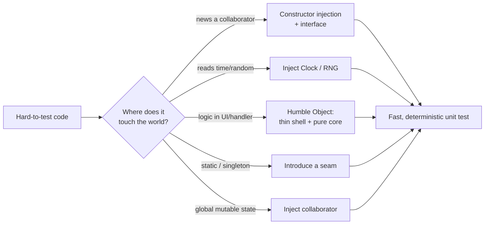

# Designing for Testability — Practice Tasks

> 12 hands-on exercises on shaping production code so tests become trivial. Each task gives a scenario, a snippet that is hard to test as written, and an instruction. Every solution shows the testable redesign, a sample test, and the reasoning. Languages vary (Go / Java / Python). Easy → hard.

---

## Table of Contents

1. [Task 1 — Inject a hidden `new`ed dependency (Go, easy)](#task-1--inject-a-hidden-newed-dependency-go-easy)
2. [Task 2 — Inject the clock (Go, easy)](#task-2--inject-the-clock-go-easy)
3. [Task 3 — Inject randomness / seed (Python, easy)](#task-3--inject-randomness--seed-python-easy)
4. [Task 4 — Extract a pure functional core (Java, medium)](#task-4--extract-a-pure-functional-core-java-medium)
5. [Task 5 — Humble Object on a fat HTTP handler (Go, medium)](#task-5--humble-object-on-a-fat-http-handler-go-medium)
6. [Task 6 — A seam to break a singleton (Java, medium)](#task-6--a-seam-to-break-a-singleton-java-medium)
7. [Task 7 — Replace global mutable state with an injected collaborator (Python, medium)](#task-7--replace-global-mutable-state-with-an-injected-collaborator-python-medium)
8. [Task 8 — Characterization test then refactor legacy code (Python, hard)](#task-8--characterization-test-then-refactor-legacy-code-python-hard)
9. [Task 9 — Replace a deep mock chain with an in-memory fake (Go, hard)](#task-9--replace-a-deep-mock-chain-with-an-in-memory-fake-go-hard)
10. [Task 10 — Tame a god constructor that does real work (Java, hard)](#task-10--tame-a-god-constructor-that-does-real-work-java-hard)
11. [Task 11 — Sprout a seam into a static utility (Java, hard)](#task-11--sprout-a-seam-into-a-static-utility-java-hard)
12. [Task 12 — Testability audit (Python, open-ended)](#task-12--testability-audit-python-open-ended)

---

## How to Use

1. Read the scenario and the **hard-to-test** snippet. Before scrolling, ask the diagnostic question: *"What would I have to stand up — a real clock, a real network, a real database, a global I'd have to reset — just to assert one outcome?"* That dependency is the thing to break.
2. Sketch the redesign yourself. Aim for a unit you can construct in one line and exercise with no I/O.
3. Expand the solution. Compare the **seam** you chose against the one shown — there is usually more than one valid cut.
4. Re-run the mental test: a good redesign makes the test deterministic, fast, and free of `sleep`, real time, network, or shared global state.

Testability is a *consequence* of decoupling, not a separate goal. If a redesign is hard to test, it is usually still coupled to something concrete. Keep cutting.



---

## Task 1 — Inject a hidden `new`ed dependency (Go, easy)

**Scenario:** `OrderService.Place` constructs its own e-mail client inside the method. A test cannot place an order without sending a real e-mail over SMTP.

**Hard-to-test code:**

```go
package order

type OrderService struct {
    repo Repository
}

func (s *OrderService) Place(o Order) error {
    if err := s.repo.Save(o); err != nil {
        return err
    }
    // Hidden dependency: constructed inside the method.
    mailer := smtp.NewClient("smtp.example.com:587", smtpCreds())
    return mailer.Send(o.CustomerEmail, "Order confirmed", renderBody(o))
}
```

**Instruction:** Make `Place` testable without SMTP. Inject the collaborator through the constructor behind an interface, and write a test using a spy.

<details><summary>Solution</summary>

Define the narrow interface the service actually needs, inject it, and stop `new`-ing inside the method.

```go
package order

// Notifier is the only capability OrderService needs from the mail world.
type Notifier interface {
    Send(to, subject, body string) error
}

type OrderService struct {
    repo     Repository
    notifier Notifier
}

func NewOrderService(repo Repository, notifier Notifier) *OrderService {
    return &OrderService{repo: repo, notifier: notifier}
}

func (s *OrderService) Place(o Order) error {
    if err := s.repo.Save(o); err != nil {
        return err
    }
    return s.notifier.Send(o.CustomerEmail, "Order confirmed", renderBody(o))
}
```

Sample test — a spy records the call instead of hitting the network:

```go
package order

import (
    "errors"
    "testing"
)

type spyNotifier struct {
    calls []struct{ to, subject, body string }
    err   error
}

func (s *spyNotifier) Send(to, subject, body string) error {
    s.calls = append(s.calls, struct{ to, subject, body string }{to, subject, body})
    return s.err
}

func TestPlace_SendsConfirmationAfterSave(t *testing.T) {
    spy := &spyNotifier{}
    svc := NewOrderService(inMemoryRepo{}, spy)

    if err := svc.Place(Order{CustomerEmail: "a@b.com"}); err != nil {
        t.Fatalf("unexpected error: %v", err)
    }
    if len(spy.calls) != 1 || spy.calls[0].to != "a@b.com" {
        t.Fatalf("expected one confirmation to a@b.com, got %+v", spy.calls)
    }
}

func TestPlace_PropagatesNotifierError(t *testing.T) {
    svc := NewOrderService(inMemoryRepo{}, &spyNotifier{err: errors.New("smtp down")})
    if err := svc.Place(Order{CustomerEmail: "a@b.com"}); err == nil {
        t.Fatal("expected error to propagate")
    }
}
```

**Reasoning:** The interface is defined at the *consumer* (Go convention), so it is exactly as wide as `OrderService` needs — one method. Construction (`NewClient`, credentials, host) moves to the composition root (`main`), where production wires the real SMTP client and tests wire the spy. The unit is now constructible in one line and runs in microseconds with no network.

</details>

---

## Task 2 — Inject the clock (Go, easy)

**Scenario:** `IsExpired` calls `time.Now()` directly. Tests can't assert the boundary (the token that expires "exactly now") without sleeping or mutating system time.

**Hard-to-test code:**

```go
package auth

import "time"

type Token struct {
    ExpiresAt time.Time
}

func (t Token) IsExpired() bool {
    return time.Now().After(t.ExpiresAt) // non-deterministic dependency on wall clock
}
```

**Instruction:** Make expiry deterministic by injecting a clock. Show the production wiring and a boundary test.

<details><summary>Solution</summary>

```go
package auth

import "time"

// Clock is a one-method seam over the wall clock.
type Clock interface {
    Now() time.Time
}

// RealClock is the production implementation.
type RealClock struct{}

func (RealClock) Now() time.Time { return time.Now() }

type Token struct {
    ExpiresAt time.Time
}

func (t Token) IsExpired(clock Clock) bool {
    return clock.Now().After(t.ExpiresAt)
}
```

Sample test with a fixed clock — boundary cases are now exact:

```go
package auth

import (
    "testing"
    "time"
)

type fixedClock struct{ t time.Time }

func (f fixedClock) Now() time.Time { return f.t }

func TestIsExpired(t *testing.T) {
    deadline := time.Date(2026, 1, 1, 12, 0, 0, 0, time.UTC)
    tok := Token{ExpiresAt: deadline}

    cases := map[string]struct {
        now  time.Time
        want bool
    }{
        "before deadline": {deadline.Add(-time.Second), false},
        "exactly at deadline": {deadline, false}, // After is strict
        "after deadline": {deadline.Add(time.Second), true},
    }
    for name, c := range cases {
        if got := tok.IsExpired(fixedClock{c.now}); got != c.want {
            t.Errorf("%s: got %v, want %v", name, got, c.want)
        }
    }
}
```

**Reasoning:** `time.Now()` is ambient input — as much a dependency as a database. Hiding it makes the result depend on *when* the test runs, which is why such tests flake near midnight or DST changes. A `Clock` interface turns time into an argument you control, so the off-by-one at the deadline becomes a one-line assertion instead of a `sleep`. In production, pass `RealClock{}` at the composition root.

</details>

---

## Task 3 — Inject randomness / seed (Python, easy)

**Scenario:** `generate_password` calls the module-global `random`. The function is impossible to assert against and, worse, uses a non-cryptographic generator silently.

**Hard-to-test code:**

```python
import random
import string

def generate_password(length: int = 12) -> str:
    alphabet = string.ascii_letters + string.digits
    return "".join(random.choice(alphabet) for _ in range(length))
```

**Instruction:** Make the output reproducible in tests by injecting the randomness source, while keeping the default secure. Write a deterministic test.

<details><summary>Solution</summary>

```python
import secrets
import string
from typing import Protocol


class RandomSource(Protocol):
    def choice(self, seq):  # mirrors random.Random.choice / SystemRandom.choice
        ...


# secrets.SystemRandom is cryptographically secure and exposes .choice
def generate_password(
    length: int = 12,
    *,
    rng: RandomSource | None = None,
) -> str:
    rng = rng or secrets.SystemRandom()
    alphabet = string.ascii_letters + string.digits
    return "".join(rng.choice(alphabet) for _ in range(length))
```

Sample test with a seeded, reproducible generator:

```python
import random
from passwords import generate_password


def test_generate_password_is_reproducible_with_seeded_rng():
    rng = random.Random(42)  # deterministic; for TEST ONLY
    first = generate_password(8, rng=rng)

    rng = random.Random(42)
    second = generate_password(8, rng=rng)

    assert first == second
    assert len(first) == 8


def test_generate_password_respects_length():
    assert len(generate_password(20, rng=random.Random(1))) == 20
```

**Reasoning:** Two wins in one change. First, the *default* moved from the predictable `random` module to `secrets.SystemRandom`, fixing a real security bug that the un-testable global was hiding. Second, the seeded `random.Random(42)` is injected only in tests, so output is reproducible — you can assert exact strings and lengths without statistical hand-waving. Note the keyword-only `rng` parameter keeps the production call site (`generate_password()`) clean and the secure path the easy path.

</details>

---

## Task 4 — Extract a pure functional core (Java, medium)

**Scenario:** `LateFeeJob` interleaves database reads, business arithmetic, and database writes in one method. To test the fee rules you currently need a live database and a fixed clock.

**Hard-to-test code:**

```java
class LateFeeJob {
    private final LoanRepository repo;

    void run(LocalDate today) {
        for (Loan loan : repo.findOverdue(today)) {
            long daysLate = ChronoUnit.DAYS.between(loan.dueDate(), today);
            BigDecimal fee = loan.principal()
                .multiply(new BigDecimal("0.001"))
                .multiply(BigDecimal.valueOf(daysLate));
            if (fee.compareTo(loan.principal().multiply(new BigDecimal("0.25"))) > 0) {
                fee = loan.principal().multiply(new BigDecimal("0.25")); // cap at 25%
            }
            repo.applyFee(loan.id(), fee);
        }
    }
}
```

**Instruction:** Split the *decision* (a pure function of inputs) from the *effects* (read/write). Test the rules with no database.

<details><summary>Solution</summary>

Push all arithmetic into a pure, static function; leave the I/O in a thin shell that calls it.

```java
// Functional core: no I/O, no clock, no mutation. Trivially testable.
final class LateFeePolicy {
    private static final BigDecimal DAILY_RATE = new BigDecimal("0.001");
    private static final BigDecimal CAP_RATE   = new BigDecimal("0.25");

    static BigDecimal feeFor(Loan loan, LocalDate today) {
        long daysLate = Math.max(0, ChronoUnit.DAYS.between(loan.dueDate(), today));
        BigDecimal raw = loan.principal().multiply(DAILY_RATE)
                                         .multiply(BigDecimal.valueOf(daysLate));
        BigDecimal cap = loan.principal().multiply(CAP_RATE);
        return raw.min(cap);
    }
}

// Imperative shell: orchestrates effects, delegates every decision to the core.
class LateFeeJob {
    private final LoanRepository repo;
    LateFeeJob(LoanRepository repo) { this.repo = repo; }

    void run(LocalDate today) {
        for (Loan loan : repo.findOverdue(today)) {
            repo.applyFee(loan.id(), LateFeePolicy.feeFor(loan, today));
        }
    }
}
```

Sample test — exercises every rule with plain values:

```java
class LateFeePolicyTest {
    private final LocalDate due = LocalDate.of(2026, 1, 1);
    private Loan loan(String principal) {
        return new Loan("L1", new BigDecimal(principal), due);
    }

    @Test void accruesDailyRate() {
        BigDecimal fee = LateFeePolicy.feeFor(loan("1000"), due.plusDays(10));
        assertEquals(new BigDecimal("10.000"), fee); // 1000 * 0.001 * 10
    }

    @Test void capsAtTwentyFivePercent() {
        BigDecimal fee = LateFeePolicy.feeFor(loan("1000"), due.plusDays(10_000));
        assertEquals(new BigDecimal("250.00"), fee);
    }

    @Test void noFeeWhenNotLate() {
        assertEquals(BigDecimal.ZERO, LateFeePolicy.feeFor(loan("1000"), due));
    }
}
```

**Reasoning:** The "functional core, imperative shell" split concentrates all the interesting logic — rates, the cap, the `max(0, ...)` guard against early runs — into a function whose inputs and outputs are values. That function is the part most likely to have bugs and is now testable without any test double at all. The shell that remains is so thin (loop, read, write) that an integration test covers it trivially; there is no branching logic left to hide a bug.

</details>

---

## Task 5 — Humble Object on a fat HTTP handler (Go, medium)

**Scenario:** A signup handler parses the request, validates, hashes the password, writes to the DB, and writes the response — all inline. Testing any rule requires spinning an `httptest` server and a database.

**Hard-to-test code:**

```go
func SignupHandler(w http.ResponseWriter, r *http.Request) {
    var req struct{ Email, Password string }
    json.NewDecoder(r.Body).Decode(&req)

    if !strings.Contains(req.Email, "@") {
        http.Error(w, "bad email", http.StatusBadRequest)
        return
    }
    if len(req.Password) < 8 {
        http.Error(w, "weak password", http.StatusBadRequest)
        return
    }
    hash, _ := bcrypt.GenerateFromPassword([]byte(req.Password), bcrypt.DefaultCost)
    _, err := db.Exec("INSERT INTO users(email, hash) VALUES($1,$2)", req.Email, hash)
    if err != nil {
        http.Error(w, "conflict", http.StatusConflict)
        return
    }
    w.WriteHeader(http.StatusCreated)
}
```

**Instruction:** Apply the Humble Object pattern — make the handler a thin, dumb adapter and move all decisions into a plain service that knows nothing about HTTP.

<details><summary>Solution</summary>

```go
// --- Core service: no HTTP, no global db. ---

type UserStore interface {
    Create(ctx context.Context, email, passwordHash string) error
}

var (
    ErrInvalidEmail = errors.New("invalid email")
    ErrWeakPassword = errors.New("weak password")
    ErrEmailTaken   = errors.New("email taken")
)

type SignupService struct {
    users UserStore
    hash  func(pw string) (string, error)
}

func NewSignupService(users UserStore, hash func(string) (string, error)) *SignupService {
    return &SignupService{users: users, hash: hash}
}

func (s *SignupService) Signup(ctx context.Context, email, password string) error {
    if !strings.Contains(email, "@") {
        return ErrInvalidEmail
    }
    if len(password) < 8 {
        return ErrWeakPassword
    }
    h, err := s.hash(password)
    if err != nil {
        return err
    }
    return s.users.Create(ctx, email, h)
}

// --- Humble Object: the handler only translates HTTP <-> service. ---

func SignupHandler(svc *SignupService) http.HandlerFunc {
    return func(w http.ResponseWriter, r *http.Request) {
        var req struct{ Email, Password string }
        if err := json.NewDecoder(r.Body).Decode(&req); err != nil {
            http.Error(w, "bad request", http.StatusBadRequest)
            return
        }
        switch err := svc.Signup(r.Context(), req.Email, req.Password); {
        case err == nil:
            w.WriteHeader(http.StatusCreated)
        case errors.Is(err, ErrInvalidEmail), errors.Is(err, ErrWeakPassword):
            http.Error(w, err.Error(), http.StatusBadRequest)
        case errors.Is(err, ErrEmailTaken):
            http.Error(w, err.Error(), http.StatusConflict)
        default:
            http.Error(w, "internal error", http.StatusInternalServerError)
        }
    }
}
```

Sample test — all rules covered without HTTP or a database:

```go
type fakeStore struct {
    seen   map[string]string
    failOn string
}

func (f *fakeStore) Create(_ context.Context, email, hash string) error {
    if email == f.failOn {
        return ErrEmailTaken
    }
    f.seen[email] = hash
    return nil
}

func noopHash(pw string) (string, error) { return "hash:" + pw, nil }

func TestSignup(t *testing.T) {
    svc := NewSignupService(&fakeStore{seen: map[string]string{}}, noopHash)

    if err := svc.Signup(context.Background(), "no-at-sign", "longenough"); !errors.Is(err, ErrInvalidEmail) {
        t.Errorf("want ErrInvalidEmail, got %v", err)
    }
    if err := svc.Signup(context.Background(), "a@b.com", "short"); !errors.Is(err, ErrWeakPassword) {
        t.Errorf("want ErrWeakPassword, got %v", err)
    }
    if err := svc.Signup(context.Background(), "a@b.com", "longenough"); err != nil {
        t.Errorf("want success, got %v", err)
    }
}
```

**Reasoning:** The Humble Object pattern says: when a component is hard to test because it is welded to a framework (HTTP, a UI toolkit, a message bus), make that component as *dumb* as possible and move everything worth testing into a collaborator that the framework knows nothing about. The handler now contains only mechanical translation — JSON in, status code out — which the type system mostly guarantees correct. Every branch worth testing lives in `SignupService`, exercised with a fake store and a no-op hash. Two tiny end-to-end tests can still cover the wiring.

</details>

---

## Task 6 — A seam to break a singleton (Java, medium)

**Scenario:** `PricingEngine` reads feature flags through a global singleton, `FeatureFlags.getInstance()`. Tests interfere with each other because they all mutate one shared instance.

**Hard-to-test code:**

```java
class PricingEngine {
    BigDecimal price(Product p) {
        BigDecimal base = p.basePrice();
        if (FeatureFlags.getInstance().isEnabled("summer_sale")) {
            base = base.multiply(new BigDecimal("0.8"));
        }
        return base;
    }
}
```

**Instruction:** Introduce a seam (Michael Feathers' term: a place where you can alter behavior without editing in place) so a test can supply flags without touching the singleton. Use constructor injection against an interface.

<details><summary>Solution</summary>

```java
// The seam: an interface the engine depends on instead of the concrete singleton.
interface FeatureFlagSource {
    boolean isEnabled(String flag);
}

// Production adapter wraps the existing singleton — no caller of FeatureFlags changes.
class SingletonFeatureFlags implements FeatureFlagSource {
    @Override public boolean isEnabled(String flag) {
        return FeatureFlags.getInstance().isEnabled(flag);
    }
}

class PricingEngine {
    private final FeatureFlagSource flags;

    PricingEngine(FeatureFlagSource flags) { this.flags = flags; }

    BigDecimal price(Product p) {
        BigDecimal base = p.basePrice();
        if (flags.isEnabled("summer_sale")) {
            base = base.multiply(new BigDecimal("0.8"));
        }
        return base;
    }
}
```

Sample test — flags become a per-test value, so no cross-test leakage:

```java
class PricingEngineTest {
    // A trivial fake; no singleton, no static mutation.
    static FeatureFlagSource flags(String... enabled) {
        var on = Set.of(enabled);
        return on::contains;
    }

    @Test void appliesSummerSaleWhenFlagOn() {
        var engine = new PricingEngine(flags("summer_sale"));
        assertEquals(new BigDecimal("80.0"), engine.price(new Product(new BigDecimal("100"))));
    }

    @Test void fullPriceWhenFlagOff() {
        var engine = new PricingEngine(flags()); // nothing enabled
        assertEquals(new BigDecimal("100"), engine.price(new Product(new BigDecimal("100"))));
    }
}
```

**Reasoning:** A singleton is a global with a fancy name; `getInstance()` is a hard-coded dependency that tests cannot vary and that leaks state across cases. The *seam* is the `FeatureFlagSource` interface: production wires `SingletonFeatureFlags` (so legacy call sites and the singleton itself stay untouched), while tests wire a one-line lambda fake. Each test now owns its own flag set, eliminating order-dependence between tests — the classic symptom of shared mutable singletons.

</details>

---

## Task 7 — Replace global mutable state with an injected collaborator (Python, medium)

**Scenario:** A rate limiter keeps its counters in a module-level dict. Tests must remember to clear that global between cases or they pollute each other; parallel tests are impossible.

**Hard-to-test code:**

```python
import time

_HITS: dict[str, list[float]] = {}  # module-global mutable state

def allow(user_id: str, limit: int = 5, window: float = 60.0) -> bool:
    now = time.time()
    hits = _HITS.setdefault(user_id, [])
    hits[:] = [t for t in hits if now - t < window]
    if len(hits) >= limit:
        return False
    hits.append(now)
    return True
```

**Instruction:** Turn the rate limiter into an object that owns its own state and takes a clock. No globals; deterministic time.

<details><summary>Solution</summary>

```python
from collections import defaultdict
from typing import Callable


class RateLimiter:
    def __init__(self, limit: int = 5, window: float = 60.0,
                 now: Callable[[], float] | None = None) -> None:
        self._limit = limit
        self._window = window
        self._now = now or __import__("time").time
        self._hits: dict[str, list[float]] = defaultdict(list)

    def allow(self, user_id: str) -> bool:
        now = self._now()
        hits = self._hits[user_id]
        hits[:] = [t for t in hits if now - t < self._window]
        if len(hits) >= self._limit:
            return False
        hits.append(now)
        return True
```

Sample test — controllable clock, isolated state per instance:

```python
from ratelimit import RateLimiter


class FakeClock:
    def __init__(self, t: float = 0.0) -> None:
        self.t = t

    def __call__(self) -> float:  # usable as the `now` callable
        return self.t


def test_blocks_after_limit_then_recovers_after_window():
    clock = FakeClock(t=1000.0)
    rl = RateLimiter(limit=2, window=10.0, now=clock)

    assert rl.allow("u1") is True
    assert rl.allow("u1") is True
    assert rl.allow("u1") is False           # third hit blocked

    clock.t += 11.0                          # window elapses
    assert rl.allow("u1") is True            # counter has aged out


def test_users_are_independent():
    rl = RateLimiter(limit=1, window=10.0, now=FakeClock(0.0))
    assert rl.allow("a") is True
    assert rl.allow("b") is True             # b unaffected by a
```

**Reasoning:** Module-level mutable state is the worst enemy of fast, parallel tests: every case shares one dict, so order matters and `pytest-xdist` would corrupt results. Wrapping the counters in an instance gives each test its own clean state for free — no `setup`/`teardown` to remember. Injecting `now` removes the second source of nondeterminism, so the window-expiry behavior is asserted by advancing a fake clock instead of `sleep(11)`, turning an 11-second test into a microsecond one.

</details>

---

## Task 8 — Characterization test then refactor legacy code (Python, hard)

**Scenario:** You inherit an undocumented shipping-cost function. It has no tests, you do not fully understand it, and you must refactor it to add a new tier — without changing existing behavior.

**Hard-to-test code:**

```python
def ship_cost(weight, dist, express, intl):
    c = 0
    if weight <= 1:
        c = 5
    elif weight <= 5:
        c = 5 + (weight - 1) * 2
    else:
        c = 13 + (weight - 5) * 1.5
    c = c + dist * 0.01
    if express:
        c = c * 1.5
    if intl:
        c = c + 20
        if express:
            c = c + 10
    return round(c, 2)
```

**Instruction:** Step 1 — pin current behavior with **characterization tests** (golden tests that simply record what the function does today, right or wrong). Step 2 — refactor for clarity. Step 3 — show the new tier added safely.

<details><summary>Solution</summary>

**Step 1 — pin the existing behavior.** Don't judge correctness yet; just capture it. A quick way to seed golden values is to run the function over representative inputs and paste the outputs in as expectations.

```python
import pytest
from shipping import ship_cost


# Each row was produced by running the CURRENT function and recording its output.
# These lock in today's behavior so refactoring cannot change it silently.
@pytest.mark.parametrize("weight,dist,express,intl,expected", [
    (0.5, 0,    False, False, 5.0),
    (1.0, 100,  False, False, 6.0),
    (3.0, 100,  False, False, 10.0),    # 5 + 2*2 + 1.0
    (10.0, 0,   False, False, 20.5),    # 13 + 5*1.5
    (3.0, 100,  True,  False, 15.0),    # 10.0 * 1.5
    (3.0, 100,  False, True,  30.0),    # 10.0 + 20
    (3.0, 100,  True,  True,  55.0),    # 10*1.5=15, +20 intl, +10 express-intl
])
def test_characterization(weight, dist, express, intl, expected):
    assert ship_cost(weight, dist, express, intl) == expected
```

**Step 2 — refactor under the green tests.** Now that behavior is pinned, restructure freely; the suite is the safety net.

```python
from dataclasses import dataclass

EXPRESS_MULTIPLIER = 1.5
INTL_SURCHARGE = 20.0
INTL_EXPRESS_SURCHARGE = 10.0
DISTANCE_RATE = 0.01


@dataclass(frozen=True)
class ShipmentRequest:
    weight: float
    distance: float
    express: bool = False
    international: bool = False


def _weight_cost(weight: float) -> float:
    if weight <= 1:
        return 5.0
    if weight <= 5:
        return 5.0 + (weight - 1) * 2.0
    return 13.0 + (weight - 5) * 1.5


def ship_cost_v2(req: ShipmentRequest) -> float:
    cost = _weight_cost(req.weight) + req.distance * DISTANCE_RATE
    if req.express:
        cost *= EXPRESS_MULTIPLIER
    if req.international:
        cost += INTL_SURCHARGE
        if req.express:
            cost += INTL_EXPRESS_SURCHARGE
    return round(cost, 2)
```

Adapt the characterization tests to the new signature and confirm identical outputs — every golden value must still pass.

**Step 3 — add the new tier safely.** With behavior pinned and the function now readable, the change is local and obvious.

```python
OVERSIZE_THRESHOLD = 20.0
OVERSIZE_SURCHARGE = 35.0


def ship_cost_v3(req: ShipmentRequest) -> float:
    cost = ship_cost_v2(req)
    if req.weight > OVERSIZE_THRESHOLD:
        cost = round(cost + OVERSIZE_SURCHARGE, 2)
    return cost
```

```python
def test_oversize_tier_adds_surcharge():
    light = ShipmentRequest(weight=10, distance=0)
    heavy = ShipmentRequest(weight=25, distance=0)
    assert ship_cost_v3(heavy) == ship_cost_v3(light) + 35.0

def test_oversize_does_not_disturb_existing_tiers():
    # All original golden values still hold through v3 for non-oversize inputs.
    assert ship_cost_v3(ShipmentRequest(3.0, 100, True, True)) == 55.0
```

**Reasoning:** Characterization tests answer "what does this code do?" rather than "what should it do?" — they are the correct first move on legacy code you don't understand, because they let you refactor with confidence that behavior is unchanged. The named constants, the extracted `_weight_cost`, and the `ShipmentRequest` parameter object turn an opaque arithmetic blob into something a reviewer can read, and the new oversize tier is then a three-line, fully isolated change with its own test.

</details>

---

## Task 9 — Replace a deep mock chain with an in-memory fake (Go, hard)

**Scenario:** A report test mocks a chain: `client.Account(id).Transactions().Filter(...).All()`. The test is mostly mock setup, brittle, and asserts call structure rather than behavior.

**Hard-to-test code (the test that hurts):**

```go
// Production type with a fluent, chained API.
type BankClient interface {
    Account(id string) AccountAPI
}
type AccountAPI interface {
    Transactions() TxQuery
}
type TxQuery interface {
    Filter(min Money) TxQuery
    All() ([]Transaction, error)
}

// The painful test: nested mocks mirroring the call graph.
func TestMonthlyTotal_withMocks(t *testing.T) {
    txq := new(MockTxQuery)
    txq.On("Filter", mock.Anything).Return(txq)
    txq.On("All").Return([]Transaction{{Amount: 100}, {Amount: 50}}, nil)

    acc := new(MockAccountAPI)
    acc.On("Transactions").Return(txq)

    client := new(MockBankClient)
    client.On("Account", "A1").Return(acc)

    total, _ := MonthlyTotal(client, "A1")
    assert.Equal(t, Money(150), total)
}
```

**Instruction:** Replace the mock chain with a single in-memory fake that behaves like a real client over canned data. The test should assert the *outcome*, not the call sequence.

<details><summary>Solution</summary>

Give the fluent interface one honest in-memory implementation that you reuse across all tests.

```go
// One fake that implements the whole chain over a slice of transactions.
type fakeBank struct {
    byAccount map[string][]Transaction
}

func (b *fakeBank) Account(id string) AccountAPI {
    return &fakeAccount{txs: b.byAccount[id]}
}

type fakeAccount struct{ txs []Transaction }

func (a *fakeAccount) Transactions() TxQuery {
    return &fakeQuery{txs: a.txs}
}

type fakeQuery struct {
    txs []Transaction
    min Money
}

func (q *fakeQuery) Filter(min Money) TxQuery {
    return &fakeQuery{txs: q.txs, min: min} // real filtering semantics, lazily applied
}

func (q *fakeQuery) All() ([]Transaction, error) {
    out := make([]Transaction, 0, len(q.txs))
    for _, t := range q.txs {
        if t.Amount >= q.min {
            out = append(out, t)
        }
    }
    return out, nil
}
```

Sample test — reads like the scenario, asserts behavior:

```go
func TestMonthlyTotal_withFake(t *testing.T) {
    bank := &fakeBank{byAccount: map[string][]Transaction{
        "A1": {{Amount: 100}, {Amount: 50}, {Amount: 5}},
    }}

    total, err := MonthlyTotal(bank, "A1") // assume MonthlyTotal filters Amount >= 10
    if err != nil {
        t.Fatal(err)
    }
    if total != Money(150) {
        t.Fatalf("want 150, got %d", total)
    }
}

func TestMonthlyTotal_emptyAccount(t *testing.T) {
    bank := &fakeBank{byAccount: map[string][]Transaction{"A1": nil}}
    total, _ := MonthlyTotal(bank, "A1")
    if total != Money(0) {
        t.Fatalf("want 0, got %d", total)
    }
}
```

**Reasoning:** A deep mock chain couples the test to the *shape* of the call graph: it asserts that `Transactions().Filter().All()` is invoked in that order, so the test breaks the moment you refactor the production call sequence — even when the result is unchanged. That is testing implementation, not behavior. The in-memory fake implements the same interfaces *with real semantics* (the filter actually filters), so one fake serves every scenario, edge cases like an empty account become a one-line setup, and the assertions are about totals — the thing the user cares about. Fakes scale; nested mocks don't.

</details>

---

## Task 10 — Tame a god constructor that does real work (Java, hard)

**Scenario:** `ReportGenerator`'s constructor opens a database connection, reads a config file, and warms a cache. You cannot instantiate it in a unit test without all three side effects firing.

**Hard-to-test code:**

```java
class ReportGenerator {
    private final Connection conn;
    private final Config config;
    private final Map<String, Template> templateCache;

    ReportGenerator() {
        this.conn = DriverManager.getConnection(System.getenv("DB_URL")); // network on construct
        this.config = Config.loadFrom(new File("/etc/report.yml"));        // disk on construct
        this.templateCache = warmTemplateCache(conn);                      // more network on construct
    }

    String generate(String reportId) { /* uses conn, config, templateCache */ }
}
```

**Instruction:** Make `ReportGenerator` constructible in a test with no I/O. Move side-effecting work out of the constructor and inject the collaborators.

<details><summary>Solution</summary>

Constructors should only assign fields. Push the I/O to the composition root and inject finished collaborators.

```java
// Narrow interfaces for what generate() actually needs.
interface TemplateProvider {
    Template forReport(String reportId);
}
interface ReportData {
    Rows query(String reportId);
}

class ReportGenerator {
    private final ReportData data;
    private final TemplateProvider templates;
    private final Config config;

    // Pure constructor: no network, no disk, no work. Trivially testable.
    ReportGenerator(ReportData data, TemplateProvider templates, Config config) {
        this.data = data;
        this.templates = templates;
        this.config = config;
    }

    String generate(String reportId) {
        Template tmpl = templates.forReport(reportId);
        Rows rows = data.query(reportId);
        return tmpl.render(rows, config);
    }
}

// Composition root (production) — the side effects live here, run once at startup.
class ReportGeneratorFactory {
    static ReportGenerator create() throws Exception {
        Connection conn = DriverManager.getConnection(System.getenv("DB_URL"));
        Config config = Config.loadFrom(new File("/etc/report.yml"));
        var templates = new CachingTemplateProvider(conn); // warms its own cache
        var data = new SqlReportData(conn);
        return new ReportGenerator(data, templates, config);
    }
}
```

Sample test — no DB, no file, no cache warming:

```java
class ReportGeneratorTest {
    @Test void rendersUsingInjectedCollaborators() {
        ReportData data = id -> new Rows(List.of("row-1", "row-2"));
        TemplateProvider templates = id -> (rows, cfg) -> "rendered:" + rows.size();
        Config config = Config.defaults();

        var gen = new ReportGenerator(data, templates, config);

        assertEquals("rendered:2", gen.generate("R1"));
    }
}
```

**Reasoning:** "Do no real work in constructors" (Misko Hevery's rule) exists precisely for testability: if `new ReportGenerator()` opens a socket, then *every* test that touches the class needs a database, and construction failures are tangled with logic failures. By demoting the constructor to field assignment and lifting the I/O into a factory at the composition root, the unit test constructs the object from three lambdas and asserts rendering logic in isolation. The expensive setup still happens exactly once in production — it has simply moved to where it belongs.

</details>

---

## Task 11 — Sprout a seam into a static utility (Java, hard)

**Scenario:** `InvoiceMailer` calls a static utility `AuditLog.record(...)` that writes to a global append-only file. You can't verify auditing happened, and the file write makes tests slow and order-dependent.

**Hard-to-test code:**

```java
class InvoiceMailer {
    void send(Invoice inv) {
        deliver(inv);
        AuditLog.record("invoice_sent", inv.id()); // static call to a file-writing utility
    }
}
```

**Instruction:** Introduce a seam over the static utility so you can verify the audit call in a test, while leaving the global `AuditLog` working in production for other callers.

<details><summary>Solution</summary>

Wrap the static behind an injectable interface; default the production path to the existing static so the change is non-breaking.

```java
// The seam.
interface AuditSink {
    void record(String event, String entityId);
}

// Production adapter delegates to the existing static utility — AuditLog itself is untouched.
class StaticAuditSink implements AuditSink {
    @Override public void record(String event, String entityId) {
        AuditLog.record(event, entityId);
    }
}

class InvoiceMailer {
    private final AuditSink audit;

    // Default constructor preserves old call sites; injecting constructor enables tests.
    InvoiceMailer() { this(new StaticAuditSink()); }
    InvoiceMailer(AuditSink audit) { this.audit = audit; }

    void send(Invoice inv) {
        deliver(inv);
        audit.record("invoice_sent", inv.id());
    }
}
```

Sample test — a spy verifies the audit without any file:

```java
class InvoiceMailerTest {
    static final class SpyAuditSink implements AuditSink {
        record Entry(String event, String id) {}
        final List<Entry> entries = new ArrayList<>();
        @Override public void record(String event, String id) {
            entries.add(new Entry(event, id));
        }
    }

    @Test void recordsAuditEntryAfterSending() {
        var spy = new SpyAuditSink();
        var mailer = new InvoiceMailer(spy);

        mailer.send(new Invoice("INV-9"));

        assertEquals(1, spy.entries.size());
        assertEquals(new SpyAuditSink.Entry("invoice_sent", "INV-9"), spy.entries.get(0));
    }
}
```

**Reasoning:** A static call is a hard-wired dependency with no seam: there is no way to substitute it without bytecode tricks or a heavyweight static-mocking library, both of which leave tests fragile. Feathers' "Sprout" technique adds a seam (`AuditSink`) and an adapter (`StaticAuditSink`) without disturbing the existing global utility — other callers keep using `AuditLog.record` directly. The default constructor keeps backward compatibility, while the injecting constructor lets the test pass a spy and assert that auditing happened with the right event and id. No file is written, so tests stay fast and order-independent.

</details>

---

## Task 12 — Testability audit (Python, open-ended)

**Scenario:** Below is a realistic service method. Identify **every** testability obstacle and write a one-line remedy for each, then sketch the target shape.

**Hard-to-test code:**

```python
import datetime
import random
import requests

PROCESSED = set()  # module-global

class CheckoutService:
    def __init__(self):
        self.db = Database.connect(os.environ["DB_URL"])   # work in constructor
        self.gateway = StripeGateway(os.environ["STRIPE_KEY"])

    def checkout(self, cart):
        if cart.id in PROCESSED:                            # global mutable state
            return "duplicate"
        order_id = f"ORD-{random.randint(1000, 9999)}"      # un-injected randomness
        now = datetime.datetime.now()                       # un-injected clock
        rate = requests.get("https://fx.example.com/usd").json()["rate"]  # network in logic
        total = cart.subtotal * rate
        if total > 10000:
            total = total * 0.95                            # decision logic buried in I/O
        self.gateway.charge(order_id, total)
        self.db.save(order_id, total, now)
        PROCESSED.add(cart.id)
        return order_id
```

**Instruction:** Produce an audit table (obstacle → why it hurts → remedy), then outline the redesigned, testable shape.

<details><summary>Solution</summary>

| # | Obstacle | Why it blocks testing | Remedy |
|---|----------|-----------------------|--------|
| 1 | Work in `__init__` (`Database.connect`, `StripeGateway(...)`) | Can't construct the service without a DB and Stripe key | Inject `db` and `gateway` as constructor parameters; build them at the composition root. |
| 2 | Global mutable `PROCESSED` set | State leaks across tests; parallel runs corrupt each other | Replace with an injected idempotency store (interface) the service owns per instance. |
| 3 | `random.randint` for `order_id` | Output is non-deterministic; can't assert the id | Inject an ID generator (`Callable[[], str]`); seed/stub it in tests. |
| 4 | `datetime.datetime.now()` | Result depends on wall clock; flaky | Inject a `clock: Callable[[], datetime]`; pass a fixed time in tests. |
| 5 | `requests.get(...)` inside logic | Real network call; slow, flaky, needs internet | Inject an `FxRates` port; provide an in-memory fake in tests. |
| 6 | Pricing rule (`> 10000 → *0.95`) buried among effects | Can't test the rule without DB, gateway, network | Extract a pure function `apply_discount(total)` (functional core). |
| 7 | `gateway.charge` / `db.save` concrete calls | Side effects fire during tests | Already injected (1); use spies/fakes to verify and isolate. |

**Target shape:**

```python
from dataclasses import dataclass
from datetime import datetime
from typing import Callable, Protocol


# --- Ports (seams) ---
class Gateway(Protocol):
    def charge(self, order_id: str, amount: float) -> None: ...

class OrderStore(Protocol):
    def save(self, order_id: str, amount: float, at: datetime) -> None: ...

class IdempotencyStore(Protocol):
    def seen(self, key: str) -> bool: ...
    def mark(self, key: str) -> None: ...

class FxRates(Protocol):
    def usd_rate(self) -> float: ...


# --- Functional core: pure, instantly testable ---
DISCOUNT_THRESHOLD = 10_000
def apply_discount(total: float) -> float:
    return total * 0.95 if total > DISCOUNT_THRESHOLD else total


# --- Imperative shell: all collaborators injected ---
@dataclass
class CheckoutService:
    db: OrderStore
    gateway: Gateway
    fx: FxRates
    processed: IdempotencyStore
    now: Callable[[], datetime]
    new_order_id: Callable[[], str]

    def checkout(self, cart) -> str:
        if self.processed.seen(cart.id):
            return "duplicate"
        order_id = self.new_order_id()
        total = apply_discount(cart.subtotal * self.fx.usd_rate())
        self.gateway.charge(order_id, total)
        self.db.save(order_id, total, self.now())
        self.processed.mark(cart.id)
        return order_id
```

A representative test now needs no I/O, no clock, no network, no globals:

```python
from datetime import datetime

class FakeFx:    usd_rate = staticmethod(lambda: 1.0)
class SpyGateway:
    def __init__(self): self.charges = []
    def charge(self, oid, amt): self.charges.append((oid, amt))
class MemStore:
    def __init__(self): self.rows = []
    def save(self, oid, amt, at): self.rows.append((oid, amt, at))
class MemIdem:
    def __init__(self): self._s = set()
    def seen(self, k): return k in self._s
    def mark(self, k): self._s.add(k)

def test_checkout_applies_discount_and_charges_once():
    gw = SpyGateway()
    svc = CheckoutService(
        db=MemStore(), gateway=gw, fx=FakeFx(), processed=MemIdem(),
        now=lambda: datetime(2026, 1, 1), new_order_id=lambda: "ORD-1",
    )
    cart = type("Cart", (), {"id": "C1", "subtotal": 20_000})()

    assert svc.checkout(cart) == "ORD-1"
    assert gw.charges == [("ORD-1", 19_000.0)]   # 20000 * 0.95
    assert svc.checkout(cart) == "duplicate"     # idempotency works
```

**Reasoning:** The original method fails on five distinct axes of non-testability at once — constructor work, global state, randomness, clock, and network — with the one piece worth testing (the discount rule) buried in the middle. The audit names each obstacle and its mechanical remedy. The redesign applies the same handful of moves used throughout this chapter: inject collaborators behind ports, replace globals with owned state, parameterize ambient inputs (time, randomness), and lift the decision into a pure function. The result is a service whose every behavior is asserted with plain fakes and lambdas in microseconds.

</details>

---

## Self-Assessment

Rate yourself 1–5 on each. Below 4 means revisit the linked task.

- [ ] I can spot a hidden dependency (`new`, `getInstance()`, a static call) and turn it into an injected interface. (Tasks 1, 6, 11)
- [ ] I never read `time.Now()` / `datetime.now()` or random directly in logic I want to test — I inject a clock and an RNG. (Tasks 2, 3)
- [ ] I can split a method into a pure functional core and a thin imperative shell. (Tasks 4, 12)
- [ ] I apply the Humble Object pattern to drain logic out of framework boundaries (handlers, UI, callbacks). (Task 5)
- [ ] I can introduce a seam (Feathers) to substitute behavior without editing legacy code in place. (Tasks 6, 11)
- [ ] I replace global mutable state with collaborators each unit owns. (Tasks 7, 12)
- [ ] I can pin unknown legacy behavior with characterization tests *before* refactoring. (Task 8)
- [ ] I prefer an in-memory fake to a deep mock chain, asserting outcomes over call structure. (Task 9)
- [ ] I keep constructors free of real work so objects are cheap to instantiate in tests. (Task 10)
- [ ] Given an arbitrary method, I can audit every testability obstacle and name its remedy. (Task 12)

---

## Related Topics

- [README.md](README.md) — the rules behind these exercises (dependency injection, seams, functional core, Humble Object)
- [junior.md](junior.md) — foundational testability concepts
- [find-bug.md](find-bug.md) — spot the testability defect in each snippet
- [optimize.md](optimize.md) — improve poorly factored, hard-to-test code
- [Clean Code chapters index](../README.md) — including unit testing and the broader testing material
- [Refactoring](../../refactoring/README.md) — the mechanical moves (Extract Method, Introduce Parameter, Replace Constructor with Factory) these redesigns rely on
- [Design Patterns](../../design-patterns/README.md) — Strategy, Adapter, and Factory underpin the seams and humble objects used here
