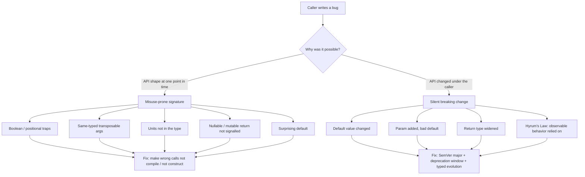

# API & Library Design — Find the Bug

> 12 snippets where the bug lives in the **caller**, but the **API made it inevitable**. The signature, the default, the return type, or a "non-breaking" version bump steered an honest caller straight into the defect. Your job: find the caller's bug, then name the API change that makes that mistake impossible to write.

The discipline here is the provider's mirror image of debugging. A misuse-resistant API is one where the wrong call doesn't compile, doesn't construct, or doesn't type-check. Scott Meyers' rule — *"make interfaces easy to use correctly and hard to use incorrectly"* — is an operational test: if a competent caller reading only the signature can write a bug, the bug is the API's fault, not the caller's.

---

## Table of Contents

- [How to Use](#how-to-use)
- [The Two Failure Modes](#the-two-failure-modes)
- [Snippet 1 — Boolean trap, transposed (Java)](#snippet-1--boolean-trap-transposed-java)
- [Snippet 2 — Two same-typed params, swappable (Go)](#snippet-2--two-same-typed-params-swappable-go)
- [Snippet 3 — Returning a shared mutable internal (Java)](#snippet-3--returning-a-shared-mutable-internal-java)
- [Snippet 4 — `size()`: bytes or elements? (Python)](#snippet-4--size-bytes-or-elements-python)
- [Snippet 5 — Units not in the type: `sleep(30)` (Go)](#snippet-5--units-not-in-the-type-sleep30-go)
- [Snippet 6 — Nullable return the caller never checks (Java)](#snippet-6--nullable-return-the-caller-never-checks-java)
- [Snippet 7 — A surprising default that bites (Python)](#snippet-7--a-surprising-default-that-bites-python)
- [Snippet 8 — `getX` that secretly mutates (Go)](#snippet-8--getx-that-secretly-mutates-go)
- [Snippet 9 — Overload resolution surprise (Java)](#snippet-9--overload-resolution-surprise-java)
- [Snippet 10 — The "non-breaking" default change, Hyrum's Law (Python)](#snippet-10--the-non-breaking-default-change-hyrums-law-python)
- [Snippet 11 — Param added with a bad default, silent behavior shift (Go)](#snippet-11--param-added-with-a-bad-default-silent-behavior-shift-go)
- [Snippet 12 — Return type widened across a "minor" bump (Java)](#snippet-12--return-type-widened-across-a-minor-bump-java)
- [Scorecard](#scorecard)
- [Related Topics](#related-topics)

---

## How to Use

Each snippet shows **an API definition** and **a plausible caller**. The caller looks reasonable — that is the point. Read the signature first, the way a real consumer would, then read the call. Form a hypothesis before expanding the answer.

For every snippet, answer three questions:

1. **What does the caller actually do** (vs. what they intended)?
2. **Which design decision in the API invited that mistake?** Name the specific feature: the boolean, the default, the return type, the version change.
3. **What redesign makes the bug uncompilable or unconstructible?** "Document it harder" is not an answer. Push the error to construction time, to the type system, or to a named alternative.

Difficulty tags: 🟢 warm-up · 🟡 realistic · 🔴 the kind that ships and survives three code reviews.

---

## The Two Failure Modes



The left branch is a **point-in-time** defect: the signature was wrong the day it shipped. The right branch is an **evolution** defect: the signature was fine, then changed under a caller who upgraded a "safe" version. Both are the API author's responsibility.

---

## Snippet 1 — Boolean trap, transposed (Java)

🟢 The classic. Read the call, then the signature.

```java
// ---- Library ----
public final class Window {
    /**
     * @param visible    whether the window is shown
     * @param animate    animate the transition
     */
    public void setVisible(boolean visible, boolean animate) {
        this.visible = visible;
        if (animate) playTransition();
    }
}

// ---- Caller, in a different team's UI code ----
void onLogout() {
    mainWindow.setVisible(false, true);
}
```

**What's the bug, and what API change prevents it?**

<details><summary>Answer</summary>

**The caller's intent is ambiguous and probably wrong.** `setVisible(false, true)` reads, in English, like "set visible-false-true" — a string of state with no meaning at the call site. The author of `onLogout` most likely wanted "hide the window, *no* animation needed during logout" but wrote `true` for `animate` because the second boolean's role is invisible. Now logout plays a slide-out animation that delays teardown and, on some platforms, fires a transition-end callback after the window object is already disposed — a use-after-free in the UI layer.

**Why the API invited it:** two adjacent `boolean` parameters. At the call site there are no parameter names, only `false, true`. The compiler accepts `setVisible(true, false)`, `setVisible(false, true)`, and every other combination with equal enthusiasm. The Javadoc that explains them is not visible where the bug is written.

**Misuse-resistant redesign** — encode each boolean as a distinct type so the call self-documents and transposition won't compile:

```java
public enum Visibility { SHOWN, HIDDEN }
public enum Transition { ANIMATED, IMMEDIATE }

public void setVisible(Visibility visibility, Transition transition) { ... }

// Caller — meaning is now in the call:
mainWindow.setVisible(Visibility.HIDDEN, Transition.IMMEDIATE);
```

You cannot pass them in the wrong order, because `Visibility` and `Transition` are not interchangeable types. Even better, split into intention-revealing methods — `hide()`, `hideImmediately()`, `show()`, `showAnimated()` — eliminating the parameters entirely.
</details>

---

## Snippet 2 — Two same-typed params, swappable (Go)

🟡 The signature looks self-explanatory. It isn't.

```go
// ---- Library ----
// Copy duplicates the contents of one file into another.
func Copy(dst, src string) error {
    data, err := os.ReadFile(src)
    if err != nil {
        return err
    }
    return os.WriteFile(dst, data, 0o644)
}

// ---- Caller ----
func backupConfig() error {
    // "copy the config to the backup location"
    return Copy("config.yaml", "config.yaml.bak")
}
```

**What's the bug, and what API change prevents it?**

<details><summary>Answer</summary>

**The caller overwrote the source with the backup.** The signature is `Copy(dst, src string)` — destination first, the same order as Go's `io.Copy(dst, src Writer/Reader)` and the assignment `dst = src`. But the caller read it as `Copy(from, to)` (the order of the *English* sentence "copy the config to the backup") and called `Copy("config.yaml", "config.yaml.bak")`, expecting `config.yaml` → `config.yaml.bak`. Because `dst` is actually the first arg, the function read `config.yaml.bak` (which may be empty or stale) and clobbered `config.yaml`. The live config is now destroyed.

**Why the API invited it:** two parameters of identical type (`string`), where the *only* thing distinguishing destination from source is positional order — and the chosen order (`dst, src`) is the *opposite* of how most people narrate a copy ("copy X to Y"). The shell (`cp src dst`), `rsync`, and `scp` all put source first, so muscle memory fights the signature. Same-typed transposable parameters are a swap waiting to happen; the compiler can never catch it.

**Misuse-resistant redesign** — give the two roles distinct types, or names that must appear at the call site:

```go
type Source string
type Destination string

func Copy(src Source, dst Destination) error { ... }

// The call now states which is which, in the caller's order, and a swap won't compile:
err := Copy(Source("config.yaml"), Destination("config.yaml.bak"))
```

If introducing types is too heavy, an options struct forces the labels to appear:

```go
type CopyOpts struct {
    From string
    To   string
}
func Copy(o CopyOpts) error { ... }

err := Copy(CopyOpts{From: "config.yaml", To: "config.yaml.bak"})
```

Now the field names — not positional luck — determine direction.
</details>

---

## Snippet 3 — Returning a shared mutable internal (Java)

🔴 The getter looks innocent. The caller "just reads" it.

```java
// ---- Library ----
public final class Schedule {
    private final List<Slot> slots = new ArrayList<>();

    public List<Slot> getSlots() {
        return slots; // returns the live internal list
    }

    public boolean isFullyBooked() {
        return slots.size() >= capacity;
    }
}

// ---- Caller ----
void previewWithExtraSlot(Schedule schedule, Slot proposed) {
    List<Slot> preview = schedule.getSlots();
    preview.add(proposed);           // just to render a "what-if" view
    render(preview);
}
```

**What's the bug, and what API change prevents it?**

<details><summary>Answer</summary>

**The caller mutated the schedule's internal state by accident.** `getSlots()` returns the *same* `ArrayList` instance the `Schedule` holds. The caller, wanting a throwaway "what if we added this slot" preview, calls `preview.add(proposed)` — and that `add` lands on the real list. The schedule now permanently contains the proposed slot. Later, `isFullyBooked()` may flip to `true` from a slot that was never actually booked, and the next real booking is rejected.

**Why the API invited it:** the getter handed out a reference to a mutable internal collection with no signal that it was live. Nothing in `List<Slot> getSlots()` says "this aliases my state — do not modify." A caller reasonably assumes a getter returns something they own.

**Misuse-resistant redesign** — never leak the live collection. Return an unmodifiable view (mutation throws, surfacing the misuse immediately) or a defensive copy (caller owns it):

```java
// Option A: unmodifiable view — caller's add() throws at runtime, loudly.
public List<Slot> getSlots() {
    return Collections.unmodifiableList(slots);
}

// Option B: defensive copy — caller can freely mutate their own list.
public List<Slot> getSlots() {
    return new ArrayList<>(slots);
}

// Best: don't expose the collection at all; expose the operations.
public boolean wouldBeFullyBookedWith(Slot proposed) {
    return slots.size() + 1 >= capacity;
}
```

The return type `List<Slot>` is the trap. Option A converts a silent corruption into an `UnsupportedOperationException` at the offending line; option B makes the alias impossible. Returning `Stream<Slot>` or an immutable `List.copyOf(slots)` (Java 10+) achieves the same.
</details>

---

## Snippet 4 — `size()`: bytes or elements? (Python)

🟡 Two libraries, one method name, two meanings.

```python
# ---- Library: a memory-mapped buffer ----
class Buffer:
    def __init__(self, data: bytes):
        self._data = data

    def size(self) -> int:
        """Number of BYTES held."""
        return len(self._data)

# ---- Library: a record set (built later, by the same team) ----
class RecordSet:
    def size(self) -> int:
        """Number of RECORDS held."""
        return len(self._records)

# ---- Caller: a progress bar that works on "anything with size()" ----
def stream_with_progress(source, sink, chunk_bytes: int = 4096):
    total = source.size()
    written = 0
    while True:
        chunk = source.read(chunk_bytes)
        if not chunk:
            break
        sink.write(chunk)
        written += len(chunk)            # bytes written
        report_progress(written / total) # fraction complete
```

**What's the bug, and what API change prevents it?**

<details><summary>Answer</summary>

**The caller divides bytes-written by a count whose unit it guessed wrong.** `stream_with_progress` accumulates `written` in **bytes** and divides by `source.size()`. When `source` is a `Buffer`, `size()` is bytes and the math is right. When `source` is a `RecordSet`, `size()` is the **record count** — so for a 1,000-record set totaling 4 MB, the progress fraction is `4_000_000 / 1000 = 4000.0`, i.e. "400000% complete" on the first chunk. The bar fills instantly and the ETA is nonsense.

**Why the API invited it:** the name `size()` carries no unit. Two unrelated classes both expose `size()` with incompatible meanings (bytes vs. elements), and a generic caller bound to the *name* cannot tell them apart. This is the same hazard as C's `sizeof` vs. `strlen`, or `Buffer.length` (bytes) vs. `Array.length` (elements) in JavaScript.

**Misuse-resistant redesign** — put the unit in the name, and make the two concepts non-substitutable:

```python
class Buffer:
    def byte_count(self) -> int:
        return len(self._data)

class RecordSet:
    def record_count(self) -> int:
        return len(self._records)
```

Now a progress helper must *say* what it consumes — `stream_with_progress(source_byte_count=buf.byte_count())` — and there is no accidental binding of a byte loop to a record count. If a generic protocol is genuinely needed, define it on the unit, not the noun:

```python
from typing import Protocol

class HasByteCount(Protocol):
    def byte_count(self) -> int: ...

def stream_with_progress(source: HasByteCount, sink, chunk_bytes: int = 4096) -> None: ...
```

A `RecordSet` simply doesn't satisfy `HasByteCount`, so the wrong pairing fails type-checking instead of producing a 400000% bar.
</details>

---

## Snippet 5 — Units not in the type: `sleep(30)` (Go)

🟢 Looks like a sensible retry. The number lies.

```go
// ---- Library ----
// Retry runs fn, and on failure waits `backoff` before trying again.
// backoff is in MILLISECONDS.
func Retry(attempts int, backoff int, fn func() error) error {
    var err error
    for i := 0; i < attempts; i++ {
        if err = fn(); err == nil {
            return nil
        }
        time.Sleep(time.Duration(backoff) * time.Millisecond)
    }
    return err
}

// ---- Caller ----
func fetchWithRetry() error {
    // "retry 3 times, waiting 30 seconds between attempts"
    return Retry(3, 30, callFlakyService)
}
```

**What's the bug, and what API change prevents it?**

<details><summary>Answer</summary>

**The caller asked for 30 seconds and got 30 milliseconds.** `backoff` is documented as milliseconds, but `30` *reads* like 30 seconds to a human writing "wait 30 seconds." The three retries fire 30 ms apart — effectively hammering the flaky service three times in under a tenth of a second, which is exactly the burst the backoff was meant to avoid. The service stays overloaded and all three attempts fail.

**Why the API invited it:** the unit (`milliseconds`) exists only in a doc comment, not in the type. `backoff int` accepts any integer with no notion of time. The caller's `30` is a bare number; nothing at the call site forces them to state — or even think about — the unit. This is the same family of bug as `setTimeout(fn, 30)` and POSIX `sleep(30)` (seconds) vs. `usleep(30)` (microseconds).

**Misuse-resistant redesign** — use the language's duration type so the unit is part of the value:

```go
func Retry(attempts int, backoff time.Duration, fn func() error) error {
    var err error
    for i := 0; i < attempts; i++ {
        if err = fn(); err == nil {
            return nil
        }
        time.Sleep(backoff)
    }
    return err
}

// Caller cannot write a unitless number; the unit is in the literal:
return Retry(3, 30*time.Second, callFlakyService)
```

`time.Duration` makes `Retry(3, 30, ...)` a compile error (`30` is not a `Duration`), and `30*time.Second` is unmistakable. In languages without a duration type, name the parameter for its unit (`backoffMillis`) and offer a constructor (`Duration.ofSeconds(30)` in Java) — the goal is that the unit cannot be omitted at the call site.
</details>

---

## Snippet 6 — Nullable return the caller never checks (Java)

🟡 The caller didn't forget to check. The signature hid that there was something to check.

```java
// ---- Library ----
public final class UserRepository {
    /** Returns the user, or null if no user has that id. */
    public User findById(String id) {
        return cache.get(id); // null when absent
    }
}

// ---- Caller ----
String greet(String userId) {
    User user = repository.findById(userId);
    return "Welcome back, " + user.getDisplayName();
}
```

**What's the bug, and what API change prevents it?**

<details><summary>Answer</summary>

**The caller dereferences a possibly-null `User`.** When `userId` doesn't exist, `findById` returns `null`, and `user.getDisplayName()` throws `NullPointerException`. The caller never null-checked because the signature `User findById(String)` *looks like it always returns a `User`*. The "or null" caveat lives in a Javadoc the caller didn't read.

**Why the API invited it:** the return type `User` makes absence indistinguishable from presence. Nothing in the type system signals "this can be empty," so the caller has no reason to handle it. Returning `null` as "not found" is a contract the type doesn't carry.

**Misuse-resistant redesign** — make absence part of the type so the caller *must* unwrap it:

```java
public Optional<User> findById(String id) {
    return Optional.ofNullable(cache.get(id));
}

// The caller can no longer dereference without acknowledging absence:
String greet(String userId) {
    return repository.findById(userId)
        .map(User::getDisplayName)
        .map(name -> "Welcome back, " + name)
        .orElse("Welcome, guest");
}
```

`Optional<User>` has no `getDisplayName()`; the only way through is `map`/`orElse`/`orElseThrow`, each of which forces a decision about the empty case. Alternatively, split the contract into two honest methods — `User getById(String)` that *throws* `UserNotFoundException`, and `Optional<User> findById(String)` for the "might be absent" path — so the name tells the caller which guarantee they're getting. The bug was that one method promised one thing and delivered another.
</details>

---

## Snippet 7 — A surprising default that bites (Python)

🔴 The caller relied on a default that does the *opposite* of the safe thing.

```python
# ---- Library: an HTTP client wrapper ----
import requests

class ApiClient:
    def __init__(self, base_url: str):
        self.base_url = base_url

    def get(self, path: str, *, verify_tls: bool = False):
        """Fetch a resource. verify_tls toggles certificate verification."""
        return requests.get(self.base_url + path, verify=verify_tls)

# ---- Caller ----
client = ApiClient("https://payments.internal.example.com")

def fetch_balance(account_id: str):
    resp = client.get(f"/accounts/{account_id}/balance")
    return resp.json()["balance"]
```

**What's the bug, and what API change prevents it?**

<details><summary>Answer</summary>

**Every request silently skips TLS certificate verification.** The default is `verify_tls=False`, and the caller — reasonably trusting the default to be the safe one — never passes the argument. So `fetch_balance` talks to a payments host over a connection that accepts any certificate, including an attacker's man-in-the-middle cert. The code works perfectly in every test and demo (the cert is valid anyway), then leaks balances in production the day someone sits between the client and the server.

**Why the API invited it:** the default flipped the *least astonishing* expectation. A security-relevant flag defaulted to the *insecure* value. The principle of least astonishment says defaults must be the safe, common-case choice; here the default is the dangerous, rare-case choice, and it's the one the caller gets by omission.

**Misuse-resistant redesign** — make the safe behavior the default, and make *disabling* it loud and explicit:

```python
class ApiClient:
    def get(self, path: str, *, verify_tls: bool = True):  # secure by default
        return requests.get(self.base_url + path, verify=verify_tls)
```

Better still, refuse to let "insecure" be a quiet boolean. Force the caller to name the risk and confine it:

```python
class ApiClient:
    def __init__(self, base_url: str, *, allow_insecure_tls: bool = False):
        if allow_insecure_tls and not base_url.startswith("https://localhost"):
            raise ValueError("insecure TLS is only permitted against localhost")
        self._verify = not allow_insecure_tls

    def get(self, path: str):
        return requests.get(self.base_url + path, verify=self._verify)
```

The default is now secure, and the unsafe path is both explicit and fenced. The bug existed because the *absence* of an argument selected the dangerous behavior.
</details>

---

## Snippet 8 — `getX` that secretly mutates (Go)

🟡 A getter with a side effect. The caller called it "just to look."

```go
// ---- Library ----
type Counter struct {
    next int
}

// GetID returns the next available ID.
func (c *Counter) GetID() int {
    id := c.next
    c.next++ // increments on every call
    return id
}

// ---- Caller ----
func logRequest(c *Counter, req Request) {
    log.Printf("handling request, current id=%d", c.GetID())
    process(req, c.GetID()) // "use the same id we just logged"
}
```

**What's the bug, and what API change prevents it?**

<details><summary>Answer</summary>

**The caller burned two IDs where it intended one.** `GetID` looks like an accessor — the `Get` prefix promises a read. But it *mutates* `c.next` on every call. `logRequest` calls it twice (once to log, once to process), assuming both calls return the same value. They don't: the log says `id=41`, the request is processed as `id=42`, and ID `41` is logged but never actually used to process anything. Correlating logs to processed requests now fails, and the ID space has silent gaps.

**Why the API invited it:** the `Get` naming convention signals a pure, idempotent read. A method named `GetID` that advances a counter violates the principle of least astonishment — the name lies about the side effect. A caller has every reason to treat `Get*` as repeatable.

**Misuse-resistant redesign** — name the mutation for what it is, so the call site reveals the side effect, and let the caller hold the value:

```go
// Next consumes and returns the next ID. The verb signals state change.
func (c *Counter) Next() int {
    id := c.next
    c.next++
    return id
}

// ---- Caller, now obviously correct ----
func logRequest(c *Counter, req Request) {
    id := c.Next()                 // consumed once
    log.Printf("handling request, id=%d", id)
    process(req, id)               // reuse the captured value
}
```

`Next()` (or `Allocate()`, `Reserve()`) tells the caller that each call advances state, prompting them to capture the result once. If a genuine read is also needed, expose a separate pure `Peek() int` that does not mutate. The bug was a write hiding behind a read's name.
</details>

---

## Snippet 9 — Overload resolution surprise (Java)

🔴 The caller wrote a "remove this item" call. Java picked the other overload.

```java
// ---- Library: java.util.List has both ----
//   E   remove(int index)        // removes the element at index
//   boolean remove(Object o)     // removes the first element equal to o

// ---- Caller ----
List<Integer> ids = new ArrayList<>(List.of(10, 20, 30, 40));

void dropId(int idToRemove) {
    ids.remove(idToRemove); // "remove the id 20 from the list"
}

// usage:
dropId(20);
```

**What's the bug, and what API change prevents it?**

<details><summary>Answer</summary>

**The caller removed the element at index 20, not the value 20.** `idToRemove` is an `int`. `List` has two `remove` overloads: `remove(int index)` and `remove(Object o)`. Overload resolution prefers the exact primitive match, so `ids.remove(20)` calls `remove(int index)` and tries to delete the element at position 20 — which throws `IndexOutOfBoundsException` here (the list has 4 elements). Had the list been longer, it would have silently removed the *wrong* element. The author meant `remove(Object)` to delete the value `20`, but the `int` argument never autoboxes when a primitive overload exists.

**Why the API invited it:** two overloads of `remove` whose behavior diverges sharply (positional vs. by-value) and whose selection turns on whether the argument is `int` or `Integer` — a distinction invisible at most call sites and counterintuitive to anyone who isn't thinking about autoboxing. This is a documented `java.util.List` footgun, and a textbook case of overloads that should never have shared a name.

**Misuse-resistant redesign** — the consumer-side fix is to force the by-value overload by boxing explicitly:

```java
ids.remove(Integer.valueOf(idToRemove)); // unambiguously remove(Object)
```

But the *design* lesson for your own APIs: never give two methods the same name when the only thing distinguishing them is `int` vs. its boxed type, especially when one is positional and the other is by-value. Name them for their intent:

```java
interface IdList {
    void removeAt(int index);    // positional
    void removeValue(int id);    // by value
}
```

Distinct names make overload resolution irrelevant — the caller states which operation they want, and the compiler can't quietly choose the other one.
</details>

---

## Snippet 10 — The "non-breaking" default change, Hyrum's Law (Python)

🔴 The signature didn't change. The behavior did. The caller never touched their code.

```python
# ---- Library v1.4 ----
def serialize(obj: dict) -> str:
    """Serialize a dict to a JSON string."""
    return json.dumps(obj)          # keys in insertion order

# ---- Library v1.5 (released as a "minor, non-breaking" bump) ----
def serialize(obj: dict) -> str:
    """Serialize a dict to a JSON string."""
    return json.dumps(obj, sort_keys=True)   # now sorted, "for nicer diffs"

# ---- Caller (unchanged across the upgrade) ----
def signed_payload(data: dict, secret: str) -> tuple[str, str]:
    body = serialize(data)
    signature = hmac_sha256(secret, body)   # sign the exact bytes
    return body, signature
```

**What's the bug, and what API change prevents it?**

<details><summary>Answer</summary>

**The "non-breaking" upgrade silently invalidated every existing signature.** The caller signs the *exact string* returned by `serialize`. In v1.4 keys came out in insertion order; in v1.5 they come out sorted. The signature is computed over the new byte sequence, but any consumer verifying against a payload serialized by an older client — or any stored signature — now sees a mismatch. Nothing in the caller's code changed; the bug arrived purely from a dependency bump the team approved because the changelog said "non-breaking."

**Why the API invited it:** this is **Hyrum's Law** — *with enough users, every observable behavior of your API will be depended upon, regardless of your contract.* The exact byte output of `serialize` was never *promised*, but it was *observable*, and a signing consumer depended on it. Changing observable output, even an "improvement," is a breaking change for someone. Shipping it as a minor version violated SemVer's promise that minor bumps are backward-compatible.

**Misuse-resistant redesign** — three layers:

1. **Treat observable output as part of the contract.** A change to serialized bytes is a **major** version bump, not a minor "cleanup."
2. **Make the behavior explicit and stable, not a moving default:**

   ```python
   def serialize(obj: dict, *, sort_keys: bool = False) -> str:
       """Serialize a dict to JSON. Key order is part of the contract;
       it does not change without a major version bump."""
       return json.dumps(obj, sort_keys=sort_keys)
   ```

   Callers who want sorted output opt in; existing callers keep the bytes they signed.
3. **Separate "human-readable" from "canonical."** Offer `serialize()` (stable, for wire/signing) and a distinct `pretty()` (sorted, for diffs/logs). The two use cases must not share one default that someone can flip.

The lesson: you cannot fix a Hyrum's Law break by documenting that the old behavior was "never guaranteed." Once observable, it's load-bearing; change it only behind a major version and a migration note.
</details>

---

## Snippet 11 — Param added with a bad default, silent behavior shift (Go)

🔴 A new feature added a parameter. Existing callers got the new behavior for free — and didn't want it.

```go
// ---- Library v2.0 ----
type ListOptions struct {
    Limit  int
    Offset int
}

func ListUsers(opts ListOptions) ([]User, error) { ... }

// ---- Library v2.1: added "soft-deleted" support ----
type ListOptions struct {
    Limit          int
    Offset         int
    IncludeDeleted bool // NEW: defaults to false... but the QUERY changed
}

func ListUsers(opts ListOptions) ([]User, error) {
    q := "SELECT * FROM users"
    if !opts.IncludeDeleted {
        // v2.1 also started actually writing deleted_at on delete;
        // before v2.1 rows were hard-deleted, so this filter is new.
        q += " WHERE deleted_at IS NULL"
    }
    // ...
}

// ---- Caller (a one-off admin export, unchanged) ----
func exportAllUsers() ([]User, error) {
    return ListUsers(ListOptions{Limit: 100000})
}
```

**What's the bug, and what API change prevents it?**

<details><summary>Answer</summary>

**The admin export silently stopped returning previously-deleted users — and the field's zero value chose that behavior.** Adding `IncludeDeleted bool` to the struct is source-compatible: `ListOptions{Limit: 100000}` still compiles. But the field's zero value is `false`, which now means "exclude deleted," and the query gained a `WHERE deleted_at IS NULL` filter that didn't exist in v2.0. An export that historically returned *all* rows now omits anyone soft-deleted since the upgrade. No compile error, no runtime error — a one-off audit export quietly drops records, and the gap isn't noticed until a compliance review.

**Why the API invited it:** a new field was added to a struct that existing callers construct with `false` (the zero value) by omission, and `false` was wired to a *behavior change*, not a behavior-preserving no-op. The default of a newly added option must reproduce the *old* behavior; here it reproduced a new, more restrictive one. Struct-literal construction makes the omission invisible — the caller never sees the field they didn't set.

**Misuse-resistant redesign** — make a newly added option default to *exactly the pre-change behavior*, and use a tri-state when "unset" must be distinguishable from "false":

```go
type DeletedFilter int
const (
    DeletedFilterUnset    DeletedFilter = iota // == old behavior
    ExcludeDeleted
    IncludeDeleted
)

type ListOptions struct {
    Limit   int
    Offset  int
    Deleted DeletedFilter // zero value == Unset == v2.0 semantics
}

func ListUsers(opts ListOptions) ([]User, error) {
    switch opts.Deleted {
    case ExcludeDeleted:
        // explicit filter
    default:
        // Unset preserves v2.0 behavior (which returned everything that existed)
    }
}
```

Now the zero value means "behave as you did before this option existed." Callers who want the new filtering opt in explicitly. The cardinal rule: **adding an option must never change the behavior a caller already gets by omission.**
</details>

---

## Snippet 12 — Return type widened across a "minor" bump (Java)

🟡 The return type became "more general." The caller's loop broke.

```java
// ---- Library v3.2 ----
public List<Order> recentOrders() {
    return new ArrayList<>(store.findRecent());
}

// ---- Library v3.3 ("minor": widened return type to be more flexible") ----
public Collection<Order> recentOrders() {   // List -> Collection
    return store.findRecent();              // now may return a Set
}

// ---- Caller (compiled against v3.2, source unchanged) ----
void showFirstThree() {
    List<Order> orders = service.recentOrders();   // was fine in v3.2
    for (int i = 0; i < 3 && i < orders.size(); i++) {
        display(orders.get(i));                     // indexed access
    }
}
```

**What's the bug, and what API change prevents it?**

<details><summary>Answer</summary>

**Widening the return type from `List` to `Collection` is a breaking change, shipped as a minor bump.** The caller's `List<Order> orders = service.recentOrders();` no longer compiles against v3.3 (`Collection` is not assignable to `List`) — and even if the caller "fixes" the build by changing the variable to `Collection`, the `orders.get(i)` indexed access is gone, because `Collection` has no `get(int)`. Worse, the implementation now returns a `Set`, so even an iteration-based rewrite loses the *ordering* the caller relied on; "first three recent orders" becomes three arbitrary orders.

**Why the API invited it:** "widening the return type for flexibility" feels like a strengthening of the contract, but for a *return* type, generalizing is **narrowing the guarantee** — you now promise the caller *less*. v3.2 promised "a `List`" (ordered, indexable); v3.3 promises only "a `Collection`" (maybe unordered, not indexable). Every caller depending on `List`-ness — indexing, ordering, `subList` — breaks. The mistake is the inverse of the parameter rule: you may safely *widen a parameter* type (accept more), but you must not *widen a return* type (promise less) without a major bump.

**Misuse-resistant redesign:**

1. **Don't loosen a return type in a minor release.** It is a breaking change. If the looser type is genuinely wanted, it goes in a major version with a deprecation note.
2. **Return the most specific *useful* type you intend to support long-term**, and pick it deliberately on day one — `List<Order>` if order matters, `Set<Order>` if uniqueness matters. Returning an interface is fine; *changing which interface* is the break.
3. **If ordering is part of the contract, say so in the type:**

   ```java
   /** Orders, most-recent first. Ordering is guaranteed. */
   public List<Order> recentOrders() {
       return List.copyOf(store.findRecent()); // immutable, ordered, indexable
   }
   ```

`List.copyOf` returns an unmodifiable ordered list, preserving both the `get(i)` access and the ordering guarantee the caller depends on — and pins the contract so a future "flexibility" refactor can't quietly erode it.
</details>

---

## Scorecard

Track which traps you spotted unaided. The right-hand column is the design principle each one teaches — that is what you carry into your own APIs.

| # | Snippet | Failure mode | Design principle |
|---|---------|--------------|------------------|
| 1 | Boolean trap, transposed | Misuse-prone signature | Replace booleans with distinct enums / intent methods |
| 2 | Same-typed swappable args | Misuse-prone signature | Distinct types or named fields for transposable params |
| 3 | Shared mutable internal returned | Misuse-prone return | Return immutable views or defensive copies |
| 4 | `size()`: bytes vs. elements | Misuse-prone naming | Put the unit in the name; type the unit, not the noun |
| 5 | `sleep(30)` ms vs. s | Misuse-prone signature | Encode units in the type (`Duration`) |
| 6 | Nullable return unchecked | Misuse-prone return | `Optional`/throwing split so absence is in the type |
| 7 | Insecure default | Surprising default | Defaults must be the safe, least-astonishing choice |
| 8 | `getX` that mutates | Misleading naming | Name side effects; keep `get*` pure |
| 9 | Overload resolution surprise | Ambiguous overloads | Don't overload on `int` vs. boxed; name the intent |
| 10 | Default changed (Hyrum's Law) | Silent breaking change | Observable behavior is the contract; major-bump it |
| 11 | New param, bad default | Silent breaking change | A new option's default must preserve old behavior |
| 12 | Return type widened | Silent breaking change | Don't loosen return types without a major bump |

**Scoring:**

- **10–12 unaided** — you read signatures the way a misuse-resistant designer does. You'll catch these in review before they ship.
- **6–9** — solid instincts on point-in-time traps; revisit the evolution snippets (10–12), where the bug hides in a *changelog*, not a line of code.
- **0–5** — re-read each answer's "Why the API invited it." The recurring move is: *the caller's mistake was the only natural reading of the signature.* That reframing is the whole skill.

---

## Related Topics

- [junior.md](junior.md) — the foundational rules: minimal surface, intention-revealing signatures, sensible defaults.
- [tasks.md](tasks.md) — exercises: redesign a misuse-prone API into one that is hard to call wrong.
- [Chapter README](../README.md) — the positive principles behind every fix above.
- [Anti-Patterns](../../anti-patterns/README.md) — the broader catalog of designs that invite misuse.
- [Refactoring](../../refactoring/README.md) — the mechanics of evolving a signature without breaking callers (deprecation, parallel change, expand-and-contract).
