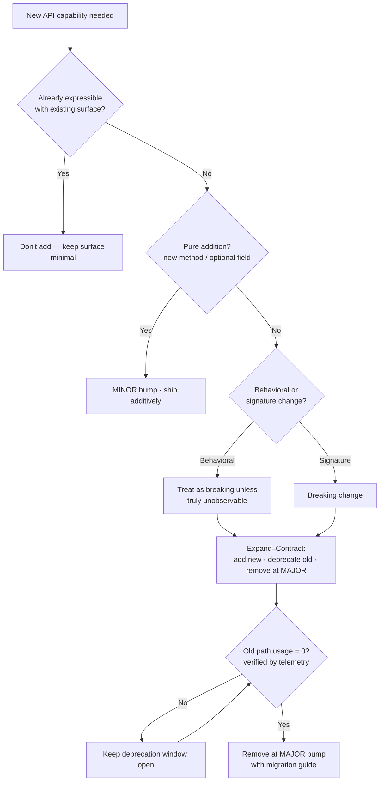

# API & Library Design — Interview Questions

> 50+ questions across four tiers (Junior → Mid → Senior → Staff). An API is a contract you publish to people you will never meet, and — as Joshua Bloch put it — "public APIs, like diamonds, are forever." These questions probe whether you can design a surface that is easy to use right, hard to use wrong, and safe to evolve. Use as self-review or interview prep.

## Table of Contents

- [Junior (15)](#junior-15)
- [Mid (15)](#mid-15)
- [Senior (13)](#senior-13)
- [Staff (10)](#staff-10)
- [Rapid-Fire](#rapid-fire)
- [Summary](#summary)
- [Further Reading](#further-reading)
- [Related Topics](#related-topics)

---

## Junior (15)

### J1. What is a "public API" in the library-design sense?

Answer

Every type, method, field, constant, and behavior that a consumer outside your module can depend on. It is not just the functions you *intended* to publish — it is everything reachable, plus (per Hyrum's Law) every observable behavior consumers actually rely on. The public API is the contract; everything else is implementation you can change freely.

### J2. What does "minimal surface area" mean and why does it matter?

Answer

Expose the smallest set of types and methods that lets callers do their job. Each public element is a promise you must keep, document, test, and support forever. A smaller surface means fewer things to break, fewer ways to misuse, and more freedom to refactor internals. "When in doubt, leave it out" — you can always *add* later; you can rarely *remove* without breaking someone.

### J3. Explain "easy to use right, hard to use wrong."

Answer

Scott Meyers' design maxim: the obvious way to call your API should be the correct way, and incorrect usage should be difficult or impossible to express. Concretely — use types that make illegal states unrepresentable, require mandatory arguments at construction, return rich error types instead of magic sentinels, and choose names that match the caller's mental model. The compiler, not the docs, should catch the common mistakes.

### J4. What is the Principle of Least Astonishment?

Answer

A component should behave the way most users expect, given its name and signature. `getX()` should not mutate state; `size()` should be O(1) if the idiom implies it; `close()` should be idempotent. Surprise is a defect: it forces every caller to read the source to be sure. Conform to platform and ecosystem conventions before inventing your own.

### J5. Why are boolean parameters a smell in a public signature?

Answer

A call like `createUser("ann", true, false)` is unreadable at the call site — the reader cannot tell what `true` and `false` mean without opening the signature. Booleans also resist extension (a second mode forces a breaking change or a confusing `(true, true)`). Cures: separate intention-revealing methods, or a named enum / options object (`Visibility.PUBLIC` instead of `true`).

### J6. What is "primitive obsession" in an API signature?

Answer

Using bare `String`, `int`, or `long` where a dedicated type would be clearer and safer. `transfer(String from, String to, long amount)` lets a caller swap `from`/`to` at compile time and pass a negative amount. `transfer(AccountId from, AccountId to, Money amount)` makes those mistakes impossible and gives validation a single home. Typed parameters are self-documenting and order-safe.

### J7. Give an example of a good default and a bad default.

Answer

Good: `timeout = 30s` on an HTTP client — a safe, common value that most callers never need to touch. Bad: `retries = unlimited` or `verifySSL = false` — defaults that push a correctness or security burden onto every caller who forgets to override them. A default should be the choice you'd make for the *majority* of callers and should never be the *dangerous* choice.

### J8. What is SemVer, in one sentence per number?

Answer

`MAJOR.MINOR.PATCH`. **MAJOR** = breaking change to the public API. **MINOR** = backward-compatible feature addition. **PATCH** = backward-compatible bug fix. The contract is with *consumers*: a patch or minor bump must never force them to change their code.

### J9. What is a "breaking change"?

Answer

Any change that can make previously-working consumer code fail to compile, link, or behave correctly. Removing or renaming a public method, changing a return type, tightening an accepted input, throwing a new exception, or altering documented behavior are all breaking. Breaking changes require a MAJOR version bump.

### J10. What does "design from the caller in" mean?

Answer

Write the usage code *first* — the example you'd put in the README — before implementing anything. Let that ideal call site dictate the signatures, names, and types. APIs designed implementation-first leak internal structure and feel awkward; APIs designed caller-first read like the problem domain. This is the core of "API as if you were the user."

### J11. Why prefer returning an interface or abstract type over a concrete class?

Answer

If `getUsers()` returns `ArrayList<User>`, callers may depend on `ArrayList`-specific behavior, and you can never switch to a different list implementation. Returning `List<User>` keeps the implementation free to change. Expose the narrowest type that satisfies the caller's needs.

### J12. What is the difference between an API and an SPI?

Answer

An **API** (Application Programming Interface) is what callers *use* — you call it. An **SPI** (Service Provider Interface) is what implementers *extend* — the framework calls it (e.g., `java.sql.Driver`). They evolve differently: adding a method to an API is safe; adding a method to an SPI breaks every existing implementer.

### J13. What is deprecation and why not just delete the method?

Answer

Deprecation marks a method as discouraged while keeping it working, giving consumers time to migrate. Deleting it outright breaks every caller on the next upgrade with no warning. The deprecation annotation/comment should say *what to use instead* and ideally *since when* and *when it will be removed*.

### J14. Name two reasons consistent naming and argument order matter across an API.

Answer

(1) Learnability — once a caller learns `find...`/`create...`/`delete...`, they predict the rest of the API without docs. (2) Correctness — if some methods take `(source, dest)` and others `(dest, source)`, callers will eventually swap them. Consistency turns the API into a small, internally-coherent language.

### J15. Why is good documentation part of the API, not an extra?

Answer

The contract includes the *meaning* of inputs, outputs, errors, thread-safety, and side effects — none of which a signature fully captures. Undocumented behavior still gets relied upon (Hyrum's Law), so documenting *which* behaviors are guaranteed is how you reserve the right to change the rest. Docs define the boundary between "promise" and "implementation detail."

---

## Mid (15)

### M1. Options object vs builder vs overloads vs positional parameters — when each?

Answer

- **Positional params:** 1–3 required arguments, all obvious from order.
- **Overloads:** a few discrete combinations, where each combination is a meaningful named variant.
- **Builder:** many optional fields, required-vs-optional distinction, validation at `build()`, fluent step-by-step construction (see [design patterns › Builder](../../design-patterns/01-creational/README.md)).
- **Options object / functional options:** configuration bag, extensible without breaking callers, language idiom (Go functional options, Python kwargs, TS options object).

The deciding factors are arity, how many are optional, and whether you need to add options later without breaking callers.

### M2. Why do overloads scale badly as configuration grows?

Answer

Each new optional dimension can multiply the overload count combinatorially (the "telescoping constructor" problem). Overloads also can't express "set option C but not B," and overload resolution can become ambiguous (`f(null)`). Past three or four, switch to a builder or options object.

### M3. How do you design errors *into* an API rather than bolting them on?

Answer

Decide up front which failures are part of the contract and model them explicitly: a `Result`/`Either` type, a checked exception hierarchy, or documented error codes. Distinguish *expected* failures (validation, not-found) from *bugs* (null arg, illegal state). Make the failure mode visible in the signature so callers must handle it — not buried as a runtime surprise. Never use `null` or `-1` as an error channel when a real type can carry the reason.

### M4. What is Hyrum's Law and what's its design consequence?

Answer

"With a sufficient number of users, every observable behavior of your system will be depended on by somebody." Consequence: even behavior you never promised — iteration order, error message text, timing, the exact bytes of a hash — becomes a de-facto contract. Design consequence: minimize *observable* surface, randomize/abstract incidental behavior you want to stay free to change, and document precisely what is and isn't guaranteed.

### M5. Is adding a parameter to a public method a breaking change?

Answer

Usually yes. Changing `f(a)` to `f(a, b)` breaks source compatibility (existing callers no longer compile) and binary compatibility in most languages (the symbol/signature changes). Non-breaking ways to add it: a new overload, a default-valued parameter in languages that support it *and* preserve binary compat, or an options object you can extend. So "add a param" almost always means "add an overload or extend the options object."

### M6. Why is leaking an internal type into the public API dangerous?

Answer

If `getConfig()` returns your internal `MutableConfigImpl`, consumers couple to that type. You can no longer rename it, change its package, make it immutable, or swap implementations without a breaking change. Worse, returning mutable internals lets callers mutate your state. Return interfaces, copies, or immutable views; keep `impl` packages out of the published surface.

### M7. How do you make an API "hard to use wrong" with the type system?

Answer

Make illegal states unrepresentable. Examples: a `NonEmptyList` type so callers can't pass an empty one; a parsed `EmailAddress` instead of `String`; phantom/state types in a builder so `.build()` is only callable once required steps are done; enums instead of int flags; `Optional`/nullable annotations so absence is explicit. Push errors from runtime to compile time.

### M8. What belongs in the deprecation message?

Answer

What to use instead (with a code pointer), since which version it's deprecated, and the planned removal version. Without a replacement and a timeline, deprecation is just nagging. In tooling-aware ecosystems, also wire it to compiler/linter warnings so migration is mechanically discoverable.

### M9. How does designing for testability affect API shape?

Answer

A testable API takes its dependencies explicitly (so callers can inject fakes), avoids hidden global state and statics, separates pure computation from I/O, and exposes seams (interfaces) at the boundaries. If using your library forces callers to spin up a database to unit-test their own code, the API has leaked I/O into places it shouldn't be.

### M10. What is the trade-off between flexibility and simplicity?

Answer

Every extensibility hook (callback, plugin point, config flag) is also a constraint you must preserve and a way for callers to misuse the API. More flexibility means more surface, more documentation, more failure modes. Start simple and minimal; add flexibility only when a *real* use case demands it. "Flexible enough" beats "infinitely configurable." When forced to choose for the common case: simple wins.

### M11. How should an API handle backward compatibility for serialized data?

Answer

Wire formats are APIs too. Add fields as optional with defaults, never reuse field numbers/names with new meanings, never change a field's type, and tolerate unknown fields on read (so old readers survive new writers). Tools like Protobuf enforce much of this; JSON requires discipline. The schema's evolution rules are part of your SemVer contract.

### M12. Why are checked exceptions / declared errors both a help and a hazard in API design?

Answer

They make failure part of the visible contract (help) but adding a new one to an existing method is a breaking change, and over-broad declarations push handling burden onto callers (hazard). Design a small, stable error hierarchy with a base type so you can add subtypes without breaking `catch (BaseError)` handlers. See [error-handling patterns](../../design-patterns/README.md) for hierarchy design.

### M13. What does "orthogonal API surface" mean?

Answer

Features are independent and compose without overlap — there's one obvious way to do each thing, and combining features doesn't produce surprising interactions. Non-orthogonal APIs have redundant methods (`get`, `fetch`, `retrieve` all doing the same thing) and flags that only make sense in certain combinations. Orthogonality shrinks the surface and the documentation.

### M14. How do you choose names for an API's public methods?

Answer

Use the consumer's domain vocabulary, not your implementation's. Be consistent (`create/read/update/delete`, not `create/get/modify/remove`). Prefer verbs for actions and nouns for queries. Avoid abbreviations and insider jargon. A good name lets a caller guess the signature; a bad one makes them read the source. Names are the cheapest documentation and the most expensive thing to change later.

### M15. Should you expose configuration as constructor args, setters, or an immutable config object?

Answer

Prefer an **immutable config object** built once and passed in: it's thread-safe, can be validated as a unit, and can't drift mid-use. Mutable setters create a window where the object is half-configured and invite mutation after construction (least astonishment violations). Required values go in the constructor/builder; optional ones get defaults. Avoid post-construction `setX()` for anything that affects invariants.

---

## Senior (13)

### S1. "Can you ever safely remove a public method?" (trick)

Answer

**What the interviewer is checking:** whether you understand that "public" means "out of your control." You can *deprecate* it now and *remove* it later, but the removal itself is always a breaking change requiring a MAJOR bump. The only methods you can remove *safely* (no major bump) are ones that were never truly public — internal, or behind an experimental/unstable flag the contract explicitly excluded. With telemetry showing zero usage you can remove with *low risk*, but "low risk" is not "not breaking." The honest answer: removal is never non-breaking; you can only make it *well-signposted* via deprecation windows and major versioning.

### S2. "Is an undocumented behavior safe to change?" (trick)

Answer

**What the interviewer is checking:** whether you've internalized Hyrum's Law. Technically you reserved the right by not documenting it; *practically*, if enough users observe it, they depend on it, and changing it breaks them. The pragmatic stance: documentation *reduces* but doesn't eliminate the risk. To genuinely keep behavior free to change, make it *non-observable* (randomize iteration order, like Go's map; add jitter; abstract the detail) so dependence is impossible, not merely discouraged.

### S3. "Should an API be flexible or simple?" (trick)

Answer

**What the interviewer is checking:** whether you reach for "it depends" thoughtfully or pick a slogan. Default to simple: simplicity serves the 90% common case, is easier to learn, and leaves you room to add flexibility later (adding is non-breaking; removing flexibility is breaking). Add flexibility only for demonstrated needs, and prefer composable primitives over configuration flags. The trap answer is "flexible" — over-flexible APIs are the ones that ossify, because every option becomes a forever-promise.

### S4. How do you evolve an API without a major version bump?

Answer

Additive-only changes: new methods, new overloads, new optional fields, new subtypes of an existing error base, widening accepted inputs, narrowing required outputs. Avoid: removing/renaming, changing signatures or return types, tightening inputs, removing enum values, throwing new error types from existing methods. The pattern is "add the new way, deprecate the old way, remove the old way only at the next major."

### S5. Describe the expand–contract (parallel-change) pattern for evolving an API.

Answer

**Expand:** add the new API (method, field, param) alongside the old, both working. **Migrate:** move callers — internal first, then deprecate the old path so external callers get warnings and migrate over a release window. **Contract:** once usage drops to zero (verified by telemetry), remove the old path at a major version. This keeps every intermediate release shippable and never breaks callers mid-migration.

### S6. How do you decide what NOT to expose?

Answer

Apply "when in doubt, leave it out." Keep out: anything reflecting an implementation choice (data structures, helper classes), anything you're unsure about (you can add it later if demand appears), and anything that exposes a behavior you want to stay free to change. Ship the minimal core, gather real usage, then expand deliberately. A method that's "private now, public later" is cheap; "public now, private later" is a major break.

### S7. How do you manage an experimental or unstable surface inside a stable library?

Answer

Carve out an explicitly-unstable region the SemVer guarantee excludes: an `experimental`/`internal`/`unstable` package, a `@Beta`/`@Experimental` annotation, a feature flag, or a `v0.x`-style sub-namespace. Document loudly that it can break on any release. This lets you iterate fast on new ideas without freezing them prematurely — and gives you a clean promotion path once the design settles.

### S8. What is the cost of a callback/extension point in a public API?

Answer

You commit to *when* and *how often* it's called, *on which thread*, *with what re-entrancy guarantees*, and *what happens if it throws* — all forever (Hyrum's Law makes even unstated timing a contract). Callbacks also invert control, complicating error handling and lifecycle. Prefer returning data the caller processes over invoking caller code, unless the extension point is genuinely the point of the API (frameworks, plugins).

### S9. How do you keep an SPI evolvable when adding a method breaks every implementer?

Answer

Provide a default implementation so existing implementers compile unchanged: Java/Kotlin `default` interface methods, an abstract base class implementers extend instead of the raw interface, or a separate "v2" interface they can opt into. Versioned SPIs (`Driver`, `Driver2`) and capability-query patterns (`if (provider instanceof FooCapable)`) also avoid forcing a flag day on the ecosystem.

### S10. How do return-type and exception choices interact with Hyrum's Law?

Answer

Callers depend on observable specifics: the *concrete* runtime type behind a declared interface, the exact exception subtype, the error message string, even null-vs-empty-collection. Defend by returning the narrowest declared type, throwing through a stable base exception, documenting "message text may change," and being consistent (always empty collection, never null). The less you reveal, the more you can change.

### S11. How do you sunset a widely-used API responsibly?

Answer

Announce early with a migration guide; provide an automated migration (codemod/shim) where possible; emit runtime + compile-time deprecation warnings; instrument usage so you know real adoption of the replacement; set and communicate a removal date tied to a major version; and keep the old path working through a generous window. The goal is that removal day is a non-event because nobody is still calling it.

### S12. How does immutability in returned objects strengthen an API?

Answer

Immutable returns can't be mutated by callers (no accidental corruption of your state), are inherently thread-safe, and are safe to cache and share. They also free you from defensive copying on every call. Combined with returning interfaces, immutability lets you change the backing implementation freely. See [immutability patterns](../../design-patterns/README.md) for techniques.

### S13. When is breaking compatibility the right call?

Answer

When the current API is genuinely wrong (a security hole, a footgun causing real bugs, an impossible-to-evolve shape) and patching around it costs more than a clean break. Then do it *honestly*: major version bump, migration guide, parallel support window, and clear communication. The wrong way is a silent break on a minor/patch — that destroys trust faster than any missing feature. Breaking is a tool, not a sin; *unannounced* breaking is the sin.

---

## Staff (10)

### St1. Walk me through governing API stability across a large organization or ecosystem.

Answer

Define tiers of stability (stable / beta / internal) with explicit guarantees per tier. Enforce mechanically: linters that flag public additions in review, automated API-diff tools (japicmp, `cargo-semver-checks`, `go apidiff`, `api-extractor`) that fail CI on undeclared breaking changes, and a required SemVer label on every release PR. Add a review gate ("API council") for new public surface. Maintain a deprecation registry with owners and removal dates. The point is to make "is this a breaking change?" a machine-checkable fact, not a judgment call.

### St2. How do you design an API that must remain stable for a decade?

Answer

Minimize the surface aggressively (every element is a 10-year promise), model the *domain* rather than today's implementation, and build in evolution seams from day one: extensible options objects, a base error type, versioned wire schemas, and an explicitly-unstable region for experimentation. Hide everything you can; randomize incidental behavior so nobody depends on it. Bloch's rule applies: "APIs are forever" — when uncertain, defer the decision by leaving it out, because adding is cheap and removing is permanent.

### St3. How do you reconcile Postel's Law ("be liberal in what you accept") with API rigidity?

Answer

Be cautious. Liberal input acceptance feels friendly but creates an *undocumented contract*: every weird input you tolerate becomes something callers rely on (Hyrum's Law), and you can never tighten it without breaking them. The modern consensus (post-HTTP/HTML wars) is to be *strict and explicit* on input, fail fast with clear errors, and reserve leniency only where interoperability genuinely demands it — and even then, document exactly what's tolerated so the leniency is itself a versioned promise.

### St4. How do you handle a behavioral change that isn't a signature change but breaks callers?

Answer

These are the dangerous ones — the types still match, so tooling and the compiler stay silent, but a changed default, ordering, rounding, or timing breaks production. Treat behavioral contracts as part of SemVer: a changed documented behavior is a major break; a changed *undocumented* behavior is a risk you mitigate via telemetry, gradual rollout, and feature flags. Where possible, gate behavior changes behind an opt-in flag that flips to default-on at a major version, so callers migrate deliberately.

### St5. What's your strategy for versioning a public HTTP/REST or gRPC API?

Answer

Same principles, different mechanics. Use additive evolution within a version (new optional fields, new endpoints), reserve breaking changes for a new version namespace (`/v2`, a new proto package), and run versions in parallel with a deprecation window and sunset headers. Never repurpose a field's meaning; tolerate unknown fields; document which fields are guaranteed. For gRPC/Protobuf, follow field-number reservation rules. Treat the schema and the error model as the contract, not the transport.

### St6. How do you measure and reduce "misuse rate" of an API in the field?

Answer

Instrument it: log deprecated-method calls, count exceptions thrown from invalid arguments, track support tickets and Stack Overflow questions per method. High misuse on a particular method is a design defect — the signature isn't "hard to use wrong" enough. Reduce it by tightening types (make the mistake unrepresentable), improving defaults, splitting overloaded responsibilities, or adding compile-time guards. Treat misuse metrics like a product KPI for the API.

### St7. How do you decide between a thin, unopinionated API and a thick, batteries-included one?

Answer

Layer them. Provide a small, orthogonal *core* that's unopinionated and composable, and build the convenient, opinionated helpers *on top of* the core as a separate optional layer. This serves both audiences without coupling them: power users use the core, most users use the sugar, and you can evolve the convenience layer faster than the stable core. The mistake is baking opinions into the core, where they become un-removable.

### St8. How do you safely change a default value in a published API?

Answer

Changing a default is a behavioral breaking change even though signatures don't move — callers relying on the old default silently get new behavior. Options: treat it as a major-version change with release notes; or make the default a sentinel ("auto") that resolves to the new behavior only for new callers; or log a warning when the default is used and the chosen value differs, giving a migration window. Never flip a security-or-correctness-sensitive default on a minor bump.

### St9. How do generics/type parameters complicate API evolution?

Answer

Variance and erasure both bite. Adding or changing a type parameter is breaking; tightening a bound (`<T>` → `<T extends Comparable>`) breaks existing callers; loosening is usually safe. Erasure (JVM) means overloads that differ only in type args collide, and reflective callers can depend on erased shapes. Wildcards/variance annotations (`? extends`, `in/out`) are part of the contract too. Pin generic decisions early — they're among the hardest things to evolve.

### St10. Summarize the philosophy you'd teach a team about public API design.

Answer

APIs are forever (Bloch): you can add but rarely remove, so ship the *minimal* surface and grow it deliberately. Design from the caller in — write the usage first. Make it easy to use right and hard to use wrong (Meyers) by pushing errors to compile time with real types. Honor least astonishment and consistency so the API teaches itself. Respect Hyrum's Law: hide everything you can, document what you guarantee, randomize what you don't. Evolve with SemVer discipline, expand–contract, and humane deprecation — and when you must break, break *honestly* and loudly, never silently.

---

## Rapid-Fire

| Question | Answer |
|---|---|
| Smallest reasonable public surface? | The minimal core; "when in doubt, leave it out." |
| Adding a public method — breaking? | No (additive). |
| Removing a public method — breaking? | Yes, always — major bump. |
| Adding a required parameter to an existing method? | Yes, breaking — add an overload/options field instead. |
| Adding an optional field to an options object? | No, non-breaking. |
| Changing a return type? | Breaking. |
| Changing a documented default? | Behavioral breaking change. |
| Changing an *undocumented* behavior? | Risky — Hyrum's Law; mitigate, don't assume safe. |
| `create(true, false, 30)` — what's wrong? | Boolean/primitive obsession; opaque call site. |
| Best fix for boolean params? | Enums or intention-revealing methods. |
| Many optional construction fields → use? | Builder or options object, not telescoping overloads. |
| Return `ArrayList` or `List`? | The interface (`List`). |
| Error channel: `null`/`-1` or a type? | A real type (Result/exception); never magic sentinels. |
| SemVer for a backward-compatible bug fix? | PATCH. |
| Deprecation message must include? | Replacement + since + removal version. |
| "Flexible or simple?" default answer? | Simple; add flexibility only on demonstrated need. |
| Who decides what behavior is a contract? | Your users do (Hyrum's Law) — so document and hide. |
| Public API lifespan? | Forever (Bloch). |

---

## Summary

Public API design is the discipline of publishing a contract you can keep for years to strangers you'll never meet. The recurring themes across every tier:

- **Minimalism first.** Each public element is a permanent promise. Ship the smallest orthogonal core; "when in doubt, leave it out," because adding is cheap and removing is a breaking change.
- **Easy to use right, hard to use wrong.** Push errors to compile time with real types, kill boolean/primitive obsession, choose sane defaults, and obey the principle of least astonishment so the API teaches itself.
- **Design from the caller in.** Write the usage code first; let the ideal call site dictate names, types, and shapes — never leak internal types or implementation structure.
- **Errors are part of the contract.** Model expected failures explicitly; keep a stable, extensible error hierarchy.
- **Evolve with discipline.** SemVer honestly, expand–contract for changes, deprecate humanely with a replacement and a timeline, and never break silently on a minor/patch bump.
- **Respect Hyrum's Law.** Every observable behavior becomes a contract; hide what you can, document what you guarantee, and randomize what you want to keep free.

---

## Further Reading

- Joshua Bloch — *Effective Java* (API design items) and the talk "How to Design a Good API and Why It Matters."
- Scott Meyers — "The Most Important Design Guideline" (easy to use right, hard to use wrong).
- Hyrum Wright — "Hyrum's Law" ([hyrumslaw.com](https://www.hyrumslaw.com/)).
- *Semantic Versioning 2.0.0* — [semver.org](https://semver.org/).
- *API Design Patterns*, JJ Geewax (Manning) — evolution, versioning, error modeling.
- *The Art of Readable Code* — naming and least-astonishment principles.

---

## Related Topics

- [Chapter README](README.md) — positive rules for API & library design
- [Junior notes](junior.md) · [Professional notes](professional.md)
- [Boundaries](../07-boundaries/README.md) — the *consumer* side of third-party APIs
- [Builder & creational patterns](../../design-patterns/01-creational/README.md) — construction options for rich APIs
- [Design patterns overview](../../design-patterns/README.md) — error hierarchies, immutability, structural facades
- [Code smells › Bloaters](../../refactoring/01-code-smells/01-bloaters/junior.md) — primitive obsession and long parameter lists at the call site
