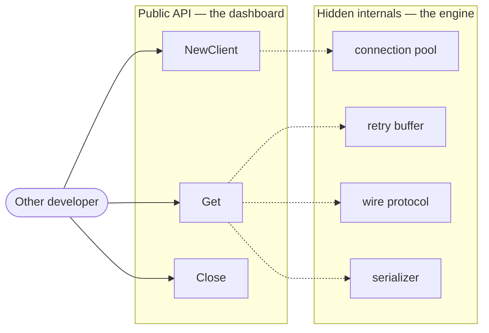
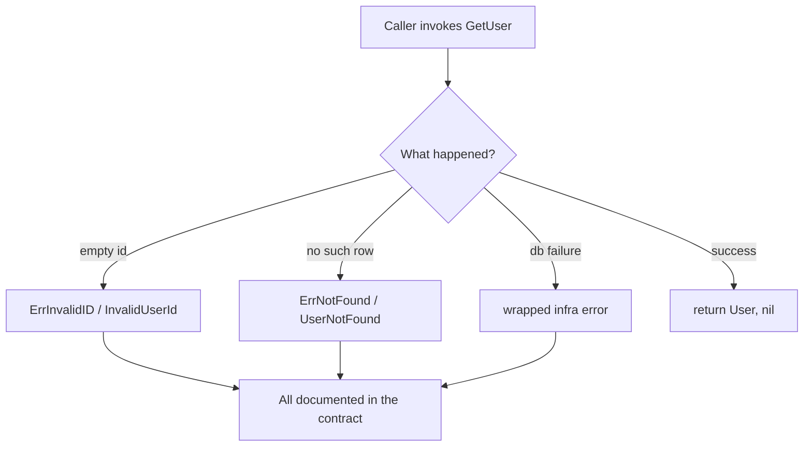

# API & Library Design — Junior Level

> **Level:** Junior — "What's the rule? Show me a clean example."
> You write code that *other developers call*. This file teaches the handful of rules that make a public API pleasant instead of painful: keep the surface small, make it hard to misuse, behave predictably, and design errors and defaults on purpose.

---

## Table of Contents

1. [What is "API design" and why it's different](#what-is-api-design-and-why-its-different)
2. [Real-world analogy](#real-world-analogy)
3. [Rule 1 — Keep the public surface minimal](#rule-1--keep-the-public-surface-minimal)
4. [Rule 2 — Easy to use right, hard to use wrong](#rule-2--easy-to-use-right-hard-to-use-wrong)
5. [Rule 3 — Principle of least astonishment](#rule-3--principle-of-least-astonishment)
6. [Rule 4 — Intention-revealing signatures, not booleans/primitives](#rule-4--intention-revealing-signatures-not-booleansprimitives)
7. [Rule 5 — Pick good defaults](#rule-5--pick-good-defaults)
8. [Rule 6 — Design errors into the contract](#rule-6--design-errors-into-the-contract)
9. [Rule 7 — Design from the caller in](#rule-7--design-from-the-caller-in)
10. [Common Mistakes](#common-mistakes)
11. [Test Yourself](#test-yourself)
12. [Cheat Sheet](#cheat-sheet)
13. [Summary](#summary)
14. [Further Reading](#further-reading)
15. [Related Topics](#related-topics)

---

## What is "API design" and why it's different

An **API** (Application Programming Interface) is the set of names, types, functions, and behaviors you expose so *other code* can use yours. When you design an API, your "user" is not a person clicking buttons — it's a programmer reading your function signatures, autocompleting in their editor, and getting your error messages at 2 a.m.

Internal code is yours to change freely. A **public API is a promise**: once someone depends on it, every name, parameter order, default, and error you exposed is something you have to keep working — or risk breaking their build. That changes how you write it. You optimize for the *reader and caller*, not for the implementer.

> **Junior takeaway:** Internal code answers "does it work?" A public API also answers "is it obvious how to use, and impossible to use wrong?"

This chapter is the **provider's** side. It is *not* the same as:

- [Boundaries](../07-boundaries/README.md) — that's about *consuming* someone else's library safely.
- [Abstraction & Information Hiding](../22-abstraction-and-information-hiding/README.md) — that's the internal quality of your modules.

Here, you are the one being depended on.

---

## Real-world analogy

### The dashboard of a car

A good car gives the driver a steering wheel, pedals, an indicator stalk, and a few labeled controls. The engine, the fuel injection timing, the transmission's internal clutches — all hidden. You can drive any car the first time because the controls are **few**, **consistent** (the brake is always the middle/left pedal), and **predictable** (turning the wheel right turns the car right — least astonishment).

Now imagine a car with 400 unlabeled switches on the dashboard, where "wipers" is switch #211 on one model and switch #14 on the next, and the brake pedal sometimes accelerates "for performance." Nobody could drive it safely.

**Your public API is the dashboard.** Expose few, well-labeled, predictable controls. Hide the engine.



---

## Rule 1 — Keep the public surface minimal

**The rule:** Expose the smallest set of names that is genuinely useful. Hide everything else. Every public symbol is a promise you must keep; the fewer promises, the freer you are to change internals and the easier the API is to learn.

You can always *add* to a public API later. You can almost never *remove* without breaking someone. So start small.

### Why a sprawling surface hurts

- Each public function/type/field is a contract you can't change without a breaking release.
- A huge surface is harder to learn — the caller can't tell the "real" entry points from the helpers.
- Internal helpers leaked as public get depended on (Hyrum's Law), freezing your implementation.

### Go — unexported by default, export deliberately

In Go the rule is built into the language: lowercase = package-private, Capitalized = public. Default to lowercase.

```go
package cache

// Public surface: ONE constructor, TWO methods, ONE type.
type Cache struct {
    mu    sync.Mutex
    items map[string]entry // hidden: lowercase field + lowercase type
}

type entry struct { // hidden helper type — not part of the API
    value     []byte
    expiresAt time.Time
}

func New() *Cache                          { return &Cache{items: map[string]entry{}} }
func (c *Cache) Get(key string) ([]byte, bool) { /* ... */ }
func (c *Cache) Set(key string, value []byte, ttl time.Duration) { /* ... */ }

// evictExpired stays lowercase: callers never need it, so it's not a promise.
func (c *Cache) evictExpired() { /* ... */ }
```

A caller sees exactly `New`, `Get`, `Set`. The `entry` type and `evictExpired` are invisible — you can rewrite them tomorrow.

### Java — package-private and `public` discipline

```java
// GOOD: only the constructor + two methods are public.
public final class Cache {
    private final Map<String, Entry> items = new HashMap<>();

    public byte[] get(String key) { /* ... */ }
    public void set(String key, byte[] value, Duration ttl) { /* ... */ }

    // Entry is package-private (no modifier): an implementation detail.
    static final class Entry {
        byte[] value;
        Instant expiresAt;
    }

    // Helper is private: never a promise.
    private void evictExpired() { /* ... */ }
}
```

> **Tip:** In Java, prefer the *least* visible modifier that works: `private` → package-private → `protected` → `public`. Reach for `public` last, on purpose.

### Python — `__all__` and the underscore convention

Python has no enforced privacy, so you signal intent: a leading underscore means "private," and `__all__` controls what `from module import *` exports and what tools/docs treat as public.

```python
# cache.py

__all__ = ["Cache"]  # the ONLY name we promise

class Cache:
    def __init__(self) -> None:
        self._items: dict[str, _Entry] = {}   # _ = private

    def get(self, key: str) -> bytes | None: ...
    def set(self, key: str, value: bytes, ttl: float) -> None: ...

    def _evict_expired(self) -> None:  # _ = private helper, not part of the API
        ...

class _Entry:          # leading underscore: implementation detail
    ...
```

> **Junior takeaway:** When unsure whether to expose something — don't. Adding later is easy; removing is a breaking change.

---

## Rule 2 — Easy to use right, hard to use wrong

**The rule (Scott Meyers):** Design so that the *correct* use is the *obvious* use, and incorrect use is hard to even express. Don't rely on the caller reading the docs to avoid disaster — make the wrong call not compile, or not be possible.

### Dirty — the API lets you forget a required step

```go
// AWKWARD: caller must remember to call Connect() before Query(),
// and Close() after. Forgetting either is a runtime bug.
c := NewClient()
c.Connect()          // easy to forget
rows, _ := c.Query("...")
c.Close()            // easy to forget
```

### Clean — make the lifecycle impossible to get wrong

```go
// PLEASANT: Dial returns a ready-to-use client (already connected).
// Close is paired with defer at the call site — the standard Go idiom.
c, err := Dial(addr)        // connected or error; no half-built object
if err != nil {
    return err
}
defer c.Close()             // one obvious place to release
rows, err := c.Query("...")
```

The caller cannot hold a "not yet connected" client, because `Dial` only returns a usable one. Two ways to misuse it just vanished.

### Java — return a fully-built, valid object

```java
// AWKWARD: a constructor that builds a half-valid object.
HttpClient c = new HttpClient();
c.setBaseUrl("https://api.example.com"); // required, but nothing forces it
c.setTimeout(Duration.ofSeconds(5));     // required too
Response r = c.get("/users");            // NPE if baseUrl was forgotten

// PLEASANT: required fields go through the factory; the object is born valid.
HttpClient c = HttpClient.forBaseUrl("https://api.example.com"); // required → arg
Response r = c.get("/users");                                    // always valid
```

### Python — use the type system and context managers

```python
# AWKWARD: caller must remember to close the file handle.
f = report.open()
f.write(data)
f.close()            # leaks if an exception happens before this line

# PLEASANT: a context manager makes cleanup automatic and impossible to skip.
with report.open() as f:   # __enter__ / __exit__ guarantee close()
    f.write(data)
# closed here, even on exception
```

> **Junior takeaway:** If "you must call X before Y" appears in your docs, redesign so the API enforces it instead of documenting it.

---

## Rule 3 — Principle of least astonishment

**The rule:** Your API should behave the way a reasonable caller *expects* from its name and from the conventions of the language/ecosystem. No surprises in naming, argument order, return values, or side effects.

### Consistency across the API

Pick one convention and hold it everywhere:

- Naming: `getUser`, `getOrder`, `getInvoice` — not `getUser`, `fetchOrder`, `loadInvoice`.
- Argument order: if `copy(dst, src)` is your convention, never write `move(src, dst)` next to it.
- Return shape: if "not found" returns `(value, false)` in one place, don't return `nil` and a sentinel error somewhere else.

### Dirty — inconsistent and surprising

```go
// SURPRISING: three names for the same idea, two argument orders.
func GetUser(id string) (*User, error)
func FetchOrder(id string) (*Order, error)      // why "Fetch"?
func Copy(src, dst io.Writer) error             // src first...
func Move(dst, src string) error                // ...dst first! easy to swap
```

### Clean — predictable and uniform

```go
// PREDICTABLE: one verb per operation kind, one argument order.
func GetUser(id string) (*User, error)
func GetOrder(id string) (*Order, error)
func Copy(dst, src io.Writer) error   // matches Go stdlib io.Copy(dst, src)
func Move(dst, src string) error      // same order, no surprises
```

> **Tip:** Match the conventions your ecosystem already established. Go's stdlib is `io.Copy(dst, src)`; following it means callers reuse muscle memory instead of guessing.

### Java — least astonishment with names and nullability

```java
// SURPRISING: returns null sometimes, throws other times, name lies.
public User getUser(String id) { ... }   // returns null if absent — caller NPEs

// PREDICTABLE: the type tells the truth about "might be absent."
public Optional<User> findUser(String id) { ... }  // "find" implies "maybe none"
public User getUser(String id) { ... }             // "get" implies "must exist or throw"
```

The names `find` vs `get` carry a *convention*: `find*` may return empty/`Optional`; `get*` guarantees a value or throws. Honor it consistently.

### Python — don't surprise with hidden mutation

```python
# SURPRISING: a "pure-looking" call mutates its argument.
def normalize(tags: list[str]) -> list[str]:
    tags.sort()          # mutates the caller's list! astonishing side effect
    return tags

# PREDICTABLE: don't mutate inputs unless the name says so.
def normalize(tags: list[str]) -> list[str]:
    return sorted(tags)  # returns a new list, leaves the caller's intact
```

> **Junior takeaway:** Before adding a function, ask "if I only saw the name and signature, what would I assume it does?" Make it do exactly that.

---

## Rule 4 — Intention-revealing signatures, not booleans/primitives

**The rule:** A signature should read like a sentence at the call site. Replace bare booleans and loose primitives with enums, named types, or option objects — so the *call* explains itself without the reader opening the docs.

### The boolean trap

```java
// At the call site you see this:
user.setVisibility(true, false, true);
// ...what do those three booleans mean? Nobody knows without the signature.
```

### Go — named types + functional options

```go
// DIRTY: bare bool/int parameters; the call is a mystery.
func NewServer(addr string, tls bool, gzip bool, timeout int) *Server
srv := NewServer(":8080", true, false, 30) // true? false? 30 what?

// CLEAN: a typed enum + functional options. The call reads like prose.
type Compression int
const (
    CompressionNone Compression = iota
    CompressionGzip
)

type Option func(*Server)

func WithTLS() Option                     { return func(s *Server) { s.tls = true } }
func WithCompression(c Compression) Option { return func(s *Server) { s.compression = c } }
func WithTimeout(d time.Duration) Option  { return func(s *Server) { s.timeout = d } }

func NewServer(addr string, opts ...Option) *Server { /* apply opts */ }

// Call site explains itself:
srv := NewServer(":8080",
    WithTLS(),
    WithCompression(CompressionGzip),
    WithTimeout(30*time.Second),
)
```

Functional options also solve a future problem: you can add a new option without breaking any existing caller.

### Java — enums + builders instead of boolean soup

```java
// DIRTY
report.generate(true, false, true);  // ???

// CLEAN: enums name each axis; a builder names each value.
public enum Format { PDF, HTML, CSV }

Report report = Report.builder()
    .format(Format.PDF)
    .includeCharts(true)   // still a boolean, but NAMED at the call site
    .compress(false)
    .build();
```

> **Tip:** A boolean parameter is only confusing when it's *positional*. `compress(false)` (named via a builder method) is clear; `generate(..., false, ...)` is not.

### Python — keyword-only arguments + enums

```python
from enum import Enum

class Format(Enum):
    PDF = "pdf"
    HTML = "html"

# CLEAN: the * forces callers to NAME every flag — no positional mystery.
def generate_report(
    title: str,
    *,                       # everything after this must be passed by keyword
    fmt: Format = Format.PDF,
    include_charts: bool = False,
    compress: bool = False,
) -> bytes:
    ...

# Call site is self-documenting and order-independent:
generate_report("Q1 Sales", fmt=Format.PDF, include_charts=True)
```

The lone `*` is a Python idiom: it makes the later parameters **keyword-only**, so a caller can never write the cryptic `generate_report("Q1", Format.PDF, True, False)`.

> **Junior takeaway:** If a reader has to look up your signature to understand the call, the signature isn't intention-revealing. Name the arguments with types, enums, or keywords.

---

## Rule 5 — Pick good defaults

**The rule:** The common case should be one short call. Choose defaults that are correct and safe for the 80% case, so most callers configure *nothing*. Reserve options for the genuine minority who need them.

A good default is **safe** (won't surprise or harm), **correct for the common case**, and **least-surprising** (matches what callers expect).

### Dirty — every caller must configure everything

```go
// AWKWARD: no defaults; the common case is verbose and easy to get wrong.
c := NewClient(ClientConfig{
    Timeout:    30 * time.Second,  // everyone must set this
    Retries:    3,                 // ...and this
    UserAgent:  "myapp/1.0",       // ...and this
    KeepAlive:  true,              // ...and forgetting it breaks pooling
})
```

### Clean — the common case is one call

```go
// PLEASANT: New() gives a sane, production-ready client. Override only if needed.
c := New()                                  // good defaults baked in

c2 := New(WithTimeout(5 * time.Second))     // tweak just one thing
```

```go
func New(opts ...Option) *Client {
    c := &Client{
        timeout:   30 * time.Second, // sensible default
        retries:   3,                // sensible default
        keepAlive: true,             // safe default that most people want
    }
    for _, opt := range opts {
        opt(c)
    }
    return c
}
```

### Java — defaults in the builder

```java
public final class Client {
    public static Builder builder() { return new Builder(); }

    public static final class Builder {
        private Duration timeout = Duration.ofSeconds(30); // default
        private int retries = 3;                           // default
        private boolean keepAlive = true;                  // safe default

        public Builder timeout(Duration t) { this.timeout = t; return this; }
        public Client build() { return new Client(this); }
    }
}

// Common case: one call, all defaults.
Client c = Client.builder().build();
// Rare case: override just one field.
Client c2 = Client.builder().timeout(Duration.ofSeconds(5)).build();
```

### Python — defaults in the signature

```python
def connect(
    host: str,
    *,
    port: int = 5432,             # the standard PostgreSQL port
    timeout: float = 30.0,        # safe default
    pool_size: int = 10,          # good for the common case
) -> Connection:
    ...

conn = connect("db.example.com")                 # one call, sane defaults
conn = connect("db.example.com", pool_size=50)   # override only what you need
```

> **Warning — surprising defaults are worse than no defaults.** A default of `verify_ssl=False` or `timeout=0` (no timeout) silently pushes risk onto every caller. Make defaults the *safe* choice.

> **Junior takeaway:** Optimize the call site for the most common need. Defaults should make the right thing the easy thing.

---

## Rule 6 — Design errors into the contract

**The rule:** Failures are part of your API, not an afterthought. Return clear, typed errors that callers can act on, and *document* which calls can fail and how. Don't swallow errors, don't return a magic `-1`, and don't make the caller parse an error string.

### Dirty — the error contract is invisible or useless

```go
// AWKWARD: returns nil on any failure; caller can't tell "not found"
// from "database down" from "bad input".
func GetUser(id string) *User {
    u, err := db.Query(id)
    if err != nil {
        return nil   // information destroyed
    }
    return u
}
```

### Clean — typed, distinguishable, documented errors

```go
// Sentinel errors are part of the public API: callers compare against them.
var (
    ErrNotFound     = errors.New("user not found")
    ErrInvalidID    = errors.New("invalid user id")
)

// GetUser returns ErrInvalidID if id is empty, ErrNotFound if no such user,
// or a wrapped database error otherwise.
func GetUser(id string) (*User, error) {
    if id == "" {
        return nil, ErrInvalidID
    }
    u, err := db.Query(id)
    if errors.Is(err, sql.ErrNoRows) {
        return nil, ErrNotFound
    }
    if err != nil {
        return nil, fmt.Errorf("get user %q: %w", id, err) // wrap, keep context
    }
    return u, nil
}

// Caller can branch precisely:
u, err := GetUser(id)
switch {
case errors.Is(err, ErrNotFound):
    // show 404
case errors.Is(err, ErrInvalidID):
    // show 400
case err != nil:
    // show 500
}
```

### Java — typed exceptions the caller can catch

```java
// A small, documented exception hierarchy IS your error contract.
public class UserNotFoundException extends RuntimeException {
    public UserNotFoundException(String id) { super("user not found: " + id); }
}

/**
 * @throws IllegalArgumentException if id is blank
 * @throws UserNotFoundException    if no user has that id
 */
public User getUser(String id) {
    if (id == null || id.isBlank()) {
        throw new IllegalArgumentException("id must not be blank");
    }
    return repository.find(id)
        .orElseThrow(() -> new UserNotFoundException(id));
}
```

Documenting `@throws` makes the failure modes part of the published contract — callers know exactly what to catch.

### Python — specific exception types, documented

```python
class UserError(Exception):
    """Base for all errors this module raises."""

class UserNotFound(UserError):
    """No user exists with the given id."""

class InvalidUserId(UserError):
    """The id was empty or malformed."""

def get_user(user_id: str) -> User:
    """Return the user with `user_id`.

    Raises:
        InvalidUserId: if `user_id` is empty.
        UserNotFound: if no such user exists.
    """
    if not user_id:
        raise InvalidUserId(user_id)
    user = repo.find(user_id)
    if user is None:
        raise UserNotFound(user_id)
    return user
```

A shared base class (`UserError`) lets callers catch *all* of your module's errors with one `except`, while specific subclasses let them handle individual cases.



> **Junior takeaway:** A function's error cases are as much a part of its signature as its parameters. Make them typed, distinguishable, and documented.

---

## Rule 7 — Design from the caller in

**The rule:** Write the *usage example first* — the code you wish you could write as a caller — then build the API to make that example real. This flips the design: you optimize for the experience of using the API, not the convenience of implementing it.

### The technique

1. Pretend the library already exists.
2. Write the cleanest possible snippet that solves the caller's task.
3. *That snippet is your API spec.* Now implement what makes it compile and work.

### Example — designing a rate limiter

Start with the call you *wish* existed:

```go
// Step 1: the dream call site (written BEFORE any implementation).
limiter := ratelimit.New(100, time.Second) // 100 requests per second

if limiter.Allow() {
    handleRequest()
} else {
    rejectWithTooManyRequests()
}
```

That reads beautifully — `New(rate, per)` and a boolean `Allow()`. *Now* write the type to match:

```go
// Step 2: implement to fit the dream signature, not the other way around.
type Limiter struct { /* tokens, refill rate, mutex... */ }

func New(rate int, per time.Duration) *Limiter { /* ... */ }
func (l *Limiter) Allow() bool                  { /* ... */ }
```

Compare with the implementer-first version that leaks internals:

```go
// IMPLEMENTER-FIRST (bad): exposes the algorithm's guts to the caller.
limiter := ratelimit.NewTokenBucket(100, 100, 0.0, time.Now()) // burst? refill? when?
limiter.Refill(time.Now())                                     // caller must drive it?!
if limiter.Tokens() >= 1 { limiter.Consume(1); handleRequest() }
```

The caller-in version hides the token-bucket math entirely. The implementer-first version forces every caller to understand it.

### The same idea in Python

```python
# Step 1: write the call you wish you had.
limiter = RateLimiter(per_second=100)

if limiter.allow():
    handle_request()
else:
    reject()

# Step 2: build RateLimiter to make exactly that snippet work.
class RateLimiter:
    def __init__(self, *, per_second: int) -> None: ...
    def allow(self) -> bool: ...
```

> **Junior takeaway:** The first artifact of good API design is not code — it's the example of someone *calling* your code. Write that example, show it to a teammate, and only then implement.

---

## Common Mistakes

| Anti-pattern | What it looks like | Fix |
|---|---|---|
| **Sprawling public surface** | Everything is `public`/exported "just in case" | Default to private; export the minimal core only |
| **Boolean / primitive obsession** | `create(true, false, 30)` | Enums, named types, options, keyword args |
| **Inconsistent naming** | `getUser`, `fetchOrder`, `loadInvoice` for the same idea | One verb per operation; one convention |
| **Inconsistent argument order** | `copy(dst, src)` next to `move(src, dst)` | Pick one order; match ecosystem conventions |
| **Surprising defaults** | `verify_ssl=False`, `timeout=0` (infinite) | Defaults must be the *safe* choice |
| **No error contract** | Returns `nil`/`-1`/`""` on failure | Typed, distinguishable, documented errors |
| **Leaking internal types** | Returning your private `internalNode` to callers | Return public types/interfaces only |
| **Telescoping constructors** | `new Client(a, b, c, d, e, f, g)` | Builder (Java) / functional options (Go) / keyword args (Python) |
| **Stringly-typed entry points** | `doAction("compress-then-upload")` | Enums + dedicated methods |
| **"Read the docs to avoid disaster"** | Must call `connect()` before `query()` | Make misuse not compile / not expressible |

---

## Test Yourself

**1. Why should a public API start as small as possible?**

<details><summary>Answer</summary>

Because you can almost always *add* to a public API later, but you can rarely *remove* anything without breaking callers who depend on it. Every exported symbol is a promise you must keep across versions. A small surface is easier to learn, easier to evolve, and gives you freedom to change internals. When unsure whether to expose something, don't.

</details>

**2. What's wrong with `server.configure(true, false, true)` and how do you fix it?**

<details><summary>Answer</summary>

The booleans are *positional* and meaningless at the call site — the reader must open the signature to know what each `true`/`false` controls, and it's trivially easy to pass them in the wrong order. Fix it with intention-revealing alternatives: enums and named types (Go), a builder with named methods (Java), or keyword-only arguments (Python), so the call reads like a sentence: `WithTLS()`, `.includeCharts(true)`, `include_charts=True`.

</details>

**3. State the "principle of least astonishment" in one sentence, and give one example of violating it.**

<details><summary>Answer</summary>

An API should behave the way a reasonable caller expects from its name, types, and the conventions of the ecosystem. Violations: a `getUser` that returns `null` instead of throwing or returning `Optional`; a `normalize(list)` that secretly mutates the caller's list; a `move(src, dst)` sitting next to a `copy(dst, src)` with the opposite argument order.

</details>

**4. Why is `timeout=0` (meaning "no timeout") a bad default?**

<details><summary>Answer</summary>

Because it's *surprising and unsafe*. A caller who configures nothing inherits a connection that can hang forever, silently pushing a reliability risk onto every user of the API. Good defaults are safe and correct for the common case; "no timeout" is neither. Pick a sane finite default (e.g., 30s) and let the rare caller override it.

</details>

**5. Your `GetUser` returns `nil` on every kind of failure. What's the problem, and what's the fix?**

<details><summary>Answer</summary>

Returning `nil` (or `-1`, or `""`) destroys information: the caller can't distinguish "user not found" (a 404) from "invalid input" (a 400) from "database is down" (a 500), so they can't respond correctly. Fix it by designing errors into the contract — return typed, distinguishable errors (Go sentinels like `ErrNotFound`/`ErrInvalidID`, or a small exception hierarchy in Java/Python) and document which calls raise which.

</details>

**6. What does "design from the caller in" mean in practice?**

<details><summary>Answer</summary>

Write the *usage example first* — the cleanest snippet you wish you could write as a caller — and treat that snippet as the spec. Then build the API to make exactly that example compile and work. This optimizes for the calling experience rather than implementation convenience, and naturally hides internals (e.g., a token-bucket rate limiter exposes `New(rate, per)` + `Allow()`, not `Refill()`/`Tokens()`/`Consume()`).

</details>

**7. A teammate says "we don't need to hide that helper, no one will call it." Why push back?**

<details><summary>Answer</summary>

Because of Hyrum's Law: with enough users, every observable behavior of your API — including helpers you "didn't mean" to expose — *will* be depended on. Once someone relies on that helper, you can no longer change it freely; it has silently become part of your contract. Keep it private (lowercase in Go, `private`/package-private in Java, leading underscore + `__all__` in Python) so you retain freedom to change internals.

</details>

---

## Cheat Sheet

```text
MINIMAL SURFACE
  Default to private. Export the smallest useful core.
  Go: lowercase = private.  Java: prefer private/package-private.  Python: _name + __all__.

EASY RIGHT / HARD WRONG
  Make the correct call the obvious call; make misuse not compile/not expressible.
  Return fully-built valid objects (Dial, factory). Use defer/with for cleanup.

LEAST ASTONISHMENT
  Consistent names (get/get/get, not get/fetch/load).
  Consistent argument order (match stdlib: io.Copy(dst, src)).
  No hidden mutation. Names must tell the truth (find→Optional, get→throw).

INTENTION-REVEALING SIGNATURES
  No positional booleans/primitives.
  Go: named types + functional options.  Java: enums + builders.  Python: enums + keyword-only (*).

GOOD DEFAULTS
  Common case = one call. Defaults must be SAFE (never verify_ssl=False / timeout=0).

ERROR CONTRACT
  Typed, distinguishable, documented errors. No nil/-1/"".
  Go: sentinel errors + %w wrapping.  Java/Python: small exception hierarchy + docs.

DESIGN FROM THE CALLER IN
  Write the dream call site FIRST. Implement to match it. Hide the algorithm.
```

---

## Summary

- A **public API is a promise** — optimize it for the reader and caller, not the implementer.
- **Keep the surface minimal.** Default to private; export only the useful core. Adding is easy; removing breaks people.
- **Easy to use right, hard to use wrong.** Make correct use obvious and incorrect use impossible to express.
- **Least astonishment.** Consistent names, consistent argument order, predictable behavior, no hidden side effects.
- **Intention-revealing signatures.** Replace positional booleans/primitives with enums, named types, options, and keyword args.
- **Good defaults.** The common case is one call; defaults must be the *safe* choice.
- **Design errors into the contract.** Typed, distinguishable, documented failures — never `nil`/`-1`/`""`.
- **Design from the caller in.** Write the usage example first; let it drive the implementation.

---

## Further Reading

- Scott Meyers, *"The Most Important Design Guideline"* — origin of "easy to use right, hard to use wrong."
- Joshua Bloch, *"How to Design a Good API and Why It Matters"* (talk + paper).
- *Effective Java* (Bloch), Chapter 4 — Classes & Interfaces; Item on minimizing accessibility.
- *The Go Programming Language* (Donovan & Kernighan) — package design and exported identifiers.
- *Effective Python* (Slatkin) — keyword-only arguments, `__all__`, and module API hygiene.

---

## Related Topics

- [middle.md](middle.md) — versioning, deprecation, SemVer, evolving an API without breaking callers.
- [senior.md](senior.md) — orthogonality, Hyrum's Law in depth, designing SDKs and platform APIs.
- [Chapter README](../README.md) — full list of positive rules and anti-patterns for this chapter.
- [Boundaries](../07-boundaries/README.md) — the *consumer's* side: using third-party APIs safely.
- [Abstraction & Information Hiding](../22-abstraction-and-information-hiding/README.md) — what to hide and why.
- [Meaningful Names](../01-meaningful-names/README.md) — naming is half of API design.
- [Design Patterns](../../design-patterns/README.md) — Builder, Factory, and friends for clean construction.
- [Refactoring](../../refactoring/README.md) — Introduce Parameter Object, Replace Constructor with Factory Method.
- [Anti-Patterns](../../anti-patterns/README.md) — telescoping constructors and stringly-typed code as smells.
