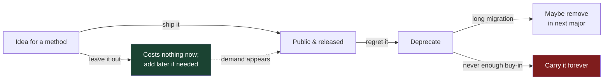

# API & Library Design — Middle Level

> Focus: "Why?" and "When does it bend?" — the trade-offs behind a public surface, how an API survives change, and the design decisions you will defend in code review.

---

## Table of Contents

1. [The asymmetry that governs everything: add is cheap, remove is forever](#the-asymmetry-that-governs-everything-add-is-cheap-remove-is-forever)
2. [SemVer as a contract: what actually counts as a breaking change](#semver-as-a-contract-what-actually-counts-as-a-breaking-change)
3. [Options vs. overloads vs. positional args](#options-vs-overloads-vs-positional-args)
4. [Orthogonality and consistency across the surface](#orthogonality-and-consistency-across-the-surface)
5. [Sync vs. async: don't color your callers](#sync-vs-async-dont-color-your-callers)
6. [Errors at the boundary: return, throw, or Result](#errors-at-the-boundary-return-throw-or-result)
7. [Nullable and optional in signatures](#nullable-and-optional-in-signatures)
8. [How much to expose: extensibility vs. a small surface](#how-much-to-expose-extensibility-vs-a-small-surface)
9. [Documenting the contract: stable, experimental, internal](#documenting-the-contract-stable-experimental-internal)
10. [Common Mistakes](#common-mistakes)
11. [Test Yourself](#test-yourself)
12. [Cheat Sheet](#cheat-sheet)
13. [Summary](#summary)
14. [Further Reading](#further-reading)
15. [Related Topics](#related-topics)

---

## The asymmetry that governs everything: add is cheap, remove is forever

Every other decision in API design descends from one fact: **you can always add to a public API later, but you can almost never remove from it.** The moment a symbol is public and shipped in a release, someone, somewhere, depends on it — including on behavior you never documented (Hyrum's Law).

This is why Joshua Bloch's rule is *"when in doubt, leave it out."* A method you didn't ship costs nothing. A method you shipped and now regret is permanent: you can deprecate it, you can document "do not use," but you cannot delete it without breaking callers — and the bigger your user base, the more expensive that break is.



The practical consequences:

- **Start with the smallest surface that solves the real use case.** Not the use case you imagine — the one you can demonstrate.
- **Make extension points explicit and few.** Each `public` symbol, each exported field, each overridable method is a promise.
- **Prefer adding parameters via options objects** (below) so the *next* feature doesn't force a signature break.

> **Why this matters more for libraries than apps:** in an app, you own every caller — a breaking change is a refactor. In a library, your callers are strangers on a different release cadence. You break them at a distance, and you find out via bug reports, not a compiler.

---

## SemVer as a contract: what actually counts as a breaking change

Semantic Versioning (`MAJOR.MINOR.PATCH`) is a *promise to your users about what an upgrade will do*:

- **PATCH** (`1.4.2 → 1.4.3`): bug fixes, no API change. Safe to auto-upgrade.
- **MINOR** (`1.4.3 → 1.5.0`): additive, backward-compatible. New functions, new optional params, new types. Safe to upgrade; old code still compiles and behaves the same.
- **MAJOR** (`1.5.0 → 2.0.0`): breaking. Callers must read a migration guide.

The hard part is knowing what *counts* as breaking. It is broader than "I deleted a function."

| Change | Breaking? | Why |
|---|---|---|
| Add a new function/method | No | Additive |
| Add an optional parameter (with default) | Usually no | Existing calls still compile |
| Add a *required* parameter | **Yes** | Existing calls no longer compile |
| Rename a public symbol | **Yes** | It's a delete + an add |
| Narrow a return type | No (usually) | Callers still get a compatible value |
| Widen a return type (e.g. `int` → `int?`) | **Yes** | Callers' code may no longer handle all cases |
| Add a method to a public interface | **Yes** (in Java/Go) | Every implementer must now implement it |
| Add a field to a public struct (Go) | Sometimes | Breaks `T{...}` positional literals; breaks unkeyed comparisons |
| Tighten input validation | **Yes** in effect | Inputs that worked now error — Hyrum's Law |
| Change an error message / type | **Yes** in effect | Callers parse or branch on it |
| Make a function faster but change ordering | **Yes** in effect | Someone depended on the old order |

The last four rows are where teams get burned: the *signature* is unchanged, so the compiler says nothing, but **observable behavior changed**, and someone's code relied on it. That is the essence of Hyrum's Law — *with enough users, every observable behavior of your system will be depended upon by somebody.* SemVer governs behavior, not just signatures.

> **Rule:** decide what is *part of the contract* and what is *incidental*, and write it down. If you never say "iteration order is unspecified," users will assume it's stable, and now it is.

---

## Options vs. overloads vs. positional args

The single most common API-evolution decision: how does a caller configure a call that has more than 2–3 meaningful inputs? Each language has an idiom, and each makes a different trade-off between *call-site clarity* and *future evolvability*.

### Positional arguments — fine until they aren't

```go
// What does this even mean at the call site?
client := NewClient("api.example.com", 8080, true, false, 30)
```

Positional args read poorly past ~3 parameters and, worse, **adding a 6th means a breaking signature change**. They're correct for genuinely small, stable signatures (`Add(a, b)`), wrong for anything that will grow.

### Overloads — clarity, but combinatorial

```java
// Java: every combination needs a new overload, or you telescope.
public Client(String host) { this(host, 8080); }
public Client(String host, int port) { this(host, port, true); }
public Client(String host, int port, boolean tls) { /* ... */ }
// Adding "timeout" doubles the table again. This is the telescoping-constructor anti-pattern.
```

Overloads give compile-time-checked, readable call sites but **don't scale** — N independent options need up to 2^N overloads. Use them for a *small, fixed* set of shapes, not for configuration.

### The idiomatic "options" pattern per language

**Java — Builder.** Optional, named, validated in one place; the only sane way past ~4 params.

```java
Client client = Client.builder()
    .host("api.example.com")
    .port(8080)
    .tls(true)
    .timeout(Duration.ofSeconds(30))
    .build();  // build() validates invariants once
```

**Go — functional options.** Each option is a function; adding one is purely additive and never breaks a call site.

```go
type Option func(*config)

func WithPort(p int) Option       { return func(c *config) { c.port = p } }
func WithTimeout(d time.Duration) Option { return func(c *config) { c.timeout = d } }

func NewClient(host string, opts ...Option) *Client {
    c := config{port: 8080, timeout: 30 * time.Second} // sensible defaults
    for _, opt := range opts {
        opt(&c)
    }
    return &Client{cfg: c}
}

// Call site — only set what you care about; future options don't break this line.
client := NewClient("api.example.com", WithTimeout(10*time.Second))
```

**Python — keyword arguments with defaults.** The language gives you named, optional, defaulted params for free.

```python
def new_client(host: str, *, port: int = 8080, tls: bool = True,
               timeout: float = 30.0) -> Client:
    ...

# Call site is self-documenting; new kwargs are additive.
client = new_client("api.example.com", timeout=10.0)
```

Note the `*` in Python: it forces every option to be passed by name, which means **you can reorder or insert keyword params without breaking callers** (positional callers can't exist). That bare `*` is itself an evolvability decision.

### How to choose

| Situation | Choose |
|---|---|
| 1–3 required, stable params | Positional args |
| A few fixed *shapes* of call | Overloads (Java) / a couple of constructors |
| Many optional/config params, will grow | Builder (Java), functional options (Go), keyword args (Python) |
| Required invariants between params | Builder/factory with validation in one place |

> **The deciding question is not "what reads nicest today" but "what happens when I add the next option?"** Options patterns make that addition a non-event.

---

## Orthogonality and consistency across the surface

An API is *orthogonal* when its concepts compose without interfering: setting the timeout doesn't secretly change retries; choosing JSON output doesn't disable streaming. Orthogonal features mean N features give you N×M combinations for free instead of a special case for each pairing.

Orthogonality's twin is **consistency** — the principle of least astonishment applied across the whole surface:

- **Argument order is uniform.** If most functions are `(context, id, options)`, none should be `(id, options, context)`.
- **Naming is uniform.** Pick `fetchX` *or* `getX` *or* `loadX` and use it everywhere. Mixing `getUser`, `fetchOrder`, `loadProduct` forces users to memorize per-method which verb you chose.
- **Units and types are uniform.** All durations are `Duration` (or all are "seconds as int") — never some-of-each.
- **Symmetry exists.** If there's `open`, there's `close`; `subscribe`/`unsubscribe`; `lock`/`unlock`. Asymmetric pairs surprise people.

```python
# Inconsistent — three verbs, two arg orders, two duration conventions.
get_user(user_id, ctx)
fetchOrder(ctx, order_id, timeout_ms=5000)
load_product(ctx, timeout=5.0, id=...)

# Consistent — one verb, one order, one duration type.
get_user(ctx, user_id, timeout=DEFAULT)
get_order(ctx, order_id, timeout=DEFAULT)
get_product(ctx, product_id, timeout=DEFAULT)
```

Consistency is a *learnability* property: once a user learns one corner of a consistent API, they can predict the rest. Every inconsistency is a fact they must look up.

> **Trade-off:** sometimes one method genuinely needs a different shape. Prefer bending the method to the convention; only break the pattern when the alternative would actively mislead — and then make the difference *loud* (a clearly different name), not subtle.

---

## Sync vs. async: don't color your callers

"Function color" (Bob Nystrom's term): in many languages an `async` function can only be called from another `async` function, and a sync function can't `await`. The choice you bake into your API *propagates up the entire call stack of every user.* This is one of the stickiest evolvability traps, because **changing a function from sync to async (or back) is a breaking change** even when the signature "looks" the same.

Guidance:

- **For an I/O library, async is usually the honest shape** — you're doing network or disk work, and forcing it behind a blocking call hides the cost and ruins composability.
- **Don't offer a sync wrapper that just blocks on the async path** unless you understand the deadlock risks (e.g. blocking a single-threaded event loop, or `.get()` on a future from inside the executor that completes it). A naive `runBlocking`/`asyncio.run` wrapper inside library code is a classic deadlock source.
- **If you must support both, make them clearly distinct entry points** (`read` vs `readAsync`, `Get` vs `GetContext`) rather than one function whose color depends on a flag.

Per language:

- **Go** sidesteps coloring: every function is "sync" from the caller's view, and concurrency is the caller's choice via goroutines. The idiom is instead **pass a `context.Context` first** so callers control cancellation and deadlines:

```go
func (c *Client) Fetch(ctx context.Context, id string) (*Item, error)
```

- **Python** has explicit `async def`; coloring is real. Libraries like `httpx` ship *separate* `Client` (sync) and `AsyncClient` (async) types rather than one polymorphic object — clearer than a magic flag.
- **Java** historically returned `CompletableFuture<T>` for async; modern code may use virtual threads (Project Loom) to keep a blocking-style signature while scaling — which, notably, lets you keep a sync-shaped API *without* paying the thread-per-request cost.

> **The rule:** decide the call model deliberately and early, because it's load-bearing for every caller. If you don't know, an I/O-bound library should expose the async/context-aware shape — callers can wrap *down* to blocking far more easily than they can wrap *up* to async.

---

## Errors at the boundary: return, throw, or Result

How a failure crosses your API boundary is part of the contract. The three styles:

1. **Throw / raise an exception** — the language's default control-flow channel (Java checked/unchecked, Python).
2. **Return an error value** — Go's `(T, error)`; the failure is in the signature.
3. **Return a `Result` / `Either` / `Optional`** — failure is a value in the type system (Rust, Scala, functional Java/Kotlin libs).

What changes at a *library boundary* specifically:

- **Make the failure modes visible in the contract.** A function that can fail should say so — via `throws`, via an `error` return, or via a `Result` type — not via an undocumented runtime exception three layers down. The worst boundary is one that throws an internal exception type the caller has never heard of.
- **Distinguish recoverable from programmer errors.** A bad argument the *caller* could have prevented (null where non-null required) is arguably a programming error → throw/panic. A condition the caller *can't* prevent (network down, record not found) is an expected outcome → make it a returned/typed value the caller is forced to handle.
- **Don't leak implementation exceptions.** If your library uses an HTTP client internally, callers should not have to catch that client's exceptions. Wrap them in *your* error type so you can change the implementation later (this is exactly the [Boundaries](../07-boundaries/README.md) concern from the provider side).

```go
// Go: define your own error variables so callers can branch without parsing strings.
var ErrNotFound = errors.New("item: not found")

func (c *Client) Get(ctx context.Context, id string) (*Item, error) {
    // ... internal http error ...
    if status == 404 {
        return nil, fmt.Errorf("get %q: %w", id, ErrNotFound) // wrap, don't leak
    }
}
// Caller: if errors.Is(err, ErrNotFound) { ... }
```

```python
# Python: a small exception hierarchy is part of the public API.
class ClientError(Exception): ...          # base — catch this for "anything from us"
class NotFound(ClientError): ...
class RateLimited(ClientError):
    def __init__(self, retry_after: float): self.retry_after = retry_after
```

```java
// Java: a sealed result is explicit at the call site and forces handling.
sealed interface FetchResult permits Found, NotFound, Failed {}
record Found(Item item) implements FetchResult {}
record NotFound() implements FetchResult {}
record Failed(Throwable cause) implements FetchResult {}
```

> **Consistency rule:** pick *one* error strategy for the public surface and apply it everywhere. An API where half the methods throw and half return error codes is its own anti-pattern — the caller can never predict which kind of failure handling a given call needs.

---

## Nullable and optional in signatures

`null` (and its cousins) is where contracts go to die silently. The question at the boundary is: **can this parameter/return legitimately be absent, and how do I make that visible?**

- **A return that may be absent should say so in the type**, not via a magic value or a documented "returns null if not found." Use `Optional<T>` (Java), `T | None` with a type checker (Python), `(T, bool)` or `(*T, error)` (Go).
- **Avoid `Optional` as a *parameter*.** Java's guidance (and general practice) is that `Optional` is for return types; an optional parameter is better expressed with an overload, a default value, or an options object.
- **Don't return `null` collections.** Return an empty list/map. A nullable collection forces every caller to null-check before iterating — a default trap that pushes correctness onto everyone.

```java
// Bad: caller must remember to null-check; many won't.
List<Order> findOrders(String userId);   // returns null if user has none

// Good: empty is the absence; iteration "just works".
List<Order> findOrders(String userId);   // never null; empty list if none

// Good: genuinely "maybe one" → make it explicit in the return type.
Optional<User> findUser(String id);
```

```go
// Go idiom: the comma-ok or pointer-nil pattern is the "optional".
user, ok := cache.Get(id)   // ok == false means absent
item, err := repo.Find(id)  // item == nil paired with a sentinel error
```

```python
# Python: be explicit and let the type checker enforce it.
def find_user(user_id: str) -> User | None: ...   # caller is forced to handle None
def list_orders(user_id: str) -> list[Order]: ...  # never None; [] when empty
```

> **The trap is the *surprising* default:** a signature that returns `null`/empty/`-1` for "not found" without saying so makes every caller responsible for a rule they can't see. The fix is to move the "may be absent" fact into the *type*, where the compiler or type checker can remind them.

---

## How much to expose: extensibility vs. a small surface

There is a real tension here, and pretending otherwise produces bad APIs:

- **Too small / too closed:** users hit a wall, can't customize, and either fork you or wrap you in fragile hacks against your internals.
- **Too large / too open:** every exposed type is a contract you must preserve; you can't refactor internals without breaking someone; the API is hard to learn because the important 10% is buried in the exposed 90%.

The resolution is **a small core plus deliberate, documented extension points**, not "expose everything just in case":

- **Default to private/unexported.** Promote to public only when a concrete use case demands it. (Add is cheap; remove is forever.)
- **Make extension a *named* mechanism**: an interface the user implements, a hook/callback, a plugin registration — not "we left this field public so you can poke it."
- **Expose interfaces/abstractions, not concrete types**, at the points where you want freedom to change the implementation. Conversely, keep concrete types unexported where you *don't* want to commit.
- **Beware exposing internal types transitively.** If a public method returns an "internal" struct, that struct is now public whether you meant it or not. Audit the *transitive* reachability of your public surface, not just the directly-declared symbols.

```go
// Small surface: one interface is the extension point; the concrete impl stays unexported.
type Encoder interface {            // users can supply their own
    Encode(v any) ([]byte, error)
}

func NewWriter(enc Encoder) *Writer { ... }  // inject the extension point

type jsonEncoder struct{ ... }      // unexported default — we can change it freely
func DefaultEncoder() Encoder { return &jsonEncoder{} }
```

> **Heuristic:** for each `public` symbol ask, *"am I prepared to support this, unchanged, for the lifetime of this major version?"* If the answer is "no," it shouldn't be public yet. Generics and well-chosen type parameters can also keep a surface small while staying flexible — see [Generics & Types](../13-generics-and-types/README.md).

---

## Documenting the contract: stable, experimental, internal

Not everything public is equally committed-to, and saying so explicitly is how you keep room to evolve. Mark each part of the surface with its **stability level**:

- **Stable** — covered by SemVer; will not break within a major version. The default expectation for anything public.
- **Experimental / preview** — public so users can try it, but explicitly *exempt* from SemVer; may change in a minor release. This is how you get feedback *before* committing forever.
- **Deprecated** — still works, but scheduled for removal in the next major; document the replacement and the timeline.
- **Internal** — visible for technical reasons (another package needs it) but not for outside use.

The mechanism varies; the discipline is the same — *the marker must be where the user reads the symbol, not buried in a changelog.*

```java
@Deprecated(since = "2.3", forRemoval = true)   // shows up in the IDE on use
public void oldConnect() { ... }

@ApiStatus.Experimental                          // JetBrains annotations, e.g.
public void newStreamingConnect() { ... }
```

```go
// Deprecated: use NewClientContext instead. Removed in v3.
func NewClient(host string) *Client { ... }      // "Deprecated:" is a recognized convention
                                                 // that go vet / IDEs surface
```

```python
import warnings

def old_connect():
    warnings.warn("use new_connect(); removed in 3.0",
                  DeprecationWarning, stacklevel=2)
```

A **deprecation path** is non-negotiable for a real library: you announce, you provide the replacement, you keep both working for at least one minor cycle, and you remove only on a major bump. Deleting a method out from under callers on a minor/patch release is the cardinal SemVer sin.

> **Why mark experimental at all?** Because without it, "public" means "frozen." The experimental tier is the pressure-release valve that lets you ship, learn, and *then* commit — turning "leave it out" into "ship it cautiously, with an exit."

---

## Common Mistakes

1. **Exposing everything "just in case."** Every public symbol is a forever-promise. A sprawling surface is impossible to evolve and hard to learn. Start minimal; *add* on demand.
2. **Breaking behavior on a minor/patch bump.** Tightening validation, changing an error message, or altering iteration order *is* breaking even with an unchanged signature. SemVer governs behavior (Hyrum's Law), not just types.
3. **Booleans and bare primitives in signatures.** `create(true, false, 30)` is unreadable and swap-prone. Use named options, enums, or value types — the same intention-revealing fix as [Primitive Obsession](../../refactoring/README.md).
4. **Telescoping constructors / overload explosions** instead of a builder, functional options, or keyword args.
5. **Returning `null` or a nullable collection without saying so.** Push "may be absent" into the *type* (`Optional`, `T | None`, `(T, bool)`), never into a magic return value or a doc comment.
6. **Leaking internal/implementation types** through public signatures, so callers couple to types you wanted to keep free to change. Audit *transitive* reachability.
7. **Inconsistent naming, argument order, and units** across the surface — every inconsistency is a fact the user must look up instead of predict.
8. **Forcing function color on callers** by flipping sync↔async (a breaking change), or offering a naive blocking wrapper around an async core that deadlocks.
9. **Mixing error strategies** — some methods throw, some return codes — so callers can't predict how to handle failure.
10. **Deleting methods with no deprecation path.** Announce, replace, overlap, then remove on a major.

---

## Test Yourself

1. **A method returns `null` when no record is found. The compiler is happy and tests pass. Why is this still a design defect at an API boundary?**

<details><summary>Answer</summary>

Because "may be absent" is part of the contract but is invisible in the signature. Every caller must *know* (from docs or by reading source) to null-check, and the compiler won't remind them — so eventually one caller forgets and ships an NPE. The fix moves the fact into the type: `Optional<User>` / `User | None` / `(*User, bool)`. Now the type system forces every caller to handle absence, and the API is "hard to use wrong."

</details>

2. **You speed up a function and, as a side effect, change the order in which results come back. The signature is identical. Is this safe to ship in a minor release?**

<details><summary>Answer</summary>

No. Ordering is observable behavior, and by Hyrum's Law someone depends on it even if you never promised it. Changing it is a breaking change in effect and belongs in a major release — *unless* you had explicitly documented "order is unspecified" from the start, in which case relying on it was the caller's bug. This is exactly why you write down what is and isn't part of the contract.

</details>

3. **Your `NewClient` has grown from 2 to 6 positional parameters and the team wants to add a 7th. In Go, what's the idiomatic fix, and why does it help evolvability specifically?**

<details><summary>Answer</summary>

Functional options: `NewClient(host string, opts ...Option)`. It helps because **adding the 7th option is purely additive** — you write one new `WithX` function and zero existing call sites break or even need touching. It also makes call sites self-documenting (`WithTimeout(10*time.Second)`) and lets you set defaults in one place. Java's equivalent is a Builder; Python's is keyword args with defaults.

</details>

4. **Why is `Optional<T>` recommended for return types but discouraged as a parameter type in Java?**

<details><summary>Answer</summary>

As a return type, `Optional` makes "no value" explicit and forces the caller to handle it. As a *parameter*, it's awkward: callers must wrap arguments (`Optional.of(x)`), `null` can still sneak in as the Optional itself, and the intent ("this argument is optional") is expressed more cleanly by an overload, a default value, or an options/builder object. The parameter case has better tools.

</details>

5. **A teammate proposes one `fetch(id, async=True)` method whose return type (value vs. future) depends on the flag. What's wrong with this?**

<details><summary>Answer</summary>

It makes the function's "color" depend on a runtime flag, so the static type can't tell the caller whether to `await`. It also couples two genuinely different control models into one signature and complicates the return type. Prefer two clearly distinct entry points (`fetch` vs `fetch_async`, or separate sync/async client types as `httpx` does). Decide the call model deliberately; don't hide it behind a boolean.

</details>

6. **You're unsure whether a new helper method will be useful to library users. List the two safest options and the one to avoid.**

<details><summary>Answer</summary>

Safest: (a) **leave it out** — keep it unexported/private; you can always promote it later when a real use case appears ("when in doubt, leave it out"). (b) Ship it **marked experimental**, explicitly exempt from SemVer, to gather feedback before committing. Avoid: shipping it as a plain *stable* public method "just in case" — that freezes it forever, because you can't tell who started depending on it.

</details>

7. **Adding a method to a published Go or Java interface compiles fine in your repo. Why can it still be a breaking change for your users?**

<details><summary>Answer</summary>

Because every *external* type that implements your interface must now also implement the new method, or it stops compiling. Your own implementations are fine; your users' aren't. This is why widely-implemented public interfaces should be kept small and stable — or why you add capability via a *new* interface (or default methods, where the language supports them) rather than growing an existing one.

</details>

8. **When does breaking the consistency of your API (different naming or arg order for one method) actually become the right call?**

<details><summary>Answer</summary>

Only when following the convention would actively *mislead* — i.e., the method is genuinely a different kind of operation and naming it like its siblings would imply behavior it doesn't have. Even then, make the difference *loud* (a clearly distinct name) rather than a subtle reorder a user won't notice. The default is always to bend the method to the convention, because consistency is what lets users predict the rest of the surface from one corner of it.

</details>

---

## Cheat Sheet

| Decision | Default choice | Reach for the alternative when… |
|---|---|---|
| Should this be public? | No — leave it out | A concrete, demonstrated use case needs it |
| Many config params | Options/Builder/kwargs | Genuinely 1–3 stable params → positional |
| Version bump for additive change | MINOR | It's a behavior change → MAJOR (Hyrum) |
| Version bump for rename/required-param | MAJOR | (no exception — it's breaking) |
| Absent return value | Type it: `Optional`/`T \| None`/`(T,bool)` | Never `null`/magic value/empty-vs-null collection |
| Optional input | Default value / overload / options | (avoid `Optional` as a parameter) |
| I/O library call model | Async / context-aware shape | Pure CPU work → plain sync |
| Failure crossing the boundary | One consistent strategy, your own error types | (never leak internal exceptions) |
| Empty collection result | Return `[]` / empty map | (never return `null` collection) |
| Extension | A named interface/hook you inject | (never "we left this field public") |
| Removing a method | Deprecate → overlap → remove on MAJOR | (never delete on minor/patch) |
| Unproven public feature | Mark experimental, SemVer-exempt | (don't ship as stable "just in case") |

**Three sentences to remember:** *Add is cheap, remove is forever.* *SemVer is a promise about behavior, not just signatures.* *Make it easy to use right and hard to use wrong.*

---

## Summary

API design is the discipline of choosing what to **promise**. Because every public symbol and every observable behavior becomes a contract the moment it ships — and because removing a contract breaks strangers on their own schedule — the governing instinct is *minimalism with a path to grow*: leave it out when in doubt, expose a small core, and add only on demonstrated demand.

Around that core, the middle-level decisions are all trade-offs between *clarity now* and *evolvability later*. Options patterns (builders, functional options, keyword args) buy painless future additions over positional brevity. SemVer turns "did I break someone?" into a checkable rule — provided you remember it governs *behavior*, not signatures (Hyrum's Law). Typed absence beats `null`; one consistent error strategy beats a mix; a deliberate sync/async choice beats forcing color on callers; named extension points beat exposing internals; and stability markers (stable/experimental/deprecated) give you room to ship before you commit forever. Do these, and your API is easy to use right, hard to use wrong, and possible to evolve.

---

## Further Reading

- Joshua Bloch — *Effective Java* (Item 51 "Design method signatures carefully", and his talk *How to Design a Good API and Why It Matters*) — the source of "when in doubt, leave it out."
- Scott Meyers — *"Make interfaces easy to use correctly and hard to use incorrectly."*
- Hyrum Wright — *Hyrum's Law* (hyrumslaw.com) and the *Software Engineering at Google* chapters on API design and deprecation.
- *Semantic Versioning 2.0.0* — semver.org — the precise definition of MAJOR/MINOR/PATCH.
- Bob Nystrom — *"What Color Is Your Function?"* — on sync/async coloring.
- Rust API Guidelines and the Go *"Effective Go"* + the standard library as worked examples of small, consistent surfaces.

---

## Related Topics

- [junior.md](junior.md) — the concrete rules and worked before/after examples for each anti-pattern.
- [senior.md](senior.md) — large-scale API governance, deprecation at scale, multi-language SDK strategy, and managing Hyrum's Law in practice.
- [Chapter README](README.md) — the positive rules for this chapter.
- [Boundaries](../07-boundaries/README.md) — the *consumer* side of the same line you are drawing as a *provider*.
- [Generics & Types](../13-generics-and-types/README.md) — keeping a surface small and flexible with type parameters.
- [Design Patterns](../../design-patterns/README.md) — Builder, Factory, and Strategy as API construction tools.
- [Refactoring](../../refactoring/README.md) — fixing primitive/boolean obsession and long parameter lists in existing signatures.
