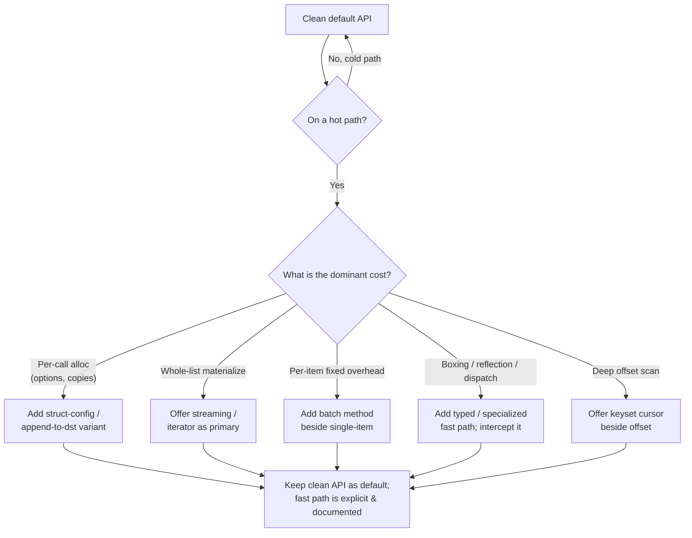

# API & Library Design — Optimize & Reconcile

> A clean API and a fast API are not enemies, but they pull in different directions. The ergonomic shape — `func(opts ...Option)`, returning a fresh `[]Result`, accepting `interface{}` for flexibility — allocates, copies, and boxes on every call. That cost is invisible off the hot path and ruinous on it. The discipline here is not "make the API ugly to make it fast." It is: **keep the ergonomic API as the default, then offer an explicit fast/batch/streaming path beside it** — `Read` next to `ReadByte`, `Marshal` next to `MarshalTo(buf)`, `Find` next to an iterator. Each scenario below pairs a clean API with its measured cost and the principled reconciliation.

---

## Table of Contents

1. [Functional options allocate per call on the hot path](#scenario-1--functional-options-allocate-per-call-on-the-hot-path)
2. [Returning a fresh copy vs exposing the internal slice](#scenario-2--returning-a-fresh-copy-vs-exposing-the-internal-slice)
3. [The append-to-destination (`dst []byte`) pattern](#scenario-3--the-append-to-destination-dst-byte-pattern)
4. [Streaming vs materializing the whole result list](#scenario-4--streaming-vs-materializing-the-whole-result-list)
5. [Batch API beside the single-item API (N+1 at the boundary)](#scenario-5--batch-api-beside-the-single-item-api-n1-at-the-boundary)
6. [`[]byte` vs `string` at the API boundary (zero-copy)](#scenario-6--byte-vs-string-at-the-api-boundary-zero-copy)
7. [Generic API forcing boxing / interface conversion](#scenario-7--generic-api-forcing-boxing--interface-conversion)
8. [Reflection-driven flexibility (`any`) vs a typed fast path](#scenario-8--reflection-driven-flexibility-any-vs-a-typed-fast-path)
9. [Sync blocking API vs offering a streaming/async variant](#scenario-9--sync-blocking-api-vs-offering-a-streamingasync-variant)
10. [Callback API that escapes the closure to the heap](#scenario-10--callback-api-that-escapes-the-closure-to-the-heap)
11. [Returning an interface that defeats inlining and EA](#scenario-11--returning-an-interface-that-defeats-inlining-and-ea)
12. [Defensive validation re-run on every internal call](#scenario-12--defensive-validation-re-run-on-every-internal-call)
13. [Over-flexible "do everything" entry point](#scenario-13--over-flexible-do-everything-entry-point)
14. [Pagination cursor that re-scans from the start](#scenario-14--pagination-cursor-that-re-scans-from-the-start)
- [Rules of Thumb](#rules-of-thumb)
- [Related Topics](#related-topics)

---

### Scenario 1 — Functional options allocate per call on the hot path

The functional-options pattern is the canonical "clean Go API": self-documenting, backward-compatible, defaults baked in.

```go
type Client struct{ timeout time.Duration; retries int; gzip bool }
type Option func(*Client)

func WithTimeout(d time.Duration) Option { return func(c *Client) { c.timeout = d } }
func WithRetries(n int) Option           { return func(c *Client) { c.retries = n } }

func (c *Client) Do(req *Request, opts ...Option) (*Response, error) {
    cfg := *c
    for _, o := range opts { o(&cfg) }   // applies per-call overrides
    return c.send(&cfg, req)
}
```

**Cost.** Each `Do(req, WithTimeout(2*time.Second))` call allocates: the variadic `opts` backing array (1 alloc), one closure per option (each `With…` returns a heap-allocated closure capturing its argument — 1 alloc each), and the `cfg := *c` copy if `Client` is large. For a single option that is **2–3 allocations per call**. At 200k calls/sec that is ~500k allocs/sec feeding the GC. A `go test -bench -benchmem` will show ~120 ns/op, 3 allocs/op versus ~8 ns/op, 0 allocs for a plain method call.

<details><summary>Resolution</summary>

Options belong at **construction** time, not on the per-request hot method. Configure once, call cheaply:

```go
func New(opts ...Option) *Client {        // pay the option cost once, at startup
    c := &Client{timeout: 30 * time.Second}
    for _, o := range opts { o(c) }
    return c
}
func (c *Client) Do(req *Request) (*Response, error) { return c.send(c, req) }
```

When a *per-call* override is genuinely needed on a hot path, provide an explicit struct-config fast path beside the ergonomic one — no closures, no variadic:

```go
func (c *Client) DoWith(req *Request, cfg RequestConfig) (*Response, error) { … }
```

`RequestConfig` is a plain value the caller fills; passing it allocates nothing (it can stay on the stack). Keep `Do(req, opts...)` for the 99% cold-path callers; document `DoWith` as "for hot loops." This is the same split as `http.Client` (configured once) versus per-request fields on `http.Request`.
</details>

---

### Scenario 2 — Returning a fresh copy vs exposing the internal slice

A getter that returns the internal slice lets callers mutate your invariants. The clean fix is a defensive copy.

```go
func (o *Order) Lines() []Line {
    out := make([]Line, len(o.lines))
    copy(out, o.lines)        // safe: caller can't corrupt o.lines
    return out
}
```

**Cost.** Every call allocates and copies the whole slice. A reporting loop that calls `order.Lines()` 1,000 times on a 50-line order does 50,000 element copies and 1,000 allocations for data that never changed. `pprof` shows `Lines` dominating `alloc_space`.

<details><summary>Resolution</summary>

Three tiers, cleanest default first:

1. **Read-only access by index** — no copy, no leak:
   ```go
   func (o *Order) LineCount() int      { return len(o.lines) }
   func (o *Order) Line(i int) Line     { return o.lines[i] }   // Line is a value type
   ```
2. **Iteration callback** (Go 1.23 `iter.Seq`) — caller can't retain or mutate the backing array:
   ```go
   func (o *Order) AllLines() iter.Seq[Line] {
       return func(yield func(Line) bool) {
           for _, l := range o.lines { if !yield(l) { return } }
       }
   }
   ```
3. **Copy** stays as the explicit "I need an independent snapshot" method, named to signal cost: `LinesCopy()`.

The defensive copy was protecting against mutation; index/iteration access removes the mutation vector *and* the allocation. Reserve the copy for callers who truly need to own the data. (Mirrors gold Bloaters Optimize 7 — same Tell-Don't-Ask resolution, here applied to the API surface a library hands out.)
</details>

---

### Scenario 3 — The append-to-destination (`dst []byte`) pattern

Encoding APIs naturally return a freshly allocated buffer:

```go
func (m *Message) Marshal() []byte {
    buf := make([]byte, 0, m.size())
    buf = append(buf, m.header...)
    buf = append(buf, m.body...)
    return buf
}
```

**Cost.** Every `Marshal()` allocates a new buffer. In a serialization loop over 1M messages that is 1M allocations the caller can never reuse — the buffer is born, written to a socket, and discarded.

<details><summary>Resolution</summary>

Adopt the standard-library **append-to-dst** convention: keep the convenient nullary form, and add a variant that writes into a caller-owned buffer.

```go
// Convenient: allocates a new slice. Cold path / one-shot callers.
func (m *Message) Marshal() []byte { return m.AppendTo(nil) }

// Fast: appends into dst and returns the grown slice. Hot loops reuse one buffer.
func (m *Message) AppendTo(dst []byte) []byte {
    dst = append(dst, m.header...)
    dst = append(dst, m.body...)
    return dst
}
```

Hot callers amortize allocation to near-zero by reusing one scratch buffer:

```go
buf := make([]byte, 0, 4096)
for _, m := range messages {
    buf = m.AppendTo(buf[:0])   // reset length, keep capacity → 0 allocs after warmup
    conn.Write(buf)
}
```

This is exactly `strconv.AppendInt`, `time.Time.AppendFormat`, and `(*bufio.Writer)` philosophy. Benchmark: 1M `Marshal()` calls ≈ 1M allocs; the `AppendTo(buf[:0])` loop ≈ a handful. The ergonomic `Marshal()` is a one-line wrapper, so you maintain one real implementation.
</details>

---

### Scenario 4 — Streaming vs materializing the whole result list

The simplest signature returns everything at once.

```java
public List<Row> query(String sql) {           // builds the entire list in memory
    List<Row> rows = new ArrayList<>();
    try (ResultSet rs = stmt.executeQuery(sql)) {
        while (rs.next()) rows.add(mapRow(rs));
    }
    return rows;
}
```

**Cost.** A query returning 10M rows materializes 10M `Row` objects (~100 bytes each ≈ 1 GB) before the caller sees the first one. Latency to first row = time to last row. On a 4 GB heap this OOMs; even when it fits, the caller usually only needs to fold over the rows once.

<details><summary>Resolution</summary>

Make the **streaming contract** the primary API and let materialization be the trivial wrapper, not the reverse:

```java
// Primary: caller controls consumption; constant memory; first row is immediate.
public Stream<Row> queryStream(String sql) { … }   // lazy, backed by the ResultSet

// Convenience for small results, documented as "loads all rows":
public List<Row> query(String sql) {
    try (Stream<Row> s = queryStream(sql)) { return s.collect(toList()); }
}
```

Python mirrors this with a generator as the core and `list(...)` as the opt-in:

```python
def query_iter(sql):        # yields rows lazily, O(1) memory
    for raw in cursor.execute(sql):
        yield map_row(raw)

def query(sql):             # convenience; caller chooses to materialize
    return list(query_iter(sql))
```

Picking streaming as the default flips the memory profile from O(n) to O(1) and makes latency-to-first-row independent of result size. The key API decision: **return the lazy thing; let the caller decide to materialize.** Going the other way (returning a `List` and bolting on streaming later) is a breaking change.
</details>

---

### Scenario 5 — Batch API beside the single-item API (N+1 at the boundary)

A clean per-item method composes beautifully — and is a latency disaster when the per-call overhead is fixed.

```python
class UserRepo:
    def get(self, user_id: int) -> User:        # one round trip each
        return self._db.query_one("SELECT * FROM users WHERE id = %s", user_id)

# Caller, looks innocent:
users = [repo.get(uid) for uid in order_user_ids]   # 500 IDs → 500 round trips
```

**Cost.** Each `get` is ~1 ms of network round-trip. 500 calls = 500 ms of serial latency that is 99% wait. This is N+1 surfacing at the *API boundary*: the API only offered a per-item door, so the caller had no way to express "I want all 500."

<details><summary>Resolution</summary>

Offer a **batch method beside** the single-item one. Keep `get` (it reads cleanly for the single case); add `get_many` that amortizes the fixed cost across the set:

```python
def get_many(self, ids: list[int]) -> dict[int, User]:
    if not ids:
        return {}
    rows = self._db.query("SELECT * FROM users WHERE id = ANY(%s)", ids)  # ONE round trip
    return {r["id"]: User(**r) for r in rows}
```

500 IDs now cost ~1 round trip (~1–2 ms) instead of 500. The single-item `get` can even be defined in terms of the batch when convenient, but usually keep both implementations — `get` stays a clean one-liner for the common single lookup. Document the guidance explicitly: *"Calling `get` in a loop? Use `get_many`."* DataLoader-style coalescing is the automatic version of this same principle. The clean per-item API survives; the batch path is the explicit fast lane for the boundary that would otherwise go N+1.
</details>

---

### Scenario 6 — `[]byte` vs `string` at the API boundary (zero-copy)

A parser that takes a `string` is pleasant; a parser that takes `[]byte` avoids a copy.

```go
func ParseToken(s string) (Token, error) { … }

// Caller has bytes off the wire:
tok, err := ParseToken(string(buf))   // string(buf) COPIES the entire buffer
```

**Cost.** `string([]byte)` allocates and copies because strings are immutable in Go. In a parser fed by `bufio.Reader`, every line incurs one full copy of the line's bytes. Symmetrically, an API that returns substrings as fresh `string`s copies each one. For a 1 KB line at 100k lines/sec, that is 100 MB/sec of pure copy overhead.

<details><summary>Resolution</summary>

Define the core API over `[]byte` (the zero-copy boundary) and provide a `string` convenience wrapper — never the other way around:

```go
func ParseTokenBytes(b []byte) (Token, error) { … }     // core: no copy
func ParseToken(s string) (Token, error) {              // convenience for string callers
    return ParseTokenBytes([]byte(s))   // copies once, only when the caller already has a string
}
```

For results, return *views* into the caller's buffer instead of fresh strings, documenting the aliasing contract clearly:

```go
// Returned slices alias src; valid only until src is reused. Caller copies if it must outlive src.
func (t Token) Value(src []byte) []byte { return src[t.lo:t.hi] }
```

This is the `bytes` vs `strings` package split, and how `encoding/json` token scanning and `net/http` header parsing avoid per-field allocation. The contract must be explicit: zero-copy means the result borrows the input's lifetime. Offer a `…Copy` accessor for callers who need to retain the value. Java's analog is `ByteBuffer`/`CharSequence` views vs `new String(bytes)`; Python's is `memoryview(buf)` vs `bytes(buf)`.
</details>

---

### Scenario 7 — Generic API forcing boxing / interface conversion

An API typed as `interface{}` / `Object` looks maximally flexible.

```java
public interface Cache {
    void put(String key, Object value);
    Object get(String key);
}

// Numeric hot path:
cache.put("hits", hits);          // int → Integer (autoboxing allocates)
int h = (Integer) cache.get("hits");  // unbox + checked cast
```

**Cost.** Every `put`/`get` of a primitive **autoboxes**: `int → Integer` allocates an object (outside the −128..127 cache). At 1M ops/sec on counters that is ~1M `Integer` allocations/sec plus a checked downcast on the way out. `async-profiler` shows `Integer.valueOf` in the allocation flame graph.

<details><summary>Resolution</summary>

Use generics to keep the clean shape while erasing the cast, and offer a **primitive-specialized** path for the numeric hot case:

```java
public interface Cache<V> {              // type-safe, no downcast at call site
    void put(String key, V value);
    V get(String key);
}
```

Generics still box primitives (Java has no `Cache<int>`), so for primitive-heavy hot paths provide a specialized API beside the generic one:

```java
public interface IntCache {              // zero boxing on the hot numeric path
    void put(String key, int value);
    int get(String key);                 // returns int directly
}
```

This is exactly why the JDK ships `IntStream`/`LongStream` beside `Stream<T>`, and `IntFunction` beside `Function<Integer,R>`. In Go, the equivalent is preferring a concrete generic `Cache[V any]` over `map[string]any` so the value never round-trips through an interface header (which itself costs a word-pair and, for non-pointers, an allocation to make the value addressable). Keep the generic API as the default; the primitive specialization is the documented fast lane.
</details>

---

### Scenario 8 — Reflection-driven flexibility (`any`) vs a typed fast path

A "just give me anything" serializer is the most flexible API imaginable.

```go
func Encode(v any) ([]byte, error) {   // uses reflect to walk arbitrary structs
    return reflectEncode(reflect.ValueOf(v))
}
```

**Cost.** Reflection re-discovers the type's fields, tags, and kinds on **every call**: `reflect.ValueOf` boxes `v` into an interface (allocation for non-pointers), and the field walk does map lookups and type switches per field. Benchmarks of `encoding/json` (reflection-based) versus a code-generated encoder show the codegen path **3–8× faster** with near-zero allocations, because the typed path is just field writes the compiler can inline.

<details><summary>Resolution</summary>

Keep the reflective `Encode(any)` as the universal fallback — it's what makes the library usable for arbitrary types with no setup. Beside it, offer an interface that types can implement to get the typed fast path, and **dispatch to it when present**:

```go
type Encodable interface {
    AppendEncoding(dst []byte) []byte   // hand-written, allocation-free
}

func Encode(v any) ([]byte, error) {
    if e, ok := v.(Encodable); ok {     // fast path: no reflection
        return e.AppendEncoding(nil), nil
    }
    return reflectEncode(reflect.ValueOf(v))  // flexible fallback
}
```

This is the `json.Marshaler` / `encoding.TextMarshaler` interception pattern, and the reasoning behind code generators like `easyjson`, `ffjson`, and protobuf's generated `Marshal`. The cold path stays reflection-driven and zero-config; types that live on a hot path opt into the typed implementation. You preserve the over-flexible *ergonomics* without paying reflection's *cost* where it matters. Java's analog: a generic `ObjectMapper` fallback with per-type compiled `JsonSerializer<T>` registered for hot types.
</details>

---

### Scenario 9 — Sync blocking API vs offering a streaming/async variant

A synchronous method that returns the finished result is the easiest thing to call.

```java
public Report generate(Query q) {     // blocks until the whole report is built
    return heavyComputation(q);        // 8 seconds for a large report
}
```

**Cost.** The caller's thread is pinned for the full 8 seconds; a request thread pool of 200 is exhausted by 200 slow reports while CPUs sit idle waiting on I/O. The caller also can't show progress or cancel — the API contract is "all or nothing, blocking."

<details><summary>Resolution</summary>

Keep the blocking `generate` (it's the right shape for scripts and tests), and offer a non-blocking / streaming variant beside it so server callers can free the thread and stream partials:

```java
// Convenient, blocking — fine for CLI/tests/cron.
public Report generate(Query q) { return generateAsync(q).join(); }

// Non-blocking — frees the calling thread; composes with other async work.
public CompletableFuture<Report> generateAsync(Query q) { … }

// Streaming — first section is visible immediately; supports cancel/progress.
public Flow.Publisher<ReportSection> generateStream(Query q) { … }
```

Python mirrors the split with a sync façade over an async core:

```python
async def generate_async(q) -> Report: ...
def generate(q) -> Report:              # convenience wrapper
    return asyncio.run(generate_async(q))
```

Define `generate` in terms of the async/streaming core, not the reverse — wrapping async-in-sync is one line, but you cannot retrofit cancellation or backpressure onto a method whose contract is "block and return one value." Offer all three; let the caller pick the concurrency model their context demands.
</details>

---

### Scenario 10 — Callback API that escapes the closure to the heap

A callback-style API is clean and inversion-of-control friendly.

```go
func (idx *Index) Walk(prefix string, fn func(key string, val []byte)) {
    for _, e := range idx.entriesWithPrefix(prefix) {
        fn(e.key, e.val)
    }
}

// Caller:
var count int
idx.Walk("user:", func(k string, v []byte) { count++ })
```

**Cost.** The closure `func(k,v){count++}` captures `count` by reference, so Go's escape analysis moves `count` to the heap and allocates the closure. If `Walk` itself is called in a loop, that is one closure allocation per outer iteration. `go build -gcflags='-m'` prints `func literal escapes to heap` and `moved to heap: count`.

<details><summary>Resolution</summary>

Two complementary moves. First, prefer the **range-over-func iterator** (Go 1.23) as the primary API — the compiler can often keep the loop body on the stack and it reads like a normal `for`:

```go
func (idx *Index) Entries(prefix string) iter.Seq2[string, []byte] {
    return func(yield func(string, []byte) bool) {
        for _, e := range idx.entriesWithPrefix(prefix) {
            if !yield(e.key, e.val) { return }
        }
    }
}

var count int
for range idx.Entries("user:") { count++ }   // count stays on the stack
```

Second, when a callback API must stay, document that **the callback should not capture** for hot uses, and offer a context parameter so state can be passed without a capturing closure:

```go
func (idx *Index) WalkCtx(prefix string, ctx any, fn func(ctx any, k string, v []byte)) { … }
```

The iterator form is the clean default that also happens to be allocation-friendly; the `ctx`-passing callback is the escape hatch for code that profiles hot. Java's analog: prefer a primitive-specialized `IntConsumer` and avoid capturing lambdas in tight `forEach` loops; Python has no closure-allocation concern but the same "pass state explicitly" guidance reduces surprise.
</details>

---

### Scenario 11 — Returning an interface that defeats inlining and EA

Returning an interface decouples callers from the concrete type — textbook clean design.

```go
type Reader interface{ Read(p []byte) (int, error) }

func NewBuffer(b []byte) Reader {     // returns interface, hides *bytes.Reader
    return bytes.NewReader(b)
}
```

**Cost.** Returning `Reader` (an interface) forces every `Read` call through dynamic dispatch (an itable lookup), which the compiler **cannot inline**. It also defeats escape analysis: a value stored into an interface generally escapes to the heap. For a tight read loop, that is a missed inline on the hottest method plus an extra allocation. Benchmarks of "return interface" vs "return concrete type" on small hot methods commonly show 2–4× differences once inlining is lost.

<details><summary>Resolution</summary>

**Return the concrete type; accept interfaces.** The Go proverb "accept interfaces, return structs" is a performance rule as much as a clarity rule:

```go
func NewBuffer(b []byte) *bytes.Reader { return bytes.NewReader(b) }
```

Callers who want the abstraction can assign the concrete type to an interface variable themselves — at *their* choice and *their* call site — and hot callers keep the concrete type so `Read` inlines and the value can stay on the stack. The concrete return type is also *more* informative (callers see the full method set), so this rarely costs ergonomics. When you genuinely must hide the type (plugin boundary, multiple implementations), keep the interface return but make the methods coarse-grained enough that one dynamic dispatch covers real work — don't put a dispatch barrier in front of a one-line getter. (Same inlining concern as gold Bloaters Optimize 3, here triggered by the *return type* of a public API rather than an extracted helper.)
</details>

---

### Scenario 12 — Defensive validation re-run on every internal call

A library that validates its inputs on every public method is "defensive" and safe.

```python
class Matrix:
    def __init__(self, rows): self.rows = rows
    def multiply(self, other):
        self._validate()          # checks rectangular + numeric, O(n·m)
        other._validate()
        return self._mul(other)
    def transpose(self):
        self._validate()          # validates AGAIN
        return self._t()
```

**Cost.** `_validate()` is O(n·m) — it walks every cell. A chain `m.transpose().multiply(x).transpose()` re-validates the same already-trusted matrix on every step. For a 1000×1000 matrix that is millions of redundant cell checks per operation, and they dominate the runtime of cheap ops like `transpose`.

<details><summary>Resolution</summary>

**Validate once at the boundary (the constructor), then trust the type internally** — Parse, Don't Validate. Public entry points and methods that *receive untrusted data* validate; methods that only transform an already-valid instance do not:

```python
class Matrix:
    def __init__(self, rows):
        self._validate(rows)      # the ONLY validation; runs once per object
        self.rows = rows

    @classmethod
    def _trusted(cls, rows):      # internal constructor, skips validation
        m = cls.__new__(cls); m.rows = rows; return m

    def transpose(self):
        return Matrix._trusted(zip(*self.rows))   # output of valid input is valid
    def multiply(self, other):
        return Matrix._trusted(self._mul(other))  # no re-validation
```

Because every `Matrix` is valid by construction, transformations that take a `Matrix` and produce a `Matrix` need no checks — the type *is* the proof. The clean, safe API (validation at the door) is preserved for callers; the redundant internal re-checks vanish. This is the same boundary-validation principle as gold Bloaters Optimize 3, applied across a library's method chain. Keep one public, validating constructor; route internal transforms through a trusted factory.
</details>

---

### Scenario 13 — Over-flexible "do everything" entry point

One mega-function that handles every case is "convenient" — one symbol to learn.

```python
def fetch(url, *, parse=None, retries=0, cache=None, transform=None,
          paginate=False, stream=False, validate=None, rate_limit=None):
    # 200 lines branching on every combination of options
    ...
```

**Cost.** Every call pays for *all* the machinery: the function checks `cache is not None`, `rate_limit is not None`, sets up pagination state, wires a streaming generator, etc., even for the trivial `fetch(url)` case. The branch soup also blocks the interpreter/JIT from specializing, and forces every caller to read 9 parameters to understand the common case. Flexibility taxed onto the simple path.

<details><summary>Resolution</summary>

Split into a **minimal core plus composable decorators** — small focused functions that the caller assembles, with the simple case staying a one-liner:

```python
def fetch(url) -> bytes:                         # minimal core: one job, no branches
    return _http_get(url)

def with_retries(fn, n):  ...                    # opt-in wrappers, each O(1) overhead
def with_cache(fn, cache): ...
def paginated(fn): ...

get = with_retries(with_cache(fetch, cache), 3)  # caller composes exactly what they need
data = fetch(url)                                # simple case pays for nothing extra
```

The minimal core is fast *because* it does one thing; flexibility lives in opt-in layers the caller only pays for when used. This is `io.Reader` decorators (`bufio`, `gzip`, `io.LimitReader` wrapping a plain reader) and the middleware pattern. The over-flexible monolith both performs worse on the common path and is harder to use right — splitting it fixes both at once. Document the core as the entry point and the wrappers as the menu.
</details>

---

### Scenario 14 — Pagination cursor that re-scans from the start

An offset-based page API is the simplest pagination to expose.

```java
public Page<Item> list(int offset, int limit) {     // OFFSET/LIMIT under the hood
    return query("SELECT * FROM items ORDER BY id LIMIT ? OFFSET ?", limit, offset);
}
```

**Cost.** SQL `OFFSET n` makes the database read and discard the first `n` rows on every page. Page 1 is fast; page 10,000 (`OFFSET 1_000_000`) scans a million rows to throw them away. A client paging through the whole table is **O(n²)** in total work, and tail-page latency grows linearly with depth.

<details><summary>Resolution</summary>

Keep offset paging for shallow UI cases (jump-to-page-5 needs it), but offer a **keyset / cursor** API beside it for deep or full scans — the contract returns an opaque cursor instead of a numeric offset:

```java
// Shallow, random-access — fine for small offsets.
public Page<Item> list(int offset, int limit) { … }

// Deep/sequential — O(1) per page regardless of depth.
public CursorPage<Item> list(Cursor after, int limit) {
    return query("SELECT * FROM items WHERE id > ? ORDER BY id LIMIT ?",
                 after.lastId(), limit);   // index seek, no row-skipping
}
```

The cursor encodes the last-seen sort key, so the database does an indexed seek (`WHERE id > ?`) instead of skipping rows — each page is O(log n + limit) no matter how deep. The opaque `Cursor` type also keeps the API honest about Hyrum's Law: callers can't depend on it being an integer offset, so you can change the encoding later. Expose both; document offset as "for shallow random access" and cursors as "for iterating the full set."


</details>

---

## Rules of Thumb

- **Keep the ergonomic API as the default; add the fast path beside it, never instead of it.** `Read` and `ReadByte`, `Marshal` and `AppendTo`, `get` and `get_many`. Cold-path callers get clarity; hot-path callers get an explicit, documented opt-in.
- **Push per-call configuration to construction time.** Functional options, builders, and validation belong where you pay once (the constructor), not on the method invoked a million times.
- **Return the lazy thing; let the caller materialize.** Streaming/iterator as the core API, `list(...)`/`collect()` as the one-line wrapper. You can't retrofit O(1) memory onto a method whose contract is "return the whole list."
- **Define the zero-copy boundary as the core; wrap it for convenience.** `[]byte`/`memoryview`/`ByteBuffer` core, `string` convenience wrapper — never the reverse, because the wrapper costs exactly one copy only when needed.
- **Accept interfaces, return concrete types.** Returning an interface forces dynamic dispatch and heap escape on the caller's hottest methods; let callers choose their own abstraction level.
- **Offer a batch door at every boundary that has fixed per-call cost.** Network, disk, and DB calls amortize; a per-item-only API forces N+1 onto every caller and they cannot fix it from outside.
- **Validate once at the boundary, trust the type within.** Parse, Don't Validate: a constructor that guarantees validity lets every internal transform skip O(n) re-checks.
- **Reflection/`any`/boxing is a fine fallback, never the only path.** Intercept a typed interface (`json.Marshaler`-style) so hot types opt out of the slow generic route without losing the universal one.
- **Measure before adding a fast path.** `go test -benchmem`, JMH `-prof gc`, `pprof`/`async-profiler`. If the ergonomic API isn't on a hot path, do not split it — a second method is real surface area and maintenance cost. Premature fast paths are a sprawling-surface smell.
- **Make the fast path's contract explicit.** Zero-copy results borrow input lifetime; reused buffers can't be retained; cursors are opaque. Document the constraint at the method, or callers will use the fast path wrong.

## Related Topics

- [README.md](README.md) — the positive rules for this chapter (minimal surface, least astonishment, designing errors into the contract).
- [find-bug.md](find-bug.md) — spotting API-design defects (leaky internals, boolean obsession, missing deprecation paths).
- [professional.md](professional.md) — judgment calls and review heuristics for evolving a public API.
- [Boundaries](../07-boundaries/README.md) — the consumer's side: wrapping third-party APIs you don't control.
- [Abstraction & Information Hiding](../22-abstraction-and-information-hiding/README.md) — internal module quality that underlies a clean public surface.
- [Refactoring](../../refactoring/README.md) — code smells (bloaters, defensive copies, primitive obsession) whose fixes recur in API performance reconciliation.
