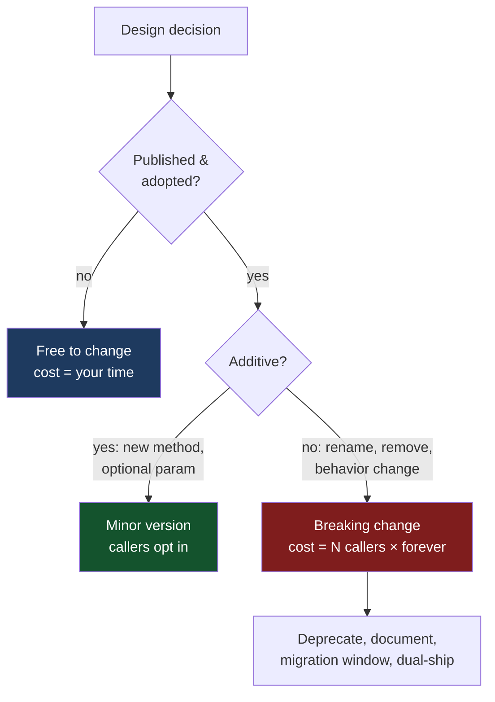

# API & Library Design — Professional Level

> Focus: the canon and the deep end. The cost theory of breaking changes, Hyrum's Law and the impossibility of a truly private detail, designing for evolution without paying for it up front, and how to *measure* whether an API is good. This is the provider's side of the contract, where "easy to use right, hard to use wrong" meets "APIs are forever."

---

## Table of Contents

1. [The canon: Bloch, Meyers, and the framework guidelines](#the-canon-bloch-meyers-and-the-framework-guidelines)
2. [APIs are forever — the asymmetry that governs everything](#apis-are-forever--the-asymmetry-that-governs-everything)
3. [Hyrum's Law: every observable behavior becomes a contract](#hyrums-law-every-observable-behavior-becomes-a-contract)
4. [The cost and theory of breaking changes](#the-cost-and-theory-of-breaking-changes)
5. [SemVer's promises and its limits](#semvers-promises-and-its-limits)
6. ["Don't break userspace" — Linux and Go as case studies](#dont-break-userspace--linux-and-go-as-case-studies)
7. [API as a language: least power, affordances, the pit of success](#api-as-a-language-least-power-affordances-the-pit-of-success)
8. [Designing for the future without premature extensibility](#designing-for-the-future-without-premature-extensibility)
9. [Minimize accessibility, fail fast, when in doubt leave it out](#minimize-accessibility-fail-fast-when-in-doubt-leave-it-out)
10. [Measuring API quality](#measuring-api-quality)
11. [Common Mistakes](#common-mistakes)
12. [Test Yourself](#test-yourself)
13. [Cheat Sheet](#cheat-sheet)
14. [Summary](#summary)
15. [Further Reading](#further-reading)
16. [Related Topics](#related-topics)

---

## The canon: Bloch, Meyers, and the framework guidelines

There is a small, dense body of work that every serious API designer eventually converges on. Read it in the original; the secondary summaries lose the nuance.

**Joshua Bloch — "How to Design a Good API and Why It Matters"** (OOPSLA 2006 talk; the companion to *Effective Java*). The talk distills a career at Sun designing the Java Collections Framework into a set of maxims that have not aged:

- *"APIs should be easy to use and hard to misuse."* The dual obligation. Ease alone is not enough — a footgun that is easy to fire is worse than a clumsy safety.
- *"When in doubt, leave it out."* You can always add; you can practically never remove. Surface area is a one-way ratchet.
- *"APIs, like diamonds, are forever."* Once published and adopted, the cost of removal is borne by every caller, forever.
- *"Minimize accessibility; make everything as private as possible."* Information hiding is not a style preference — it is the only thing that preserves your freedom to change.
- *"When in doubt, leave it out"* applies to *behavior* too: don't commit to behavior you might want to change.
- *"Don't make the client do anything the module could do."* Boilerplate forced on callers is a design defect.
- *"Fail fast — report errors as soon as possible after they occur."* Compile-time > construction-time > first-use > eventual corruption.

**Scott Meyers — "Make interfaces easy to use correctly and hard to use incorrectly"** (the headline guideline of *Effective C++*, Item 18, and his broader talks). Meyers' framing is the more useful one for design *reviews*: for every parameter, every overload, every return type, ask "what is the most plausible *wrong* thing a caller will type, and does the type system stop them?" His canonical example is a `Date(int month, int day, int year)` constructor — three `int`s in an order nobody remembers — versus `Date(Month::Jan, Day(30), Year(1995))`, where wrong-order and out-of-range arguments stop compiling. The type system is your cheapest test suite.

**The .NET Framework Design Guidelines** (Krzysztof Cwalina & Brad Abrams; the lived experience of Rico Mariani, Anders Hejlsberg, and the BCL team). This is the most operational of the three: concrete rules for naming, exceptions, members vs. extensibility, and crucially the *philosophy* that good design produces a **"pit of success"** — Rico Mariani's term for an API where "the natural way to use it is also the correct way." The opposite is a "pit of despair," where doing the obvious thing is subtly wrong.

These three traditions agree more than they differ. The synthesis: **the designer's job is to remove choices the caller would get wrong, and to defer every commitment that can be deferred.**

---

## APIs are forever — the asymmetry that governs everything

Every other principle in this chapter is a corollary of one fact: **adding to an API is cheap and reversible in practice; removing from it is expensive and, past a certain adoption threshold, effectively impossible.**

This asymmetry is not symmetric in time, either. The cost of a bad decision is not paid by you at design time — it is paid by your callers at every upgrade, multiplied by the number of callers, integrated over the lifetime of the API. A method you can delete in an afternoon today becomes, after a year and ten thousand dependents, a thing you can only deprecate and carry forever.

The practical consequences:

- **Publish the minimum.** Every public symbol is a promise. A `public` field, an exported function, an HTTP route, a JSON field name, an environment variable — each is part of the contract whether you intended it or not.
- **Make additions, not modifications.** New overloads, new optional parameters with defaults, new methods on new interfaces. Never repurpose an existing name.
- **Treat the first release as a draft you must live with.** Bloch's advice: write the client code *before* the API. If you cannot write three plausible client programs cleanly, the API is wrong, and now is the only cheap time to find out.



---

## Hyrum's Law: every observable behavior becomes a contract

> *"With a sufficient number of users of an API, it does not matter what you promise in the contract: all observable behaviors of your system will be depended on by somebody."* — Hyrum Wright (Google)

This is the single most important idea for anyone evolving an API at scale, and it is the most under-appreciated by people who have only *designed* APIs, not *changed* them under load. The documented contract is a lower bound on what you must preserve, not the whole of it.

What "observable" actually covers, in increasing order of surprise:

- The **iteration order** of a hash map you documented as "unordered." Someone has tests that assume insertion order. (Go *randomizes* map iteration order specifically to prevent this from calcifying — a deliberate Hyrum's-Law countermeasure baked into the runtime.)
- The **exact wording** of an error message, parsed by a downstream tool's regex.
- The **timing** — a call that "happened to be" synchronous; making it async breaks a caller who relied on completion-on-return.
- The **performance profile** — code that depended on an operation being O(1) breaks when you "improve" it to a different algorithm with worse constants.
- **Bug-for-bug compatibility** — callers who worked *around* your bug break when you fix it. (Famous in the Windows compatibility shim layer, which preserves bugs deliberately for shipped applications.)

The deep implication: **there is no such thing as a truly private implementation detail once you have enough users.** Privacy of a detail is not a property of the `private` keyword; it is a property of *unobservability*. If a detail can be observed — through reflection, through timing, through error text, through side-effect ordering — someone will depend on it, and your `private` keyword will not protect your freedom to change it.

Countermeasures, all about *deliberately injecting variance* to keep observable behavior from being depended upon:

- **Randomize what you don't promise.** Go's map order. Adding nondeterminism so no one can rely on a particular order.
- **Fuzz your own outputs in tests** to assert that callers can't be relying on incidental structure.
- **Version the wire format and the behavior, not just the symbols.** SemVer protects names; it does nothing for behavior unless you treat behavior changes as breaking.

```python
# Hyrum's Law in the wild: a "harmless" optimization that is a breaking change.

# v1.0 — naive, documented as "returns matching users"
def find_users(prefix: str) -> list[User]:
    # happens to scan the table in insertion order
    return [u for u in _all_users() if u.name.startswith(prefix)]

# v1.1 — "just a performance fix", now backed by an index
def find_users(prefix: str) -> list[User]:
    # index returns results in lexicographic order
    return _index.range_scan(prefix)

# Documented contract: unchanged ("returns matching users").
# Observable behavior: order changed.
# Result: every caller that did `find_users("a")[0]` expecting the
# *first inserted* match is now broken. By Hyrum's Law, some caller did.
```

---

## The cost and theory of breaking changes

A breaking change is any change that can turn a previously-working caller into a broken one. The taxonomy matters because the *kind* of break determines who finds out and when:

| Break type | Detected | Example |
|---|---|---|
| **Source-breaking** | At the caller's compile/lint time | Removed method; changed parameter type; renamed field |
| **Binary/ABI-breaking** | At link/load time | Changed method signature in a shared library; reordered struct fields in C |
| **Behavioral (semantic)** | At runtime, possibly in production, possibly silently | Same signature, different result; changed default; fixed a bug callers relied on |
| **Wire/protocol-breaking** | Across a network, between independently-deployed services | Removed JSON field; changed enum encoding; tightened validation |

Behavioral breaks are the most dangerous precisely because the type system and the linker are blind to them. They are the Hyrum's-Law breaks.

**The diamond-dependency problem ("version hell").** The structural reason breaking changes are so costly in an ecosystem: when app `A` depends on libraries `B` and `C`, and both `B` and `C` depend on `D` — but `B` needs `D@1` and `C` needs `D@2`, and `D@2` broke `D@1`'s API — there may be *no version of `D` that satisfies the graph*. The app cannot be built. This is the diamond dependency, and it is why a single irresponsible breaking release in a widely-depended-on library inflicts cost on packages that never even called the changed API.

Different ecosystems mitigate this differently, and the mitigation reveals the philosophy:

- **npm / Cargo:** allow *multiple versions* of the same dependency in one build (nested `node_modules`, Cargo's per-crate resolution). Cures the build failure at the cost of binary bloat and "two `Decimal` types that aren't `==`" surprises.
- **Maven / Go modules:** classically pick *one* version (Maven "nearest-wins"; Go's Minimal Version Selection picks the *lowest version that satisfies all requirements*). One version means smaller builds but resurrects diamond conflicts when majors are incompatible.
- **Go's escape hatch:** a breaking major version is a *new import path* (`example.com/lib/v2`). `v1` and `v2` are, to the compiler, *different packages* that can coexist. This sidesteps the diamond entirely by refusing to pretend `v2` is the same module as `v1`.

The economic model to internalize: **the cost of a breaking change ≈ (number of affected call sites) × (per-site migration effort) × (probability each owner ever does the migration), plus the long tail of un-migrated callers you must support or strand.** At a small library this is bounded. At the scale of a language runtime or a foundational framework, it is effectively unbounded, which is why those projects adopt "never break" rules.

---

## SemVer's promises and its limits

Semantic Versioning (`MAJOR.MINOR.PATCH`) is a *communication protocol*, not an enforcement mechanism. Its promise is precise:

- **PATCH** — backward-compatible bug fixes only.
- **MINOR** — backward-compatible additions (new features, deprecations).
- **MAJOR** — anything that breaks backward compatibility.

What SemVer actually buys you: a *resolver* (npm, Cargo, pip with constraints) can automatically take patches and minors, and refuse majors, *if and only if every publisher tells the truth.* That conditional is the whole game.

The limits — where SemVer quietly fails:

1. **It cannot detect Hyrum's-Law breaks.** A behavioral change that the author believes is a "patch" bug-fix is, to some caller, a breaking change. SemVer has no way to express "this is a bug fix that is also a breaking change," which is a *real and common* category. The author labels it `PATCH`; the resolver auto-installs it; production breaks. SemVer encodes the *author's intent*, not the *observable reality*.
2. **Major-version fatigue.** Strict adherence means a breaking change forces a major bump, and frequent majors are socially expensive (they imply instability), so authors are pressured to *sneak* breaks into minors/patches to avoid the bump — corrupting the very signal. This is the central tension SemVer cannot resolve by itself.
3. **`0.x` is a loophole.** Under `0.y.z`, "anything may change at any time." Vast numbers of widely-used packages live at `0.x` forever precisely to avoid the commitment of `1.0`. The protocol's strongest guarantees simply don't apply to them.
4. **It says nothing about *which* surface.** A change can be "breaking" for one usage pattern and invisible for another. SemVer is a single global number for a possibly-multi-faceted surface.

The professional posture: **SemVer is necessary, insufficient, and only as honest as the publisher.** Treat your *own* releases with the discipline SemVer assumes (run the old test suite against the new code; diff the public API mechanically — `cargo-semver-checks`, `japicmp`, `apidiff`, `go/apidiff`); treat *others'* SemVer as a hint, not a guarantee, and pin/lock accordingly.

---

## "Don't break userspace" — Linux and Go as case studies

Two of the most respected long-lived APIs in the world made the same radical choice: **never break your callers, full stop, even when it costs you.** Studying *why* clarifies the trade.

**The Linux kernel.** Linus Torvalds' "we do not break userspace" rule is absolute and frequently re-litigated on the LKML, always with the same verdict: a change that breaks a working userspace program is a kernel *bug*, to be reverted, no matter how "correct" the change is. The kernel's *internal* APIs change constantly and brutally (driver authors must keep up), but the **syscall boundary — the public API — is sacred.** The rationale is pure asymmetry economics: the kernel has effectively unbounded downstream callers it cannot coordinate with, so the cost of any break is unbounded, so no break is ever worth it. The cost of *not* breaking — carrying compatibility code forever — is bounded and known. Bounded cost beats unbounded cost.

**Go 1's compatibility promise.** Go made an explicit, written guarantee (the "Go 1 Compatibility" document): code that compiles under Go 1.0 will compile and run under every Go 1.x. They have largely kept it for over a decade, which is why Go upgrades are famously uneventful. Note the boundaries they drew to make an absolute promise *survivable*:
- The promise covers the *language and standard library*, not bugs, not security fixes, not unspecified behavior.
- Breaking changes are expressed as a *new major import path* (`/v2`), never a mutation of the existing one.
- Go later added **language version `go` directives** in `go.mod` and *opt-in* `GODEBUG` settings so that genuinely necessary behavior changes can ship *defaulted-off for old modules and on for new ones* — a mechanism that preserves "don't break userspace" while still allowing the language to evolve. This is the state of the art in compatibility engineering: change the default only at a version boundary the caller explicitly crossed.

The lesson is *not* "never change anything." It is: **draw the public boundary deliberately and narrowly, make it sacred, and put all your evolution machinery on the version-boundary mechanisms (major paths, opt-in flags) rather than on mutating the existing surface.**

---

## API as a language: least power, affordances, the pit of success

An API is a *language* you are designing for other programmers to write programs in. Three ideas from outside the OOP canon sharpen this.

**The Principle of Least Power** (Tim Berners-Lee, originally about web languages; generalizes perfectly). *Choose the least powerful mechanism that solves the problem.* A more powerful construct (a callback, a plugin, a Turing-complete config language) is more flexible for the caller but *less analyzable* for everyone — including future-you who wants to change the implementation. A declarative `RetryPolicy{MaxAttempts: 3, Backoff: Exponential}` is less powerful than `retry func(attempt int) (bool, Duration)`, and *that is the point*: the data form can be serialized, logged, validated, and changed without the caller noticing, while the callback form lets the caller depend on anything (Hyrum's Law again). Prefer enums to booleans, data to code, structured options to free-form strings.

**Affordances** (Don Norman, *The Design of Everyday Things*). A well-designed object's shape *suggests its correct use* — a door with a flat plate affords pushing, a door with a handle affords pulling. APIs have affordances too: the *shape of the type signature* should make the correct call the obvious one and the wrong call awkward or impossible. Meyers' rule is the affordance principle applied to types. If `transfer(from, to)` and callers keep swapping the arguments, the parameters have the wrong affordance — `transfer(from: AccountId, to: AccountId)` with named arguments, or distinct `SourceAccount`/`DestAccount` types, fixes the affordance.

**The pit of success** (Rico Mariani, popularized by Jeff Atwood). *"A well-designed system makes it easy to do the right things and annoying (not impossible) to do the wrong things."* The phrase is precise: not the "pinnacle of success" you must climb to, but a *pit* you fall into by default. Concretely:
- The constructor that compiles produces a *valid, usable* object (no "now call `init()`" two-step that callers forget — fail fast at construction).
- The default configuration is the *safe, correct* one (TLS on by default; timeouts set by default; the secure cipher list, not "any").
- The easiest method to reach is the one most callers should use; the dangerous one requires saying something explicit (`unsafe`, `ExpectAtLeastOnceDelivery()`, a `_force=True` keyword).

```java
// Affordance + pit of success: the type system makes the wrong call not compile,
// and the only constructible object is already valid (fail fast at construction).

// PIT OF DESPAIR: easy to misuse — order forgotten, units ambiguous, zero is "valid"
HttpClient c = new HttpClient(5000, 3, true, false);  // what are these?

// PIT OF SUCCESS: each argument self-describes; invalid states unrepresentable;
// the secure choice is the default, the dangerous one must be spoken aloud.
HttpClient c = HttpClient.builder()
    .connectTimeout(Duration.ofSeconds(5))   // type carries the unit
    .retries(MaxAttempts.of(3))              // named type, range-checked at construction
    .allowInsecureTls(false)                 // dangerous option is opt-IN and explicit
    .build();                                // returns a fully-valid object or throws
```

---

## Designing for the future without premature extensibility

The hardest balance in API design is between two true principles that pull in opposite directions.

- The **Open–Closed Principle** says modules should be open for extension, closed for modification — so add extension points.
- **"When in doubt, leave it out"** and the **Wrong Abstraction** warning say speculative generality is a cost you pay forever for a future that may never arrive.

Sandi Metz's rule cuts the knot: **"Prefer duplication over the wrong abstraction."** A premature extension point is *worse* than no extension point, because (a) it is public surface you must now support forever (asymmetry), (b) it constrains your implementation to honor an abstraction you invented before you understood the problem, and (c) ripping out a wrong abstraction once callers depend on it is a breaking change. The cost of waiting is a little duplication; the cost of guessing wrong is permanent.

Practical resolution:

1. **Default to closed.** Ship the concrete thing. `private`/unexported everything you can. Do not add a `Strategy` interface, a plugin hook, or a `protected` template method until you have *at least two real, divergent callers* demanding it. Two data points, not one speculation.
2. **When you do extend, make the extension point the *narrowest* thing that works** (Principle of Least Power). A single-method `interface` (a "SAM"/functional interface) commits you to less than an abstract base class with five overridable methods.
3. **Add extension *additively*.** A new optional `Option`, a new interface callers may implement, a new functional parameter with a default — none of these break existing callers, so they can be introduced in a minor version *when the need is proven*, not pre-emptively.
4. **Reserve, don't expose.** If you suspect future variation, leave *room* (an opaque options struct you can add fields to, a single context parameter, a reserved enum value) without committing to a *specific* extension shape. You keep the freedom without publishing a guess.

```go
// Reserve room for the future WITHOUT guessing the future.
// The functional-options pattern: callers pass behavior additively; the struct
// stays unexported (closed), and new options ship in minor versions when proven.

type Server struct {       // unexported fields — closed, free to change
    timeout time.Duration
    logger  Logger
    // future fields added here break NO caller
}

type Option func(*Server)  // the single, least-powerful extension point

func WithTimeout(d time.Duration) Option { return func(s *Server) { s.timeout = d } }
func WithLogger(l Logger) Option         { return func(s *Server) { s.logger = l } }

func NewServer(opts ...Option) *Server {
    s := &Server{timeout: 30 * time.Second, logger: defaultLogger} // safe defaults: pit of success
    for _, opt := range opts {
        opt(s)
    }
    return s
}

// Adding WithTLS(cfg) next year is a MINOR version: zero existing callers break.
// We never had to predict TLS to leave room for it.
```

---

## Minimize accessibility, fail fast, when in doubt leave it out

These three Bloch maxims are operational and worth stating as enforceable rules.

**Minimize accessibility.** Default everything to the most restrictive scope that compiles, then loosen only on proven demand. In Java: package-private over public, `final` classes by default, no `protected` without an extension story. In Go: unexported (lowercase) until a caller outside the package needs it. In Python: leading underscore convention plus `__all__` to define the *intended* surface (Python can't enforce, so the convention and `__all__` *are* the contract). The point is not paranoia — it's that **anything not public can be changed freely**, so the smaller the public set, the larger your freedom (and the weaker Hyrum's Law's grip, because fewer behaviors are observable to begin with).

**Fail fast.** Detect and report errors at the earliest possible moment, ordered by desirability:
1. **Compile time** — the best. Make illegal states unrepresentable (sum types/enums, distinct types, non-nullable types). The error never reaches a running program.
2. **Construction time** — validate invariants in the constructor/factory; never return a half-built object that fails on first use. (No "construct then `init()`" — that is a pit of despair.)
3. **Call time** — validate arguments at the public boundary and throw immediately, with a message naming the offending argument and the expectation.
4. **Worst: silent corruption** — accept bad input, return a plausible-but-wrong result, fail somewhere distant. This is the failure mode good APIs are designed to make impossible.

**When in doubt, leave it out.** The default answer to "should this be public?" is *no*. Every public symbol is a forever-promise; you can add later for free, remove later only at the asymmetry cost. This applies to methods, parameters, configuration knobs, return-type richness, and *guaranteed behaviors*. Ship the smallest thing that solves the real problem in front of you.

---

## Measuring API quality

"Good API" sounds subjective; much of it is measurable. A professional should be able to put numbers and instruments on it.

**Static / structural metrics:**

- **Public surface size** — count exported symbols (`go doc`, `javap`, `python -c "import x; print(x.__all__)"`). Track it over time; a monotonically growing surface with no removals is a smell (you're never saying no).
- **Mechanical API diff in CI** — `cargo-semver-checks` (Rust), `japicmp` / `revapi` (Java), `golang.org/x/exp/apidiff` (Go), `griffe` (Python). These *detect* source-breaking changes automatically and fail the build if a non-major version dares to break — turning SemVer honesty from a promise into an enforced gate.
- **Cyclomatic/parameter counts at the boundary** — methods with many parameters or boolean flags flag misuse-prone signatures (Meyers' affordance failures).

**Empirical / behavioral metrics:**

- **The "write the client first" test** (Bloch). Before shipping, write 3–5 real client programs against the proposed API. If they're awkward, the API is wrong. This is the single highest-value, lowest-cost technique in the chapter.
- **API usability studies** — Steven Clarke's work at Microsoft on *cognitive dimensions of APIs* (Abstraction Level, Learning Style, Working Framework, Penetrability, Premature Commitment) gives a vocabulary for *observing* developers using your API and *measuring* where they stall. Watching five engineers fail the same way is more diagnostic than any review.
- **Misuse rate in the wild** — grep public corpora (GitHub code search, your own monorepo) for callers of your API and count how many use it *wrong* (ignoring the error return, calling in the wrong order, passing the dangerous flag). A high misuse rate is a *design* defect, not a documentation defect — Meyers' point exactly. Go's `errcheck`, the `//go:` `lostcancel` vet check, and similar linters exist *because* certain API shapes are reliably misused.
- **Support/issue signal** — the questions repeated on your issue tracker and Stack Overflow are a free usability study. The same confusion from many people is a redesign signal.
- **Deprecation drag** — measure how long deprecated symbols linger and how many callers remain. Long tails quantify the asymmetry cost you incurred by publishing them in the first place.

The meta-point: **measure additions and removals over time, measure misuse, and watch real callers.** An API that grows without bound, is misused in the corpus, and generates the same support questions is failing regardless of how elegant the docs claim it is.

---

## Common Mistakes

- **Treating `private`/unexported as a guarantee of changeability.** Hyrum's Law: if a behavior is *observable* (timing, error text, ordering, reflection-reachable), someone depends on it. Accessibility limits *who can name it*, not *who can depend on its behavior*.
- **Labeling a behavioral change as PATCH because the signature didn't change.** Semantic breaks are the most dangerous breaks precisely because the compiler and resolver can't see them. If observable behavior changed, it's breaking — bump accordingly or gate behind an opt-in.
- **Adding extension points "for flexibility" before two real callers need them.** Premature extensibility is permanent surface for a hypothetical future — the wrong abstraction you now must support forever. Prefer duplication until the variation is proven.
- **Booleans and bare primitives in signatures.** `create(true, false, 30)` is unreadable and swap-prone. Enums, named types, and options structs turn misuse into a compile error (Meyers).
- **Returning half-built objects (construct-then-`init`).** Violates fail-fast: the error surfaces at first use, far from the cause. Validate in the constructor or return an error from the factory.
- **Reusing/repurposing an existing public name for new meaning.** This is a behavioral break disguised as no change. Add a new name; deprecate the old.
- **Shipping `1.0` without writing client code first.** The first release is the one you can least afford to get wrong (asymmetry), and it's the cheapest time to discover it's wrong. Write the callers before you freeze the API.
- **Leaking internal types through the public surface** (returning a concrete internal class, an implementation enum, an ORM entity). Callers couple to your internals; you've published your implementation by accident.

---

## Test Yourself

1. **Why is "minimize accessibility" a *change-management* tool, not just a style rule?**
   <details><summary>Answer</summary>Anything not public can be changed without breaking any caller — because no caller can name or (ideally) observe it. The smaller the public set, the larger your freedom to evolve the implementation. Combined with Hyrum's Law: a smaller, less-observable surface means fewer behaviors that someone can come to depend on, which directly preserves your ability to change them. Accessibility minimization is the cheapest insurance against the forever-cost of public surface.</details>

2. **A library improves a function from O(n²) to O(n log n) with identical results. Is this a breaking change?**
   <details><summary>Answer</summary>By the documented contract, no. By Hyrum's Law, possibly yes — a caller may depend on the *old* performance profile (e.g., a downstream throttle tuned to the old latency, or a caller relying on the old algorithm's incidental ordering/stability). Performance and ordering are observable behaviors. SemVer can't see it; it's a behavioral break for some caller. Ship it, but be aware that "pure improvement" is a myth at sufficient scale.</details>

3. **SemVer says PATCH = backward-compatible bug fix. Why is the category "bug fix that is also a breaking change" both real and unrepresentable in SemVer?**
   <details><summary>Answer</summary>A bug fix changes observable behavior by definition (the buggy behavior is no longer produced). Any caller who relied on the buggy behavior (Hyrum's Law, "bug-for-bug compatibility") is broken by the fix. SemVer has one axis (the author's intent: fix vs. feature vs. break) and cannot encode "this is a fix AND it breaks someone." The honest move is to treat behavior-changing fixes as breaking (major) or gate them behind an opt-in flag (Go's `GODEBUG` model).</details>

4. **Linux "never breaks userspace" but breaks internal driver APIs constantly. Reconcile these.**
   <details><summary>Answer</summary>The two surfaces have different cost structures. The syscall boundary (the *public* API) has unbounded, uncoordinatable downstream callers — so a break has unbounded cost and is never worth it. Internal driver APIs have a bounded, *coordinatable* set of callers (in-tree drivers the kernel team can fix in the same commit) — so a break has bounded, payable cost. The rule isn't "never change anything"; it's "draw the public boundary narrowly and make *that* boundary sacred."</details>

5. **You're tempted to add a `Strategy` interface to allow future algorithm swapping. There's exactly one algorithm and one caller today. What's the senior call, and why?**
   <details><summary>Answer</summary>Don't add it. One caller is speculation, not evidence — "when in doubt, leave it out." The interface is permanent public surface (asymmetry cost) that also constrains your implementation to an abstraction you invented before understanding the variation (Metz's "wrong abstraction" risk). Ship the concrete thing, unexported where possible. When a *second, genuinely divergent* caller appears, introduce the narrowest extension point additively in a minor version. Cost of waiting: a little duplication. Cost of guessing wrong: a permanent, supported, hard-to-remove mistake.</details>

6. **How would you *measure* whether an API is "hard to use wrong" rather than just asserting it is?**
   <details><summary>Answer</summary>Multiple instruments: (a) grep a real corpus (your monorepo, GitHub code search) for callers and count the misuse rate — wrong order, ignored errors, dangerous flag set; high misuse is a *design* defect (Meyers). (b) Run a small usability study — watch 5 engineers use it cold (Clarke's cognitive-dimensions framework) and note where they stall. (c) The "write the client first" test before shipping. (d) Track public-surface growth and deprecation drag over time. (e) Watch repeated issue-tracker/SO questions — same confusion from many people is a redesign signal. Misuse is observable and countable; "elegant" is not.</details>

7. **Why does the Principle of Least Power argue for passing a data-shaped `RetryPolicy` over a `func(attempt) (retry bool, delay Duration)` callback?**
   <details><summary>Answer</summary>The callback is more powerful: the caller can run arbitrary code, depend on anything in scope, and observe call timing and frequency — which by Hyrum's Law means they *will* depend on your internal retry schedule, freezing your implementation. The data form (`RetryPolicy{MaxAttempts, Backoff}`) is the least power that solves the problem, and that is the benefit: it can be serialized, logged, validated, defaulted, and *changed* without the caller noticing, because the caller can only express the limited vocabulary you defined. Least power maximizes the designer's future freedom.</details>

8. **Go encodes a breaking major version as a new import path (`/v2`) rather than mutating the module in place. What problem does this solve that a version *number* alone does not?**
   <details><summary>Answer</summary>The diamond-dependency problem. If `B` needs `D@1` and `C` needs `D@2` and they're "the same module," a single-version resolver (Go's MVS, Maven) cannot satisfy both — there's no buildable graph. By making `/v2` a *different import path*, `v1` and `v2` become distinct packages that coexist in one build; `B` keeps importing `…/d` and `C` imports `…/d/v2`. The major version stops being a constraint to reconcile and becomes two independent things. It's the compatibility-engineering trick that lets Go keep "don't break userspace" while still allowing incompatible evolution.</details>

---

## Cheat Sheet

| Principle | Rule | Source |
|---|---|---|
| Dual obligation | Easy to use right; hard to use wrong | Bloch; Meyers |
| Asymmetry | Adding is cheap; removing is forever — "APIs are forever" | Bloch |
| Restraint | "When in doubt, leave it out" | Bloch |
| Information hiding | Minimize accessibility; private by default | Bloch; Parnas |
| Error timing | Fail fast: compile > construct > call > silent corruption | Bloch |
| Affordance | The type signature should make the correct call obvious | Meyers; Norman |
| Pit of success | The natural way is the correct way; safe defaults | Mariani; Abrams |
| Least power | Pick the least powerful mechanism (data > code, enum > bool) | Berners-Lee |
| Hyrum's Law | Every observable behavior *will* be depended upon | Hyrum Wright |
| Evolution | Default closed; extend additively, only on proven (2+) demand | Metz; OCP |
| Wrong abstraction | "Prefer duplication over the wrong abstraction" | Metz |
| Compatibility | Draw the public boundary narrowly; make it sacred | Linux; Go 1 |
| Versioning | SemVer is honest signaling, not enforcement; gate behavior changes | SemVer spec |

**Pre-publish checklist:**

- [ ] Wrote 3–5 real client programs against the API *first*; they read cleanly.
- [ ] Public surface is the minimum that solves the actual problem (no speculative knobs/hooks).
- [ ] No booleans/bare primitives where a named type or enum prevents misuse.
- [ ] Constructors/factories return fully-valid objects or fail loudly (no construct-then-`init`).
- [ ] Defaults are the safe, correct choice; dangerous options are opt-in and explicitly named.
- [ ] No internal types leak through the public surface.
- [ ] CI runs a mechanical API diff (`apidiff`/`japicmp`/`cargo-semver-checks`) gating versions.
- [ ] Breaking changes go through deprecation + a major bump (or a new `/v2` path / opt-in flag).
- [ ] Deliberately randomized/varied any behavior you do *not* want callers depending on.

---

## Summary

API design is the discipline of managing an asymmetry: additions are cheap and reversible, removals and behavioral changes are expensive and — past adoption — effectively permanent. The canon (Bloch's "easy to use, hard to misuse" and "when in doubt leave it out"; Meyers' affordance rule; the .NET guidelines' "pit of success") all reduce to two imperatives: **remove the choices callers get wrong, and defer every commitment you can defer.**

Hyrum's Law is the hard truth underneath all of it: with enough users, every *observable* behavior becomes a contract, so "private" is a property of unobservability, not of a keyword. That reframes versioning (SemVer signals the author's intent but cannot see behavioral breaks), evolution (default closed; extend additively only on proven demand, because the wrong abstraction is worse than duplication), and compatibility (Linux and Go draw the public boundary narrowly and make it sacred, putting all evolution on version-boundary mechanisms rather than mutation). Treat the API as a language, prefer the least powerful construct, build a pit of success with safe defaults — and then *measure*: surface growth, mechanical API diffs in CI, misuse rate in a real corpus, and the questions real callers keep asking. Elegance is asserted; misuse is counted.

---

## Further Reading

- Joshua Bloch — *How to Design a Good API and Why It Matters* (OOPSLA 2006 talk; slides and video widely mirrored).
- Joshua Bloch — *Effective Java*, 3rd ed., Chapter 4 (Classes & Interfaces) and Item 49–56 (Methods / API design).
- Scott Meyers — *Effective C++*, 3rd ed., Item 18: "Make interfaces easy to use correctly and hard to use incorrectly."
- Krzysztof Cwalina & Brad Abrams — *Framework Design Guidelines* (the .NET BCL team's distilled practice; "pit of success" annotations by Rico Mariani et al.).
- Hyrum Wright — *Hyrum's Law* (hyrumslaw.com) and *Software Engineering at Google* (Winters, Manshreck, Wright), chapters on dependency management and large-scale changes.
- The Go Team — *Go 1 and the Future of Go Programs* (the compatibility promise) and *Backward Compatibility, Go 1.21, and Go 2* (GODEBUG / version-gated defaults).
- Linus Torvalds — LKML threads on "we do not break userspace" (the canonical kernel-stability rule).
- Semantic Versioning specification — semver.org (read the FAQ on its limits).
- Sandi Metz — *The Wrong Abstraction* (sandimetz.com): "prefer duplication over the wrong abstraction."
- Tim Berners-Lee — *The Principle of Least Power* (W3C TAG finding).
- Steven Clarke — *Measuring API Usability* (Dr. Dobb's) and the Cognitive Dimensions of Notations framework.
- Don Norman — *The Design of Everyday Things* (affordances and signifiers).

---

## Related Topics

- [senior.md](senior.md) — the practical playbook: SemVer mechanics, deprecation paths, builder/options patterns, designing errors into the contract.
- [interview.md](interview.md) — Q&A across all levels for interview prep.
- [Chapter README](../README.md) — the positive rules and the full anti-pattern list.
- [Boundaries](../07-boundaries/README.md) — the *consumer's* side: insulating yourself from third-party APIs you don't control.
- [Abstraction & Information Hiding](../22-abstraction-and-information-hiding/README.md) — the internal-quality counterpart to this chapter's external-contract focus.
- [Design Patterns](../../design-patterns/README.md) — Builder, Factory, Strategy, and the structural patterns that recur as API-shaping tools.

