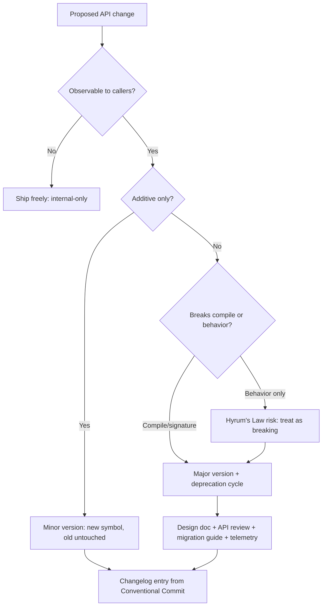

# API & Library Design — Senior Level

> Focus: "How do we govern an API that other teams depend on?" — versioning and compatibility policy, review processes, evolving without breaking, contract tests, and the real cost of a breaking change to everyone downstream.

---

## Table of Contents

1. [The senior shift: from authoring to governing](#the-senior-shift-from-authoring-to-governing)
2. [Versioning and compatibility policy](#versioning-and-compatibility-policy)
3. [The compatibility contract: what you may and may not change](#the-compatibility-contract-what-you-may-and-may-not-change)
4. [Deprecation as a process, not an event](#deprecation-as-a-process-not-an-event)
5. [Evolving without breaking](#evolving-without-breaking)
6. [API review processes](#api-review-processes)
7. [Contract tests for published APIs](#contract-tests-for-published-apis)
8. [Documentation is part of the API](#documentation-is-part-of-the-api)
9. [Telemetry: learn how the API is actually used](#telemetry-learn-how-the-api-is-actually-used)
10. [The wire-API analog (REST / gRPC)](#the-wire-api-analog-rest--grpc)
11. [SDK ergonomics across languages](#sdk-ergonomics-across-languages)
12. [The cost of a breaking change](#the-cost-of-a-breaking-change)
13. [Common Mistakes](#common-mistakes)
14. [Test Yourself](#test-yourself)
15. [Cheat Sheet](#cheat-sheet)
16. [Summary](#summary)
17. [Further Reading](#further-reading)
18. [Related Topics](#related-topics)

---

## The senior shift: from authoring to governing

A junior writes a good function signature. A middle engineer designs a coherent module surface. The senior owns an API **as a long-lived contract with people they will never meet**.

The defining constraint changes. At the authoring level the question is "is this easy to use right?" At the governing level it becomes: "every name, type, default, and observable behavior I ship is now load-bearing for code I cannot see, cannot test, and cannot patch." You no longer optimize a single decision — you optimize the **rate of change** the surface can sustain without breaking its consumers.

This reframes everything:

- A name is not a label; it is a 5-year commitment.
- A default is not a convenience; it is the behavior 90% of callers will never override, so it is *the* behavior.
- A returned concrete type is not an implementation detail; it is a constraint on every refactor you will ever want to make.
- An undocumented behavior is not free to change — see Hyrum's Law below.



> **Hyrum's Law** (Hyrum Wright, Google): *"With a sufficient number of users of an API, it does not matter what you promise in the contract: all observable behaviors of your system will be depended on by somebody."* Iteration order of a "set," the exact text of an error message, the timing of a callback — someone has wired their code to it. Governing an API means assuming this is true.

---

## Versioning and compatibility policy

### SemVer is a promise, not a build-number scheme

[Semantic Versioning](https://semver.org/) `MAJOR.MINOR.PATCH` is a **machine-readable contract about breakage**:

| Bump | Means | Caller can | Examples |
|---|---|---|---|
| **PATCH** (`1.4.2 → 1.4.3`) | Backward-compatible bug fix | Upgrade blindly | Fix a crash, tighten an internal loop |
| **MINOR** (`1.4.3 → 1.5.0`) | Backward-compatible **addition** | Upgrade blindly | New function, new optional field, new enum value (with care) |
| **MAJOR** (`1.5.0 → 2.0.0`) | Backward-**incompatible** change | Must read migration guide | Removed method, changed signature, changed default |

The failure mode that erodes all trust: shipping a breaking change in a PATCH. Once a consumer is burned by `1.4.3` breaking their build, they pin `=1.4.2` forever and stop receiving your security fixes. **The version number is only as valuable as your discipline in respecting it.**

### The Go 1 compatibility promise — the gold standard to emulate

Go's compatibility guarantee is the model worth studying: *"programs that work today should continue to work with future point releases of Go 1."* It is strong enough that Go deliberately accepts living with design mistakes (e.g., the original `time` API quirks) rather than break the world. Lessons to internalize:

- A compatibility promise is **a business asset**. It is why people adopt the platform.
- The promise is *narrowly scoped and explicit* about exceptions (security fixes, undefined behavior, bugs that violate the spec). Vague promises are worse than none.
- Major-version migration is made *opt-in* via the import path: `module/v2` is a different import than `module`. Go modules encode the major version in the path precisely so `v1` and `v2` can coexist in one build graph. **This is the single most important structural idea for breaking changes: make the new major a different name, not a replacement.**

```go
// go.mod for a v2 — the /v2 suffix makes it a distinct module.
module github.com/acme/widgets/v2

go 1.22
```

```go
// A v1 consumer and a v2 consumer can coexist in the same program:
import (
    widgets    "github.com/acme/widgets"     // v1
    widgetsv2  "github.com/acme/widgets/v2"   // v2
)
```

### Language-specific versioning surfaces

| Language | Where the version lives | Coexistence story |
|---|---|---|
| **Go** | `go.mod` module path (`/v2`) + Git tags `v1.5.0` | Major versions are different import paths; both can be in one build |
| **Java** | Maven/Gradle GAV coordinates; `module-info.java` for JPMS | Repackage on major bump (`com.acme.widgets` → `com.acme.widgets2`) or rely on classpath conflict resolution (fragile) |
| **Python** | `pyproject.toml` version; constraints in `install_requires` | No path-based coexistence; one version per environment — breaking changes are far more painful, so deprecate longer |

> **Python's structural weakness:** because two versions of a package cannot coexist in one interpreter, a breaking change forces the *entire* dependency tree to migrate at once ("dependency hell"). This is why the Python ecosystem leans harder on long deprecation windows and `DeprecationWarning`. Design Python APIs as if you can *never* cleanly do a v2.

---

## The compatibility contract: what you may and may not change

A senior keeps a precise mental (and written) model of what is safe. Categorize every change before shipping.

### Backward compatibility (don't break existing callers)

**Safe (additive):**

- Add a new function, method, type, or package.
- Add an *optional* parameter with a default (where the language supports it — Python kwargs, Go functional options, Java overloads/builders).
- Add a field to a *response*/output struct (callers ignore unknown fields — usually).
- Widen an accepted input (accept more than before).
- Relax a precondition (require less than before).

**Breaking (needs a major version):**

- Remove or rename any exported symbol.
- Change a function signature (parameter count, type, order, return type).
- Add a *required* parameter.
- Narrow an accepted input or strengthen a precondition.
- Change a default value (silent behavior change — the worst kind).
- Change the *type* of an exported field.
- Change observable behavior others depend on (Hyrum's Law).

### Forward compatibility (old code tolerates new data)

Forward compatibility — old binaries gracefully handling data produced by newer ones — is mostly a wire concern but has code analogs:

- **Enums are the classic trap.** Adding an enum value is "additive" for the producer but **breaking for any consumer that has an exhaustive `switch`** with no default. Protobuf solves this by making consumers carry unknown values through; in code, either reserve a `default`/`Unknown` case in the contract from day one, or treat new enum values as a major change. Document which.

```go
// Forward-compatible enum handling: the contract REQUIRES a default arm.
switch status {
case StatusActive:   return handleActive()
case StatusPending:  return handlePending()
default:             return handleUnknown(status) // tolerates future values
}
```

```java
// Java: prefer a sealed-with-default discipline, or document that switches
// over public enums MUST have a default. Adding RETIRED later won't break callers.
String render(Status s) {
    return switch (s) {
        case ACTIVE  -> "active";
        case PENDING -> "pending";
        default      -> "unknown"; // forward-compatible
    };
}
```

---

## Deprecation as a process, not an event

Deleting a method is an event. **Deprecation is a multi-release process** that gives downstream teams a runway. The deprecation contract is: *announce → warn → wait → remove*, with the wait measured in releases or calendar time, never less.

### Machine-readable deprecation markers

Use the language's first-class deprecation mechanism so tooling (IDEs, linters, compilers) surfaces it automatically — comments alone are invisible.

```go
// Deprecated: use NewClientWithOptions instead. NewClient will be removed in v3.
// The exact prefix "Deprecated:" is recognized by gopls, staticcheck, and pkg.go.dev.
func NewClient(addr string) *Client { ... }
```

```java
/**
 * @deprecated Use {@link #connect(ConnectOptions)} instead.
 *             Scheduled for removal in 3.0 (≈ 2026-Q4).
 */
@Deprecated(since = "2.4", forRemoval = true)
public void connect(String host, int port) { ... }
```

```python
import warnings

def connect(host: str, port: int) -> Conn:
    warnings.warn(
        "connect(host, port) is deprecated; use connect(ConnectOptions(...)). "
        "Removal in 4.0.",
        DeprecationWarning,
        stacklevel=2,  # so the warning points at the CALLER, not this line
    )
    ...
```

### A deprecation policy that downstream teams can plan around

A written, predictable policy beats case-by-case mercy. A workable default:

1. **Announce** in the release notes/changelog with the replacement and the *target removal version*.
2. **Mark** with the language deprecation annotation in the *first* release.
3. **Wait** a stated minimum — e.g., "at least two minor releases and 6 months," or for an internal platform, "one deprecation appears in N consecutive releases." Pick a number and publish it.
4. **Provide the migration path before you deprecate**, not after. Never deprecate something with no replacement.
5. **Remove only on a MAJOR bump**, and only after the wait.

> **Internal vs. external cadence.** A library on a public registry must assume consumers upgrade slowly; deprecation windows run quarters. A monorepo platform team can move faster because they can *find and fix every caller themselves* (large-scale change / "LSC" tooling). Match the window to your ability to see and migrate consumers.

---

## Evolving without breaking

Six techniques, roughly in order of preference (prefer the ones that never break anyone):

### 1. Additive changes (always first choice)

Add the new thing; leave the old thing alone. New optional parameter? In Go, add a functional option, not a parameter. In Python, add a keyword-only argument with a default. In Java, add an overload.

```go
// Functional options are THE Go idiom for additive evolution.
// Adding WithTimeout later requires zero changes to existing call sites.
func NewServer(addr string, opts ...Option) *Server { ... }

type Option func(*config)

func WithTimeout(d time.Duration) Option { return func(c *config) { c.timeout = d } }
func WithTLS(cfg *tls.Config) Option     { return func(c *config) { c.tls = cfg } }
```

### 2. Expand–contract (parallel change)

To change something that *is* observable, do it in three phases across releases so no single release breaks:

1. **Expand:** introduce the new form alongside the old. Both work.
2. **Migrate:** move callers to the new form (yourself if internal; via deprecation warnings if external).
3. **Contract:** remove the old form — on a major bump.

This is the same shape as a zero-downtime database migration, and the same shape as Branch by Abstraction. The release that does the dangerous part (contract) is the *last* one, gated behind a major version.

### 3. Parallel versions (`v1` + `v2` side by side)

When the new design is incompatible enough that expand–contract within one package is ugly, ship a whole new major that coexists (Go's `/v2`, a repackaged Java artifact). Consumers migrate on their own schedule. You maintain both until `v1` reaches end-of-life.

### 4. Feature-gating experimental APIs

Don't let an unfinished API become a forever-supported contract. Mark it experimental so Hyrum's Law doesn't ossify it:

- **Naming:** package/symbol named `experimental`/`internal`/`unstable`, or a `// EXPERIMENTAL:` doc marker.
- **Java:** `@Beta` (Guava) or JDK *preview features* requiring `--enable-preview`.
- **Python:** ship behind a `from mylib.experimental import ...` import or require an explicit opt-in flag.
- **Go:** put it under an `internal/` path (uncallable by outsiders) until stable, or name the package clearly.

> Make the instability *impossible to ignore*. A `@Beta` annotation that nobody sees becomes a de-facto stable API the day a popular tutorial uses it.

### 5. Tolerant reading

When consuming data you also produce (config, serialized state), read leniently: ignore unknown fields, accept missing optional fields, never crash on a value you don't recognize. This is what buys you forward compatibility.

### 6. Compatibility shims

When you must change internals, keep the old surface as a thin adapter delegating to the new implementation. The shim carries the deprecation marker; the real code moves on.

---

## API review processes

At team scale, API design is not a solo act. The most expensive defects are the ones baked into a public surface, because they are the ones you can't take back.

### Design docs before code

For any new public API (or a major addition), write a short design doc *before* implementation. Google's "design doc" culture is the reference: a 1–6 page document covering the problem, the proposed surface (with sample call sites), alternatives considered, and the compatibility/evolution story. **Reviewing a doc is 100× cheaper than reviewing a shipped API.** The single highest-leverage section is "here is what calling this looks like" — designing from the caller in.

### A dedicated API review

Google's internal **API review** (described in *Software Engineering at Google*) routes every new public API through a small group of reviewers focused only on API quality, not implementation. The value is consistency and an outside eye that asks "does this match the 200 other APIs in the platform?" Lightweight version for a normal team: a `CODEOWNERS` rule that requires a designated API owner to approve any change to public-package files.

```
# .github/CODEOWNERS — force review of the public surface.
/pkg/api/        @acme/api-stewards
/sdk/**/public/  @acme/api-stewards
```

### An API style guide

Codify the conventions so reviews argue about substance, not taste: naming (verbs for actions, nouns for resources), argument order, error shape, pagination shape, null/optional handling, units in names (`timeoutMillis`). Reference points: Google's API Improvement Proposals ([AIPs](https://google.aip.dev/)), the Go [proverbs](https://go-proverbs.github.io/) and "what's idiomatic Go," and your own ADRs. A style guide turns "I don't like it" into "it violates rule 7."

### The review checklist a steward applies

- Is this the **minimal** surface that solves the problem? (Every public symbol is forever.)
- Can it be **misused easily**? (Boolean params, wrong-order args, easy-to-confuse types.)
- Does it **leak internal types**? (Return interfaces/DTOs, not internals.)
- Is the **error contract** explicit and stable?
- How will this **evolve**? Is there room to add without breaking?
- Is there a **godoc/Javadoc/docstring + a runnable example**?

---

## Contract tests for published APIs

Unit tests verify your implementation. **Contract tests verify your promise.** They are the executable form of the compatibility policy.

### Golden / signature tests for the surface itself

Snapshot the public surface and fail the build if it changes without an intentional update. This catches accidental breaking changes at PR time.

- **Go:** `go/packages` + a golden file of exported symbols; or `apidiff` (`golang.org/x/exp/cmd/apidiff`) which classifies a diff as *compatible* or *incompatible*.

```bash
# apidiff tells you exactly whether a change is breaking.
apidiff old.api new.api
# Output:
# Incompatible changes:
# - Client.Connect: changed from func(string) error to func(string, int) error
```

- **Java:** [japicmp](https://siom79.github.io/japicmp/) or the **Revapi** Maven plugin — fail the build on source/binary-incompatible changes; integrate with the version bump (incompatible change found but only a MINOR bump declared → build fails).
- **Python:** `griffe check` (used by `mkdocstrings`) detects API breakages between two versions; pair with a golden `__all__` snapshot.

### Behavioral contract tests

For published *behavior* (not just signatures): write tests from the consumer's perspective that encode every documented guarantee — error types returned, ordering guarantees you *do* promise, idempotency, default values. These tests are the line between "documented contract" and "Hyrum's Law accident." If a behavior isn't covered by a contract test, you haven't actually decided whether it's part of the contract.

### Consumer-driven contracts (the wire analog)

For service APIs, tools like **Pact** let consumers publish the subset of your API they actually use; your CI then verifies you haven't broken *those* expectations. This is contract testing scaled to teams — the provider learns, mechanically, which parts of the surface are load-bearing.

---

## Documentation is part of the API

If a behavior isn't documented, you haven't decided whether it's a contract — so consumers will decide for you (Hyrum's Law). Docs are not an afterthought; they are *where the contract lives*.

### Doc comments as a build artifact

- **Go:** `godoc`/`pkg.go.dev` renders exported doc comments. Convention: start with the symbol name (`// Client connects to ...`). The `Deprecated:` prefix is parsed. Example functions (`func ExampleClient_Connect()`) are *compiled and run by `go test`* — documentation that cannot rot.

```go
// ExampleClient_Get is shown verbatim on pkg.go.dev AND run as a test.
func ExampleClient_Get() {
    c := widgets.NewClient("localhost:8080")
    w, _ := c.Get(context.Background(), "w-123")
    fmt.Println(w.Name)
    // Output: gadget
}
```

- **Java:** Javadoc with `@param`, `@return`, `@throws`, `{@code}`, `{@link}`. Document the *contract* (preconditions, what exceptions mean, thread-safety), not the obvious.
- **Python:** docstrings (Google or NumPy style) + type hints; rendered by Sphinx/mkdocstrings. `doctest` runs examples in docstrings as tests.

### Changelogs from Conventional Commits

A changelog is the human-readable diff of the contract. Generate it mechanically from [Conventional Commits](https://www.conventionalcommits.org/) so it never drifts and so the version bump is *automatic*:

| Commit prefix | Changelog section | SemVer effect |
|---|---|---|
| `fix:` | Bug Fixes | PATCH |
| `feat:` | Features | MINOR |
| `feat!:` or `BREAKING CHANGE:` footer | Breaking Changes | MAJOR |

Tools (`semantic-release`, `release-please`, `git-cliff`, `commitizen`) read the commit log, compute the next version, and write the changelog. The discipline: the **commit message *is* the compatibility declaration**, reviewed at PR time. A `feat!:` in a PR is a visible, reviewable claim "this breaks people."

---

## Telemetry: learn how the API is actually used

You cannot govern what you cannot see. The most dangerous deprecation is the one where you guessed wrong about whether anyone uses the old path.

- **Public library:** you can't instrument consumers' runtimes, but you *can* read signal — download stats by version (npm/PyPI/Go module proxy), GitHub code search for call sites, issue trackers. Before removing `v1`, check the proxy: is anyone still pulling it?
- **Internal platform / SDK with callbacks:** emit usage telemetry (which methods, which deprecated paths, which optional params) so you know — with data, not opinion — what is safe to remove and where the migration backlog is. A "deprecated-call counter" hitting zero is the green light to delete.
- **Service API:** per-endpoint, per-version request metrics are mandatory. Sunset a version only when its traffic is near zero (and you've notified the long tail).

> The senior move: **never delete on faith.** "Nobody uses this" is a hypothesis; telemetry or registry data is the test. Many a postmortem starts with "we removed the endpoint no one was supposed to be using anymore."

---

## The wire-API analog (REST / gRPC)

This chapter is code-level, but every principle above has a direct wire-API twin — and many teams own both. The parallels (cover the wire details properly in the API-design system-design material; here, note the mapping):

| Code-level concept | REST analog | gRPC / Protobuf analog |
|---|---|---|
| SemVer major | `/v2/` URL prefix or version header | New package / `service` version |
| Additive change | New optional query param / response field | New field with a new tag number |
| Breaking change | Removing a field, changing a type | Reusing/renumbering a tag, changing a type |
| `Deprecated:` marker | `Deprecation` + `Sunset` HTTP headers (RFC 8594) | `[deprecated = true]` field option |
| Forward compat (enums) | Tolerant JSON reading; ignore unknown fields | Unknown fields preserved; closed-vs-open enums |
| Contract test | OpenAPI schema diff; Pact | `.proto` compatibility check (`buf breaking`) |
| Style guide | Company REST guidelines | Google AIPs, `buf lint` |

> **The Protobuf field-number rule is the cleanest model of compatibility there is:** a field's *tag number* is its identity forever. You may rename the field (the name is cosmetic), you may stop using it (mark it `reserved`), but you may **never** reuse a tag number for a different field. Adopting "every field/symbol has a permanent identity you can retire but not recycle" mindset prevents most wire breakages — and it's a healthy lens for code APIs too.

---

## SDK ergonomics across languages

When you publish the *same* API as SDKs in Go, Java, and Python, "consistent" does not mean "identical." It means **idiomatic in each, predictable across all**. A Java developer should feel at home; a Python developer should feel at home; both should be able to read the other's code and recognize the same operations.

| Concern | Go | Java | Python |
|---|---|---|---|
| Optional config | Functional options (`WithX`) | Builder | Keyword args with defaults / a dataclass options object |
| Errors | `error` return values, sentinel + `errors.Is`/`As` | Checked/unchecked exceptions, typed hierarchy | Exception hierarchy rooted at a base `MyLibError` |
| Async | `context.Context` + goroutines | `CompletableFuture` | `async`/`await`; offer both sync and async clients |
| Naming | `MixedCaps`, short | `camelCase`, descriptive | `snake_case` |
| Nullability | zero values, explicit pointers | `Optional<T>` | `None` + type hints |

Cross-SDK consistency to enforce: same *operation names* (modulo casing), same *resource model*, same *error categories*, same *pagination shape*, same *auth flow*. Generate as much as possible from one source of truth (an OpenAPI/Protobuf spec) so the SDKs cannot drift apart, then hand-polish the ergonomic layer.

---

## The cost of a breaking change

The senior internalizes the *blast radius*, because it's almost always larger than it looks from inside the team.

For a public library with `N` downstream projects, a breaking change costs roughly:

```
total_cost ≈ N × (read_migration_guide + edit_call_sites + test + review + release)
           + (your maintenance of two majors during the window)
           + (trust_erosion → slower future upgrades, version pinning)
           + (long tail that NEVER migrates → forked, vulnerable, stuck)
```

The invisible terms dominate. Concretely:

- **It's `N`-fold work, paid by others.** You write the change once; `N` teams pay to absorb it. A 10-minute change for you can be 10 minutes × hundreds of repos.
- **Trust is the real currency.** One unexpected break and consumers pin exact versions, which means they stop getting your security patches — your breaking change made *everyone less secure*.
- **The long tail never moves.** Some consumers will be on the old major years later. You either support it forever or abandon them (and they fork, or stay vulnerable).
- **Coordination cost is super-linear** inside an org: a breaking change to a shared internal library can block dozens of teams' releases until they all migrate.

This is why the entire toolkit above exists: additive-first, expand–contract, parallel majors, deprecation windows, telemetry. **The cheapest breaking change is the one you designed your way out of needing.** When a break is genuinely unavoidable, the senior's job is to minimize `N`'s pain: clear migration guide, codemod/automated rewrite where possible, generous window, and loud, early, machine-readable signaling.

---

## Common Mistakes

- **Shipping a breaking change in a MINOR or PATCH.** The single fastest way to lose all the value of your version numbers. Once burned, consumers pin and stop upgrading.
- **Deprecating with no replacement.** "This is deprecated" with nowhere to go is just an insult. Provide the migration path *first*.
- **Deprecation by comment only.** A `// don't use this` that no compiler, IDE, or linter surfaces is invisible. Use the language's real `@Deprecated`/`Deprecated:`/`DeprecationWarning` mechanism.
- **Deleting on faith.** "Nobody uses this" without telemetry or registry data. Verify, then delete.
- **Treating behavior as free to change.** Ignoring Hyrum's Law — error message text, iteration order, timing. If it's observable, someone depends on it.
- **Exhaustive switches over public enums with no default.** Adding an enum value silently breaks every such consumer. Decide upfront: default-arm contract, or enum additions are major.
- **Leaking internal types into the signature.** The moment a concrete internal type is in your public API, you can never refactor it. Return interfaces/DTOs.
- **Letting "experimental" become permanent.** No opt-in gate, no instability marker → the beta API is now load-bearing. Make instability impossible to ignore.
- **Reviewing the API only after it ships.** The one defect you can't take back is the one you didn't catch in a design doc.
- **Per-language SDKs that drift.** Three hand-written SDKs diverge in operation names and error models within a year. Generate from one spec.

---

## Test Yourself

1. **Your team needs to add a required configuration value to `NewClient(addr string)`. How do you do it without a breaking change?**

<details><summary>Answer</summary>

Don't add a required parameter — that's breaking. Make it *additive*: in Go, switch to functional options (`NewClient(addr string, opts ...Option)`) and add `WithThatValue(...)`; existing call sites compile unchanged. If the value truly must be set, pick a safe default and document it, or validate at first use and return a clear error rather than changing the signature. If a default is genuinely impossible, that's a real breaking change → new major (`/v2`) with a migration guide, not a silent signature change.
</details>

2. **A consumer files a bug: "your `1.4.3` patch release broke our build." What went wrong, and what's the cost beyond this one bug?**

<details><summary>Answer</summary>

A breaking change shipped in a PATCH — a SemVer contract violation. The immediate fix is to yank/revert and re-release the change correctly (as a MAJOR with deprecation). The larger cost is trust: this consumer (and any who hear about it) will now pin `=1.4.2`, stop auto-upgrading, and therefore stop receiving your security and bug fixes. The breaking change made your ecosystem less secure and slower to adopt future work. The version number's value depends entirely on never doing this.
</details>

3. **You want to remove a method that's been `@Deprecated` for one release. Is that enough?**

<details><summary>Answer</summary>

Almost certainly not. One release gives consumers no realistic runway, especially for a public library where upgrades lag by quarters. Follow a published policy (e.g., deprecated for ≥2 minors and ≥6 months, removal only on a major). Crucially, check telemetry/registry data: are people still on versions that call it, or still pulling the old major? "Deprecated for a while" plus "near-zero usage" plus "next major bump" is the bar — not just the annotation existing.
</details>

4. **Adding a new value to a public enum: harmless minor change or breaking?**

<details><summary>Answer</summary>

It depends on the *consumer contract you established*. For the producer it's additive. But any consumer with an *exhaustive switch and no default* breaks (or silently misbehaves) on the new value — that's forward-incompatible. The senior decision is made upfront and documented: either (a) the contract requires a `default`/`Unknown` arm, making enum additions safe minors (the Protobuf/forward-compatible model), or (b) enum additions are declared breaking. Pick one, write it down, and ideally enforce the default-arm rule with a lint.
</details>

5. **Why is a v2 in Go a different import path (`module/v2`) rather than just a new tag, and what general principle does that encode?**

<details><summary>Answer</summary>

Because a different import path lets `v1` and `v2` *coexist in the same build graph*. If `v2` were just a new tag on the same path, a project that depends on library A (needs v1) and library B (needs v2) would have an unresolvable conflict — exactly Python's "dependency hell." By making the major version part of the name, both can be imported simultaneously and consumers migrate independently. The general principle: **encode a breaking change as a new name, not a replacement of an old one.** The same idea appears as `/v2/` REST prefixes and new Protobuf service versions.
</details>

6. **How do contract tests differ from unit tests, and what do they protect?**

<details><summary>Answer</summary>

Unit tests verify your *implementation* is correct; contract tests verify your *promise* to consumers is unbroken. They come in two forms: (a) signature/golden tests (`apidiff`, `japicmp`/Revapi, `griffe check`, `buf breaking`) that fail the build when the public surface changes incompatibly, and (b) behavioral tests written from the consumer's viewpoint that pin every documented guarantee. They protect against accidental breaking changes slipping through and against Hyrum's-Law surprises. A behavior with no contract test means you haven't actually decided whether it's part of the contract — so consumers decide for you.
</details>

7. **A teammate marks a half-finished API `@Beta` in Javadoc and ships it. Six months later you can't change it. What failed?**

<details><summary>Answer</summary>

The instability wasn't *impossible to ignore*. A `@Beta` annotation is invisible at the call site; once a popular example or internal team adopted it, Hyrum's Law ossified it into a de-facto stable API. Stronger gates: put it under `internal/` (Go) so outsiders literally can't import it, require an explicit `--enable-preview`/`from mylib.experimental import` opt-in, emit a runtime warning on first use, and back it with telemetry so you know who's calling it. Visibility of instability — not just a label — is what preserves freedom to change.
</details>

---

## Cheat Sheet

| Situation | Move |
|---|---|
| Add capability | Additive change (functional option / overload / kwarg). Minor bump. |
| Add an optional output field | Usually safe (minor) — if consumers tolerate unknown fields. |
| Change a default | **Breaking** (silent behavior change). Major bump. |
| Rename/remove a symbol | **Breaking.** Deprecate → wait → remove on major. |
| Add a new enum value | Breaking *unless* the contract mandates a `default` arm. Decide upfront. |
| Incompatible redesign | Parallel major (`/v2`, repackaged artifact). Both coexist. |
| Risky observable change | Expand → migrate → contract, across releases. |
| Unfinished API | Gate it: `internal/`, `@Beta`, `experimental` import, opt-in flag. |
| Deciding what's safe to remove | Read telemetry / registry download stats. Never delete on faith. |
| Declaring a change's compatibility | Conventional Commit (`feat:` / `fix:` / `feat!:`) → auto SemVer + changelog. |
| Catching accidental breaks | Surface-diff in CI (`apidiff`, Revapi, `griffe check`, `buf breaking`). |
| New public API | Design doc → API review → style guide → docs + runnable example. |
| Marking deprecation | Language-native: `Deprecated:` / `@Deprecated(forRemoval)` / `DeprecationWarning`. |

**Deprecation lifecycle:** announce (with replacement + target version) → mark (native annotation) → wait (published window) → remove (major only).

**Compatibility one-liner:** *additive is free, observable is breaking, breaking needs a new name and a long runway.*

---

## Summary

At the senior level, an API stops being a thing you write and becomes a contract you govern over years for people you'll never meet. The governing toolkit:

- **SemVer is a promise about breakage** — honor it absolutely; the version number is worth only as much as your discipline. The Go 1 compatibility promise (and `/v2` path-based coexistence) is the model: encode breaking changes as new *names*, not replacements.
- **Categorize every change** as additive (free), observable-behavior (breaking via Hyrum's Law), or signature (breaking). Forward compatibility — especially enum evolution — must be designed in, not assumed.
- **Deprecation is a process** (announce → mark → wait → remove), driven by machine-readable annotations and a published window, never a comment and never a surprise deletion.
- **Evolve without breaking** via additive-first, expand–contract, parallel majors, experimental gating, and shims — in that order of preference.
- **Govern with process and tooling:** design docs and API review before code, a style guide, contract/surface-diff tests in CI, docs-as-contract with runnable examples, changelogs from Conventional Commits, and telemetry so you delete on data, not faith.
- **The cost of a breaking change is `N`-fold and mostly invisible** — trust erosion, version pinning, security drift, the long tail that never migrates. The cheapest breaking change is the one you designed your way out of needing.

---

## Further Reading

- *Semantic Versioning 2.0.0* — semver.org (the spec, in full).
- *Software Engineering at Google* (Winters, Manshreck, Wright), ch. on API design, deprecation, and large-scale changes — Hyrum's Law in context.
- "The Go 1 Compatibility Promise" and "Go Modules: v2 and Beyond" — go.dev/doc.
- *Effective Java* (Bloch), ch. on designing methods and minimizing accessibility — the classic API-design rules.
- Scott Meyers, "The Most Important Design Guideline" — *easy to use right, hard to use wrong.*
- Google AIPs — aip.dev (API style guide, the wire-API analog of this chapter).
- *Conventional Commits* and `semantic-release`/`release-please` docs — mechanical SemVer + changelogs.
- `apidiff`, `japicmp`/Revapi, `griffe`, `buf breaking` — surface-compatibility tooling.
- Pact docs — consumer-driven contract testing.

---

## Related Topics

- [junior.md](junior.md) — naming, signatures, defaults: making one API easy to use right.
- [middle.md](middle.md) — designing a coherent module surface from the caller in.
- [professional.md](professional.md) — minimal/orthogonal surfaces, errors in the contract, builders vs. telescoping constructors.
- [Chapter README](../README.md) — the positive rules for API & library design.
- [Boundaries](../07-boundaries/README.md) — the *consumer's* side: protecting yourself from third-party APIs (this chapter is the provider's side).
- [Modules & Packages](../19-modules-and-packages/README.md) — package structure and visibility that shapes what your public surface can even be.
- [Design Patterns](../../design-patterns/README.md) — Builder, Facade, and Adapter as API-design tools (options, minimal surfaces, shims).
- [Anti-Patterns](../../anti-patterns/README.md) — God Object, Stringly-Typed APIs, and other shapes a bad public surface takes.