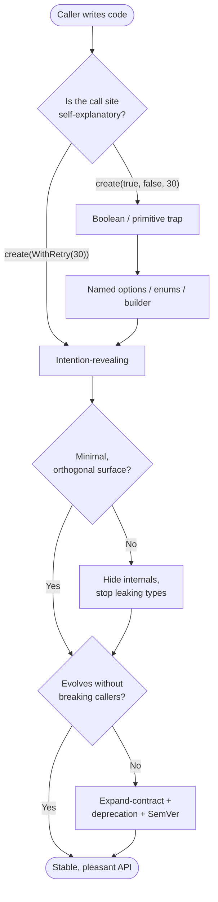

# API & Library Design — Practice Tasks

> 12 hands-on exercises on designing public surfaces that are "easy to use right and hard to use wrong." Every task: a scenario, a misuse-prone public API (Go / Java / Python — varied), an instruction, and a full solution with a redesigned API, a caller example proving it now reads well, and the reasoning. Ordered easy → hard.

---

## Table of Contents

1. [Task 1 — Kill the Boolean Trap (Go)](#task-1--kill-the-boolean-trap-go) — *Easy*
2. [Task 2 — Give the Common Case a Default (Python)](#task-2--give-the-common-case-a-default-python) — *Easy*
3. [Task 3 — Fix Inconsistent Naming & Argument Order (Java)](#task-3--fix-inconsistent-naming--argument-order-java) — *Easy*
4. [Task 4 — Stop Leaking an Internal Type (Go)](#task-4--stop-leaking-an-internal-type-go) — *Medium*
5. [Task 5 — Telescoping Constructors → Builder (Java)](#task-5--telescoping-constructors--builder-java) — *Medium*
6. [Task 6 — Shrink a Sprawling Public Surface (Python)](#task-6--shrink-a-sprawling-public-surface-python) — *Medium*
7. [Task 7 — Boolean Trap → Functional Options (Go)](#task-7--boolean-trap--functional-options-go) — *Medium*
8. [Task 8 — Design a Clear Error Contract (Go)](#task-8--design-a-clear-error-contract-go) — *Medium*
9. [Task 9 — Typed Error Hierarchy (Python)](#task-9--typed-error-hierarchy-python) — *Medium*
10. [Task 10 — Make a Breaking Change Additively (Java)](#task-10--make-a-breaking-change-additively-java) — *Hard*
11. [Task 11 — Design From the Caller In (Python)](#task-11--design-from-the-caller-in-python) — *Hard*
12. [Task 12 — Full API Review (Go — open-ended)](#task-12--full-api-review-go--open-ended) — *Hard*

---

## How to Use

Read the scenario, then **try the redesign before opening the solution.** Write the *caller* code first — if your imagined call site reads cleanly, the signature is probably right. Each solution explains not just *what* changed but *why* the original invited mistakes.

Pair this with the sibling files in this folder: [`junior.md`](junior.md) for the foundational rules, [`find-bug.md`](find-bug.md) for spotting misuse in existing APIs, and [`optimize.md`](optimize.md) for tightening surfaces you already have. The chapter overview lives in [`../README.md`](../README.md).

The map below shows the design pressure every task pushes back on.



---

## Task 1 — Kill the Boolean Trap (Go)

**Difficulty:** Easy

**Scenario:** A logging library exposes one constructor. Reviewers keep approving call sites that nobody can read six months later.

```go
package log

// NewLogger(toStdout, withColor, jsonFormat, includeCaller)
func NewLogger(toStdout, withColor, jsonFormat, includeCaller bool) *Logger { ... }
```

A typical call site:

```go
logger := log.NewLogger(true, false, true, true)
```

**Instruction:** Redesign the signature so the call site is self-documenting. You do not need functional options yet — even an enum and a small config can fix the *boolean trap* (a sequence of unlabeled `bool`s where no reader can tell which flag is which, and any two are trivially swapped).

<details>
<summary>Solution</summary>

Replace the positional booleans with a struct of **named, zero-value-friendly** fields and an enum for the genuinely-mutually-exclusive choice (format).

```go
package log

type Format int

const (
    FormatText Format = iota // zero value = the common default
    FormatJSON
)

type Config struct {
    Output         io.Writer // nil → os.Stdout
    Color          bool
    Format         Format
    IncludeCaller  bool
}

func New(cfg Config) *Logger {
    if cfg.Output == nil {
        cfg.Output = os.Stdout
    }
    // ...
    return &Logger{out: cfg.Output, color: cfg.Color, format: cfg.Format, caller: cfg.IncludeCaller}
}
```

Caller — now every flag names itself, and unset fields fall to sane defaults:

```go
logger := log.New(log.Config{
    Format:        log.FormatJSON,
    IncludeCaller: true,
})
// Output defaults to stdout; Color defaults to off. No phantom positional args.
```

**Reasoning:** Four positional `bool`s have 16 indistinguishable call shapes; the compiler can't catch a swap, and `true, false, true, true` is unreadable at the call site and in diffs. A field name is the cheapest possible documentation. Making the zero value the common case (text, no color, stdout) means most callers write `log.New(log.Config{})` and only name what differs — the [principle of least astonishment](junior.md) plus a good default in one move. `Format` is an enum, not two bools, because "text" and "json" are exclusive — encoding mutually-exclusive states as independent booleans lets callers express the impossible (`jsonFormat && !something`).

</details>

---

## Task 2 — Give the Common Case a Default (Python)

**Difficulty:** Easy

**Scenario:** A retry helper forces every caller to spell out all five parameters, even though 95% of them want the same values.

```python
def retry(func, attempts, base_delay, max_delay, jitter, exceptions):
    ...

# Every call site, even the trivial one:
result = retry(fetch, 3, 0.5, 30.0, True, (ConnectionError, TimeoutError))
```

**Instruction:** Redesign so the common case is a one-liner and the rare case is still expressible. Decide which parameters deserve defaults and which must stay explicit.

<details>
<summary>Solution</summary>

Keep `func` positional (it has no sensible default), give every tuning knob a default, and use keyword-only arguments so nobody passes them positionally by accident.

```python
from typing import Callable, TypeVar, Iterable

T = TypeVar("T")

DEFAULT_RETRYABLE = (ConnectionError, TimeoutError)

def retry(
    func: Callable[[], T],
    *,                                  # everything after is keyword-only
    attempts: int = 3,
    base_delay: float = 0.5,
    max_delay: float = 30.0,
    jitter: bool = True,
    exceptions: Iterable[type[Exception]] = DEFAULT_RETRYABLE,
) -> T:
    ...
```

Caller — the 95% case collapses to its essence, the 5% case overrides only what it needs:

```python
result = retry(fetch)                              # uses every default
slow = retry(sync_ledger, attempts=10, max_delay=120.0)   # override two, by name
```

**Reasoning:** A good default *moves correctness off the caller's shoulders*. When the sensible policy is forced into every call site, three things happen: call sites are noisy, the "right" values drift apart as people copy-paste slightly-wrong numbers, and tightening the default later means editing dozens of call sites. Keyword-only (`*`) is the Python lever that makes this safe — it prevents `retry(fetch, 30.0)` from silently binding `30.0` to `attempts`. Note `func` stays positional and required: a parameter with no meaningful default should *not* be given a fake one.

</details>

---

## Task 3 — Fix Inconsistent Naming & Argument Order (Java)

**Difficulty:** Easy

**Scenario:** A `CacheClient` grew method by method, each added by a different person. The naming and parameter order are now a minefield.

```java
public interface CacheClient {
    String get(String key);
    void put(String value, String key);          // value, then key
    void setExpiry(int seconds, String theKey);  // different param name, order flipped again
    boolean exists(String k);                     // abbreviated param
    void deleteKey(String key);                   // verb redundancy
    void removeAll();                             // synonym for delete
}
```

**Instruction:** Redesign the interface for consistency. Fix the argument-order inconsistency, the naming inconsistency, and the redundant verbs. State the conventions you chose.

<details>
<summary>Solution</summary>

Pick one convention and apply it everywhere: **key always comes first**, the parameter is always named `key`, methods are named after the *operation* without redundant nouns, and synonyms collapse to one verb.

```java
public interface CacheClient {
    String get(String key);
    void put(String key, String value);              // key first, consistently
    void expire(String key, Duration ttl);           // key first; Duration > int seconds
    boolean contains(String key);                     // no abbreviation
    void delete(String key);                          // one verb for removal
    void clear();                                      // distinct intent: remove everything
}
```

Caller — muscle memory now works; every method follows the same shape:

```java
cache.put("session:42", token);
cache.expire("session:42", Duration.ofMinutes(30));
if (cache.contains("session:42")) { ... }
cache.delete("session:42");
cache.clear();
```

**Reasoning:** Consistency is what lets a developer *guess* the next method correctly — the heart of the principle of least astonishment. In the original, `put(value, key)` vs `setExpiry(seconds, key)` guarantees an eventual swapped-argument bug, and because both are `String`/`int` the compiler stays silent. Standardizing on "key first" makes the whole interface predictable. `deleteKey`/`removeAll` mixed two verbs (`delete`, `remove`) for the same concept; collapsing to `delete` (one item) and `clear` (everything) removes the synonym tax. Swapping `int seconds` for `Duration` also kills a unit ambiguity (was it seconds or millis?) — a [primitive-obsession](../../refactoring/README.md) fix riding along.

</details>

---

## Task 4 — Stop Leaking an Internal Type (Go)

**Difficulty:** Medium

**Scenario:** A query package returns results. The return type drags the library's internal storage representation into every caller's code.

```go
package query

import "github.com/acme/db/internal/rowbuf"

// Run returns the raw internal buffer used by the storage engine.
func Run(sql string) (*rowbuf.Buffer, error) { ... }
```

Callers are now forced to write `import "github.com/acme/db/internal/rowbuf"` and call methods like `buf.RawColumn(2)` and `buf.UnsafeBytes()`. The moment the storage engine changes its buffer layout, every caller breaks.

**Instruction:** Redesign the public API so callers depend only on a stable, intention-revealing type that you own and control. Keep `rowbuf` an implementation detail.

<details>
<summary>Solution</summary>

Introduce a small public `Result` type that the caller can use, and convert from the internal buffer at the boundary. The internal type never crosses the package line.

```go
package query

import "github.com/acme/db/internal/rowbuf"

// Result is the stable, public view of a query result.
type Result struct {
    rows []Row // owned by this package, free to evolve internally
}

type Row struct{ values []any }

func (r Result) Rows() []Row        { return r.rows }
func (row Row) Value(col int) any   { return row.values[col] }
func (row Row) Len() int            { return len(row.values) }

func Run(sql string) (Result, error) {
    buf, err := engine.exec(sql) // returns *rowbuf.Buffer internally
    if err != nil {
        return Result{}, err
    }
    return fromBuffer(buf), nil // adapt internal → public at the seam
}

func fromBuffer(buf *rowbuf.Buffer) Result { ... }
```

Caller — no `internal` import, no unsafe methods, no coupling to storage layout:

```go
res, err := query.Run("SELECT id, name FROM users")
if err != nil { return err }
for _, row := range res.Rows() {
    fmt.Println(row.Value(0), row.Value(1))
}
```

**Reasoning:** A public function's return type is part of its contract. Leaking `*rowbuf.Buffer` means Hyrum's Law kicks in immediately: callers reach for `UnsafeBytes()`, and now you can never change the buffer without breaking them — your *internal* representation has become a *public* one by accident. (Go's `internal/` package even tries to forbid this; returning the type defeats that protection.) The fix is a thin owned type at the boundary. It costs one conversion per call and buys you total freedom to re-engineer storage. This is the provider-side mirror of the consumer-side [Boundaries](../07-boundaries/README.md) rule: wrap what you don't want to be coupled to.

</details>

---

## Task 5 — Telescoping Constructors → Builder (Java)

**Difficulty:** Medium

**Scenario:** An `HttpRequest` class accreted constructors until there were six overloads, several with the same arity and incompatible meanings.

```java
public class HttpRequest {
    public HttpRequest(String url) { ... }
    public HttpRequest(String url, String method) { ... }
    public HttpRequest(String url, String method, Map<String,String> headers) { ... }
    public HttpRequest(String url, String method, Map<String,String> headers, byte[] body) { ... }
    public HttpRequest(String url, int timeoutMs) { ... }              // arity clash with (url, method)
    public HttpRequest(String url, String method, int timeoutMs, boolean followRedirects) { ... }
}
```

The two-arg `(String, String)` and `(String, int)` overloads are an accident waiting to happen, and there's no way to set headers *and* a timeout without also passing a body.

**Instruction:** Replace the telescoping constructors with a builder. Make required fields mandatory, optional fields fluent, and the result immutable.

<details>
<summary>Solution</summary>

A builder turns "which overload do I need?" into "set the fields I care about." `url` is required (it's the builder's entry point); everything else is fluent with a default.

```java
public final class HttpRequest {
    private final String url;
    private final String method;
    private final Map<String, String> headers;
    private final byte[] body;
    private final Duration timeout;
    private final boolean followRedirects;

    private HttpRequest(Builder b) {
        this.url = b.url;
        this.method = b.method;
        this.headers = Map.copyOf(b.headers);
        this.body = b.body;
        this.timeout = b.timeout;
        this.followRedirects = b.followRedirects;
    }

    public static Builder to(String url) {        // required field is the entry point
        return new Builder(url);
    }

    public static final class Builder {
        private final String url;
        private String method = "GET";            // sensible defaults
        private Map<String, String> headers = new HashMap<>();
        private byte[] body = new byte[0];
        private Duration timeout = Duration.ofSeconds(30);
        private boolean followRedirects = true;

        private Builder(String url) {
            this.url = Objects.requireNonNull(url, "url");
        }

        public Builder method(String m)        { this.method = m; return this; }
        public Builder header(String k, String v) { this.headers.put(k, v); return this; }
        public Builder body(byte[] b)          { this.body = b; return this; }
        public Builder timeout(Duration d)     { this.timeout = d; return this; }
        public Builder followRedirects(boolean f) { this.followRedirects = f; return this; }

        public HttpRequest build() { return new HttpRequest(this); }
    }
}
```

Caller — any combination of options is now reachable and each one is labeled:

```java
HttpRequest req = HttpRequest.to("https://api.example.com/orders")
        .method("POST")
        .header("Authorization", "Bearer " + token)
        .body(payload)
        .timeout(Duration.ofSeconds(5))
        .build();
```

**Reasoning:** Telescoping constructors fail on two axes. First, you can only reach a parameter by also supplying every parameter before it — so "headers plus timeout, no body" is simply unrepresentable. Second, same-arity overloads with different types (`(String, String)` vs `(String, int)`) are ambiguous to readers and brittle to refactor. A builder makes required fields mandatory (no `HttpRequest` without a `url`), gives optional fields names, supplies defaults, and yields an immutable object (`Map.copyOf`, no setters). Naming the entry point `to(url)` makes the call site read like a sentence. See [`../../design-patterns/README.md`](../../design-patterns/README.md) for the Builder pattern in depth.

</details>

---

## Task 6 — Shrink a Sprawling Public Surface (Python)

**Difficulty:** Medium

**Scenario:** A `pricing` module exposes 14 names. Twelve of them are helpers nobody outside the module should call, but they're all importable, so users have started depending on them — and bug reports now reference `_round_half_even` as if it were a feature.

```python
# pricing.py  — everything is public by default in Python
def calculate_order_total(order): ...
def apply_discount(subtotal, code): ...
def lookup_tax_rate(state): ...
def round_half_even(value): ...           # internal helper
def normalize_currency(value): ...        # internal helper
def fetch_rate_table(): ...               # internal, hits a DB
def parse_discount_code(code): ...        # internal
def validate_state_code(state): ...       # internal
def cents_to_dollars(cents): ...          # internal
def dollars_to_cents(dollars): ...        # internal
def _legacy_total(order): ...             # dead code, still importable
def memo_cache(): ...                     # internal
def debug_dump(order): ...                # internal, dev-only
def clear_caches(): ...                   # internal
```

**Instruction:** Define the *minimal* public core and hide the rest. Use Python's conventions (`__all__`, leading underscores) and explain how you decided what's public.

<details>
<summary>Solution</summary>

Decide the public surface from the *caller's* needs: outsiders compute a total, apply a discount, and look up a tax rate. Everything else is mechanism. Mark intent with `__all__` (controls `from pricing import *` and signals to tooling/readers) and rename true internals with a leading underscore.

```python
# pricing.py

__all__ = ["calculate_order_total", "apply_discount", "lookup_tax_rate"]

# ---- Public API ---------------------------------------------------------

def calculate_order_total(order: Order) -> Money:
    """Compute the all-in total for an order. The one entry point most callers need."""
    ...

def apply_discount(subtotal: Money, code: str) -> Money: ...

def lookup_tax_rate(state: str) -> Decimal: ...

# ---- Internal helpers (underscore-prefixed; excluded from __all__) -------

def _round_half_even(value: Decimal) -> Decimal: ...
def _normalize_currency(value: Decimal) -> Money: ...
def _fetch_rate_table() -> dict[str, Decimal]: ...
def _parse_discount_code(code: str) -> Discount: ...
def _validate_state_code(state: str) -> str: ...
def _cents_to_dollars(cents: int) -> Decimal: ...
def _dollars_to_cents(dollars: Decimal) -> int: ...
def _memo_cache(): ...
def _debug_dump(order: Order) -> str: ...
def _clear_caches() -> None: ...
# _legacy_total deleted — dead code is not an API.
```

Caller — the public surface is now three obvious functions; autocomplete and `import *` no longer surface internals:

```python
from pricing import calculate_order_total

total = calculate_order_total(order)
```

**Reasoning:** Every public name is a promise you must keep. A 14-name surface means 14 things you can never change without risking a break — and worse, Hyrum's Law says users *will* import `round_half_even` the moment it's reachable. Minimal + orthogonal is the goal: expose the smallest set that lets callers do their job, with no two functions doing overlapping work. `__all__` is the explicit contract (it's what `import *` honors and what doc tools read); leading underscores are the soft signal that says "mechanism, not interface." Deleting `_legacy_total` matters too — dead code that's importable is still a maintenance liability and an invitation to misuse.

</details>

---

## Task 7 — Boolean Trap → Functional Options (Go)

**Difficulty:** Medium

**Scenario:** A database `Connect` function has six parameters, four of them boolean, and adding a seventh option would break every caller.

```go
package db

func Connect(
    dsn string,
    poolSize int,
    readOnly bool,
    autoReconnect bool,
    tls bool,
    verbose bool,
) (*Conn, error) { ... }

// Caller:
conn, err := db.Connect("postgres://...", 20, false, true, true, false)
```

**Instruction:** Convert this to Go's functional-options pattern. Only `dsn` is required. Each option must be self-naming, the default behavior must be sensible, and adding a future option must be backward-compatible.

<details>
<summary>Solution</summary>

```go
package db

import "time"

type config struct {
    poolSize      int
    readOnly      bool
    autoReconnect bool
    tls           bool
    verbose       bool
}

type Option func(*config)

func WithPoolSize(n int) Option       { return func(c *config) { c.poolSize = n } }
func ReadOnly() Option                { return func(c *config) { c.readOnly = true } }
func WithAutoReconnect() Option       { return func(c *config) { c.autoReconnect = true } }
func WithTLS() Option                 { return func(c *config) { c.tls = true } }
func Verbose() Option                 { return func(c *config) { c.verbose = true } }

func Connect(dsn string, opts ...Option) (*Conn, error) {
    cfg := config{ // defaults live in exactly one place
        poolSize:      10,
        autoReconnect: true,
        tls:           true, // secure by default
    }
    for _, opt := range opts {
        opt(&cfg)
    }
    // ... use cfg to dial ...
}
```

Caller — reads as prose, and a caller who's happy with defaults writes almost nothing:

```go
conn, err := db.Connect("postgres://localhost/app",
    db.WithPoolSize(20),
    db.ReadOnly(),
)
// TLS and auto-reconnect are on by default; verbose stays off.

simple, err := db.Connect("postgres://localhost/app") // all defaults
```

**Reasoning:** Functional options solve three problems at once. The boolean trap disappears — `db.ReadOnly()` cannot be confused with `db.WithTLS()` the way `true, true` can. Defaults live in one place (the `config` literal) instead of being re-typed at every call site, and they can be *secure by default* (`tls: true`) so a forgetful caller is still safe. Crucially, the variadic `opts ...Option` is **additive**: adding `WithStatementTimeout(...)` next quarter does not touch a single existing call site or change the signature's arity — directly addressing the original's "a seventh parameter breaks everyone." Note the options that are booleans-in-disguise (`ReadOnly()`, `Verbose()`) are *presence-based* — calling the option turns the behavior on — which is even clearer than passing `true`.

</details>

---

## Task 8 — Design a Clear Error Contract (Go)

**Difficulty:** Medium

**Scenario:** A `vault` client returns errors as bare strings. Callers can't distinguish "not found" (retry elsewhere) from "permission denied" (give up) from "network blip" (retry), so they resort to string matching.

```go
package vault

func Get(key string) (string, error) {
    if !exists(key) {
        return "", fmt.Errorf("key %q not found", key)
    }
    if !authorized() {
        return "", fmt.Errorf("not allowed to read %q", key)
    }
    // ...
}

// Caller, forced into fragile string matching:
val, err := vault.Get("db-password")
if err != nil && strings.Contains(err.Error(), "not found") { ... }
```

**Instruction:** Design a typed, documented error contract so callers can branch on the *kind* of failure programmatically, without parsing strings. Keep helpful messages too.

<details>
<summary>Solution</summary>

Expose **sentinel errors** for the cases callers branch on, wrap them with context, and document the contract. Callers use `errors.Is`.

```go
package vault

import (
    "errors"
    "fmt"
)

// Documented error contract. Callers may test these with errors.Is.
var (
    // ErrNotFound is returned when the key does not exist.
    ErrNotFound = errors.New("vault: key not found")
    // ErrPermission is returned when the caller is not authorized.
    ErrPermission = errors.New("vault: permission denied")
    // ErrUnavailable is returned for transient backend failures; safe to retry.
    ErrUnavailable = errors.New("vault: backend unavailable")
)

func Get(key string) (string, error) {
    if !exists(key) {
        return "", fmt.Errorf("get %q: %w", key, ErrNotFound) // %w wraps, keeps context
    }
    if !authorized() {
        return "", fmt.Errorf("get %q: %w", key, ErrPermission)
    }
    val, err := backend.read(key)
    if err != nil {
        return "", fmt.Errorf("get %q: %w", key, ErrUnavailable)
    }
    return val, nil
}
```

Caller — branches on identity, not on substring spelling:

```go
val, err := vault.Get("db-password")
switch {
case errors.Is(err, vault.ErrNotFound):
    val = fallbackSecret()
case errors.Is(err, vault.ErrPermission):
    return fmt.Errorf("startup aborted: %w", err) // unrecoverable
case errors.Is(err, vault.ErrUnavailable):
    return retryWithBackoff(...)                   // transient
case err != nil:
    return err
}
```

**Reasoning:** String matching on error text is the classic Hyrum's Law trap — the message becomes load-bearing, so you can never improve the wording without breaking a caller. The error *contract* should be the part you promise to keep stable; the message is for humans. Sentinel errors plus `%w` wrapping give the best of both: `errors.Is` compares against the stable identity, while the wrapped message (`get "db-password": vault: key not found`) still reads well in logs. The three exported sentinels also *document the decision space* — a caller can see at a glance that exactly three failure modes are worth branching on, and which one is retryable. (When callers need structured fields, e.g. an HTTP status, prefer a custom error *type* with `errors.As`; sentinels are the right tool when identity is all that's needed.) See [`error-handling-patterns`](../../refactoring/README.md) for the broader catalog.

</details>

---

## Task 9 — Typed Error Hierarchy (Python)

**Difficulty:** Medium

**Scenario:** A payments SDK raises bare built-in exceptions, so callers can't tell *your* failures from incidental ones, and can't catch a category.

```python
class PaymentClient:
    def charge(self, amount, card):
        if amount <= 0:
            raise ValueError("amount must be positive")
        if not self._valid(card):
            raise ValueError("bad card")
        resp = self._http.post("/charge", ...)
        if resp.status == 402:
            raise Exception("declined")          # bare Exception!
        if resp.status >= 500:
            raise Exception("gateway error")
```

A caller cannot write `except PaymentDeclined` — there is no such type — and `except ValueError` would also swallow unrelated `ValueError`s from elsewhere.

**Instruction:** Design an exception hierarchy that lets callers catch *all* SDK errors, a *category*, or a *specific* failure — and carry structured data, not just a message.

<details>
<summary>Solution</summary>

Root every SDK exception at a single base class, group by category, and attach fields callers may need (no string parsing).

```python
class PaymentError(Exception):
    """Base class for every error raised by this SDK. Catch this to catch them all."""


class InvalidRequest(PaymentError):
    """Caller supplied bad input. Not retryable. Fix the call and try again."""


class PaymentDeclined(PaymentError):
    """The charge was declined by the issuer. Not retryable as-is."""
    def __init__(self, code: str, message: str):
        super().__init__(message)
        self.code = code           # structured: "insufficient_funds", "expired_card", ...


class GatewayError(PaymentError):
    """Transient upstream failure. Safe to retry with backoff."""
    def __init__(self, status: int, message: str):
        super().__init__(message)
        self.status = status


class PaymentClient:
    def charge(self, amount: Decimal, card: Card) -> Charge:
        if amount <= 0:
            raise InvalidRequest("amount must be positive")
        if not self._valid(card):
            raise InvalidRequest("card failed validation")
        resp = self._http.post("/charge", ...)
        if resp.status == 402:
            raise PaymentDeclined(code=resp.json()["decline_code"], message="charge declined")
        if resp.status >= 500:
            raise GatewayError(status=resp.status, message="gateway error")
        return Charge.from_response(resp)
```

Caller — catch broadly or narrowly, and read structured fields:

```python
try:
    charge = client.charge(amount, card)
except PaymentDeclined as e:
    if e.code == "insufficient_funds":
        prompt_for_another_card()
    else:
        show_decline(e.code)
except GatewayError:
    retry_with_backoff(lambda: client.charge(amount, card))   # transient
except InvalidRequest:
    raise                                                      # programmer error, bubble up
except PaymentError:
    log.exception("unexpected payment failure")               # net for anything new
```

**Reasoning:** A single base class (`PaymentError`) is the keystone: it lets a caller wrap the entire SDK in one `except` without accidentally swallowing unrelated exceptions — something `except Exception` or bare `ValueError` can never do safely. Subclasses encode the *taxonomy of failure* the caller actually reasons about (bad input vs declined vs transient), each mapping to a different recovery strategy. Attaching `code`/`status` as attributes means the contract is the *type plus its fields*, not a parseable message string — so you can rewrite the human-readable message freely. Adding a new subclass later is additive: existing `except PaymentError` handlers still catch it. This is the Python mirror of Task 8's Go sentinel approach.

</details>

---

## Task 10 — Make a Breaking Change Additively (Java)

**Difficulty:** Hard

**Scenario:** A widely-used library has shipped this method for two years. You now need `search` to support pagination and to return richer results — but thousands of external callers depend on the current signature.

```java
public class SearchService {
    // v1.x — public, used everywhere:
    public List<Document> search(String query) { ... }
}
```

You want to reach a clean target API:

```java
public SearchResult search(SearchQuery query);   // desired v2 shape
```

**Instruction:** Plan the migration as an **expand-contract** (parallel-change) sequence with proper deprecation, so no minor release ever breaks a caller and SemVer is respected. Show the intermediate state.

<details>
<summary>Solution</summary>

You cannot change the existing method's return type or parameter type in place — that is a binary- and source-breaking change and may only land in a new major version. Instead: **expand** (add the new API alongside the old), **migrate** (deprecate the old, point callers at the new), then **contract** (remove the old, only at a major bump).

**Phase 1 — Expand (ships in a minor, e.g. 1.5.0).** Add the new methods; keep the old one working by delegating.

```java
public class SearchService {

    /** @deprecated since 1.5; use {@link #search(SearchQuery)}. Removed in 2.0. */
    @Deprecated(since = "1.5", forRemoval = true)
    public List<Document> search(String query) {
        // Old behavior preserved by delegating to the new path.
        return search(SearchQuery.of(query)).documents();
    }

    // New, richer API — purely additive, so 1.5 stays backward compatible.
    public SearchResult search(SearchQuery query) { ... }
}

public record SearchQuery(String text, int page, int pageSize) {
    public static SearchQuery of(String text) {
        return new SearchQuery(text, 0, 20); // defaults match old behavior
    }
}

public record SearchResult(List<Document> documents, int totalHits, int page) {}
```

**Phase 2 — Migrate (over one or more minor releases).** The `@Deprecated(forRemoval = true)` annotation makes every old call site emit a compiler warning; release notes and Javadoc point to the replacement. Callers move at their own pace because *both* methods work. Nothing breaks.

**Phase 3 — Contract (ships only in 2.0.0, a major bump).** Remove the deprecated overload.

```java
public class SearchService {
    public SearchResult search(SearchQuery query) { ... } // the old method is gone
}
```

Caller across the transition:

```java
// Works in 1.x and emits a deprecation warning, nudging migration:
List<Document> docs = service.search("invoices");

// The new path — available from 1.5, mandatory from 2.0:
SearchResult result = service.search(new SearchQuery("invoices", 2, 50));
```

**Reasoning:** SemVer encodes a promise: patch and minor releases never break callers; only a major bump may. Renaming a return type in place violates that promise silently — code that compiled yesterday won't compile after a `mvn update`. Expand-contract honors it by overlapping old and new for an entire deprecation window: `@Deprecated(forRemoval = true)` turns the migration into a warning, not a wall, and `SearchQuery.of` ensures the old method's behavior is *exactly* reproduced (same defaults) so delegation is safe. The removal is the *only* breaking step, and it's deferred to the next major version where callers expect to do work. This is the same expand-contract discipline used for zero-downtime database migrations — the audience differs, the choreography doesn't. See [`../../refactoring/README.md`](../../refactoring/README.md) for parallel-change.

</details>

---

## Task 11 — Design From the Caller In (Python)

**Difficulty:** Hard

**Scenario:** You're building a feature-flag library from scratch. Instead of designing the implementation first, you're given the call site you *wish* you could write. Design the API to make exactly that snippet work.

Desired usage (this is the spec):

```python
flags = FeatureFlags.from_file("flags.yaml")

if flags.enabled("new-checkout", user=current_user):
    render_new_checkout()
else:
    render_old_checkout()

# Percentage rollout and per-user overrides should "just work":
with flags.override("new-checkout", enabled=True):   # for tests
    assert flags.enabled("new-checkout", user=anyone)
```

**Instruction:** Work backward from the snippet to the smallest API that satisfies it. Define the public types/methods and a default behavior for the unknown-flag case. Justify each public name by the call site that demands it.

<details>
<summary>Solution</summary>

Read the snippet and list the public surface it *forces* into existence: `FeatureFlags.from_file`, `.enabled(name, user=...)`, and `.override(name, enabled=...)` as a context manager. Nothing else is public. Then design the minimum that backs them.

```python
from contextlib import contextmanager
from dataclasses import dataclass
from typing import Protocol


class User(Protocol):
    id: str   # the snippet calls enabled(..., user=...), so we need a stable id


@dataclass(frozen=True)
class _Flag:                       # internal: not part of the surface
    name: str
    default: bool = False
    rollout_percent: int = 0
    overrides: dict[str, bool] = None  # per-user id -> bool


class FeatureFlags:
    def __init__(self, flags: dict[str, "_Flag"]):
        self._flags = flags
        self._forced: dict[str, bool] = {}   # set by override()

    @classmethod
    def from_file(cls, path: str) -> "FeatureFlags":
        """Load flags from YAML. The snippet's entry point."""
        raw = _load_yaml(path)
        return cls({name: _parse_flag(name, cfg) for name, cfg in raw.items()})

    def enabled(self, name: str, *, user: User | None = None) -> bool:
        """The one question callers ask. Unknown flag -> False (safe default: off)."""
        if name in self._forced:           # test override wins
            return self._forced[name]
        flag = self._flags.get(name)
        if flag is None:
            return False                   # fail closed: unknown feature stays off
        if user is not None and flag.overrides and user.id in flag.overrides:
            return flag.overrides[user.id]
        if flag.rollout_percent:
            return _bucket(user.id if user else "") < flag.rollout_percent
        return flag.default

    @contextmanager
    def override(self, name: str, *, enabled: bool):
        """Force a flag on/off within a block. Designed for tests."""
        previous = self._forced.get(name, _MISSING)
        self._forced[name] = enabled
        try:
            yield
        finally:
            if previous is _MISSING:
                self._forced.pop(name, None)
            else:
                self._forced[name] = previous
```

Caller — the exact target snippet now runs, unchanged. Every public name exists because the snippet demanded it; `_Flag`, `_bucket`, `_load_yaml`, `_MISSING` stay private because the snippet never mentions them.

**Reasoning:** Designing from the caller in inverts the usual mistake of exposing whatever the implementation happens to produce. By writing the call site first, the public surface falls out as the *minimal* set of names the caller actually types — three methods — and everything else is free to be internal and changeable. Two design decisions are forced by the snippet's *shape*, not its words: `user` must be keyword-only (`*`) because the call uses `user=current_user`, and `override` must be a context manager because the call uses `with`. The unknown-flag default (return `False`, "fail closed") is the safe choice: a typo in a flag name disables a feature rather than silently enabling an untested code path — a good default that protects every caller. This is the most reliable way to get the [principle of least astonishment](junior.md) right, because the API is literally built to match expectation.

</details>

---

## Task 12 — Full API Review (Go — open-ended)

**Difficulty:** Hard

**Scenario:** A teammate posts this brand-new public package for review. It compiles and the tests pass, but it violates nearly every rule in this chapter. Conduct the review.

```go
package mailer

import "github.com/acme/mailer/internal/smtpconn"

type Mailer struct {
    Conn    *smtpconn.RawConn // exported internal type
    Retries int
    Debug   bool
}

// Send(to, cc, html, attach, urgent, retry)
func (m *Mailer) Send(to string, cc string, html bool, attach bool, urgent bool, retry bool) error {
    if to == "" {
        return errors.New("no recipient") // bare string error
    }
    // ...
}

func (m *Mailer) SendEmail(to string) error { ... }   // near-duplicate of Send
func (m *Mailer) DispatchMessage(to string) error { ... } // third synonym
func (m *Mailer) GetConn() *smtpconn.RawConn { ... }  // leaks internal type
func (m *Mailer) DebugDumpConn() string { ... }        // dev-only, public
```

**Instruction:** Produce a review: list every API-design violation, then sketch the redesigned package. Reference the relevant rule for each finding.

<details>
<summary>Solution</summary>

**Findings**

| # | Violation | Where | Fix |
|---|-----------|-------|-----|
| 1 | Boolean trap | `Send(... html, attach, urgent, retry)` — four positional bools | Functional options or a typed `Message` struct; `urgent`/`retry` become named options. |
| 2 | Leaking internal type | `Conn *smtpconn.RawConn` (exported field) and `GetConn()` | Unexport the field; never return the internal type. Callers have no business touching the connection. |
| 3 | Sprawling surface | `Send` + `SendEmail` + `DispatchMessage` are three names for one operation | Collapse to a single `Send`. |
| 4 | Inconsistent naming | `Send` / `SendEmail` / `DispatchMessage` mix verbs and nouns | One verb (`Send`); drop the redundant `Email`/`Message` suffixes (package is already `mailer`). |
| 5 | Mutable public config | `Retries`, `Debug` exported and mutable mid-flight | Set once at construction via options; don't expose mutable knobs. |
| 6 | Dev-only method is public | `DebugDumpConn()` | Remove from the public API; gate behind an internal/test build or a logger. |
| 7 | Untyped error contract | `errors.New("no recipient")` | Exported sentinel(s) callers can test with `errors.Is`. |
| 8 | Bad parameter type | `to string`, `cc string` for what are really lists of addresses | `[]string` (or an `Address` type), so multiple recipients are representable. |

**Redesigned package**

```go
package mailer

import "errors"

var ErrNoRecipient = errors.New("mailer: no recipient")

// Message is the typed payload — replaces the boolean/primitive soup.
type Message struct {
    To      []string
    Cc      []string
    Subject string
    Body    string
    IsHTML  bool
    Attachments []Attachment
}

type Option func(*config)

type config struct {
    retries int
    urgent  bool
}

func WithRetries(n int) Option { return func(c *config) { c.retries = n } }
func Urgent() Option           { return func(c *config) { c.urgent = true } }

type Mailer struct {
    conn *smtpconn.RawConn // unexported: internal type never escapes
    cfg  config
}

func New(opts ...Option) (*Mailer, error) {
    cfg := config{retries: 3} // sensible default
    for _, opt := range opts {
        opt(&cfg)
    }
    conn, err := smtpconn.Dial()
    if err != nil {
        return nil, err
    }
    return &Mailer{conn: conn, cfg: cfg}, nil
}

// Send is the single, intention-revealing entry point.
func (m *Mailer) Send(msg Message) error {
    if len(msg.To) == 0 {
        return ErrNoRecipient
    }
    // ...
}
```

Caller — one obvious method, every choice named, no internal types in sight:

```go
m, err := mailer.New(mailer.WithRetries(5))
if err != nil { return err }

err = m.Send(mailer.Message{
    To:      []string{"ops@example.com"},
    Subject: "Deploy finished",
    Body:    "<b>All green.</b>",
    IsHTML:  true,
})
if errors.Is(err, mailer.ErrNoRecipient) { ... }
```

**Reasoning:** The original package fails on every axis this chapter cares about — it's a useful capstone because the fixes compound. Collapsing three send-methods to one (findings 3, 4) shrinks the surface *and* removes the naming inconsistency at once. Unexporting `conn` and deleting `GetConn` (finding 2) is what frees you to swap the SMTP layer later; while the internal type was reachable, Hyrum's Law guaranteed someone would couple to it. The boolean trap (finding 1) splits naturally into two kinds of parameter: per-message data (`To`, `IsHTML`) belongs in the `Message` struct, while cross-message policy (`retries`, `urgent`) belongs in options set at construction — recognizing *which axis* a flag lives on is the core judgment call. The sentinel error (finding 7) gives callers a stable contract. The result is minimal, orthogonal, hard to misuse, and free to evolve.

</details>

---

## Self-Assessment

Rate yourself on each skill this chapter trains. Aim to *explain the call site*, not just produce a signature.

- [ ] I can spot a **boolean/primitive trap** in a signature and convert it to named options, an enum, or a builder — and pick the right one per language.
- [ ] I give the **common case a default** and keep the rare case expressible, without forcing fake defaults on parameters that have none.
- [ ] I make **naming and argument order consistent** so a caller can guess the next method correctly.
- [ ] I never **leak an internal type** across a public boundary, and I know why that locks me in (Hyrum's Law).
- [ ] I replace **telescoping constructors** with a builder/options that makes required fields mandatory and yields an immutable result.
- [ ] I keep the **public surface minimal and orthogonal**, hiding mechanism behind `__all__` / underscores / unexported names.
- [ ] I design an **error contract** callers can branch on programmatically — typed/sentinel errors, documented, with structured fields — never string matching.
- [ ] I can sequence a **breaking change additively** with expand-contract, deprecation, and SemVer discipline.
- [ ] I can **design from the caller in** — write the desired call site first and derive the minimal API from it.
- [ ] I can review a package and name each violation against the rule it breaks.

If three or more are unchecked, revisit [`junior.md`](junior.md) and the worked examples above before moving on.

---

## Related Topics

- [`junior.md`](junior.md) — foundational rules for designing public surfaces.
- [`find-bug.md`](find-bug.md) — spotting misuse-prone signatures in existing APIs.
- [`optimize.md`](optimize.md) — tightening an API you already shipped.
- [`../README.md`](../README.md) — the API & Library Design chapter overview and positive rules.
- [`../07-boundaries/README.md`](../07-boundaries/README.md) — the consumer-side mirror: wrapping third-party code you depend on.
- [`../22-abstraction-and-information-hiding/README.md`](../22-abstraction-and-information-hiding/README.md) — internal module quality that underpins a clean surface.
- [`../../design-patterns/README.md`](../../design-patterns/README.md) — Builder, Factory, and other creational patterns referenced here.
- [`../../refactoring/README.md`](../../refactoring/README.md) — parallel-change, primitive-obsession, and error-handling refactorings.
