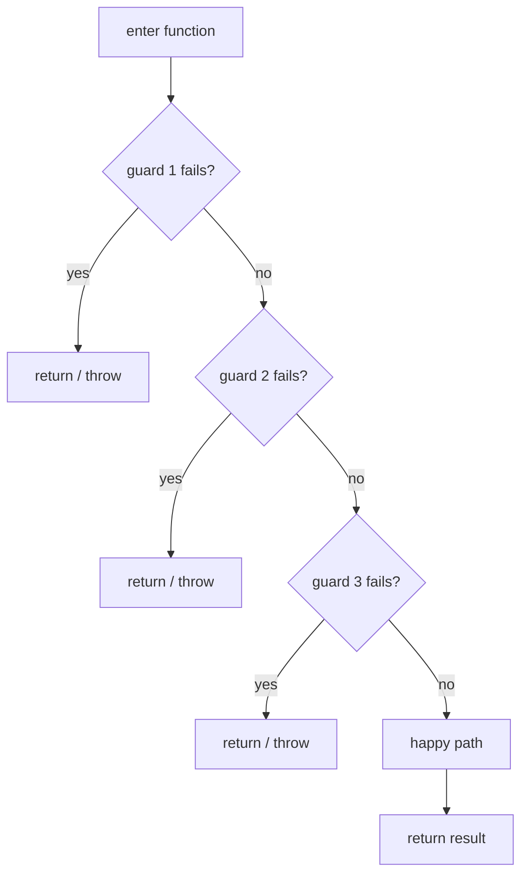
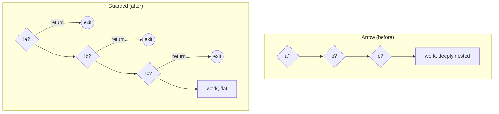

# Guard Clauses & Early Return — Junior Level

> **Category:** [Control-Flow Patterns](../README.md) — handle invalid and edge cases up front, then return, keeping the happy path un-nested.

---

## Table of Contents

1. [Introduction](#introduction)
2. [Prerequisites](#prerequisites)
3. [Glossary](#glossary)
4. [Core Concepts](#core-concepts)
5. [Real-World Analogies](#real-world-analogies)
6. [Mental Models](#mental-models)
7. [Pros & Cons](#pros-cons)
8. [Use Cases](#use-cases)
9. [Code Examples](#code-examples)
10. [Coding Patterns](#coding-patterns)
11. [Clean Code](#clean-code)
12. [Best Practices](#best-practices)
13. [Edge Cases & Pitfalls](#edge-cases-pitfalls)
14. [Common Mistakes](#common-mistakes)
15. [Tricky Points](#tricky-points)
16. [Test Yourself](#test-yourself)
17. [Cheat Sheet](#cheat-sheet)
18. [Summary](#summary)
19. [Further Reading](#further-reading)
20. [Related Topics](#related-topics)
21. [Diagrams](#diagrams)

---

## Introduction

> Focus: **What is it?** and **How to use it?**

A **guard clause** is a check at the **top** of a function that handles a precondition failure or an edge case by **returning (or throwing) immediately**. Once all the guards have passed, the rest of the function — the **happy path** — runs at minimal indentation, with no surviving `if`/`else` to track.

The pattern has one job: **flatten the function.** Instead of wrapping the real work in layer after layer of `if`, you reject the bad cases first and get them out of the way.

### Why this matters

Here is the shape guard clauses exist to destroy — the **arrow** (also called the "pyramid of doom"):

```python
def charge(order):
    if order is not None:
        if order.items:
            if order.customer.is_active:
                if order.total > 0:
                    # the actual work — buried four levels deep
                    return gateway.charge(order.customer.card, order.total)
                else:
                    raise ValueError("total must be positive")
            else:
                raise ValueError("inactive customer")
        else:
            raise ValueError("empty order")
    else:
        raise ValueError("order is null")
```

The real logic is one line, sitting at four levels of indentation. Every `else` is miles from its `if`. Rewritten with guard clauses:

```python
def charge(order):
    if order is None:            raise ValueError("order is null")
    if not order.items:          raise ValueError("empty order")
    if not order.customer.is_active: raise ValueError("inactive customer")
    if order.total <= 0:         raise ValueError("total must be positive")

    return gateway.charge(order.customer.card, order.total)
```

Same behavior. The bad cases are dispatched at the top; the happy path is the last line, un-nested, and reads like a sentence.

---

## Prerequisites

- **Required:** `if`/`else`, `return`, and exceptions in one language.
- **Required:** The concept of a **precondition** — something that must be true before a function can do its job.
- **Helpful:** A feel for **indentation as a cost** — every level of nesting is a thing the reader must remember.

---

## Glossary

| Term | Definition |
|------|-----------|
| **Guard clause** | A check at the top of a function that returns/throws on a bad case before the main logic runs. |
| **Early return** | Returning from a function before its last line — the mechanism a guard clause uses. |
| **Happy path** | The normal, expected execution path, assuming all preconditions hold. |
| **Precondition** | A condition that must be true for the function to proceed. |
| **Arrow / pyramid of doom** | The `>` shape produced by deeply nested `if`/`else`; the anti-pattern guards remove. |
| **Single exit** | An old rule that a function should have exactly one `return`. Guard clauses deliberately reject it. |
| **Invert the condition** | Rewrite `if (ok) { work }` as `if (!ok) return;` then `work` — the core move. |

---

## Core Concepts

### 1. A guard checks a *bad* case, not a good one

The mental flip from a beginner's `if` is **invert the condition**. You are not asking "is everything fine?" You are asking "is *this one thing* wrong?" — and if so, you leave.

```java
// Beginner instinct: "if it's valid, do the work"
if (isValid(x)) { doWork(x); }

// Guard clause: "if it's invalid, get out"
if (!isValid(x)) return;
doWork(x);
```

### 2. After a returning `if`, there is no `else`

If the `if` branch returns, everything after it is *already* the else branch. Writing `else` is redundant and re-introduces nesting:

```go
// Redundant else
if err != nil {
    return err
} else {
    process()   // this else is pointless
}

// Flat
if err != nil {
    return err
}
process()
```

### 3. The happy path stays at the lowest indentation

A reader scanning the **left edge** of the function should see the normal flow with no detours. Guards live above it; the main logic lives at column zero of the body.

### 4. Guards fire in order, cheapest/most-fundamental first

Check existence before shape, shape before value: `null` → empty → invalid value. A guard can safely assume every guard above it already passed.

---

## Real-World Analogies

| Concept | Analogy |
|---|---|
| **Guard clause** | A nightclub bouncer at the door. No ID? Turned away — you never enter. The dance floor (happy path) only contains people who passed. |
| **Early return** | A receptionist who hands back your incomplete form immediately instead of routing it through the whole office before someone rejects it. |
| **The arrow it replaces** | A "russian doll" of nested checks — you have to open every doll to reach the prize. |
| **Order of guards** | Airport security: passport check before bag scan before boarding. The cheap, disqualifying check comes first. |

---

## Mental Models

**The intuition:** *"Kick out the bad cases at the door; the rest of the function is the VIP room."*

```
function f(input):
    ┌─────────────────────────┐
    │  guard 1: null?  → leave │   ← bad cases handled
    │  guard 2: empty? → leave │      at the top, flat
    │  guard 3: bad?   → leave │
    └─────────────────────────┘
        │ everything below assumes valid input
        ▼
    happy path (no nesting)
        ▼
    return result
```

Compare the two shapes:

```
NESTED (arrow)              GUARDED (flat)
if a:                       if !a: return
  if b:                     if !b: return
    if c:                   if !c: return
      work()  ←── deep      work()  ←── flat
```

The guarded version reads **top to bottom**. The nested version reads **diagonally**, then back.

---

## Pros & Cons

| Pros | Cons |
|------|------|
| Flattens nesting; happy path is un-indented | Multiple `return` statements (offends "single exit" purists) |
| Each precondition is isolated and named | Overuse signals a function doing too much |
| Errors are handled next to their cause | Cleanup must be handled by RAII/`defer`/`finally`, not a single bottom exit |
| Easy to add/remove a precondition | Early returns can hide a missing `return` if the compiler doesn't enforce it |
| Reads like a checklist | Can scatter exit points if abused in a long function |

### When to use:
- Validating inputs and preconditions at the start of a function.
- Replacing a nested `if`/`else` pyramid.
- Any time the "real work" is buried inside conditionals.

### When NOT to use:
- When the bad case needs the *same* cleanup as the good case **and** your language has no `defer`/`finally`/RAII (rare today).
- When you have so many guards that the function is clearly two functions.

---

## Use Cases

- **Input validation** — `null`, empty, out-of-range checks at the function head.
- **Permission/auth checks** — reject unauthorized callers before doing anything.
- **Go error handling** — `if err != nil { return ... }` is a guard clause, institutionalized.
- **Recursion base cases** — the base case is a guard: `if n == 0 { return 1 }`.
- **Feature flags / short-circuits** — `if !featureEnabled { return }`.
- **Parsers / state machines** — reject malformed tokens early, keep the parse loop flat.

---

## Code Examples

### Java — invert, return early, no `else`

```java
// Before: nested, happy path buried
String describe(User user) {
    if (user != null) {
        if (user.isActive()) {
            return user.getName() + " (active)";
        } else {
            return user.getName() + " (inactive)";
        }
    } else {
        return "unknown";
    }
}

// After: guard clauses
String describe(User user) {
    if (user == null)      return "unknown";
    if (!user.isActive())  return user.getName() + " (inactive)";
    return user.getName() + " (active)";
}
```

**Highlights:**
- The `null` case leaves first.
- No `else` after a returning `if`.
- The final `return` is the happy path, un-nested.

---

### Python — guards on preconditions

```python
def withdraw(account, amount):
    # Guards: reject every bad case up front
    if account is None:
        raise ValueError("account is required")
    if account.frozen:
        raise PermissionError("account is frozen")
    if amount <= 0:
        raise ValueError("amount must be positive")
    if amount > account.balance:
        raise ValueError("insufficient funds")

    # Happy path — every guard above guarantees this is safe
    account.balance -= amount
    return account.balance
```

Each guard reads as a single, named precondition. The transfer logic is two lines at the bottom, free of nesting.

---

### Go — `if err != nil { return }` is the canonical guard clause

> **Go note:** Go has no exceptions for ordinary errors, so the entire language is built around early-return guards. Every `if err != nil` is a guard clause.

```go
func LoadConfig(path string) (*Config, error) {
    data, err := os.ReadFile(path)
    if err != nil {
        return nil, fmt.Errorf("read config: %w", err)
    }

    var cfg Config
    if err := json.Unmarshal(data, &cfg); err != nil {
        return nil, fmt.Errorf("parse config: %w", err)
    }

    if cfg.Port == 0 {
        return nil, errors.New("port is required")
    }

    return &cfg, nil   // happy path, flat
}
```

Notice the rhythm: *do a step → guard its error → continue.* The successful values flow straight down the page at one indentation level. This is **the** idiomatic Go control-flow shape, and it is guard clauses all the way down.

---

## Coding Patterns

### Pattern 1: Invert the condition

```python
# From "if good, work"
if user.is_authenticated:
    serve_dashboard()

# To "if bad, leave"
if not user.is_authenticated:
    return redirect("/login")
serve_dashboard()
```

### Pattern 2: Collapse `else` after a returning `if`

```java
// Has else
if (x < 0) {
    return "negative";
} else {
    return "non-negative";
}

// Flattened (the second return IS the else)
if (x < 0) return "negative";
return "non-negative";
```

### Pattern 3: Stack guards in order of fundamentality

```go
if req == nil          { return errBadRequest }   // existence
if req.Body == nil     { return errEmptyBody }     // shape
if len(req.Body) > max { return errTooLarge }      // value
// ... now use req safely
```



---

## Clean Code

### Keep guards short and flat

Put trivial guards on one line each (where your style guide allows) so the block reads as a vertical list of preconditions:

```python
if a is None:  return DEFAULT
if not b:      return DEFAULT
if c < 0:      return DEFAULT
```

### Name the reason, not just the check

A guard that throws should say *why*:

```java
if (amount <= 0)
    throw new IllegalArgumentException("amount must be positive, got " + amount);
```

### Don't `else` after a `return`

| ❌ Nested | ✅ Flat |
|---|---|
| `if (x) return a; else return b;` | `if (x) return a;`<br>`return b;` |
| `if (bad) { throw; } else { work(); }` | `if (bad) throw;`<br>`work();` |

---

## Best Practices

1. **Invert and return.** Turn "if valid, do work" into "if invalid, return."
2. **No `else` after a returning branch.** It only re-adds nesting.
3. **Order guards: existence → shape → value.** Each guard may assume the ones above passed.
4. **Keep the happy path at the bottom, un-indented.**
5. **Throw with a message** when a guard signals programmer error; **return a default** when it signals an expected edge case.
6. **Let RAII/`defer`/`try-with-resources` handle cleanup** so early returns don't leak resources (see [Tricky Points](#tricky-points)).

---

## Edge Cases & Pitfalls

- **Resource leaks on early return.** If you `open()` a file then `return` early, the file may never close. Use `with` (Python), `defer` (Go), or try-with-resources (Java) — covered in [RAII & Dispose](../../03-resource-and-type-safety/01-raii-and-dispose/junior.md).
- **Forgetting the `return`** after the guard body — the function falls through and runs the happy path anyway with bad input.
- **Side effects before the guard.** If you mutate state and *then* a later guard fails, you've left a half-done operation. Guard **before** you mutate.
- **Guards that overlap.** Two guards checking the same thing differently is a smell; collapse them.

---

## Common Mistakes

1. **Keeping the `else`** after a returning `if` — defeats the whole point.
2. **Doing work before guarding** — validate first, mutate second.
3. **Swallowing the bad case** — a guard that just `pass`es / does nothing silently hides a bug.
4. **A guard with side effects** — a guard should test and exit, not quietly change state.
5. **Too many guards** — 8+ guards usually means the function has too many responsibilities; extract.

---

## Tricky Points

- **"Single exit" is a 1960s rule.** It came from Dijkstra-era languages without `finally`/`defer`/RAII, where one exit point made manual cleanup safe. Modern languages remove that justification, so multiple early returns are now the *clearer* choice. See [Senior](senior.md).
- **A guard clause and a fail-fast check are often the same line.** Rejecting bad input at the top *is* failing fast. See sibling [Fail Fast](../02-fail-fast/junior.md).
- **Guards can replace a `null` check entirely** if you return a do-nothing object instead — see [Null Object](../03-null-object/junior.md).
- **Recursion base cases are guards.** `if n <= 1: return n` is a guard clause that also terminates the recursion.

---

## Test Yourself

1. What is a guard clause, and where does it live in a function?
2. What is the "invert the condition" move?
3. Why is `else` after a returning `if` redundant?
4. What old rule do guard clauses deliberately violate, and why is it now safe to?
5. What problem do early returns create around resources, and how is it solved?

<details><summary>Answers</summary>

1. A check at the **top** of a function that returns/throws on a bad case, so the happy path below runs only on valid input.
2. Rewriting `if (good) { work }` as `if (!good) return;` followed by `work` — testing for the bad case and leaving.
3. Because if the `if` returns, all code after it is *already* the else; writing `else` only re-adds a level of nesting.
4. **Single exit** (one `return` per function). It's safe to violate because `defer`/`finally`/RAII now handle cleanup that single-exit used to guarantee.
5. Early returns can skip cleanup code, leaking resources. Solved by scope-bound cleanup: `with` (Python), `defer` (Go), try-with-resources (Java).

</details>

---

## Cheat Sheet

```java
// Java
T f(In x) {
    if (x == null)     return DEFAULT;   // guard: existence
    if (!x.isValid())  throw new IllegalArgumentException(); // guard: value
    return work(x);                      // happy path, flat
}
```

```python
# Python
def f(x):
    if x is None:      return DEFAULT
    if not x.is_valid: raise ValueError("...")
    return work(x)
```

```go
// Go
func f(x *In) (Out, error) {
    if x == nil          { return zero, errNil }
    if err := x.Check(); err != nil { return zero, err }
    return work(x), nil
}
```

---

## Summary

- A **guard clause** rejects a bad case at the top of a function and returns/throws immediately.
- Core moves: **invert the condition**, **return early**, **no `else` after a returning `if`**, **keep the happy path flat**.
- It replaces the **arrow** anti-pattern of nested `if`/`else`.
- Go's `if err != nil { return }` is guard clauses institutionalized.
- Use RAII/`defer`/`finally` so early returns don't leak resources.

---

## Further Reading

- Martin Fowler, *Refactoring* — "Replace Nested Conditional with Guard Clauses."
- Robert C. Martin, *Clean Code* — Chapter 3, "Functions" (small functions, one level of indentation).
- The [Arrow Anti-Pattern](../../../anti-patterns/01-development/README.md) — the shape guards destroy.

---

## Related Topics

- **Next:** [Guard Clauses — Middle](middle.md)
- **Sibling patterns:** [Fail Fast](../02-fail-fast/junior.md), [Null Object](../03-null-object/junior.md), [Special Case](../04-special-case/junior.md).
- **Cures:** [Arrow Anti-Pattern](../../../anti-patterns/01-development/README.md).
- **Cleanup partner:** [RAII & Dispose](../../03-resource-and-type-safety/01-raii-and-dispose/junior.md).

---

## Diagrams



[Control-Flow](../README.md) · [Roadmap](../../../README.md) · **Next:** [Guard Clauses — Middle](middle.md)
