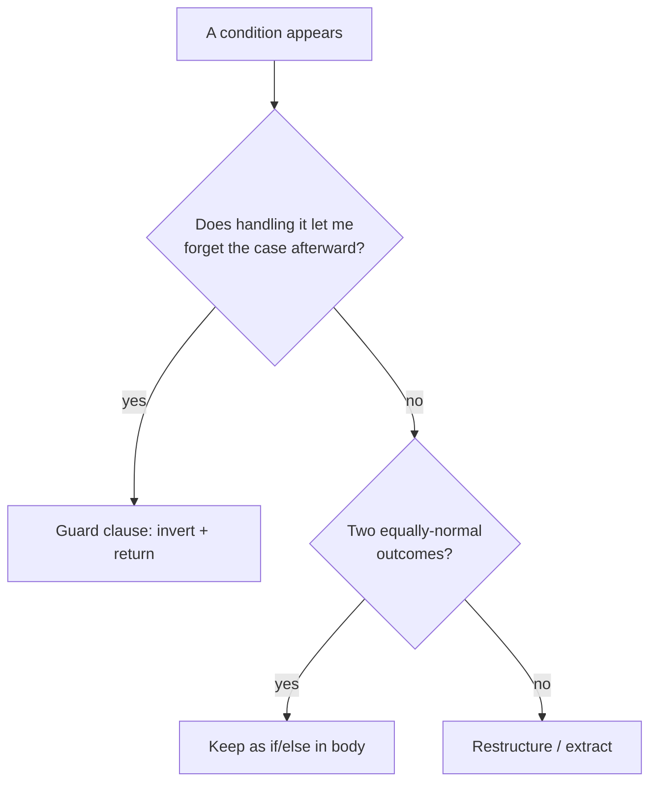
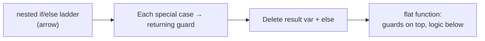

# Guard Clauses & Early Return — Middle Level

> **Category:** [Control-Flow Patterns](../README.md) — handle invalid and edge cases up front, then return, keeping the happy path un-nested.

> **Prerequisite:** [Junior](junior.md)
> **Focus:** **Why** and **When**

---

## Table of Contents

1. [Introduction](#introduction)
2. [When to Use Guard Clauses](#when-to-use-guard-clauses)
3. [When NOT to Use Guard Clauses](#when-not-to-use-guard-clauses)
4. [Mechanics Across Languages](#mechanics-across-languages)
5. [Variations](#variations)
6. [Real-World Cases](#real-world-cases)
7. [Refactoring Toward Guard Clauses](#refactoring-toward-guard-clauses)
8. [Trade-offs](#trade-offs)
9. [Edge Cases](#edge-cases)
10. [Tricky Points](#tricky-points)
11. [Best Practices](#best-practices)
12. [Test Yourself](#test-yourself)
13. [Summary](#summary)
14. [Diagrams](#diagrams)

---

## Introduction

> Focus: **Why** and **When**

At the junior level, a guard clause is a syntactic move: invert, return early, drop the `else`. At the middle level it becomes a **judgement**: *which* checks deserve to be guards, *where* the line sits between "validate and bail" and "this function is doing too much," and *how* the pattern changes when you cross from Go (no exceptions) to Java (checked + unchecked) to Python (duck-typed, EAFP).

The recurring decision is: **flatten or branch?** A guard clause flattens — it removes a case from consideration entirely. But not every condition is a precondition. Some are genuine business branches that belong in the body. Knowing the difference is the middle-level skill.

---

## When to Use Guard Clauses

Reach for a guard clause when **any** of these hold:

1. **The condition is a precondition** — input must exist / be shaped right / be in range before the function can do its job.
2. **The bad case has a trivial response** — return a default, throw, or short-circuit. No further logic depends on it.
3. **You can remove the case from the reader's mind** — after the guard, nobody has to think about that case again.
4. **The function is nested 2+ levels** purely to handle bad inputs.
5. **A base case terminates recursion** — `if n <= 1: return n`.

### The litmus test

> *Does handling this case let me forget it for the rest of the function?* If yes → guard clause. If the case threads through the rest of the logic → it's a branch, keep it in the body.

---

## When NOT to Use Guard Clauses

| Symptom | Why a guard is wrong | Better |
|---|---|---|
| The condition selects between two *equally normal* outcomes | It's a business branch, not a bad case | `if/else` in the body, or polymorphism |
| You'd need 8+ guards | The function has too many responsibilities | Extract / split the function |
| The "bad" case actually needs the full happy-path logic afterward | It's not removable | Restructure; the guard can't flatten it |
| Absence should be handled silently everywhere | Repeated `if (x == null) return` at every call site | [Null Object](../03-null-object/junior.md) / [Special Case](../04-special-case/junior.md) |
| The check belongs to the *caller's* contract | You're validating something the type system should enforce | [Type-Safe Enums](../../03-resource-and-type-safety/02-type-safe-enums/junior.md), non-null types |

A function with fifteen guards is not "well-guarded." It is telling you it has fifteen reasons to fail, which usually means it is doing several jobs at once.

---

## Mechanics Across Languages

The pattern is universal, but each language institutionalizes it differently.

### Go — guards *are* the error model

Go has no exceptions for expected errors. The result is that idiomatic Go is a stream of guard clauses, one per fallible step:

```go
func ProcessUpload(r *http.Request) (*Upload, error) {
    file, header, err := r.FormFile("file")
    if err != nil {
        return nil, fmt.Errorf("read form file: %w", err)
    }
    defer file.Close()

    if header.Size > maxUploadBytes {
        return nil, ErrTooLarge
    }
    if !allowedType(header.Filename) {
        return nil, ErrBadType
    }

    data, err := io.ReadAll(file)
    if err != nil {
        return nil, fmt.Errorf("read body: %w", err)
    }

    return &Upload{Name: header.Filename, Data: data}, nil
}
```

The "happy values" (`file`, `data`, the final `*Upload`) flow down the left edge. The `defer file.Close()` is what makes the early returns safe — cleanup is bound to scope, not to a single exit.

### Java — exceptions + `Objects.requireNonNull`

Java guards usually **throw**. The standard library ships guard helpers:

```java
import static java.util.Objects.requireNonNull;

Order place(Customer customer, List<Item> items) {
    requireNonNull(customer, "customer");           // guard: throws NPE with message
    if (items == null || items.isEmpty())
        throw new IllegalArgumentException("items must be non-empty");
    if (!customer.isActive())
        throw new IllegalStateException("customer is not active");

    return new Order(customer, List.copyOf(items));  // happy path
}
```

Convention: `IllegalArgumentException` for bad *arguments*, `IllegalStateException` for a bad *object/state*, `NullPointerException` (via `requireNonNull`) for nulls.

### Python — EAFP vs LBYL, and where guards fit

Python culture prefers **EAFP** ("Easier to Ask Forgiveness than Permission") — try the operation, catch the failure — over **LBYL** ("Look Before You Leap") guard checks. But guards still win for **preconditions that represent caller errors** or that you want named explicitly:

```python
def render(template, context):
    # LBYL guards for caller-contract violations
    if template is None:
        raise ValueError("template is required")
    if not isinstance(context, dict):
        raise TypeError(f"context must be a dict, got {type(context).__name__}")

    # EAFP for the actual work — let it raise if a key is missing
    return template.format(**context)
```

Rule of thumb in Python: **guard the contract, EAFP the body.** Don't pre-check things the operation itself will already raise on cleanly.

---

## Variations

### 1. Returning a default vs throwing

```python
# Edge case with a sensible default → return it
def discount(user):
    if user is None:
        return 0          # no user, no discount — not an error
    return user.tier.discount

# Contract violation → throw
def discount(user):
    if user is None:
        raise ValueError("user is required")   # caller broke the contract
    return user.tier.discount
```

The choice encodes intent: *is "no user" an expected state or a bug?*

### 2. Guard at the top vs guard inside a loop

Guards work inside loops too — `continue` is the loop's early return:

```go
for _, row := range rows {
    if row.Deleted {
        continue          // guard: skip this iteration
    }
    if row.Amount == 0 {
        continue
    }
    process(row)          // flat loop body
}
```

### 3. Combined guards

Collapse multiple bad cases that share a response:

```java
if (user == null || !user.isActive() || user.isBanned())
    return Response.forbidden();
```

Combine only when the cases share **the same** response *and* the same message. If they need different messages, keep them separate.

---

### 4. Negative-space guards (handle "nothing to do" first)

A whole class of guards exists not to reject *bad* input but to short-circuit *trivial* input — the empty list, the zero count, the no-op case. These read as "if there's nothing to do, leave":

```python
def merge(intervals):
    if not intervals:          # nothing to merge — return immediately
        return []
    if len(intervals) == 1:    # already merged
        return intervals
    # ... real merge logic, free of empty/singleton special cases ...
```

These guards pay double: they make the body simpler (it never has to handle the empty case) *and* they often skip real work (no allocation, no loop setup). They're the most overlooked guards — beginners write the loop first and discover the empty case as a crash later.

### 5. Authorization guards (reject before reveal)

Auth guards have a security dimension: reject **before** you compute or expose anything.

```java
Document view(User user, DocId id) {
    if (user == null)                 throw new Unauthorized();
    if (!user.canRead(id))            throw new Forbidden();   // before any DB read
    return repository.load(id);       // only reached by authorized callers
}
```

Putting the auth guard *after* the load would leak existence (timing, error messages) and waste a query. Auth guards belong at the very top, above even the data fetch.

---

## Real-World Cases

### 1. HTTP handlers — validate then serve

```python
def handle_create_user(request):
    if request.method != "POST":
        return Response(status=405)
    body = request.json()
    if "email" not in body:
        return Response(status=400, text="email required")
    if not valid_email(body["email"]):
        return Response(status=422, text="invalid email")

    user = create_user(body["email"])      # happy path
    return Response(status=201, json=user)
```

Every controller in every web framework is built this way: a stack of guards returning 4xx, then the success path returning 2xx.

### 2. Recursion base cases

```java
long factorial(int n) {
    if (n < 0)  throw new IllegalArgumentException("n >= 0");
    if (n <= 1) return 1;                 // base case = guard
    return n * factorial(n - 1);
}
```

### 3. Domain invariants

```go
func (a *Account) Withdraw(amount Money) error {
    if amount.IsNegative() {
        return ErrNegativeAmount
    }
    if amount.GreaterThan(a.Balance) {
        return ErrInsufficientFunds
    }
    a.Balance = a.Balance.Sub(amount)
    return nil
}
```

---

## Refactoring Toward Guard Clauses

This is a named refactoring: **Replace Nested Conditional with Guard Clauses** (Fowler). The mechanics:

**Before:**

```java
double pay(Employee e) {
    double result;
    if (e.isSeparated()) {
        result = separatedAmount();
    } else {
        if (e.isRetired()) {
            result = retiredAmount();
        } else {
            result = normalPay(e);     // the real logic, buried
        }
    }
    return result;
}
```

**Step 1 — turn each special case into a guard that returns:**

```java
double pay(Employee e) {
    if (e.isSeparated()) return separatedAmount();
    if (e.isRetired())   return retiredAmount();
    return normalPay(e);               // the real logic, now flat
}
```

**Step 2 — delete the `result` variable and the `else` ladder.** The function shrinks from 11 lines to 3 and reads top-to-bottom. The "main" computation (`normalPay`) is no longer a special nested case but the obvious default.

---

## Trade-offs

| Dimension | Guard Clauses (early return) | Single Exit (one return) |
|---|---|---|
| Reading the happy path | Flat, top-to-bottom | Buried in nesting |
| Number of `return` statements | Many | One |
| Cleanup | Needs `defer`/`finally`/RAII | Naturally at the one exit |
| Adding a precondition | Add one line at the top | Add a nesting level |
| Debugger breakpoints on exit | Several points | One point |
| Cyclomatic complexity | **Same** (branches unchanged) | Same |
| **Visual** complexity | **Much lower** | Higher |

The last two rows matter: guard clauses do **not** reduce *cyclomatic* complexity (the number of branches is identical). What they reduce is **visual/cognitive** complexity — nesting depth, which is what actually makes code hard to read. See [Senior](senior.md) for why this distinction matters.

---

## Edge Cases

### 1. Cleanup with early return

```python
# WRONG — early return leaks the file handle
def read_first_line(path):
    f = open(path)
    if f.readline() == "":
        return None          # f never closed!
    return f.readline()

# RIGHT — with binds cleanup to scope
def read_first_line(path):
    with open(path) as f:
        first = f.readline()
        if first == "":
            return None      # with still closes f on the way out
        return f.readline()
```

### 2. Guarding after a side effect

```go
// WRONG — mutates, then bails, leaving partial state
a.Balance -= amount
if a.Balance < 0 {
    return ErrInsufficientFunds   // balance already corrupted!
}

// RIGHT — guard before mutating
if amount > a.Balance {
    return ErrInsufficientFunds
}
a.Balance -= amount
```

### 3. The accidental fall-through

```java
// BUG: missing return — falls through to happy path with null
if (user == null) {
    log.warn("null user");
}
return user.getName();   // NPE
```

A guard that doesn't exit is not a guard. Always `return`/`throw`/`continue`/`break`.

---

## Tricky Points

- **Guards don't lower cyclomatic complexity — they lower nesting depth.** A linter that only counts branches won't credit you; one that counts nesting (cognitive complexity, SonarQube) will. See [Professional](professional.md).
- **`else if` chains are not guards.** An `else if` ladder that *doesn't* return is still a branch in the body. Guards return.
- **In Python, over-guarding fights the language.** Don't `if not isinstance(...)` everything — that's not Pythonic. Guard the contract, let the body raise.
- **Combining guards trades clarity for brevity.** `if (a || b || c) return` is fewer lines but a worse error message than three separate guards. Choose per case.

---

## Best Practices

1. **Guard the contract; let the body do the work.** Preconditions at the top, logic below.
2. **Throw for caller errors, return a default for expected edge cases.**
3. **Order guards existence → shape → value.**
4. **Guard before you mutate.** Never leave partial state behind a failed check.
5. **Bind cleanup to scope** (`defer`/`with`/try-with-resources) so early returns are safe.
6. **Stop at ~5 guards.** More usually means the function should be split.
7. **In Go, the guard is the error path** — wrap with `%w`, return immediately.

---

## Test Yourself

1. What's the litmus test for "should this be a guard clause"?
2. Why is `else if` (without a return) not a guard clause?
3. In Python, when do you guard vs let the body raise (LBYL vs EAFP)?
4. Why must you guard *before* a side effect, not after?
5. Does converting nested `if`s to guards reduce cyclomatic complexity?

<details><summary>Answers</summary>

1. *Does handling this case let me forget it for the rest of the function?* If yes, guard; if the case threads through later logic, it's a branch.
2. Because an `else if` without a `return` stays in the body and adds nesting; a guard *exits*, removing the case entirely.
3. Guard the **contract** (caller-error preconditions you want named/explicit); use **EAFP** for the body — don't pre-check things the operation already raises on.
4. Because if the guard fires after the mutation, you've left partial/corrupt state behind. Validate first, mutate second.
5. **No.** Cyclomatic complexity (branch count) is unchanged. Guards reduce **nesting depth / cognitive complexity**, which is what makes code readable.

</details>

---

## Summary

- Guard clauses are a **judgement**, not just a syntax: use them for **preconditions** whose handling lets you forget the case.
- Throw for caller errors; return a default for expected edge cases.
- Go institutionalizes guards as its error model; Java throws; Python guards the contract and EAFPs the body.
- **Replace Nested Conditional with Guard Clauses** is a named refactoring.
- Guards cut **nesting/cognitive** complexity, not cyclomatic complexity.

---

## Diagrams

### Flatten vs branch decision



### Refactor: nested conditional → guards



[← Junior](junior.md) · [Control-Flow](../README.md) · [Roadmap](../../../README.md) · **Next:** [Senior](senior.md)
