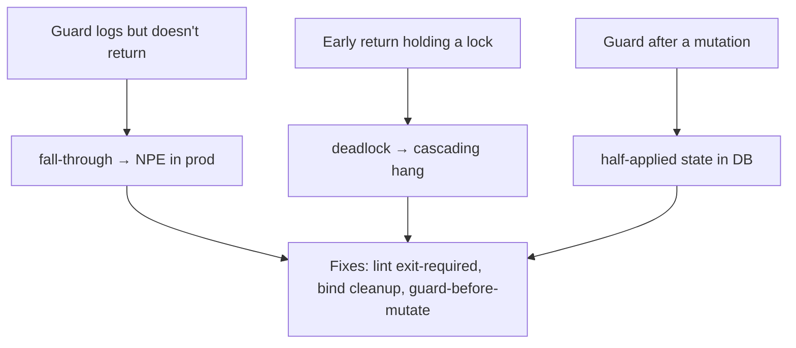

# Guard Clauses & Early Return — Professional Level

> **Category:** [Control-Flow Patterns](../README.md) — handle invalid and edge cases up front, then return, keeping the happy path un-nested.

> **Prerequisites:** [Junior](junior.md) · [Middle](middle.md) · [Senior](senior.md)
> **Focus:** **Production** — testing, metrics, incidents, review standards

---

## Table of Contents

1. [Introduction](#introduction)
2. [Testing Guard Clauses](#testing-guard-clauses)
3. [Readability Metrics & Linters](#readability-metrics-linters)
4. [Real Incidents](#real-incidents)
5. [Code Review Standards](#code-review-standards)
6. [Enforcing the Pattern in CI](#enforcing-the-pattern-in-ci)
7. [Guards, Observability, and Errors](#guards-observability-and-errors)
8. [Team Conventions](#team-conventions)
9. [Edge Cases in Production](#edge-cases-in-production)
10. [Cheat Sheet](#cheat-sheet)
11. [Diagrams](#diagrams)
12. [Related Topics](#related-topics)

---

## Introduction

> Focus: **production** — what guard clauses cost and protect once code is live, observed, and maintained by a team.

A guard clause is the cheapest reliability mechanism you have: one line that converts an undefined behavior into a defined, logged, observable rejection. At the professional level the questions are operational:

- How do you **test** that every guard fires (and that the happy path is reachable)?
- Which **metrics and linters** actually reward guard clauses, and which ignore them?
- What **incidents** are caused by a *missing* guard, a *swallowed* guard, or an *early return that skipped cleanup*?
- What **review and CI standards** keep guards consistent across a codebase of hundreds of contributors?

---

## Testing Guard Clauses

Each guard is a branch. A guard you don't test is a failure mode you've never exercised. The discipline: **one test per guard, plus one for the happy path.**

### Java — parameterized guard tests

```java
@Test void rejectsNullCustomer() {
    assertThatThrownBy(() -> service.place(null, items))
        .isInstanceOf(NullPointerException.class)
        .hasMessageContaining("customer");
}

@Test void rejectsEmptyItems() {
    assertThatThrownBy(() -> service.place(customer, List.of()))
        .isInstanceOf(IllegalArgumentException.class)
        .hasMessageContaining("items");
}

@Test void rejectsInactiveCustomer() {
    assertThatThrownBy(() -> service.place(inactiveCustomer, items))
        .isInstanceOf(IllegalStateException.class);
}

@Test void placesOrderOnValidInput() {        // the happy path MUST be tested too
    Order o = service.place(customer, items);
    assertThat(o.items()).hasSize(items.size());
}
```

### Go — table-driven guard tests

```go
func TestWithdraw_Guards(t *testing.T) {
    tests := []struct {
        name    string
        amount  Money
        balance Money
        wantErr error
    }{
        {"negative", money(-1), money(100), ErrNegativeAmount},
        {"overdraft", money(200), money(100), ErrInsufficientFunds},
        {"happy",     money(50),  money(100), nil},   // happy path in the table
    }
    for _, tt := range tests {
        t.Run(tt.name, func(t *testing.T) {
            a := &Account{Balance: tt.balance}
            err := a.Withdraw(tt.amount)
            if !errors.Is(err, tt.wantErr) {
                t.Fatalf("got %v, want %v", err, tt.wantErr)
            }
        })
    }
}
```

### Python — one test per precondition

```python
import pytest

@pytest.mark.parametrize("amount,exc", [
    (-1, ValueError),       # negative guard
    (0, ValueError),        # zero guard
    (10_000, ValueError),   # overdraft guard
])
def test_withdraw_guards(amount, exc):
    acct = Account(balance=100)
    with pytest.raises(exc):
        acct.withdraw(amount)

def test_withdraw_happy_path():
    acct = Account(balance=100)
    assert acct.withdraw(40) == 60
```

> **Coverage tip:** branch coverage (not line coverage) is what reveals an untested guard. A guard with an unexercised branch is invisible to line coverage but flagged by branch coverage. Configure your tooling for branch coverage on validation-heavy code.

---

## Readability Metrics & Linters

The professional must know **which metric rewards the pattern**, because the wrong one will tell your team that guards "don't help."

| Metric / tool | Counts nesting? | Credits guards? |
|---|---|---|
| **Cyclomatic complexity** (McCabe) | No | **No** — branch count is unchanged by guarding |
| **Cognitive complexity** (SonarQube) | **Yes** | **Yes** — flattening nesting lowers the score |
| **Max nesting depth** (ESLint `max-depth`, Go `nestif`) | Yes | **Yes** — guards directly reduce it |
| **`gocritic` / `golangci-lint` `nestif`, `ifElseChain`** | Yes | Yes — flags collapsible `else` |
| **`pylint` `R1705` (no-else-return)** | n/a | **Yes** — flags `else` after a returning `if` |

Concrete linter rules a team should enable:

- **`no-else-return`** (pylint `R1705`, ESLint `no-else-return`): forbids `else` after a returning `if` — the single highest-value guard-clause rule.
- **`max-depth` / `nestif`**: caps nesting (e.g., 3). Forces guards instead of pyramids.
- **SonarQube cognitive complexity** threshold per function (e.g., 15). Nesting is penalized; guards are not.

**Key insight to communicate:** a cyclomatic-only gate is blind to the readability win. If your team's only quality gate is cyclomatic complexity, guard-clause refactors will show *no improvement on the dashboard* even though the code got dramatically more readable. Add a nesting-aware metric.

---

## Real Incidents

### Incident 1: The missing-`return` guard (silent fall-through)

A guard logged but did not return:

```java
if (account == null) {
    log.warn("null account in transfer");
    // MISSING: return / throw
}
ledger.debit(account.id(), amount);    // NPE in prod, 02:00, paging on-call
```

The guard *looked* present in review — there was an `if (account == null)`. But it only logged. **Postmortem fix:** lint rule requiring a control-flow exit (`return`/`throw`/`continue`) as the last statement of any `if` whose condition is a null/precondition check; plus a test asserting the null case throws. **Lesson:** a guard that doesn't exit is not a guard.

### Incident 2: Early return skipped a lock release

Pre-`defer` code (or `defer` forgotten):

```go
mu.Lock()
if cache.stale() {
    return refresh()        // BUG: returns while holding the lock → deadlock
}
mu.Unlock()
return cache.value()
```

Under a specific stale-cache condition, the early return left the mutex held forever; the next request hung, then every request hung, then the service fell over. **Fix:** `defer mu.Unlock()` immediately after `Lock()`. **Lesson:** the moment you add an early return to a function holding a resource, audit every exit — or, better, bind cleanup with `defer`/`finally`/RAII so no audit is needed. This is the single-exit cautionary tale, solved correctly.

### Incident 3: Guard after a side effect

```python
order.status = "PAID"          # mutated first
if gateway.charge(order) is None:
    return "declined"          # status already "PAID" — phantom paid orders
```

A declined charge left orders marked `PAID`. **Fix:** charge first, then mutate only on success. **Lesson:** guard (and perform the fallible step) **before** mutating durable state.

### Incident 4: Validation written as an assertion, stripped in prod

An input check was written as a Python `assert`:

```python
def withdraw(account, amount):
    assert amount > 0, "amount must be positive"   # BUG: stripped under python -O
    account.balance -= amount
```

In development everything passed. Production ran under `python -O`, which **removes all `assert` statements**. A negative `amount` from a malformed API call sailed straight through and *credited* the account. Same trap exists on the JVM when assertions aren't enabled (`-ea` off by default). **Fix:** input validation is a guard (`if amount <= 0: raise ValueError(...)`), never an assertion. Reserve `assert` for internal invariants you're willing to compile out. **Lesson:** an `assert` is a debugging aid for *your* bugs, not a guard against *callers'* bad input — guards must always run.

### Incident 5: Over-guarding hid a contract break

A core billing function accumulated guards re-validating data the API layer should have rejected. When the API validation was loosened in an unrelated change, malformed records sailed past — and the core guards silently `return`ed them as no-ops instead of failing, so revenue events were *dropped silently* for days before anyone noticed the dip. **Lesson:** core guards that *return* (rather than fail loudly) can mask a boundary regression. In the core, prefer [Fail Fast](../02-fail-fast/junior.md) — throw — over silently returning.

---

## Code Review Standards

A reviewer evaluating control flow should check, in order:

1. **Does each `if`-precondition exit?** (`return`/`throw`/`continue`/`break`). A logging-only "guard" is a bug.
2. **Is there an `else` after a returning `if`?** Request flattening.
3. **Do guards run before any mutation or resource acquisition?** Reject "mutate then validate."
4. **Is cleanup bound to scope** (`defer`/try-with-resources/`with`), so early returns are leak-safe?
5. **Is the error vocabulary consistent** with the layer (throw vs return-error vs default)?
6. **Is the guard *count* reasonable** (≤ ~5)? Many guards → flag for responsibility split, not approval.
7. **Throw for caller errors; default-return only for genuinely expected edge cases.**
8. **Is the happy path the un-nested final statement(s)?**

### Review comment templates

> "This `else` is redundant — the `if` above returns. Drop the `else` to flatten."

> "Guard fires after `order.status = PAID`. Move it above the mutation so a failed check can't leave a half-applied state."

> "Seven guards here touching five subsystems — can validation move to each subsystem's boundary so this function trusts its inputs?"

---

## Enforcing the Pattern in CI

```yaml
# .golangci.yml (Go)
linters:
  enable:
    - nestif        # flags deeply nested if blocks
    - gocritic      # ifElseChain, singleCaseSwitch, etc.
linters-settings:
  nestif:
    min-complexity: 4
```

```ini
# setup.cfg / pylintrc (Python)
[MESSAGES CONTROL]
enable = R1705,R1720   # no-else-return, no-else-raise
[DESIGN]
max-nested-blocks = 3
```

```jsonc
// .eslintrc (JS/TS, transferable concept)
{ "rules": { "no-else-return": "error", "max-depth": ["error", 3] } }
```

```xml
<!-- SonarQube quality gate -->
<rule key="cognitive-complexity"><threshold>15</threshold></rule>
```

These rules don't *create* guard clauses, but they make the *absence* of them (deep nesting, dangling `else`) fail the build, steadily pushing the codebase toward the pattern.

---

## Guards, Observability, and Errors

A production guard should be **observable**, not silent.

```go
if req.Size > maxBytes {
    metrics.Counter("upload.rejected", "reason", "too_large").Inc()
    log.Warn("upload rejected", "size", req.Size, "max", maxBytes)
    return ErrTooLarge          // typed, mapped to a 413 at the boundary
}
```

Guidelines:
- **Each rejection guard should be countable** — a metric labeled by reason turns "things are failing" into "27% of uploads rejected as too_large since 14:00."
- **Map guard outcomes to stable error types/codes**, not ad-hoc strings, so the boundary can translate them to HTTP status / exit codes consistently.
- **Don't log-and-continue.** Log *and exit*. (See Incident 1.)
- **Distinguish caller-error guards (4xx, `warn`) from server-error paths (5xx, `error`)** so alerting doesn't page on normal client mistakes.

---

## Team Conventions

Codify these in your style guide so the pattern is uniform:

1. **Guard block at the top, blank line, then the body.** Visual separation of "preconditions" from "work."
2. **One convention per layer:** boundary throws typed exceptions; Go core returns wrapped `error`; nothing returns bare `null` to mean failure.
3. **`requireNonNull` / `assert` / explicit `if` — pick one** for null guards and use it consistently.
4. **No `else` after `return`** — enforced by linter, not by reviewers' memory.
5. **Cap nesting at 3**; deeper means extract or guard.
6. **Test every guard + the happy path**; branch coverage on validation code.

---

## Rolling Out the Pattern to an Existing Codebase

You rarely get to write guard clauses on a greenfield project; usually you're introducing them to a codebase full of arrows. The professional approach is incremental and measurable.

1. **Add the linters in *warn* mode first.** Turn on `no-else-return`, `nestif`/`max-depth`, and a cognitive-complexity report — but as warnings, not build failures. This produces a baseline count without blocking anyone.
2. **Set a ratchet, not a cliff.** Configure the quality gate to fail only if cognitive complexity *increases* on changed files (most CI tools support "new code" conditions). New code must be flat; old code is grandfathered.
3. **Refactor opportunistically, behind tests.** "Replace Nested Conditional with Guard Clauses" is behavior-preserving, so it's safe to apply whenever you touch a file — but only with characterization tests in place first, because a mis-inverted condition (`if x` vs `if !x`) silently flips behavior.
4. **Promote warnings to errors once the baseline is clean.** When the warning count on active files reaches zero, flip the rules to `error`.

This ordering matters: flipping a `max-depth` rule to `error` on day one fails hundreds of files and gets the rule disabled by an annoyed team. The ratchet makes the pattern the path of least resistance instead of a wall.

### Measuring the win honestly

When you report the refactor's impact, report the **right** metric:

- ✅ "Mean cognitive complexity on the billing module dropped from 24 to 11; max nesting depth from 6 to 2."
- ✅ "Median review time on these files fell, and we closed the class of 'wrong-else' defects."
- ❌ "Cyclomatic complexity dropped" — it almost certainly didn't, and quoting it makes the whole report suspect.

If your only dashboard metric is cyclomatic complexity, a guard-clause refactor will look like it did nothing. That's a tooling gap, not a sign the refactor was worthless — fix the dashboard.

---

## Edge Cases in Production

- **Concurrency:** a guard reading shared state (`if cache.stale()`) may race; the condition can change between the guard and the action. Guard inside the lock, or make the check-and-act atomic.
- **Partial failure across resources:** with multiple `defer`s, cleanup runs in LIFO order on early return — verify that order is correct (e.g., flush before close).
- **Panics/exceptions bypassing guards:** a guard only runs if reached. An exception thrown *before* the guard (e.g., during argument evaluation) skips it — keep guard conditions cheap and side-effect-free.
- **Hot-path guards:** a guard on a million-times-per-second path should be branch-predictor-friendly and allocation-free (no string formatting unless the guard fires). See [Optimize](optimize.md).

---

## Cheat Sheet

```text
REVIEW CHECKLIST
[ ] every precondition-if EXITS (return/throw/continue/break)
[ ] no else after a returning if
[ ] guards run BEFORE any mutation / acquisition
[ ] cleanup bound to scope (defer / finally / with / RAII)
[ ] consistent error vocabulary for the layer
[ ] guard count ≤ ~5 (else: split the function)
[ ] throw for caller error; default-return only for expected edge
[ ] happy path is the flat, final statement(s)
[ ] each guard tested + happy path tested (branch coverage)
[ ] rejection guards emit a metric/log (observable, not silent)
```

---

## Diagrams

### Guard outcome → observability → boundary mapping

```mermaid
flowchart LR
    G[Guard fires] --> M[metric: rejected{reason}]
    G --> L[log: warn + context]
    G --> E[return typed error]
    E --> B["Boundary maps error → 4xx/5xx<br/>(consistent per layer)"]
```

### The three incident shapes



---

## Related Topics

- **Next:** [Interview](interview.md)
- **Practice:** [Tasks](tasks.md), [Find-Bug](find-bug.md), [Optimize](optimize.md)
- **Sibling patterns:** [Fail Fast](../02-fail-fast/junior.md), [Null Object](../03-null-object/junior.md), [Special Case](../04-special-case/junior.md)
- **Makes early return safe:** [RAII & Dispose](../../03-resource-and-type-safety/01-raii-and-dispose/junior.md)
- **Linting/quality:** SonarQube cognitive complexity, `golangci-lint nestif`, pylint `no-else-return`.

---

[← Senior](senior.md) · [Control-Flow](../README.md) · [Roadmap](../../../README.md) · **Next:** [Interview](interview.md)
