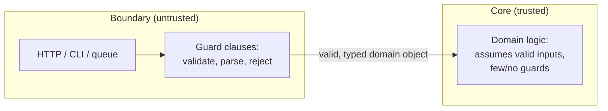
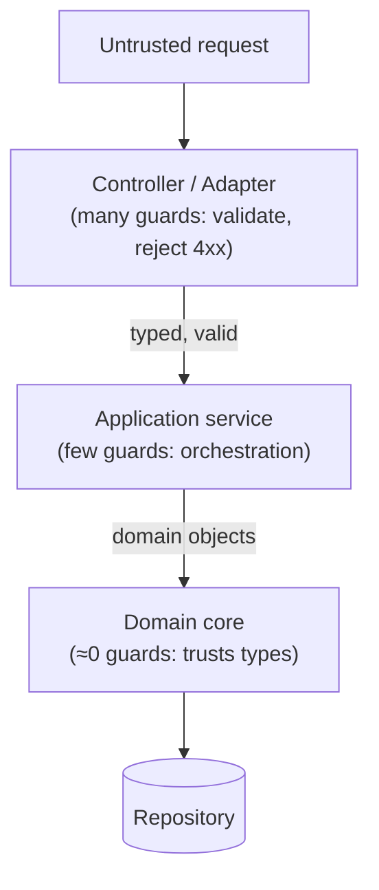
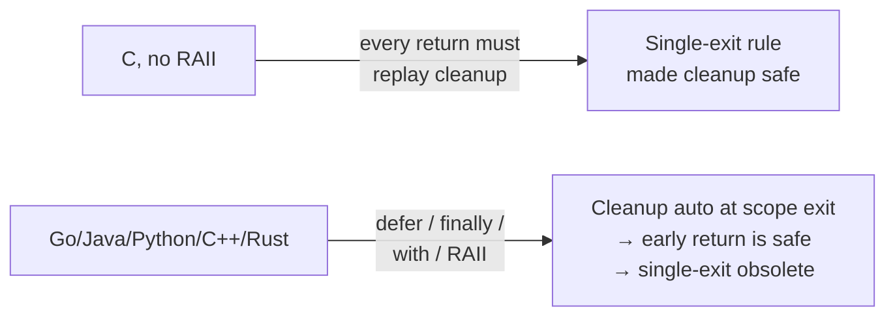

# Guard Clauses & Early Return — Senior Level

> **Category:** [Control-Flow Patterns](../README.md) — handle invalid and edge cases up front, then return, keeping the happy path un-nested.

> **Prerequisites:** [Junior](junior.md) · [Middle](middle.md)
> **Focus:** **Design trade-offs** and **system-level reasoning**

---

## Table of Contents

1. [Introduction](#introduction)
2. [The Single-Exit Debate, Settled](#the-single-exit-debate-settled)
3. [Why Single-Exit Existed — and Why It Doesn't Anymore](#why-single-exit-existed-and-why-it-doesnt-anymore)
4. [Cyclomatic vs Visual Complexity](#cyclomatic-vs-visual-complexity)
5. [Guards vs Assertions vs Defensive Programming](#guards-vs-assertions-vs-defensive-programming)
6. [Guard Granularity: One Combined vs Many Separate](#guard-granularity-one-combined-vs-many-separate)
7. [Guard Clauses as a Function-Design Signal](#guard-clauses-as-a-function-design-signal)
8. [Alternatives to Guards](#alternatives-to-guards)
9. [Guards at the System Boundary](#guards-at-the-system-boundary)
10. [Code Examples — Advanced](#code-examples-advanced)
11. [When NOT to Use Guards](#when-not-to-use-guards)
12. [Early Return vs Result/Option Types](#early-return-vs-resultoption-types)
13. [Pros & Cons at the System Level](#pros-cons-at-the-system-level)
14. [Liabilities](#liabilities)
15. [Guard Placement and Testability](#guard-placement-and-testability)
16. [Diagrams](#diagrams)
17. [Related Topics](#related-topics)

---

## Introduction

> Focus: **design trade-offs** and **system-level reasoning**

At the senior level, guard clauses stop being a formatting preference and become a lens on three deeper questions:

1. **Function design** — how many guards a function carries is a measurement of how many responsibilities it has.
2. **Complexity metrics** — guards change *visual* complexity without changing *cyclomatic* complexity, and knowing the difference changes how you read a linter report.
3. **Architecture** — where guards live (at the boundary vs. deep in the core) determines whether your domain logic can assume valid inputs at all.

This file also settles the **single-exit vs. multiple-return** debate, because it still surfaces in code reviews and is worth being able to end decisively.

---

## The Single-Exit Debate, Settled

The argument against guard clauses is always the same: *"a function should have a single exit point."* The senior position:

> **Early return is almost always more readable, and the single-exit rule is a historical artifact that no longer applies to languages with `defer`/`finally`/RAII.**

The evidence:

- **Nesting depth, not return count, is what correlates with bug density.** Studies of real codebases (and every cognitive-complexity metric since) weight nesting heavily and count linear early returns as cheap. Single-exit *increases* nesting to *decrease* return count — it optimizes the wrong variable.
- **The happy path is what readers care about.** Single-exit buries it; guards expose it.
- **The one real benefit of single-exit — a guaranteed cleanup site — is now provided by the language**, not by control-flow discipline.

When single-exit still wins: a tiny function (3–4 lines) where a single `if/else` is already flat, or a language with no scoped cleanup *and* manual resource management (effectively only old C, and even there `goto cleanup` is the idiom — itself a structured early exit).

---

## Why Single-Exit Existed — and Why It Doesn't Anymore

The rule comes from **structured programming** (1960s–70s) and from **C without RAII**. In that world:

```c
int process(const char *path) {
    FILE *f = fopen(path, "r");
    if (!f) return -1;            // early return is fine...

    char *buf = malloc(1024);
    if (!buf) {
        fclose(f);               // ...but now EVERY early return must
        return -1;               // manually undo EVERY prior acquisition
    }

    if (read_header(f, buf) < 0) {
        free(buf);               // and the cleanup list grows with each
        fclose(f);               // resource — easy to forget one
        return -1;
    }
    // ... real work ...
    free(buf);
    fclose(f);
    return 0;
}
```

Every early return had to replay the entire cleanup sequence by hand. Forgetting one line leaked a handle. **Single-exit (or `goto cleanup`) made cleanup correct by funneling all paths through one teardown block.** That was the entire justification.

Modern languages dissolve it:

```go
func process(path string) error {
    f, err := os.Open(path)
    if err != nil {
        return err              // no manual cleanup needed below this point
    }
    defer f.Close()             // ← cleanup bound to scope, runs on EVERY return

    buf, err := readHeader(f)
    if err != nil {
        return err              // f.Close() still runs
    }
    return work(buf)
}
```

`defer` (Go), try-with-resources (Java), `with`/context managers (Python), and RAII destructors (C++/Rust) all guarantee cleanup at scope exit **regardless of how many return points there are.** The original reason for single-exit is gone, so the rule that depended on it should go with it. This is the deep link between this pattern and [RAII & Dispose](../../03-resource-and-type-safety/01-raii-and-dispose/junior.md): **RAII is what makes early return safe.**

---

## Cyclomatic vs Visual Complexity

This distinction is the single most useful thing a senior can articulate about guard clauses.

**Cyclomatic complexity** = number of linearly independent paths ≈ number of branches + 1. Converting nesting to guards **does not change it**:

```python
# Cyclomatic complexity = 4 (three conditions + 1)
if a:
    if b:
        if c:
            return work()

# STILL cyclomatic complexity = 4 — same three conditions
if not a: return None
if not b: return None
if not c: return None
return work()
```

Same branch count, same number of test cases needed for full coverage. A cyclomatic linter scores these **identically**.

**Cognitive / visual complexity** (SonarQube's metric, and how humans actually read) penalizes **nesting depth**: each level of indentation adds an increment, and a nested condition costs *more* than a flat one. By that measure the two versions are very different:

| Version | Cyclomatic | Cognitive (nesting-weighted) |
|---|---|---|
| Nested arrow | 4 | high (1 + 2 + 3 = 6) |
| Guarded | 4 | low (1 + 1 + 1 = 3) |

**The takeaway:** if someone says "guard clauses don't reduce complexity," they're right about *cyclomatic* and wrong about the complexity that matters for reading. Guards trade nesting (expensive to a human) for extra exit points (cheap to a human). That trade is the whole value of the pattern.

---

## Guards vs Assertions vs Defensive Programming

A guard clause and an `assert` look similar but encode different contracts, and a senior must place each correctly.

| Mechanism | Audience | When it fires | Stripped in prod? |
|---|---|---|---|
| **Guard clause** (`if … throw/return`) | The *caller* — enforces the public contract | On invalid *input* | No — always runs |
| **Assertion** (`assert`, `assert x != null`) | The *implementer* — documents an *internal* invariant that should be impossible to violate | On a *bug* in your own code | Often yes (Java `-ea`, Go has none, Python `-O`) |
| **Defensive copy / null-coalesce** | Tolerates bad input by repairing it | Silently | No |

The decision rule:

- **Public/boundary function → guard clause.** The caller is untrusted; the check must always run and produce a clear, stable error.
- **Private helper, invariant "can't happen" → assertion.** It documents an assumption and catches *your own* logic bugs in test/staging, and can be compiled out in hot production paths.
- **Never use an assertion to validate untrusted input.** If assertions are disabled in production (a common JVM and Python configuration), your "guard" vanishes and the bad input sails through. This is a recurring security bug: input validation written as `assert`.

```java
// PUBLIC API → guard (always runs)
public Order place(Customer c, List<Item> items) {
    if (c == null) throw new IllegalArgumentException("customer required");  // contract
    ...
}

// PRIVATE helper → assertion (an invariant the caller above already guaranteed)
private Total sum(List<Item> items) {
    assert items != null : "place() already guarded non-null";  // bug-catcher, may be stripped
    ...
}
```

Guard at the trust boundary; assert inside the trusted region. Mixing them up either bloats the core with redundant guards or, worse, ships validation that disappears under `-O`.

---

## Guard Granularity: One Combined vs Many Separate

A subtle senior call is *how finely* to split guards. Both extremes are wrong.

```java
// TOO COARSE — one vague failure for four distinct problems
if (req == null || req.body == null || req.body.isEmpty() || req.size > max)
    throw new BadRequest("invalid request");   // which one? undebuggable in prod logs

// TOO FINE — a guard per field of a value object the boundary already validated
if (req.user.name == null) ...
if (req.user.name.isBlank()) ...
if (req.user.email == null) ...
// (this belongs in the User type's constructor, not here)

// RIGHT — one guard per distinct, separately-actionable failure
if (req == null)            throw new BadRequest("request required");
if (req.body == null)       throw new BadRequest("body required");
if (req.body.isEmpty())     throw new BadRequest("body empty");
if (req.size > max)         throw new BadRequest("body too large: " + req.size);
```

The principle: **one guard per failure a caller could fix differently.** Two conditions that always have the same cause and the same remedy can share a guard; conditions a user resolves differently (or that you'd alert on separately) deserve their own. Granularity is an observability decision as much as a readability one — each guard is a distinct log line and metric label in production.

---

## Guard Clauses as a Function-Design Signal

The **count and nature** of a function's guards is diagnostic.

### Healthy: 1–4 guards on inputs

A handful of guards validating the function's contract is exactly right. They form a readable precondition block and let the body assume validity.

### Smell: many guards → too many responsibilities

```python
def submit_order(order, user, inventory, payment, shipping, promo):
    if order is None: ...
    if user is None: ...
    if not user.verified: ...
    if not inventory.has(order.items): ...
    if payment.declined: ...
    if not shipping.available(order.address): ...
    if promo and promo.expired: ...
    # ... 9 guards before any work
```

Nine guards is not "thorough validation." It's the function announcing that it touches seven subsystems. The fix is not *fewer* guards — it's **fewer responsibilities**: push each validation to the boundary of the subsystem that owns it, so this function receives already-valid inputs. This connects guard clauses to the **Single Responsibility Principle**: an over-guarded function is an over-coupled function.

### Smell: guards re-validating the same thing at every layer

If `submit_order`, then `chargePayment`, then `capturePayment` all guard `payment != null`, the type system should be carrying that invariant, not three guards. **Validate once at the boundary; trust the type inside the core** — see the next section.

---

## Alternatives to Guards

Guards are a tool, not the only one. A senior knows when a *different* pattern removes the need for the guard entirely.

| Instead of guarding for… | Consider… |
|---|---|
| `if (x == null) return doNothing()` repeated everywhere | [Null Object](../03-null-object/junior.md) — absence becomes a polymorphic no-op |
| A recurring special value (missing customer, unknown user) | [Special Case](../04-special-case/junior.md) |
| `if (status == 1)` / magic-int checks | [Type-Safe Enums](../../03-resource-and-type-safety/02-type-safe-enums/junior.md) — the compiler guards for you |
| `if (x == null)` at all, pervasively | Non-null types (Kotlin `T` vs `T?`, `Optional`, `@NonNull`) — make null unrepresentable |
| Branching on type | Polymorphism / dispatch — replace the conditional with a method |

The deepest version of this insight: **the best guard is the one the type system makes unnecessary.** A guard is a *runtime* check for something that, ideally, would be a *compile-time* guarantee. When you find yourself guarding the same invariant in many functions, that invariant wants to live in a type. See [Type-Safe Enums](../../03-resource-and-type-safety/02-type-safe-enums/junior.md) and [Parse, Don't Validate](#guards-at-the-system-boundary) below.

---

## Guards at the System Boundary

Guards belong at the **edges** of the system, not scattered through the core. The architectural principle is **"validate at the boundary, trust inside."**



This is the essence of **"Parse, don't validate"**: instead of repeatedly *checking* a raw `String email` everywhere, the boundary *parses* it once into an `Email` type that cannot exist in an invalid state. After the boundary, the core needs no email guards — the type is the proof.

The payoff:
- **Guards cluster at controllers, deserializers, and adapters** — the places that receive untrusted data.
- **Domain functions stay flat and guard-free** because their inputs are already-validated types.
- **An over-guarded domain function is a sign the boundary leaked** — untrusted data reached the core, and now every core function re-checks it defensively.

---

## Code Examples — Advanced

### Java — boundary guards vs. trusted core

```java
// BOUNDARY: validates untrusted input, throws on contract violation
public record CreateUserRequest(String email, int age) {
    public CreateUserRequest {                       // compact constructor = guard site
        if (email == null || !email.contains("@"))
            throw new IllegalArgumentException("invalid email");
        if (age < 0 || age > 150)
            throw new IllegalArgumentException("age out of range");
    }
}

// CORE: receives an already-valid record, no guards needed
public User register(CreateUserRequest req) {
    return new User(req.email(), req.age());         // flat — trust the type
}
```

The record's compact constructor is a guard block that runs *once* at construction. Every downstream function that takes a `CreateUserRequest` is relieved of re-validating.

### Go — guards + `defer` make multi-resource flows flat

```go
func Export(ctx context.Context, q Query, dst io.Writer) error {
    rows, err := db.QueryContext(ctx, q.SQL())
    if err != nil {
        return fmt.Errorf("query: %w", err)
    }
    defer rows.Close()                       // safe across all returns below

    w := csv.NewWriter(dst)
    defer w.Flush()

    for rows.Next() {
        var r Record
        if err := rows.Scan(&r.ID, &r.Name); err != nil {
            return fmt.Errorf("scan: %w", err)   // rows.Close + w.Flush still run
        }
        if r.Hidden {
            continue                         // in-loop guard
        }
        if err := w.Write(r.Fields()); err != nil {
            return fmt.Errorf("write: %w", err)
        }
    }
    return rows.Err()
}
```

Three resources, multiple early returns, zero nesting, zero leaks. This is exactly the flow that single-exit C made painful and that `defer` + guards make trivial.

### Python — replace a guard pyramid with parse-don't-validate

```python
from dataclasses import dataclass

# Instead of guarding raw strings everywhere, parse once into a type
@dataclass(frozen=True)
class Port:
    value: int
    def __post_init__(self):
        if not (1 <= self.value <= 65535):
            raise ValueError(f"port out of range: {self.value}")

def bind(host: str, port: Port) -> Socket:
    # No port guard here — a Port that exists is already valid
    return Socket(host, port.value)
```

The guard moves into the type's constructor and fires once. Every function taking a `Port` is freed from range-checking.

---

## When NOT to Use Guards

- **When the condition is a genuine business branch**, not a precondition. `if premiumUser then X else Y` is not a guard; both arms are normal.
- **When you'd be re-guarding an invariant a type could carry.** Lift it into the type instead (parse, don't validate).
- **When the function already has too many guards** — the answer is to split the function, not to add a guard for the smell.
- **When absence has a sensible default behavior** — use a [Null Object](../03-null-object/junior.md) so callers don't guard at all.
- **When silent default would mask a real error** — there, [Fail Fast](../02-fail-fast/junior.md) with a *throwing* guard is correct, not a returning one.

---

## Early Return vs Result/Option Types

In languages with `Result`/`Either`/`Option` (Rust, Scala, Kotlin, Swift, and increasingly functional Java/TS), there's a second axis to the early-return decision: do you `return` early, or thread a `Result` through and let `?`/`map`/`flatMap` short-circuit for you?

```rust
// Imperative early return (guard style)
fn load(path: &str) -> Result<Config, Error> {
    let data = match fs::read(path) {
        Ok(d) => d,
        Err(e) => return Err(e.into()),   // explicit early return
    };
    parse(&data)
}

// The `?` operator IS an early-return guard, built into the language
fn load(path: &str) -> Result<Config, Error> {
    let data = fs::read(path)?;   // `?` = "if Err, return Err early"
    parse(&data)
}
```

The senior insight: **`?` / `flatMap` / monadic short-circuit is the guard clause lifted into the type system.** It's an early return that the compiler inserts, with the bad case (the `Err`/`None`) flowing through automatically. The trade-off:

- **Explicit `if … return`** is maximally readable for *imperative* code and lets each guard log/wrap differently.
- **`?`/monadic chaining** removes the visible guards entirely, at the cost of every step needing to speak the same `Result` type.

Go deliberately rejected `?`-style sugar in favor of explicit `if err != nil`, betting that visible guards are clearer than hidden ones. Rust bet the opposite. Both are coherent — the point is that *early return and Result-propagation are the same pattern at different levels of automation*, and a senior chooses based on how much the codebase has committed to a uniform error type.

---

## Pros & Cons at the System Level

| Dimension | Early Return / Guards | Single Exit / Nesting |
|---|---|---|
| Happy-path readability | High — flat, top-to-bottom | Low — buried in `else` |
| Cognitive complexity | Low | High (nesting-weighted) |
| Cleanup correctness | Delegated to `defer`/`finally`/RAII | Centralized at one exit (the old appeal) |
| Diff noise when adding a precondition | One line at top | A new nesting level (large diff) |
| Debugger exit breakpoints | Several | One |
| Greppability of failure modes | High — each guard is a line | Low — failures tangled in branches |
| Risk if a `return` is forgotten | Fall-through to happy path | n/a |
| Risk if cleanup language feature missing | Resource leak | Safe |

The table makes the senior position concrete: every row favors guards *given* a language with scoped cleanup. The two rows where single-exit wins ("cleanup correctness," "risk if cleanup feature missing") are exactly the rows that modern languages neutralize with `defer`/`finally`/RAII — which is why the debate is settled the way it is.

---

## Liabilities

### Liability 1: Guard creep masking a god function

Every bug fix adds "one more guard." Over a year the function accretes a dozen. Each individually looks reasonable; together they're a design failure. **Treat guard count as a budget**; when it's exceeded, refactor responsibilities, don't add guards.

### Liability 2: Defensive guards in the core

Core code that re-validates inputs it should be able to trust is paying for a leaky boundary. The guards aren't the disease; they're the symptom of untrusted data reaching too deep.

### Liability 3: Early return that skips an *invariant restoration*, not just cleanup

`defer`/`finally` handle resource cleanup, but a guard that returns in the middle of a multi-step state mutation can leave an object's invariants broken even with no resource leak. Guard **before** the first mutation, or make the mutation atomic.

### Liability 4: Inconsistent error vocabulary

Some guards throw, some return `null`, some return error codes — within one module. Readers can't predict a function's failure mode. Pick one convention per layer (throw at boundary, return `error` in Go core, etc.) and hold it.

---

## Guard Placement and Testability

How you arrange guards has a direct effect on how testable the function is — a system-level concern, not a cosmetic one.

A function whose guards all live at the top, each on its own line, has a **flat branch structure**: N guards produce N+1 paths, each reachable by a single, obvious input. That maps one-to-one onto N+1 test cases. A nested arrow with the *same* logic has the same number of paths, but several are reachable only by satisfying a *conjunction* of conditions — harder to construct, easier to leave untested.

```python
# Flat guards → each branch hit by one targeted input
def f(x):
    if x is None:   return A   # test: f(None)
    if x.empty:     return B   # test: f(empty)
    if x.bad:       return C   # test: f(bad)
    return work(x)             # test: f(valid)

# Nested → branch C reachable only via (not None) AND (not empty) AND bad
def f(x):
    if x is not None:
        if not x.empty:
            if x.bad:
                return C       # requires constructing the full conjunction
            return work(x)
        return B
    return A
```

The flat version makes **branch coverage a checklist**: one test per guard plus one for the happy path, and you've covered everything. This is why the [Professional](professional.md) testing strategy — "one test per guard" — works cleanly only on guard-clause-shaped code. Refactoring to guards isn't just a readability move; it's a *testability* move that turns coverage from an exercise in conjunction-solving into a flat enumeration.

This also explains why over-guarded functions are doubly bad: a function with nine guards needs ten tests *and* ten collaborators wired up per test. The testability pain is the same signal as the SRP pain — both say "split me."

---

## Diagrams

### Where guards live in a layered system



### The single-exit justification, then and now



---

## Related Topics

- **Next:** [Guard Clauses — Professional](professional.md)
- **Practice:** [Tasks](tasks.md), [Find-Bug](find-bug.md), [Optimize](optimize.md), [Interview](interview.md)
- **Sibling patterns:** [Fail Fast](../02-fail-fast/junior.md), [Null Object](../03-null-object/junior.md), [Special Case](../04-special-case/junior.md)
- **Makes early return safe:** [RAII & Dispose](../../03-resource-and-type-safety/01-raii-and-dispose/junior.md)
- **Removes the need for guards:** [Type-Safe Enums](../../03-resource-and-type-safety/02-type-safe-enums/junior.md)
- **The anti-pattern guards destroy:** [Arrow Anti-Pattern](../../../anti-patterns/01-development/README.md)

---

[← Middle](middle.md) · [Control-Flow](../README.md) · [Roadmap](../../../README.md) · **Next:** [Professional](professional.md)
