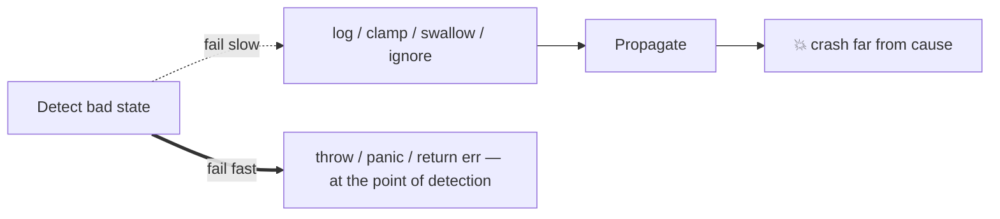

# Fail Fast — Find the Bug

> **Category:** [Control-Flow Patterns](../README.md) — spot the places where bad state is allowed to propagate instead of being stopped at the point of detection.

11 buggy snippets across Go, Java, and Python.

---

## Bug 1: Log-and-Continue Instead of Throw (Java)

```java
public Order build() {
    if (items.isEmpty()) log.warn("order has no items");   // BUG
    return new Order(id, items, total);
}
```

**Symptoms:** Empty orders are created; they blow up later in fulfilment, far from here.

<details><summary>Find the bug</summary>

Validation *logs* but doesn't stop. The invalid `Order` is still constructed and propagates.

</details>

### Fix

```java
if (items.isEmpty()) throw new IllegalStateException("order must have at least one item");
```

### Lesson

A logged warning is not a guarantee. Fail fast means *stop*, not *note it down*.

---

## Bug 2: Validation Behind a Java `assert` (Java)

```java
public void withdraw(Account acct, long cents) {
    assert acct != null : "acct required";   // BUG: no-op in production
    assert cents > 0     : "cents > 0";       // BUG
    acct.debit(cents);
}
```

**Symptoms:** Works in tests (run with `-ea`), NPEs or allows negative withdrawals in production.

<details><summary>Find the bug</summary>

Assertions are disabled by default in a production JVM (`-ea` not passed). The "validation" vanishes.

</details>

### Fix

```java
Objects.requireNonNull(acct, "acct");
if (cents <= 0) throw new IllegalArgumentException("cents must be > 0, got " + cents);
```

### Lesson

Never put production validation behind `assert`. Use `requireNonNull`/`throw`.

---

## Bug 3: Assert for Validation in Python (Python)

```python
def set_discount(pct):
    assert 0 <= pct <= 100, "discount must be 0..100"   # BUG: stripped under -O
    _state["discount"] = pct
```

**Symptoms:** Under `python -O`, any value (including 5000% or -1) is accepted silently.

<details><summary>Find the bug</summary>

`assert` is removed when Python runs optimized (`-O`). Real validation disappears.

</details>

### Fix

```python
if not 0 <= pct <= 100:
    raise ValueError(f"discount must be 0..100, got {pct}")
```

### Lesson

`assert` is for internal invariants, never for input validation in Python.

---

## Bug 4: Side Effect Before Validation (Java)

```java
public Connection(String url, int port) {
    REGISTRY.add(this);                       // BUG: registered before validation
    if (port < 1 || port > 65535)
        throw new IllegalArgumentException("bad port " + port);
    this.url = url; this.port = port;
}
```

**Symptoms:** When the constructor throws, a half-built, invalid `Connection` is already in `REGISTRY`.

<details><summary>Find the bug</summary>

The object registers itself *before* validating. On a thrown exception, the broken object is already referenced elsewhere.

</details>

### Fix

```java
public Connection(String url, int port) {
    if (port < 1 || port > 65535) throw new IllegalArgumentException("bad port " + port);
    this.url = Objects.requireNonNull(url, "url");
    this.port = port;
    REGISTRY.add(this);   // only after the object is fully valid
}
```

### Lesson

Validate all arguments before any side effect. Fail fast must leave no half-built object behind.

---

## Bug 5: Ignored Error in Go (Go)

```go
cfg, _ := LoadConfig()           // BUG: error ignored
server := NewServer(cfg)         // runs with a zero-value (broken) config
server.ListenAndServe()
```

**Symptoms:** Server starts with empty `DBURL`/`Port`; crashes on the first request instead of at startup.

<details><summary>Find the bug</summary>

The returned error is discarded with `_`. Returning an error *is* fail-fast only if the caller checks it.

</details>

### Fix

```go
cfg, err := LoadConfig()
if err != nil {
    log.Fatalf("config error: %v", err)   // crash at startup, loudly
}
```

### Lesson

An ignored error turns fail-fast back into fail-slow. Always check it.

---

## Bug 6: Swallowing the Exception (Python)

```python
def process(payload):
    try:
        order = build_order(payload)   # may raise on invalid invariant
    except Exception:
        order = None                   # BUG: hides the real failure
    return ship(order)                 # ships None → AttributeError far away
```

**Symptoms:** A broken `payload` produces `order = None`, and the crash surfaces inside `ship`, unrelated to the cause.

<details><summary>Find the bug</summary>

The broad `except` swallows the fail-fast signal and continues on `None`. Bad state propagates.

</details>

### Fix

```python
try:
    order = build_order(payload)
except ValueError as e:
    raise BadRequest(str(e))   # convert to a boundary response; don't silently continue
return ship(order)
```

### Lesson

Catching to silence is the opposite of fail fast. Catch only to *translate* a failure at a boundary.

---

## Bug 7: Panic for Recoverable Input (Go)

```go
func ParseAge(s string) int {
    n, err := strconv.Atoi(s)
    if err != nil {
        panic("bad age: " + s)   // BUG: user input shouldn't crash the process
    }
    return n
}
```

**Symptoms:** A user typing "abc" panics the request goroutine (and the process if unrecovered).

<details><summary>Find the bug</summary>

Bad *user input* is expected and recoverable — it should return an error, not panic. Panic is for impossible programmer errors.

</details>

### Fix

```go
func ParseAge(s string) (int, error) {
    n, err := strconv.Atoi(s)
    if err != nil {
        return 0, fmt.Errorf("age must be a number, got %q", s)
    }
    return n, nil
}
```

### Lesson

Fail fast on bugs, not on expected input. Match the mechanism (error vs panic) to recoverability.

---

## Bug 8: recover() Not in a Deferred Function (Go)

```go
func safe(work func()) {
    work()
    if r := recover(); r != nil {   // BUG: recover() outside a defer returns nil
        log.Printf("recovered: %v", r)
    }
}
```

**Symptoms:** A panic in `work()` unwinds straight past this `recover` (which always sees `nil`) and crashes the process.

<details><summary>Find the bug</summary>

`recover()` only captures a panic when called *directly inside a deferred function*. Here `work()` has already unwound before the `recover` line runs.

</details>

### Fix

```go
func safe(work func()) {
    defer func() {
        if r := recover(); r != nil {
            log.Printf("recovered: %v", r)
        }
    }()
    work()
}
```

### Lesson

`recover` must live in a `defer`. Otherwise the failure boundary doesn't exist.

---

## Bug 9: Clamping Instead of Rejecting (Java)

```java
public void setRetries(int n) {
    this.retries = Math.max(0, Math.min(n, 10));   // BUG: silently "fixes" bad input
}
// caller: setRetries(-5)  → silently becomes 0
// caller: setRetries(999) → silently becomes 10
```

**Symptoms:** A caller bug (passing -5 or 999) is masked. The configured behavior silently differs from what was asked.

<details><summary>Find the bug</summary>

Clamping hides a programmer error. The caller thinks it set 999 retries; it got 10, with no signal.

</details>

### Fix

```java
public void setRetries(int n) {
    if (n < 0 || n > 10) throw new IllegalArgumentException("retries must be in [0,10], got " + n);
    this.retries = n;
}
```

### Lesson

Defensive clamping at an *internal* boundary buries bugs. Fail fast so the caller's mistake surfaces. (Clamping is acceptable only at a deliberately tolerant *perimeter*, and even then it should be logged.)

---

## Bug 10: Validation After Use (Python)

```python
def charge(account, cents):
    account.balance -= cents          # BUG: mutate first...
    if cents <= 0:                    # ...validate after
        raise ValueError("cents must be > 0")
    gateway.charge(account.token, cents)
```

**Symptoms:** On `cents = -50`, the balance is already corrupted (`balance -= -50` adds money) before the exception fires.

<details><summary>Find the bug</summary>

The mutation happens *before* the check. Even though it throws, the damage is done — the invariant is already broken.

</details>

### Fix

```python
def charge(account, cents):
    if cents <= 0:
        raise ValueError(f"cents must be > 0, got {cents}")
    account.balance -= cents
    gateway.charge(account.token, cents)
```

### Lesson

Fail fast *before* any state mutation. A check after the damage doesn't prevent corruption.

---

## Bug 11: Panic in a Goroutine With No Recover (Go)

```go
func StartWorker(jobs <-chan Job) {
    go func() {
        for j := range jobs {
            handle(j)   // BUG: handle may panic on a poison job → kills whole process
        }
    }()
}
```

**Symptoms:** One malformed `Job` panics the goroutine; with no `recover`, the entire process aborts, dropping every other worker and request.

<details><summary>Find the bug</summary>

An unrecovered panic in a goroutine takes down the *whole process*, not just that goroutine. There's no failure boundary around `handle`.

</details>

### Fix

```go
func StartWorker(jobs <-chan Job) {
    go func() {
        for j := range jobs {
            func(j Job) {
                defer func() {
                    if r := recover(); r != nil {
                        log.Printf("job %v panicked: %v", j.ID, r)   // contain to one job
                    }
                }()
                handle(j)
            }(j)
        }
    }()
}
```

### Lesson

Fail fast *within* a small unit (one job), bounded by a recover so the failure unit stays small. Each long-lived goroutine needs its own boundary.

---

## The Shape of Every Bug Here



Every bug above is some variant of taking the dotted path (swallow, clamp, ignore, validate-too-late, panic-the-wrong-unit) instead of the solid one.

---

## Practice Tips

1. **Run Go code with `go test -race`** — racy reads make fail-fast guards unreliable.
2. **Run Java tests with and without `-ea`** to catch assert-based "validation."
3. **Run Python under `-O`** to expose `assert`-guarded validation.
4. **Grep for `_ =` (Go) and bare `except:`** — common fail-slow smells.
5. **Check that mutation never precedes validation** in any method that changes state.

---

[← Tasks](tasks.md) · [Control-Flow Patterns](../README.md) · **Next:** [Optimize](optimize.md)
