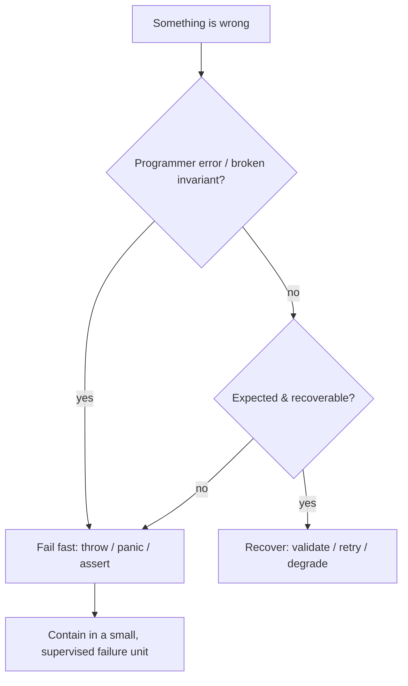

# Fail Fast — Interview Questions

> **Category:** [Control-Flow Patterns](../README.md) — detect broken preconditions and invariants at the earliest point and stop loudly.

---

## Junior Questions (10)

### J1. What is "fail fast"?

**Answer:** A coding pattern: the moment code can detect a broken precondition, invariant, or corrupt state, it stops immediately and loudly (throw/panic/return error) instead of continuing on bad state.

### J2. Why does failing fast make debugging easier?

**Answer:** The program crashes *next to the cause*, with the offending value named, so the distance between the bug and the symptom is zero. Failing slow crashes far away, in code unrelated to the actual bug.

### J3. What is "blast radius"?

**Answer:** How much state gets corrupted (or work lost) before a failure is caught. Fail fast shrinks it toward zero by stopping at the point of detection.

### J4. Where is the earliest place to enforce an object's invariant?

**Answer:** The **constructor** — reject invalid arguments so an invalid object can never be constructed, and no downstream code has to wonder whether it's valid.

### J5. What does `Objects.requireNonNull` do, and why use it?

**Answer:** It throws `NullPointerException` (with a message) if the argument is null, and returns the value otherwise. It fails fast on a null dependency at the boundary, with a clear message, instead of an obscure NPE later.

### J6. Difference between `assert` and `throw`/`raise` for validation?

**Answer:** `throw`/`raise`/`return error` always run and are for production validation. `assert` documents internal invariants and is often stripped in production (Java needs `-ea`; Python `-O` removes it), so never use it for real input validation.

### J7. In Go, how do you fail fast?

**Answer:** Return an `error` for recoverable/expected conditions (and the caller must check it); `panic` only for impossible programmer errors. An *ignored* error is fail-slow.

### J8. Give an example where you should NOT crash even though something is "wrong."

**Answer:** A user submits an invalid form, or an upstream service times out. These are expected/recoverable — validate and return a 4xx, or retry/degrade. Don't crash on the world being the world.

### J9. What's a good fail-fast error message?

**Answer:** One that names what was expected and what was actually received: `"cents must be >= 0, got -5"`, not `"invalid argument"`.

### J10. How does fail fast relate to guard clauses?

**Answer:** A [guard clause](../01-guard-clauses-and-early-return/junior.md) at the top of a function is usually the literal fail-fast check — it rejects bad input before any work happens.

---

## Middle Questions (10)

### M1. Fail fast vs fail safe — what's the difference?

**Answer:** Fail fast *stops loudly* to surface bugs; fail safe *keeps running in a degraded but safe mode* to stay available. They operate at different layers: fail fast on internal invariants, fail safe at the external boundary.

### M2. When should you fail fast, and when should you recover?

**Answer:** Fail fast on programmer errors and broken invariants (irrecoverable bugs). Recover from expected, environmental failures (bad user input, transient network errors). The question is "whose fault, and is it recoverable?"

### M3. Why validate configuration at startup?

**Answer:** So a missing/invalid config crashes on boot — loudly, in deployment — rather than throwing on the first request in production hours later. Smallest possible blast radius.

### M4. What is Design by Contract and how does fail fast relate?

**Answer:** Meyer's model: preconditions (caller's obligation), postconditions (function's promise), invariants (always true). Fail fast is the runtime enforcement — a violated precondition means the *caller's* bug, a violated postcondition means *ours*; failing fast pins down who's at fault.

### M5. Why is logging-and-continuing not failing fast?

**Answer:** The program keeps running on corrupt state. A logged warning isn't a guarantee — the bad value still propagates and crashes later. Fail fast must *stop* (throw/return error), not just record.

### M6. How does fail fast affect availability?

**Answer:** Counterintuitively it *raises* it: failing fast in dev/CI catches bugs before they ship. Combined with small failure units + supervision, you fail fast *and* stay available in production.

### M7. Why is `assert` dangerous for validation in Java and Python?

**Answer:** Java assertions are off unless `-ea` is passed (default off in prod); Python strips asserts under `-O`. Validation behind an assert silently becomes a no-op in production.

### M8. How do database constraints support fail fast?

**Answer:** `NOT NULL`, `CHECK`, and foreign keys reject corrupt rows at the storage layer — the last fail-fast line, catching anything that slipped past application validation.

### M9. Give a real example of fail-fast core + fail-safe edge.

**Answer:** A Go HTTP server: handlers `panic` on impossible internal states (fail fast), and a recover middleware converts a panic into a 500 for *that one request* without killing the server (fail safe). Inner offensive, outer defensive.

### M10. What's the risk of failing fast inside a loop over a batch?

**Answer:** Crashing on item 500 of 1000 discards 499 good results. You must deliberately choose: fail the whole batch, or collect errors and continue. Both are valid; the default shouldn't be accidental.

---

## Senior Questions (10)

### S1. Offensive vs defensive programming — when each?

**Answer:** Defensive at the perimeter (untrusted input: HTTP, deserialization, public SDK) — sanitize, reject, never crash. Offensive in the core (your code calling your code) — assert/throw on any contract violation, because a violation there is a bug you want screaming. Defensive-everywhere buries bugs.

### S2. Explain "let it crash" (Erlang/OTP).

**Answer:** Don't write defensive code for impossible states inside an isolated process — let it crash, and let a supervisor restart it into a known-good state. Share-nothing processes + a supervision tree with restart strategies and intensity limits turn local fail-fast into global stability.

### S3. What is crash-only software?

**Answer:** Stopping = crashing; starting = recovering. No separate graceful-shutdown path (untested paths fail when needed). State lives in crash-safe stores; operations are idempotent. The recovery path becomes the *normal* path, so it actually works — and you can fail fast anywhere.

### S4. How does failure-unit size relate to how aggressively you can fail fast?

**Answer:** The smaller and cheaper-to-restart the unit (function, request, pod, process), the more aggressively you can fail fast for free — a supervisor restores capacity instantly. A large stateful unit makes crashing expensive, which pressures teams into fail-slow and shipped corruption.

### S5. How do you push fail-fast to compile time?

**Answer:** Make illegal states unrepresentable: non-null types (Kotlin/Rust), `NonEmptyList`, typed wrappers (`Email`, `PositiveInt`), type-safe enums, "parse don't validate." The failure moves from a runtime throw to a compile error — the earliest possible failure point.

### S6. "Parse, don't validate" — what does it mean for fail fast?

**Answer:** At the boundary, convert unstructured input into a type that *can only hold valid data*. The check happens once, at construction; the core receives a value that's provably valid and needs no re-checks. The type *is* the proof.

### S7. How do you prevent a fail-fast architecture from becoming a restart loop?

**Answer:** Restart-intensity limits (OTP-style: N crashes in a window → escalate, not restart), plus dead-letter queues for poison messages. A permanent fault escalates instead of looping forever and masking the problem.

### S8. Where do fail fast and circuit breakers fit together?

**Answer:** Circuit breaker is fail-*safe* at the dependency boundary — it stops hammering a failing service and fails fast *for callers* in a controlled way (returns immediately instead of timing out). It's the resilient edge wrapping the offensive core.

### S9. A team is defensive everywhere and bugs still hide. Diagnose.

**Answer:** Tolerant code (null checks, clamping, swallowed errors) in internal modules absorbs bad state instead of surfacing it, so bugs survive and corrupt downstream. Fix: defend only at the perimeter; make the core offensive so violations crash in CI.

### S10. How does RAII relate to fail fast?

**Answer:** [RAII/dispose](../../03-resource-and-type-safety/01-raii-and-dispose/junior.md) is fail-fast for resources — cleanup is bound to scope exit and happens deterministically, so a leaked handle can't propagate. The resource is released at the point of detection (scope end), not left to chance.

---

## Professional Questions (5)

### P1. What does a fail-fast guard cost on the happy path?

**Answer:** Effectively zero. It's one comparison and a never-taken branch; after branch prediction warms up, the predicted branch is ~0–1 cycle, the throw block is laid out cold, and the exception allocates only when fired. Exception: expensive predicates (regex, scans) cost every call.

### P2. What's the dominant cost of throwing a Java exception?

**Answer:** `fillInStackTrace()` in the constructor walks the stack (~1–10 µs, depth-dependent). Fine on a rare path; catastrophic as control flow in a loop. Mitigate with stackless exceptions or a returned result type for hot expected failures.

### P3. Why does Go have no `assert`?

**Answer:** Deliberate: an `assert` that can be compiled away tempts people to rely on it. Go forces `if !cond { panic(...) }`, which always runs and can't be optimized out — and `error` returns (cheap, ~30 ns) for the recoverable case, matching cost to intent.

### P4. How does the JVM fail fast on null without an explicit check?

**Answer:** `x.foo()` on a null `x` traps via hardware (`SIGSEGV` on the null page), which the JVM converts to a `NullPointerException` at zero happy-path cost. `requireNonNull` exists to fail *earlier* with a *better message*, not to add missing safety.

### P5. What is a fail-fast iterator and what's its limitation?

**Answer:** `ArrayList`'s iterator tracks `modCount`; structural modification during iteration triggers `ConcurrentModificationException` on the next `next()`. It's **best-effort** (not guaranteed under data races) — it exists to surface the *bug* of mutating-while-iterating near its cause, not as a thread-safety mechanism.

---

## Trick Questions (5)

### T1. Is returning an error in Go "failing fast"?

**Answer:** Only if the caller checks it. A returned-and-checked error fails fast; an *ignored* `err` is fail-slow. The mechanism is necessary but not sufficient — the discipline of checking is what makes it fail fast.

### T2. Does failing fast hurt availability?

**Answer:** No — usually the opposite. Failing fast in dev/CI keeps bugs from shipping; with small failure units and supervision you fail fast *and* stay available. The myth comes from coupling fail-fast to a *large* failure unit.

### T3. Is `assert user != null` enough validation in production Java?

**Answer:** No. Assertions are off by default (`-ea` required), so it's a no-op in production. Use `Objects.requireNonNull` or an explicit `throw`.

### T4. Should every internal function validate all its inputs?

**Answer:** No — that's defensive-everywhere, which buries bugs and adds noise. Validate at the perimeter and in constructors; let the offensive core trust the invariants already enforced.

### T5. If a goroutine panics and isn't recovered, does only that goroutine die?

**Answer:** No — an unrecovered panic unwinds to the top of the goroutine and aborts the **entire process**. Each long-lived goroutine needs its own `recover` boundary.

---

## Behavioral / Scenario Questions (5)

### B1. Tell me about a bug fail-fast would have caught earlier.

**Sample:** "A `null` config field propagated three services deep before NPE-ing in a logging call. Adding `requireNonNull` at the config boundary moved the failure to startup, naming the field — minutes to fix instead of hours."

### B2. When did you choose *not* to fail fast?

**Sample:** "A batch importer hit one malformed row in 50k. Crashing would've lost the whole import. We routed bad rows to a quarantine table with line numbers and continued — fail-safe at the batch boundary, fail-fast per-row into the quarantine."

### B3. How do you decide between throwing and returning an error?

**Sample:** "Recoverable/expected → typed error the caller handles (bad input, I/O). Impossible/invariant violation → throw/panic. The cost model agrees in Go: errors are cheap, panic is for bugs."

### B4. Describe introducing fail-fast to a fail-slow codebase.

**Sample:** "We added perimeter validation, stripped tolerant internal checks, added a request-level recover boundary, and added postcondition asserts on the money-conservation invariant. Bug-find-time in CI went up, prod incidents went down."

### B5. How do you keep fail-fast from becoming flaky crashes?

**Sample:** "Make sure the failure unit is small and supervised, add restart-intensity limits and dead-letter queues so poison input escalates instead of crash-looping, and reserve panics for genuinely impossible states."

---

## The One Diagram to Remember

Almost every fail-fast interview answer reduces to this decision:

---

## Tips for Answering

1. **Lead with the value:** crash near the cause, shrink the blast radius.
2. **Always draw the line:** fail fast on bugs/invariants, recover from expected/environmental failures.
3. **Know the layering:** offensive core, defensive perimeter, resilient edge.
4. **Cite the cost model:** guards are free on the happy path; throws cost only when fired.
5. **Mention the architecture:** let-it-crash, crash-only, supervision, compile-time fail-fast.

---

[← Professional](professional.md) · [Control-Flow Patterns](../README.md) · **Next:** [Tasks](tasks.md)
