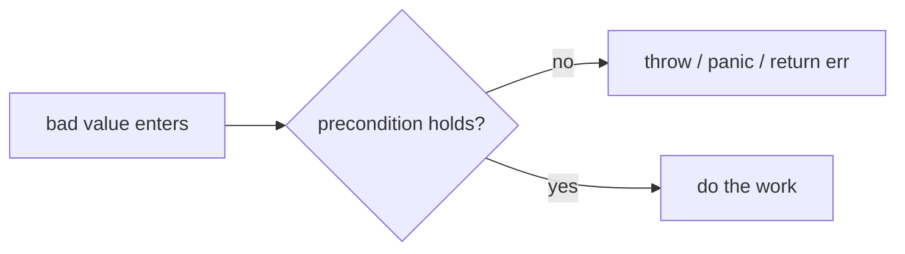
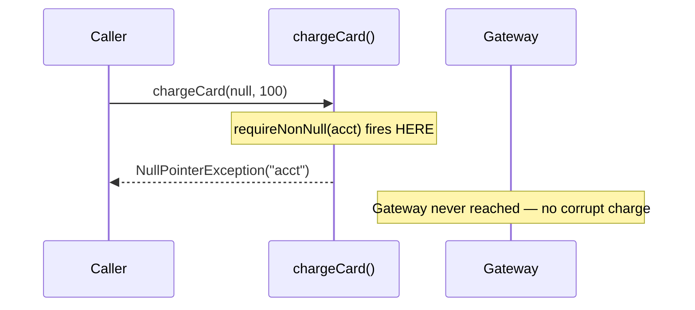

# Fail Fast — Junior Level

> **Category:** [Control-Flow Patterns](../README.md) — detect a broken precondition or corrupt state at the earliest possible point and stop loudly, instead of letting bad state crawl forward and crash somewhere unrelated.

---

## Table of Contents

1. [Introduction](#introduction)
2. [Prerequisites](#prerequisites)
3. [Glossary](#glossary)
4. [Core Concepts](#core-concepts)
5. [Real-World Analogies](#real-world-analogies)
6. [Mental Models](#mental-models)
7. [Pros & Cons](#pros-cons)
8. [Use Cases](#use-cases)
9. [Code Examples](#code-examples)
10. [Coding Patterns](#coding-patterns)
11. [Clean Code](#clean-code)
12. [Best Practices](#best-practices)
13. [Edge Cases & Pitfalls](#edge-cases-pitfalls)
14. [Common Mistakes](#common-mistakes)
15. [Tricky Points](#tricky-points)
16. [Test Yourself](#test-yourself)
17. [Cheat Sheet](#cheat-sheet)
18. [Summary](#summary)
19. [Further Reading](#further-reading)
20. [Related Topics](#related-topics)
21. [Diagrams](#diagrams)

---

## Introduction

> Focus: **What is it?** and **How to use it?**

**Fail Fast** is a coding pattern: the moment your code can tell that something is wrong — a `null` where a value is required, a negative count, an object that was never fully built — it **stops immediately and loudly** (throws, panics, returns an error) instead of limping forward.

The opposite, **fail slow**, is the default if you do nothing. Bad data slips past the function that received it, gets stored, gets passed to three other functions, and finally blows up — at 2 a.m., in a stack trace that has nothing to do with where the bug actually lives.

### Why this matters

```java
// Fail slow — the bug hides
void chargeCard(Account acct, int cents) {
    // acct is null, but we don't notice here
    gateway.charge(acct.cardToken(), cents);   // NullPointerException... eventually
}
```

The crash happens *inside the payment gateway call*, far from the real cause (whoever passed `null`). You spend an hour reading gateway code that is perfectly fine.

```java
// Fail fast — the bug confesses
void chargeCard(Account acct, int cents) {
    Objects.requireNonNull(acct, "acct");
    if (cents <= 0) throw new IllegalArgumentException("cents must be > 0, got " + cents);
    gateway.charge(acct.cardToken(), cents);
}
```

Now the exception fires **on the first line**, naming the offending argument. The distance between *bug* and *symptom* collapses to zero.

---

## Prerequisites

- **Required:** Functions, parameters, and return values.
- **Required:** How your language signals errors — exceptions (Java/Python), `panic` and error returns (Go).
- **Helpful:** [Guard Clauses & Early Return](../01-guard-clauses-and-early-return/junior.md) — a guard clause at the top of a function is often the literal fail-fast check.

---

## Glossary

| Term | Definition |
|------|-----------|
| **Fail fast** | Stop at the first sign of a broken assumption, at the point of detection. |
| **Precondition** | Something that must be true *before* a function runs (e.g., "amount > 0"). |
| **Postcondition** | Something that must be true *after* it runs. |
| **Invariant** | Something that must *always* be true for an object (e.g., "balance ≥ 0"). |
| **Assertion** | A statement that a condition holds; if it doesn't, abort. |
| **Blast radius** | How far bad state spreads before it is caught. Fail fast shrinks it to zero. |
| **Validating constructor** | A constructor that rejects invalid arguments so a broken object can never exist. |

---

## Core Concepts

### 1. Detect at the earliest point

The earliest point you can check a precondition is the **top of the function that depends on it** — or, better, the **constructor** of the object that carries it. The earlier you check, the smaller the blast radius.

### 2. Stop loudly, not quietly

"Loudly" means an exception, a `panic`, or a returned error that the caller *cannot ignore by accident*. Logging a warning and continuing is **not** failing fast — the program keeps running on corrupt state.

### 3. Never let an invalid object exist

If a `BankAccount` requires a non-negative balance, the constructor enforces it. Code downstream never has to wonder "is this balance valid?" — it can't have been built otherwise.

### 4. Fail fast is for *your* bugs

Fail fast targets **programmer errors and broken invariants** — things that should *never* happen if the code is correct. A user typing a bad email is *expected* input; you validate and respond politely, you don't crash. (More on this distinction at the [middle](middle.md) level.)

---

## Real-World Analogies

| Concept | Analogy |
|---|---|
| **Fail fast** | A smoke detector that screams at the first wisp of smoke, not after the house is ablaze. |
| **Validating constructor** | A bouncer checking IDs at the door — no invalid guest ever gets inside. |
| **Fail slow** | A slow leak in a tire: fine for 40 miles, then a blowout on the highway, miles from the nail. |
| **Blast radius** | A circuit breaker that trips the instant of a fault, isolating one room instead of burning the building. |
| **Assertion** | A "wet paint" sign — catches you *before* you lean on the wall, not after. |

---

## Mental Models

**The intuition:** *"Crash near the cause, not near the symptom."*

```
fail slow:   [bad input] → f → g → h → 💥  (crash in h, cause was in f's caller)
                                        └── you debug h, g, f... in that order

fail fast:   [bad input] → 💥           (crash at the door, with the bad value named)
```

A second model: **distance between bug and symptom**. Every layer the bad value passes through is another suspect you must clear during debugging. Fail fast sets that distance to zero.

```
detect ──immediately──> stop
   │                      │
   └── name the value ────┘   (good message = instant diagnosis)
```

---

## Pros & Cons

| Pros | Cons |
|------|------|
| Bugs surface next to their cause | More upfront check code |
| Tiny blast radius — no corrupt state spreads | Can crash on inputs you should have *handled* (see middle level) |
| Stack traces point at the real problem | Over-checking clutters internal helpers |
| Objects are always valid once constructed | A naive panic in a server can take down a whole request — needs a boundary |
| Cheaper to debug; faster to fix | Requires discipline at every entry point |

### When to use:
- Validating function **arguments** at a public boundary.
- Enforcing **invariants** in constructors.
- Catching **programmer errors** — `null`, out-of-range, illegal state — that "can't happen."

### When NOT to use *as a crash*:
- **Expected, recoverable conditions** (bad user input, a network timeout). Validate and respond; don't panic.

---

## Use Cases

- **Constructors** — reject invalid field values so half-built objects never exist.
- **Public API boundaries** — validate arguments before doing work.
- **Configuration loading** — a missing required env var should crash on startup, not on first request.
- **Parsing** — refuse malformed input at the parse step, not three transformations later.
- **State machines** — reject an illegal transition immediately.

---

## Code Examples

### Java — validating constructor + argument checks

```java
public final class Money {
    private final long cents;
    private final String currency;

    public Money(long cents, String currency) {
        // Fail fast: an invalid Money can never be constructed.
        if (cents < 0) throw new IllegalArgumentException("cents must be >= 0, got " + cents);
        this.currency = Objects.requireNonNull(currency, "currency");
        if (currency.length() != 3)
            throw new IllegalArgumentException("currency must be ISO-4217, got " + currency);
        this.cents = cents;
    }

    public Money plus(Money other) {
        if (!this.currency.equals(other.currency))
            throw new IllegalArgumentException("cannot add " + currency + " to " + other.currency);
        return new Money(cents + other.cents, currency);
    }
}
```

**Highlights:**
- `Objects.requireNonNull` throws on `null` *and* returns the value, so it doubles as an assignment guard.
- Every field is validated **before** assignment — no invalid `Money` escapes.
- `plus` fails fast on a currency mismatch instead of silently adding USD to EUR.

---

### Python — exceptions and assertions

```python
class Money:
    def __init__(self, cents: int, currency: str):
        if cents < 0:
            raise ValueError(f"cents must be >= 0, got {cents}")
        if len(currency) != 3:
            raise ValueError(f"currency must be ISO-4217, got {currency!r}")
        self.cents = cents
        self.currency = currency

    def plus(self, other: "Money") -> "Money":
        if self.currency != other.currency:
            raise ValueError(f"cannot add {self.currency} to {other.currency}")
        return Money(self.cents + other.cents, self.currency)


def midpoint(values: list[int]) -> int:
    # assert documents an internal invariant: the caller must pass a non-empty list.
    assert values, "midpoint requires a non-empty list"
    return values[len(values) // 2]
```

> **`assert` vs `raise`:** use `raise` for conditions you must enforce in production (input validation). Use `assert` only for *internal* invariants — Python strips asserts under `python -O`, so never guard real validation with them.

---

### Go — error-return discipline and `panic` for programmer errors

```go
package money

import (
    "errors"
    "fmt"
)

type Money struct {
    cents    int64
    currency string
}

// NewMoney fails fast: it returns an error rather than a half-valid value.
func NewMoney(cents int64, currency string) (Money, error) {
    if cents < 0 {
        return Money{}, fmt.Errorf("cents must be >= 0, got %d", cents)
    }
    if len(currency) != 3 {
        return Money{}, fmt.Errorf("currency must be ISO-4217, got %q", currency)
    }
    return Money{cents: cents, currency: currency}, nil
}

func (m Money) Plus(other Money) (Money, error) {
    if m.currency != other.currency {
        return Money{}, errors.New("currency mismatch")
    }
    return NewMoney(m.cents+other.cents, m.currency)
}

// mustIndex panics: an out-of-range index here is a *programmer* bug, not bad input.
func mustIndex(s []int, i int) int {
    if i < 0 || i >= len(s) {
        panic(fmt.Sprintf("index %d out of range [0,%d)", i, len(s)))
    }
    return s[i]
}
```

**Go rule of thumb:** return an `error` for conditions a caller could reasonably hit (bad input, I/O); `panic` only for *impossible* states that mean the program is broken.

---

## Coding Patterns

### Pattern 1: Guard at the top (the fail-fast guard clause)

```python
def withdraw(account, amount):
    if account is None:        raise ValueError("account required")
    if amount <= 0:            raise ValueError("amount must be > 0")
    if amount > account.balance: raise ValueError("insufficient funds")
    account.balance -= amount   # happy path, flat and safe
```

Every guard is a fail-fast check. See [Guard Clauses & Early Return](../01-guard-clauses-and-early-return/junior.md).

### Pattern 2: Validate-then-assign in constructors

Check **all** arguments before touching `this`/`self`, so a thrown exception leaves no partially-built object behind.

### Pattern 3: `requireNonNull` / null guards

```java
this.repo = Objects.requireNonNull(repo, "repo");
```

A `null` dependency injected at construction fails *now*, not on the first method call hours later.



---

## Clean Code

### Good failure messages name the value

| ❌ Bad | ✅ Good |
|---|---|
| `throw new IllegalArgumentException()` | `throw new IllegalArgumentException("cents must be >= 0, got " + cents)` |
| `assert x` | `assert x, "x must be set before flush()"` |
| `return errors.New("bad")` | `fmt.Errorf("currency must be ISO-4217, got %q", c)` |

A fail-fast message should answer "*what was expected, and what did we actually get?*" in one line.

### Check early, check once

Validate at the boundary (constructor, public method). Don't re-check the same invariant in every private helper — once it's enforced at the door, the inside can trust it.

---

## Best Practices

1. **Validate constructor arguments before assigning any field.**
2. **Throw/return — never log-and-continue** for a broken invariant.
3. **Name the offending value** in the message.
4. **Use `requireNonNull` (Java) / explicit `nil` checks (Go)** at dependency boundaries.
5. **Reserve `panic`/`assert` for "impossible" programmer errors**, not user input.
6. **Fail at startup, not at first use** — validate config when the app boots.

---

## Edge Cases & Pitfalls

- **Partially-constructed objects** — if you assign some fields *then* throw, the object may already be referenced (e.g., registered in a list). Validate first.
- **Asserts disabled in production** — Java needs `-ea`; Python strips them under `-O`. Don't rely on them for real validation.
- **Swallowed exceptions** — a `try/catch` that logs and continues turns fail-fast back into fail-slow.
- **Failing fast on *expected* input** — crashing on a user's typo is a bug, not a feature.

---

## Common Mistakes

1. **Logging instead of throwing** — `log.warn("null acct")` then continuing. The bad state still propagates.
2. **Validating too late** — checking inside a deep helper after the value already corrupted three things.
3. **Catching `Exception` broadly** and hiding the real cause.
4. **Generic messages** — `"invalid argument"` tells the next engineer nothing.
5. **Using `assert` for production validation** — vanishes when assertions are off.

---

## Tricky Points

- **Fail fast vs fail safe.** Fail fast *stops*; fail safe *keeps running in a degraded but safe mode*. They are not enemies — you fail fast on internal invariants and fail safe at the user boundary.
- **A returned error in Go *is* failing fast** — as long as the caller checks it. An ignored `err` is fail-slow.
- **Validation order matters:** check the cheapest, most likely-to-fail conditions first; name the *first* problem clearly.

---

## Test Yourself

1. What does "fail fast" mean in one sentence?
2. Why does failing fast make debugging easier?
3. What is the difference between `assert` and `raise`/`throw` for validation?
4. When should you *not* crash even though something is "wrong"?
5. Where is the earliest place to enforce an object's invariant?

<details><summary>Answers</summary>

1. Detect a broken precondition or invariant at the earliest point and stop loudly instead of continuing on bad state.
2. The crash happens next to the cause, with the bad value named, so the distance between bug and symptom is zero.
3. `raise`/`throw` enforce conditions in production; `assert` documents internal invariants and is often disabled in production builds.
4. When the condition is *expected*, recoverable input (bad user data, a transient network error) — validate and respond, don't crash.
5. The object's **constructor** — reject invalid arguments so a broken object can never exist.

</details>

---

## Cheat Sheet

```java
// Java
Objects.requireNonNull(x, "x");
if (n < 0) throw new IllegalArgumentException("n must be >= 0, got " + n);
```

```python
# Python
if x is None: raise ValueError("x required")
assert invariant, "internal invariant violated"   # internal only
```

```go
// Go
if x == nil { return fmt.Errorf("x required") }   // recoverable
if i < 0   { panic("programmer error: negative index") }  // impossible state
```

---

## Summary

- **Fail fast** = detect a broken precondition/invariant at the earliest point and stop loudly.
- It shrinks the **blast radius** and makes bugs crash *next to their cause*.
- Enforce invariants in **constructors**; validate arguments at **boundaries**.
- Use exceptions/error-returns for recoverable conditions; `panic`/`assert` for impossible programmer errors.
- Fail fast on *your* bugs; handle *expected* failures gracefully.

---

## Further Reading

- *The Pragmatic Programmer* (Hunt & Thomas) — "Dead Programs Tell No Lies" and "Crash Early."
- *Effective Java* (Joshua Bloch), Item 49 — "Check parameters for validity."
- Jim Shore, "Fail Fast" (IEEE Software, 2004).

---

## Related Topics

- **Next:** [Fail Fast — Middle](middle.md)
- **Sibling:** [Guard Clauses & Early Return](../01-guard-clauses-and-early-return/junior.md) — the guard clause is the fail-fast check.
- **Resource fail-fast:** [RAII & Dispose](../../03-resource-and-type-safety/01-raii-and-dispose/junior.md).
- **Error strategy:** [Error Handling](../../../clean-code/06-error-handling/README.md).

---

## Diagrams



[← Control-Flow Patterns](../README.md) · [Coding Patterns](../../README.md) · **Next:** [Fail Fast — Middle](middle.md)
