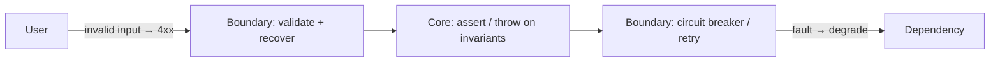
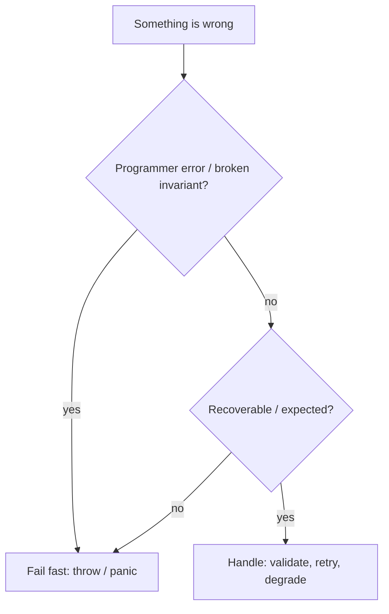

# Fail Fast — Middle Level

> **Category:** [Control-Flow Patterns](../README.md) — fail fast on internal invariants and developer errors; balance it against resilience at the user-facing boundary.

---

## Table of Contents

1. [Introduction](#introduction)
2. [When to Fail Fast](#when-to-fail-fast)
3. [When NOT to Fail Fast](#when-not-to-fail-fast)
4. [Fail Fast vs Fail Safe](#fail-fast-vs-fail-safe)
5. [Real-World Cases](#real-world-cases)
6. [Production-Grade Code](#production-grade-code)
7. [Trade-offs](#trade-offs)
8. [Design by Contract](#design-by-contract)
9. [Refactoring Toward Fail Fast](#refactoring-toward-fail-fast)
10. [Edge Cases](#edge-cases)
11. [Tricky Points](#tricky-points)
12. [Best Practices](#best-practices)
13. [Summary](#summary)
14. [Diagrams](#diagrams)

---

## Introduction

> Focus: **Why** and **When**

The junior skill is *how* to fail fast. The middle skill is *where the boundary sits* — which failures should crash, and which should be caught, retried, or degraded gracefully.

The governing rule: **fail fast on developer errors and broken invariants; recover from expected, environmental failures.**

- A `null` argument that "can't happen" → **crash**. It's a bug; surface it.
- A `400 Bad Request` from a flaky upstream → **handle it**. It's the world being the world.

Conflating the two is the single most common mistake. Crashing the whole server because one user sent malformed JSON is *over*-failing. Silently swallowing a `null` invariant is *under*-failing. The art is drawing the line.

---

## When to Fail Fast

Fail fast when **any** of:

1. **A precondition of a public function is violated** (null, out of range, wrong type).
2. **A class invariant would be broken** (negative balance, empty required collection).
3. **Configuration is missing at startup** — crash on boot, not on first request.
4. **A "this can't happen" branch is reached** — `default:` in a `switch`, an unreachable state.
5. **An external contract you own is violated internally** (one of your services hands another service a malformed message).

These are all **programmer errors**: correct code would never trigger them. Surfacing them immediately is how you find the bug.

---

## When NOT to Fail Fast

| Situation | Why not crash | Do instead |
|---|---|---|
| User submits invalid form data | Expected; the user is not a bug | Validate, return a 4xx with a clear message |
| Upstream service times out | Transient, environmental | [Retry](../../../../) with backoff, then degrade |
| Optional config absent | A default is fine | Use the default |
| A partial result is still useful | Crashing throws away good work | Return what you have, flag the rest |
| One request in a long-running server fails | Don't kill other requests | Fail *that request*, keep the server up |

The distinction is **whose fault is it, and is it recoverable?** Programmer error + irrecoverable → fail fast. Environmental + recoverable → resilience.

---

## Fail Fast vs Fail Safe

These are complementary strategies operating at *different layers*:

| | Fail Fast | Fail Safe / Fault Tolerant |
|---|---|---|
| Goal | Surface bugs immediately | Keep serving despite faults |
| Reaction | Stop loudly (throw/panic) | Degrade, retry, fall back |
| Applies to | Internal invariants, dev-time | External boundary, runtime |
| Example | `requireNonNull(repo)` | Circuit breaker on a payment API |
| Failure of the strategy | Crashing on expected input | Hiding a real bug behind a fallback |

A well-built system does **both**: it fails fast internally (so bugs are caught in dev/CI), and fails safe externally (so a flaky dependency doesn't take down the product). The fail-fast checks live *inside* the boundary; the resilience lives *at* the boundary.

```
[user] →  resilient boundary  →  fail-fast core  →  resilient boundary  → [dependency]
          (validate, retry)      (assert, throw)      (circuit breaker)
```

---

## Real-World Cases

### 1. Spring Boot startup validation

```java
@ConfigurationProperties("app")
public record AppConfig(@NotBlank String dbUrl, @Min(1) int poolSize) {}
```

A missing `dbUrl` makes the application **refuse to start**. Far better than booting "successfully" and throwing on the first DB call in production.

### 2. Database constraints as the last fail-fast line

`NOT NULL`, `CHECK (amount >= 0)`, and foreign keys are fail-fast at the storage layer — they reject corrupt rows even if application validation has a hole.

### 3. Kafka / message consumers

A consumer that receives a message it cannot deserialize should **not** silently `ack` and drop it. It fails fast (to a dead-letter queue) so the broken producer is discovered.

### 4. `panic`/`recover` at the HTTP boundary in Go

```go
func recoverMiddleware(next http.Handler) http.Handler {
    return http.HandlerFunc(func(w http.ResponseWriter, r *http.Request) {
        defer func() {
            if rec := recover(); rec != nil {
                log.Printf("panic: %v\n%s", rec, debug.Stack())
                http.Error(w, "internal error", 500)
            }
        }()
        next.ServeHTTP(w, r)
    })
}
```

Inner code fails fast with `panic`; the boundary converts that into a 500 for *one* request without killing the server. Fail-fast core, fail-safe edge.

---

## Production-Grade Code

### Java — invariant enforcement with a clear boundary

```java
public final class Order {
    private final String id;
    private final List<LineItem> items;
    private final Money total;

    public Order(String id, List<LineItem> items, Money total) {
        // Internal invariants — these are bugs if violated. Fail fast.
        this.id = requireNonBlank(id, "id");
        this.items = List.copyOf(requireNonEmpty(items, "items"));
        this.total = Objects.requireNonNull(total, "total");
        Money computed = items.stream().map(LineItem::subtotal).reduce(Money.ZERO, Money::plus);
        if (!computed.equals(total))
            throw new IllegalStateException("total " + total + " != sum of items " + computed);
    }

    private static String requireNonBlank(String s, String name) {
        if (s == null || s.isBlank()) throw new IllegalArgumentException(name + " must be non-blank");
        return s;
    }
    private static <T> List<T> requireNonEmpty(List<T> l, String name) {
        if (l == null || l.isEmpty()) throw new IllegalArgumentException(name + " must be non-empty");
        return l;
    }
}
```

The cross-field check (`total == sum of items`) catches a whole class of computation bugs at construction time.

### Python — separating validation from invariants

```python
from dataclasses import dataclass

@dataclass(frozen=True)
class Order:
    id: str
    items: tuple
    total: int  # cents

    def __post_init__(self):
        # Invariants: violations are programmer bugs.
        if not self.id:
            raise ValueError("id must be non-empty")
        if not self.items:
            raise ValueError("items must be non-empty")
        computed = sum(i.subtotal for i in self.items)
        if computed != self.total:
            raise ValueError(f"total {self.total} != sum of items {computed}")


def handle_request(payload: dict) -> Order:
    # Boundary: user input. Failures here are EXPECTED — return a 400, don't crash.
    try:
        return Order(payload["id"], tuple(payload["items"]), payload["total"])
    except (KeyError, ValueError) as e:
        raise BadRequest(str(e))   # mapped to HTTP 400, not a crash
```

The same `ValueError` is a *bug* if it fires from internal code and a *4xx* if it fires from parsing user input — the boundary decides which.

### Go — error for the recoverable, panic for the impossible

```go
func (s *Service) Transfer(from, to *Account, cents int64) error {
    // Recoverable / caller-facing: return an error.
    if cents <= 0 {
        return fmt.Errorf("amount must be positive, got %d", cents)
    }
    if from.Balance < cents {
        return ErrInsufficientFunds
    }
    // Invariant that must hold by construction: a bug if it doesn't.
    if from.Currency != to.Currency {
        panic("transfer between mismatched currencies: accounts should have been validated upstream")
    }
    from.Balance -= cents
    to.Balance += cents
    return nil
}
```

`cents <= 0` is plausible bad input → `error`. A currency mismatch *here* means an upstream validation failed → `panic` (a bug to fix, not a case to handle).

---

## Trade-offs

| Dimension | Fail Fast | Fail Slow (default) | Fail Safe |
|---|---|---|---|
| Debuggability | Excellent | Terrible | Medium |
| Blast radius | Zero | Large | Contained |
| Availability under faults | Lower (crashes) | Misleadingly high | Highest |
| Hides bugs | No | Yes | Sometimes |
| Right layer | Core / invariants | Never (it's the bug) | Boundary / runtime |

The trap is treating fail-fast and availability as opposites. They're not: failing fast in dev/CI *increases* production availability, because the bugs never ship.

---

## Design by Contract

Fail fast is the runtime enforcement of **Design by Contract** (Bertrand Meyer, Eiffel):

- **Preconditions** — the caller's obligation. Violated → caller's bug → fail fast.
- **Postconditions** — the function's promise. Violated → function's bug → fail fast.
- **Invariants** — always true between calls. Violated → corrupt object → fail fast.

```python
def sqrt(x: float) -> float:
    assert x >= 0, "precondition: x >= 0"           # caller's fault if violated
    result = _newton(x)
    assert abs(result * result - x) < 1e-9, "postcondition failed"  # our fault
    return result
```

Contracts make *who is at fault* explicit, which is exactly the information you want when something fails fast.

---

## Refactoring Toward Fail Fast

Given a function that fails slow:

```java
double price(Item item, int qty) {
    return item.unitPrice() * qty;   // qty negative? item null? silently wrong
}
```

**Step 1 — add guards at the top:**

```java
double price(Item item, int qty) {
    Objects.requireNonNull(item, "item");
    if (qty < 0) throw new IllegalArgumentException("qty must be >= 0, got " + qty);
    return item.unitPrice() * qty;
}
```

**Step 2 — push the invariant into the constructor** so callers can't even create a bad `Item`.

**Step 3 — add a database `CHECK` constraint** as the last line of defense.

Each step moves the failure *earlier* and *closer to the cause*.

---

## Edge Cases

### 1. Half-built objects on failure

If a constructor assigns a field, registers itself somewhere, *then* throws, the broken object is already referenced. **Validate all arguments before any side effect.**

### 2. Fail fast inside a loop

Crashing on item #500 of 1000 may discard 499 good results. Decide: fail the whole batch, or collect errors and continue? Both are valid — but choose deliberately.

### 3. Asserts compiled out

Java `assert` needs `-ea`; it's off by default. Python strips asserts under `-O`. **Never put production validation behind an assertion.**

### 4. Panics crossing goroutines (Go)

A `panic` in a goroutine without `recover` crashes the *entire* process, not just that goroutine. Each long-lived goroutine needs its own `recover` boundary.

---

## Tricky Points

- **Fail fast ≠ fail often.** It means fail *early and clearly* when something is genuinely broken — not throw at every opportunity.
- **A library should fail fast on misuse but not crash the host app.** Throw a checked/typed error; let the application decide whether it's fatal.
- **Defensive copies are fail-fast for shared mutable state** — copying an input list at the boundary prevents later mutation from corrupting your invariant.
- **`recover` is not "ignore the error."** It's a *boundary* that converts a panic into a controlled response, usually after logging.

---

## Best Practices

1. **Fail fast on invariants and developer errors; recover from environmental ones.**
2. **Put the fail-fast checks in the core, the resilience at the boundary.**
3. **Validate at startup** so config errors crash on boot.
4. **One clear failure message that names the offending value.**
5. **Never log-and-continue past a broken invariant.**
6. **Validate all constructor arguments before any side effect.**
7. **Use database constraints as the last fail-fast line.**

---

## Summary

- Fail fast on **internal invariants and developer errors**; fail safe on **expected, environmental failures**.
- The two are layered, not opposed: fail-fast core, resilient boundary.
- Fail fast is the runtime form of **Design by Contract** — it pins down *who* is at fault.
- Validate at startup, validate at boundaries, enforce invariants in constructors.
- Failing fast in dev/CI *raises* production availability by catching bugs before they ship.

---

## Diagrams

### Where each strategy lives



### Decision: crash or recover?



[← Junior](junior.md) · [Control-Flow Patterns](../README.md) · **Next:** [Senior](senior.md)
