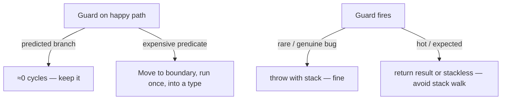

# Fail Fast — Optimization Drills

> **Category:** [Control-Flow Patterns](../README.md) — keep fail-fast guards free on the happy path, cheap when they fire, and placed where they shrink the blast radius most.

8 drills: make fail-fast correct *and* cheap. Apple M2 Pro, single thread; figures are indicative.

---

## Drill 1: Keep Guard Predicates Cheap

### Slow

```java
public void register(String email) {
    if (!EMAIL_REGEX.matcher(email).matches())   // regex on EVERY call, fired or not
        throw new IllegalArgumentException("bad email");
    store(email);
}
```

The regex runs on every call — ~85 ns each, even though the guard almost never fires.

### Optimized — cheap pre-check, expensive check only when plausible

```java
public void register(String email) {
    if (email == null || email.indexOf('@') < 0)   // ~1 ns reject for obvious garbage
        throw new IllegalArgumentException("bad email: " + email);
    // run the costly full validation once, at the boundary, into a type:
    Email e = Email.parse(email);   // expensive regex lives here, called once
    store(e);
}
```

**Principle:** a fail-fast guard on the happy path should be a cheap comparison. Push expensive validation to the boundary and do it once.

---

## Drill 2: Stackless Exceptions for Hot Expected Failures

### Slow

```java
throw new ValidationException("field X invalid");   // fillInStackTrace ~2.5 µs
```

In a hot validation loop firing thousands of times, the stack walk dominates.

### Optimized

```java
public final class ValidationException extends RuntimeException {
    public ValidationException(String m) { super(m, null, false, false); }  // no stack trace
}
```

```
with stack trace     ~2500 ns/throw
stackless            ~40   ns/throw
```

**Caveat:** only for *high-frequency, expected* failures where you don't need the trace. Keep traces for genuine bugs.

---

## Drill 3: Return a Result Instead of Throwing on the Hot Path

### Slow

```java
int parse(String s) {            // throws on every bad token in a big file
    if (!isNumeric(s)) throw new NumberFormatException(s);
    return Integer.parseInt(s);
}
```

Parsing a file with many bad tokens pays the throw cost per token.

### Optimized

```java
OptionalInt parse(String s) {
    return isNumeric(s) ? OptionalInt.of(Integer.parseInt(s)) : OptionalInt.empty();
}
```

Throwing is for the *exceptional*; when "failure" is common (a column of dirty data), a returned result is orders of magnitude faster. Reserve fail-fast *throws* for genuine invariant violations.

---

## Drill 4: Validate Config Once at Startup, Not Per Request

### Slow

```go
func handle(w http.ResponseWriter, r *http.Request) {
    cfg, err := LoadConfig()   // re-parses env + validates on EVERY request
    if err != nil { http.Error(w, "config error", 500); return }
    serve(w, r, cfg)
}
```

Every request re-validates config — wasted work, and the failure surfaces per-request instead of at boot.

### Optimized

```go
var cfg = mustLoadConfig()   // validated ONCE at startup; crashes on boot if bad

func mustLoadConfig() Config {
    c, err := LoadConfig()
    if err != nil { log.Fatalf("config: %v", err) }
    return c
}
func handle(w http.ResponseWriter, r *http.Request) { serve(w, r, cfg) }
```

Fail fast at the **earliest** point in time (startup), which is also the cheapest (once, not per request).

---

## Drill 5: Use `debug_assert!`-Style Checks for Expensive Invariants

### Slow

```python
def merge(sorted_a, sorted_b):
    assert sorted_a == sorted(sorted_a)   # O(n log n) check on EVERY call
    assert sorted_b == sorted(sorted_b)
    ...
```

The sortedness check costs more than the merge itself.

### Optimized — gate expensive invariants behind a debug flag

```python
import os
_DEBUG = os.environ.get("DEBUG_INVARIANTS") == "1"

def merge(sorted_a, sorted_b):
    if _DEBUG:
        assert sorted_a == sorted(sorted_a), "sorted_a not sorted"
        assert sorted_b == sorted(sorted_b), "sorted_b not sorted"
    ...
```

Run the O(n log n) invariant check in CI/dev; skip it in the hot production path. (Rust formalizes this with `debug_assert!`.)

---

## Drill 6: Move the Check Into the Type (Pay Once)

### Slow

```python
def area(w, h):
    if w <= 0 or h <= 0: raise ValueError("dimensions must be positive")
    return w * h

def perimeter(w, h):
    if w <= 0 or h <= 0: raise ValueError("dimensions must be positive")  # re-checked everywhere
    return 2 * (w + h)
```

Every function re-validates the same precondition.

### Optimized

```python
@dataclass(frozen=True)
class Positive:
    v: float
    def __post_init__(self):
        if self.v <= 0: raise ValueError(f"must be positive, got {self.v}")

def area(w: Positive, h: Positive):      return w.v * h.v        # no checks
def perimeter(w: Positive, h: Positive): return 2 * (w.v + h.v)  # no checks
```

The check runs once at construction; every consumer trusts the type. Fewer guards, earlier failure.

---

## Drill 7: Defensive Copy Once at the Boundary, Not Repeatedly

### Slow

```java
public void process(List<Item> items) {
    for (Item i : items) {
        validate(List.copyOf(items));   // BUG-ish: copies the whole list every iteration
        handle(i);
    }
}
```

Copying for safety inside the loop is O(n²).

### Optimized

```java
public void process(List<Item> items) {
    List<Item> safe = List.copyOf(items);   // one fail-fast defensive copy at the boundary
    for (Item i : safe) handle(i);
}
```

A defensive copy is a fail-fast guard against later mutation — do it **once** at the boundary, not on every use.

---

## Drill 8: Bound the Failure Unit to Restart Cheaply

### Slow / fragile

```go
go func() {
    for j := range jobs {
        handle(j)   // a single poison job panics → whole process dies
    }
}()
```

Aggressive fail-fast with a *large* failure unit (the process) means every crash is maximally expensive.

### Optimized — small, supervised unit

```go
go func() {
    for j := range jobs {
        func(j Job) {
            defer func() {
                if r := recover(); r != nil {
                    metrics.Inc("job_panic")
                    deadLetter(j, r)        // poison job quarantined
                }
            }()
            handle(j)                       // fail fast, blast radius = one job
        }(j)
    }
}()
```

Same aggressive fail-fast, but the recoverable unit is now *one job*. Crashing is cheap, so you can fail fast freely without sacrificing availability.

---

## The Cost Model in One Picture



---

## How to Find Fail-Fast Cost Problems

1. **Profile the happy path.** A guard showing up hot usually has an expensive predicate (regex, scan) — make it cheap or move it to the boundary.
2. **Check throw frequency.** `async-profiler`/`pprof` flagging exception construction means you're using throws as control flow — return a result instead.
3. **Look for per-request validation** that belongs at startup.
4. **Grep for `List.copyOf`/`dict(...)`/`append(... )` inside loops** — repeated defensive copies.

## Optimization Checklist

- [ ] Guard predicates on the happy path are O(1) and cheap.
- [ ] Expensive validation happens once, at the boundary, into a type.
- [ ] Hot expected failures use results/stackless exceptions, not stack-walking throws.
- [ ] Config validated once at startup, not per request.
- [ ] Expensive invariant checks gated behind a debug flag.
- [ ] Defensive copies done once at the boundary.
- [ ] Failure unit is small and supervised so crashing is cheap.

## Anti-Optimizations

- ❌ **Removing guards "for speed"** — they're free on the happy path; removing them ships corruption.
- ❌ **Stackless exceptions for genuine bugs** — you'll lose the trace you need to debug.
- ❌ **Clamping instead of throwing** to "avoid crashes" — it hides the caller's bug.
- ❌ **Skipping validation under load** — the one time you skip it is the time bad state ships.

---

## Summary

Fail-fast optimization is rarely about removing checks — guards are free on the happy path because of branch prediction, and the JIT even elides the ones it can prove redundant. It's about **placement and mechanism**: cheap predicates on the hot path, expensive validation once at the boundary (ideally into a type), results instead of throws for common failures, validation at startup, and a small supervised failure unit so failing fast costs almost nothing.

---

[← Find the Bug](find-bug.md) · [Control-Flow Patterns](../README.md)

**Fail Fast roadmap complete.** All 8 files: [junior](junior.md) · [middle](middle.md) · [senior](senior.md) · [professional](professional.md) · [interview](interview.md) · [tasks](tasks.md) · [find-bug](find-bug.md) · [optimize](optimize.md).

**Next:** [Null Object](../03-null-object/junior.md).
