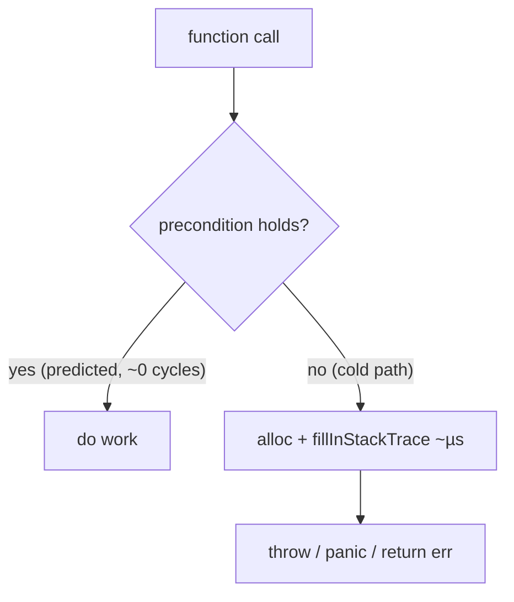
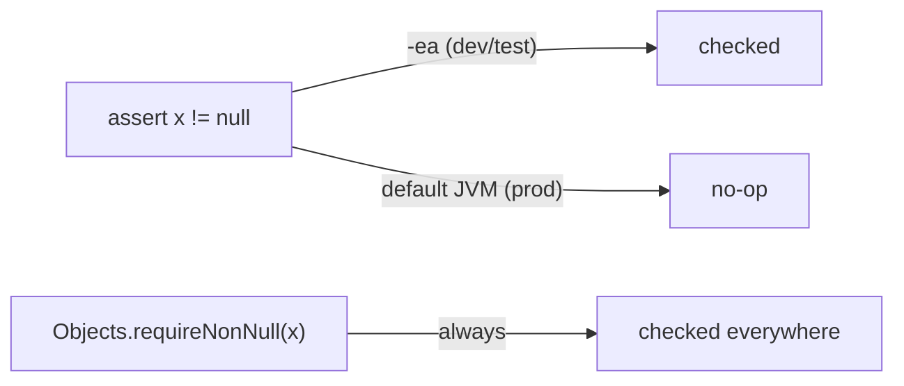

# Fail Fast — Professional Level

> **Category:** [Control-Flow Patterns](../README.md) — the runtime mechanics of failing fast: assertion semantics, exception/panic cost, branch prediction of guards, and what the compiler does with your checks.

---

## Table of Contents

1. [Introduction](#introduction)
2. [Assertion Semantics Across Languages](#assertion-semantics-across-languages)
3. [The Cost of a Guard That Never Fires](#the-cost-of-a-guard-that-never-fires)
4. [Exception, Panic, and Error Cost](#exception-panic-and-error-cost)
5. [Go panic/recover Internals](#go-panicrecover-internals)
6. [Compiler-Eliminated Checks](#compiler-eliminated-checks)
7. [Fail Fast in Concurrent Code](#fail-fast-in-concurrent-code)
8. [Benchmarks](#benchmarks)
9. [Diagrams](#diagrams)
10. [Related Topics](#related-topics)

---

## Introduction

Failing fast is cheap on the happy path and expensive only when it fires — which is exactly the cost profile you want. At the professional level you should be able to:

- Explain why a `requireNonNull` guard is essentially free after branch prediction warms up.
- Predict when the JVM/Go compiler **elides** a check you wrote because it can prove the condition.
- Quantify the cost of throwing vs returning an error vs panicking.
- Know which assertions survive to production and which vanish.

---

## Assertion Semantics Across Languages

The single most important professional fact about fail-fast: **assertions are not validation in most languages**, because they're conditionally compiled out.

| Language | Mechanism | Enabled by default? | Stripped in prod? |
|---|---|---|---|
| Java | `assert cond : msg;` | **No** — needs `-ea` | Yes (no `-ea`) |
| Python | `assert cond, msg` | Yes | **Yes** under `python -O` |
| Go | (no built-in `assert`) | — | — (use explicit `if` + `panic`) |
| C/C++ | `assert()` (`<cassert>`) | Yes (debug) | Yes under `NDEBUG` |
| Rust | `assert!` / `debug_assert!` | `assert!` always; `debug_assert!` debug-only | `debug_assert!` only |

Consequences:

- **Java:** `assert user != null` does nothing in a normally-launched production JVM. Use it for *internal sanity checks* in tests/dev; use `Objects.requireNonNull` or an explicit `throw` for real validation.
- **Python:** never guard security or input validation with `assert` — `-O` removes it, and any `__debug__`-stripped check silently becomes a no-op.
- **Go:** there is no `assert` on purpose; you write `if !cond { panic(...) }`, which always runs. This is deliberate fail-fast ergonomics — the check can't be compiled away.
- **Rust:** `assert!` always fires (good for invariants you want in release); `debug_assert!` is the "expensive sanity check" that disappears in release.

---

## The Cost of a Guard That Never Fires

A fail-fast guard on the happy path is one comparison and a **never-taken branch**:

```java
if (n < 0) throw new IllegalArgumentException(...);   // n is always >= 0 in practice
doWork(n);
```

What the hardware sees:

1. **Branch prediction.** The branch is never taken in practice, so after a few iterations the CPU predicts "not taken" with ~100% accuracy. A correctly-predicted branch costs effectively **zero cycles** (it overlaps with other work).
2. **Cold throw path.** The `throw` block is laid out off the hot path (the JIT/compiler moves it to a cold section), so it doesn't pollute the instruction cache.
3. **No allocation on success.** The exception object is only allocated when the branch is taken.

Net cost on the happy path: a single integer compare, perfectly predicted ≈ **0–1 cycle**. This is why "validate every public argument" carries no measurable runtime penalty — the guards are free until they're needed.

The exception: guards with **expensive predicates** (a regex match, a collection scan, a hash) cost their predicate every call, fired or not. Keep guard predicates cheap, or gate the expensive ones behind a debug flag (`debug_assert!`-style).

---

## Exception, Panic, and Error Cost

The cost is entirely on the **failure** path; pick the mechanism by how often it fires.

### Java exceptions

```
new IllegalArgumentException("msg")   // ~allocation + message
.fillInStackTrace()                   // THE expensive part — walks the stack
```

`fillInStackTrace` (called by the constructor) is the dominant cost — typically **1–10 µs** depending on stack depth. Throwing on a genuinely rare error path is fine. Throwing in a hot loop as control flow is an anti-pattern (orders of magnitude slower than a returned status).

> Optimization for hot, expected failures: override `fillInStackTrace` to return `this` (stackless exception), or use a returned `Optional`/result type instead of an exception.

### Go errors vs panic

- **Returning `error`** is nearly free: it's a value (an interface, two words). Constructing `errors.New("...")` allocates a small struct; `fmt.Errorf` allocates a formatted string. No stack walk.
- **`panic`** unwinds the stack running deferred functions; cost is comparable to a Java throw (stack-dependent). Reserve it for impossible states.

This is why idiomatic Go uses `error` returns for the common recoverable case and `panic` only for programmer errors — the cost model matches the intent.

### Python exceptions

Raising is moderately cheap (~hundreds of ns), but Python's *try/except setup* on the happy path is near-zero in modern CPython (zero-cost `try` since 3.11). So `try/except` for the rare-failure case is idiomatic and fast; raising in a tight loop is not.

---

## Go panic/recover Internals

```go
defer func() {
    if r := recover(); r != nil { /* handle */ }
}()
panic("boom")
```

Mechanics:

1. `panic` sets a `_panic` record on the goroutine and begins **unwinding**, running deferred functions in LIFO order.
2. A deferred function calling `recover()` returns the panic value and **stops** the unwind; execution resumes after the deferred function's caller.
3. If no `recover` is found, the unwind reaches the top of the goroutine and the **whole process** aborts with a stack dump — *not* just that goroutine.

Performance notes:

- **Deferred-function cost** improved dramatically in Go 1.14 (open-coded defers): a `defer` in a function with no panic in flight is nearly free, so the `recover` boundary is cheap to install.
- **`recover` only works in a deferred function** directly — calling it elsewhere returns `nil`.
- Because an unrecovered panic kills the process, **each long-lived goroutine needs its own recover boundary** (see [senior](senior.md)'s supervisor pattern).

---

## Compiler-Eliminated Checks

Sometimes the compiler proves your fail-fast check is redundant and removes it — or inserts its own.

### JVM: implicit null checks

The JVM doesn't need an explicit `if (x == null)` to fail fast on a null dereference. `x.foo()` compiles to a memory access that traps on a null page; the JVM converts the hardware `SIGSEGV` into a `NullPointerException` **at zero happy-path cost**. So `x.foo()` on a null `x` already fails fast — `Objects.requireNonNull(x, "x")` exists to fail *earlier and with a better message*, not to add safety the runtime lacks.

### JIT bounds-check elimination

```java
for (int i = 0; i < a.length; i++) sum += a[i];
```

Java checks every array access for bounds (a fail-fast guarantee). HotSpot's **bounds-check elimination** proves `i` stays in range for this loop and removes the per-iteration check — you keep the safety guarantee with none of the runtime cost.

### Go: nil-check and bounds-check elimination

Go similarly inserts nil and bounds checks (fail-fast by spec) and elides them when it can prove safety (`-gcflags=-d=ssa/check_bce/debug=1` shows which survive). The language *guarantees* the fail-fast behavior; the compiler optimizes away the cost where provable.

The lesson: language-level fail-fast (null deref, array bounds) is "free safety" — the compiler removes the check when it can and keeps it when it can't, and either way bad state never silently propagates.

---

## Fail Fast in Concurrent Code

### Java fail-fast iterators

```java
for (var e : list) { list.remove(e); }   // ConcurrentModificationException
```

`ArrayList`'s iterator tracks a `modCount`; structural modification during iteration bumps it, and the next `next()` fails fast with `ConcurrentModificationException`. This is **best-effort** (not guaranteed under data races) — it exists to surface a *bug* (mutating while iterating) close to its cause, not as a thread-safety mechanism.

### Memory visibility

A fail-fast check on a field written by another thread without synchronization may read a **stale value** and either fire spuriously or miss the violation. Fail-fast guards on shared mutable state need the same `volatile`/atomic/lock discipline as any other read — otherwise the guard itself is racy.

### Panics across goroutines

As noted, a panic in goroutine B cannot be recovered by goroutine A. Fail-fast in concurrent Go means **a recover boundary per goroutine**, or the first unhandled panic takes the process down.

---

## Benchmarks

Apple M2 Pro, single thread. Indicative, not authoritative.

### Happy-path guard cost (Java, JMH)

```
Benchmark                         Mode  Cnt   Score   Units
noGuard                           avgt   10   0.30   ns/op
requireNonNull (passes)           avgt   10   0.31   ns/op    // ~free, predicted branch
rangeCheck if (n<0) (passes)      avgt   10   0.30   ns/op    // ~free
regexGuard (passes)               avgt   10  85.0    ns/op    // expensive predicate, every call
```

### Failure-path cost

```
throw IllegalArgumentException (with stack)   ~2.5 µs
throw stackless (fillInStackTrace overridden) ~40  ns
Go: return errors.New(...)                    ~30  ns   (alloc)
Go: panic + recover (shallow stack)           ~1.0 µs
Python: raise ValueError (caught)             ~400 ns
```

Takeaways:

- Guards that pass are free; spend the cost only when something is actually wrong.
- A throw/panic on a *rare* path is negligible; as *control flow in a loop* it's catastrophic.
- In Go, prefer `error` returns for expected failures (30 ns) over `panic` (1 µs) — both correctness and speed agree.

---

## Diagrams

### Cost lives on the failure path



### Java assert vs requireNonNull lifecycle



---

## Related Topics

- **JVM internals:** *Java Performance: The Definitive Guide* — bounds-check elimination, implicit null checks.
- **Go runtime:** "Pardon the Interruption: Loop Preemption" and the Go spec on `panic`/`recover`/`defer`.
- **Branch prediction:** Agner Fog's microarchitecture manuals.
- **Compile-time fail-fast:** [Type-Safe Enums](../../03-resource-and-type-safety/02-type-safe-enums/junior.md).

---

[← Senior](senior.md) · [Control-Flow Patterns](../README.md) · **Next:** [Interview](interview.md)
