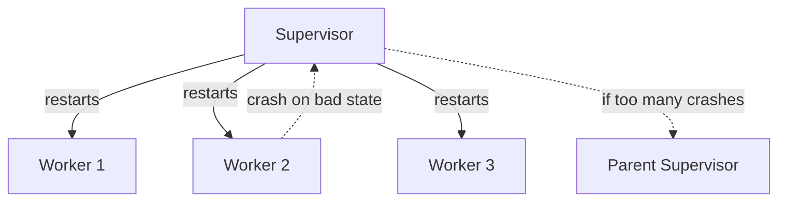
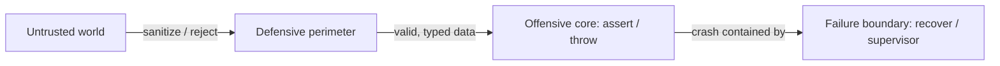
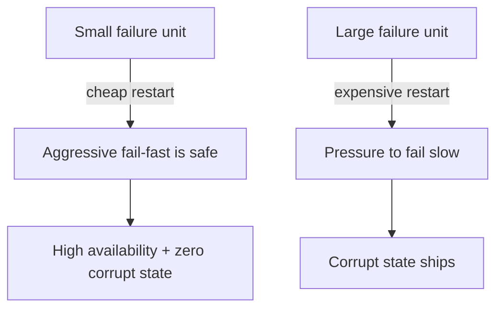

# Fail Fast — Senior Level

> **Category:** [Control-Flow Patterns](../README.md) — architect failure: where invariants are enforced, how blast radius is bounded, and how "let it crash" turns fail-fast into a system-level reliability strategy.

---

## Table of Contents

1. [Introduction](#introduction)
2. [Offensive vs Defensive Programming](#offensive-vs-defensive-programming)
3. [Blast Radius and Failure Boundaries](#blast-radius-and-failure-boundaries)
4. [Crash-Only Software](#crash-only-software)
5. [Let It Crash — Erlang/OTP Supervision](#let-it-crash--erlangotp-supervision)
6. [Pushing Failures Into the Type System](#pushing-failures-into-the-type-system)
7. [Code Examples — Advanced](#code-examples--advanced)
8. [Liabilities](#liabilities)
9. [Migration Patterns](#migration-patterns)
10. [Diagrams](#diagrams)
11. [Related Topics](#related-topics)

---

## Introduction

> Focus: **Architecture** and **optimization**

At the senior level, fail-fast stops being a per-function habit and becomes an **architectural property**: *bad state cannot survive long enough to corrupt anything important.* You decide:

- **Where the failure boundaries are** — which units (function, object, request, process, node) are allowed to die, and what restarts them.
- **Offensive vs defensive** — does this module *trust* its callers (fail fast on violation) or *tolerate* them (defend against any input)?
- **How small the recoverable unit is** — the smaller the thing you can safely kill and restart, the more aggressively you can fail fast.

The deep insight: **fail-fast and high availability are not in tension when the failure unit is small.** Erlang processes, Kubernetes pods, and crash-only services all fail fast *and* stay available, because killing one tiny unit is cheap and a supervisor immediately replaces it.

---

## Offensive vs Defensive Programming

Two philosophies, applied at different boundaries:

| | Offensive (fail fast) | Defensive (fail safe) |
|---|---|---|
| Stance | "If you violate my contract, I crash." | "I'll cope with whatever you give me." |
| Trust | Trusts callers; assumes correct usage | Trusts no one |
| Where | **Internal modules** you control | **External boundaries** (public API, parsing user input) |
| On bad input | Throw / panic / assert | Sanitize, clamp, default, reject politely |
| Failure mode | Surfaces bugs loudly | Hides bugs, prevents crashes |

The senior move is to apply **defensive at the perimeter, offensive in the core**. The perimeter (HTTP handlers, deserializers, public SDK methods) defends against a hostile world. Past the perimeter, everything is *your* code calling *your* code — so it programs offensively, failing fast on any contract violation, because such a violation is a bug you want screaming in CI.

```
                  ┌────────────────────────────────┐
   hostile world  │  DEFENSIVE PERIMETER           │
   ───────────────▶  validate, sanitize, reject    │
                  │  ┌──────────────────────────┐  │
                  │  │  OFFENSIVE CORE          │  │
                  │  │  assert, throw, panic    │  │
                  │  │  trust the contract      │  │
                  │  └──────────────────────────┘  │
                  └────────────────────────────────┘
```

A classic mistake is being *defensive everywhere* — every internal function re-checking `null`, clamping ranges, swallowing errors — which buries bugs under layers of "tolerant" code and makes the system impossible to reason about.

---

## Blast Radius and Failure Boundaries

**Blast radius** = how much state is corrupted (or how much work is lost) before a failure is caught. Fail-fast minimizes corruption; *boundaries* minimize lost work.

The unit you choose to fail-and-restart determines both:

| Failure unit | Restart cost | Blast radius of a bug |
|---|---|---|
| Function (throw, caught nearby) | Trivial | One operation |
| Request (panic → 500 for that request) | Cheap | One user's request |
| Process (crash-only, container restart) | Seconds | In-flight requests on that process |
| Node | Tens of seconds | A shard of traffic |

The architectural lever: **make the recoverable unit as small as possible**, then fail fast within it without fear. If killing-and-restarting a unit is cheap and safe, aggressive fail-fast is *free* availability-wise — a supervisor restores capacity immediately. If the unit is huge (a stateful monolith holding hours of in-memory work), fail-fast is expensive, which pressures teams toward fail-slow — and that's how corrupt state ships.

---

## Crash-Only Software

**Crash-only software** (Candea & Fox, 2003) takes fail-fast to its logical end: *the only way to stop is to crash, and the only way to start is to recover.* There is no separate "graceful shutdown" path — because a code path that's only exercised during clean shutdown is a code path that's never tested and will fail when you need it.

Principles:

1. **Stopping = crashing.** Kill the process; don't run special teardown logic.
2. **Starting = recovering.** Every start assumes the previous stop was a crash and recovers state from durable storage.
3. **State lives in crash-safe stores** (databases, WALs, queues) — never only in process memory.
4. **Idempotent, restartable operations** so a mid-flight crash + replay produces the right result.

The payoff: **the recovery path is the *normal* path**, so it's exercised constantly and actually works. Kubernetes embodies this — pods are cattle, `SIGKILL` is routine, and a `Deployment` controller restarts them. Designing for crash-only means you can fail fast anywhere, because the system is built to absorb crashes as a normal event.

---

## Let It Crash — Erlang/OTP Supervision

Erlang/OTP's **"let it crash"** is the most mature fail-fast architecture in production. The philosophy: **don't write defensive code for impossible states inside a process — let the process crash, and let a supervisor restart it into a known-good state.**

```erlang
%% No defensive code. If the message is malformed, the process crashes —
%% and the supervisor restarts it clean.
handle_call({withdraw, Amount}, _From, Balance) when Amount =< Balance ->
    {reply, ok, Balance - Amount};
%% No matching clause for Amount > Balance → process crashes → supervisor restarts.
```

The architecture that makes this safe:

- **Processes are isolated** — one crash doesn't corrupt another's memory (share-nothing).
- **Supervisors** form a tree; each watches children and applies a **restart strategy** (`one_for_one`, `one_for_all`, `rest_for_one`).
- **Restart intensity limits** — if a child crashes too often in a window, the supervisor escalates the crash upward rather than restart-looping forever.

This is fail-fast *as a reliability strategy*: each process fails instantly on any anomaly, and the supervision tree converts those local failures into global stability. The lesson generalizes beyond Erlang — it's the same shape as Kubernetes pod restarts, systemd `Restart=on-failure`, and circuit breakers wrapping a failing dependency.



---

## Pushing Failures Into the Type System

The earliest possible failure point isn't runtime — it's **compile time**. The most aggressive fail-fast moves an invalid state from "throws at runtime" to "won't compile."

- **Make illegal states unrepresentable.** If an `Order` can't exist without items, don't model `items` as a nullable list — model it as `NonEmptyList<Item>`.
- **Type-safe enums** instead of `int`/`String` constants — the compiler rejects an unknown variant. See [Type-Safe Enums](../../03-resource-and-type-safety/02-type-safe-enums/junior.md).
- **Parse, don't validate** — convert unstructured input into a type that *can only hold valid data* at the boundary, so the core never re-checks.
- **Non-null types** (Kotlin `String` vs `String?`, Rust `Option<T>`) — `null` becomes a type error, not a runtime `NullPointerException`.

```kotlin
// Runtime fail-fast
fun process(email: String) { require(email.contains("@")) }

// Compile-time fail-fast: an Email that doesn't parse simply can't be constructed.
@JvmInline value class Email private constructor(val raw: String) {
    companion object {
        fun parse(s: String): Email? = if (s.contains("@")) Email(s) else null
    }
}
fun process(email: Email) { /* email is provably valid — no check needed */ }
```

This is fail-fast pushed to its limit: the failure happens in the IDE, before the code ever runs.

---

## Code Examples — Advanced

### Java — assertion of postconditions + invariant guard in a service

```java
public final class LedgerService {
    public Account transfer(Account from, Account to, Money amount) {
        // Offensive: these are invariants. A violation is a bug, fail fast.
        assert from != null && to != null : "accounts must be validated by caller";
        if (amount.isNegative()) throw new IllegalArgumentException("amount must be >= 0");

        Money fromBefore = from.balance(), toBefore = to.balance();
        Account newFrom = from.debit(amount);
        Account newTo   = to.credit(amount);

        // Postcondition: conservation of money. Catches arithmetic bugs immediately.
        Money before = fromBefore.plus(toBefore);
        Money after  = newFrom.balance().plus(newTo.balance());
        if (!before.equals(after))
            throw new IllegalStateException("money not conserved: " + before + " -> " + after);
        return newTo;
    }
}
```

The postcondition is the fail-fast net: any future refactor that breaks the conservation invariant crashes a test instead of silently leaking money.

### Go — supervised worker with restart (let-it-crash, Go style)

```go
// supervise restarts the worker on panic, with a crash-rate limit (OTP-style intensity).
func supervise(ctx context.Context, name string, work func(context.Context) error) {
    const maxRestarts, window = 5, time.Minute
    var crashes []time.Time
    for {
        if ctx.Err() != nil {
            return
        }
        func() {
            defer func() {
                if r := recover(); r != nil {
                    log.Printf("worker %s panicked: %v\n%s", name, r, debug.Stack())
                }
            }()
            if err := work(ctx); err != nil {
                log.Printf("worker %s returned error: %v", name, err)
            }
        }()
        // Restart-intensity check: escalate instead of crash-looping.
        now := time.Now()
        crashes = append(crashes, now)
        for len(crashes) > 0 && now.Sub(crashes[0]) > window {
            crashes = crashes[1:]
        }
        if len(crashes) > maxRestarts {
            log.Fatalf("worker %s crashed %d times in %v; escalating", name, len(crashes), window)
        }
    }
}
```

Each worker fails fast (panics on bad state); the supervisor restarts it; the intensity limit prevents an infinite restart loop from masking a permanent bug.

### Python — boundary that parses into a valid type, core that trusts it

```python
from dataclasses import dataclass

@dataclass(frozen=True)
class PositiveInt:
    value: int
    def __post_init__(self):
        if self.value <= 0:
            raise ValueError(f"must be positive, got {self.value}")

# Boundary: the ONLY place a PositiveInt can fail to construct.
def parse_quantity(raw: str) -> PositiveInt:
    return PositiveInt(int(raw))   # raises on bad input → mapped to 4xx upstream

# Core: receives PositiveInt, so it can never be passed a non-positive quantity.
def reserve_stock(sku: str, qty: PositiveInt) -> None:
    # No `if qty <= 0` check needed — the type guarantees it.
    _inventory[sku] -= qty.value
```

The check happens once, at the type boundary; the core is offensive and check-free because the type *is* the proof.

---

## Liabilities

### Symptom 1: Defensive code everywhere

Every internal function re-checks `null`, clamps ranges, and swallows errors. Bugs are buried under tolerance. **Fix:** defend at the perimeter only; fail fast in the core.

### Symptom 2: Fail-fast in a process with no supervisor

Aggressive `panic`/`System.exit` in a service with no restart strategy means one bad message kills the whole node. **Fix:** add a supervision/restart layer (process manager, request-level recover) so the failure unit is small.

### Symptom 3: Big recoverable unit

A stateful monolith holds hours of in-memory work, so nobody dares fail fast. **Fix:** persist state to crash-safe stores; shrink the unit so crashing is cheap (crash-only design).

### Symptom 4: Assertions doing real validation

`assert` enforcing a user-facing rule disappears in production builds. **Fix:** `assert` for internal invariants only; `throw`/`return error` for anything that must hold in production.

### Symptom 5: Restart loops masking permanent failures

A supervisor restarts a worker that crashes on a poison message forever. **Fix:** restart-intensity limits + dead-letter queues so a permanent fault escalates instead of looping.

---

## Migration Patterns

### Fail-slow → fail-fast core, resilient boundary

1. Identify the **perimeter** (controllers, deserializers, SDK entry points). Keep/strengthen defensive validation there.
2. Strip defensive checks from **internal** code; replace with offensive `requireNonNull`/`panic`/invariant asserts.
3. Add a **failure boundary** (request-level `recover`, supervised worker) so a core crash is contained.
4. Add **postcondition checks** to high-value invariants (money, counts, idempotency keys).

### Runtime checks → compile-time guarantees

1. Find repeated runtime validations (`if x <= 0`, `if email lacks @`).
2. Introduce a **type** that can only hold valid data (`PositiveInt`, `Email`, `NonEmptyList`).
3. Move the check into the type's constructor; delete the scattered runtime checks.

### Monolith → crash-only units

1. Move in-memory state to durable, crash-safe storage.
2. Make operations idempotent so replay-after-crash is correct.
3. Remove special graceful-shutdown logic; make recovery the normal start path.

---

## Diagrams

### Offensive core, defensive perimeter



### Failure unit vs availability



---

## Related Topics

- **Next:** [Fail Fast — Professional](professional.md)
- **Practice:** [Tasks](tasks.md) · [Find-Bug](find-bug.md) · [Optimize](optimize.md) · [Interview](interview.md)
- **Sibling:** [Guard Clauses & Early Return](../01-guard-clauses-and-early-return/junior.md)
- **Resource fail-fast:** [RAII & Dispose](../../03-resource-and-type-safety/01-raii-and-dispose/junior.md)
- **Compile-time fail-fast:** [Type-Safe Enums](../../03-resource-and-type-safety/02-type-safe-enums/junior.md)
- **Resilience counterpart:** [Circuit Breaker](../../../../) · [Retry](../../../../)

---

[← Middle](middle.md) · [Control-Flow Patterns](../README.md) · **Next:** [Professional](professional.md)
