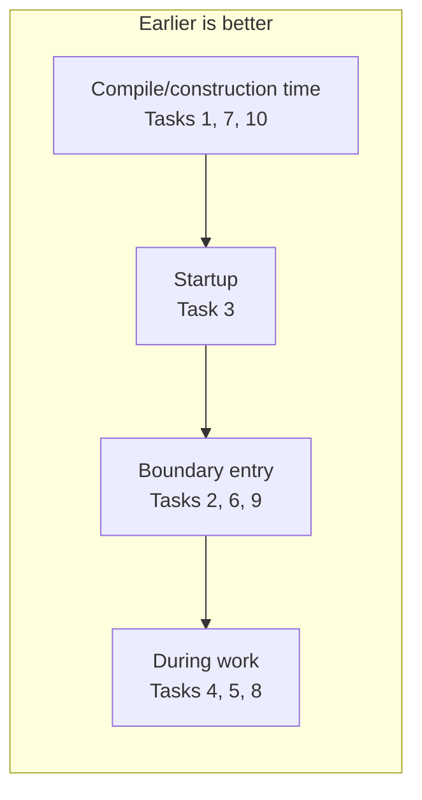

# Fail Fast — Practice Tasks

> **Category:** [Control-Flow Patterns](../README.md) — detect broken preconditions and invariants at the earliest point and stop loudly.

10 practice tasks with full Go, Java, and Python solutions.

---

## Table of Contents

1. [Task 1: Validating Constructor](#task-1-validating-constructor)
2. [Task 2: Argument Guards at a Public Boundary](#task-2-argument-guards-at-a-public-boundary)
3. [Task 3: Fail Fast at Startup (Config)](#task-3-fail-fast-at-startup-config)
4. [Task 4: Cross-Field Invariant Check](#task-4-cross-field-invariant-check)
5. [Task 5: Error vs Panic in Go](#task-5-error-vs-panic-in-go)
6. [Task 6: Boundary Recover, Fail-Fast Core](#task-6-boundary-recover-fail-fast-core)
7. [Task 7: Parse, Don't Validate (Typed Wrapper)](#task-7-parse-dont-validate-typed-wrapper)
8. [Task 8: Postcondition Assertion](#task-8-postcondition-assertion)
9. [Task 9: Fail the Batch vs Collect Errors](#task-9-fail-the-batch-vs-collect-errors)
10. [Task 10: Refactor Fail-Slow to Fail-Fast](#task-10-refactor-fail-slow-to-fail-fast)

---

## Task 1: Validating Constructor

**Goal:** make it impossible to construct an invalid `Percentage` (0–100).

### Java

```java
public final class Percentage {
    private final int value;
    public Percentage(int value) {
        if (value < 0 || value > 100)
            throw new IllegalArgumentException("percentage must be in [0,100], got " + value);
        this.value = value;
    }
    public int value() { return value; }
}
```

### Python

```python
class Percentage:
    def __init__(self, value: int):
        if not 0 <= value <= 100:
            raise ValueError(f"percentage must be in [0,100], got {value}")
        self.value = value
```

### Go

```go
type Percentage struct{ value int }

func NewPercentage(value int) (Percentage, error) {
    if value < 0 || value > 100 {
        return Percentage{}, fmt.Errorf("percentage must be in [0,100], got %d", value)
    }
    return Percentage{value: value}, nil
}
```

---

## Task 2: Argument Guards at a Public Boundary

**Goal:** reject bad arguments before doing any work.

### Java

```java
public Transfer transfer(Account from, Account to, long cents) {
    Objects.requireNonNull(from, "from");
    Objects.requireNonNull(to, "to");
    if (from == to) throw new IllegalArgumentException("from and to must differ");
    if (cents <= 0) throw new IllegalArgumentException("cents must be > 0, got " + cents);
    return doTransfer(from, to, cents);
}
```

### Python

```python
def transfer(frm, to, cents: int):
    if frm is None or to is None:
        raise ValueError("from and to are required")
    if frm is to:
        raise ValueError("from and to must differ")
    if cents <= 0:
        raise ValueError(f"cents must be > 0, got {cents}")
    return _do_transfer(frm, to, cents)
```

### Go

```go
func Transfer(from, to *Account, cents int64) error {
    if from == nil || to == nil {
        return errors.New("from and to are required")
    }
    if from == to {
        return errors.New("from and to must differ")
    }
    if cents <= 0 {
        return fmt.Errorf("cents must be > 0, got %d", cents)
    }
    return doTransfer(from, to, cents)
}
```

---

## Task 3: Fail Fast at Startup (Config)

**Goal:** crash on boot if a required env var is missing — not on first use.

### Go

```go
type Config struct {
    DBURL    string
    Port     int
    APIToken string
}

func LoadConfig() (Config, error) {
    var missing []string
    get := func(k string) string {
        v := os.Getenv(k)
        if v == "" {
            missing = append(missing, k)
        }
        return v
    }
    c := Config{DBURL: get("DB_URL"), APIToken: get("API_TOKEN")}
    port, err := strconv.Atoi(get("PORT"))
    if err != nil {
        missing = append(missing, "PORT (must be an integer)")
    }
    c.Port = port
    if len(missing) > 0 {
        return Config{}, fmt.Errorf("missing/invalid config: %s", strings.Join(missing, ", "))
    }
    return c, nil
}

// main: log.Fatal(err) on failure — crash before serving.
```

### Python

```python
import os

def load_config() -> dict:
    missing = []
    def req(key):
        v = os.environ.get(key)
        if not v:
            missing.append(key)
        return v
    cfg = {"db_url": req("DB_URL"), "api_token": req("API_TOKEN")}
    if missing:
        raise SystemExit(f"missing config: {', '.join(missing)}")  # exit at startup
    return cfg
```

---

## Task 4: Cross-Field Invariant Check

**Goal:** an `Order` total must equal the sum of its line items.

### Java

```java
public final class Order {
    private final List<Long> itemCents;
    private final long total;
    public Order(List<Long> itemCents, long total) {
        this.itemCents = List.copyOf(Objects.requireNonNull(itemCents, "itemCents"));
        if (this.itemCents.isEmpty()) throw new IllegalArgumentException("order needs items");
        long sum = this.itemCents.stream().mapToLong(Long::longValue).sum();
        if (sum != total)
            throw new IllegalStateException("total " + total + " != sum " + sum);
        this.total = total;
    }
}
```

### Python

```python
from dataclasses import dataclass

@dataclass(frozen=True)
class Order:
    item_cents: tuple
    total: int
    def __post_init__(self):
        if not self.item_cents:
            raise ValueError("order needs items")
        s = sum(self.item_cents)
        if s != self.total:
            raise ValueError(f"total {self.total} != sum {s}")
```

---

## Task 5: Error vs Panic in Go

**Goal:** classify each failure as recoverable (`error`) or impossible (`panic`).

### Go

```go
// Recoverable: bad user input → error.
func ParseAge(s string) (int, error) {
    n, err := strconv.Atoi(s)
    if err != nil {
        return 0, fmt.Errorf("age must be a number, got %q", s)
    }
    if n < 0 || n > 150 {
        return 0, fmt.Errorf("age out of range [0,150], got %d", n)
    }
    return n, nil
}

// Impossible: this map is built by us and must contain the key → panic on a bug.
func mustLookup(table map[string]int, key string) int {
    v, ok := table[key]
    if !ok {
        panic(fmt.Sprintf("internal: key %q missing from table built at init", key))
    }
    return v
}
```

---

## Task 6: Boundary Recover, Fail-Fast Core

**Goal:** the core panics on impossible state; the HTTP boundary contains it.

### Go

```go
func recoverMiddleware(next http.Handler) http.Handler {
    return http.HandlerFunc(func(w http.ResponseWriter, r *http.Request) {
        defer func() {
            if rec := recover(); rec != nil {
                log.Printf("panic in %s: %v\n%s", r.URL.Path, rec, debug.Stack())
                http.Error(w, "internal error", http.StatusInternalServerError)
            }
        }()
        next.ServeHTTP(w, r)
    })
}
```

### Java (servlet-style)

```java
try {
    coreHandler.handle(request);   // may throw on a broken invariant
} catch (RuntimeException e) {
    log.error("unhandled error for {}", request.path(), e);
    response.status(500).body("internal error");   // contain to this request
}
```

---

## Task 7: Parse, Don't Validate (Typed Wrapper)

**Goal:** a type that can only hold a valid email; the core never re-checks.

### Python

```python
from dataclasses import dataclass

@dataclass(frozen=True)
class Email:
    raw: str
    def __post_init__(self):
        if "@" not in self.raw or self.raw.startswith("@") or self.raw.endswith("@"):
            raise ValueError(f"invalid email: {self.raw!r}")

# Boundary: only place construction can fail.
def parse_email(s: str) -> Email:
    return Email(s)

# Core: receives Email, never str — no re-validation needed.
def send_welcome(to: Email) -> None:
    _mailer.send(to.raw, "Welcome!")
```

### Java

```java
public final class Email {
    private final String raw;
    private Email(String raw) { this.raw = raw; }
    public static Email parse(String s) {
        if (s == null || !s.contains("@") || s.startsWith("@") || s.endsWith("@"))
            throw new IllegalArgumentException("invalid email: " + s);
        return new Email(s);
    }
    public String raw() { return raw; }
}
```

---

## Task 8: Postcondition Assertion

**Goal:** verify a function's promise; catch arithmetic bugs at the source.

### Python

```python
def split_evenly(total: int, parts: int) -> list[int]:
    if parts <= 0:
        raise ValueError("parts must be > 0")
    base, rem = divmod(total, parts)
    result = [base + (1 if i < rem else 0) for i in range(parts)]
    # Postcondition: the split must sum back to total. A bug here is OURS.
    assert sum(result) == total, f"postcondition: {sum(result)} != {total}"
    return result
```

### Go

```go
func splitEvenly(total, parts int) []int {
    if parts <= 0 {
        panic("parts must be > 0")
    }
    base, rem := total/parts, total%parts
    out := make([]int, parts)
    sum := 0
    for i := range out {
        out[i] = base
        if i < rem {
            out[i]++
        }
        sum += out[i]
    }
    if sum != total {
        panic(fmt.Sprintf("postcondition: %d != %d", sum, total))
    }
    return out
}
```

---

## Task 9: Fail the Batch vs Collect Errors

**Goal:** import rows; deliberately choose per-row tolerance with a quarantine.

### Python

```python
def import_rows(rows: list[dict]) -> tuple[list, list]:
    imported, quarantine = [], []
    for i, row in enumerate(rows):
        try:
            imported.append(_to_record(row))   # fail fast per row
        except ValueError as e:
            quarantine.append((i, str(e)))      # contained to this row
    return imported, quarantine

# Fail-safe at the batch boundary; fail-fast per row into quarantine.
```

### Go

```go
type RowError struct {
    Line int
    Err  error
}

func ImportRows(rows []map[string]string) (recs []Record, bad []RowError) {
    for i, row := range rows {
        rec, err := toRecord(row)   // fail fast per row
        if err != nil {
            bad = append(bad, RowError{Line: i, Err: err})
            continue
        }
        recs = append(recs, rec)
    }
    return recs, bad
}
```

---

## Task 10: Refactor Fail-Slow to Fail-Fast

### Before (fail slow)

```java
double lineTotal(Item item, int qty) {
    return item.price() * qty;   // item null → late NPE; qty negative → silent wrong total
}
```

### After (fail fast)

```java
double lineTotal(Item item, int qty) {
    Objects.requireNonNull(item, "item");
    if (qty < 0) throw new IllegalArgumentException("qty must be >= 0, got " + qty);
    return item.price() * qty;
}
```

### Better still — push into the type

```java
public record Quantity(int value) {
    public Quantity {                 // compact constructor
        if (value < 0) throw new IllegalArgumentException("qty must be >= 0, got " + value);
    }
}
double lineTotal(Item item, Quantity qty) {
    return item.price() * qty.value();   // qty is provably non-negative
}
```

Each step moves the failure earlier: from "late NPE" → "guard at the top" → "can't even construct a negative quantity."

---

## Where Each Task Puts the Failure



The drills move the failure point progressively earlier — the leftmost (a value that *cannot be constructed* invalid) is the strongest form of fail fast.

---

## Practice Tips

1. **Validate all arguments before any side effect** in constructors.
2. **Name the offending value** in every failure message.
3. **Classify each failure:** recoverable → error/4xx; impossible → throw/panic.
4. **Validate config at startup**, not at first use.
5. **Add postcondition checks** to high-value invariants (money, counts).
6. **Prefer typed wrappers** to repeated runtime checks — fail fast at compile/construction time.

---

[← Interview](interview.md) · [Control-Flow Patterns](../README.md) · **Next:** [Find the Bug](find-bug.md)
