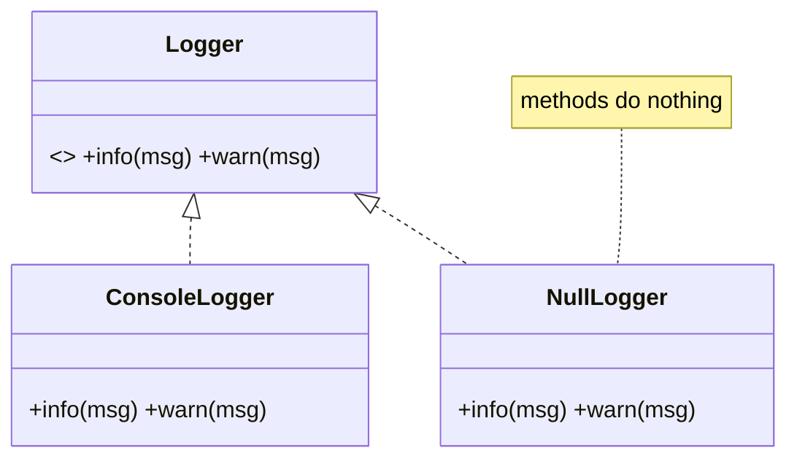
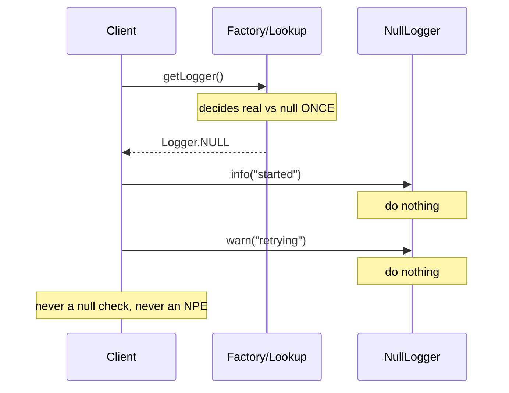

# Null Object — Junior Level

> **Category:** [Control-Flow Patterns](../README.md) — return a do-nothing object that satisfies the expected interface instead of `null`.

---

## Table of Contents

1. [Introduction](#introduction)
2. [Prerequisites](#prerequisites)
3. [Glossary](#glossary)
4. [Core Concepts](#core-concepts)
5. [Real-World Analogies](#real-world-analogies)
6. [Mental Models](#mental-models)
7. [Pros & Cons](#pros-cons)
8. [Use Cases](#use-cases)
9. [Code Examples](#code-examples)
10. [Coding Patterns](#coding-patterns)
11. [Clean Code](#clean-code)
12. [Best Practices](#best-practices)
13. [Edge Cases & Pitfalls](#edge-cases-pitfalls)
14. [Common Mistakes](#common-mistakes)
15. [Tricky Points](#tricky-points)
16. [Test Yourself](#test-yourself)
17. [Cheat Sheet](#cheat-sheet)
18. [Summary](#summary)
19. [Further Reading](#further-reading)
20. [Related Topics](#related-topics)
21. [Diagrams](#diagrams)

---

## Introduction

> Focus: **What is it?** and **How to use it?**

**Null Object** is a control-flow coding pattern: instead of returning `null` to mean "there is nothing here," you return a real object that **implements the expected interface** but does **nothing useful** — its methods are no-ops, its queries return neutral values (empty string, zero, `false`, an empty collection).

The point: callers stop checking for `null`. They just call the method. Whether the object is real or the Null Object, the call is safe.

### Why this matters

Look at this code. Every call site repeats the same defensive check:

```java
if (logger != null) {
    logger.info("started");
}
// ... later ...
if (logger != null) {
    logger.warn("retrying");
}
```

The `null` check is **noise**. It buries the one line that matters under a guard that exists only because `logger` *might* be absent. Forget the check once, and you get a `NullPointerException` in production.

Null Object removes the checks by removing the `null`:

```java
Logger logger = config.hasLogger() ? realLogger : Logger.NULL;
// every call site is now just:
logger.info("started");
logger.warn("retrying");
```

`Logger.NULL` implements `Logger`; its `info`/`warn` methods do nothing. The caller never sees a `null`, never checks, never crashes. **Polymorphism replaces the conditional.**

---

## Prerequisites

- **Required:** Interfaces / abstract types and polymorphism (calling a method without knowing the concrete class).
- **Required:** What `null` / `nil` / `None` is and why it causes `NullPointerException` / `nil pointer dereference` / `AttributeError`.
- **Helpful:** [Guard Clauses & Early Return](../01-guard-clauses-and-early-return/junior.md) — the `if (x != null)` checks Null Object deletes are often guard clauses.

---

## Glossary

| Term | Definition |
|------|-----------|
| **Null Object** | An object implementing the expected interface with neutral / do-nothing behavior. |
| **Real Object** | The normal, behaving implementation the Null Object stands in for. |
| **No-op** | "No operation" — a method that intentionally does nothing. |
| **Neutral value** | The harmless default a query returns: `0`, `""`, `false`, empty list. |
| **Sentinel `null`** | Using `null` as an in-band "nothing" marker — the thing this pattern replaces. |
| **NPE** | `NullPointerException` (Java) / nil dereference (Go) / `AttributeError` (Python). |

---

## Core Concepts

### 1. The Null Object implements the same interface

It is interchangeable with the real object. The caller holds the interface type and cannot tell which one it has.

### 2. Its behavior is *neutral*, not erroneous

A Null Object does the "nothing-but-correct" thing. A `NullLogger` swallows logs. A `NullDiscount` returns the price unchanged. A `NullCustomer` reports "guest." None of them throw.

### 3. It is returned *instead of* `null`

The decision "real or null object?" is made **once**, at the point where the object is created or looked up — not at every call site.

### 4. It is usually a shared singleton

A Null Object has no state, so one immutable instance can be shared everywhere (`Logger.NULL`, `Collections.emptyList()`).

---

## Real-World Analogies

| Concept | Analogy |
|---|---|
| **Null Object** | A "no-op" placeholder employee who is on the org chart and answers the phone, but every request is met with "noted, nothing to do." Callers don't need to check whether the seat is filled. |
| **Neutral return value** | An empty shopping cart: you can still call `total()` (it returns 0) and `items()` (returns nothing) without checking "is there a cart?" |
| **Shared singleton** | A single "VACANT" sign reused on every empty room — there is no need for a distinct sign per room. |
| **Why not `null`** | A missing phone with no dial tone: you must check it exists before every call. The Null Object is a phone that's always connected to a line that says nothing. |

---

## Mental Models

**The intuition:** *"Absence is just another behavior — give it an object."*

```
        caller
          │  logger.info("x")
          ▼
   ┌──────────────┐
   │  Logger (iface)
   └──────┬───────┘
     ┌────┴─────┐
     ▼          ▼
 FileLogger   NullLogger
 (writes)     (does nothing)
```

Compare the two shapes:

```
// With null — the caller carries the burden
x = lookup()
if (x != null) x.do()      // repeated everywhere

// With Null Object — the object carries the behavior
x = lookup()               // never null
x.do()                     // always safe
```

The `if` did not vanish — it **moved once**, to the place that decides real-vs-null, and disappeared from every call site.

---

## Pros & Cons

| Pros | Cons |
|------|------|
| Eliminates scattered `null` checks | Can **hide** a real error that should fail loudly |
| No more `NullPointerException` at those sites | One more class to write and name |
| Polymorphism replaces conditionals — flatter code | "Did nothing" is silent — harder to notice a missing dependency |
| The neutral behavior is defined in one place | Wrong for cases where the caller *must* handle absence |
| Shared immutable singleton — zero allocation cost | Overkill when absence happens at exactly one call site |

### When to use:
- "Do nothing sensible" is a **correct** default (logging, metrics, callbacks, hooks).
- The same `null` check is repeated at many call sites.
- You want to remove `NullPointerException` risk by construction.

### When NOT to use:
- Absence is an **error** the caller must handle — a missing payment must not become a silent no-op payment. Use [Fail Fast](../02-fail-fast/junior.md) instead.
- Absence occurs at a single site — a local `null` check is clearer than a new class.

---

## Use Cases

- **NullLogger** — a no-op logger when logging is disabled or not configured.
- **NullMetricsReporter** — metrics calls compile and run even when telemetry is off.
- **Guest / anonymous user** — `GuestUser` with `isAuthenticated() == false`, `permissions() == []`.
- **Empty collections** — `Collections.emptyList()` is a Null Object for "no results."
- **No-op callbacks / listeners** — a default `OnComplete` that ignores the event.
- **Null iterator** — an iterator that yields nothing, so loops run zero times.

---

## Code Examples

### Java — NullLogger

```java
public interface Logger {
    void info(String msg);
    void warn(String msg);

    // The shared Null Object — one instance, no state.
    Logger NULL = new Logger() {
        public void info(String msg) { /* do nothing */ }
        public void warn(String msg) { /* do nothing */ }
    };
}

public final class ConsoleLogger implements Logger {
    public void info(String msg) { System.out.println("INFO  " + msg); }
    public void warn(String msg) { System.out.println("WARN  " + msg); }
}

// Wiring: decide real-vs-null ONCE.
Logger logger = config.loggingEnabled() ? new ConsoleLogger() : Logger.NULL;

// Every call site is now unconditional — no null check.
logger.info("service started");
logger.warn("disk almost full");
```

**Highlights:**
- `Logger.NULL` is a single shared instance (it has no state).
- Call sites never branch on `null`.
- The "do nothing" decision lives in one place: the `Logger.NULL` definition.

---

### Python — NullLogger

```python
from typing import Protocol

class Logger(Protocol):
    def info(self, msg: str) -> None: ...
    def warn(self, msg: str) -> None: ...

class ConsoleLogger:
    def info(self, msg: str) -> None: print(f"INFO  {msg}")
    def warn(self, msg: str) -> None: print(f"WARN  {msg}")

class NullLogger:
    """Implements Logger; every method is a no-op."""
    def info(self, msg: str) -> None: pass
    def warn(self, msg: str) -> None: pass

NULL_LOGGER = NullLogger()   # shared, stateless

# Decide once.
logger: Logger = ConsoleLogger() if config.logging_enabled else NULL_LOGGER

logger.info("service started")   # no `if logger is not None`
```

> **Pythonic note:** Python also has `logging.NullHandler` in the standard library — a real Null Object shipped by the language for exactly this reason (libraries attach it so they never emit logs unless the app configures one).

---

### Go — NullLogger (zero-value / no-op type)

> **Go note:** Go has no inheritance, but interfaces + a small no-op struct give a clean Null Object. Returning a no-op value instead of a `nil` interface is the idiomatic way to avoid nil-pointer panics.

```go
package log

type Logger interface {
    Info(msg string)
    Warn(msg string)
}

type consoleLogger struct{}

func (consoleLogger) Info(msg string) { fmt.Println("INFO  " + msg) }
func (consoleLogger) Warn(msg string) { fmt.Println("WARN  " + msg) }

// nopLogger is the Null Object — methods do nothing.
type nopLogger struct{}

func (nopLogger) Info(string) {}
func (nopLogger) Warn(string) {}

// Nop is the shared Null Object instance.
var Nop Logger = nopLogger{}

func New(enabled bool) Logger {
    if enabled {
        return consoleLogger{}
    }
    return Nop // never return a nil Logger
}
```

```go
// Usage
logger := log.New(cfg.LoggingEnabled)
logger.Info("service started") // safe even when disabled — no nil check
```

**Why return `Nop` instead of `nil`?** A `nil` `Logger` would panic the moment a caller invokes `logger.Info(...)`. The Null Object guarantees every method call is safe.

---

## Coding Patterns

### Pattern 1: Singleton Null Object

The Null Object is stateless, so share one instance:

```java
Logger NULL = new Logger() { /* no-ops */ };   // Java: interface constant
```

```python
NULL_LOGGER = NullLogger()                      # module-level singleton
```

```go
var Nop Logger = nopLogger{}                    // package-level value
```

### Pattern 2: Null Object as the default

Default a field to the Null Object so it is *never* `null`, even before configuration:

```java
private Logger logger = Logger.NULL;            // safe before setLogger() is called
public void setLogger(Logger l) { this.logger = l; }
```

### Pattern 3: Factory hides the choice

A lookup returns the real object or the Null Object — callers can't tell:

```java
Customer findCustomer(String id) {
    Customer c = repo.find(id);
    return c != null ? c : Customer.GUEST;   // the only null check, hidden here
}
```



---

## Clean Code

### Naming

| ❌ Bad | ✅ Good |
|---|---|
| `EmptyLogger`, `FakeLogger` (ambiguous with test fakes) | `NullLogger`, `NopLogger` |
| `DummyCustomer` | `GuestCustomer`, `NullCustomer` |
| `noop()` scattered inline | a named class whose *type* documents intent |

Name the Null Object so a reader instantly knows "this is the do-nothing stand-in," not a real implementation and not a test double.

### Keep it boring

A Null Object's methods should be the most boring code in the file: empty bodies and neutral returns. If a Null Object method has logic, it isn't a Null Object anymore.

---

## Best Practices

1. **Implement the full interface.** Every method must be safe to call.
2. **Return neutral values, never throw.** Empty collection over `null`; `0`/`false`/`""` over an exception.
3. **Make it immutable and share one instance.** No state → one singleton.
4. **Default fields to the Null Object** so an object is never in a "logger is null" state.
5. **Hide the real-vs-null choice** behind a factory or lookup, so call sites stay clean.
6. **Only use it where "do nothing" is correct** — not where absence is an error.

---

## Edge Cases & Pitfalls

- **A query that has no neutral answer.** What should `NullAccount.balance()` return? `0` may be wrong (it implies "broke," not "no account"). If there's no honest neutral value, Null Object is the wrong tool.
- **The Null Object hiding a missing dependency.** If a `NullLogger` is injected by accident, your app runs but logs nothing — and you find out during an incident. Make the wiring explicit.
- **Identity checks.** `customer == Customer.GUEST` works only if you share the singleton; two `new NullCustomer()` instances break `==`.
- **Equality semantics.** Decide whether two Null Objects are equal, and whether a Null Object equals a real one (it should not).

---

## Common Mistakes

1. **Returning `null` *and* sometimes a Null Object** — now callers must check for both. Pick one.
2. **Throwing from a Null Object method** — defeats the purpose; the call site must still guard.
3. **Allocating a fresh Null Object every call** — wasteful and breaks `==` identity. Share one.
4. **Using it where absence is an error** — silently swallowing a failed payment, a missing config, a not-found user that the caller *must* know about.
5. **A Null Object with real behavior** — if it does something, it's a [Special Case](../04-special-case/junior.md), not a Null Object.

---

## Tricky Points

- **Null Object vs `null`.** `null` is the *absence* of an object; the Null Object is an *object that represents absence*. The difference is who handles "nothing" — the caller, or the object.
- **Null Object vs Optional/Maybe.** `Optional<T>` makes absence visible *in the type* and forces the caller to handle it. Null Object hides absence *behind behavior*. Optional is "make me check"; Null Object is "don't make me check." Different goals.
- **Null Object vs Special Case.** Null Object is the special case where the special condition is "absence" and the behavior is "do nothing." [Special Case](../04-special-case/junior.md) generalizes it to any recurring condition with *real* behavior.
- **The billion-dollar mistake.** Tony Hoare called inventing `null` his "billion-dollar mistake." Null Object is one of the patterns that lets a codebase avoid `null` at all.

---

## Test Yourself

1. What does a Null Object return instead of throwing?
2. Why is a Null Object usually a shared singleton?
3. What replaces the `if (x != null)` conditional when you use Null Object?
4. When is Null Object the *wrong* choice?
5. How does Null Object differ from `Optional`/`Maybe`?

<details><summary>Answers</summary>

1. Neutral values — empty collection, `0`, `false`, `""` — or nothing at all (no-op). It never throws.
2. It is stateless, so one immutable instance can be reused everywhere; sharing also preserves `==` identity checks.
3. Polymorphism: the caller invokes the method on the interface; the Null Object's no-op implementation handles the "nothing" case.
4. When absence is an *error* the caller must handle (failed payment, missing required config). Then [Fail Fast](../02-fail-fast/junior.md) is correct.
5. `Optional` makes absence explicit in the type and forces the caller to deal with it; Null Object hides absence behind do-nothing behavior so the caller doesn't have to.

</details>

---

## Cheat Sheet

```java
// Java — interface constant
Logger NULL = new Logger() { public void info(String m){} public void warn(String m){} };
```

```python
# Python — no-op class, shared instance
class NullLogger:
    def info(self, m): pass
    def warn(self, m): pass
NULL_LOGGER = NullLogger()
```

```go
// Go — no-op struct, package-level value
type nopLogger struct{}
func (nopLogger) Info(string) {}
var Nop Logger = nopLogger{}
```

---

## Summary

- Null Object = a real object implementing the interface with **neutral, do-nothing** behavior, returned **instead of `null`**.
- It deletes scattered `null` checks and the `NullPointerException` risk by replacing the conditional with **polymorphism**.
- It is usually an **immutable, shared singleton**.
- Use it only where "do nothing" is a **correct default** — not where absence is an error (use [Fail Fast](../02-fail-fast/junior.md) there).
- It is the absence-specialized sibling of [Special Case](../04-special-case/junior.md), and the constructive cure for [sentinel `null` values](../../03-resource-and-type-safety/03-sentinel-and-special-values/junior.md).

---

## Further Reading

- Martin Fowler, *Refactoring* — "Introduce Special Case (Null Object)."
- *Pattern Languages of Program Design 3* — Bobby Woolf's original "Null Object" pattern.
- Tony Hoare, "Null References: The Billion Dollar Mistake" (QCon 2009).
- Python docs: `logging.NullHandler`.

---

## Related Topics

- **Next:** [Null Object — Middle](middle.md)
- **Sibling:** [Special Case](../04-special-case/junior.md) — generalizes Null Object to any recurring condition.
- **Tension with:** [Fail Fast](../02-fail-fast/junior.md) — the opposite instinct; choose based on whether absence is an error.
- **Problem it cures:** [Sentinel & Special Values](../../03-resource-and-type-safety/03-sentinel-and-special-values/junior.md) — using `null`/`-1` as in-band markers.
- **Removes:** [Guard Clauses](../01-guard-clauses-and-early-return/junior.md) of the `if (x != null)` kind.

---

## Diagrams



[← Fail Fast](../02-fail-fast/junior.md) · [Control Flow](../README.md) · [Coding Patterns](../../README.md) · **Next:** [Null Object — Middle](middle.md)
