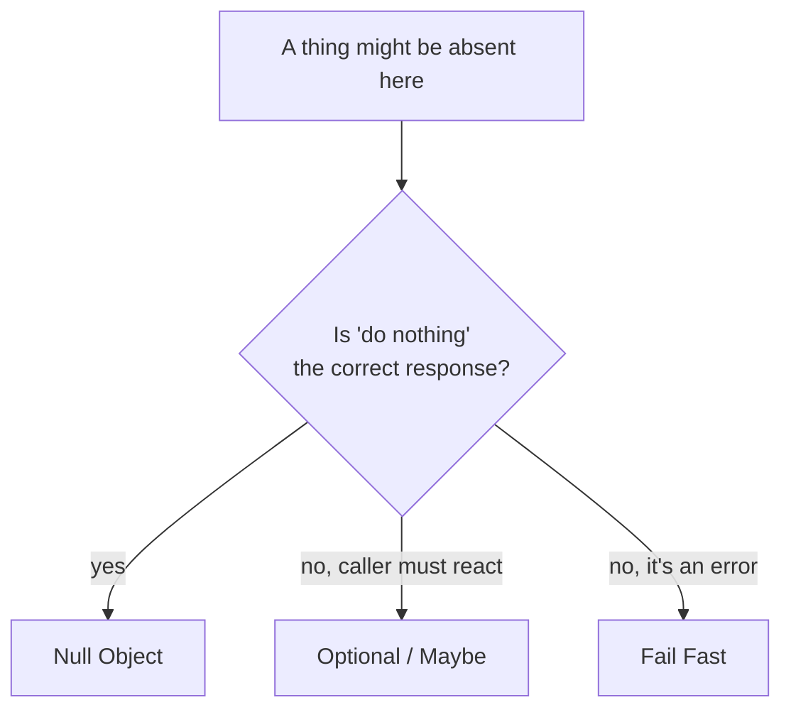
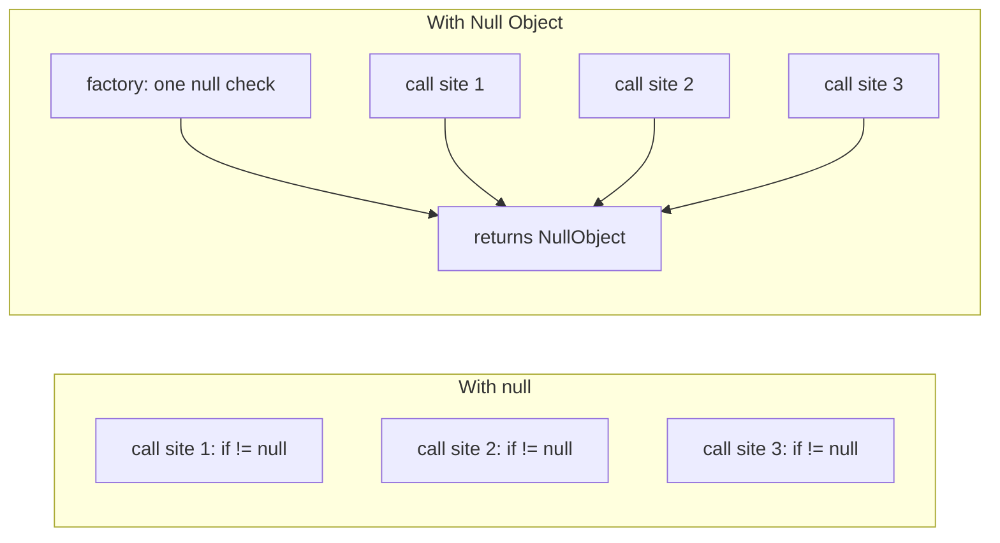

# Null Object — Middle Level

> **Category:** [Control-Flow Patterns](../README.md) — return a do-nothing object that satisfies the expected interface instead of `null`.
>
> **Prerequisite:** [Junior](junior.md)
> **Focus:** **Why** and **When**

---

## Table of Contents

1. [Introduction](#introduction)
2. [When to Use Null Object](#when-to-use-null-object)
3. [When NOT to Use Null Object](#when-not-to-use-null-object)
4. [The Central Trade-off: Do Nothing vs Fail Fast](#the-central-trade-off-do-nothing-vs-fail-fast)
5. [Real-World Cases](#real-world-cases)
6. [Production-Grade Code](#production-grade-code)
7. [Trade-offs](#trade-offs)
8. [Alternatives](#alternatives)
9. [Refactoring Toward Null Object](#refactoring-toward-null-object)
10. [Edge Cases](#edge-cases)
11. [Tricky Points](#tricky-points)
12. [Best Practices](#best-practices)
13. [Summary](#summary)
14. [Diagrams](#diagrams)

---

## Introduction

> Focus: **Why** and **When**

The junior view is "Null Object removes null checks." The middle-level skill is knowing **when that removal is a feature and when it is a bug**. Deleting a `null` check is only safe if "do nothing" is the *correct* response to absence. If absence means something is broken, deleting the check hides the breakage.

So the real decision is not "Null Object or null check?" It is:

> **When this thing is absent, is the right behavior "carry on doing nothing," or "stop and shout"?**

- "Carry on" → Null Object.
- "Stop and shout" → [Fail Fast](../02-fail-fast/junior.md).

This file is about recognizing which side of that line you are on.

---

## When to Use Null Object

Use it when **all** of these hold:

1. **"Do nothing" is genuinely correct.** A disabled logger should swallow logs; that's the spec, not a bug.
2. **The neutral value is honest.** `0`, `""`, `false`, or empty-collection truthfully represents the absent case (not just a convenient lie).
3. **The same check repeats** at many call sites, adding noise.
4. **Absence is expected and frequent** — guests, optional collaborators, off-by-config features.

### Strong-fit examples

- **Optional collaborators:** logger, metrics reporter, tracer, audit sink, event listener.
- **Default/empty states:** empty cart, no-results list, guest user, anonymous principal.
- **Hooks and callbacks:** a default `OnProgress` that ignores updates.
- **Strategy slots:** a `NoDiscount` strategy returning the price unchanged.

---

## When NOT to Use Null Object

| Anti-pattern symptom | Better choice |
|---|---|
| Absence means a required dependency is missing | [Fail Fast](../02-fail-fast/junior.md) — throw at wiring time |
| The caller must *react* to "not found" (show 404, retry, branch) | Return `Optional`/error; let the caller decide |
| There is no honest neutral value (`balance()` of a missing account) | `Optional` or explicit error |
| Absence happens at exactly one site | A local `null` check — clearer than a new type |
| "Do nothing" would silently drop money, data, or security | Anything that fails loudly |

The danger is always the same: **a Null Object turns a missing thing into a silent thing.** Silence is good for a disabled logger and catastrophic for an unprocessed payment.

---

## The Central Trade-off: Do Nothing vs Fail Fast

This is the heart of the pattern. The same code shape — "return a stand-in instead of null" — is excellent in one context and dangerous in another.

```java
// CONTEXT A — Null Object is RIGHT.
// A logger is an optional collaborator. Swallowing logs when disabled is correct.
Logger logger = config.loggingEnabled() ? real : Logger.NULL;
logger.info("ok");   // do nothing when disabled — fine.

// CONTEXT B — Null Object is WRONG.
// A payment gateway is a REQUIRED dependency. A no-op "charge" that silently
// succeeds is a financial bug.
PaymentGateway gw = lookup();           // returns NullGateway if not configured
gw.charge(order.total());               // does NOTHING — order ships unpaid!
```

In Context B, the correct move is to **fail fast** at wiring time:

```java
PaymentGateway gw = Objects.requireNonNull(lookup(), "payment gateway not configured");
```

> **Heuristic:** if a future reader, seeing the no-op fire, would say *"good, that's expected"* → Null Object. If they'd say *"wait, why did nothing happen?!"* → Fail Fast. Logging, metrics, hooks = expected silence. Payments, auth, persistence = unacceptable silence.

See the sibling pattern [Fail Fast](../02-fail-fast/junior.md) for the other half of this decision.

---

## Real-World Cases

### 1. `logging.NullHandler` (Python stdlib)

Libraries attach a `NullHandler` so they never emit logs unless the *application* configures logging:

```python
import logging
logging.getLogger(__name__).addHandler(logging.NullHandler())
```

This is a Null Object shipped by the standard library. "Do nothing" is exactly right: a library must not spam the user's console.

### 2. Guest / Anonymous user

```java
User current = session.user() != null ? session.user() : User.GUEST;
if (current.canEdit(doc)) { ... }   // GUEST.canEdit() returns false — no null check
```

`GUEST` answers every permission query with a safe "no." The authorization code never branches on `null`.

### 3. No-op metrics / tracing

```go
tracer := otel.Tracer() // returns a no-op tracer when no provider is registered
ctx, span := tracer.Start(ctx, "handler")
defer span.End()        // all no-ops when tracing is off — code is unconditional
```

OpenTelemetry ships no-op implementations so instrumentation code compiles and runs identically whether or not a backend is wired.

### 4. Empty collection as Null Object

```java
List<Order> orders = repo.findByUser(id); // returns emptyList(), never null
for (Order o : orders) { ... }            // loop runs zero times — no null check
```

An empty list *is* a Null Object for "no results": every collection operation is safe.

### 5. Null discount strategy

```python
class NoDiscount:
    def apply(self, price: float) -> float:
        return price          # neutral: price unchanged

discount = lookup_discount(cart) or NoDiscount()
total = discount.apply(cart.subtotal())   # always callable
```

---

## Production-Grade Code

### Java — NullCustomer with neutral queries

```java
public interface Customer {
    String name();
    boolean isPremium();
    BigDecimal discountRate();

    Customer GUEST = new Customer() {
        public String name()            { return "Guest"; }
        public boolean isPremium()      { return false; }
        public BigDecimal discountRate(){ return BigDecimal.ZERO; }
    };
}

public final class CustomerRepository {
    public Customer find(String id) {
        Customer c = db.lookup(id);
        return c != null ? c : Customer.GUEST;   // the ONE null check, centralized
    }
}

// Call site — no branching:
Customer c = repo.find(id);
BigDecimal price = base.multiply(BigDecimal.ONE.subtract(c.discountRate()));
String label = c.isPremium() ? "★ " + c.name() : c.name();
```

The Null Object answers every query honestly: a guest has no premium status and a zero discount. Note: this is correct **only because** treating an unknown visitor as a guest is a valid business rule. If "customer not found" had to trigger an error page, you'd return `Optional<Customer>` instead.

### Python — Null Object via a small class

```python
from typing import Protocol
from decimal import Decimal

class Customer(Protocol):
    def name(self) -> str: ...
    def is_premium(self) -> bool: ...
    def discount_rate(self) -> Decimal: ...

class GuestCustomer:
    def name(self) -> str: return "Guest"
    def is_premium(self) -> bool: return False
    def discount_rate(self) -> Decimal: return Decimal("0")

GUEST = GuestCustomer()   # shared singleton

def find_customer(repo, cid: str) -> Customer:
    return repo.get(cid) or GUEST
```

> **`__getattr__` shortcut (use sparingly):** Python lets you build a "swallow everything" Null Object dynamically:
>
> ```python
> class Null:
>     def __getattr__(self, _): return lambda *a, **k: None
>     def __bool__(self): return False
> ```
>
> This makes *any* method call a no-op. It's terse but **dangerous** — it silently absorbs typos and unintended calls. Prefer an explicit class that implements the real interface.

### Go — no-op interface value, never `nil`

```go
type MetricsReporter interface {
    Incr(name string)
    Timing(name string, ms int64)
}

type nopReporter struct{}

func (nopReporter) Incr(string)         {}
func (nopReporter) Timing(string, int64) {}

var NopReporter MetricsReporter = nopReporter{}

func NewReporter(cfg Config) MetricsReporter {
    if cfg.MetricsURL == "" {
        return NopReporter // never return nil
    }
    return newStatsd(cfg.MetricsURL)
}
```

The key discipline: a constructor that *might* not produce a real object returns the Null Object, **not** a `nil` interface. A `nil` interface panics on the first method call; the Null Object cannot.

---

## Trade-offs

| Dimension | Null Object | `null` + checks | `Optional`/`Maybe` | Fail Fast |
|---|---|---|---|---|
| Call-site noise | None | High (`if != null`) | Medium (`.map`/`ifPresent`) | None |
| NPE risk | Eliminated | High | Eliminated | N/A |
| Forces caller to handle absence | No (hidden) | Yes (manually) | **Yes (by type)** | Stops execution |
| Surfaces a missing dependency | **No — risk** | Yes | Yes | **Yes — loudly** |
| Best when absence is… | a normal, do-nothing case | — | a case the caller must handle | an error |

The columns make the choice concrete: Null Object and `Optional` are opposites in one crucial way — Null Object *hides* absence, `Optional` *advertises* it.

---

## Alternatives

### vs `Optional` / `Maybe`

`Optional<T>` keeps absence in the type and forces the caller to deal with it:

```java
Optional<Customer> c = repo.find(id);
c.ifPresent(cust -> notify(cust));   // caller explicitly handles "present"
```

Use `Optional` when the caller **must** make a decision. Use Null Object when the caller should be able to **ignore** absence safely.

### vs Special Case

[Special Case](../04-special-case/junior.md) is the generalization: a dedicated object for a recurring condition, possibly with *real* behavior (an `UnknownCustomer` that logs the lookup, a `SuspendedAccount` that rejects charges with a specific message). Null Object is the subset where the behavior is "do nothing."

### vs leaving `null` with guard clauses

Sometimes a single, local `null` check is the clearest thing. Don't manufacture a class to delete one `if`.

---

## Refactoring Toward Null Object

Given a method peppered with the same check:

```java
// Before
void render(Customer c) {
    String name = (c != null) ? c.name() : "Guest";
    boolean prem = (c != null) && c.isPremium();
    BigDecimal d = (c != null) ? c.discountRate() : BigDecimal.ZERO;
    ...
}
```

**Step 1 — Define the Null Object** implementing the interface with the neutral values that the scattered checks were already producing (`"Guest"`, `false`, `ZERO`).

**Step 2 — Funnel creation through one place** (a factory/repository) that returns `Customer.GUEST` instead of `null`.

**Step 3 — Delete the checks:**

```java
// After
void render(Customer c) {   // c is never null
    String name = c.name();
    boolean prem = c.isPremium();
    BigDecimal d = c.discountRate();
    ...
}
```

**Step 4 — Confirm "do nothing" is correct here.** If any deleted check was actually *handling an error*, stop — that site needs [Fail Fast](../02-fail-fast/junior.md), not a Null Object.

This is Fowler's **"Introduce Special Case / Null Object"** refactoring.

---

## Edge Cases

### 1. No honest neutral value

`NullAccount.balance()` → `0` is a lie (it means "no account," not "broke"). When no neutral value is truthful, use `Optional` or fail fast.

### 2. Null Object leaks into equality / serialization

If `GUEST` gets persisted or serialized as a real customer, you've stored a phantom. Make Null Objects un-persistable or filter them at the boundary.

### 3. Mixed returns

A method that returns a Null Object *sometimes* and `null` *other times* is the worst of both. Pick one contract and hold it.

### 4. Mutating a singleton Null Object

If the Null Object is shared and someone mutates it, every caller is affected. Keep it immutable and stateless.

---

## Tricky Points

- **Null Object can mask bugs in tests.** A test that injects a `NullLogger`/`NullRepo` may pass while the real wiring is broken. Assert the *real* collaborator is used in integration tests.
- **`Optional<NullObject>` is a smell.** If you wrap a Null Object in an `Optional`, you've chosen both strategies — pick one.
- **Null Object ≠ test double.** A Null Object is production behavior; a stub/mock is a test artifact. Naming them clearly (`NullLogger` vs `FakeLogger`) prevents confusion.
- **"Tell, don't ask" synergy.** Null Object thrives in code that *commands* (`logger.info(...)`) rather than *queries* (`if (logger != null)`). Query-heavy code resists it.

---

## Best Practices

1. **Decide "do nothing vs fail fast" first.** This is the whole game.
2. **Make it immutable and a shared singleton.**
3. **Implement the entire interface** with neutral, non-throwing behavior.
4. **Centralize the real-vs-null decision** in a factory/repository.
5. **Default fields to the Null Object** so objects are never in a `null` state.
6. **Never mix `null` and Null Object returns** from the same method.
7. **Make the wiring explicit** so a Null Object can't sneak in for a required dependency.

---

## Summary

- Null Object removes `null` checks by giving "absence" an object with neutral, do-nothing behavior.
- The decisive question is **"do nothing vs fail fast"** — use Null Object only where silent absence is *correct*.
- It is the opposite of `Optional`: Null Object **hides** absence; `Optional` **advertises** it.
- It is the do-nothing subset of [Special Case](../04-special-case/junior.md).
- Centralize the real-vs-null choice; keep the object immutable and shared.

---

## Diagrams

### The decision



### Where the check moves



[← Junior](junior.md) · [Control Flow](../README.md) · [Coding Patterns](../../README.md) · **Next:** [Senior](senior.md)
