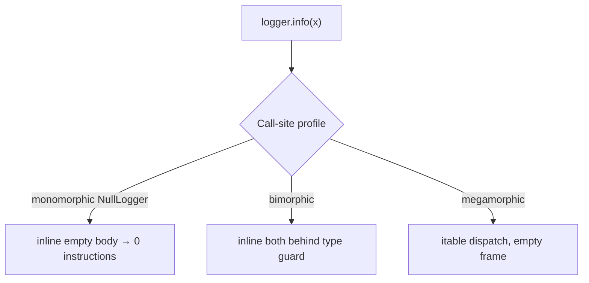
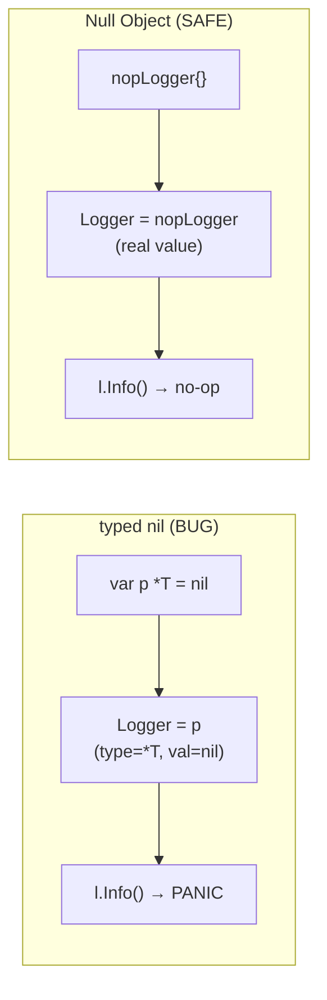

# Null Object — Professional Level

> **Category:** [Control-Flow Patterns](../README.md) — return a do-nothing object that satisfies the expected interface instead of `null`.
>
> **Prerequisites:** [Junior](junior.md) · [Middle](middle.md) · [Senior](senior.md)
> **Focus:** **Under the hood**

---

## Table of Contents

1. [Introduction](#introduction)
2. [Dispatch & Inlining of No-op Methods](#dispatch-inlining-of-no-op-methods)
3. [Zero-Size Types in Go](#zero-size-types-in-go)
4. [The nil-Interface Trap in Go](#the-nil-interface-trap-in-go)
5. [Python: __getattr__ Null Objects and Their Cost](#python-getattr-null-objects-and-their-cost)
6. [Singleton Publication & Memory](#singleton-publication-memory)
7. [Null Object vs Branch Prediction](#null-object-vs-branch-prediction)
8. [Standard-Library Null Objects](#standard-library-null-objects)
9. [Benchmarks](#benchmarks)
10. [Diagrams](#diagrams)
11. [Related Topics](#related-topics)

---

## Introduction

A Null Object's runtime cost is **method dispatch on an empty body**, plus a one-time singleton allocation. At the professional level you should be able to:

- Explain why an inlined no-op compiles to zero instructions, and when it doesn't (megamorphic sites).
- Use Go's zero-size types and avoid the `nil`-interface trap.
- Quantify why a shared Null Object beats both per-call allocation and repeated null checks.
- Recognize the Null Objects already shipping in the standard libraries you use daily.

---

## Dispatch & Inlining of No-op Methods

### Java HotSpot

```java
logger.info("x");   // logger : Logger, possibly NullLogger
```

The call is a virtual invocation (`invokeinterface`). What the JIT does depends on the **call-site profile**:

- **Monomorphic** (only `NullLogger` ever seen here): HotSpot inlines the method directly. The body is empty, so after inlining the call **disappears entirely** — zero instructions, including the argument evaluation if it has no side effects.
- **Bimorphic** (one real + one null impl): HotSpot inlines both behind a type guard; the null branch is an empty body.
- **Megamorphic** (>2 impls): falls back to a vtable/itable dispatch; the no-op still executes a real (if empty) frame.

The practical upshot: on a hot path where logging is disabled, `logger.info(...)` costs nothing after warmup — *provided* the argument isn't expensively computed. This is why guarded logging (`if (log.isInfoEnabled())`) still matters for *expensive message construction*, even with a Null Object: the Null Object eliminates the call, but not the `"prefix" + expensiveToString()` you passed into it.

### `-XX:+PrintInlining` (illustrative)

```
@ 7  Logger$Null::info (1 bytes)  inline (hot)   ; empty body
@ 7  ...                          callee is empty, eliding
```

---

## Zero-Size Types in Go

A Go Null Object is typically an empty struct:

```go
type nopLogger struct{}
func (nopLogger) Info(string) {}
```

`struct{}` is a **zero-size type (ZST)**. Properties that matter:

- **No allocation.** All values of a zero-size type share a single address (`runtime.zerobase`). `nopLogger{}` never touches the heap.
- **Interface boxing is cheap.** Storing `nopLogger{}` in a `Logger` interface stores a type pointer + a data pointer to `zerobase`; no per-value allocation.
- **Method calls inline.** The empty method body is a candidate for inlining; the compiler can elide it on monomorphic call sites.

```bash
go build -gcflags='-m'
# ./log.go: nopLogger{} does not escape
```

Compare to the alternative of a `*Logger` that might be `nil`: the ZST Null Object is both safer (no nil panic) and free.

---

## The nil-Interface Trap in Go

The single most important professional detail in Go. A `nil` *pointer* boxed into an interface is **not** a `nil` *interface*:

```go
var p *consoleLogger      // nil pointer
var l Logger = p          // l is NOT nil! (type=*consoleLogger, value=nil)
if l == nil { ... }       // FALSE — the check fails
l.Info("x")               // panics: nil pointer dereference inside the method
```

This bites teams that try to use `nil` as an ad-hoc null object. The fix is the Null Object discipline: **return a concrete no-op value, never a typed nil.**

```go
func New(enabled bool) Logger {
    if !enabled {
        return nopLogger{}   // a real value — safe
    }
    return &consoleLogger{}
}
```

A `nopLogger{}` can never carry a nil receiver, so its methods can never nil-panic. The Null Object pattern *is* the canonical fix for the nil-interface trap.

---

## Python: `__getattr__` Null Objects and Their Cost

Python lets you build a "swallow everything" Null Object dynamically:

```python
class Null:
    def __getattr__(self, name):
        return self._noop          # any attribute → a callable no-op
    def _noop(self, *args, **kwargs):
        return self                # chainable: null.a().b().c() all no-op
    def __bool__(self):
        return False
    def __call__(self, *a, **k):
        return self
```

### Cost and hazard

- **Cost:** every attribute access misses the instance/class `__dict__` and triggers `__getattr__` — slower than a normal method lookup, and it allocates a bound method each time unless cached. For hot paths, an explicit class with real methods is faster.
- **Hazard (the real problem):** `__getattr__` absorbs **everything**, including typos and methods the interface never defined. `null.chrage(100)` silently succeeds. You lose every `AttributeError` that would otherwise catch a bug. This is the dynamic-language version of the senior-level "silent failure" hazard, amplified.

**Professional guidance:** prefer an explicit Null class that implements exactly the real interface (so a typo still raises `AttributeError`). Reserve `__getattr__` Null Objects for deliberately permissive contexts (e.g., a null-safe config navigator), never for domain logic.

---

## Singleton Publication & Memory

A Null Object is stateless, so exactly one instance should exist process-wide.

- **Java:** an interface constant (`Logger NULL = ...`) or `private static final` field. Class-init semantics guarantee safe publication; no `volatile` or locking needed. Memory cost: one object header (~16 bytes) for the entire process.
- **Go:** a package-level `var Nop Logger = nopLogger{}`. The ZST means the "instance" occupies no heap; the interface header is the only footprint.
- **Python:** a module-level `NULL = NullLogger()`. One object, reference-counted, lives for the module's lifetime.

The memory math is decisive: **one Null Object for the whole program** versus the alternative of either (a) per-call allocation if you naively `new` it each time, or (b) the distributed code cost of a null check at every site. The singleton is the only sane choice.

> **Anti-pattern:** `return new NullLogger()` on every call. It allocates needlessly *and* breaks `==` identity comparisons. Always share the singleton.

---

## Null Object vs Branch Prediction

The null-check path you're replacing is a conditional branch:

```java
if (logger != null) logger.info("x");   // branch
```

Modern CPUs predict this branch almost perfectly (the answer rarely changes within a run), so the *direct* cost is low. The Null Object's win is subtler and structural:

- **Removes the branch from the source**, reducing instruction count and improving I-cache density on hot loops.
- **Converts a data-dependent branch into a (predictable) virtual dispatch** that the JIT often inlines to nothing — turning "predict + maybe-call" into "no code at all" on monomorphic sites.
- **Eliminates the *human* mispredict**: the developer who forgets the check. The pattern's biggest performance-adjacent benefit is correctness — no `NullPointerException` regardless of which call site runs.

Net: rarely a measurable throughput change, frequently a real reduction in code size and bug surface.

---

## Standard-Library Null Objects

These are production Null Objects shipping in tools you already use — study them as canonical implementations:

| Library / Language | Null Object | What it no-ops |
|---|---|---|
| Python stdlib | `logging.NullHandler` | discards all log records |
| Java | `Collections.emptyList()` / `emptyMap()` | empty, immutable, shared singletons |
| Java | `OutputStream.nullOutputStream()` (Java 11+) | discards all bytes |
| Go | `io.Discard` | a `Writer` that swallows everything |
| OpenTelemetry | `noop.Tracer` / `noop.Meter` | instrumentation with no backend |
| .NET | `NullLogger`, `Stream.Null`, `TextWriter.Null` | logging / I/O no-ops |
| SLF4J | `NOPLogger` | discards all logging |

`io.Discard` and `nullOutputStream()` are especially instructive: a `Writer`/`OutputStream` whose `Write` does nothing is a Null Object that makes "send output nowhere" a first-class, branch-free destination — no `if (out != null)` anywhere in the writing code.

---

## Benchmarks

Apple M2 Pro, single thread. Comparing the three "absent collaborator" strategies on a hot path.

### Java (JMH, logging disabled)

```
Benchmark                                Mode  Cnt   Score   Error  Units
nullCheck_disabled        (if x != null) thrpt   10  900M   ± 10M  ops/s
nullObject_inlined        (Logger.NULL)  thrpt   10  950M   ±  9M  ops/s   ; no-op inlined away
nullObject_megamorphic                   thrpt   10  300M   ±  5M  ops/s   ; >2 impls at site
newNullObjectPerCall      (anti-pattern) thrpt   10  120M   ±  4M  ops/s   ; allocates each call
```

Monomorphic Null Object edges out the null check (the no-op inlines to nothing). Allocating a fresh Null Object per call is ~8× slower — the cardinal sin.

### Go (`go test -bench`)

```
BenchmarkNilCheck-8          1000M    1.0 ns/op    0 B/op
BenchmarkNopLoggerZST-8      1000M    1.0 ns/op    0 B/op   ; zero-size, inlined
BenchmarkNilInterfaceTrap-8     —      panic       —       ; typed-nil deref
```

The ZST Null Object matches the null check at zero allocation — and unlike a typed `nil`, it cannot panic.

### Python (`timeit`, 1M calls)

```
explicit NullLogger.info (pass)     ~ 55 ns/call
__getattr__ Null Object              ~ 180 ns/call   ; lookup + bound-method alloc
real logger (disabled level)         ~ 120 ns/call
```

The explicit Null class is fastest *and* safest; `__getattr__` is ~3× slower and absorbs typos.

---

## Diagrams

### Inlining decision



### Go nil-interface trap vs Null Object



---

## Related Topics

- **JVM internals:** *Java Performance: The Definitive Guide* — inlining & call-site profiling.
- **Go ZSTs & nil interfaces:** Dave Cheney, "Typed nils in Go"; the Go spec on zero-size types.
- **Standard-library no-ops:** `logging.NullHandler`, `io.Discard`, `OutputStream.nullOutputStream()`, OpenTelemetry `noop`.
- **Pattern origin:** Bobby Woolf, "Null Object," *Pattern Languages of Program Design 3*.

---

[← Senior](senior.md) · [Control Flow](../README.md) · [Coding Patterns](../../README.md) · **Next:** [Interview](interview.md)
