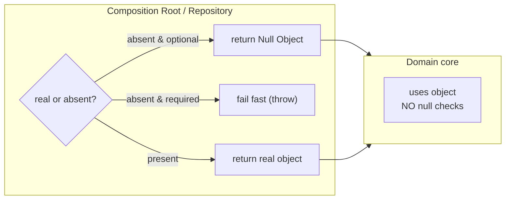
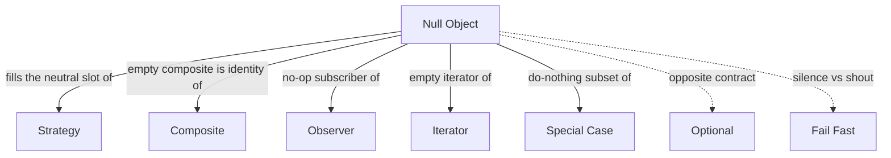

# Null Object — Senior Level

> **Category:** [Control-Flow Patterns](../README.md) — return a do-nothing object that satisfies the expected interface instead of `null`.
>
> **Prerequisites:** [Junior](junior.md) · [Middle](middle.md)
> **Focus:** **Architecture** and **optimization**

---

## Table of Contents

1. [Introduction](#introduction)
2. [Null Object as an Architectural Boundary](#null-object-as-an-architectural-boundary)
3. [The GoF / Behavioral-Pattern Lineage](#the-gof-behavioral-pattern-lineage)
4. [Null Object vs Optional at the Type Level](#null-object-vs-optional-at-the-type-level)
5. [The Silent-Failure Hazard at Scale](#the-silent-failure-hazard-at-scale)
6. [Composing Null Objects](#composing-null-objects)
7. [Concurrency & Sharing](#concurrency-sharing)
8. [Performance](#performance)
9. [Testability](#testability)
10. [Code Examples — Advanced](#code-examples-advanced)
11. [Liabilities](#liabilities)
12. [Migration Patterns](#migration-patterns)
13. [Diagrams](#diagrams)
14. [Related Topics](#related-topics)

---

## Introduction

> Focus: **architecture** and **optimization**

At the senior level, Null Object stops being "a trick to delete `null` checks" and becomes a **deliberate decision about where absence is handled in the architecture**. Every system has a boundary between "code that knows a thing might be missing" and "code that just uses it." Null Object lets you push that boundary *outward* — absence is resolved once, at the edge (a factory, a DI container, a repository), and the entire inner domain operates on objects that are never `null`.

Senior decisions:
- Where in the architecture is absence legitimately resolved into "do nothing"?
- Which dependencies must **never** silently no-op (auth, payment, persistence)?
- Null Object, `Optional`, or a sealed/`Result` type — which makes the contract clearest at *this* boundary?
- How do you stop a Null Object meant for one layer from leaking through to another where its silence is dangerous?

---

## Null Object as an Architectural Boundary

The most valuable use of Null Object is **boundary placement**. Resolve absence at the seam and keep the core branch-free.

```
   edge (controller / DI / repo)        domain core
   ────────────────────────────         ───────────────
   real-or-null decided HERE   ──────►  everything is non-null
   (one null check, one place)          (no null checks at all)
```

Concretely, the wiring layer chooses:

```java
@Bean
AuditSink auditSink(Config cfg) {
    return cfg.auditingEnabled() ? new KafkaAuditSink(cfg) : AuditSink.NULL;
}
```

Every service that depends on `AuditSink` is injected a non-null value and never branches. The decision lives in one composition-root method. This is Null Object as a **dependency-injection default** — and it is why DI containers and frameworks ship no-op implementations (no-op meter, no-op tracer, no-op cache).

The architectural rule: **a Null Object's silence must be appropriate for every layer it can reach.** An `AuditSink.NULL` is fine if "auditing off" is a supported deployment mode. It is a compliance bug if auditing is mandatory and someone misconfigures it into existence.

---

## The GoF / Behavioral-Pattern Lineage

Null Object is not in the original Gang of Four catalog; it was formalized later (Bobby Woolf, *PLoPD3*). It sits squarely among the **behavioral** patterns because it replaces a *conditional* with *polymorphism* — the defining move of the behavioral family.

It interlocks with several GoF patterns:

- **Strategy:** a `NoDiscount`/`NoOpStrategy` is the Null Object of a Strategy slot — a valid, do-nothing algorithm.
- **State:** an "uninitialized" or "closed" state can be a Null Object that ignores transitions.
- **Iterator:** an empty iterator (`hasNext() == false`) is a Null Object — loops simply don't run.
- **Observer:** a no-op listener is a Null Object subscriber.
- **Decorator / Composite:** the "identity" element (a decorator that adds nothing, an empty composite) is a Null Object.

Recognizing this lineage matters: when you reach for Null Object, you're usually filling a *polymorphic slot* that another pattern defined. The Null Object is the neutral element of that slot's "algebra."

---

## Null Object vs Optional at the Type Level

These are not interchangeable; they make **opposite promises to the caller**.

| | Null Object | `Optional<T>` / `Maybe` / `T?` |
|---|---|---|
| Absence in the type signature | Invisible (`T`) | Explicit (`Optional<T>`) |
| Caller obligation | None — call freely | Must unwrap / handle the empty case |
| Failure mode | Silent no-op | Compile-time nudge to handle it |
| Right when… | absence ≡ "do nothing" | absence is a branch the caller must take |
| Composability | via polymorphism | via `map`/`flatMap`/`andThen` |

A senior heuristic: **the type should tell the caller the truth.** If absence is something the caller genuinely must reckon with — render a 404, retry, choose a fallback — encode it as `Optional`/`Result`/a sealed type so the compiler enforces handling. If absence is a non-event the caller should ignore, Null Object keeps the call site clean. Choosing Null Object *because you don't want to deal with `Optional`* is choosing to hide a decision the caller needed to make.

In languages with non-nullable types (Kotlin `T?`, Swift optionals, Rust `Option<T>`), the compiler already forces the absence decision — Null Object is then a *style* choice for keeping call sites flat, not a safety mechanism. In Java/Go/Python, Null Object also buys you NPE/nil/`AttributeError` safety.

---

## The Silent-Failure Hazard at Scale

The pattern's defining strength — silence — is also its defining systemic risk. At scale, a misplaced Null Object produces **the worst class of bug: a system that runs, returns success, and quietly does nothing.**

Three failure modes a senior must guard against:

1. **The accidental Null Object dependency.** A required collaborator is wired to its no-op variant by a config typo. The app is green; payments don't charge, audits don't record, caches don't cache. There is no error, no exception, no log — by design.

2. **The Null Object that should have been a `Result`.** A `find()` returns a Null Object for "not found," so the caller can't distinguish "found, but empty" from "didn't exist." Downstream logic makes wrong decisions on indistinguishable inputs.

3. **The cascading no-op.** A Null Object's neutral return (`0`, empty) feeds a calculation that "succeeds" with nonsense — `discountRate() == 0` is correct for a guest but catastrophic if it actually meant "lookup failed."

### Mitigations

- **Make required dependencies un-Null-able.** Use [Fail Fast](../02-fail-fast/junior.md) at the composition root: `Objects.requireNonNull(gateway)`. Reserve Null Objects for genuinely optional collaborators.
- **Distinguish "empty" from "absent."** Don't use a Null Object where the caller must tell the difference; return `Optional`/`Result`.
- **Observability on the no-op path (selectively).** A Null Object that's *supposed* to be silent in prod can still increment a debug counter or warn once at startup ("running with NullAuditSink"), so an accidental no-op is discoverable.
- **Architecture tests.** Assert that critical ports (payment, auth) are bound to real implementations in production profiles.

---

## Composing Null Objects

Null Objects compose cleanly because the neutral element of a composition is itself a Null Object.

```java
// A composite of listeners; the empty composite is a Null Object.
final class CompositeListener implements Listener {
    private final List<Listener> ls;
    CompositeListener(List<Listener> ls) { this.ls = List.copyOf(ls); }
    public void onEvent(Event e) { for (var l : ls) l.onEvent(e); }
}
Listener NONE = new CompositeListener(List.of());   // iterates nothing → no-op
```

This is why Null Object pairs naturally with **Decorator** (a decorator over a Null Object is just the decorator's own behavior) and **Composite** (an empty composite is the identity). When you design a pluggable slot, providing the Null Object *as the default* makes "no plugins" a first-class, branch-free state.

---

## Concurrency & Sharing

- **Stateless Null Objects are trivially thread-safe.** No fields, no mutation → share one instance across all threads without synchronization. This is a real advantage over `null` checks, which are fine concurrently but require every site to be correct.
- **Never give a Null Object hidden mutable state.** A "no-op" that secretly buffers, counts, or caches breaks both the stateless-singleton sharing model and the pattern's contract.
- **Publication safety.** Publish the singleton via a `final`/`static final`/package-level immutable so the happens-before guarantees hold; an unsafely-published mutable Null Object is a data-race waiting to happen.

---

## Performance

Null Object is, if anything, a **performance win** over the alternatives:

- **Zero allocation.** A shared singleton is allocated once at class/module load. There is nothing per-call.
- **No branch at the call site.** The `if (x != null)` is gone, removing a (usually well-predicted) branch and improving instruction-cache density on hot paths.
- **Monomorphic-to-bimorphic dispatch.** With one real and one null implementation, the call site is bimorphic; the JIT inlines both. If a hot site only ever sees the Null Object, it becomes monomorphic and inlines to nothing. The no-op body is then **eliminated entirely** by the optimizer — a no-op method that's inlined compiles to *zero* instructions.
- **Caveat:** if many implementations flow through one call site (megamorphic), dispatch costs rise — but that's a property of the polymorphism, not of Null Object specifically, and it would apply to the real implementations too.

In Go, returning a no-op struct (`nopLogger{}`, a zero-size type) costs nothing — zero-size types share a single address and never allocate. In Python, a shared singleton avoids per-call object creation; an attribute call on a no-op is a normal method dispatch.

Bottom line: **Null Object is essentially free**, and usually cheaper than the null-check path it replaces.

---

## Testability

### 1. Null Object as the default test collaborator

For optional collaborators, the Null Object is the perfect "I don't care about this" stand-in — no mocking framework needed:

```java
var svc = new OrderService(repo, Logger.NULL, MetricsReporter.NULL);
```

This keeps tests focused on behavior under test without setting up mocks for incidental ports.

### 2. But don't let it hide integration gaps

A unit test passing with `Logger.NULL`/`NullRepo` says nothing about whether the *real* wiring works. Cover the composition root with an integration test that asserts real implementations are bound.

### 3. Test the Null Object's contract

Yes, even a no-op deserves a test — to lock the contract that it never throws and returns neutral values:

```java
@Test void nullCustomerIsNeutral() {
    assertEquals(BigDecimal.ZERO, Customer.GUEST.discountRate());
    assertFalse(Customer.GUEST.isPremium());
    assertDoesNotThrow(() -> Logger.NULL.info("x"));
}
```

---

## Code Examples — Advanced

### Java — Null Object as a Strategy default + Fail-Fast guard for required ports

```java
public interface RetryPolicy {
    boolean shouldRetry(int attempt, Exception e);

    // Null Object: a policy that never retries.
    RetryPolicy NEVER = (attempt, e) -> false;
}

public final class Caller {
    private final RetryPolicy retry;
    private final PaymentGateway gateway;   // REQUIRED — must not be a Null Object

    public Caller(PaymentGateway gateway, RetryPolicy retry) {
        // Fail fast: a required dependency cannot be allowed to no-op.
        this.gateway = Objects.requireNonNull(gateway, "gateway required");
        // Optional: default to the Null Object instead of null.
        this.retry   = retry != null ? retry : RetryPolicy.NEVER;
    }
}
```

This single constructor encodes the entire middle-level lesson: **optional collaborator → default to Null Object; required collaborator → fail fast.**

### Python — Null Object for an optional, Result for an unavoidable decision

```python
from dataclasses import dataclass

class NullCache:
    def get(self, key): return None      # neutral: always a miss
    def set(self, key, value): pass      # no-op

# Optional collaborator → Null Object is fine.
cache = real_cache or NullCache()

# But "user not found" is a decision the caller MUST make → don't hide it.
def find_user(repo, uid) -> "User | None":
    return repo.get(uid)   # return None / raise; do NOT return a NullUser here

user = find_user(repo, uid)
if user is None:
    return Response(404)   # caller genuinely must branch
```

The contrast in one file: a `NullCache` is right (a cache miss is a valid neutral state); a `NullUser` would be wrong (the caller must produce a 404).

### Go — no-op tracer wired by the composition root

```go
type Tracer interface {
    Start(ctx context.Context, name string) (context.Context, Span)
}

type nopTracer struct{}
func (nopTracer) Start(ctx context.Context, _ string) (context.Context, Span) {
    return ctx, nopSpan{}
}

// Composition root resolves absence ONCE.
func BuildTracer(cfg Config) Tracer {
    if cfg.TracingEndpoint == "" {
        return nopTracer{} // optional collaborator → Null Object
    }
    return newOTLPTracer(cfg.TracingEndpoint)
}

// A required dependency is checked, not defaulted to a no-op.
func NewServer(db *sql.DB, tracer Tracer) (*Server, error) {
    if db == nil {
        return nil, errors.New("db is required") // fail fast
    }
    return &Server{db: db, tracer: tracer}, nil
}
```

---

## Liabilities

### Symptom 1: A Null Object for a required dependency

If a no-op variant exists for payment/auth/persistence, a misconfiguration can silently disable it. Don't provide a Null Object for ports whose silence is unacceptable; force them with [Fail Fast](../02-fail-fast/junior.md).

### Symptom 2: Callers re-checking for the Null Object

```java
if (customer == Customer.GUEST) { ... }   // smell
```

If callers check whether they got the Null Object, you've reintroduced the conditional you tried to delete — and you probably needed `Optional`/Special Case all along.

### Symptom 3: Neutral value that isn't honest

`balance() == 0` for a missing account, `discountRate() == 0` for a failed lookup — neutral values that *lie* propagate wrong answers. If no value is truthful, Null Object is the wrong pattern.

### Symptom 4: Null Object with creeping behavior

The moment a no-op grows logic ("just log here," "just count there"), it's a [Special Case](../04-special-case/junior.md), and it now has state and concurrency concerns. Promote it deliberately rather than letting a "Null" object quietly become non-null.

---

## Migration Patterns

### `null` returns → Null Object

1. Define the Null Object implementing the full interface with neutral values.
2. Funnel all creation through one factory/repository that returns the Null Object instead of `null`.
3. Delete the now-dead `if (x != null)` checks.
4. **Audit each deleted check** — if any was handling an *error*, that site needs `Optional`/fail-fast, not a Null Object.

### Null Object → `Optional` (when silence proved harmful)

If a Null Object has been masking a decision the caller needed:

```java
// Before: hides absence
Customer find(String id) { return found != null ? found : Customer.GUEST; }

// After: forces the caller to decide
Optional<Customer> find(String id) { return Optional.ofNullable(found); }
```

This is the reverse migration — done when production incidents show that the silence was a bug, not a feature.

### Null Object → Special Case

When "do nothing" must become "do *this specific thing*" (an `UnknownCustomer` that records the failed lookup, a `SuspendedAccount` that rejects with a message), promote the Null Object to a [Special Case](../04-special-case/junior.md) object with real, but still encapsulated, behavior.

---

## Diagrams

### Boundary placement



### Pattern lineage



---

## Related Topics

- **Next:** [Null Object — Professional](professional.md)
- **Practice:** [Tasks](tasks.md) · [Find-Bug](find-bug.md) · [Optimize](optimize.md) · [Interview](interview.md)
- **Sibling / generalization:** [Special Case](../04-special-case/junior.md)
- **The opposite instinct:** [Fail Fast](../02-fail-fast/junior.md)
- **Problem it cures:** [Sentinel & Special Values](../../03-resource-and-type-safety/03-sentinel-and-special-values/junior.md)
- **Behavioral-pattern family:** [Strategy / State / Observer](../../../design-patterns/03-behavioral/README.md)

---

[← Middle](middle.md) · [Control Flow](../README.md) · [Coding Patterns](../../README.md) · **Next:** [Professional](professional.md)
