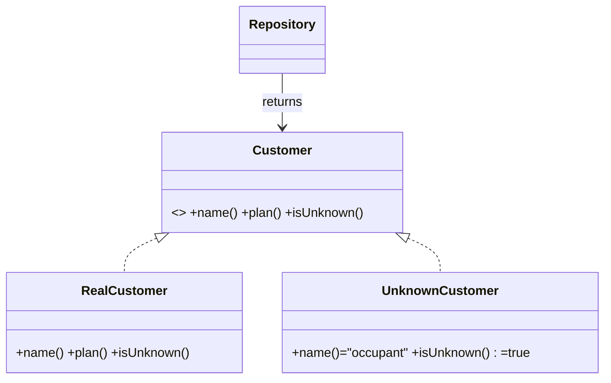
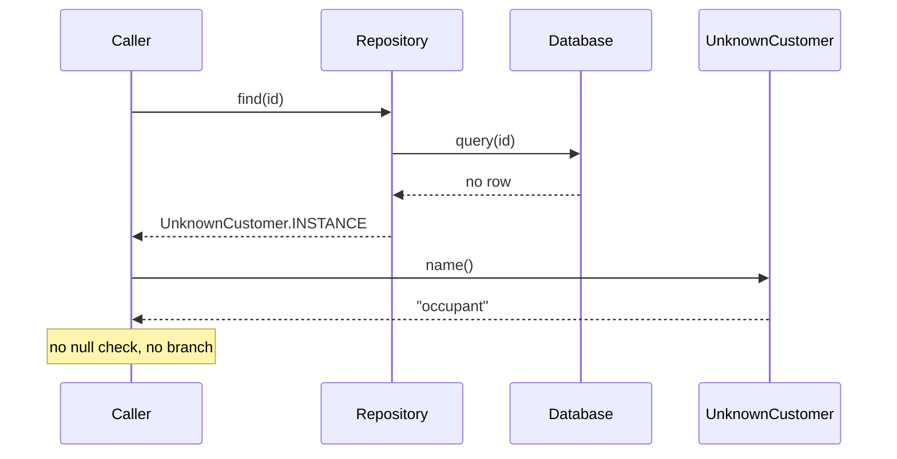

# Special Case — Junior Level

> **Category:** [Control-Flow Patterns](../README.md) — return a dedicated object for a recurring exceptional condition instead of branching for it at every call site.

---

## Table of Contents

1. [Introduction](#introduction)
2. [Prerequisites](#prerequisites)
3. [Glossary](#glossary)
4. [Core Concepts](#core-concepts)
5. [Real-World Analogies](#real-world-analogies)
6. [Mental Models](#mental-models)
7. [Pros & Cons](#pros-cons)
8. [Use Cases](#use-cases)
9. [Code Examples](#code-examples)
10. [Coding Patterns](#coding-patterns)
11. [Clean Code](#clean-code)
12. [Best Practices](#best-practices)
13. [Edge Cases & Pitfalls](#edge-cases-pitfalls)
14. [Common Mistakes](#common-mistakes)
15. [Tricky Points](#tricky-points)
16. [Test Yourself](#test-yourself)
17. [Cheat Sheet](#cheat-sheet)
18. [Summary](#summary)
19. [Further Reading](#further-reading)
20. [Related Topics](#related-topics)
21. [Diagrams](#diagrams)

---

## Introduction

> Focus: **What is it?** and **How to use it?**

**Special Case** (Martin Fowler, *Patterns of Enterprise Application Architecture*) is a coding pattern where you return a **dedicated object** for a particular recurring condition, instead of checking for that condition with an `if` at every place the value is used.

In one sentence: instead of writing `if (customer == null) name = "occupant"` in forty different files, you return an `UnknownCustomer` object once — and *it* answers `getName()` with `"occupant"` everywhere, automatically.

### Why this matters

Imagine a billing system. A customer might be missing, unconfirmed, or deleted. Without Special Case, every screen, report, and email template repeats the same defensive branches:

```java
Customer c = repo.find(id);
String name = (c == null) ? "occupant" : c.getName();
Plan plan   = (c == null) ? Plan.BASIC  : c.getPlan();
boolean tax = (c == null) ? false       : c.isTaxExempt();
```

This branch is copy-pasted everywhere. Miss one spot and you get a `NullPointerException` in production. Special Case moves the branch *into the type system*: the repository returns a real object that already behaves like an "unknown customer," so callers stop branching.

```java
Customer c = repo.find(id);   // returns UnknownCustomer if not found
String name = c.getName();    // "occupant"
Plan plan   = c.getPlan();    // Plan.BASIC
boolean tax = c.isTaxExempt();// false
```

The `if` disappears from every call site because the special object *knows how to behave*.

---

## Prerequisites

- **Required:** Polymorphism and interfaces / subclasses.
- **Required:** The idea of returning a value vs. returning `null`.
- **Helpful:** Familiarity with [Null Object](../03-null-object/junior.md) — Special Case is its generalization.

---

## Glossary

| Term | Definition |
|------|-----------|
| **Special Case** | An object that encapsulates the behavior for one recurring exceptional condition. |
| **Null Object** | A *specific* Special Case where the condition is "absence" (the value is missing). |
| **Sentinel** | A bare magic value (`null`, `-1`, `""`) used to signal a special condition — what Special Case replaces. |
| **Subtype** | The Special Case is usually a subclass / interface implementation of the normal type. |
| **Factory / Repository** | The code that *decides* which object to return — a real one or a special case. |
| **Happy path** | The normal, non-exceptional flow. Special Case keeps it free of condition checks. |

---

## Core Concepts

### 1. A special case is *also* the type it stands in for

`UnknownCustomer` **is a** `Customer`. It satisfies the same interface, so callers can't tell (and don't need to) whether they have a real customer or a special one.

### 2. The special-case behavior lives in *one* object

The rule "an unknown customer is named 'occupant' and pays the basic plan" exists in exactly one place — the `UnknownCustomer` class — not scattered across every caller.

### 3. Something decides *which* object to return

A repository or factory makes the decision: *"no row found → return the `UnknownCustomer` singleton."* Callers receive an object they can use unconditionally.

### 4. Null Object is a subset of Special Case

> Null Object answers "what if there's *nothing*?" Special Case answers "what if there's *this particular kind of something*?" — unknown, pending, deleted, guest, suspended.

You can have several special cases for one type: `UnknownCustomer`, `PendingCustomer`, `DeletedCustomer` — each a different object with different behavior.

---

## Real-World Analogies

| Concept | Analogy |
|---|---|
| **Special Case object** | A "To the occupant" letter — addressed to whoever lives there when you don't know their name. |
| **Multiple special cases** | Hotel guest categories: *registered guest*, *walk-in*, *do-not-disturb*. Staff treat each by a known rule, not by improvising. |
| **The factory deciding** | A receptionist who hands you the right badge: employee, visitor, or contractor. |
| **Null Object ⊂ Special Case** | "No guest in this room" is just one of several room states (occupied, reserved, being cleaned, vacant). |

---

## Mental Models

**The intuition:** *"Don't ask if it's special — hand back something that already behaves correctly for the special case."*

```
        repository.find(id)
                │
        ┌───────┴────────┐
   row found?         no row?
        │                │
        ▼                ▼
  RealCustomer    UnknownCustomer   ← both are Customer
        │                │
        └───────┬────────┘
                ▼
        caller calls c.getName()
        (no if needed)
```

Compare to the sentinel approach:

```
customer = find(id)          // might be null
if customer == null:         // repeated everywhere
    name = "occupant"
else:
    name = customer.name
```

vs. Special Case:

```
customer = find(id)          // always a usable Customer
name = customer.name         // "occupant" if unknown
```

---

## Pros & Cons

| Pros | Cons |
|------|------|
| Removes duplicated `if (special)` branches | Adds a class per special case |
| Eliminates a whole category of `NullPointerException` | Can *hide* a real error that should fail loudly |
| Happy path reads top-to-bottom, no nesting | Callers may not realize they got a special object |
| Each special case's behavior is in one testable place | Equality / serialization need care |
| New special cases plug in without touching callers | Overkill when the case occurs in only one place |

### When to use:
- A condition (missing, unknown, guest, pending) recurs at **many** call sites.
- There is a **sensible default behavior** for that condition.
- You keep getting `null` checks or `-1` checks for the same thing.

### When NOT to use:
- The condition is a genuine error the caller **must** handle (failed payment, auth failure). Prefer [Fail Fast](../02-fail-fast/junior.md).
- The special behavior differs at every call site — there is no single rule to encapsulate.

---

## Use Cases

- **Unknown customer / user** — "occupant," guest pricing, no personalization.
- **Missing product** — out-of-stock placeholder with price `0` and "unavailable" label.
- **Guest / anonymous user** — no permissions, default locale, empty cart.
- **Pending or deleted records** — show a tombstone object instead of crashing.
- **Unknown plan / tier** — falls back to a free-tier object with minimal limits.
- **Unknown currency / locale** — neutral formatting instead of a thrown exception.

---

## Code Examples

### Java — `UnknownCustomer` as a subclass

```java
public class Customer {
    private final String name;
    private final Plan plan;

    public Customer(String name, Plan plan) { this.name = name; this.plan = plan; }

    public String name()       { return name; }
    public Plan plan()         { return plan; }
    public boolean isUnknown() { return false; }
}

// The Special Case
public final class UnknownCustomer extends Customer {
    public static final UnknownCustomer INSTANCE = new UnknownCustomer();

    private UnknownCustomer() { super("occupant", Plan.BASIC); }

    @Override public boolean isUnknown() { return true; }
}

// The repository decides which to return
public class CustomerRepository {
    public Customer find(String id) {
        Row row = db.query(id);
        return (row == null) ? UnknownCustomer.INSTANCE
                             : new Customer(row.name(), row.plan());
    }
}

// Caller — no null check, no special branch
Customer c = repo.find(id);
System.out.println("Bill to: " + c.name());   // "occupant" if unknown
charge(c.plan());                              // Plan.BASIC if unknown
```

**Highlights:**
- `UnknownCustomer` **is a** `Customer`, so it fits everywhere a `Customer` is expected.
- The decision lives in the repository — callers never branch.
- A shared `INSTANCE` is fine because the object is immutable.

---

### Python — subclass / sentinel object

```python
from dataclasses import dataclass

@dataclass(frozen=True)
class Customer:
    name: str
    plan: str

    @property
    def is_unknown(self) -> bool:
        return False

class UnknownCustomer(Customer):
    def __init__(self) -> None:
        super().__init__(name="occupant", plan="BASIC")

    @property
    def is_unknown(self) -> bool:
        return True

UNKNOWN_CUSTOMER = UnknownCustomer()   # shared, immutable

class CustomerRepository:
    def find(self, customer_id: str) -> Customer:
        row = self._db.get(customer_id)
        return UNKNOWN_CUSTOMER if row is None else Customer(row.name, row.plan)

# Caller
c = repo.find(cid)
print(f"Bill to: {c.name}")   # "occupant" if unknown
charge(c.plan)                 # "BASIC" if unknown
```

---

### Go — interface + special type

> **Go note:** Go has no inheritance, so the normal and special types both **implement an interface**. The special type is just another struct.

```go
package billing

type Customer interface {
    Name() string
    Plan() string
    IsUnknown() bool
}

type realCustomer struct {
    name string
    plan string
}

func (c realCustomer) Name() string   { return c.name }
func (c realCustomer) Plan() string   { return c.plan }
func (c realCustomer) IsUnknown() bool { return false }

// The Special Case
type unknownCustomer struct{}

func (unknownCustomer) Name() string    { return "occupant" }
func (unknownCustomer) Plan() string    { return "BASIC" }
func (unknownCustomer) IsUnknown() bool { return true }

var Unknown Customer = unknownCustomer{}   // shared singleton value

func (r *Repo) Find(id string) Customer {
    row, ok := r.db[id]
    if !ok {
        return Unknown
    }
    return realCustomer{name: row.Name, plan: row.Plan}
}
```

```go
// Caller — no nil check
c := repo.Find(id)
fmt.Println("Bill to:", c.Name())  // "occupant" if unknown
charge(c.Plan())                    // "BASIC" if unknown
```

---

## Coding Patterns

### Pattern 1: Singleton special case (stateless)

If the special object holds no per-instance data, share one immutable instance:

```java
public static final UnknownCustomer INSTANCE = new UnknownCustomer();
```

One allocation, no garbage, safe to share across threads.

### Pattern 2: Repository returns the special case

The decision belongs in the boundary code (repository, factory, gateway) — not in business logic:

```python
return UNKNOWN_CUSTOMER if row is None else Customer(...)
```

### Pattern 3: `isUnknown()` escape hatch

Most callers don't branch, but a few legitimately need to (e.g., "don't send marketing email to unknown customers"). Provide a query method so they can:

```go
if c.IsUnknown() {
    return   // skip the email
}
```



---

## Clean Code

### Naming

| ❌ Bad | ✅ Good |
|---|---|
| `Customer2`, `FakeCustomer` | `UnknownCustomer`, `GuestUser`, `MissingProduct` |
| `NullCust` | `UnknownCustomer` (name the *case*, not "null") |
| `getDefault()` | `UnknownCustomer.INSTANCE` / a clear factory method |

Name the **condition** the object represents (`Unknown`, `Pending`, `Deleted`, `Guest`), not the mechanism.

### Keep behavior, not data, in the special case

The special object should answer questions sensibly (`name()`, `plan()`), not expose raw `null` fields that callers must still check.

---

## Best Practices

1. **Make the special case a real subtype** of the normal type — same interface.
2. **Make it immutable** and share one instance when it has no state.
3. **Decide once, in the factory/repository.** Don't sprinkle the decision.
4. **Provide an `isUnknown()`-style query** for the rare caller that must distinguish.
5. **Give sensible, documented defaults** — `"occupant"`, basic plan, empty list.
6. **Don't use it to swallow real errors.** Absence of a config file is an error; absence of an optional nickname is a special case.

---

## Edge Cases & Pitfalls

- **Hiding a bug.** If "customer not found" actually means a broken foreign key, returning `UnknownCustomer` silently masks corruption. Decide deliberately: special case *or* [fail fast](../02-fail-fast/junior.md).
- **Equality surprises.** Is `UnknownCustomer == UnknownCustomer`? Usually yes (singleton), but two `MissingProduct` objects for different IDs may need to compare unequal.
- **Serialization.** Sending an `UnknownCustomer` to JSON might emit `{"name":"occupant"}` and a consumer treats it as a real person. Mark it (`"unknown": true`) or don't serialize it.
- **Write paths.** A special case is fine for *reading*. Calling `unknownCustomer.changeEmail(...)` is nonsense — make writes no-ops or throw.

---

## Common Mistakes

1. **Returning `null` *and* a special case** in different branches — pick one contract.
2. **Putting the special-case rule in callers** — defeats the whole purpose.
3. **Naming it after the mechanism** (`NullCustomer`) instead of the meaning (`UnknownCustomer`).
4. **Mutable special case** shared as a singleton — one caller mutates it for everyone.
5. **Using it where the caller genuinely needs to know** something failed (auth, payment).

---

## Tricky Points

- **Special Case vs Null Object.** Null Object is the *absence* case. Special Case generalizes to *any* recurring case: unknown, pending, deleted, guest. Null Object ⊂ Special Case.
- **It's not error handling.** It encapsulates a *valid, expected* condition with a sensible default — not an exceptional failure.
- **One type can have several.** `UnknownCustomer`, `PendingCustomer`, `DeletedCustomer` can all implement `Customer`.

---

## Test Yourself

1. What problem does Special Case solve?
2. How is Special Case related to Null Object?
3. Who decides whether to return a real object or the special case?
4. When should you fail fast instead of returning a special case?
5. Why make the special case immutable and shareable?

<details><summary>Answers</summary>

1. It removes duplicated `if (special) {...}` branches by returning an object that already behaves correctly for that condition.
2. Null Object is the special case where the condition is "the value is absent." Special Case generalizes it to any recurring condition (unknown, pending, guest, deleted).
3. A boundary object — typically a repository or factory — makes the decision once, so callers don't branch.
4. When the condition is a real error the caller must handle (auth failure, missing required config, corrupt data), not a valid expected state.
5. It carries no per-instance state, so one shared immutable instance avoids allocation and is safe across threads.

</details>

---

## Cheat Sheet

```java
// Java
class UnknownCustomer extends Customer { /* sensible defaults */ }
Customer c = repo.find(id);   // returns UnknownCustomer if absent
```

```python
# Python
UNKNOWN = UnknownCustomer()
c = repo.find(id)             # returns UNKNOWN if absent
```

```go
// Go
var Unknown Customer = unknownCustomer{}
c := repo.Find(id)            // returns Unknown if absent
```

---

## Summary

- Special Case = a dedicated object encapsulating one recurring exceptional condition.
- It's a real subtype of the normal type, so the happy path needs no `if`.
- A factory/repository decides which object to return — once.
- **Null Object is the special case of "absence"; Special Case generalizes it.**
- Use it for valid expected conditions with sensible defaults — not to swallow real errors.

---

## Further Reading

- Martin Fowler, *Patterns of Enterprise Application Architecture* — "Special Case"
- [martinfowler.com/eaaCatalog/specialCase.html](https://martinfowler.com/eaaCatalog/specialCase.html)
- *Refactoring* (Fowler) — "Introduce Special Case" (formerly "Introduce Null Object")

---

## Related Topics

- **Next:** [Special Case — Middle](middle.md)
- **Closely related:** [Null Object](../03-null-object/junior.md) — the "absence" special case.
- **The problem it replaces:** [Sentinel & Special Values](../../03-resource-and-type-safety/03-sentinel-and-special-values/junior.md).
- **When to prefer the alternative:** [Fail Fast](../02-fail-fast/junior.md).

---

## Diagrams



[← Null Object](../03-null-object/junior.md) · [Control Flow](../README.md) · [Roadmap](../../../README.md) · **Next:** [Special Case — Middle](middle.md)
