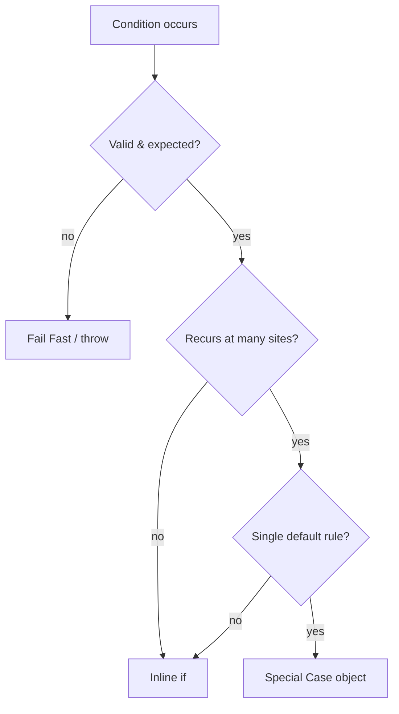
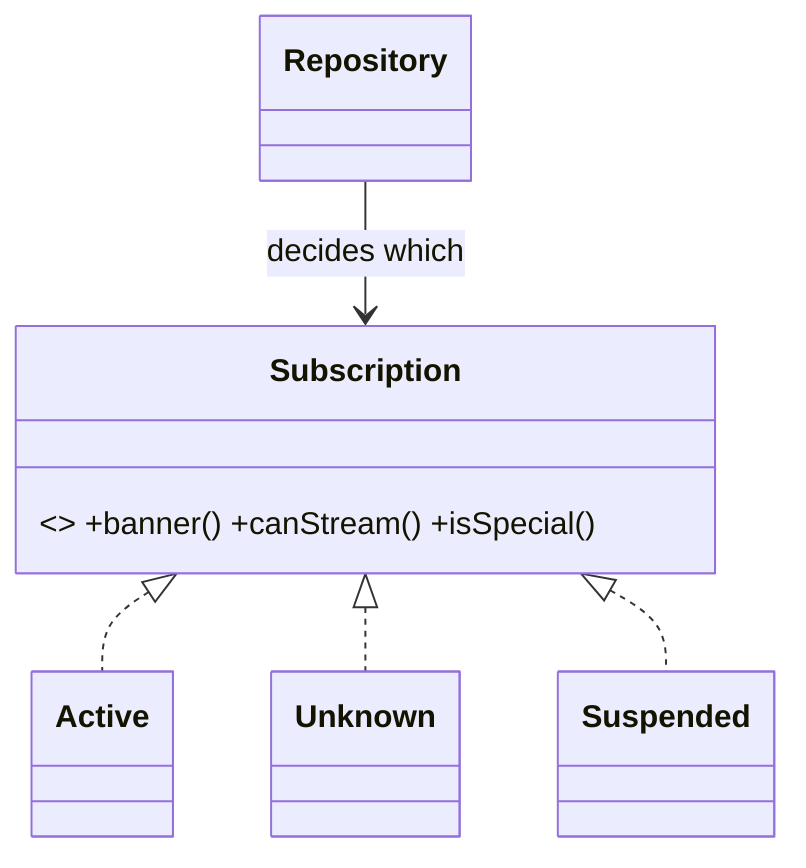

# Special Case — Middle Level

> **Category:** [Control-Flow Patterns](../README.md) — return a dedicated object for a recurring exceptional condition instead of branching for it at every call site.
> **Prerequisite:** [Junior](junior.md)
> **Focus:** **Why** and **When**

---

## Table of Contents

1. [Introduction](#introduction)
2. [When to Use Special Case](#when-to-use-special-case)
3. [When NOT to Use Special Case](#when-not-to-use-special-case)
4. [Real-World Cases](#real-world-cases)
5. [Production-Grade Code](#production-grade-code)
6. [Trade-offs](#trade-offs)
7. [Alternatives](#alternatives)
8. [Refactoring Toward Special Case](#refactoring-toward-special-case)
9. [Edge Cases](#edge-cases)
10. [Tricky Points](#tricky-points)
11. [Best Practices](#best-practices)
12. [Summary](#summary)
13. [Diagrams](#diagrams)

---

## Introduction

> Focus: **Why** and **When**

Special Case earns its keep when **one condition is checked in many places** and there is a **single sensible rule** for how that condition should behave. The middle-level skill is recognizing that threshold and, crucially, distinguishing a *special case* (a valid expected state) from an *error* (something the caller must be forced to handle).

The decision tree:

- **Condition checked once, simple default** → an inline `if` or [Null Object](../03-null-object/junior.md) is fine.
- **Condition checked everywhere, one behavior rule** → **Special Case.**
- **Several related conditions** (unknown / pending / deleted) → **multiple Special Cases** behind one interface.
- **Condition is a genuine failure** → [Fail Fast](../02-fail-fast/junior.md), not Special Case.

---

## When to Use Special Case

Use Special Case when **all** of:

1. **The condition recurs** at 3+ call sites (DRY pressure on the branch).
2. **There is a coherent default behavior** the special object can implement.
3. **The condition is valid and expected** — not a bug, not a security failure.
4. **Callers benefit from a uniform interface** — they shouldn't care which object they got.

### Strong-fit examples

- A reporting layer that renders rows for users who may be unknown, guest, or deactivated.
- A pricing engine where a missing product means "show as unavailable," not crash.
- A permissions layer where an anonymous request maps to a `GuestUser` with empty rights.

---

## When NOT to Use Special Case

| Symptom | Better choice |
|---|---|
| "Customer not found" must trigger a 404 | Return an error / `Optional` and let the caller decide |
| Payment failed | [Fail Fast](../02-fail-fast/junior.md) — surface it loudly |
| The special behavior differs per call site | Keep the branch local; there's no single rule to extract |
| Condition occurs in exactly one method | Inline `if`; a class is overkill |
| You'd have to lie in a write path | Don't model writes as a special case |

---

## Real-World Cases

### 1. Unknown user in a templating layer

A web view renders a greeting, an avatar, and a plan badge. Anonymous visitors are common. A `GuestUser` special case lets every template render uniformly:

```java
User u = session.user();          // GuestUser if not logged in
render(u.displayName(), u.avatarUrl(), u.planBadge());
// GuestUser → "Guest", default avatar, no badge
```

### 2. Missing product in a cart

```python
product = catalog.find(sku)       # MissingProduct if SKU is gone
line_total = product.price * qty  # 0 for MissingProduct
label = product.name              # "Unavailable item"
```

The cart still renders; the line shows as unavailable instead of throwing mid-render.

### 3. Multiple special cases for one type

A subscription can be `Active`, or one of several special states:

```go
sub := repo.Find(userID)   // returns one of: active, Unknown, Expired, Suspended
banner := sub.Banner()     // each special case renders its own banner text
canStream := sub.CanStream()
```

Each special case answers `Banner()` and `CanStream()` its own way; the view never branches.

---

## Production-Grade Code

### Java — multiple special cases behind one interface

```java
public interface Subscription {
    String banner();
    boolean canStream();
    boolean isSpecial();
}

public final class ActiveSubscription implements Subscription {
    private final LocalDate renews;
    public ActiveSubscription(LocalDate renews) { this.renews = renews; }
    public String banner()      { return "Renews " + renews; }
    public boolean canStream()  { return true; }
    public boolean isSpecial()  { return false; }
}

public final class UnknownSubscription implements Subscription {
    public static final UnknownSubscription INSTANCE = new UnknownSubscription();
    private UnknownSubscription() {}
    public String banner()      { return "Subscribe to start watching"; }
    public boolean canStream()  { return false; }
    public boolean isSpecial()  { return true; }
}

public final class SuspendedSubscription implements Subscription {
    private final String reason;
    public SuspendedSubscription(String reason) { this.reason = reason; }
    public String banner()      { return "Account on hold: " + reason; }
    public boolean canStream()  { return false; }
    public boolean isSpecial()  { return true; }
}

// Repository decides
public Subscription find(String userId) {
    Row r = db.query(userId);
    if (r == null)            return UnknownSubscription.INSTANCE;
    if (r.status() == HOLD)   return new SuspendedSubscription(r.holdReason());
    return new ActiveSubscription(r.renewsOn());
}
```

The view calls `sub.canStream()` and `sub.banner()` with zero `if`s. New special cases (e.g., `TrialSubscription`) plug in without touching any caller.

### Python — special cases with a shared protocol

```python
from typing import Protocol

class Subscription(Protocol):
    def banner(self) -> str: ...
    def can_stream(self) -> bool: ...
    def is_special(self) -> bool: ...

class ActiveSubscription:
    def __init__(self, renews): self.renews = renews
    def banner(self): return f"Renews {self.renews}"
    def can_stream(self): return True
    def is_special(self): return False

class UnknownSubscription:
    def banner(self): return "Subscribe to start watching"
    def can_stream(self): return False
    def is_special(self): return True

UNKNOWN_SUBSCRIPTION = UnknownSubscription()

def find(user_id: str) -> Subscription:
    row = db.get(user_id)
    if row is None:           return UNKNOWN_SUBSCRIPTION
    if row.status == "HOLD":  return SuspendedSubscription(row.hold_reason)
    return ActiveSubscription(row.renews_on)
```

### Go — interface with multiple implementations

```go
type Subscription interface {
    Banner() string
    CanStream() bool
    IsSpecial() bool
}

type active struct{ renews time.Time }

func (a active) Banner() string  { return "Renews " + a.renews.Format("Jan 2") }
func (a active) CanStream() bool { return true }
func (a active) IsSpecial() bool { return false }

type unknown struct{}

func (unknown) Banner() string  { return "Subscribe to start watching" }
func (unknown) CanStream() bool { return false }
func (unknown) IsSpecial() bool { return true }

var Unknown Subscription = unknown{}

func (r *Repo) Find(userID string) Subscription {
    row, ok := r.db[userID]
    switch {
    case !ok:
        return Unknown
    case row.Status == StatusHold:
        return suspended{reason: row.HoldReason}
    default:
        return active{renews: row.RenewsOn}
    }
}
```

---

## Trade-offs

| Dimension | Special Case | Inline `if` | `Optional` / error | Sentinel (`null`/`-1`) |
|---|---|---|---|---|
| Removes duplicated branches | Yes | No | Partly | No |
| Forces caller to handle | No | No | Yes | No (easy to forget) |
| Hides real errors | Risk | No | No | Risk |
| Extra classes | Yes | No | No | No |
| Uniform call site | Yes | No | No | No |
| Good for read paths | Yes | — | Yes | — |

---

## Alternatives

### vs Inline `if`

If the condition appears once, an inline check is clearer than a new class. Special Case pays off with **repetition**.

### vs `Optional` / Result type

`Optional<Customer>` forces the caller to handle absence — good when absence is *meaningful* to the caller. Special Case *removes* that obligation by supplying a default. Choose based on whether the caller **should** be forced to decide.

### vs Sentinel values

Returning `null` or `-1` is the anti-pattern Special Case fixes: sentinels leak into logic and every caller must remember to check. See [Sentinel & Special Values](../../03-resource-and-type-safety/03-sentinel-and-special-values/junior.md).

### vs Exceptions

Throwing is right when the condition is *exceptional and unrecoverable here*. Special Case is right when the condition is *expected and has a sane default*. "User not logged in" is a special case; "database unreachable" is an exception.

---

## Refactoring Toward Special Case

Given duplicated branches:

```java
Customer c = repo.find(id);
String name = (c == null) ? "occupant" : c.name();
Plan plan   = (c == null) ? Plan.BASIC  : c.plan();
```

**Step 1 — Create the special-case subtype:**

```java
public final class UnknownCustomer extends Customer {
    public static final UnknownCustomer INSTANCE = new UnknownCustomer();
    private UnknownCustomer() { super("occupant", Plan.BASIC); }
    @Override public boolean isUnknown() { return true; }
}
```

**Step 2 — Move the decision into the repository:**

```java
public Customer find(String id) {
    Row r = db.query(id);
    return (r == null) ? UnknownCustomer.INSTANCE : new Customer(r.name(), r.plan());
}
```

**Step 3 — Delete the branches at every call site:**

```java
Customer c = repo.find(id);
String name = c.name();   // "occupant" if unknown
Plan plan   = c.plan();   // BASIC if unknown
```

**Step 4 — Keep an `isUnknown()` for the few callers that truly need it** (e.g., suppress marketing email).

This mirrors Fowler's **Introduce Special Case** refactoring.

---

## Edge Cases

### 1. Write operations

A special case is built for *reads*. `unknownCustomer.changeEmail(...)` is meaningless. Make writes throw or no-op deliberately, and document which.

### 2. Identity and equality

A stateless special case is a singleton, so `==` works. A *parameterized* special case (`MissingProduct(sku)`) needs value equality if two different missing SKUs should compare unequal.

### 3. Logging and analytics

Special cases can skew metrics ("80% of customers are named 'occupant'"). Tag them so dashboards can exclude or count them separately.

### 4. The condition changes meaning

If "unknown customer" later splits into "never registered" vs "deleted," you may need two special cases. Design the interface so adding one doesn't touch callers.

---

## Tricky Points

- **Special Case is not a license to swallow errors.** The hardest judgment is "default vs fail fast." When in doubt about correctness, fail fast.
- **The decision must be centralized.** If two repositories return different special cases for the same condition, you've duplicated the rule.
- **Read vs write asymmetry.** Reads get clean defaults; writes need explicit handling.
- **Combine with `Optional` at the boundary.** Some teams have the repository return `Optional`, then a thin layer maps `empty → UnknownCustomer`, keeping both contracts available.

---

## Best Practices

1. **One interface, many implementations** — real plus each special case.
2. **Centralize the decision** in a repository/factory.
3. **Name the condition**, not the mechanism (`GuestUser`, not `NullUser`).
4. **Immutable + shared** for stateless special cases.
5. **Provide a query method** (`isSpecial()`/`isUnknown()`) for the rare caller that must distinguish.
6. **Be explicit about writes** — throw or no-op, documented.
7. **Don't use it for real errors** — that's [Fail Fast](../02-fail-fast/junior.md)'s job.

---

## Summary

- Use Special Case when a valid condition recurs across call sites and has a single sensible default.
- Model real plus special cases behind one interface; centralize the decision.
- Multiple special cases (unknown / pending / suspended) can coexist for one type.
- Choose `Optional`/exceptions when the caller *must* handle the condition; choose Special Case when a default is correct.
- Never use it to hide a genuine error.

---

## Diagrams

### Decision: special case vs alternatives



### Multiple special cases behind one interface



[← Junior](junior.md) · [Control Flow](../README.md) · [Roadmap](../../../README.md) · **Next:** [Senior](senior.md)
