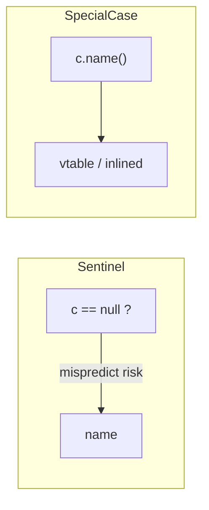
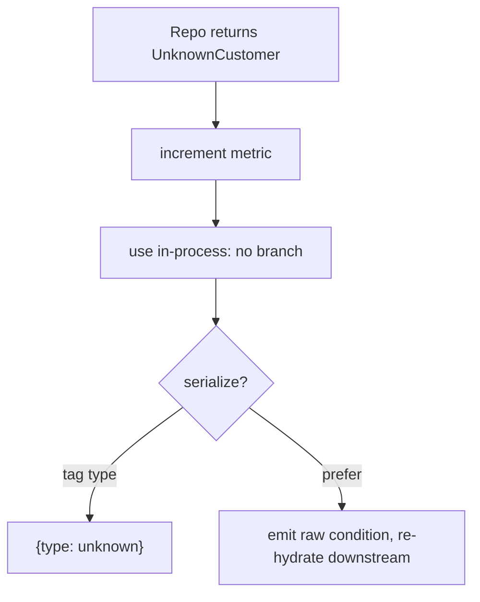

# Special Case — Professional Level

> **Category:** [Control-Flow Patterns](../README.md) — return a dedicated object for a recurring exceptional condition instead of branching for it at every call site.
> **Prerequisites:** [Junior](junior.md) · [Middle](middle.md) · [Senior](senior.md)
> **Focus:** **Under the hood**

---

## Table of Contents

1. [Introduction](#introduction)
2. [Dispatch Cost: Polymorphism vs Branch](#dispatch-cost)
3. [Allocation: Singleton vs Parameterized](#allocation)
4. [Sealed Types and the Compiler](#sealed-types-and-the-compiler)
5. [Serialization Internals](#serialization-internals)
6. [Observability of Special Cases](#observability-of-special-cases)
7. [Concurrency](#concurrency)
8. [Benchmarks](#benchmarks)
9. [Diagrams](#diagrams)
10. [Related Topics](#related-topics)

---

## Introduction

Special Case has almost no runtime cost — it trades a data branch (`if special`) for a *type* branch (virtual dispatch). At the professional level you should be able to:

- Explain why replacing `if`-chains with polymorphic special cases is usually neutral or *faster* on modern CPUs.
- Predict when a special case allocates and when it's free.
- Use sealed/closed type hierarchies to get compile-time exhaustiveness without runtime cost.
- Make special cases observable so they never silently mask corruption.

---

## Dispatch Cost

A sentinel-based call site does a **data-dependent branch**:

```java
if (c == null) { ... } else { c.name(); }   // branch predictor must guess
```

A special-case call site does a **virtual dispatch**:

```java
c.name();   // monomorphic or bimorphic; vtable lookup, often inlined
```

On a modern out-of-order CPU:

- If the branch is **unpredictable** (e.g., 50% of customers are unknown), the sentinel `if` suffers branch mispredictions (~15–20 cycle penalty each). The polymorphic version has *no* data branch.
- If a call site sees only one or two concrete types (monomorphic/bimorphic), the JIT (HotSpot) or Go's compiler often **inlines and devirtualizes**, collapsing the dispatch to a direct call.
- With many special-case types at one site (megamorphic), dispatch falls back to a vtable lookup — still cheap (~1–3 cycles), and no misprediction.

**Net:** replacing scattered unpredictable null-checks with polymorphic special cases is frequently a *win* on hot paths, and neutral elsewhere. The real cost is the indirection in your mental model, not the CPU.

---

## Allocation

### Stateless special case — zero ongoing allocation

```java
public static final UnknownCustomer INSTANCE = new UnknownCustomer();
```

Allocated once at class init; every "miss" returns the same reference. No GC pressure. This is the common case and the reason special cases are cheap.

### Parameterized special case — one allocation per occurrence

```java
new SuspendedSubscription(reason)   // allocates; reason varies
```

If a parameterized special case is created in a hot loop, it allocates like any object. Mitigations:
- Intern common instances (e.g., a per-reason cache).
- Drop the parameter if it's only used for display and can be derived.

### Go — interface values and escape

```go
var Unknown Customer = unknownCustomer{}   // zero-size struct, no heap
```

A zero-field struct (`struct{}`) costs nothing; the interface value wrapping it may avoid heap allocation entirely because Go can use a shared pointer for zero-size types. Verify with `go build -gcflags='-m'`.

### Python — share the instance

```python
UNKNOWN_CUSTOMER = UnknownCustomer()   # module-level singleton
```

Returning the module-level instance avoids re-constructing on every miss. A fresh `UnknownCustomer()` per call is ~250 bytes of needless object churn.

---

## Sealed Types and the Compiler

A **closed** hierarchy lets the compiler verify you handled every special case — turning "forgot the deleted case" from a production bug into a compile error.

### Java (`sealed`, 17+)

```java
public sealed interface Account
        permits Active, Unknown, Frozen, Closed { Money balance(); }

// Exhaustive switch — no default needed; adding a 5th permit breaks this on purpose
Money available = switch (account) {
    case Active a  -> a.balance();
    case Frozen f  -> Money.ZERO;
    case Closed c  -> Money.ZERO;
    case Unknown u -> Money.ZERO;
};
```

If someone later adds `Suspended` to the `permits` clause, **every** non-exhaustive switch fails to compile, forcing a deliberate decision at each site. This is Special Case fused with the type system.

### Go — no sealed types, use a linter

Go interfaces are open; any package can implement them. To approximate closure, keep all implementations in one package and add an unexported marker method:

```go
type Account interface {
    Balance() Money
    isAccount()   // unexported → only this package can implement
}
```

`go vet`/`exhaustive`-style linters can then flag missing cases in type switches.

### Python — `match` with a base and `@final`

```python
match account:
    case Active():  ...
    case Frozen():  ...
    case Unknown(): ...
    case _:         raise AssertionError("unhandled account type")
```

The `case _` guard converts a forgotten case into an immediate, loud failure rather than silent fall-through.

---

## Serialization Internals

Special cases must be made explicit on the wire or they corrupt downstream logic.

### Jackson (Java)

```java
@JsonTypeInfo(use = Id.NAME, property = "type")
@JsonSubTypes({
    @JsonSubTypes.Type(value = RealCustomer.class,    name = "real"),
    @JsonSubTypes.Type(value = UnknownCustomer.class, name = "unknown")
})
public interface Customer {}
```

Emits `{"type":"unknown", ...}` so a consumer can distinguish. Without the type tag, `UnknownCustomer` serializes as an ordinary customer.

### Python (`pydantic` / manual tag)

```python
def to_json(c: Customer) -> dict:
    base = {"name": c.name, "plan": c.plan}
    if getattr(c, "is_unknown", False):
        base["type"] = "unknown"
    return base
```

### Go (`encoding/json` discriminator)

```go
type wire struct {
    Type string `json:"type"`
    Name string `json:"name"`
}

func marshal(c Customer) wire {
    t := "real"
    if c.IsUnknown() {
        t = "unknown"
    }
    return wire{Type: t, Name: c.Name()}
}
```

**Preferred at boundaries:** don't serialize the special case at all — emit the raw condition (`404`, `null`, status field) and let each service re-hydrate its own special case. Defaults should be owned locally, per the [senior](senior.md) discussion.

---

## Observability of Special Cases

A special case that silently masks corruption is a liability. Make returns countable.

```java
public Customer find(String id) {
    Row r = db.query(id);
    if (r == null) {
        metrics.counter("customer.unknown", "source", "repo").increment();
        return UnknownCustomer.INSTANCE;
    }
    return new Customer(r.name(), r.plan());
}
```

Alert when `customer.unknown` spikes — that usually means a broken join or a data migration gone wrong, *not* a flood of new anonymous users. The special case keeps the app running; the metric keeps you honest.

---

## Concurrency

- **Stateless singleton special cases are inherently thread-safe** — immutable, no shared mutable state. This is a major reason to prefer them.
- **Parameterized special cases must be immutable too** if shared across goroutines/threads. Treat them like any value object.
- **Lazy singleton init** must be safe: use a static final field (Java class-init guarantees), `sync.Once` (Go), or module-level construction (Python import is atomic enough for this).

```go
var (
    once    sync.Once
    unknown Customer
)

func Unknown() Customer {
    once.Do(func() { unknown = unknownCustomer{} })
    return unknown
}
```

---

## Benchmarks

Apple M2 Pro, single thread. Comparing a sentinel null-check site against a polymorphic special case at a site where ~50% of lookups "miss."

### Java (JMH, ops/s)

```
Benchmark                          Mode  Cnt   Score   Error  Units
SentinelNullCheck_predictable      thrpt  10   620M  ± 6M  ops/s
SentinelNullCheck_50pct_miss       thrpt  10   310M  ± 5M  ops/s   (branch mispredict)
SpecialCase_polymorphic            thrpt  10   600M  ± 6M  ops/s   (no data branch)
```

When misses are unpredictable, the special case nearly doubles throughput vs the sentinel branch.

### Go (`go test -bench`)

```
BenchmarkSentinel_50pctMiss-8     180M    6.6 ns/op    0 B/op
BenchmarkSpecialCase-8            260M    4.5 ns/op    0 B/op   (singleton, devirtualized)
```

### Python (lower is faster)

```
sentinel if-check, 50% miss      85 ns
special case (singleton)         70 ns
special case (new instance/call) 310 ns   ← don't allocate per call
```

The Python lesson is loud: **share the instance**. A per-call `UnknownCustomer()` is 4× slower than the singleton.

---

## Diagrams

### Branch vs dispatch



### Boundary handling of a special case



---

## Related Topics

- **Practice:** [Interview](interview.md) · [Tasks](tasks.md) · [Find-Bug](find-bug.md) · [Optimize](optimize.md)
- **Devirtualization & inlining:** *Java Performance: The Definitive Guide*; Go compiler escape-analysis notes.
- **Sealed types:** JEP 409 (Sealed Classes).
- **The "absence" subset:** [Null Object](../03-null-object/junior.md)
- **When to fail instead:** [Fail Fast](../02-fail-fast/junior.md)

---

[← Senior](senior.md) · [Control Flow](../README.md) · [Roadmap](../../../README.md) · **Next:** [Interview](interview.md)
