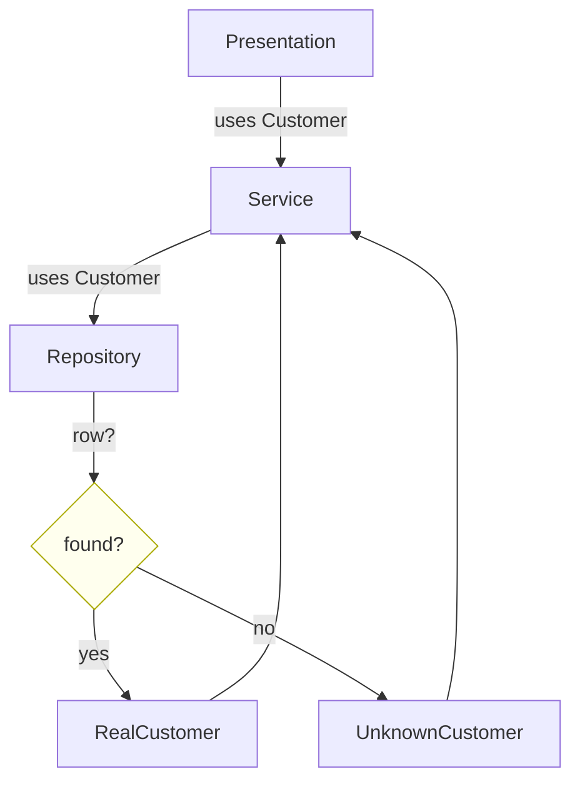
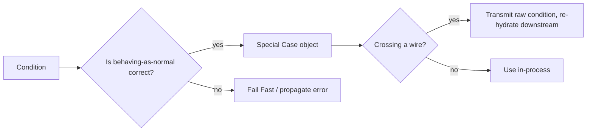

# Special Case — Senior Level

> **Category:** [Control-Flow Patterns](../README.md) — return a dedicated object for a recurring exceptional condition instead of branching for it at every call site.
> **Prerequisites:** [Junior](junior.md) · [Middle](middle.md)
> **Focus:** **Architecture** and **trade-offs**

---

## Table of Contents

1. [Introduction](#introduction)
2. [Architectural Placement](#architectural-placement)
3. [Special Case vs Fail Fast — the Core Decision](#special-case-vs-fail-fast)
4. [Composing Multiple Special Cases](#composing-multiple-special-cases)
5. [Serialization & API Boundaries](#serialization-api-boundaries)
6. [Testability](#testability)
7. [Equality, Identity, and Caching](#equality-identity-and-caching)
8. [Code Examples — Advanced](#code-examples-advanced)
9. [Liabilities](#liabilities)
10. [Migration Patterns](#migration-patterns)
11. [Diagrams](#diagrams)
12. [Related Topics](#related-topics)

---

## Introduction

> Focus: **architecture** and **trade-offs**

At the senior level, Special Case is a **boundary-design decision**, not a local code trick. The question is no longer "how do I avoid this `if`" but "where in the architecture does a condition stop being an error and become a first-class, defaulted value — and who is allowed to make that call?"

Senior decisions:
- Is this condition a **special case** (defaulted, swallowed) or a **failure** (propagated, fatal)? This is the single most consequential choice.
- At which **layer** does the decision happen — repository, service, or presentation?
- How do special cases cross **serialization boundaries** without lying to downstream consumers?
- How do you keep the set of special cases **open for extension** without forcing caller changes?

---

## Architectural Placement

Special cases belong at the **lowest layer that can correctly decide** the default — usually the repository or an anti-corruption layer, never the UI.

```
┌────────────┐   needs Customer, never branches
│ Presentation│
└──────┬─────┘
       │ Customer (real or special)
┌──────┴─────┐   business rules, still no branch
│  Service    │
└──────┬─────┘
       │ Customer (real or special)
┌──────┴─────┐   ← decision lives HERE
│ Repository  │   row? → real ; no row → UnknownCustomer
└──────┬─────┘
       │
┌──────┴─────┐
│  Database   │
└────────────┘
```

If the presentation layer decides "no customer → occupant," the rule is duplicated per view. Push it down so every layer above receives an already-correct object.

**Anti-corruption layer.** When integrating an external system that returns nulls/sentinels, the ACL is the ideal place to translate them into special cases, so your domain never sees the foreign system's null contract.

---

## Special Case vs Fail Fast

This is the decision that separates good use from abuse. A special case **silently substitutes a default**; that is exactly wrong when the condition signals corruption, a security boundary, or a programming error.

| Condition | Special Case? | Why |
|---|---|---|
| Anonymous visitor → `GuestUser` | ✅ | Expected, sane default (no permissions) |
| SKU removed from catalog → `MissingProduct` | ✅ | Expected; show "unavailable" |
| Customer row missing **but referenced by an order** | ❌ | Referential integrity broken — [fail fast](../02-fail-fast/junior.md) |
| Auth token absent on a protected route | ❌ | Security decision — must be explicit |
| Config file missing at startup | ❌ | Cannot run; crash loudly |
| Currency code unknown in a *display* context | ✅ (maybe) | Neutral formatting beats a crash on a dashboard |
| Currency code unknown when *moving money* | ❌ | Wrong currency = financial bug |

**Heuristic:** a special case is appropriate only when *behaving as if the condition were normal* produces a correct outcome. If the safe behavior is "stop," it is not a special case.

> The same condition can be a special case in one context and an error in another. "Unknown currency" is fine on a read-only dashboard and catastrophic in a payment. This is why the *decision belongs near the use*, not globally.

---

## Composing Multiple Special Cases

A mature domain often has a small algebra of special cases for one type. Keep them behind one interface and make the set extensible.

```java
sealed interface Account permits RealAccount, UnknownAccount, FrozenAccount, ClosedAccount {
    Money balance();
    boolean canWithdraw();
    String statusLabel();
}
```

`sealed` (Java 17+) gives you **exhaustive switches** when a caller genuinely must distinguish, while still defaulting for callers that don't:

```java
String cta = switch (account) {
    case RealAccount a    -> "Withdraw";
    case FrozenAccount f  -> "Contact support";
    case ClosedAccount c  -> "Reopen account";
    case UnknownAccount u -> "Sign up";
};
```

Most callers ignore the type and just call `account.canWithdraw()`. The few that must branch get compiler-checked exhaustiveness. This pairs Special Case with [Type-Safe Enums](../../03-resource-and-type-safety/02-type-safe-enums/junior.md) thinking — illegal "forgot a case" becomes a compile error.

---

## Serialization & API Boundaries

A special case is honest *inside* your process. Across a wire it can lie.

Serializing `UnknownCustomer` naively yields `{"name":"occupant","plan":"BASIC"}` — a downstream service can't tell it apart from a real customer named "occupant." Three remedies:

1. **Tag it explicitly.**
   ```json
   { "name": "occupant", "plan": "BASIC", "known": false }
   ```
2. **Don't serialize defaults; serialize the condition.** Return `404` or `{"customer": null}` and let the *consumer* re-apply its own special case. Special cases should usually be **process-local**, re-created at each boundary.
3. **Use a discriminated union** in the schema (e.g., `oneOf` in OpenAPI) so the type is explicit on the wire.

> Rule of thumb: special cases are an *in-memory ergonomics* pattern. At a serialization boundary, prefer to transmit the raw condition (absence, status code) and let the receiver decide. Re-hydrating a special case downstream keeps each service's defaults under its own control.

---

## Testability

Special cases are highly testable precisely because the behavior is isolated in one object.

### 1. Test the special case in isolation

```java
@Test
void unknownCustomerBillsToOccupant() {
    Customer c = UnknownCustomer.INSTANCE;
    assertEquals("occupant", c.name());
    assertEquals(Plan.BASIC, c.plan());
    assertTrue(c.isUnknown());
}
```

### 2. Test that the factory returns it

```java
@Test
void missingRowYieldsUnknown() {
    when(db.query("x")).thenReturn(null);
    assertSame(UnknownCustomer.INSTANCE, repo.find("x"));
}
```

### 3. Test that callers don't special-case it

```python
def test_invoice_renders_for_unknown_customer():
    invoice = render_invoice(UNKNOWN_CUSTOMER, items=[...])
    assert "occupant" in invoice          # no crash, no branch needed
```

Because the special case is a value, you can also use it as a clean **test fixture** — no mocking of repositories required to exercise the "unknown" path.

---

## Equality, Identity, and Caching

- **Stateless special case** → singleton; identity equality (`==`, `is`) is correct and cheapest.
- **Parameterized special case** (`MissingProduct(sku)`) → implement **value equality** so two missing-but-distinct SKUs compare unequal, or callers using them as map keys will collide.
- **Caching.** If you cache repository results, ensure the cache stores special cases too — otherwise a missing row re-queries the DB on every access (a hidden N+1). Conversely, ensure a cached special case is *invalidated* when the real row later appears.

```go
// Caching a special case so a missing key doesn't re-hit the DB every call
func (r *Repo) Find(id string) Customer {
    if c, ok := r.cache[id]; ok {
        return c           // may be Unknown — that's fine, it's a valid value
    }
    c := r.load(id)        // returns Unknown on miss
    r.cache[id] = c
    return c
}
```

---

## Code Examples — Advanced

### Go — special case with explicit boundary translation (ACL)

```go
// External vendor returns (nil, nil) for "not found" — a sentinel contract.
// The anti-corruption layer turns it into our domain's special case.
func (acl *VendorACL) Customer(id string) domain.Customer {
    raw, err := acl.vendor.Get(id)
    if err != nil {
        // genuine failure — do NOT special-case; propagate
        panic(fmt.Errorf("vendor unreachable: %w", err))
    }
    if raw == nil {
        return domain.Unknown    // valid "not found" → special case
    }
    return domain.NewCustomer(raw.Name, raw.Plan)
}
```

Note the deliberate split: a *transport error* fails fast; a *missing record* becomes a special case. Conflating them is the classic bug.

### Python — special case that no-ops writes

```python
class UnknownCustomer:
    name = "occupant"
    plan = "BASIC"
    is_unknown = True

    def change_email(self, _new: str) -> None:
        # A write against an unknown customer is meaningless; refuse, don't pretend.
        raise PermissionError("cannot modify an unknown customer")

    def add_credit(self, _amount: float) -> None:
        raise PermissionError("cannot credit an unknown customer")
```

Reads default cleanly; writes refuse loudly. This keeps the read ergonomics without silently dropping a mutation.

### Java — special case behind a `sealed` interface with exhaustive handling

```java
public sealed interface Shipment
        permits Pending, InTransit, Delivered, Unknown {
    String eta();
}

public record Unknown() implements Shipment {
    public String eta() { return "No tracking available"; }
}

// Caller that defaults:
label.setText(shipment.eta());            // works for Unknown too

// Caller that must branch (compiler enforces all cases):
Color c = switch (shipment) {
    case Pending p    -> GRAY;
    case InTransit t  -> BLUE;
    case Delivered d  -> GREEN;
    case Unknown u    -> LIGHT_GRAY;
};
```

---

## Liabilities

### Symptom 1: The special case is masking corruption

If `UnknownCustomer` shows up for IDs that *should* exist, you've turned a data-integrity alarm into silence. Add monitoring: count special-case returns and alert on anomalies.

### Symptom 2: Special-case sprawl

Ten special cases for one type usually means the type is overloaded. Consider whether the variations are really *states* of one entity (model as state) versus genuinely different cases.

### Symptom 3: Callers keep calling `isUnknown()`

If most callers branch on `isUnknown()` anyway, the pattern isn't buying you anything — you've just relocated the `if`. Either the defaults are wrong, or this condition wants `Optional`/exception handling instead.

### Symptom 4: Leaking across the wire

A serialized special case downstream consumers can't recognize is a latent bug factory. Tag or re-hydrate at boundaries.

---

## Migration Patterns

### Sentinel → Special Case

```java
// Before: null contract, branch everywhere
Customer c = repo.find(id);
if (c == null) { ... }

// After: repository returns a special case
Customer c = repo.find(id);   // never null
```

Migrate incrementally: introduce the special case, have the repository return it, then delete branches call site by call site, leaving `isUnknown()` only where truly needed.

### Special Case → `Optional` (when you discover callers must decide)

If audits show callers genuinely need to handle absence differently, *reverse* the pattern: return `Optional<Customer>` and force the decision. Special Case and `Optional` are duals — pick by whether a default is correct.

### Null Object → Special Case (generalization)

You already have a `NullCustomer`. A new requirement arrives: "deleted customers should show a tombstone." Add `DeletedCustomer` behind the same interface. The Null Object was simply the first special case; you're now using the general pattern.

---

## Diagrams

### Layered placement of the decision



### Special case vs fail fast gate



---

## Related Topics

- **Next:** [Special Case — Professional](professional.md)
- **Practice:** [Tasks](tasks.md) · [Find-Bug](find-bug.md) · [Optimize](optimize.md) · [Interview](interview.md)
- **The "absence" subset:** [Null Object](../03-null-object/junior.md)
- **The alternative for real errors:** [Fail Fast](../02-fail-fast/junior.md)
- **The anti-pattern replaced:** [Sentinel & Special Values](../../03-resource-and-type-safety/03-sentinel-and-special-values/junior.md)
- **Exhaustiveness:** [Type-Safe Enums](../../03-resource-and-type-safety/02-type-safe-enums/junior.md)

---

[← Middle](middle.md) · [Control Flow](../README.md) · [Roadmap](../../../README.md) · **Next:** [Professional](professional.md)
