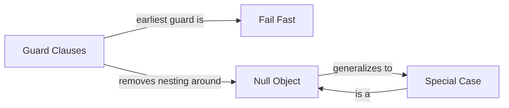

# Control-Flow Patterns

> *"You don't fight nesting with willpower. You fight it with a return statement at the top of the function."*

---

## What This Category Covers

**Control-flow patterns** govern the single most-read property of any function: **the path execution takes through it.** Bad control flow is the most common reason code feels hard — the eye has to track which `else` belongs to which `if`, hold half a dozen conditions in working memory, and guess what state the program is in at any given line.

The four patterns here attack that difficulty from two directions:

- **Flatten the path** — handle the unusual cases first and get them out of the way, so the *normal* case reads top-to-bottom with no nesting.
- **Make absence first-class** — stop representing "nothing" as `null` and re-checking for it everywhere; represent it as an object that already knows how to behave.

---

## The Four Patterns

| Pattern | Problem it solves | The move |
|---|---|---|
| [Guard Clauses & Early Return](01-guard-clauses-and-early-return/junior.md) | Deeply nested conditionals; the happy path buried inside `else` branches | Check each precondition at the top and `return`/`throw` immediately; leave the main logic flat |
| [Fail Fast](02-fail-fast/junior.md) | Bad state propagates silently and crashes somewhere unrelated | Validate as early as possible and stop loudly at the point of detection, not the point of damage |
| [Null Object](03-null-object/junior.md) | `if (x != null)` repeated at every call site; `NullPointerException` risk | Return a polymorphic do-nothing object that satisfies the interface |
| [Special Case](04-special-case/junior.md) | A recurring exceptional condition handled with duplicated branches everywhere | A dedicated object encapsulating that one case's behavior |

---

## How They Connect

- **Guard clauses** and **fail fast** are two views of the same instinct: *deal with the bad case immediately.* A guard clause is often literally the fail-fast check.
- **Null Object** is the special case of **Special Case** where the special condition is "absence." Special Case generalizes it to *any* recurring exceptional value — a missing customer, an unknown user, an out-of-stock product.
- All four exist to keep the **happy path readable**. Guard clauses and fail-fast remove vertical nesting; Null Object and Special Case remove horizontal `if`-checks scattered across the codebase.

---

## When NOT to Use Them

- **Guard clauses** can be overdone — a function with fifteen guards is telling you it has too many responsibilities, not that it needs more returns.
- **Null Object** hides absence; sometimes absence is exactly what the caller *must* handle (a failed payment should not silently become a do-nothing payment). Use it where "do nothing sensible" is a correct default, not where it masks a real error — that's where [Fail Fast](02-fail-fast/junior.md) wins instead.

---

## Related Topics

- **[Sentinel & Special Values](../03-resource-and-type-safety/03-sentinel-and-special-values/junior.md)** — the anti-pattern that Null Object and Special Case replace.
- **[Error Handling](../../clean-code/06-error-handling/README.md)** — guard clauses and fail-fast are the front line of an error strategy.
- **[Refactoring: Replace Nested Conditional with Guard Clauses](../../refactoring/02-refactoring-techniques/README.md)** — the mechanical refactoring that introduces these patterns.
- **[Arrow Anti-Pattern](../../anti-patterns/01-development/README.md)** — the shape guard clauses exist to destroy.
