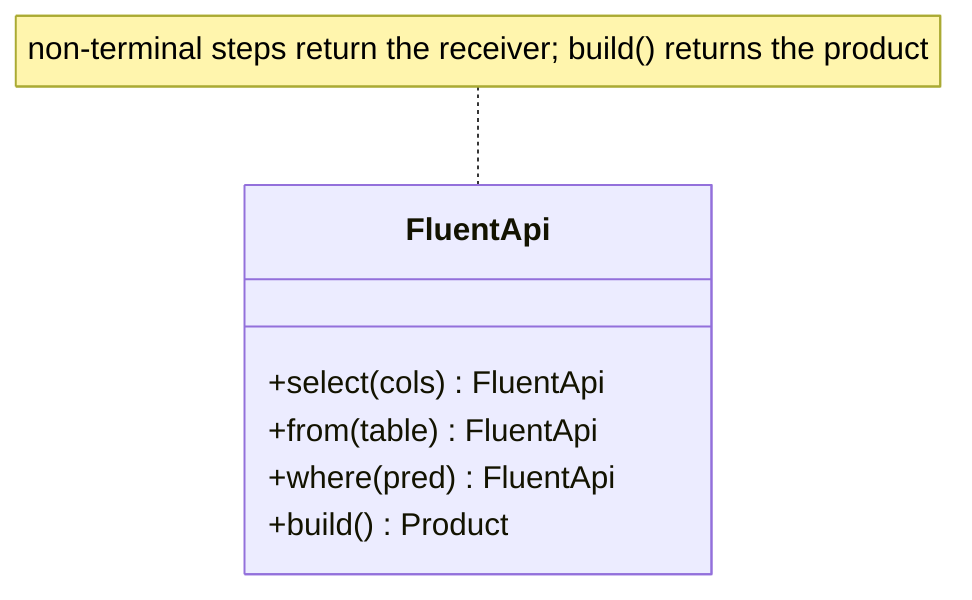
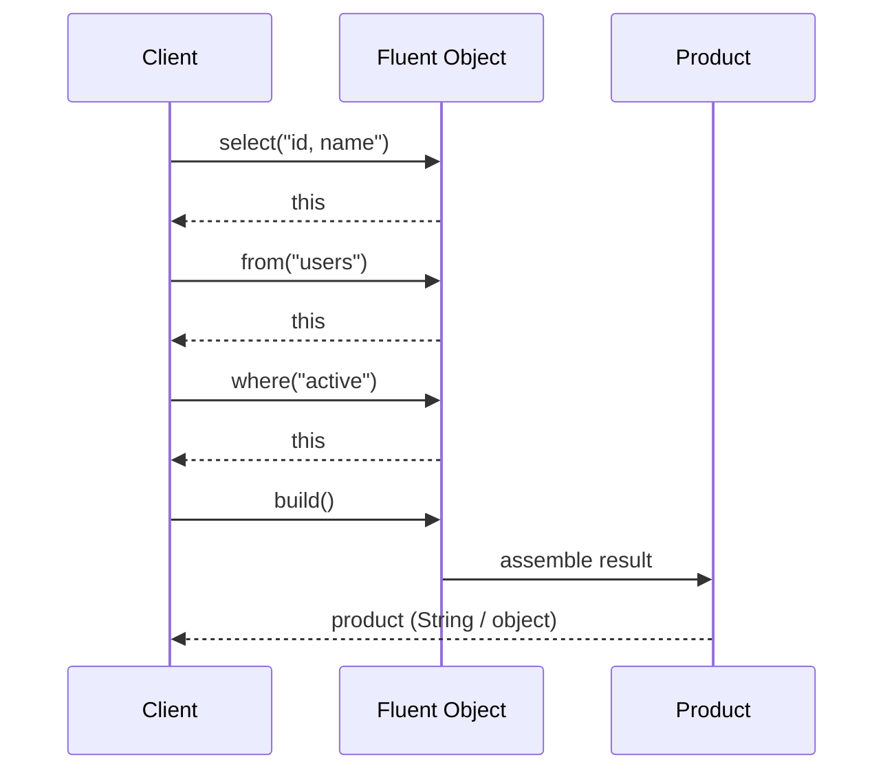

# Fluent Interface — Junior Level

> **Category:** [Object & State Patterns](../README.md) — chain calls that each return the receiver, producing a readable mini-DSL.

---

## Table of Contents

1. [Introduction](#introduction)
2. [Prerequisites](#prerequisites)
3. [Glossary](#glossary)
4. [Core Concepts](#core-concepts)
5. [Real-World Analogies](#real-world-analogies)
6. [Mental Models](#mental-models)
7. [Pros & Cons](#pros-cons)
8. [Use Cases](#use-cases)
9. [Code Examples](#code-examples)
10. [Coding Patterns](#coding-patterns)
11. [Clean Code](#clean-code)
12. [Best Practices](#best-practices)
13. [Edge Cases & Pitfalls](#edge-cases-pitfalls)
14. [Common Mistakes](#common-mistakes)
15. [Tricky Points](#tricky-points)
16. [Test Yourself](#test-yourself)
17. [Cheat Sheet](#cheat-sheet)
18. [Summary](#summary)
19. [Further Reading](#further-reading)
20. [Related Topics](#related-topics)
21. [Diagrams](#diagrams)

---

## Introduction

> Focus: **What is it?** and **How to use it?**

A **Fluent Interface** is an API designed so that calls **chain** — each method returns an object you can immediately call the next method on, usually the receiver itself (`this` / `self`). The result reads like a sentence or a little language:

```java
assertThat(order.total()).isGreaterThan(0).isLessThan(1000);
```

The term was coined by **Martin Fowler and Eric Evans** (2005). The defining move is dead simple: *a method that would normally return `void` returns the receiver instead*, so the next call can continue the chain.

### Why this matters

Compare configuring an object the imperative way:

```java
StringBuilder sb = new StringBuilder();
sb.append("Hello, ");
sb.append(name);
sb.append("!");
String s = sb.toString();
```

…with the fluent way:

```java
String s = new StringBuilder()
    .append("Hello, ")
    .append(name)
    .append("!")
    .toString();
```

Same work, but the second version reads top-to-bottom as one expression. No repeated `sb.` noise, no intermediate statements. That readability *is* the entire point.

### What it is NOT

A fluent interface is **not** the [Builder pattern](../../../design-patterns/01-creational/03-builder/junior.md). Builder is about *constructing a complex object step by step*; fluent interface is about *readability via chaining*. Builders are usually *expressed* fluently, but the two ideas are orthogonal — you can have a fluent API that builds nothing (`assertThat(x).isEqualTo(y)`) and a Builder that isn't fluent (setters returning `void`).

---

## Prerequisites

- **Required:** Methods, return types, and the concept of `this` / `self`.
- **Required:** Basic objects and mutation.
- **Helpful:** [Builder pattern](../../../design-patterns/01-creational/03-builder/junior.md) — the most common place you'll meet fluent APIs.

---

## Glossary

| Term | Definition |
|------|-----------|
| **Fluent interface** | An API where methods return an object enabling further chained calls. |
| **Method chaining** | Calling several methods in one expression: `a.b().c().d()`. |
| **Receiver** | The object a method is called on (`this` / `self`). |
| **Internal DSL** | A domain-specific "language" built from ordinary method calls in the host language. |
| **Terminal method** | The last call that ends the chain and returns the real result (e.g. `build()`, `toString()`, `collect()`). |
| **Wither** | An immutable-style chaining method that returns a *new* copy instead of mutating (`withX(...)`). |

---

## Core Concepts

### 1. Each method returns something chainable

The simplest form returns the receiver:

```python
def append(self, s):
    self._buf += s
    return self          # <- enables chaining
```

### 2. The chain reads like a phrase

`query.select("id").from("users").where("active")` reads almost like English. This is why fluent APIs are called **internal DSLs**.

### 3. There is usually a terminal call

Chains often end with a method that returns the *real* product or result — `build()`, `toString()`, `execute()`. Everything before it returns the chainable object; the terminal returns something else.

### 4. Two flavors: mutate-and-return-`this`, or copy-and-return-new

- **Mutable chain:** each method changes the receiver and returns it. One object, mutated in place.
- **Immutable chain ("wither"):** each method returns a fresh copy. The original is untouched.

The choice has real consequences for thread-safety and aliasing — covered in [Middle](middle.md) and [Senior](senior.md).

---

## Real-World Analogies

| Concept | Analogy |
|---|---|
| **Fluent chain** | An assembly line: each station hands the same part to the next, slightly more complete. |
| **Returning `this`** | Passing the *same* clipboard down a row of people, each adding a note. |
| **Wither (immutable)** | Each person photocopies the clipboard, adds their note to the copy, and passes the copy on. |
| **Terminal method** | The final inspector who takes the part off the line and ships it. |

---

## Mental Models

**The intuition:** *"Return yourself so the caller can keep talking to you."*

```
obj.step1().step2().step3().result()
 │     │       │       │        │
 │     └───────┴───────┘        │
 │        each returns obj      │
 │                              │
 └──────────────────────────────► terminal returns the product
```

Compare imperative vs fluent:

```
// imperative: name the object, poke it repeatedly
x = new T(); x.a(); x.b(); x.c();

// fluent: one expression, reads as a phrase
new T().a().b().c();
```

---

## Pros & Cons

| Pros | Cons |
|------|------|
| Reads like prose / a DSL | Ugly stack traces (whole chain is "one line") |
| No repeated `receiver.` noise | Debugger can't step into the middle of a chain easily |
| Encourages a guided, discoverable API (IDE autocomplete) | Tension with Command-Query Separation (queries that also return `this`) |
| Groups related configuration into one expression | Mutable chains alias one object — surprising sharing |
| Great for assertions, queries, builders | Easy to over-apply where plain statements are clearer |

### When to use:
- Configuring/constructing objects with several optional steps.
- Assertion libraries, query builders, stream pipelines.
- Any API where a *sequence of related operations* reads better as one expression.

### When NOT to use:
- A single call does the job — chaining buys nothing.
- The methods are genuine *queries* (return real data) — chaining them hides Command-Query Separation.
- Debuggability matters more than terseness in this code path.

---

## Use Cases

- **Assertions** — `assertThat(x).isNotNull().isEqualTo(y)` (AssertJ, Truth).
- **Query builders** — jOOQ, SQLAlchemy, Knex, LINQ.
- **Stream pipelines** — Java Streams `.filter(...).map(...).collect(...)`.
- **String building** — `StringBuilder.append(...).append(...)`.
- **HTTP/config clients** — `OkHttpClient.Builder()....build()`.
- **Data frames** — pandas `df.dropna().groupby("k").sum()`.

---

## Code Examples

### Java — Mutable fluent chain (return `this`)

```java
public final class Sql {
    private final StringBuilder q = new StringBuilder();

    public Sql select(String cols) { q.append("SELECT ").append(cols); return this; }
    public Sql from(String table)  { q.append(" FROM ").append(table);  return this; }
    public Sql where(String pred)  { q.append(" WHERE ").append(pred);  return this; }

    public String build() { return q.toString(); }   // terminal
}

// Usage
String sql = new Sql()
    .select("id, name")
    .from("users")
    .where("active = true")
    .build();
```

**Highlights:**
- Every step returns `this`.
- `build()` is the terminal — it returns the `String`, not the `Sql`.

### Python — Fluent chain with `Self`

```python
from typing import Self

class Query:
    def __init__(self) -> None:
        self._parts: list[str] = []

    def select(self, cols: str) -> Self:
        self._parts.append(f"SELECT {cols}"); return self

    def from_(self, table: str) -> Self:
        self._parts.append(f"FROM {table}"); return self

    def where(self, pred: str) -> Self:
        self._parts.append(f"WHERE {pred}"); return self

    def build(self) -> str:                 # terminal
        return " ".join(self._parts)

# Usage
sql = (Query()
       .select("id, name")
       .from_("users")
       .where("active = true")
       .build())
```

> Note `from_` — `from` is a Python keyword, so the fluent method is renamed. Fluent naming sometimes collides with the host language.

### Go — Chained builder (returns the receiver)

> **Go note:** Go *can* chain by returning the receiver, but the idiomatic alternative for configuration is **functional options** (covered in [Middle](middle.md)). Chaining shines for accumulating string/query state.

```go
package query

import "strings"

type Query struct{ parts []string }

func New() *Query { return &Query{} }

func (q *Query) Select(cols string) *Query { q.parts = append(q.parts, "SELECT "+cols); return q }
func (q *Query) From(table string) *Query  { q.parts = append(q.parts, "FROM "+table);  return q }
func (q *Query) Where(pred string) *Query  { q.parts = append(q.parts, "WHERE "+pred);  return q }

func (q *Query) Build() string { return strings.Join(q.parts, " ") } // terminal
```

```go
// Usage
sql := query.New().
    Select("id, name").
    From("users").
    Where("active = true").
    Build()
```

In Go the receiver is a pointer (`*Query`); returning it lets the next method mutate the same struct.

---

## Coding Patterns

### Pattern 1: Return `this` from a setter

The whole pattern in one line — change a `void` setter into a fluent one:

```java
// Before
public void setColor(String c) { this.color = c; }

// After
public Widget color(String c) { this.color = c; return this; }
```

### Pattern 2: Terminal method ends the chain

```python
result = (pipeline()
          .step("a")
          .step("b")
          .run())          # terminal returns the real output
```

Without a terminal, callers would be left holding the builder, not the product.

### Pattern 3: Immutable "wither" chain

Return a copy instead of mutating:

```java
public record Point(int x, int y) {
    public Point withX(int x) { return new Point(x, this.y); }
    public Point withY(int y) { return new Point(this.x, y); }
}

Point p = new Point(0, 0).withX(3).withY(4);   // original untouched
```



---

## Clean Code

### Naming

| ❌ Bad | ✅ Good |
|---|---|
| `setX(...)` everywhere | reads as a phrase: `select`, `from`, `where`, `isEqualTo` |
| ambiguous terminal `get()` | intent-revealing terminal: `build()`, `toString()`, `execute()` |
| mixing commands and queries silently | keep chain steps as *commands*; put real queries outside the chain |

### Format the chain vertically

One step per line aligns the calls and makes diffs clean:

```java
client.newCall(request)
      .timeout(Duration.ofSeconds(5))
      .retries(3)
      .execute();
```

---

## Best Practices

1. **Return `this` (or a copy) consistently** — every non-terminal step must return something chainable.
2. **Name methods to read as a phrase** — fluent APIs are read aloud; make that pleasant.
3. **Have one clear terminal** — `build()`, `execute()`, `collect()`.
4. **Prefer immutability for shared objects** — a wither chain avoids aliasing surprises.
5. **In Go, prefer functional options** for configuration; chain for accumulation.
6. **Format vertically** — one call per line.

---

## Edge Cases & Pitfalls

- **Stack traces collapse the chain** — an exception three steps in reports "one line," hiding *which* step failed.
- **Mutable chains alias** — `var b = q.select("x"); b.from("y");` mutates the original `q` too.
- **Null in the middle** — if any step can return `null`, the next call throws `NullPointerException` with no obvious culprit.
- **`this`-returning queries** break Command-Query Separation — a method that both changes state *and* returns the object blurs the line.

---

## Common Mistakes

1. **Forgetting `return this`** — the chain compiles in dynamic languages but returns `None`/`void`, breaking the next call.
2. **No terminal method** — callers can't get the product out of the chain.
3. **Returning a new object when you meant to mutate (or vice-versa)** — silent aliasing bugs.
4. **Chaining genuine queries** — `list.add(x).size()` mixes a command and a query confusingly.
5. **Over-chaining** — cramming unrelated operations into one chain hurts readability instead of helping.

---

## Tricky Points

- **Fluent ≠ Builder.** Fluent is about chaining for readability; Builder is about constructing complex objects. They often appear together, but you can have either without the other.
- **Mutable vs immutable chain** changes the meaning of reusing a partially-built chain — see [Middle](middle.md).
- **In Python**, forgetting `return self` doesn't error at the `def` site; it breaks at the *call* site with a cryptic `AttributeError: 'NoneType' has no attribute ...`.

---

## Test Yourself

1. What is the one-line change that turns a setter into a fluent method?
2. What's the difference between a fluent interface and the Builder pattern?
3. What is a terminal method?
4. Why do fluent chains produce confusing stack traces?
5. What's the difference between a mutate-and-return-`this` chain and a wither chain?

<details><summary>Answers</summary>

1. Make the method return the receiver (`this` / `self`) instead of `void`.
2. Fluent interface = readability via chaining; Builder = step-by-step construction of a complex object. Orthogonal concerns that often co-occur.
3. The last call in a chain that returns the actual result/product (e.g. `build()`), ending the chain.
4. The entire chain sits on roughly one source line, so the trace can't point to the specific failing step.
5. The first mutates one shared object and returns it; the second returns a fresh copy each step, leaving the original unchanged.

</details>

---

## Cheat Sheet

```java
// Java — return this
public Builder color(String c) { this.color = c; return this; }
```

```python
# Python — return self
def color(self, c): self._color = c; return self
```

```go
// Go — return the receiver
func (b *Builder) Color(c string) *Builder { b.color = c; return b }
```

---

## Summary

- A fluent interface makes calls **chain** by returning the receiver (or a copy).
- It reads like an **internal DSL**; that readability is the whole point.
- It is **not** the Builder pattern — orthogonal, though often combined.
- End chains with a clear **terminal** method.
- Watch out for ugly stack traces, aliasing in mutable chains, and the tension with Command-Query Separation.

---

## Further Reading

- Martin Fowler, ["FluentInterface"](https://martinfowler.com/bliki/FluentInterface.html) — the original article.
- *Effective Java* (Joshua Bloch), Item 2 — builders with fluent setters.
- AssertJ / Java Streams documentation — production fluent APIs.

---

## Related Topics

- **Next:** [Fluent Interface — Middle](middle.md)
- **Companion:** [Builder pattern](../../../design-patterns/01-creational/03-builder/junior.md) — most fluent APIs you meet are builders.
- **Closely related:** [Self-Encapsulation](../05-self-encapsulation/junior.md) — protecting the fields a fluent setter touches.

---

## Diagrams



[← Object & State](../README.md) · [Coding Patterns](../../README.md) · [Roadmap](../../../../README.md) · **Next:** [Fluent Interface — Middle](middle.md)
