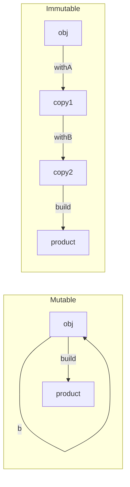
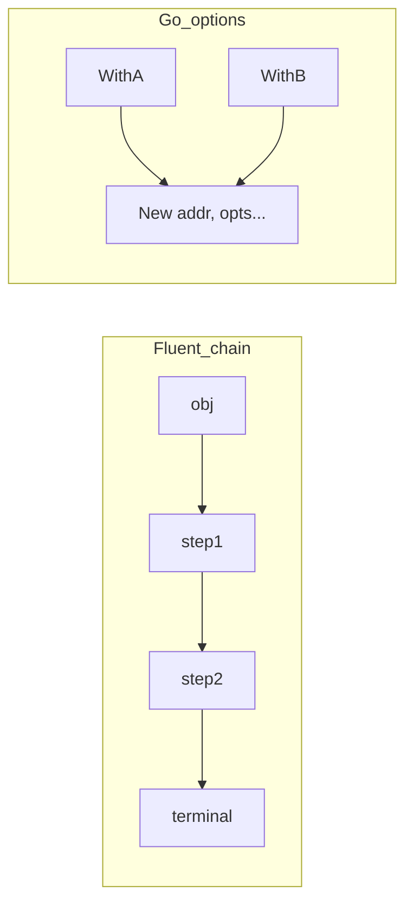

# Fluent Interface — Middle Level

> **Category:** [Object & State Patterns](../README.md) — chain calls that each return the receiver, producing a readable mini-DSL.
> **Prerequisite:** [Junior](junior.md)
> **Focus:** **Why** and **When**

---

## Table of Contents

1. [Introduction](#introduction)
2. [When to Use a Fluent Interface](#when-to-use-a-fluent-interface)
3. [When NOT to Use It](#when-not-to-use-it)
4. [Real-World Cases](#real-world-cases)
5. [Production-Grade Code](#production-grade-code)
6. [Mutable Chain vs Immutable Wither](#mutable-chain-vs-immutable-wither)
7. [Go's Functional Options Alternative](#gos-functional-options-alternative)
8. [Trade-offs](#trade-offs)
9. [Refactoring Toward Fluent](#refactoring-toward-fluent)
10. [Edge Cases](#edge-cases)
11. [Tricky Points](#tricky-points)
12. [Best Practices](#best-practices)
13. [Summary](#summary)
14. [Diagrams](#diagrams)

---

## Introduction

> Focus: **Why** and **When**

A fluent interface earns its keep when a *sequence of related operations* reads better as one expression than as a paragraph of statements. The middle-level skill is judging that threshold — and choosing between the **mutable** (return `this`) and **immutable** (return a copy) styles, each of which has different aliasing and thread-safety properties.

The decision tree:

- **One operation, no sequence:** plain method call. No fluency needed.
- **A few related configuration steps:** fluent chain or (in Go) functional options.
- **Steps that must happen in a specific order:** a *staged / progressive interface* (covered in [Senior](senior.md)).
- **Object is shared across threads or callers:** prefer an **immutable** wither chain.

---

## When to Use a Fluent Interface

Use it when **any** of:

1. **Configuration with several optional steps** — `client().timeout(...).retries(...).build()`.
2. **The chain reads like a domain phrase** — assertions, queries, validation rules.
3. **You want a guided, discoverable API** — IDE autocomplete walks the caller through valid next calls.
4. **You're accumulating into a result** — string building, query construction, stream pipelines.
5. **You want one expression instead of a temp variable poked repeatedly.**

### Strong-fit examples

- Assertion DSLs (AssertJ, Hamcrest-style).
- SQL / query builders (jOOQ, SQLAlchemy, LINQ).
- HTTP / gRPC / cloud-SDK client configuration.
- Stream / collection pipelines.
- Test data builders.

---

## When NOT to Use It

| Symptom | Better choice |
|---|---|
| A single call does the work | Plain method — chaining adds nothing |
| Steps are genuine *queries* returning data | Separate calls; honor Command-Query Separation |
| You're in Go configuring a struct | **Functional options** (idiomatic) |
| Debuggability of each step is critical | Imperative statements you can breakpoint per line |
| Modern language with named/default args | Named-argument constructor (Python, Kotlin) |

---

## Real-World Cases

### 1. AssertJ (Java assertions)

```java
assertThat(users)
    .hasSize(3)
    .extracting(User::name)
    .containsExactly("Alice", "Bob", "Carol");
```

Each step narrows the assertion; the chain reads as a single claim.

### 2. Java Streams

```java
List<String> names = users.stream()
    .filter(User::isActive)
    .map(User::name)
    .sorted()
    .collect(Collectors.toList());   // terminal
```

`filter`/`map`/`sorted` return a new `Stream` (lazy); `collect` is the terminal that materializes the result.

### 3. SQLAlchemy (Python query builder)

```python
stmt = (select(User)
        .where(User.active == True)
        .order_by(User.created_at.desc())
        .limit(10))
```

A near-perfect internal DSL: the Python reads like SQL.

### 4. pandas (Python data frames)

```python
result = (df
          .dropna(subset=["amount"])
          .groupby("region")
          .agg(total=("amount", "sum"))
          .reset_index())
```

Each method returns a new frame; the chain is a data pipeline.

### 5. OkHttp client (Java config builder)

```java
OkHttpClient client = new OkHttpClient.Builder()
    .connectTimeout(10, SECONDS)
    .addInterceptor(new AuthInterceptor())
    .build();
```

Here the fluent interface *is* a Builder — the two patterns coincide.

---

## Production-Grade Code

### Java — fluent validator (an internal DSL)

```java
public final class Check<T> {
    private final T value;
    private final List<String> errors = new ArrayList<>();

    private Check(T value) { this.value = value; }
    public static <T> Check<T> that(T value) { return new Check<>(value); }

    public Check<T> notNull() {
        if (value == null) errors.add("must not be null");
        return this;
    }
    public Check<T> satisfies(Predicate<T> p, String msg) {
        if (value != null && !p.test(value)) errors.add(msg);
        return this;
    }
    public T orThrow() {                       // terminal
        if (!errors.isEmpty())
            throw new IllegalArgumentException(String.join("; ", errors));
        return value;
    }
}

// Usage
String name = Check.that(input)
    .notNull()
    .satisfies(s -> s.length() <= 50, "name too long")
    .orThrow();
```

The chain *accumulates* errors and reports them all at the terminal — better UX than failing on the first.

### Python — fluent pipeline returning `Self`

```python
from typing import Self, Callable

class Pipeline:
    def __init__(self, value):
        self._value = value
        self._steps: list[Callable] = []

    def map(self, fn: Callable) -> Self:
        self._steps.append(fn); return self

    def filter(self, pred: Callable) -> Self:
        self._steps.append(lambda v: v if pred(v) else None); return self

    def run(self):                              # terminal
        v = self._value
        for step in self._steps:
            v = step(v)
            if v is None:
                return None
        return v

result = Pipeline(10).map(lambda x: x * 2).filter(lambda x: x > 5).run()
```

### Go — chained builder for accumulation

```go
package report

import (
    "fmt"
    "strings"
)

type Report struct{ b strings.Builder }

func New() *Report { return &Report{} }

func (r *Report) Title(t string) *Report  { fmt.Fprintf(&r.b, "# %s\n", t); return r }
func (r *Report) Line(s string) *Report   { fmt.Fprintf(&r.b, "- %s\n", s); return r }
func (r *Report) String() string          { return r.b.String() } // terminal
```

```go
out := report.New().
    Title("Daily Summary").
    Line("3 deploys").
    Line("0 incidents").
    String()
```

Chaining is idiomatic here because we're *accumulating into a buffer*, not configuring a struct.

---

## Mutable Chain vs Immutable Wither

This is the central middle-level decision.

### Mutable (return `this`)

```java
public Config timeout(Duration t) { this.timeout = t; return this; }
```

- One object, mutated in place.
- Cheap (no allocations).
- **Aliasing hazard:** `var b = base.timeout(t); ...` mutates `base` too.
- **Not** thread-safe to share mid-build.

### Immutable wither (return a copy)

```java
public Config withTimeout(Duration t) {
    return new Config(this.url, t, this.retries);   // fresh copy
}
```

- Each step allocates a new object.
- The original is never touched — safe to share, cache, reuse as a template.
- Trivially thread-safe.
- More allocation pressure (mitigated by JIT escape analysis — see [Professional](professional.md)).

**Rule of thumb:** if the partially-configured object is shared, cached, or used as a base template, use the wither. If it's a throwaway built once and discarded, mutable is fine and cheaper.

---

## Go's Functional Options Alternative

In Go, the idiomatic way to configure a struct is **not** a fluent chain but **functional options**:

```go
type Server struct {
    addr    string
    timeout time.Duration
    tls     bool
}

type Option func(*Server)

func WithTimeout(t time.Duration) Option { return func(s *Server) { s.timeout = t } }
func WithTLS(v bool) Option              { return func(s *Server) { s.tls = v } }

func New(addr string, opts ...Option) *Server {
    s := &Server{addr: addr, timeout: 30 * time.Second}
    for _, opt := range opts {
        opt(s)
    }
    return s
}

// Usage
s := New(":8080", WithTimeout(5*time.Second), WithTLS(true))
```

**Why options over chaining in Go?**
- Composable — pass `[]Option` around, layer defaults.
- No mutable receiver exposed to the caller.
- Order-independent, each option self-contained.
- Used by `net/http`, `grpc`, AWS SDK.

Reserve fluent chaining in Go for **accumulation** (query/string building), where there's a real receiver carrying state.

---

## Trade-offs

| Dimension | Mutable chain | Immutable wither | Functional options (Go) |
|---|---|---|---|
| Readability | Excellent | Excellent | Excellent |
| Allocation | Lowest (1 object) | N+1 objects | 1 per option closure |
| Thread-safe to share | No | Yes | N/A (built once) |
| Aliasing surprises | Yes | No | No |
| Idiomatic in Go | For accumulation only | Rare | Yes |
| Debuggability | Poor (collapsed trace) | Poor | Good (each option is a function) |

---

## Refactoring Toward Fluent

Given imperative setters:

```java
Report r = new Report();
r.setTitle("Daily");
r.addLine("3 deploys");
r.addLine("0 incidents");
String out = r.render();
```

**Step 1 — change `void` setters to return `this`:**

```java
public Report title(String t) { this.title = t; return this; }
public Report line(String s)  { this.lines.add(s); return this; }
```

**Step 2 — keep `render()` as the terminal** (it returns the real product, *not* `this`).

**Step 3 — collapse call sites:**

```java
String out = new Report()
    .title("Daily")
    .line("3 deploys")
    .line("0 incidents")
    .render();
```

**Step 4 — decide mutable vs wither.** If `Report` is shared as a template, switch to copy-returning withers instead of mutating setters.

---

## Edge Cases

### 1. Reusing a partially-built mutable chain

```java
Config base = new Config().url("/api");
Config a = base.timeout(t1);   // mutates base
Config b = base.timeout(t2);   // overwrites; a and b and base are the SAME object
```

All three references point to one mutated object. The wither style fixes this.

### 2. Null mid-chain

If a step can return `null`, the next call NPEs. Never return `null` from a chainable method — return the receiver or throw.

### 3. Streams are single-use

A Java `Stream` chain can be traversed once. Re-running a terminal on the same stream throws `IllegalStateException`.

### 4. Mixing commands and queries

`list.add(x)` returns `boolean` in Java — you *can't* chain it, by design, because it's a query (did it change?) as well as a command.

---

## Tricky Points

- **Fluent and Builder aren't the same.** A query DSL is fluent but builds no object; setters that return `this` are fluent but may not be a Builder.
- **Immutable withers compose with caching.** Because the base is never mutated, you can keep it as a shared constant and derive variants safely.
- **Lazy vs eager chains.** Java Streams are *lazy* — intermediate steps do nothing until the terminal. pandas is *eager* — each step computes immediately. Know which you're building.
- **Functional options aren't fluent.** They achieve the same configuration goal in Go without chaining.

---

## Best Practices

1. **Pick mutable or immutable deliberately** — don't mix within one API.
2. **Never return `null` from a chainable method.**
3. **Give the chain exactly one terminal.**
4. **In Go, use functional options for config; chain only for accumulation.**
5. **Document whether the object is reusable as a template** (matters for mutable chains).
6. **Keep chainable methods as commands**, not queries, to respect CQS.

---

## Summary

- Use a fluent interface when a *sequence of related operations* reads better as one expression.
- The core decision is **mutable chain (return `this`)** vs **immutable wither (return a copy)** — the latter avoids aliasing and is thread-safe.
- In Go, the idiomatic configuration alternative is **functional options**; reserve chaining for accumulation.
- Fluent ≠ Builder; assertion/query DSLs are fluent without building anything.

---

## Diagrams

### Mutable vs Immutable



### Chain vs Functional Options



[← Junior](junior.md) · [Object & State](../README.md) · [Coding Patterns](../../README.md) · **Next:** [Senior](senior.md)
