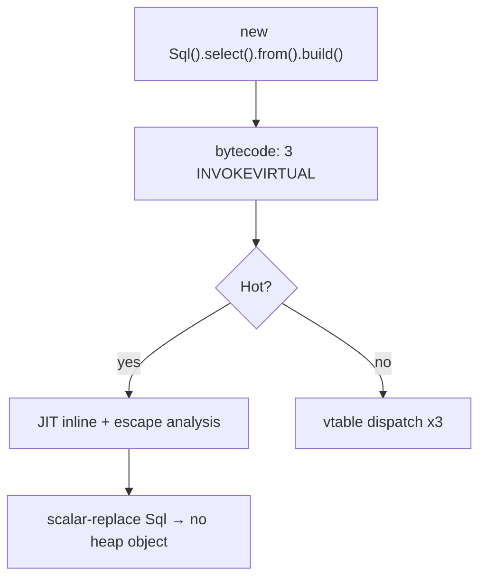
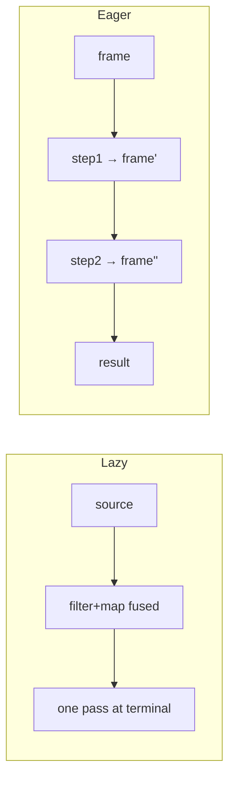

# Fluent Interface — Professional Level

> **Category:** [Object & State Patterns](../README.md) — chain calls that each return the receiver, producing a readable mini-DSL.
> **Prerequisites:** [Junior](junior.md) · [Middle](middle.md) · [Senior](senior.md)
> **Focus:** **Under the hood**

---

## Table of Contents

1. [Introduction](#introduction)
2. [Allocation Profile of Chains](#allocation-profile-of-chains)
3. [JIT Inlining & Escape Analysis](#jit-inlining-escape-analysis)
4. [Lazy vs Eager Chains](#lazy-vs-eager-chains)
5. [Wither Chains & Structural Sharing](#wither-chains-structural-sharing)
6. [Go Receiver Chains vs Options](#go-receiver-chains-vs-options)
7. [Python Chaining Cost](#python-chaining-cost)
8. [Stack-Trace Mechanics](#stack-trace-mechanics)
9. [Benchmarks](#benchmarks)
10. [Diagrams](#diagrams)
11. [Related Topics](#related-topics)

---

## Introduction

A fluent interface's runtime cost is **allocation** (especially in immutable/wither and lazy-stream styles) plus **method dispatch** (one virtual call per step). Both are highly amenable to JIT inlining and escape analysis, so for mutable chains the overhead usually collapses to near-zero post-warmup. At the professional level you should be able to:

- Predict when a wither chain's intermediate copies get elided.
- Explain why a Java `Stream` allocates more than a hand-rolled mutable chain.
- Read Go escape-analysis output for a receiver chain.
- Reason about why the *same* chain produces a near-useless stack trace.

---

## Allocation Profile of Chains

### Mutable chain (Java)

```java
new Sql().select("id").from("t").where("x").build();
```

Allocations: one `Sql` object, plus whatever `build()` materializes (the `String`). Each step mutates and returns the *same* receiver — **no per-step allocation**. Total: ~2 objects.

### Immutable wither (Java record)

```java
new Config().withUrl("/x").withTimeout(t).withRetries(3);
```

Each `withX` allocates a fresh `Config`. A 3-step chain → 1 initial + 3 copies = **4 objects**, 3 of them immediately garbage. JIT escape analysis often elides the intermediates (below).

### Lazy stream (Java)

```java
list.stream().filter(p).map(f).collect(toList());
```

Allocations: the `Stream` head, one pipeline stage object per intermediate op (`filter`, `map`), a `Spliterator`, plus the result collection. A 2-op stream is ~5 small objects before the result — heavier than a hand mutable loop, traded for readability.

---

## JIT Inlining & Escape Analysis

### Mutable chain → effectively free

```java
new Sql().select("id").from("t").build();
```

After ~10K iterations, HotSpot inlines each small `select`/`from` and, via escape analysis, observes the `Sql` never escapes — it may **scalar-replace** it (no heap object at all). The chain compiles down to the same code as direct field assignments + the final `build()`.

### Wither intermediates → elided when ephemeral

```java
Config c = new Config().withUrl("/x").withTimeout(t);
```

If `c` is the only escaping value and the intermediate copies are dead immediately, escape analysis can scalar-replace the throwaway `Config`s. Inspect with:

```
-XX:+PrintInlining -XX:+PrintCompilation
```

Caveat: escape analysis is fragile. If a copy escapes (stored, returned, passed to a non-inlined method), it heap-allocates. Wither chains in hot loops can show real allocation; profile before assuming "the JIT handles it."

### `-XX:+PrintInlining` (mutable chain)

```
@ 5  Sql::select (10 bytes) inline (hot)
@ 11 Sql::from   (10 bytes) inline (hot)
@ 18 Sql::build  (20 bytes) inline (hot)
```

All inlined → cost approaches direct construction.

---

## Lazy vs Eager Chains

A senior distinction with professional consequences:

| | Lazy (Java Stream, .NET LINQ, Rust iterators) | Eager (pandas, mutable builders) |
|---|---|---|
| When work happens | At the **terminal** | At **each step** |
| Intermediate allocation | Pipeline stage objects | Full intermediate results |
| Fusion | Steps fuse into one pass | No fusion; N passes |
| Cost of an unused step | ~Zero (never runs) | Paid immediately |

```java
// Lazy: filter+map fuse; ONE traversal, no intermediate list
stream.filter(p).map(f).findFirst();   // stops at first match
```

```python
# Eager: TWO full passes, an intermediate frame materialized between them
df.assign(x=df.a * 2).query("x > 5")
```

Lazy chains can be dramatically cheaper (short-circuiting, loop fusion); eager chains are simpler to reason about but pay per step. Knowing which your DSL is determines whether adding a step is free or expensive.

---

## Wither Chains & Structural Sharing

For immutable chains over collections, naive copying is O(n) per step. **Persistent data structures** share structure between versions:

```scala
case class Cfg(headers: Map[String, String] = Map.empty) {
  def withHeader(k: String, v: String): Cfg = copy(headers = headers + (k -> v))
}
```

Scala/Clojure `Map +` returns a HAMT-backed map sharing most internal nodes with the original — **O(log n)** per add, not O(n). For a wither chain that adds 100 headers, structural sharing turns O(n²) total into O(n log n).

In Java, `Map.copyOf`/`List.copyOf` are O(n) full copies (fine for small config maps, painful for large ones). Reach for Vavr or Eclipse Collections persistent types when wither chains touch large collections.

---

## Go Receiver Chains vs Options

### Receiver chain — no closures

```go
func (q *Query) Where(p string) *Query { q.parts = append(q.parts, p); return q }
```

Returning `*Query` is free — it's just the pointer already in hand. The only allocations are the backing `parts` slice growth. A receiver chain in Go is **cheaper than functional options** because options allocate closures.

### Functional options — one closure per option

```go
func WithTimeout(t time.Duration) Option { return func(s *Server) { s.timeout = t } }
```

`WithTimeout` returns a closure capturing `t`. Returned closures **escape to the heap**:

```bash
go build -gcflags='-m=2'
# ./opts.go:3:42: func literal escapes to heap
```

~16–32 bytes per option. For 10 options: ~200 bytes per construction, plus the variadic `[]Option` slice. Negligible for setup-time config; measurable in a tight construction loop.

**Professional takeaway:** Go *receiver chaining* is the cheaper mechanism, but the ecosystem prefers *options* for their composability — a deliberate ergonomics-over-microbenchmark choice.

---

## Python Chaining Cost

```python
Query().select("id").from_("t").where("x").build()
```

Each step is a Python method call (~50–80 ns of interpreter overhead) returning `self` (no new object). A 4-step chain is ~4 method-call overheads + the builder + the result. Versus a single `__init__` with keyword args, the chain is ~2–3× slower — but at hundreds of nanoseconds, irrelevant outside hot loops.

For eager frame chains (pandas), the cost is *not* the method calls — it's the **intermediate frame allocations**. `df.dropna().groupby().sum()` may materialize two full intermediate frames. Use `.pipe()` or in-place ops on large frames where it matters.

---

## Stack-Trace Mechanics

Why a chain's trace is unhelpful, mechanically:

- The JVM maps a bytecode index to a **single line number** per stack frame. A chain split across source lines still produces *one* frame per actual method invocation — but the *lambdas* inside (`map(Line::price)`) appear as synthetic frames with mangled names (`lambda$method$0`).
- For an NPE inside `map(Line::price)`, pre-Java-14 the message was just `NullPointerException` with no expression detail. Java 14+ **helpful NPEs** (`-XX:+ShowCodeDetailsInExceptionMessages`, on by default since 15) reconstruct the expression: `Cannot invoke "Line.price()" because the return value of "..." is null`.
- **One step per source line** is the cheap mitigation: it gives distinct line numbers so the trace's frame points at the right call.

```java
order.lines().stream()
    .map(Line::price)        // <- distinct line; trace can name it
    .reduce(ZERO, BigDecimal::add);
```

---

## Benchmarks

Apple M2 Pro, single thread. Illustrative.

### Java (JMH)

```
Benchmark                         Mode  Cnt   Score   Units
DirectConstructor                 thrpt  10   500M    ops/s
MutableFluentChain                thrpt  10   480M    ops/s   (inlined, scalar-replaced)
ImmutableWitherChain (3 steps)    thrpt  10   300M    ops/s   (intermediates mostly elided)
StreamPipeline (filter+map)       thrpt  10    60M    ops/s   (stage allocation)
```

Mutable chains ≈ direct construction. Streams cost ~8× for the pipeline machinery — readability/laziness, not speed.

### Go (`go test -bench`)

```
BenchmarkReceiverChain-8     200M    7 ns/op    16 B/op
BenchmarkFunctionalOptions-8 120M   11 ns/op    32 B/op   (closures escape)
```

Receiver chains beat options on raw cost; options win on composability.

### Python (`timeit`)

```
__init__ with kwargs       250 ns
Fluent chain (4 steps)     650 ns
pandas 3-step frame chain  ~hundreds of µs (intermediate frames dominate)
```

---

## Diagrams

### Inlining of a mutable chain



### Lazy fusion vs eager passes



---

## Related Topics

- **JIT internals:** *Java Performance: The Definitive Guide* — escape analysis & scalar replacement.
- **Persistent structures:** *Purely Functional Data Structures* (Okasaki); Vavr, Clojure.
- **Go escape analysis:** `go build -gcflags='-m=2'`; *The Go Programming Language*.
- **Practice:** [Interview](interview.md) · [Tasks](tasks.md) · [Find-Bug](find-bug.md) · [Optimize](optimize.md)

---

[← Senior](senior.md) · [Object & State](../README.md) · [Coding Patterns](../../README.md) · **Next:** [Interview](interview.md)
