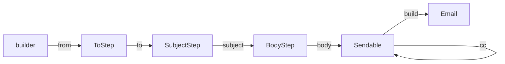
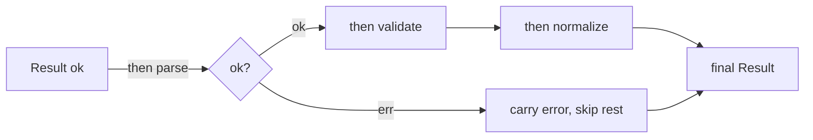

# Fluent Interface — Senior Level

> **Category:** [Object & State Patterns](../README.md) — chain calls that each return the receiver, producing a readable mini-DSL.
> **Prerequisites:** [Junior](junior.md) · [Middle](middle.md)
> **Focus:** **Architecture** and **API design**

---

## Table of Contents

1. [Introduction](#introduction)
2. [Designing an Internal DSL](#designing-an-internal-dsl)
3. [Staged / Progressive Interfaces (Type-State)](#staged-progressive-interfaces-type-state)
4. [Error Handling Mid-Chain](#error-handling-mid-chain)
5. [Command-Query Separation Tension](#command-query-separation-tension)
6. [Debuggability & Stack Traces](#debuggability-stack-traces)
7. [IDE Discoverability](#ide-discoverability)
8. [Immutability & Aliasing](#immutability-aliasing)
9. [Inheritance & Self-Types](#inheritance-self-types)
10. [Liabilities](#liabilities)
11. [Diagrams](#diagrams)
12. [Related Topics](#related-topics)

---

## Introduction

> Focus: **architecture** and **API design**

At the senior level a fluent interface is a **language-design problem**. You are not adding a few `return this`s — you are designing an internal DSL: its grammar (which calls are legal after which), its error model (what happens when a step is misused), and its ergonomics (what the IDE shows the caller next). The decisions that matter:

- Should illegal call *order* be a **compile error** (type-state) or a runtime check?
- How do errors propagate **mid-chain** without breaking fluency?
- How do you reconcile chaining with **Command-Query Separation**?
- How bad are the **stack traces**, and can you mitigate them?
- Mutable receiver or immutable wither — and how does inheritance interact with the **self-type** problem?

---

## Designing an Internal DSL

A fluent interface is an internal DSL — a sublanguage hosted in Go/Java/Python. Treat its surface as a grammar:

```
query   := SELECT cols (FROM table)? (WHERE pred)? (ORDER BY col)? (LIMIT n)? build
```

Design questions that fall out of writing the grammar:

- **Required vs optional** steps (`SELECT` required, `WHERE` optional).
- **Repeatable** steps (`AND`-ing multiple `where`s).
- **Ordering** constraints (`LIMIT` only makes sense last).
- **Terminal** (`build`, `execute`) — the only call returning a non-receiver.

The grammar tells you whether a flat fluent interface suffices, or whether you need a **staged interface** to encode ordering and required steps in the type system.

---

## Staged / Progressive Interfaces (Type-State)

A flat fluent interface lets callers misuse order: `query.where(...).select(...)` or `build()` with required fields missing — caught only at runtime. A **staged interface** (also called a *progressive interface* or *type-state*) uses **return types** to make each call reveal only the *next legal calls*.

### Java — stepped interfaces

```java
public final class Email {
    public interface FromStep    { ToStep from(String addr); }
    public interface ToStep      { SubjectStep to(String addr); }
    public interface SubjectStep { BodyStep subject(String s); }
    public interface BodyStep    { Sendable body(String b); }
    public interface Sendable {
        Sendable cc(String addr);     // optional, repeatable
        Email build();                // terminal
    }

    public static FromStep builder() { return new Impl(); }

    private static final class Impl
        implements FromStep, ToStep, SubjectStep, BodyStep, Sendable {
        // fields...
        public ToStep      from(String a)  { /*...*/ return this; }
        public SubjectStep to(String a)    { /*...*/ return this; }
        public BodyStep    subject(String s){ /*...*/ return this; }
        public Sendable    body(String b)  { /*...*/ return this; }
        public Sendable    cc(String a)    { /*...*/ return this; }
        public Email       build()         { /*...*/ }
    }
}

// Legal:
Email e = Email.builder().from("a@x").to("b@y").subject("Hi").body("...").build();
// Illegal — compile error: FromStep has no `to`
// Email.builder().to(...);
```

The type returned by each step *threads* the grammar through the compiler. Forgetting `subject` is a **compile error**, not a runtime exception. (Note: the `Impl` must be `private`, or callers can cast back to it and skip steps — see [find-bug.md](find-bug.md).)

### Python — runtime staged check

Python has no compile-time type-state. Approximate with a recorded set + validation at the terminal:

```python
class EmailBuilder:
    _required = {"from_addr", "to", "subject", "body"}

    def __init__(self):
        self._set: set[str] = set()
        self._data: dict = {}

    def from_addr(self, a): self._data["from_addr"] = a; self._set.add("from_addr"); return self
    def to(self, a):        self._data["to"] = a;        self._set.add("to");        return self
    def subject(self, s):   self._data["subject"] = s;   self._set.add("subject");   return self
    def body(self, b):      self._data["body"] = b;      self._set.add("body");      return self

    def build(self):                                       # terminal
        missing = self._required - self._set
        if missing:
            raise ValueError(f"missing required steps: {sorted(missing)}")
        return Email(**self._data)
```

### Go — options + required positional args

Go encodes "required" as **positional parameters** to the constructor, and "optional" as functional options:

```go
// from + to + subject are required (positional); rest optional.
func NewEmail(from, to, subject string, opts ...Option) (*Email, error) { /*...*/ }
```

The compiler enforces the required three; options handle the rest. This is the idiomatic Go answer to type-state.

---

## Error Handling Mid-Chain

A chain has no natural place to put a `try/catch` between steps. Three strategies:

### 1. Throw at the terminal (defer validation)

Each step records intent; `build()` validates and throws once. Best for builders.

### 2. Accumulate errors (collect, don't throw)

```java
public Check<T> satisfies(Predicate<T> p, String msg) {
    if (!p.test(value)) errors.add(msg);
    return this;                       // keep chaining
}
public T orThrow() {                   // report all at once
    if (!errors.isEmpty()) throw new ValidationException(errors);
    return value;
}
```

Better UX: the caller sees *every* problem, not just the first.

### 3. Result/Either-carrying chain (railway-oriented)

Each step returns a wrapper that short-circuits on the first error:

```python
class Result:
    def __init__(self, value=None, error=None):
        self.value, self.error = value, error

    def then(self, fn):
        if self.error is not None:
            return self                 # short-circuit, skip remaining steps
        try:
            return Result(value=fn(self.value))
        except Exception as e:
            return Result(error=e)

out = (Result(value=raw)
       .then(parse)
       .then(validate)
       .then(normalize))
# out.error holds the first failure; later steps were skipped
```

In Go, the equivalent is the **sticky-error** pattern (`bufio.Scanner.Err()`): the chain stores the first error and every later step becomes a no-op, checked once at the end.

```go
type W struct { w io.Writer; err error }
func (x *W) Write(p []byte) *W {
    if x.err != nil { return x }       // sticky: skip after first error
    _, x.err = x.w.Write(p)
    return x
}
func (x *W) Err() error { return x.err }  // checked once, at the end
```

---

## Command-Query Separation Tension

**Command-Query Separation (CQS)** says a method should either *do* something (command, returns `void`) or *answer* something (query, returns data) — never both. A fluent interface **deliberately violates** this: a setter is a command, yet it returns the receiver so you can keep chaining.

This is a *considered* violation, and it's why some authors dislike fluent APIs. Guidelines to keep it sane:

- The value a step returns is **always the receiver** (or a copy), never *new information*. It's not a "query result," it's "the same conversation."
- Keep **genuine queries out of the chain.** `list.add(x).size()` is the bad case: `size()` is a real query and chaining it hides that.
- Reserve a clear **terminal** that returns the real query result, ending the command sequence.

Fowler's own framing: a fluent interface trades a *principle* (CQS) for *readability*, and that trade is only worth it when the chain genuinely reads better.

---

## Debuggability & Stack Traces

The biggest senior-level liability. A chain spread across lines is still effectively *one statement*:

```java
order.lines()
    .stream()
    .map(Line::price)      // NullPointerException here
    .reduce(ZERO, BigDecimal::add);
```

The stack trace points at the whole statement; identifying *which* lambda NPE'd takes work. Mitigations:

- **One step per line** so line-number info (where available) narrows the culprit.
- **Helpful NullPointerExceptions** (Java 14+, `-XX:+ShowCodeDetailsInExceptionMessages`) name the exact expression.
- **Validate eagerly** in each step so the failing step throws *itself* with a clear message, rather than corrupting state that explodes three steps later.
- **Avoid deep lambda nesting** inside a chain — extract named methods that appear in the trace.

The same property hurts breakpoints: you can't easily inspect the intermediate value *between* two chained calls without breaking the chain into temporaries.

---

## IDE Discoverability

A well-designed fluent interface is a **discoverable** API: after typing `.`, autocomplete shows exactly the legal next calls. Staged interfaces amplify this — `from(...)` returns `ToStep`, so the IDE offers *only* `to(...)`. The type system doubles as documentation.

Design implications:
- **Narrow return types** improve autocomplete signal. Returning a broad type (the whole builder) shows every method; returning a stage shows only the next.
- **Name methods to sort well** in the completion list (common prefixes group).
- **Don't expose internal/terminal methods on intermediate stages** — keep the menu short and correct.

---

## Immutability & Aliasing

The mutable chain's aliasing hazard (Middle) becomes an *architectural* choice at scale:

```java
// Mutable: base is a trap if shared
Config base = Config.create().region("us-east-1");
Config a = base.timeout(t1);   // mutates base
Config b = base.timeout(t2);   // a, b, base all identical

// Immutable wither: base is a safe template
Config base = Config.create().withRegion("us-east-1");
Config a = base.withTimeout(t1);  // base untouched
Config b = base.withTimeout(t2);  // a != b, both derive from pristine base
```

For shared/cached/templated configuration, the **wither** is the correct architecture. It also makes the object trivially thread-safe. Cost is allocation, largely reclaimed by escape analysis ([Professional](professional.md)).

---

## Inheritance & Self-Types

Fluent + inheritance hits the **self-type problem**: a base setter returning `BaseBuilder` loses the subtype, so subclass-specific methods drop out of the chain.

```java
class Base { Base a() { /*...*/ return this; } }
class Sub extends Base { Sub b() { /*...*/ return this; } }

new Sub().a().b();   // compile error: a() returns Base, which has no b()
```

Fix with **recursively-bounded generics** (curiously recurring template pattern):

```java
class Base<SELF extends Base<SELF>> {
    @SuppressWarnings("unchecked")
    SELF a() { /*...*/ return (SELF) this; }
}
class Sub extends Base<Sub> {
    Sub b() { /*...*/ return this; }
}

new Sub().a().b();   // OK — a() returns Sub
```

Lombok's `@SuperBuilder` generates exactly this. In Kotlin/Scala, `this`-return inference and extension functions sidestep most of it. In Python it doesn't arise (dynamic typing), and in Go you'd favor composition + options over inheritance entirely.

---

## Liabilities

### Symptom 1: Fluent applied where statements were clearer
A 2-step chain saves nothing and hides breakpoints. Use plain calls.

### Symptom 2: Chaining genuine queries
`x.add(y).contains(z)` blurs CQS. Pull queries out of the chain.

### Symptom 3: Mutable chain shared as a template
Aliasing bugs. Switch to a wither, or document one-shot use loudly.

### Symptom 4: No staged interface where order matters
Runtime errors for misordered calls a type-state design would catch at compile time.

### Symptom 5: Deep lambda chains with no eager validation
An exception three steps downstream from the real bug. Validate per step.

---

## Diagrams

### Staged interface (type-state)



### Railway error handling



---

## Related Topics

- **Next:** [Fluent Interface — Professional](professional.md)
- **Practice:** [Tasks](tasks.md) · [Find-Bug](find-bug.md) · [Optimize](optimize.md) · [Interview](interview.md)
- **Companion:** [Builder pattern](../../../design-patterns/01-creational/03-builder/junior.md) — staged interfaces are the rigorous form of a fluent builder.
- **Related:** [Self-Encapsulation](../05-self-encapsulation/junior.md), [Telescoping Constructor anti-pattern](../../../anti-patterns/02-design/README.md).

---

[← Middle](middle.md) · [Object & State](../README.md) · [Coding Patterns](../../README.md) · **Next:** [Professional](professional.md)
