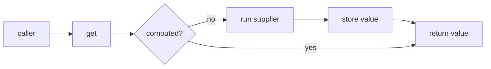
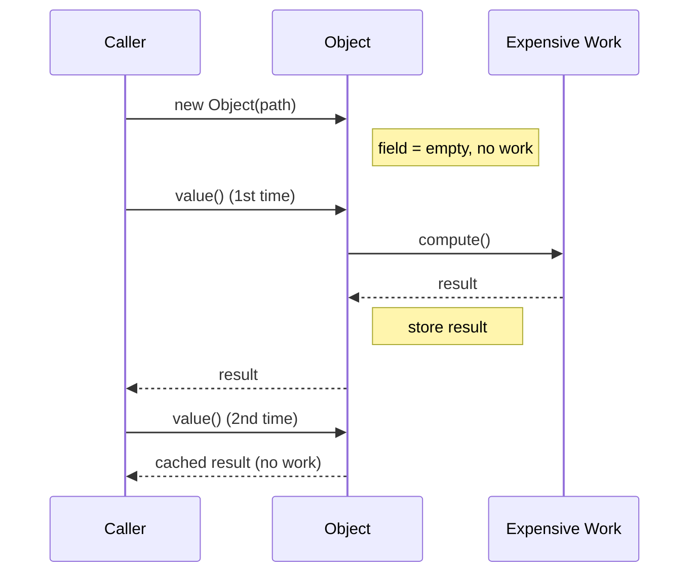

# Lazy Initialization — Junior Level

> **Category:** [Object & State Patterns](../README.md) — defer creating an expensive value until the first time it is actually needed, then cache it.

---

## Table of Contents

1. [Introduction](#introduction)
2. [Prerequisites](#prerequisites)
3. [Glossary](#glossary)
4. [Core Concepts](#core-concepts)
5. [Real-World Analogies](#real-world-analogies)
6. [Mental Models](#mental-models)
7. [Pros & Cons](#pros--cons)
8. [Use Cases](#use-cases)
9. [Code Examples](#code-examples)
10. [Coding Patterns](#coding-patterns)
11. [Clean Code](#clean-code)
12. [Best Practices](#best-practices)
13. [Edge Cases & Pitfalls](#edge-cases--pitfalls)
14. [Common Mistakes](#common-mistakes)
15. [Tricky Points](#tricky-points)
16. [Test Yourself](#test-yourself)
17. [Cheat Sheet](#cheat-sheet)
18. [Summary](#summary)
19. [Further Reading](#further-reading)
20. [Related Topics](#related-topics)
21. [Diagrams](#diagrams)

---

## Introduction

> Focus: **What is it?** and **How to use it?**

**Lazy Initialization** is a coding pattern that delays the creation or computation of a value until the **first time that value is actually used** — then it remembers the result so later accesses are free.

In one sentence: *"Don't build it when you're constructed; build it the first time someone asks, then keep it."*

### Why this matters

Consider an object whose constructor eagerly does everything:

```java
class Report {
    private final byte[] thumbnail = renderThumbnail(); // 200 ms, every Report
}
```

Every `new Report()` pays 200 ms to render a thumbnail — even for the thousands of reports nobody ever looks at. Lazy initialization moves that cost to the moment of first use:

```java
class Report {
    private byte[] thumbnail; // null until needed

    byte[] thumbnail() {
        if (thumbnail == null) {
            thumbnail = renderThumbnail(); // paid once, on first call
        }
        return thumbnail;
    }
}
```

Now construction is instant, and you only pay the 200 ms for reports someone actually views. Pay for what you use, when you use it.

---

## Prerequisites

- **Required:** Fields, constructors, and accessor methods (getters).
- **Required:** The concept of a "null/None/zero" sentinel meaning *"not computed yet"*.
- **Helpful:** [Self-Encapsulation](../05-self-encapsulation/junior.md) — accessing fields through a getter is what lets you slip laziness in without touching callers.

---

## Glossary

| Term | Definition |
|------|-----------|
| **Lazy initialization** | Creating a value on first access rather than at construction. |
| **Eager initialization** | The opposite — computing the value up front, in the constructor. |
| **Backing field** | The private slot that holds the cached value (and a marker for "not yet computed"). |
| **Value holder** | A small wrapper object whose only job is to hold and lazily produce a value. |
| **Virtual proxy** | A stand-in object that looks like the real one but defers loading it until used (GoF). |
| **Lazy loading** | The ORM form: a related entity/collection is fetched only when first accessed. |
| **Thunk** | A zero-argument function that, when called, computes the deferred value. |
| **Memoization** | The *keyed* generalization — caching results per input. Lazy init is the one-value case. |

---

## Core Concepts

### 1. Defer the work

The value is **not** computed in the constructor. The field starts empty (`null`, `None`, zero, or an "uninitialized" flag).

### 2. Compute on first access

The first call to the accessor detects the empty field, computes the value, and stores it.

```
get() → is it cached? ── no ──► compute, store, return
                       └─ yes ─► return cached
```

### 3. Cache for next time

Every subsequent access returns the stored value — no recomputation. This is what distinguishes lazy init from "just compute it in the getter every time."

### 4. Hide it behind an accessor

Callers always go through `thumbnail()`, never the raw field. They don't know (and shouldn't care) whether the value was precomputed or built on demand. That indirection is the **enabler** — see [Self-Encapsulation](../05-self-encapsulation/junior.md).

---

## Real-World Analogies

| Concept | Analogy |
|---|---|
| **Lazy initialization** | A restaurant cooks your dish *when you order it*, not at opening time for every possible customer. |
| **Cached after first access** | A pull-cord light: dark until you pull once, then it stays on. |
| **Virtual proxy** | A book's table of contents — a lightweight stand-in; you only flip to chapter 7 when you need chapter 7. |
| **Lazy loading (ORM)** | A library card catalog: you get the summary instantly; the full book is fetched from the stacks only when requested. |
| **Eager (the alternative)** | A buffet: everything cooked in advance, ready to grab — fast to serve, but wasteful if half goes uneaten. |

---

## Mental Models

**The intuition:** *"Promise now, deliver on first demand, remember forever after."*

```
construction time          first access            later accesses
      │                          │                        │
   field = empty          empty? → compute            return cached
   (no cost)              store result                (no cost)
                          return it
```

Compare the two strategies on a timeline:

```
EAGER:   [====build====]----use----use----use     cost paid at start, always
LAZY:    ----.----------[==build==]use----use      cost paid at first use, only if used
```

If the value is **always** needed, eager is simpler. If it's **expensive and often unused**, lazy wins.

---

## Pros & Cons

| Pros | Cons |
|------|------|
| Faster construction / faster startup | First access pays a latency spike |
| Never pay for values you don't use | Adds a branch and mutable state to a getter |
| Lower memory if the value is never built | Thread-safety becomes a real concern (see senior) |
| Smooths startup cost across the program's life | Harder to reason about *when* work happens |

### When to use:
- The value is **expensive** to compute or hold (I/O, large allocation, network).
- It is **often not needed** in a given run.
- You want **fast startup** and can tolerate a one-time cost later.

### When NOT to use:
- The value is cheap. A lazy guard costs more than just computing it.
- The value is **always** used — then eager is simpler and avoids the first-access spike.
- You're on a hot, latency-sensitive path where an unpredictable spike is unacceptable.

---

## Use Cases

- **Expensive object graphs** — a database connection, a parsed config, a compiled regex.
- **ORM lazy loading** — `user.getOrders()` hits the DB only when first called (Hibernate, Django, SQLAlchemy).
- **Singletons** — the instance is created on first `getInstance()`.
- **Compiled/derived data** — a regex compiled once, a hash computed once, a thumbnail rendered once.
- **Optional subsystems** — a metrics exporter or debug logger that most runs never touch.

---

## Code Examples

### Java — Lazy getter

```java
public final class ImageDocument {
    private final String path;
    private byte[] thumbnail;          // null = not yet rendered

    public ImageDocument(String path) {
        this.path = path;              // cheap: no rendering here
    }

    public byte[] thumbnail() {
        if (thumbnail == null) {       // first access only
            thumbnail = render(path);  // expensive
        }
        return thumbnail;
    }

    private static byte[] render(String path) { /* slow */ return new byte[0]; }
}
```

**Highlights:**
- Constructor is cheap — no rendering.
- `null` is the "not computed yet" marker.
- This getter is **not** thread-safe — that's covered at the [senior](senior.md) level.

---

### Python — `functools.cached_property`

```python
import functools

class ImageDocument:
    def __init__(self, path: str) -> None:
        self.path = path               # cheap

    @functools.cached_property
    def thumbnail(self) -> bytes:
        return self._render()          # runs once, on first attribute access

    def _render(self) -> bytes:
        ...                            # slow
        return b""

doc = ImageDocument("a.png")
doc.thumbnail   # computes and caches
doc.thumbnail   # returns the cached bytes — no recompute
```

> **Pythonic note:** `cached_property` stores the result in the instance `__dict__` under the same name, so after the first access the descriptor is bypassed entirely. It is **not** thread-safe by itself (see [senior](senior.md)).

---

### Go — `sync.Once`

> **Go note:** Go has no constructors or property accessors, so lazy init is an explicit accessor backed by `sync.Once`, which guarantees the init function runs exactly once even under concurrency.

```go
package doc

import "sync"

type ImageDocument struct {
    path      string
    once      sync.Once
    thumbnail []byte
}

func New(path string) *ImageDocument {
    return &ImageDocument{path: path} // cheap
}

// Thumbnail renders on first call, caches for the rest.
func (d *ImageDocument) Thumbnail() []byte {
    d.once.Do(func() {
        d.thumbnail = render(d.path) // expensive, runs exactly once
    })
    return d.thumbnail
}

func render(path string) []byte { return nil }
```

**Why `sync.Once`?**
- The naive `if d.thumbnail == nil { ... }` is a data race under concurrent access.
- `sync.Once.Do` runs the function exactly once and is safe for all goroutines.
- It is the idiomatic Go answer to lazy initialization.

---

## Coding Patterns

### Pattern 1: Null/None as the "not computed" marker

```python
class Config:
    def __init__(self) -> None:
        self._parsed = None          # None = not parsed yet

    def parsed(self) -> dict:
        if self._parsed is None:
            self._parsed = self._load()
        return self._parsed
```

Simple and common. **Caveat:** breaks if the computed value can legitimately *be* `None` — then you need a separate boolean flag (see [edge cases](#edge-cases--pitfalls)).

### Pattern 2: Separate "initialized" flag

```java
private boolean loaded = false;
private Config config;

public Config config() {
    if (!loaded) {
        config = load();   // even if load() returns null, we won't recompute
        loaded = true;
    }
    return config;
}
```

Use this when the value can legitimately be `null`/zero.

### Pattern 3: Value Holder

```java
final class Lazy<T> {
    private final java.util.function.Supplier<T> supplier;
    private T value;
    private boolean computed;

    Lazy(java.util.function.Supplier<T> supplier) { this.supplier = supplier; }

    T get() {
        if (!computed) { value = supplier.get(); computed = true; }
        return value;
    }
}

// Usage
Lazy<byte[]> thumb = new Lazy<>(() -> render(path));
```

A reusable holder that wraps *any* deferred computation. This is the building block ORMs and proxies use.



---

## Clean Code

### Naming

| ❌ Bad | ✅ Good |
|---|---|
| `getThumbnailIfNotNullElseRender()` | `thumbnail()` — callers shouldn't see the mechanism |
| `tmp`, `cache`, `x` for the backing field | `thumbnail`, `parsedConfig` — name it for the value |
| boolean named `flag` | `loaded`, `initialized` — say what it tracks |

### Keep the laziness invisible

The accessor's signature must look identical to a plain getter. A caller writing `doc.thumbnail()` should not need to know whether the value was precomputed. That symmetry is what makes lazy init a safe, local change.

---

## Best Practices

1. **Hide it behind an accessor.** Never let callers read the raw backing field.
2. **Pick the right marker.** Use a boolean flag if the value can legitimately be null/zero.
3. **Keep the init function pure-ish.** Surprising side effects in a getter are a debugging nightmare.
4. **Document the latency.** A getter that may block on I/O should say so.
5. **Default to eager for cheap or always-used values.** Lazy is an optimization, not a default.
6. **In Go, reach for `sync.Once`.** In Python, `functools.cached_property` or `lru_cache`.

---

## Edge Cases & Pitfalls

- **The value is legitimately `null`/zero** — `if (x == null)` re-runs the init forever. Use a separate flag.
- **The init fails** — if `compute()` throws, do you cache the failure or retry next time? Decide deliberately.
- **Concurrent first access** — two threads both see "not computed" and both compute. The naive lazy getter is a **race condition** (the heart of the [senior](senior.md) treatment).
- **Memory retention** — once computed, the value lives as long as the object. Lazy init *trades startup time for held memory*.
- **First-access latency spike** — fine for a thumbnail, dangerous on a request hot path.

---

## Common Mistakes

1. **Using `null` as the marker when `null` is a valid result** — infinite recomputation.
2. **Recomputing on every call** (forgetting to store) — that's not lazy init, it's just a slow getter.
3. **Ignoring thread safety** — works in tests, races in production.
4. **Lazy-initializing a cheap value** — the guard costs more than the work.
5. **Doing heavy I/O inside what looks like a trivial getter** — callers get surprised by latency.

---

## Tricky Points

- **Lazy init vs memoization.** Lazy init caches **one** value; [memoization](../03-memoization-and-caching/junior.md) caches **many**, keyed by input. Lazy init is the single-key special case.
- **Lazy init vs eager.** Eager pays at construction; lazy pays at first use. Neither is universally better — it depends on whether the value is used.
- **The getter is no longer pure.** It mutates internal state (the cache) on first call. That's fine, but it means the field is no longer truly `final`/immutable.

---

## Test Yourself

1. What two things must a lazy accessor do on first access?
2. Why can't you always use `null` as the "not computed" marker?
3. What's the difference between lazy initialization and memoization?
4. When is eager initialization the better choice?
5. Why is the naive lazy getter unsafe under concurrency?

<details><summary>Answers</summary>

1. Compute the value, and store it so later accesses return the cached result.
2. If the computed value can legitimately be `null`, the guard `if (x == null)` will recompute forever. Use a separate boolean flag.
3. Lazy init caches a single value; memoization caches many results keyed by their inputs. Lazy init is the one-key case.
4. When the value is cheap, or always used, or when a first-access latency spike is unacceptable.
5. Two threads can both observe "not computed," both run the init, and produce duplicate work or a torn/partially-constructed value visible to another thread.

</details>

---

## Cheat Sheet

```java
// Java — lazy getter
T value;
T value() { if (value == null) value = compute(); return value; }
```

```python
# Python
@functools.cached_property
def value(self): return self._compute()
```

```go
// Go — sync.Once
func (x *X) Value() T { x.once.Do(func() { x.value = compute() }); return x.value }
```

---

## Summary

- Lazy initialization defers building a value until first use, then caches it.
- It trades **startup/construction time** for a **first-access latency spike** and **held memory**.
- Use it for expensive, often-unused values; prefer eager for cheap or always-used ones.
- The naive getter is **not thread-safe** — the central senior-level concern.
- It is the single-value ancestor of [memoization](../03-memoization-and-caching/junior.md), enabled by [self-encapsulation](../05-self-encapsulation/junior.md).

---

## Further Reading

- Martin Fowler, *Patterns of Enterprise Application Architecture* — "Lazy Load" and "Value Holder".
- GoF, *Design Patterns* — the **Virtual Proxy** form of lazy loading.
- Python docs — [`functools.cached_property`](https://docs.python.org/3/library/functools.html#functools.cached_property).
- Go docs — [`sync.Once`](https://pkg.go.dev/sync#Once).

---

## Related Topics

- **Next:** [Lazy Initialization — Middle](middle.md)
- **Enabler:** [Self-Encapsulation](../05-self-encapsulation/junior.md) — accessors let you add laziness without touching callers.
- **Generalization:** [Memoization & Caching](../03-memoization-and-caching/junior.md) — keyed lazy init.
- **Companion:** [Object Pool](../04-object-pool/junior.md), [Fluent Interface](../01-fluent-interface/junior.md).

---

## Diagrams



[← Object & State](../README.md) · [Coding Patterns](../../README.md) · **Next:** [Lazy Initialization — Middle](middle.md)
