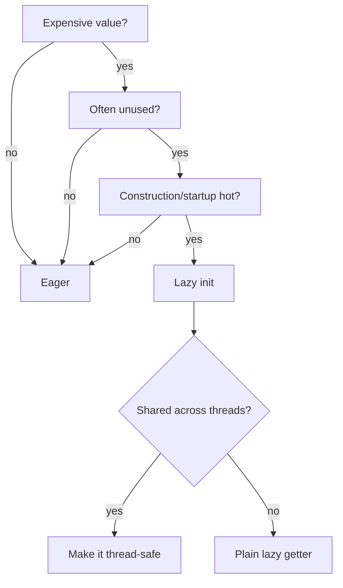
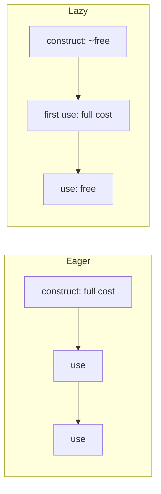

# Lazy Initialization — Middle Level

> **Category:** [Object & State Patterns](../README.md) — defer creating an expensive value until first use, then cache it.

> **Prerequisite:** [Junior](junior.md)
> **Focus:** **Why** and **When**

---

## Table of Contents

1. [Introduction](#introduction)
2. [When to Use Lazy Initialization](#when-to-use-lazy-initialization)
3. [When NOT to Use It](#when-not-to-use-it)
4. [Real-World Cases](#real-world-cases)
5. [Production-Grade Code](#production-grade-code)
6. [Trade-offs](#trade-offs)
7. [Alternatives](#alternatives)
8. [Refactoring Toward Lazy Init](#refactoring-toward-lazy-init)
9. [Edge Cases](#edge-cases)
10. [Tricky Points](#tricky-points)
11. [Best Practices](#best-practices)
12. [Summary](#summary)
13. [Diagrams](#diagrams)

---

## Introduction

> Focus: **Why** and **When**

The junior skill is *writing* a lazy getter. The middle skill is *deciding whether you should* — and recognizing when laziness is paying off versus when it's just adding a branch, a bug surface, and held memory for no benefit.

Lazy initialization is fundamentally a **bet**: *this value is expensive, and there's a real chance nobody will need it.* The bet pays when:

- construction is on a critical path (startup, request entry), **and**
- the deferred value is genuinely costly, **and**
- a meaningful fraction of objects never touch it.

If any of those is false, eager initialization is simpler and you should prefer it.

---

## When to Use Lazy Initialization

Use it when **all** of these hold:

1. **The value is expensive** — heavy allocation, I/O, network, parsing, or CPU.
2. **It's frequently unused** — many instances never access it in a given run.
3. **Construction is hot** — you're constructing many objects, or startup latency matters.
4. **A one-time first-access cost is acceptable** — the caller can tolerate the spike.

### Strong-fit examples

- Startup: parsing config, building a connection pool, compiling regexes — only when first touched.
- Per-object derived data: a thumbnail, a serialized form, an aggregate that few callers read.
- ORM associations: `order.getLineItems()` shouldn't run a query when you only needed `order.getTotal()`.
- Optional subsystems: a metrics exporter wired up only if metrics are enabled.

---

## When NOT to Use It

| Symptom | Better choice |
|---|---|
| The value is cheap to compute | Eager — just compute it in the constructor |
| The value is always used | Eager — you pay anyway, so avoid the spike + complexity |
| You're on a latency-critical hot path | Eager (warm it at startup) — avoid the unpredictable spike |
| You need the value to be `final`/immutable | Eager — laziness requires mutable backing state |
| Many threads share the object | Lazy is fine, but you **must** make it thread-safe (see [senior](senior.md)) |

> **Default to eager.** Lazy is an optimization you apply when a profiler or a clear architectural reason justifies it — not the reflexive choice.

---

## Real-World Cases

### 1. Hibernate / JPA lazy associations

```java
@Entity
class Order {
    @OneToMany(fetch = FetchType.LAZY) // default for collections
    private List<LineItem> items;
}
```

`order.getItems()` issues the `SELECT` only on first access. This is lazy init at the framework level — and the source of two infamous failure modes:

- **N+1 queries:** looping over 100 orders and touching `getItems()` each time fires 1 + 100 queries.
- **`LazyInitializationException`:** accessing `getItems()` after the Hibernate session closed — the proxy has no session to load through.

Both are covered in depth at [senior](senior.md).

### 2. Django / SQLAlchemy

```python
order = Order.objects.get(pk=1)
order.items.all()   # Django: query runs here, not above
```

```python
order = session.get(Order, 1)
order.items          # SQLAlchemy: lazy='select' triggers a query on access
```

Same pattern, same N+1 trap. The fix is eager loading where you *know* you need the relation: `select_related` / `prefetch_related` (Django), `joinedload` (SQLAlchemy).

### 3. Lazy singletons

```python
_pool = None

def get_pool():
    global _pool
    if _pool is None:
        _pool = create_connection_pool()  # built on first call
    return _pool
```

The pool is created the first time anyone needs a connection — not at import time.

### 4. Compiled regexes and derived caches

```python
class Validator:
    @functools.cached_property
    def _pattern(self):
        return re.compile(self.raw_pattern)  # compiled once, on first match()
```

Compiling a regex you might never use is wasted work; lazy init skips it.

---

## Production-Grade Code

### Java — lazy field with an "initialized" flag

```java
public final class ReportView {
    private final ReportData data;
    private Summary summary;       // may legitimately be "empty" Summary
    private boolean summaryReady;  // separate flag — value could be null-ish

    public ReportView(ReportData data) {
        this.data = data;          // cheap
    }

    public Summary summary() {
        if (!summaryReady) {
            summary = computeSummary(data); // expensive aggregation
            summaryReady = true;
        }
        return summary;
    }

    private static Summary computeSummary(ReportData d) { /* slow */ return new Summary(); }
}
```

The boolean flag means even a `null` (or empty) summary is computed exactly once. **Not thread-safe** — see [senior](senior.md).

### Python — `cached_property` vs manual

```python
import functools

class ReportView:
    def __init__(self, data: "ReportData") -> None:
        self.data = data                    # cheap

    @functools.cached_property
    def summary(self) -> "Summary":
        return self._compute_summary()      # runs once, cached in instance dict

    def _compute_summary(self) -> "Summary":
        ...                                 # slow aggregation
        return Summary()
```

> **Why `cached_property` over `@property` + manual flag?** It's less code, stores the result in `self.__dict__["summary"]`, and after the first read the descriptor protocol is bypassed — subsequent reads are plain dict lookups. The trade-off: it needs a writable `__dict__` (no `__slots__` without the name listed), and it is **not** thread-safe on its own.

### Go — `sync.Once` with error handling

```go
package report

import "sync"

type ReportView struct {
    data    ReportData
    once    sync.Once
    summary Summary
    err     error
}

func (v *ReportView) Summary() (Summary, error) {
    v.once.Do(func() {
        v.summary, v.err = computeSummary(v.data) // expensive, exactly once
    })
    return v.summary, v.err
}

func computeSummary(d ReportData) (Summary, error) { return Summary{}, nil }
```

`sync.Once` captures both the value *and* the error, so a failed init isn't retried on every call. If you *want* retry-on-failure, `sync.Once` is the wrong tool — use a mutex you can reset.

---

## Trade-offs

| Dimension | Lazy | Eager |
|---|---|---|
| Construction cost | Cheap | Pays full cost up front |
| First-access cost | Spike | None (already done) |
| Steady-state cost | None (cached) | None |
| Memory if value unused | Zero | Wasted |
| Thread safety | You must add it | Trivially safe (immutable field) |
| Code complexity | Branch + mutable state | Simplest possible |
| Predictability | Spiky latency | Flat latency |

The decision reduces to: **how likely is the value to be used, and how much does construction-time latency matter?**

---

## Alternatives

### vs Eager initialization

The baseline. If the value is cheap or always used, eager wins on simplicity and predictability.

### vs Memoization

If you cache **many** values keyed by input rather than one fixed value, you want [memoization](../03-memoization-and-caching/junior.md), not lazy init. Lazy init is memoization with exactly one key.

### vs Virtual Proxy (GoF)

When the deferred thing is a whole **object** with a known interface, a [Virtual Proxy](../../../design-patterns/README.md) is the OO form: a stand-in implementing the same interface that loads the real object on first method call. ORMs generate exactly these proxies.

### vs Precompute-at-startup (warm-up)

Sometimes the right answer is the *opposite* of lazy: eagerly warm caches/connections at startup so the first real request doesn't eat the spike. Lazy and warm-up are two ends of *when do we pay?*

---

## Refactoring Toward Lazy Init

Given an eager, expensive field:

```java
public final class SearchIndex {
    private final Map<String, List<Doc>> index = buildIndex(); // slow, in constructor
}
```

**Step 1 — Route reads through an accessor** (if they aren't already). This is [self-encapsulation](../05-self-encapsulation/junior.md): replace direct `this.index` reads internally with `index()`.

**Step 2 — Make the field nullable and move the work into the accessor:**

```java
public final class SearchIndex {
    private Map<String, List<Doc>> index; // null until first query

    private Map<String, List<Doc>> index() {
        if (index == null) {
            index = buildIndex();         // built on first query
        }
        return index;
    }

    public List<Doc> search(String term) {
        return index().getOrDefault(term, List.of());
    }
}
```

**Step 3 — Add thread safety if the object is shared** (covered at [senior](senior.md)).

Because every read already went through `index()`, no call site changed. That is the whole point of doing self-encapsulation first.

---

## Edge Cases

### 1. The value can legitimately be null/empty

`if (x == null)` recomputes forever. Use a separate `initialized` boolean.

### 2. Initialization throws

Decide: cache the failure (fast-fail forever) or leave the field empty (retry next call). `sync.Once` and `cached_property` both *cache* — including a thrown exception's effect in some cases. Be deliberate.

### 3. Reentrancy

If `compute()` indirectly calls the same accessor, you can recurse or deadlock (especially with locks). Lazy graphs with cycles need care.

### 4. Serialization

A lazily-computed field that's `null` at serialization time may serialize as absent. Force initialization before serializing, or mark the field transient and recompute on load.

---

## Tricky Points

- **Lazy init makes a getter impure.** It mutates the cache on first call. Treat the getter as a command-that-returns, not a pure query.
- **`cached_property` and `@OneToMany(LAZY)` are the same idea** — one in language form, one in framework form. Recognizing that unifies a lot of "magic."
- **Lazy loading can leak your data-access boundary.** If a view-layer template triggers a DB query by touching a lazy field, your persistence concern just bled into the view. That's the architectural cost behind `LazyInitializationException`.
- **Double-checked locking exists for a reason** — naive synchronization on every access kills the performance you were trying to gain. See [senior](senior.md).

---

## Best Practices

1. **Default to eager; reach for lazy with evidence.**
2. **Use a flag when the value can be null/empty.**
3. **Make shared lazy fields thread-safe** (`sync.Once`, holder idiom, DCL with `volatile`).
4. **Decide your failure policy** (cache vs retry) explicitly.
5. **In ORMs, lazy-load by default but eager-fetch known access paths** to avoid N+1.
6. **Keep the accessor's signature identical to a plain getter** so laziness stays invisible.

---

## Summary

- Lazy init is a bet that an expensive value won't always be needed.
- Use it when construction is hot, the value is costly, and it's often unused.
- ORMs apply it as lazy loading — powerful, but the source of N+1 and `LazyInitializationException`.
- It trades startup time for a first-access spike and held memory.
- Default to eager; make any shared lazy field thread-safe.

---

## Diagrams

### Decision



### Lazy vs eager cost over time



[← Junior](junior.md) · [Object & State](../README.md) · **Next:** [Senior](senior.md)
