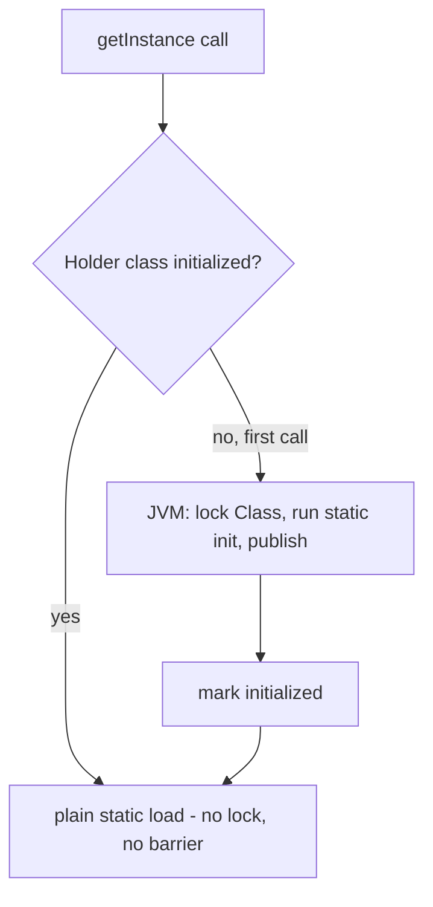
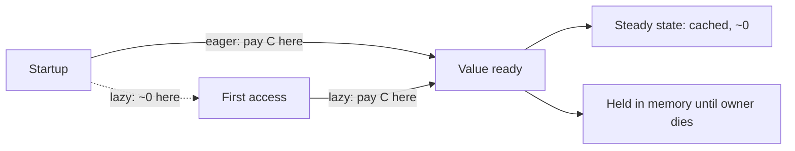

# Lazy Initialization — Professional Level

> **Category:** [Object & State Patterns](../README.md) — defer creating an expensive value until first use, then cache it.

> **Prerequisites:** [Junior](junior.md) · [Middle](middle.md) · [Senior](senior.md)
> **Focus:** **Under the hood**

---

## Table of Contents

1. [Introduction](#introduction)
2. [JVM Class-Init Locking Mechanics](#jvm-class-init-locking-mechanics)
3. [volatile Read Cost and Acquire/Release](#volatile-read-cost-and-acquirerelease)
4. [sync.Once Internals](#synconce-internals)
5. [Python cached_property Descriptor Mechanics](#python-cached_property-descriptor-mechanics)
6. [Startup Latency vs First-Access Spike](#startup-latency-vs-first-access-spike)
7. [Memory Retention and GC](#memory-retention-and-gc)
8. [Benchmarks](#benchmarks)
9. [Diagrams](#diagrams)
10. [Related Topics](#related-topics)

---

## Introduction

Lazy initialization's runtime cost lives in three places: the **synchronization barrier** on the access path, the **one-time construction spike**, and the **memory retained** after construction. At the professional level you should be able to reason about each — why the holder idiom has zero read-barrier cost, what a `volatile` read actually emits, how `sync.Once` reaches a lock-free fast path, and how to model the startup-vs-first-access trade quantitatively.

---

## JVM Class-Init Locking Mechanics

The [holder idiom](senior.md#initialization-on-demand-holder) is fast because of *where* the JVM puts the lock.

The JLS §12.4.2 initialization procedure acquires an **initialization lock on the `Class` object**, sets a state flag, runs the static initializer, then releases. Crucially:

1. The lock is held **only during the first initialization**. Once the class is marked initialized, the JIT compiles `Holder.INSTANCE` to a **plain static field load** — no lock, no barrier, no flag check in the hot path.
2. The class-init happens-before edge means the constructed instance is safely published to every thread that later reads the field — for free.

So the holder idiom is "DCL done by the JVM," but with the recheck-and-barrier cost amortized to *zero* after the one-time init, because the JIT can prove the class is already initialized and elide the guard. That's why it beats hand-written `volatile` DCL, which retains a `volatile` load on every access.

---

## volatile Read Cost and Acquire/Release

A `volatile` field gives DCL its correctness, but it isn't free.

- **x86/x86-64:** a `volatile` *read* is an ordinary `MOV` — the hardware already provides acquire semantics for loads (TSO memory model). The cost is mostly a **compiler barrier** that blocks reordering optimizations, not a CPU fence. A `volatile` *write* emits a store-load fence (`mfork`/`lock`-prefixed instruction), which is the expensive side.
- **ARM/AArch64 (weak memory model):** a `volatile` read emits a real **load-acquire** (`LDAR`) and the write a **store-release** (`STLR`). Both are genuine instructions with measurable cost.

Implication: DCL-with-`volatile` is nearly free on x86 reads but not on ARM. The holder idiom's plain static load is free on *both*, which matters as ARM (Apple Silicon, Graviton) dominates server fleets.

```java
// volatile DCL: one acquire-load per access, forever
private volatile Heavy h;
// holder: one class-init, then plain loads forever
private static final class H { static final Heavy I = new Heavy(); }
```

---

## sync.Once Internals

`sync.Once` reaches a lock-free fast path with a single atomic load:

```go
// simplified from the Go runtime
type Once struct {
    done atomic.Uint32
    m    Mutex
}

func (o *Once) Do(f func()) {
    if o.done.Load() == 0 {   // fast path: one atomic load
        o.doSlow(f)
    }
}

func (o *Once) doSlow(f func()) {
    o.m.Lock()
    defer o.m.Unlock()
    if o.done.Load() == 0 {   // re-check under lock (DCL!)
        defer o.done.Store(1) // store AFTER f() runs
        f()
    }
}
```

Three things to note:

1. It **is** double-checked locking — `done` is the `volatile`-equivalent flag, atomic load/store provide the barriers.
2. `done` is set **after** `f()` returns, so a concurrent `Do` blocks on the mutex until init completes — no half-constructed observation.
3. The common path after init is a single `atomic.Load` of `done` (relaxed-ish, but ordered) — essentially the cost of a plain load on x86, a load-acquire on ARM.

`sync.OnceValue` wraps this and additionally caches the return value, panicking-through on re-entry if `f` panicked.

---

## Python cached_property Descriptor Mechanics

`cached_property` is a **non-data descriptor** (it defines `__get__` but not `__set__`). That's the entire trick:

1. Instance `__dict__` lookups take priority over non-data descriptors.
2. On first access, `__get__` runs the function and writes the result into `instance.__dict__[name]`.
3. On every later access, the attribute is found in `__dict__` *before* the descriptor is consulted — so the descriptor's `__get__` never runs again. No flag, no branch: the cache *is* the instance dict entry.

```python
class cached_property:           # ~stdlib shape
    def __set_name__(self, owner, name): self.attrname = name
    def __get__(self, instance, owner=None):
        if instance is None: return self
        val = self.func(instance)
        instance.__dict__[self.attrname] = val   # shadows the descriptor forever
        return val
```

Consequences:
- Needs a writable `__dict__`. With `__slots__`, the name must be a declared slot or it fails.
- **Post-3.12: no internal lock** — the write isn't atomic against concurrent first reads, so two threads can both compute. The last write wins; if construction is idempotent this is harmless, otherwise add a lock.
- It cannot be invalidated except by `del instance.__dict__[name]`.

---

## Startup Latency vs First-Access Spike

Lazy init reshapes a fixed cost across time. Model it:

- Let `C` = construction cost of the value, `p` = probability a given object/run ever accesses it, `N` = number of objects.
- **Eager total:** `N · C` (paid at construction, on the critical path).
- **Lazy total:** `p · N · C` (paid at first access, spread out).

Lazy wins on *total work* whenever `p < 1`. But "total work" isn't the only axis:

| Axis | Eager | Lazy |
|---|---|---|
| Critical-path (startup) cost | `N·C` up front | ~0 |
| p95 request latency | flat | spiky (the unlucky first request pays `C`) |
| Tail latency | predictable | a cold first-access can blow the SLO |

The professional move: lazy by default, but **warm critical lazies at startup** (touch them in a background goroutine/thread post-boot) so users never eat the spike — getting lazy's "don't build the unused" *and* eager's flat latency.

---

## Memory Retention and GC

Lazy init affects *when* an allocation appears, not whether it can be collected.

- A lazily-built value is reachable from its owner, so it lives as long as the owner — identical retention to eager, just delayed.
- **Soft/weak references** turn lazy init into a *recomputable cache*: hold the value softly; if the GC reclaims it under pressure, the next access rebuilds it.

```java
private SoftReference<Heavy> ref = new SoftReference<>(null);
public synchronized Heavy heavy() {
    Heavy h = ref.get();
    if (h == null) { h = build(); ref = new SoftReference<>(h); }
    return h;
}
```

- This blurs lazy init into [memoization with eviction](../03-memoization-and-caching/professional.md). Watch out: `SoftReference` keeps objects alive longer than you'd think (until near-OOM), which can *increase* GC pressure, not reduce it.
- In Go, there is no soft reference; a weak-ref-like pattern requires `runtime.AddCleanup` / finalizers or a manual size-bounded cache.

---

## Benchmarks

Apple M2 Pro (ARM), single thread, post-warmup. Illustrative, not authoritative — measure your own.

### Java (JMH) — per-access read cost after init

```
Benchmark                         Mode  Cnt   Score   Units
EagerFinalFieldRead               avgt   10   0.4    ns/op
HolderIdiomRead                   avgt   10   0.4    ns/op   (plain static load)
VolatileDCLRead                   avgt   10   1.1    ns/op   (LDAR on ARM)
SynchronizedGetter                avgt   10  15.0    ns/op   (lock every call — avoid)
```

The holder idiom matches a plain field read; naive `synchronized` getters are ~35× slower on the steady-state path.

### Go (`go test -bench`) — per-access after init

```
BenchmarkPlainField-8        1000M   0.3 ns/op
BenchmarkSyncOnce-8           500M   1.8 ns/op   (atomic load of done)
BenchmarkMutexEveryCall-8      60M  18.0 ns/op   (lock every call — avoid)
```

### Python — per-access after first

```
plain attribute read            ~30 ns
cached_property (after 1st)     ~35 ns   (dict lookup, descriptor bypassed)
@property + manual flag         ~80 ns   (method call + branch every access)
lru_cache(maxsize=None)        ~120 ns   (hashing + dict, even for one key)
```

`cached_property` is near-free after the first hit because the descriptor is shadowed; `@property` with a flag pays a method call forever.

---

## Diagrams

### Holder idiom: lock once, free forever



### Where the cost lives



---

## Related Topics

- **JVM class init:** JLS §12.4.2; *Java Concurrency in Practice* (Goetz), §16 on the memory model.
- **Memory model:** JSR-133 FAQ; the Go memory model spec.
- **Generalization:** [Memoization & Caching — Professional](../03-memoization-and-caching/professional.md).
- **Practice:** [Interview](interview.md) · [Tasks](tasks.md) · [Find-Bug](find-bug.md) · [Optimize](optimize.md)

---

[← Senior](senior.md) · [Object & State](../README.md) · **Next:** [Interview](interview.md)
