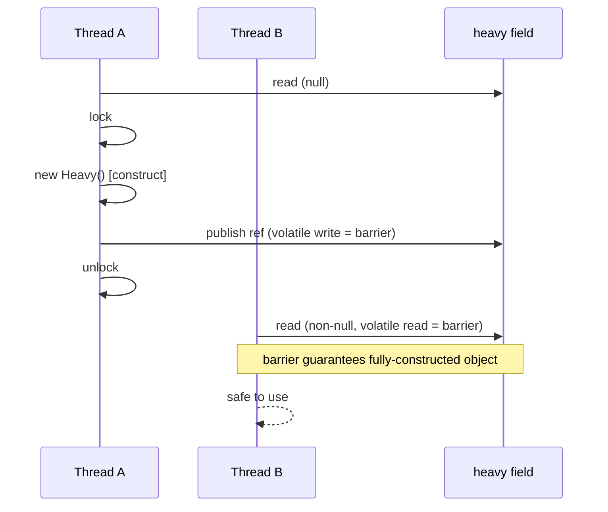
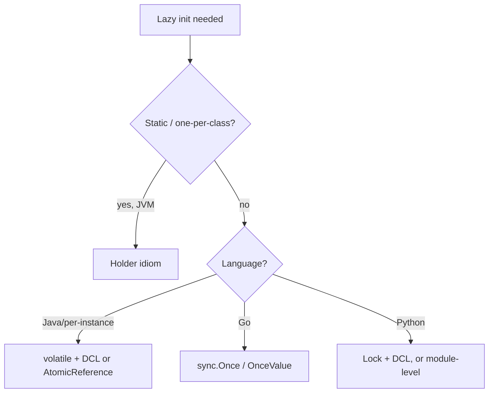

# Lazy Initialization — Senior Level

> **Category:** [Object & State Patterns](../README.md) — defer creating an expensive value until first use, then cache it.

> **Prerequisites:** [Junior](junior.md) · [Middle](middle.md)
> **Focus:** **Thread safety, memory models, and architecture**

---

## Table of Contents

1. [Introduction](#introduction)
2. [The Race in Naive Lazy Init](#the-race-in-naive-lazy-init)
3. [Double-Checked Locking and Why It Was Broken](#double-checked-locking-and-why-it-was-broken)
4. [Initialization-on-Demand Holder](#initialization-on-demand-holder)
5. [Go: sync.Once and atomics](#go-synconce-and-atomics)
6. [Python: locks, cached_property, module laziness](#python-locks-cached_property-module-laziness)
7. [The ORM Lazy-Loading Architecture Problem](#the-orm-lazy-loading-architecture-problem)
8. [When Eager Wins](#when-eager-wins)
9. [Liabilities](#liabilities)
10. [Diagrams](#diagrams)
11. [Related Topics](#related-topics)

---

## Introduction

> Focus: **thread safety, memory models, and architecture**

At the senior level, lazy initialization stops being a getter trick and becomes a **concurrency and memory-model problem**. The naive `if (x == null) x = compute()` is correct in a single thread and catastrophically wrong under concurrency — and the *fixes* (double-checked locking) were themselves broken for years until language memory models caught up.

The senior questions:

- What exactly races, and what can another thread observe?
- Why did double-checked locking fail before Java 5 / the JMM, and what makes `volatile` (or the holder idiom) fix it?
- Which idiom per language: holder, `sync.Once`, `Lock`, `atomic`?
- Where does lazy loading belong architecturally, and where does it leak (N+1, `LazyInitializationException`)?

---

## The Race in Naive Lazy Init

```java
private Heavy heavy;            // not volatile
public Heavy heavy() {
    if (heavy == null) {        // (1) check
        heavy = new Heavy();    // (2) create + publish
    }
    return heavy;
}
```

Two independent failures under concurrency:

**1. Duplicate construction.** Threads A and B both run check (1) before either runs (2). Both construct a `Heavy`. If `Heavy` is a connection pool or a singleton, you now have two — a correctness bug, not just wasted work.

**2. Unsafe publication.** Even with one constructor call, `new Heavy()` is **not atomic**. It is: allocate → run constructor → assign reference. Without a memory barrier, another thread can observe the *reference* (step 3 reordered before step 2 completes) and read a **partially constructed** object — fields still at their default zero values. This is the subtle, terrifying bug: the object "exists" but is half-built.

The same hazard exists in every language without an explicit happens-before edge between the writing thread's construction and the reading thread's access.

---

## Double-Checked Locking and Why It Was Broken

The natural optimization: only lock on the slow path.

```java
private Heavy heavy;
public Heavy heavy() {
    if (heavy == null) {                 // (1) cheap, unsynchronized
        synchronized (this) {
            if (heavy == null) {         // (2) re-check under lock
                heavy = new Heavy();
            }
        }
    }
    return heavy;
}
```

This is **double-checked locking (DCL)**. The intent: pay the lock only on first init, then read lock-free forever.

### Why it was broken before Java 5

The unsynchronized read at (1) has no happens-before relationship with the write inside the lock. Under the **old (pre-JSR-133) memory model**, the compiler/CPU could reorder `heavy = new Heavy()` so the reference was published *before* the constructor finished. Thread B reads a non-null `heavy` at (1), skips the lock entirely, and returns a half-constructed object. DCL was famously declared "broken" — it appeared to work in testing and failed under load.

### The fix: `volatile`

```java
private volatile Heavy heavy;   // the fix is one keyword
```

Under the **Java 5+ memory model (JSR-133)**, a write to a `volatile` field happens-before every subsequent read of it. That barrier forbids the reordering: when thread B sees a non-null `heavy`, it is guaranteed to see a fully constructed object. **DCL is correct if and only if the field is `volatile`.**

> **C++** has the identical history: DCL was unsafe until C++11 gave you `std::atomic` / `std::call_once`. The memory-model story is universal; only the keyword differs.

There is a small read cost to `volatile` (a load barrier), which is why many prefer the holder idiom below — it achieves lazy, thread-safe init with zero synchronization on the read path.

---

## Initialization-on-Demand Holder

The cleanest JVM idiom exploits the **class-initialization guarantee**: the JVM initializes a class lazily, on first use, and does so under a lock it manages — with full happens-before semantics — *exactly once*.

```java
public final class Singleton {
    private Singleton() {}

    private static final class Holder {
        static final Singleton INSTANCE = new Singleton(); // built when Holder first loads
    }

    public static Singleton getInstance() {
        return Holder.INSTANCE;   // triggers Holder's class init on first call
    }
}
```

Why this is the gold standard:

- **Lazy:** `Holder` is not loaded until `getInstance()` is first called. No instance exists before then.
- **Thread-safe:** class initialization is serialized by the JVM with happens-before guarantees — no `volatile`, no `synchronized` in your code.
- **Fast:** after init, `Holder.INSTANCE` is a plain static read — no barrier, no lock, fully inlinable.

The catch: it only works for `static` lazy init (one per class), not per-instance fields, and it can't easily pass runtime parameters into the constructor. For per-instance laziness, use DCL-with-`volatile` or `AtomicReference`.

---

## Go: sync.Once and atomics

Go's memory model makes the idiom explicit and safe by construction.

```go
type Service struct {
    once sync.Once
    conn *Conn
}

func (s *Service) Conn() *Conn {
    s.once.Do(func() {
        s.conn = dial() // runs exactly once; Do establishes happens-before
    })
    return s.conn
}
```

`sync.Once.Do` guarantees the function runs once and that its writes are visible to every goroutine that observes `Do` returning — it *is* the happens-before edge. No manual barriers.

For the read-heavy lock-free path, Go 1.21+ added `sync.OnceValue` / `sync.OnceFunc`:

```go
var loadConfig = sync.OnceValue(func() Config { return parseConfig() })
// loadConfig() computes once, caches, returns the same Config thereafter
```

And `atomic.Pointer` for hand-rolled lock-free lazy init when `Once` semantics don't fit (e.g., you want retry-on-failure):

```go
var cache atomic.Pointer[Heavy]
func get() *Heavy {
    if h := cache.Load(); h != nil { return h }
    h := build()
    cache.CompareAndSwap(nil, h) // a loser of the race just discards its h
    return cache.Load()
}
```

Note this variant *may* build twice (both racers build, one CAS wins) but always *publishes* one — acceptable when `build()` is idempotent and the duplicate is cheap to discard.

---

## Python: locks, cached_property, module laziness

### The GIL is not thread safety

The GIL serializes bytecode, but `if self._x is None: self._x = compute()` spans *many* bytecodes. A thread switch between the check and the assignment lets two threads both compute. The GIL does **not** save you here.

### `functools.cached_property` is not thread-safe (since 3.12)

Before Python 3.12, `cached_property` held a module-wide lock during computation — a notorious bottleneck. **Python 3.12 removed that lock**: `cached_property` is now fast but explicitly *not* thread-safe. Two threads may compute concurrently; one result wins. If you need safety, add your own:

```python
import threading

class Service:
    def __init__(self) -> None:
        self._lock = threading.Lock()
        self._conn = None

    @property
    def conn(self):
        if self._conn is None:                 # fast path, no lock
            with self._lock:
                if self._conn is None:         # double-check under lock
                    self._conn = self._dial()  # CPython refs are atomic → safe publish
        return self._conn
```

DCL works in CPython because reference assignment is atomic and the GIL provides the visibility a `volatile` would in Java. (On a free-threaded/no-GIL build, you'd need the lock to do real work — which it does.)

### Module-level laziness

A module's top-level code runs once, on first import, and import is serialized by an internal lock. So a module-level computed value *is* a thread-safe lazy singleton:

```python
# config.py — parsed once, on first import, thread-safely
CONFIG = _parse_config()
```

For deferring the import cost itself, [PEP 562](https://peps.python.org/pep-0562/) `__getattr__` and `importlib.util.LazyLoader` defer module loading until an attribute is touched.

---

## The ORM Lazy-Loading Architecture Problem

Lazy loading is lazy init applied to persistence — and it's where the pattern's architectural costs bite hardest.

### N+1 queries

```java
for (Order o : orders) {        // 1 query for orders
    total += o.getItems().sum(); // +1 query per order → N+1 total
}
```

Each lazy `getItems()` fires a separate `SELECT`. 1 + N queries where 2 would do. The fix is to **eager-fetch the known access path**:

- JPA: `JOIN FETCH` / entity graphs.
- Django: `prefetch_related("items")`.
- SQLAlchemy: `selectinload(Order.items)`.

Lazy is the right *default* (don't load what you might not use) but the wrong choice once you *know* you'll iterate the relation.

### `LazyInitializationException`

```java
Order o = orderRepo.find(id); // session opens, loads order
// ... session closes (transaction ends) ...
o.getItems(); // throws: the proxy has no session to load through
```

The lazy proxy needs a live persistence context to fetch through. Access it after the session closes and you get `LazyInitializationException` (Hibernate) or `DetachedInstanceError` (SQLAlchemy). This is **a leak of the data-access boundary**: the view or controller assumed it held a fully-loaded object and unknowingly triggered I/O across a closed boundary. The cures — fetch eagerly, use a DTO/projection, or keep the session open via `OpenSessionInView` (an anti-pattern in disguise) — are really about *deciding the loading boundary explicitly* instead of letting a getter decide it implicitly.

This is the senior lesson: **lazy loading hides I/O behind a field access, and hidden I/O eventually crosses a boundary it shouldn't.**

---

## When Eager Wins

Reach for eager initialization — the opposite bet — when:

- **The value is always used.** Lazy only adds a branch, mutable state, and a first-access spike.
- **You can't tolerate the first-access latency.** Warm caches/connections at startup so the first real request is fast.
- **Thread-safety cost outweighs the benefit.** A `volatile` read or lock on every access can cost more than the construction you deferred.
- **You want immutability.** An eager `final` field is trivially thread-safe and reasons cleanly; lazy fields can't be `final`.
- **Fail-fast on startup is desirable.** Eager init surfaces a bad config/connection at boot, not at 3 a.m. on the first request that touches it.

---

## Liabilities

### Symptom 1: A getter that blocks

A field access that triggers I/O or heavy CPU surprises callers and stack traces. Document it, or make the cost explicit (return a `Future`, name it `loadX()`).

### Symptom 2: Cached failures

If init throws and you cache the failure (`sync.Once`, some `cached_property` paths), the object is permanently broken. If you *don't* cache, a transient failure retries forever. Choose deliberately and test both paths.

### Symptom 3: Memory you can't reclaim

Once computed, the value lives as long as its owner. Lazy init that fires for most objects just *delays* memory pressure to first access — you pay both the spike and the retention.

### Symptom 4: Lazy graphs with cycles

Mutually lazy fields can deadlock (two locks, two threads) or infinitely recurse (A's init reads B, B's init reads A). Break cycles or initialize eagerly.

---

## Diagrams

### DCL correctness hinges on `volatile`



### Idiom selection



---

## Related Topics

- **Next:** [Lazy Initialization — Professional](professional.md)
- **Generalization:** [Memoization & Caching](../03-memoization-and-caching/junior.md) — same publication hazards, keyed.
- **Enabler:** [Self-Encapsulation](../05-self-encapsulation/junior.md).
- **Persistence:** [Connection Pooling](../../../../../Backend/backend/README.md), database N+1 — where lazy loading meets I/O.
- **OO form:** Virtual Proxy in [Design Patterns](../../../design-patterns/README.md).

---

[← Middle](middle.md) · [Object & State](../README.md) · **Next:** [Professional](professional.md)
