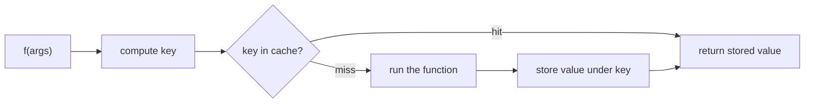
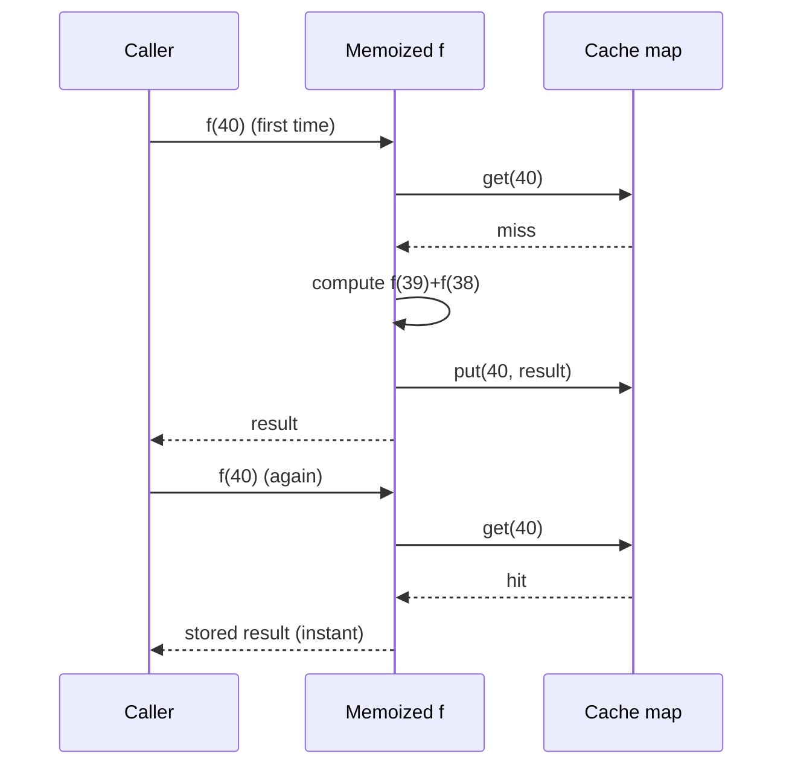

# Memoization & Caching — Junior Level

> **Category:** [Object & State Patterns](../README.md) — cache the result of a pure computation keyed by its inputs so the same answer is never computed twice.

---

## Table of Contents

1. [Introduction](#introduction)
2. [Prerequisites](#prerequisites)
3. [Glossary](#glossary)
4. [Core Concepts](#core-concepts)
5. [Real-World Analogies](#real-world-analogies)
6. [Mental Models](#mental-models)
7. [Pros & Cons](#pros-cons)
8. [Use Cases](#use-cases)
9. [Code Examples](#code-examples)
10. [Coding Patterns](#coding-patterns)
11. [Clean Code](#clean-code)
12. [Best Practices](#best-practices)
13. [Edge Cases & Pitfalls](#edge-cases-pitfalls)
14. [Common Mistakes](#common-mistakes)
15. [Tricky Points](#tricky-points)
16. [Test Yourself](#test-yourself)
17. [Cheat Sheet](#cheat-sheet)
18. [Summary](#summary)
19. [Further Reading](#further-reading)
20. [Related Topics](#related-topics)
21. [Diagrams](#diagrams)

---

## Introduction

> Focus: **What is it?** and **How to use it?**

**Memoization** is a coding pattern: the first time you call a function with some arguments, you compute the answer *and remember it*. Every later call with the *same* arguments returns the remembered answer instead of recomputing.

In one sentence: **trade memory for time** — keep a small table of `inputs → output` and check it before doing work.

### Why this matters

The textbook example is recursive Fibonacci:

```python
def fib(n):
    if n < 2:
        return n
    return fib(n - 1) + fib(n - 2)
```

`fib(40)` makes over **300 million** calls because it recomputes `fib(38)`, `fib(37)`, … thousands of times. With memoization, each `fib(k)` is computed **once**, and `fib(40)` returns in microseconds.

```python
from functools import cache

@cache
def fib(n):
    if n < 2:
        return n
    return fib(n - 1) + fib(n - 2)
```

One line — `@cache` — turns an exponential algorithm into a linear one. That is the power of remembering answers.

---

## Prerequisites

- **Required:** Functions, function arguments, return values.
- **Required:** What a hash map / dictionary is (`key → value` lookup).
- **Helpful:** The idea of a [pure function](https://en.wikipedia.org/wiki/Pure_function) — same input always gives the same output, with no side effects.
- **Helpful:** [Lazy Initialization](../02-lazy-initialization/junior.md) — memoization is "lazy init, but keyed by arguments."

---

## Glossary

| Term | Definition |
|------|-----------|
| **Memoization** | Caching a function's return value keyed by its arguments. |
| **Cache** | The store of remembered answers (usually a hash map). |
| **Cache hit** | The key is already present — return the stored value. |
| **Cache miss** | The key is absent — compute, store, then return. |
| **Cache key** | The value (derived from the arguments) used to look up an answer. |
| **Pure function** | A function whose output depends only on its inputs, with no side effects. |
| **Eviction** | Removing entries to bound the cache's size (covered at higher levels). |

---

## Core Concepts

### 1. Check before you compute

Every memoized function follows the same shape:

```
if key in cache:        # hit
    return cache[key]
value = compute(...)    # miss
cache[key] = value
return value
```

### 2. The key is derived from the arguments

For `fib(n)`, the key is `n`. For `distance(a, b)`, the key is the pair `(a, b)`. The key must uniquely identify the inputs.

### 3. The function must be pure

If the function reads the clock, a database, or a global variable, the "answer" can change between calls — so a stored answer goes **stale**. Memoization is only safe for **pure** functions. (This is the single most important rule; see [Common Mistakes](#common-mistakes).)

### 4. Memoization vs caching in general

| | Memoization | Caching (general) |
|---|---|---|
| Scope | One function's results | Anything: DB rows, HTTP responses, rendered pages |
| Where | In-process, in memory | In-process, Redis, CDN, browser… |
| Bound | Often unbounded | Usually bounded (size / TTL / eviction) |
| Invalidation | Rarely needed (pure inputs) | Central concern |

Memoization is the **simplest, purest** corner of caching. The rest of this topic generalizes from it.

---

## Real-World Analogies

| Concept | Analogy |
|---|---|
| **Cache hit** | You ask a friend a question they answered yesterday; they repeat the answer instantly. |
| **Cache miss** | A new question — they think it through, then remember it for next time. |
| **Cache key** | The exact question. A slightly different question is a *different* key. |
| **Stale cache** | Asking "what time is it?" — yesterday's answer is wrong. (Don't memoize impure functions.) |
| **Eviction** | A notepad with limited space; old notes get erased to make room. |

---

## Mental Models

**The intuition:** *"Look it up. If it's not there, do the work, then write it down."*

```
        call f(args)
             │
       key = f(args)
             │
      ┌──────┴──────┐
      ▼             ▼
  in cache?      not in cache
      │             │
   return        compute
   stored        store under key
   value         return value
```

Compare the work done:

```
fib(40) without memo:  ~330,000,000 calls   (exponential)
fib(40) with memo:     ~40 real computations (linear) + many instant hits
```

The cache turns a tree of repeated work into a straight line.

---

## Pros & Cons

| Pros | Cons |
|------|------|
| Eliminates repeated computation | Uses memory to store results |
| One-line wins in many languages (`@cache`) | Only correct for **pure** functions |
| Turns exponential recursion into linear | Unbounded caches can leak memory |
| Transparent to callers (same signature) | Cache key design can be subtle |
| No algorithm change required | Stale values if inputs aren't truly fixed |

### When to use:
- An **expensive, pure** function called repeatedly with **repeating** arguments.
- Recursive problems with **overlapping subproblems** (see [Dynamic Programming](../../../../../Data/datastructures-and-algorithms/13-dynamic-programming/README.md)).
- A small, fixed set of inputs that recur often.

### When NOT to use:
- The function is **cheap** — the cache lookup costs more than recomputing.
- Inputs almost never repeat — you store answers you never reuse.
- The function is **impure** (reads time, randomness, mutable state).

---

## Use Cases

- **Fibonacci / dynamic programming** — the classic overlapping-subproblems case.
- **Parsing / compilation** — memoize parsing a grammar rule at a position.
- **Expensive pure transforms** — image thumbnails, formatting, regex compilation.
- **Configuration lookups** — resolve a setting once, reuse it.
- **Property derivation** — a computed field on an object (price after tax) computed once.
- **API clients** — cache idempotent `GET`s by URL (this edges into general caching).

---

## Code Examples

### Python — the decorator does it for you

```python
from functools import lru_cache

@lru_cache(maxsize=None)        # maxsize=None means "unbounded"
def fib(n: int) -> int:
    if n < 2:
        return n
    return fib(n - 1) + fib(n - 2)

print(fib(50))                  # instant
print(fib.cache_info())         # hits=48, misses=51, ...
```

**Highlights:**
- `@lru_cache` / `@cache` is the standard library tool — reach for it first.
- It keys on the *arguments*, so arguments must be **hashable** (no lists/dicts).
- `cache_info()` shows hits vs misses — your tuning dashboard.

---

### Java — a hand-rolled `HashMap` cache

```java
import java.util.HashMap;
import java.util.Map;

public final class Fib {
    private final Map<Integer, Long> cache = new HashMap<>();

    public long fib(int n) {
        if (n < 2) return n;
        Long hit = cache.get(n);
        if (hit != null) return hit;           // cache hit
        long value = fib(n - 1) + fib(n - 2);  // cache miss
        cache.put(n, value);
        return value;
    }
}
```

**Highlights:**
- The cache is an instance field — each `Fib` object has its own table.
- Check, compute, store — the universal shape.
- `computeIfAbsent` (shown at the middle level) expresses this more cleanly.

---

### Go — a map plus a small wrapper

```go
package fibx

var cache = map[int]int{}

func Fib(n int) int {
    if n < 2 {
        return n
    }
    if v, ok := cache[n]; ok { // cache hit
        return v
    }
    v := Fib(n-1) + Fib(n-2)   // cache miss
    cache[n] = v
    return v
}
```

> **Go note:** this package-level map is **not safe for concurrent use** — two goroutines writing at once will panic. The middle and senior levels add a mutex. For now, single-goroutine use is fine.

---

## Coding Patterns

### Pattern 1: Compute-if-absent

The cleanest expression of "check, compute, store" in each language:

```java
// Java
long value = cache.computeIfAbsent(n, k -> fib(k - 1) + fib(k - 2));
```

```python
# Python — let the decorator do it
@cache
def f(n): ...
```

```go
// Go
v, ok := cache[n]
if !ok {
    v = compute(n)
    cache[n] = v
}
```

### Pattern 2: Bottom-up table (no recursion)

Sometimes you fill the cache iteratively instead of recursively:

```python
def fib(n: int) -> int:
    table = [0, 1]
    for i in range(2, n + 1):
        table.append(table[i - 1] + table[i - 2])
    return table[n]
```

This is **tabulation** — the iterative cousin of memoization. Same idea, no recursion, no hidden cache. See [Dynamic Programming](../../../../../Data/datastructures-and-algorithms/13-dynamic-programming/README.md).



---

## Clean Code

### Naming

| ❌ Bad | ✅ Good |
|---|---|
| `m`, `c`, `tmp` for the cache | `cache`, `fibCache`, `memo` |
| Hand-rolling a cache when a tool exists | `@lru_cache` (Python), Caffeine (Java) |
| Mixing compute and cache logic | Compute in one function, wrap it for caching |

### Keep the pure function separate

Write the real logic as a clean, pure function. Add caching *around* it, not *inside* it:

```python
def _slow(n): ...      # pure, testable, no cache
compute = cache(_slow) # caching is a wrapper, not tangled in
```

---

## Best Practices

1. **Reach for the standard tool first.** `functools.lru_cache` (Python), Caffeine/Guava (Java), a `sync.Map` or guarded map (Go).
2. **Only memoize pure functions.** If in doubt, it's not pure.
3. **Make sure arguments are hashable.** Lists and dicts can't be cache keys directly.
4. **Watch memory** — an unbounded cache grows forever. Bound it (next levels).
5. **Measure hits vs misses.** A cache with no hits is pure overhead.

---

## Edge Cases & Pitfalls

- **Unhashable arguments** — `lru_cache` raises `TypeError` if you pass a list. Convert to a tuple first.
- **Mutable default arguments / keys** — if a key object changes after being stored, lookups break.
- **Unbounded growth** — caching every distinct input forever is a memory leak in disguise.
- **`None` as a valid result** — `if cache.get(k):` treats a cached `None`/`0`/`False` as a miss. Check *presence*, not truthiness.
- **Per-instance vs global** — a cache field on each object dies with the object; a module-level cache lives forever.

---

## Common Mistakes

1. **Memoizing an impure function.** Caching `now()` or `random()` returns a frozen, wrong answer forever. **The #1 memoization bug.**
2. **Using truthiness to detect a hit.** `if cache.get(k)` skips legitimately cached `0`/`""`/`None`. Use `if k in cache`.
3. **Forgetting hashability.** Passing a `list` to an `lru_cache`d function crashes.
4. **Never bounding the cache.** Works in tests, leaks in production.
5. **Caching where inputs never repeat.** All misses, no hits — pure waste.

---

## Tricky Points

- **Memoization needs purity; general caching does not** — general caches add *invalidation* to handle changing data.
- **The key is the whole argument set.** `f(1, 2)` and `f(2, 1)` are different keys even if the answer is the same — normalize if order shouldn't matter.
- **Recursion must call the memoized version.** If the recursive call bypasses the cache, you get no speedup (see [find-bug](find-bug.md)).
- **A cache hit on `None` is still a hit.** Distinguish "stored `None`" from "not stored."

---

## Test Yourself

1. What does a memoized function do on a cache *hit*?
2. Why must a memoized function be pure?
3. What's the difference between a cache *hit* and a cache *miss*?
4. Why can't you pass a Python `list` to an `lru_cache`d function?
5. What's the danger of an unbounded cache?

<details><summary>Answers</summary>

1. It returns the previously stored result without recomputing.
2. An impure function's output can change between calls, so a stored answer becomes stale and wrong.
3. Hit: the key is already in the cache, return the stored value. Miss: the key is absent, compute and store it.
4. Lists are unhashable, so they can't be used as dictionary keys (the cache is keyed by arguments). Use a tuple.
5. It grows without limit, eventually exhausting memory — a leak.

</details>

---

## Cheat Sheet

```python
# Python — one line
from functools import cache
@cache
def f(n): ...
```

```java
// Java — compute-if-absent
cache.computeIfAbsent(key, k -> compute(k));
```

```go
// Go — check, compute, store
if v, ok := cache[k]; ok { return v }
v := compute(k); cache[k] = v; return v
```

---

## Summary

- Memoization = remember a **pure** function's result keyed by its arguments.
- Shape: **check the cache → on miss, compute and store → return.**
- Trades **memory for time**; turns exponential recursion into linear.
- Use the standard tool (`@cache`, Caffeine) before hand-rolling.
- Only safe for pure functions; bound the cache to avoid leaks.

---

## Further Reading

- Python docs: [`functools.lru_cache`](https://docs.python.org/3/library/functools.html#functools.lru_cache)
- [Dynamic Programming](../../../../../Data/datastructures-and-algorithms/13-dynamic-programming/README.md) — memoization is the top-down half of DP.
- *Introduction to Algorithms* (CLRS), Chapter 15 — overlapping subproblems.

---

## Related Topics

- **Next:** [Memoization & Caching — Middle](middle.md)
- **Foundation:** [Lazy Initialization](../02-lazy-initialization/junior.md) — compute-once for a single value.
- **Generalizes to:** [Object Pool](../04-object-pool/junior.md) — reusing whole objects, not just values.
- **Algorithmic use:** [Dynamic Programming](../../../../../Data/datastructures-and-algorithms/13-dynamic-programming/README.md).

---

## Diagrams



[Object & State](../README.md) · [Coding Patterns](../../README.md) · **Next:** [Middle](middle.md)
