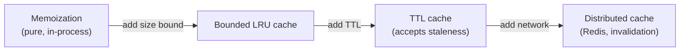
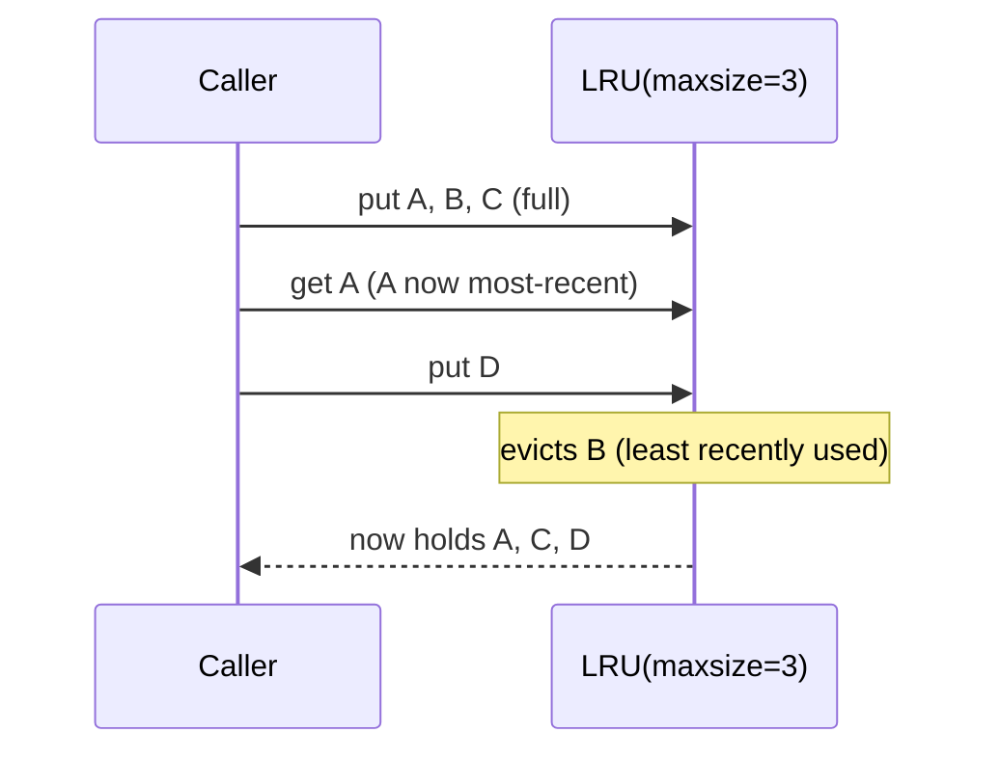

# Memoization & Caching — Middle Level

> **Category:** [Object & State Patterns](../README.md) — store results keyed by inputs, with a clear policy for what to keep and when to drop it.

> **Prerequisite:** [Junior](junior.md)
> **Focus:** **Why** and **When**

---

## Table of Contents

1. [Introduction](#introduction)
2. [When to Use Memoization](#when-to-use-memoization)
3. [When NOT to Use It](#when-not-to-use-it)
4. [Memoization vs General Caching](#memoization-vs-general-caching)
5. [Cache Key Design](#cache-key-design)
6. [Bounding the Cache: Eviction Policies](#bounding-the-cache-eviction-policies)
7. [Production-Grade Code](#production-grade-code)
8. [Trade-offs](#trade-offs)
9. [Edge Cases](#edge-cases)
10. [Tricky Points](#tricky-points)
11. [Best Practices](#best-practices)
12. [Summary](#summary)
13. [Diagrams](#diagrams)

---

## Introduction

> Focus: **Why** and **When**

At the junior level, memoization was "add `@cache` and win." The middle-level skill is knowing **what to cache, how to key it, and how to keep it from eating all your memory**. Three decisions dominate:

- **Is the function pure enough to cache safely?** (correctness)
- **What is the key, exactly?** (correctness *and* hit rate)
- **How big can the cache get, and what gets dropped first?** (memory)

Get these right and a cache is a clean win. Get them wrong and you ship stale data, a memory leak, or a cache that never hits.

---

## When to Use Memoization

Use it when **all** of:

1. The function is **pure** (or pure enough that staleness is acceptable for a bounded time).
2. It is **expensive** relative to a hash-map lookup.
3. The **same inputs recur** often enough that hits outnumber misses.

### Strong-fit examples

- Recursive DP with overlapping subproblems (Fibonacci, edit distance, coin change).
- Compiling a regex or template once per distinct pattern.
- Resolving expensive configuration or feature-flag computations.
- Pure transforms on a small, repeating set of inputs.

---

## When NOT to Use It

| Symptom | Better choice |
|---|---|
| Function is cheap (a few arithmetic ops) | Just recompute — lookup costs more |
| Inputs rarely repeat | Skip caching; it's all misses |
| Function reads time / DB / mutable state | Make it pure first, or use a TTL cache that *expects* staleness |
| Result depends on huge or unhashable args | Reconsider the key, or don't cache |
| Memory is tight and inputs are unbounded | Bound it (LRU) or don't cache |

---

## Memoization vs General Caching

This is the key conceptual split at this level.

| Dimension | **Memoization** | **General caching** |
|---|---|---|
| What's cached | One function's return values | Anything: rows, responses, pages |
| Purity assumption | Required | Not assumed — data changes |
| Eviction | Often none (or LRU for memory) | Central: size, TTL, LRU/LFU |
| Invalidation | Rarely needed | A first-class problem |
| Location | In-process | In-process, Redis, CDN, browser |
| Distribution | Single process | Often distributed |

The progression is: **memoization → bounded in-process cache → distributed cache.** Each step adds a concern (memory, then network, then consistency). See [Distributed Caching](../../../../../Backend/redis/README.md) for the far end.

---

## Cache Key Design

The key *is* the contract. A bad key either collides (wrong answers) or fragments (no hits).

### 1. Include every input that affects the output

```python
# WRONG: ignores `currency`, so USD and EUR prices collide
def price(product_id):                 ...
# RIGHT
@cache
def price(product_id, currency):       ...
```

### 2. Normalize arguments that shouldn't differentiate

```python
# "GET /Users" and "get /users" should be one key
key = (method.upper(), url.lower())
```

### 3. Keep keys hashable and immutable

```python
# A list arg is unhashable — convert to a tuple
@cache
def f(items: tuple[int, ...]): ...      # caller passes tuple(my_list)
```

### 4. Beware mutable keys

If a key object is mutated *after* being stored, the cache and the object disagree — you'll never find the entry again (it now hashes elsewhere) and memory leaks. Use immutable keys.

---

## Bounding the Cache: Eviction Policies

An unbounded memo cache is a memory leak waiting for production traffic. Bound it and pick what to drop first:

| Policy | Drops… | Good when |
|---|---|---|
| **LRU** (Least Recently Used) | the entry untouched longest | recent inputs recur (temporal locality) |
| **LFU** (Least Frequently Used) | the entry hit fewest times | a stable "hot set" dominates |
| **FIFO** | the oldest inserted | simple, order-of-arrival workloads |
| **TTL** (time-to-live) | anything older than *T* | data goes stale (general caching) |

LRU is the safe default and what Python's `lru_cache(maxsize=N)` and Java's Caffeine give you out of the box.

```python
@lru_cache(maxsize=1024)     # keep the 1024 most-recently-used results
def expensive(x): ...
```

---

## Production-Grade Code

### Python — bounded LRU with metrics

```python
from functools import lru_cache

@lru_cache(maxsize=10_000)
def render_thumbnail(image_id: str, width: int, height: int) -> bytes:
    # pure: same id+size always yields the same bytes
    return _expensive_render(image_id, width, height)

# Operational visibility
info = render_thumbnail.cache_info()   # CacheInfo(hits=…, misses=…, maxsize=10000, currsize=…)
render_thumbnail.cache_clear()         # drop everything (e.g., on deploy)
```

> If you must cache a method, beware: `lru_cache` on a method keeps `self` in the cache, pinning the instance alive. Prefer caching module-level functions, or use a per-instance cache.

### Java — Caffeine `LoadingCache`

```java
import com.github.benmanes.caffeine.cache.*;
import java.time.Duration;

LoadingCache<Key, Result> cache = Caffeine.newBuilder()
    .maximumSize(10_000)                     // bounded → no leak
    .expireAfterWrite(Duration.ofMinutes(5)) // TTL → bounded staleness
    .recordStats()                           // hit/miss metrics
    .build(key -> expensiveCompute(key));    // the "compute on miss" loader

Result r = cache.get(key);                   // hit or compute-then-store
System.out.println(cache.stats().hitRate());
```

Caffeine is the standard for JVM caching: bounded, concurrent, with LRU-like (Window-TinyLFU) eviction built in — far better than a hand-rolled `HashMap`.

### Go — concurrency-safe memoization

```go
package memo

import "sync"

type Memo struct {
    mu    sync.RWMutex
    cache map[int]int
}

func New() *Memo { return &Memo{cache: map[int]int{}} }

func (m *Memo) Fib(n int) int {
    if n < 2 {
        return n
    }
    m.mu.RLock()
    v, ok := m.cache[n]
    m.mu.RUnlock()
    if ok {
        return v // hit
    }
    v = m.Fib(n-1) + m.Fib(n-2) // miss
    m.mu.Lock()
    m.cache[n] = v
    m.mu.Unlock()
    return v
}
```

A bare `map` is **not** safe for concurrent writes in Go; the `RWMutex` makes reads cheap and writes safe. (The senior level shows how to also avoid the *redundant computation* race with `singleflight`.)

---

## Trade-offs

| Dimension | Memoization | No cache | TTL cache |
|---|---|---|---|
| Time (repeat inputs) | Fast | Slow | Fast |
| Memory | Grows (bound it) | None | Bounded |
| Correctness w/ changing data | Stale | Always fresh | Fresh within *T* |
| Complexity | Low | None | Medium |
| Concurrency safety | Needs care | N/A | Needs care |

---

## Edge Cases

### 1. Negative / sentinel results

Caching "not found" (a negative result) is valid and often valuable — but make sure your "is it cached?" check distinguishes *stored absence* from *never stored*.

### 2. Exceptions

Should a thrown exception be cached? Usually **no** — a transient failure shouldn't be remembered as the permanent answer. Most memo tools cache only successful returns; verify yours does.

### 3. Cache key explosion

A function of `(user_id, timestamp)` where `timestamp` is millisecond-precise has an unbounded key space — every call is a miss. Coarsen the key (round the timestamp) or don't cache.

### 4. Recursion through the cache

The recursive call must go through the memoized entry point, or you get zero speedup (a classic bug — see [find-bug](find-bug.md)).

---

## Tricky Points

- **`maxsize=None` means unbounded.** Convenient for `fib`, dangerous for user-supplied keys.
- **Per-instance caches and identity.** A method-level cache keyed by `self` can keep objects alive longer than expected (memory pressure).
- **Hit rate is the metric that matters.** A cache with a 2% hit rate is mostly overhead — measure before celebrating.
- **TTL turns memoization into general caching.** Once you add expiry, you've accepted staleness and stepped into invalidation territory.

---

## Best Practices

1. **Cache pure functions; for impure data use TTL and accept bounded staleness.**
2. **Bound every cache** (`maxsize`, `maximumSize`) — unbounded is a leak.
3. **Design the key deliberately:** every input in, normalize the rest, keep it hashable.
4. **Record stats** (`cache_info`, `recordStats`) and watch the hit rate.
5. **Use a real library** (Caffeine, `lru_cache`) over a hand-rolled map.
6. **Guard concurrent caches** — `RWMutex` in Go, `ConcurrentHashMap`/Caffeine in Java.

---

## Summary

- Memoization is a *special case* of caching where the function is pure.
- Three decisions: **purity**, **key design**, **size bound + eviction**.
- LRU is the safe default eviction policy; TTL is for data that goes stale.
- Use Caffeine (Java), `lru_cache` (Python), guarded map / `sync.Map` (Go).
- Always bound the cache and watch the hit rate.

---

## Diagrams

### From memoization to general caching



### Eviction on a full cache



[← Junior](junior.md) · [Object & State](../README.md) · **Next:** [Senior](senior.md)
