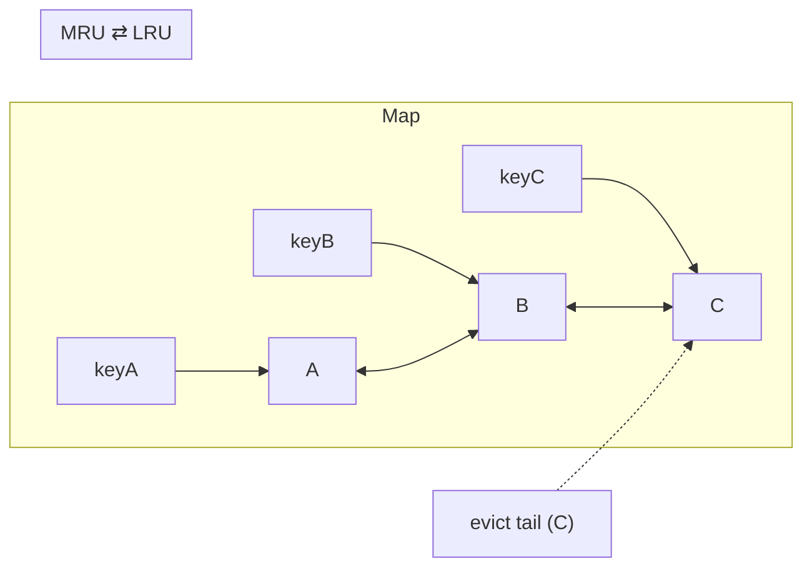
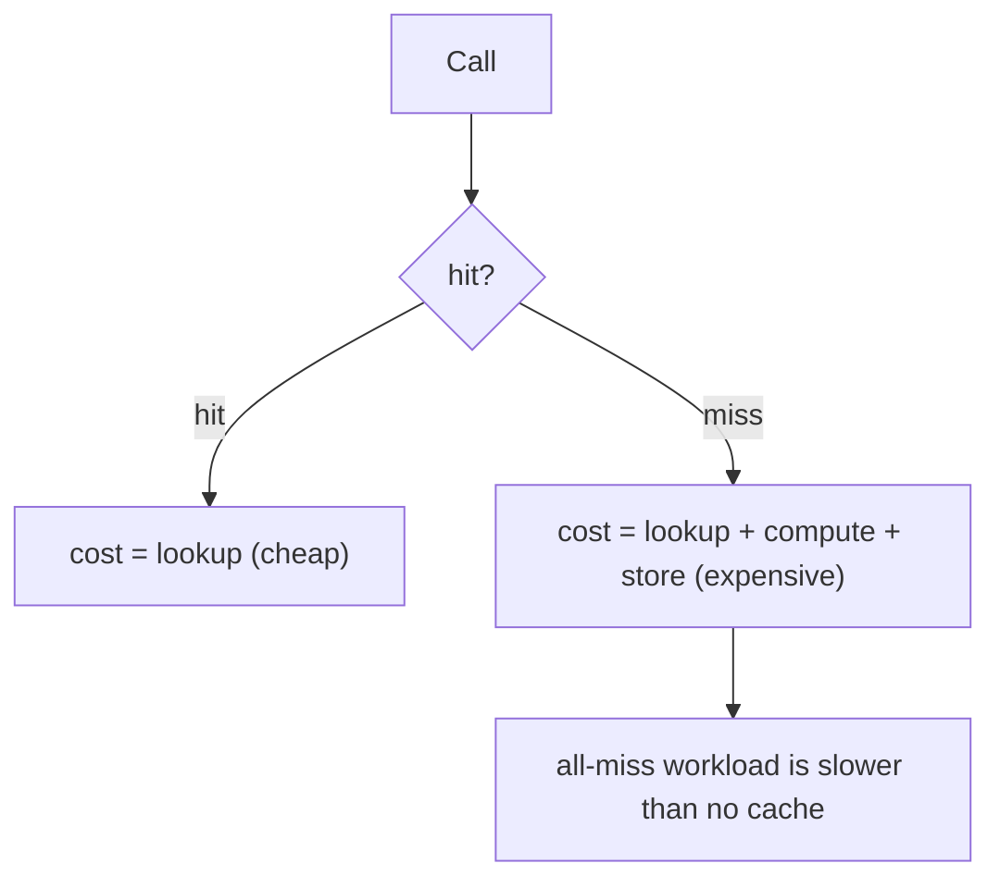

# Memoization & Caching — Professional Level

> **Category:** [Object & State Patterns](../README.md) — understand the cache below the API: hashing, memory layout, eviction internals, and the cost of every hit and miss.

> **Prerequisites:** [Junior](junior.md) · [Middle](middle.md) · [Senior](senior.md)
> **Focus:** **Under the hood**

---

## Table of Contents

1. [Introduction](#introduction)
2. [The Cost of a Hit vs a Miss](#the-cost-of-a-hit-vs-a-miss)
3. [Hashing and Key Equality](#hashing-and-key-equality)
4. [LRU Internals](#lru-internals)
5. [Window-TinyLFU: How Caffeine Evicts](#window-tinylfu-how-caffeine-evicts)
6. [lru_cache Internals (CPython)](#lru_cache-internals-cpython)
7. [Memory Footprint](#memory-footprint)
8. [Benchmarks](#benchmarks)
9. [Diagrams](#diagrams)
10. [Related Topics](#related-topics)

---

## Introduction

A cache trades memory for time, but each layer of that trade has a measurable cost: the hash of the key, the probe into the table, the bookkeeping that eviction requires. At the professional level you should be able to:

- Explain why a cache *miss* costs *more* than no cache at all (lookup **plus** compute **plus** store).
- Reason about key hashing and equality as the thing that makes or breaks hit rate.
- Describe how LRU and Window-TinyLFU maintain their orderings in O(1).
- Predict the per-entry memory cost in Python, Java, and Go.

---

## The Cost of a Hit vs a Miss

Every cached call pays a lookup. The break-even depends on hit rate:

```
cost_no_cache   = compute
cost_with_cache = lookup + (miss_rate × (compute + store))
```

A cache helps only when `lookup + miss_rate × (compute + store) < compute`, i.e. when **compute ≫ lookup** *and* **hit rate is high**. Concretely:

- A hash-map lookup is ~10–50 ns.
- If `compute` is ~30 ns (a couple of arithmetic ops), caching is a *net loss* — you added a lookup to save nothing.
- If `compute` is ~30 µs (a DB round-trip, a render), a 90% hit rate is a ~10× win.

> **The miss is the worst case:** lookup → compute → store. A workload that's all misses is strictly slower than no cache. Measure hit rate before claiming a speedup.

---

## Hashing and Key Equality

The cache key flows through `hashCode`/`__hash__` and `equals`/`__eq__`. Two requirements:

1. **Consistency:** equal keys must hash equally, and equality must be stable while the key is in the cache. A key whose hash changes after insertion is *lost* (it now lands in a different bin) — a leak and a permanent miss.
2. **Cheap and well-distributed:** a slow or clustering hash turns O(1) lookups into O(n) bucket walks.

```java
// A record gives you value-based hashCode/equals for free → safe cache key
record Key(String user, String currency) {}
```

```python
# Tuples of hashable items are the canonical Python cache key
key = (user, currency)          # hashable, value-equal, immutable
```

```go
// Go map keys must be comparable; structs of comparable fields work,
// slices/maps/functions do NOT (compile error).
type Key struct{ User, Currency string }
```

**Argument normalization** is part of the key contract: if `f(1, 2)` and `f(2, 1)` should hit the same entry, sort or canonicalize before keying — otherwise you fragment the cache and tank the hit rate.

---

## LRU Internals

A correct LRU must answer two questions in O(1): *"which entry was used least recently?"* and *"mark this entry most-recently used."* The standard structure is a **hash map + doubly-linked list**:

```
hashmap: key → node            (O(1) lookup)
list:    MRU ⇄ … ⇄ LRU         (O(1) move-to-front, O(1) evict-tail)
```

- **Get(hit):** map lookup → unlink node → push to front. O(1).
- **Put(new):** insert at front; if over capacity, drop the tail node and its map entry. O(1).

```python
from collections import OrderedDict   # move_to_end gives O(1) LRU

class LRU:
    def __init__(self, cap):
        self.cap, self.d = cap, OrderedDict()
    def get(self, k):
        if k not in self.d: return None
        self.d.move_to_end(k)          # mark MRU
        return self.d[k]
    def put(self, k, v):
        self.d[k] = v
        self.d.move_to_end(k)
        if len(self.d) > self.cap:
            self.d.popitem(last=False)  # evict LRU
```

CPython's `lru_cache` uses exactly this — a dict plus a circular doubly-linked list of `(prev, next, key, result)` nodes.

---

## Window-TinyLFU: How Caffeine Evicts

Pure LRU has a flaw: a burst of one-shot keys (a scan) flushes the genuinely hot set. Caffeine uses **Window-TinyLFU**, the current state of the art:

- A small **admission window** (LRU) catches recency.
- A **frequency sketch** (a Count-Min Sketch, ~ few bits per counter) estimates how often each key has been seen, cheaply and approximately.
- On eviction contention, the **TinyLFU admission filter** asks: *is the candidate seen more often than the victim it would replace?* If not, it's rejected — protecting the hot set from scan pollution.

The frequency counters **age** (halved periodically) so the cache adapts to shifting workloads. The result: near-optimal hit rates at O(1) per operation with a few bytes of overhead per entry. This is why "use Caffeine" beats "hand-roll LRU" almost every time.

---

## lru_cache Internals (CPython)

`functools.lru_cache` is implemented in C (`_functools`) for speed. Key facts:

- **Key construction:** positional args become a tuple; keyword args are appended with a separator; the kwargs/`typed` handling means `f(3)` and `f(3.0)` are the *same* key unless `typed=True`.
- **Thread safety:** the cache dict updates are guarded so concurrent calls don't corrupt the structure — but the *user function* may still run twice on a simultaneous cold miss (the lock is not held across the call).
- **`maxsize=None`:** skips all the linked-list LRU bookkeeping entirely — it's a plain dict, faster per call but **unbounded**.
- **`cache_info()`** exposes `hits, misses, maxsize, currsize` — free instrumentation.

```python
@lru_cache(maxsize=None, typed=True)   # typed: 3 and 3.0 are distinct keys
def f(x): ...
```

---

## Memory Footprint

Per-entry overhead matters when you bound by size *and* care about heap.

### Python

```python
@lru_cache(maxsize=N)
def f(k): ...
```

Each entry stores: the key tuple, the result, and an LRU node (`prev, next, key, result`). Rough cost: **~200–300 bytes per entry** beyond the key/value payloads, dominated by Python object headers and the dict's open-addressing slots.

### Java (Caffeine)

Each entry: a node object (key ref, value ref, access/write timestamps for expiry, frequency bits), plus the `ConcurrentHashMap` bucket. Roughly **~60–100 bytes/entry** of bookkeeping on top of the key/value objects themselves.

### Go (map)

A `map[K]V` entry costs the key + value inline in buckets (8 entries/bucket) plus tophash bytes and overflow pointers — roughly **~50 bytes/entry** of overhead for small types, less per entry when the bucket is full. No built-in eviction, so you pay for your own LRU structure on top.

> **Rule of thumb:** budget a few hundred bytes per cached entry beyond the data. A 1M-entry cache is hundreds of MB of *overhead alone*. Bound deliberately.

---

## Benchmarks

Apple M2 Pro, single thread, indicative numbers.

### Fibonacci: naive vs memoized

```
fib(35) naive recursion      ~ 50,000,000 ns   (exponential)
fib(35) memoized             ~        2,000 ns  (linear)            ~25,000× faster
```

### Lookup cost (hit path)

```
Python  dict get             ~  40 ns
Python  lru_cache hit        ~  90 ns   (key tuple build + LRU touch)
Java    ConcurrentHashMap    ~  20 ns
Java    Caffeine get (hit)   ~  35 ns
Go      map[K] read (no lock)~  10 ns
Go      map + RWMutex read   ~  25 ns
```

### Break-even

```
compute < lookup            → cache is a NET LOSS (e.g. caching x*2)
compute ≈ µs, hit rate high → cache is a large win
all-miss workload           → strictly slower than no cache
```

---

## Diagrams

### LRU = hashmap + doubly-linked list



### Hit/miss cost model



---

## Related Topics

- **CPython source:** `Lib/functools.py` and `Modules/_functoolsmodule.c` (`lru_cache`).
- **Caffeine / TinyLFU:** "TinyLFU: A Highly Efficient Cache Admission Policy" (Einziger, Friedman, Manes).
- **Count-Min Sketch:** Cormode & Muthukrishnan, the structure behind frequency estimation.
- **Distributed end:** [Redis eviction policies](../../../../../Backend/redis/README.md).

---

[← Senior](senior.md) · [Object & State](../README.md) · **Next:** [Interview](interview.md)
