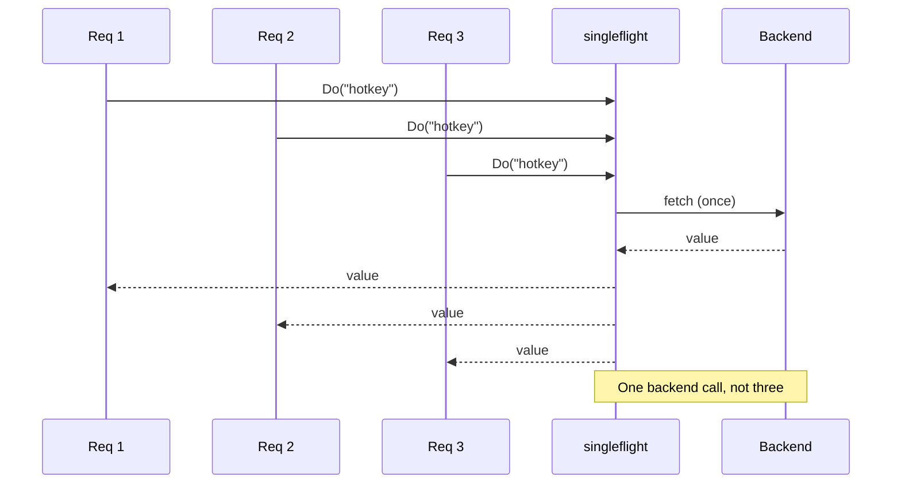
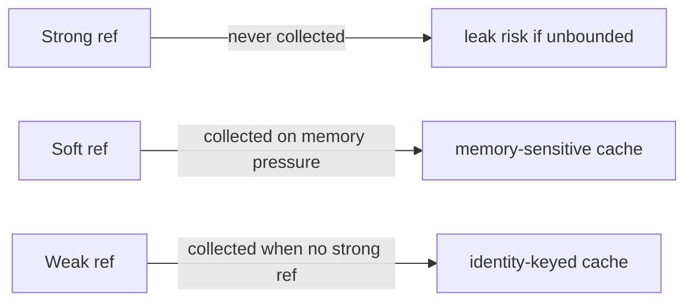

# Memoization & Caching — Senior Level

> **Category:** [Object & State Patterns](../README.md) — design the cache as a system component: concurrent, bounded, invalidatable, and resilient under load.

> **Prerequisites:** [Junior](junior.md) · [Middle](middle.md)
> **Focus:** **Architecture** and **optimization**

---

## Table of Contents

1. [Introduction](#introduction)
2. [Thread-Safe Memoization](#thread-safe-memoization)
3. [Cache Stampede and Single-Flight](#cache-stampede-and-single-flight)
4. [Invalidation — the Hard Problem](#invalidation-the-hard-problem)
5. [Weak and Soft References](#weak-and-soft-references)
6. [The Caching Layers](#the-caching-layers)
7. [Negative Caching and Exceptions](#negative-caching-and-exceptions)
8. [Code Examples — Advanced](#code-examples-advanced)
9. [Liabilities](#liabilities)
10. [Migration Patterns](#migration-patterns)
11. [Diagrams](#diagrams)
12. [Related Topics](#related-topics)

---

## Introduction

> Focus: **architecture** and **optimization**

A junior cache is a `HashMap`. A senior cache is a **concurrency-safe, bounded, observable component with a defined invalidation contract**. The interesting failures at scale are not "the cache is slow" — they are:

- Two threads compute the same missing value simultaneously (**redundant work**, or worse, a **stampede** when a hot key expires).
- The cache holds onto memory the rest of the system needs (**no eviction / strong references**).
- The cache returns data that is now wrong (**invalidation**).

Senior decisions:
- How is concurrent access made safe *and* non-redundant?
- What happens when a popular key expires under load?
- Who is responsible for evicting stale entries, and how?
- Strong, soft, or weak references for cached values?
- In-process, distributed, or both (multi-tier)?

---

## Thread-Safe Memoization

A read-mostly cache wants cheap concurrent reads and exclusive writes. But the naive "lock, check, unlock, compute, lock, store" pattern has a **double-compute** window: two threads both miss, both compute.

The fix is **compute-if-absent atomicity** — the cache itself guarantees the loader runs at most once per key.

```java
// Java: ConcurrentHashMap.computeIfAbsent is atomic per key
private final ConcurrentHashMap<Key, Result> cache = new ConcurrentHashMap<>();

Result get(Key k) {
    return cache.computeIfAbsent(k, this::expensiveCompute);
}
```

`computeIfAbsent` holds a per-bin lock so the mapping function runs **once** even under contention — but beware: the lock is held *during* compute, so a slow loader blocks other keys hashing to the same bin, and a re-entrant call to the same map deadlocks. Caffeine's `LoadingCache` solves both by computing outside the bin lock.

---

## Cache Stampede and Single-Flight

**Cache stampede** (a.k.a. thundering herd / dog-piling): a hot key expires, and N concurrent requests all miss and all recompute it at once — hammering the backend exactly when it's most loaded.

The remedy is **single-flight**: collapse duplicate in-flight computations for the same key into one, and share the result.

### Go — `singleflight`

```go
import "golang.org/x/sync/singleflight"

var group singleflight.Group

func GetUser(id string) (*User, error) {
    v, err, _ := group.Do(id, func() (any, error) {
        return fetchUserFromDB(id) // runs once even if 1000 goroutines call concurrently
    })
    if err != nil {
        return nil, err
    }
    return v.(*User), nil
}
```

All concurrent callers for the same `id` wait on **one** execution and receive the same result. This is the canonical stampede fix.

### Complementary tactics

- **Early/probabilistic expiration** — refresh a key *before* it expires, jittered, so expirations don't align.
- **Locked recompute with stale-while-revalidate** — serve the stale value while one worker refreshes (Caffeine `refreshAfterWrite`).
- **Request coalescing** — the in-process analog of `singleflight`.

---

## Invalidation — the Hard Problem

> *"There are only two hard things in Computer Science: cache invalidation and naming things."* — Phil Karlton

Pure memoization rarely needs invalidation (the inputs fully determine the output). The moment the cached thing reflects **mutable external state**, you owe an answer to *"when does this entry become wrong, and who removes it?"*

| Strategy | How | Trade-off |
|---|---|---|
| **TTL** | drop after *T* seconds | simple; bounded staleness window |
| **Write-through** | update cache on every write | always fresh; couples writes to cache |
| **Write-invalidate** | delete the key on write | simple; next read re-computes |
| **Event-driven** | invalidate on a change event/CDC | fresh + decoupled; needs infra |
| **Versioned keys** | embed a version in the key (`user:42:v7`) | old versions age out via LRU; no explicit delete |

Versioned keys are the senior's favorite trick: instead of *deleting* `user:42`, bump a version so reads naturally miss and old entries fall out of the LRU — no race between "delete" and "concurrent read."

---

## Weak and Soft References

For caches that should yield memory under pressure rather than cause an OOM:

| Reference | GC behavior | Use for |
|---|---|---|
| **Strong** | never collected while referenced | normal entries; risk of leak if unbounded |
| **Soft** (Java) | collected only when memory is low | a "give it back if you need it" memory cache |
| **Weak** (Java) / `weakref` (Python) | collected as soon as no strong ref exists | caches keyed by object identity that mustn't pin keys |

```java
// Java: weak keys so cached entries don't keep their keys alive
Cache<Key, Value> cache = Caffeine.newBuilder()
    .weakKeys()        // key collected when no other strong ref → entry evicted
    .softValues()      // values reclaimed under memory pressure
    .build();
```

```python
import weakref
# Cache derived data without preventing the source object from being GC'd
cache = weakref.WeakKeyDictionary()
```

The classic use: memoizing a derived property keyed by an object — you don't want the cache to be the reason the object never dies.

---

## The Caching Layers

A request often passes through several caches; designing *where* a thing is cached is an architecture decision.

```
browser → CDN → reverse proxy → app in-process (memoize) → distributed (Redis) → DB query cache
```

- **In-process (memoization):** nanosecond latency, per-instance, lost on restart, not shared across nodes.
- **Distributed (Redis/Memcached):** shared across the fleet, survives restarts, network-latency cost, needs its own eviction/TTL. See [Redis caching patterns](../../../../../Backend/redis/README.md).
- **Multi-tier (near + far):** in-process L1 in front of Redis L2 — but now you have *two* things to invalidate and possible inconsistency between tiers.

The senior rule: **the closer the cache, the cheaper the hit but the harder the invalidation** (you can't easily reach into every node's heap to evict one key — hence versioned keys and TTLs).

---

## Negative Caching and Exceptions

- **Negative caching:** cache "not found" to stop repeated expensive lookups for keys that don't exist (e.g., DNS NXDOMAIN, missing user). Use a **shorter TTL** than positive entries — the thing may appear later.
- **Exceptions:** do **not** cache transient failures (timeouts, 503s) as permanent answers. Cache only successful results; let failures retry. If you must dampen retries, cache the failure with a tiny TTL plus backoff.

---

## Code Examples — Advanced

### Java — Caffeine with refresh-ahead (no stampede)

```java
LoadingCache<Key, Value> cache = Caffeine.newBuilder()
    .maximumSize(50_000)
    .refreshAfterWrite(Duration.ofMinutes(1))   // refresh async; serve stale meanwhile
    .expireAfterWrite(Duration.ofMinutes(10))   // hard expiry backstop
    .recordStats()
    .build(key -> loadFromBackend(key));

// On a key older than 1 min, ONE thread refreshes in the background;
// all others get the (slightly stale) cached value immediately — no herd.
```

### Go — guarded map + singleflight together

```go
type Cache struct {
    mu    sync.RWMutex
    data  map[string]*User
    group singleflight.Group
}

func (c *Cache) Get(id string) (*User, error) {
    c.mu.RLock()
    if u, ok := c.data[id]; ok {
        c.mu.RUnlock()
        return u, nil // fast path: hit
    }
    c.mu.RUnlock()

    v, err, _ := c.group.Do(id, func() (any, error) {
        u, err := fetchUser(id) // exactly one fetch per id under concurrency
        if err != nil {
            return nil, err
        }
        c.mu.Lock()
        c.data[id] = u
        c.mu.Unlock()
        return u, nil
    })
    if err != nil {
        return nil, err
    }
    return v.(*User), nil
}
```

### Python — TTL cache with thread safety

```python
import threading, time

class TTLCache:
    def __init__(self, ttl: float):
        self._ttl = ttl
        self._lock = threading.Lock()
        self._store: dict[str, tuple[float, object]] = {}

    def get_or_compute(self, key: str, compute):
        now = time.monotonic()
        with self._lock:
            entry = self._store.get(key)
            if entry and now - entry[0] < self._ttl:
                return entry[1]            # fresh hit
        value = compute()                  # computed outside the lock
        with self._lock:
            self._store[key] = (now, value)
        return value
```

> Note the loader runs **outside** the lock to avoid blocking all readers during a slow compute — at the cost of a possible double-compute on a cold key. Trading lock-hold-time for occasional redundancy is a deliberate senior choice.

---

## Liabilities

### Symptom 1: The cache is the memory leak

Unbounded memoization on user-controlled keys grows until OOM. **Always bound** (size, TTL, or weak/soft refs).

### Symptom 2: Stale reads after a write

The cached value outlived the underlying truth. You skipped invalidation. Add write-invalidate, TTL, or versioned keys.

### Symptom 3: Backend falls over when a hot key expires

Classic stampede. Add single-flight / coalescing / jittered refresh.

### Symptom 4: Method-level cache pins objects alive

`@lru_cache` on a method (or a strong-keyed map) keeps `self` referenced forever. Use weak keys or per-instance caches that die with the object.

### Symptom 5: Cache hit rate is near zero

The key space is too fine (timestamps, request IDs). Coarsen the key or drop the cache.

---

## Migration Patterns

### Unbounded memo → bounded LRU

```python
# Before
@cache                      # unbounded — leaks under unbounded keys
def f(k): ...
# After
@lru_cache(maxsize=10_000)  # bounded
def f(k): ...
```

### In-process map → Caffeine / Redis

```java
// Before: hand-rolled, unbounded, no metrics
Map<Key, Value> cache = new ConcurrentHashMap<>();
// After: bounded, evicting, observable
LoadingCache<Key, Value> cache = Caffeine.newBuilder()
    .maximumSize(N).expireAfterWrite(...).recordStats().build(loader);
```

### Single-node cache → distributed

Move the cache to Redis when multiple nodes must share it or survive restarts. Replace in-heap eviction with Redis TTL/`maxmemory-policy`; replace direct deletes with key versioning or pub/sub invalidation. See [Redis](../../../../../Backend/redis/README.md).

---

## Diagrams

### Stampede vs single-flight



### Reference strength vs GC



---

## Related Topics

- **Next:** [Memoization & Caching — Professional](professional.md)
- **Practice:** [Tasks](tasks.md), [Find-Bug](find-bug.md), [Optimize](optimize.md), [Interview](interview.md)
- **Foundation:** [Lazy Initialization](../02-lazy-initialization/junior.md) — the single-value ancestor.
- **Distributed end:** [Redis caching patterns](../../../../../Backend/redis/README.md).
- **Algorithmic use:** [Dynamic Programming](../../../../../Data/datastructures-and-algorithms/13-dynamic-programming/README.md).

---

[← Middle](middle.md) · [Object & State](../README.md) · **Next:** [Professional](professional.md)
