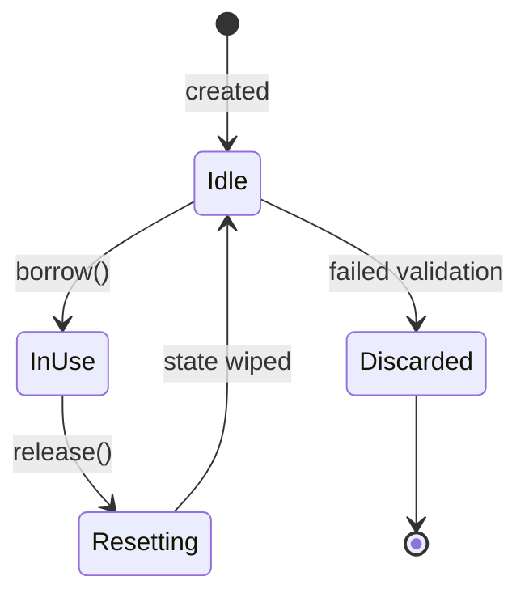
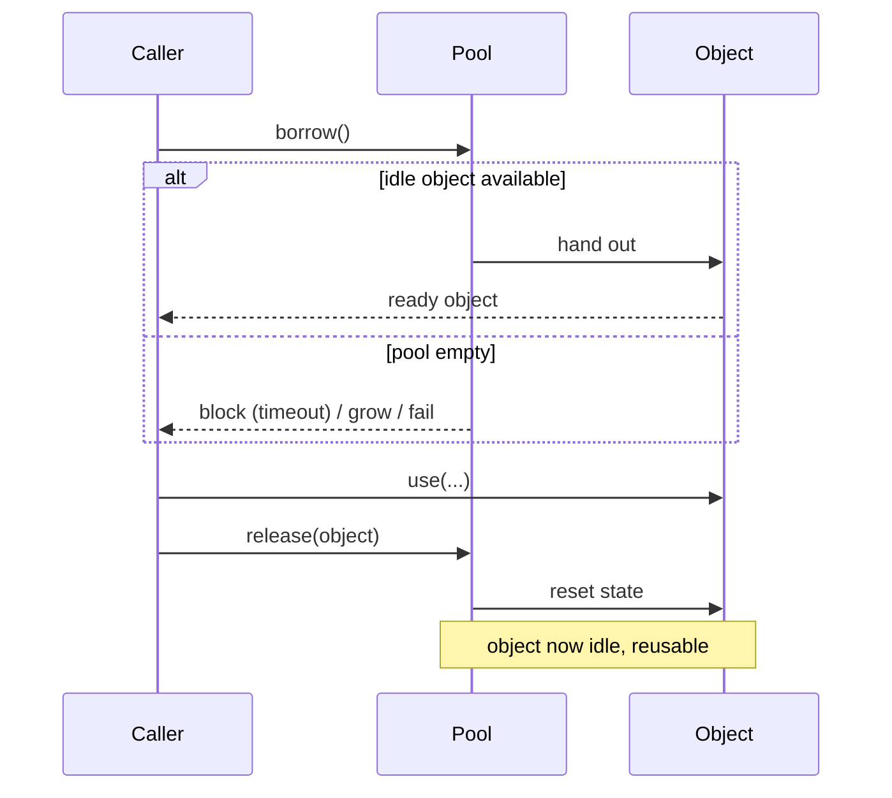

# Object Pool — Junior Level

> **Category:** [Object & State Patterns](../README.md) — keep a bounded set of pre-built, reusable objects and lend them out (borrow → use → return) instead of creating and destroying one per use.

---

## Table of Contents

1. [Introduction](#introduction)
2. [Prerequisites](#prerequisites)
3. [Glossary](#glossary)
4. [Core Concepts](#core-concepts)
5. [Real-World Analogies](#real-world-analogies)
6. [Mental Models](#mental-models)
7. [Pros & Cons](#pros-cons)
8. [Use Cases](#use-cases)
9. [Code Examples](#code-examples)
10. [Coding Patterns](#coding-patterns)
11. [Clean Code](#clean-code)
12. [Best Practices](#best-practices)
13. [Edge Cases & Pitfalls](#edge-cases-pitfalls)
14. [Common Mistakes](#common-mistakes)
15. [Tricky Points](#tricky-points)
16. [Test Yourself](#test-yourself)
17. [Cheat Sheet](#cheat-sheet)
18. [Summary](#summary)
19. [Further Reading](#further-reading)
20. [Related Topics](#related-topics)
21. [Diagrams](#diagrams)

---

## Introduction

> Focus: **What is it?** and **How to use it?**

**Object Pool** keeps a fixed, reusable set of expensive-to-create objects. Instead of `new`-ing one every time you need it and throwing it away afterward, you **borrow** an idle object from the pool, **use** it, and **return** it so the next caller can reuse it.

In one sentence: *don't keep building and demolishing the same expensive thing — build a few, hand them around, and put them back when done.*

### Why this matters

Some objects are cheap to make (a `Point`, a small string). Others are genuinely expensive: opening a **database connection** means a TCP handshake, a TLS negotiation, and an auth round-trip — tens of milliseconds. Doing that per query would cripple a web server handling thousands of requests per second.

```java
// Naive: open a connection per request (slow — ~30 ms handshake each time)
try (Connection c = DriverManager.getConnection(url, user, pw)) {
    return c.query("SELECT ...");
}
```

With a pool, the handshake happens **once** at startup; each request grabs a ready connection:

```java
try (Connection c = pool.borrow()) {   // ~microseconds, already open
    return c.query("SELECT ...");
}                                       // returned to pool, not closed
```

This is exactly what [HikariCP](https://github.com/brettwooldridge/HikariCP) (Java) and PgBouncer (Postgres) do.

> **Honest caution, up front:** object pools are a *last-resort* optimization. For ordinary objects, a modern allocator/GC is faster than a pool and has zero bugs. Pool only for resources that are genuinely expensive to acquire — connections, threads, large buffers, sockets — and only with a profiler telling you it matters.

---

## Prerequisites

- **Required:** Object construction (constructors / `new`) and basic OOP.
- **Required:** What a resource is (a file handle, socket, DB connection).
- **Helpful:** [Memoization & Caching](../03-memoization-and-caching/junior.md) — pooling is "caching, but for whole reusable objects instead of values."
- **Helpful:** [RAII & Dispose](../../03-resource-and-type-safety/01-raii-and-dispose/junior.md) — returning to the pool *is* a form of deterministic release.

---

## Glossary

| Term | Definition |
|------|-----------|
| **Pool** | The container holding idle, reusable objects. |
| **Borrow / acquire / lease / rent** | Take an object out of the pool to use it. |
| **Return / release** | Put the object back so it can be reused. |
| **Idle object** | One sitting in the pool, available to borrow. |
| **In-use object** | One currently borrowed and not yet returned. |
| **Capacity / max size** | The largest number of objects the pool will hold or hand out. |
| **Exhaustion** | All objects are in use and none are idle — a borrow can't be satisfied immediately. |
| **Reset** | Wiping an object's state before reuse so no data leaks between borrowers. |

---

## Core Concepts

### 1. Borrow → use → return

The whole pattern is a three-step loop. The contract is: **whatever you borrow, you must return** — exactly once, even on error.

### 2. The pool is bounded

A pool has a maximum size. It doesn't grow forever; that's the point — it caps how many expensive objects exist at once (e.g., "never more than 20 DB connections").

### 3. Objects are pre-initialized (often)

Many pools create their objects up front ("warm" the pool) so the first borrowers don't pay construction cost.

### 4. State must be reset on return (critical)

A reused object still holds whatever the previous borrower left in it. If you don't **reset** it, the next caller sees stale data. For a buffer, that's a correctness bug; for a connection mid-transaction, it can be a security/correctness disaster. This is the #1 source of pool bugs — remember it now.

---

## Real-World Analogies

| Concept | Analogy |
|---|---|
| **Pool** | A bowling alley's rack of rental shoes. |
| **Borrow** | You take a pair in your size. |
| **Use** | You bowl. |
| **Return** | You hand them back. |
| **Reset** | They get sprayed/cleaned before the next person wears them. |
| **Exhaustion** | Every pair in your size is out — you wait, or you're told "sorry, none left." |
| **Why not just buy shoes each time?** | Buying (constructing) a new pair per visit is absurdly expensive; renting from a shared rack is the whole idea. |

A library book also works: a *bounded* set of copies, borrowed and returned, with a due date (timeout) so they don't vanish forever.

---

## Mental Models

**The intuition:** *"A small fleet of expensive things you keep recycling."*

```
        ┌─────────── Pool ───────────┐
        │  [idle] [idle] [idle]      │
        └────┬──────────────▲────────┘
        borrow│             │return
              ▼             │
          ┌───────┐   use   │
          │ caller│─────────┘
          └───────┘
```

Compare to allocate-per-use:

```
new Obj ──use──> garbage ──> GC      (repeat thousands of times)
```

vs pooled:

```
borrow ──use──> reset ──> return ──> borrow ...   (same few objects forever)
```

---

## Pros & Cons

| Pros | Cons |
|------|------|
| Avoids repeated expensive acquisition/teardown | Adds real complexity: sizing, thread-safety, leak detection |
| Caps concurrent resource usage (e.g., DB connections) | Forget to reset → stale-state bugs (security/correctness) |
| Predictable latency on the hot path | Forget to return → leak → pool exhaustion |
| Smooths allocation/GC pressure for large buffers | Often *slower* than plain allocation for cheap objects |
| Backpressure: exhaustion naturally throttles load | A borrowed object outliving its borrow is a lurking hazard |

### When to use:
- The object wraps an **expensive external resource**: DB connection, socket, thread, GPU/render context.
- A **large buffer** is allocated and freed repeatedly on a hot path.
- You must **cap** how many of something can exist (connection limits).

### When NOT to use:
- The object is cheap to construct. Let the allocator/GC do its job.
- You haven't profiled. Pooling without a measured bottleneck adds bugs for no gain.

---

## Use Cases

- **Database connection pools** — HikariCP, PgBouncer, `database/sql` in Go.
- **Thread pools** — reuse OS threads instead of spawning per task. See [Thread Pool](../../../design-patterns/04-concurrency-patterns/05-thread-pool/junior.md).
- **Byte buffers** — Netty's `ByteBuf` pool, Go's `sync.Pool` for `bytes.Buffer`.
- **Sockets / HTTP connections** — keep-alive connection reuse.
- **Game engines** — pools of bullets, particles, enemies (avoid GC spikes mid-frame).

---

## Code Examples

### Java — a simple, blocking object pool

```java
import java.util.concurrent.ArrayBlockingQueue;
import java.util.concurrent.BlockingQueue;
import java.util.concurrent.TimeUnit;

public final class BufferPool {
    private final BlockingQueue<byte[]> idle;
    private final int bufferSize;

    public BufferPool(int capacity, int bufferSize) {
        this.bufferSize = bufferSize;
        this.idle = new ArrayBlockingQueue<>(capacity);
        for (int i = 0; i < capacity; i++) {   // pre-fill ("warm") the pool
            idle.add(new byte[bufferSize]);
        }
    }

    /** Borrow a buffer, waiting up to the timeout if the pool is empty. */
    public byte[] borrow(long timeout, TimeUnit unit) throws InterruptedException {
        byte[] buf = idle.poll(timeout, unit);
        if (buf == null) throw new IllegalStateException("pool exhausted");
        return buf;
    }

    /** Return a buffer. Reset state so the next borrower sees a clean slate. */
    public void release(byte[] buf) {
        java.util.Arrays.fill(buf, (byte) 0);   // RESET — wipe stale data
        idle.offer(buf);                          // (drops it if pool is full)
    }
}
```

```java
// Usage
byte[] buf = pool.borrow(1, TimeUnit.SECONDS);
try {
    fillAndSend(buf);
} finally {
    pool.release(buf);   // ALWAYS return, even on exception
}
```

**Highlights:** the pool is bounded (`capacity`), borrowing blocks-with-timeout when empty, and `release` **resets** the buffer before reuse.

---

### Python — a queue-backed pool

```python
import queue
from contextlib import contextmanager

class ConnectionPool:
    def __init__(self, size: int, factory):
        self._idle: queue.Queue = queue.Queue(maxsize=size)
        for _ in range(size):
            self._idle.put(factory())     # pre-create connections

    @contextmanager
    def borrow(self, timeout: float = 1.0):
        conn = self._idle.get(timeout=timeout)   # blocks; raises queue.Empty on timeout
        try:
            yield conn
        finally:
            conn.rollback()                # RESET: abort any half-done transaction
            self._idle.put(conn)           # return to pool

# Usage — the context manager guarantees the return
with pool.borrow() as conn:
    conn.execute("SELECT 1")
# connection is back in the pool here
```

The `@contextmanager` makes the borrow/return loop airtight: the `finally` runs even if the body raises.

---

### Go — `sync.Pool` (the idiomatic, GC-aware pool)

> **Go note:** `sync.Pool` is for **ephemeral, reconstructible** objects (buffers), NOT for connections — the GC may drop pooled objects at any time. For connections, use `database/sql`, which has its own connection pool.

```go
package buf

import (
    "bytes"
    "sync"
)

var pool = sync.Pool{
    New: func() any { return new(bytes.Buffer) },   // how to make one if pool is empty
}

func Process(data []byte) string {
    b := pool.Get().(*bytes.Buffer)  // borrow (or New if none idle)
    defer func() {
        b.Reset()                    // RESET before returning — clears bytes
        pool.Put(b)                  // return
    }()

    b.Write(data)
    b.WriteString("!")
    return b.String()
}
```

`sync.Pool` is intentionally simple: no fixed size, no blocking, no timeout. It just reduces allocation churn and lets the GC reclaim entries under memory pressure.

---

## Coding Patterns

### Pattern 1: Always return with `try/finally` (or `defer`, or a context manager)

The borrow/return pair must be exception-safe. The borrow site should make returning automatic:

```python
with pool.borrow() as obj:
    ...        # even if this raises, obj returns to the pool
```

### Pattern 2: Reset on return, not on borrow

Reset when you put the object *back* so the pool only ever holds clean objects. (Resetting on borrow also works but means a dirty object can sit in the pool, which is riskier to reason about.)

### Pattern 3: Validate before handing out

A pooled connection may have died while idle (the DB closed it). Check it's still alive before lending it:

```java
byte[] buf = pool.borrow(...);
// for connections: if (!conn.isValid(1)) { discard; create fresh; }
```



---

## Clean Code

### Naming

| ❌ Bad | ✅ Good |
|---|---|
| `get()` / `put()` (ambiguous with maps) | `borrow()` / `release()`, `acquire()` / `release()` |
| `Pool.use()` doing borrow+use+return invisibly | explicit `borrow`/`release` *or* a scoped helper |
| `size` (ambiguous: idle? in-use? max?) | `idleCount`, `activeCount`, `maxSize` |

### Make returning hard to forget

Prefer an API that returns for you — a context manager (Python), `try-with-resources` (Java), or `defer` (Go) — over trusting every caller to remember `release()`.

---

## Best Practices

1. **Always return the object** — wrap the borrow in `try/finally`, `defer`, or a context manager.
2. **Reset state on return.** Wipe buffers; roll back transactions; clear references.
3. **Bound the pool.** A max size is what makes a pool a pool.
4. **Validate on borrow** for resources that can die while idle (connections, sockets).
5. **Decide the exhaustion policy:** block-with-timeout, grow, or fail fast.
6. **Don't pool cheap objects.** Profile first; the allocator usually wins.

---

## Edge Cases & Pitfalls

- **Borrowed-but-never-returned (leak):** the object is gone from the pool forever; eventually the pool is exhausted and everything blocks.
- **Using an object after returning it:** the next borrower may now share it — a use-after-return data race.
- **Stale state:** forgetting to reset leaks the previous borrower's data to the next one.
- **Dead resource handed out:** an idle connection the server already closed — must validate.
- **Exhaustion with no timeout:** an infinite block looks exactly like a deadlock.

---

## Common Mistakes

1. **No reset on return** — the next caller reads the previous caller's data.
2. **Forgetting `finally`** — an exception in the use block leaks the object.
3. **Returning the same object twice** — it ends up in the pool twice; two callers get it.
4. **Pooling cheap objects** — slower than `new`, plus all the bugs.
5. **Unbounded "pool"** — that's not a pool, it's a leak with extra steps.

---

## Tricky Points

- **Pool vs cache.** A cache *may* drop entries and recompute; a pool lends and expects them back. A borrowed pool object is owned by one borrower at a time; a cache value is shared and read-only.
- **`sync.Pool` is not a connection pool.** It's GC-aware and may empty itself between collections — fine for buffers, fatal for connections.
- **Returning is the dangerous half.** Borrowing rarely goes wrong; *not* returning, returning twice, or using after return cause the nasty bugs.
- **A pool changes failure modes.** Under load you no longer get "slow"; you get "blocked waiting for a free object," which is a different (and arguably better) signal.

---

## Test Yourself

1. What three steps make up the object-pool lifecycle?
2. Why must you reset an object's state when returning it?
3. What is "pool exhaustion," and what are the three ways to respond to it?
4. Why is Go's `sync.Pool` wrong for database connections?
5. When should you *not* use an object pool?

<details><summary>Answers</summary>

1. Borrow (acquire), use, return (release).
2. The object still holds the previous borrower's data; without a reset that stale data leaks to the next borrower — a correctness or security bug.
3. All objects are in use and none are idle. Respond by: blocking with a timeout, growing the pool, or failing fast.
4. `sync.Pool` is GC-aware and may discard its contents at any GC; a connection it drops would leak. Connections need a managed, validated pool (`database/sql`).
5. When the object is cheap to construct, or when you haven't profiled a real bottleneck — the allocator/GC is usually faster and bug-free.

</details>

---

## Cheat Sheet

```java
// Java
byte[] b = pool.borrow(1, SECONDS);
try { use(b); } finally { pool.release(b); }   // release resets state
```

```python
# Python
with pool.borrow() as obj:        # context manager guarantees return
    use(obj)
```

```go
// Go
b := pool.Get().(*bytes.Buffer)
defer func() { b.Reset(); pool.Put(b) }()      // reset, then return
```

---

## Summary

- Object Pool = borrow → use → **reset** → return a bounded set of expensive objects.
- Legitimate for connections, threads, sockets, large buffers, game objects.
- The two killer bugs: **forgetting to return** (leak/exhaustion) and **forgetting to reset** (stale-state leak).
- In Go, `sync.Pool` for ephemeral buffers; `database/sql` for connections.
- Pooling is a last-resort optimization — measure first; cheap objects don't need it.

---

## Further Reading

- [refactoring.guru/design-patterns/object-pool](https://refactoring.guru/design-patterns/object-pool) — the GoF-adjacent pattern write-up.
- [HikariCP — design notes](https://github.com/brettwooldridge/HikariCP/wiki) — a production connection pool.
- Go [`sync.Pool` documentation](https://pkg.go.dev/sync#Pool).

---

## Related Topics

- **Next:** [Object Pool — Middle](middle.md)
- **Sibling patterns:** [Lazy Initialization](../02-lazy-initialization/junior.md), [Memoization & Caching](../03-memoization-and-caching/junior.md), [Fluent Interface](../01-fluent-interface/junior.md).
- **Closely related:** [Thread Pool](../../../design-patterns/04-concurrency-patterns/05-thread-pool/junior.md), [RAII & Dispose](../../03-resource-and-type-safety/01-raii-and-dispose/junior.md).
- **Where it goes wrong:** [Performance Anti-Patterns](../../../anti-patterns/06-performance/README.md).

---

## Diagrams



[← Object & State](../README.md) · [Coding Patterns](../../README.md) · **Next:** [Object Pool — Middle](middle.md)
