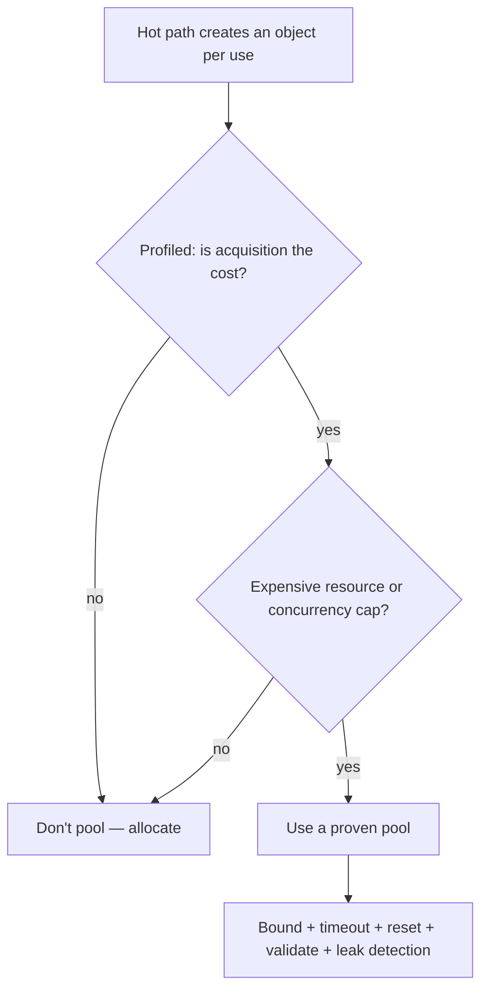
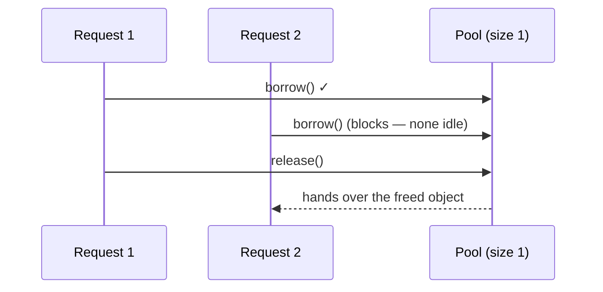

# Object Pool — Middle Level

> **Category:** [Object & State Patterns](../README.md) — borrow expensive objects from a bounded pool, use them, reset and return them; the skill is knowing when the reuse genuinely pays.

---

## Table of Contents

1. [Introduction](#introduction)
2. [When to Use Object Pool](#when-to-use-object-pool)
3. [When NOT to Use Object Pool](#when-not-to-use-object-pool)
4. [Real-World Cases](#real-world-cases)
5. [Production-Grade Code](#production-grade-code)
6. [Trade-offs](#trade-offs)
7. [Alternatives](#alternatives)
8. [Refactoring Toward a Pool](#refactoring-toward-a-pool)
9. [Edge Cases](#edge-cases)
10. [Tricky Points](#tricky-points)
11. [Best Practices](#best-practices)
12. [Summary](#summary)
13. [Diagrams](#diagrams)

---

## Introduction

> Focus: **Why** and **When**

The junior question is "how does borrow/use/return work?" The middle question is sharper: **does this object cost enough to justify a pool, given that the pool itself costs complexity, thread-safety, and a whole new class of bugs?**

The honest default is **no**. Modern GCs (G1, ZGC, Go's collector) and bump-pointer allocators make short-lived objects nearly free. A pool replaces "allocate, then GC reclaims it correctly" with "borrow, remember to reset, remember to return, handle exhaustion, validate liveness, detect leaks." You take on all of that to save an allocation — a bad trade unless the object is *not* a plain allocation but an expensive **external resource**.

The decision rule:

- **Cheap, pure-memory object:** never pool. Allocate.
- **Object wrapping an expensive acquisition** (TCP+TLS+auth, OS thread, GPU context): pool.
- **Large buffer churned on a hot path, GC pauses are hurting you:** pool (or `sync.Pool`), *after* profiling.
- **You must cap concurrency** (max 20 DB connections): pool, for the limit, not just the speed.

---

## When to Use Object Pool

Use a pool when **any** of:

1. **Acquisition is expensive and repeated.** Connection handshakes, thread creation, socket setup — milliseconds you pay thousands of times per second.
2. **You must bound concurrent usage.** The database allows 100 connections total; the pool enforces it and queues the rest.
3. **Large allocations cause GC pressure.** Multi-KB buffers allocated per request show up as GC pause time in a profiler.
4. **Construction has side effects you want to amortize.** Warming a cache, JIT-compiling a shader, pre-establishing a TLS session.

### Strong-fit examples

- DB connection pools (HikariCP, PgBouncer, `database/sql`).
- Thread pools / executor services.
- Netty `ByteBuf` pools; protobuf arena allocation.
- Game-engine pools for bullets/particles to avoid frame-time GC spikes.

---

## When NOT to Use Object Pool

| Symptom | Better choice |
|---|---|
| Object is a few fields of memory | Just `new` it — let the GC work |
| "It feels faster" with no profiler data | Measure first; usually the allocator wins |
| You want to avoid recomputing a *value* | [Memoization & Caching](../03-memoization-and-caching/junior.md) |
| You want lazy one-time creation | [Lazy Initialization](../02-lazy-initialization/junior.md) |
| Objects are immutable and shareable | Share one instance; no pool needed |
| You can't guarantee reliable return | A pool will leak; fix ownership first |

> **The premature-optimization trap.** Pooling ordinary objects is a textbook case of [premature optimization](../../../anti-patterns/06-performance/01-premature-optimization-traps/README.md): you add lock contention, reset bugs, and leak risk to dodge an allocation the GC handles for free. In several published benchmarks, naive small-object pools are *slower* than allocation because the pool's synchronization costs more than the `new`.

---

## Real-World Cases

### 1. Database connection pool (the canonical case)

```java
HikariConfig cfg = new HikariConfig();
cfg.setJdbcUrl("jdbc:postgresql://db:5432/app");
cfg.setMaximumPoolSize(20);       // bound
cfg.setMinimumIdle(5);            // keep 5 warm
cfg.setConnectionTimeout(3_000);  // borrow blocks at most 3s, then throws
cfg.setMaxLifetime(1_800_000);    // recycle a connection after 30 min
HikariDataSource ds = new HikariDataSource(cfg);

try (Connection c = ds.getConnection()) {   // borrow
    // ... use ...
}                                            // close() returns it to the pool
```

A TCP+TLS+auth handshake is ~10-50 ms. At 5,000 req/s, doing it per request is impossible. The pool pays it a few dozen times and reuses.

### 2. Thread pool

```python
from concurrent.futures import ThreadPoolExecutor

with ThreadPoolExecutor(max_workers=8) as pool:
    futures = [pool.submit(handle, req) for req in batch]
```

OS thread creation is expensive and unbounded thread counts thrash the scheduler. The pool reuses 8 threads and queues the rest — speed *and* a concurrency cap.

### 3. Buffer pool on a hot path

```go
var bufPool = sync.Pool{New: func() any { return make([]byte, 0, 64*1024) }}

func handle(w io.Writer, r io.Reader) {
    buf := bufPool.Get().([]byte)[:0]
    defer bufPool.Put(buf)
    // ... stream through buf, avoiding a 64 KB alloc per request ...
}
```

### 4. Game engine object pool

```python
class BulletPool:
    def __init__(self, n):
        self._idle = [Bullet() for _ in range(n)]
    def spawn(self, x, y, vx, vy):
        b = self._idle.pop()        # borrow
        b.reset(x, y, vx, vy)       # reset to fresh state
        return b
    def despawn(self, b):
        self._idle.append(b)        # return
```

Allocating bullets mid-frame causes GC pauses that drop frames; a pool keeps frame time flat.

---

## Production-Grade Code

### Java — a generic pool with validation, reset, and timeout

```java
import java.util.concurrent.*;

public final class ObjectPool<T> implements AutoCloseable {
    public interface Lifecycle<T> {
        T create();
        boolean validate(T obj);   // is it still usable?
        void reset(T obj);         // wipe state before reuse
        void destroy(T obj);       // free underlying resource
    }

    private final BlockingQueue<T> idle;
    private final Lifecycle<T> lc;

    public ObjectPool(int size, Lifecycle<T> lc) {
        this.lc = lc;
        this.idle = new ArrayBlockingQueue<>(size);
        for (int i = 0; i < size; i++) idle.add(lc.create());
    }

    public T borrow(long timeout, TimeUnit unit) throws InterruptedException {
        T obj = idle.poll(timeout, unit);
        if (obj == null) throw new IllegalStateException("pool exhausted");
        if (!lc.validate(obj)) {        // died while idle?
            lc.destroy(obj);
            obj = lc.create();          // replace it
        }
        return obj;
    }

    public void release(T obj) {
        lc.reset(obj);                  // RESET on return
        if (!idle.offer(obj)) {         // pool full (double-return?) → destroy
            lc.destroy(obj);
        }
    }

    @Override public void close() {
        idle.forEach(lc::destroy);
        idle.clear();
    }
}
```

Note the four lifecycle hooks — `create`, `validate`, `reset`, `destroy` — that any real pool needs. Apache Commons Pool's `PooledObjectFactory` has exactly this shape.

### Python — pool with timeout and guaranteed return

```python
import queue
from contextlib import contextmanager

class Pool:
    def __init__(self, size, *, create, validate, reset, destroy):
        self._q = queue.Queue(maxsize=size)
        self._mk, self._ok, self._reset, self._kill = create, validate, reset, destroy
        for _ in range(size):
            self._q.put(create())

    @contextmanager
    def borrow(self, timeout=3.0):
        try:
            obj = self._q.get(timeout=timeout)
        except queue.Empty:
            raise TimeoutError("pool exhausted")
        if not self._ok(obj):           # validate on borrow
            self._kill(obj)
            obj = self._mk()
        try:
            yield obj
        finally:
            self._reset(obj)            # reset on return
            self._q.put(obj)
```

### Go — `database/sql` (you usually configure, not build)

```go
db, _ := sql.Open("pgx", dsn)
db.SetMaxOpenConns(20)               // bound
db.SetMaxIdleConns(5)                // keep warm
db.SetConnMaxLifetime(30 * time.Minute)
db.SetConnMaxIdleTime(5 * time.Minute)

// Each query borrows and returns a connection under the hood:
rows, err := db.QueryContext(ctx, "SELECT ...")
```

In Go you almost never hand-roll a connection pool — `database/sql` *is* one. Your job is sizing it.

---

## Trade-offs

| Dimension | Pooled | Allocate-per-use |
|---|---|---|
| Acquisition latency (expensive resource) | Low (amortized) | High (every time) |
| Allocation/GC pressure | Low | Higher |
| Concurrency cap | Built-in | None |
| Code complexity | High (reset, validate, leak detect) | Minimal |
| Bug surface | Stale state, leaks, double-return | Essentially none |
| Cheap objects | **Slower** (sync overhead) | Fast |

---

## Alternatives

### vs Allocation + GC

For cheap objects this *is* the alternative, and it usually wins. Generational GCs reclaim short-lived objects almost for free.

### vs Memoization / Caching

[Memoization](../03-memoization-and-caching/junior.md) caches *values* keyed by input and may recompute on eviction. A pool lends *objects* and demands them back. Different ownership model: cache values are shared and read-only; pool objects are exclusively owned while borrowed.

### vs Lazy Initialization

[Lazy init](../02-lazy-initialization/junior.md) creates *one* thing on first use. A pool manages *many* reusable things over time.

### vs Arena / region allocation

Allocate many objects in one block, free the whole block at once. Common in C/C++ and Go (protobuf arenas). Sidesteps per-object lifecycle but needs clear region boundaries.

### vs Just raising limits

Sometimes "we run out of connections" is solved by a bigger pool or a connection multiplexer (PgBouncer in transaction mode), not by hand-rolling pooling logic.

---

## Refactoring Toward a Pool

Given a hot path that opens a resource per call:

```java
// Before
Connection c = DriverManager.getConnection(url, user, pw);
try { useConnection(c); } finally { c.close(); }   // closes the socket each time
```

**Step 1 — Confirm with a profiler** that acquisition (not query time) is the cost.

**Step 2 — Introduce a pool** and change "create/destroy" to "borrow/return":

```java
DataSource ds = pooledDataSource();    // HikariCP, etc.

// After
try (Connection c = ds.getConnection()) {   // borrow
    useConnection(c);
}                                            // returned, not torn down
```

**Step 3 — Size it** from real concurrency (see [senior.md](senior.md) for the formula), not a guess.

**Step 4 — Add leak detection** (HikariCP's `leakDetectionThreshold`) so a forgotten return surfaces in logs, not at 3 a.m.

**Step 5 — Verify** under load that latency dropped and you didn't introduce stale-state bugs.

---

## Edge Cases

### 1. Validation race
A connection can die *between* `validate()` and your first query. Pools mitigate with test-on-borrow plus retry-once, not a guarantee.

### 2. Slow borrower starves others
One borrower holding an object for seconds blocks everyone when the pool is small. Cap hold time; consider a separate pool for slow work.

### 3. Reset that itself can fail
`conn.rollback()` during reset may throw if the connection is broken. A failed reset must `destroy` the object, not silently return a poisoned one.

### 4. Pool larger than the backend allows
20 app pods × 20 connections = 400 connections against a Postgres `max_connections = 100`. Pool size is a *per-process* number that must be reconciled with the *global* limit.

---

## Tricky Points

- **Sizing is a system property, not a per-app guess.** Connections are a shared, global budget; every replica's pool draws from the same pond.
- **Min-idle vs max.** `minIdle` keeps warm spares to absorb bursts; `max` caps the ceiling. Set them from traffic shape, not folklore.
- **Test-on-borrow vs test-on-idle.** Validating on every borrow adds latency; a background "evict idle/validate" thread spreads that cost off the hot path.
- **A pool turns latency into a queue.** Under overload you stop seeing slow responses and start seeing borrow timeouts — which is usually the *better* failure (fast, bounded, observable).

---

## Best Practices

1. **Profile before pooling.** No measured bottleneck, no pool.
2. **Bound it, and reconcile the bound** with the backend's global limit.
3. **Reset on return; validate on borrow.**
4. **Make return automatic** (`try-with-resources`, `defer`, context manager).
5. **Add leak detection** with a borrowed-too-long threshold.
6. **Prefer a battle-tested pool** (HikariCP, `database/sql`, Commons Pool) over a hand-roll.
7. **Set a borrow timeout** so exhaustion fails fast instead of deadlocking.

---

## Summary

- Pool when acquisition is expensive **or** you must cap concurrency — connections, threads, large buffers.
- The default answer for plain objects is *don't*: GC + allocator beat a buggy pool.
- Real pools need create / validate / reset / destroy, a bound, a timeout, and leak detection.
- In Go, configure `database/sql`; for buffers use `sync.Pool`. In Java, reach for HikariCP / Commons Pool.
- Sizing is a global concern — every replica shares the backend's connection budget.

---

## Diagrams

### Decision flow



### Borrow/return under contention



[← Junior](junior.md) · [Object & State](../README.md) · [Coding Patterns](../../README.md) · **Next:** [Senior](senior.md)
