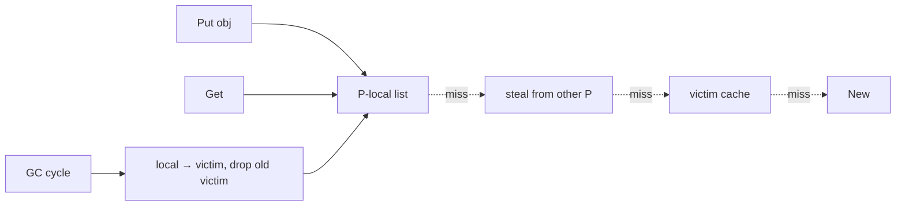
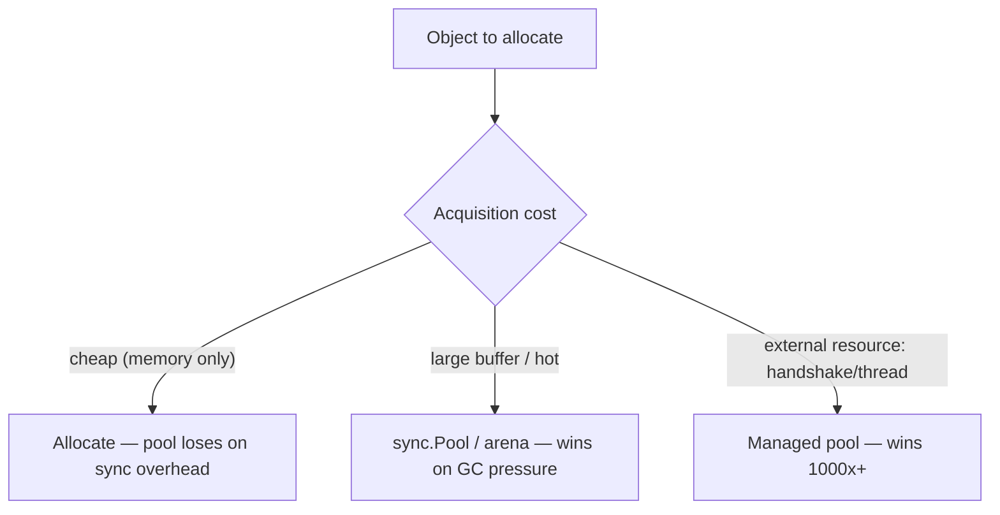

# Object Pool — Professional Level

> **Category:** [Object & State Patterns](../README.md) — under the hood: why naive pools lose to the allocator, how `sync.Pool` cooperates with the GC, and how HikariCP squeezes contention to near zero.

---

## Table of Contents

1. [Introduction](#introduction)
2. [Why the Allocator Usually Wins](#why-the-allocator-usually-wins)
3. [Go `sync.Pool` Internals](#go-syncpool-internals)
4. [HikariCP's ConcurrentBag](#hikaricps-concurrentbag)
5. [False Sharing and Cache Lines](#false-sharing-and-cache-lines)
6. [Reset Cost and Security](#reset-cost-and-security)
7. [Pool vs Arena vs Escape Analysis](#pool-vs-arena-vs-escape-analysis)
8. [Benchmarks](#benchmarks)
9. [Diagrams](#diagrams)
10. [Related Topics](#related-topics)

---

## Introduction

A pool's runtime cost is **synchronization on borrow/return** plus **reset**, weighed against the **allocation + GC** it replaces. At the professional level you should be able to:

- Explain why a mutex-guarded small-object pool is slower than `new`.
- Describe how `sync.Pool` avoids a global lock and how it cooperates with the GC's two-phase clearing.
- Read why HikariCP's `ConcurrentBag` beats a `BlockingQueue` under contention.
- Quantify reset cost and recognize the security dimension of skipped resets.

---

## Why the Allocator Usually Wins

Modern allocators are not `malloc`-per-object. A generational, bump-pointer allocator (HotSpot's TLAB, Go's mcache) allocates a short-lived object by **incrementing a pointer** — a few nanoseconds, no lock, thread-local. Reclaiming a young-generation object that's already dead costs *nothing* in a copying collector: only survivors are touched.

A pool replaces this with:

1. A **synchronized** borrow (CAS or lock) — already comparable to the whole allocation.
2. A **reset** (zero the buffer, clear references).
3. A **synchronized** return.
4. Plus: the pooled objects are **long-lived**, so they get promoted to the old generation and now must be traced on *every* old-gen GC — the opposite of free.

So a naive pool of cheap objects often does *more* work than allocation, *and* it adds GC tracing pressure, *and* it adds bugs. This is why "pool everything" is an anti-pattern: you pay synchronization to avoid an allocation that was nearly free, and you keep alive objects the GC would have discarded instantly.

Pooling wins only when the per-object **acquisition** cost (syscall, handshake, large zeroing) dwarfs the synchronization cost — i.e., for genuine resources, not memory.

---

## Go `sync.Pool` Internals

`sync.Pool` is engineered precisely to dodge the "long-lived promoted garbage" problem.

### Per-P sharding

Each `Get`/`Put` touches a **per-P** (per-logical-processor) local structure first — a private slot plus a lock-free `poolChain`. Because a goroutine is pinned to a P during the operation, the common path is **lock-free and contention-free**: no goroutine on another P touches your local slot. Only on a local miss does it *steal* from another P's shared chain.

### GC cooperation (the key design)

`sync.Pool` registers a hook that **clears the pool every GC cycle**, using two generations (`local` and `victim`):

- At GC: `victim` is dropped, `local` becomes the new `victim`, `local` is emptied.
- An object survives at most **two** GC cycles in the pool.

This is why `sync.Pool` is for **ephemeral, reconstructible** objects only: the GC will reclaim your pooled buffers under memory pressure. It's a *cache that the GC is allowed to flush* — which makes it safe (no unbounded growth) but useless for connections, which must persist.

```go
var pool = sync.Pool{New: func() any { return new(bytes.Buffer) }}

b := pool.Get().(*bytes.Buffer)  // lock-free per-P fast path; New() on total miss
b.Reset()
defer pool.Put(b)                // back to this P's local
```

### What `New` guarantees

`Get` never returns nil if `New` is set — it manufactures one on a miss. So `sync.Pool` is a *performance hint*, not a capacity bound: it never blocks and never enforces a max.

---

## HikariCP's ConcurrentBag

A connection pool can't use `sync.Pool` semantics (connections must persist) and a plain `ArrayBlockingQueue` serializes on a single lock under high borrow rates. HikariCP's **`ConcurrentBag`** is the engineered answer:

- A **thread-local list** of recently used connections: a thread that borrows and returns repeatedly hits its own list — **no shared-state contention**, no CAS on the common path.
- A shared `CopyOnWriteArrayList` of all items, scanned with **non-blocking `tryLock`-style stealing** when the thread-local misses.
- A `SynchronousQueue`-like handoff so a waiting borrower receives a just-returned connection directly, skipping the shared list entirely.

The result: borrow/return is mostly thread-local and lock-free, so the pool scales with cores instead of becoming the bottleneck. This is the difference between a textbook pool and a production one — the *pool's own concurrency* is the hard part once the resource is expensive enough to justify pooling at all.

---

## False Sharing and Cache Lines

A high-throughput pool's counters (active count, wait count) are mutated by many cores. If two hot counters share a 64-byte cache line, every increment on one **invalidates** the other core's cached line — *false sharing*, a silent throughput killer.

Mitigation: pad hot, independently-updated fields to separate cache lines.

```java
// Java: @Contended (needs -XX:-RestrictContended) pads to its own cache line
@jdk.internal.vm.annotation.Contended
volatile long activeCount;
```

```go
// Go: manual padding
type counter struct {
    n   atomic.Int64
    _   [56]byte   // pad to 64B so neighbors don't share the line
}
```

`sync.Pool`'s per-P sharding sidesteps this entirely — different Ps touch different cache lines by construction.

---

## Reset Cost and Security

Reset is not free, and skipping it is not merely a perf shortcut — it's a **correctness and security boundary**.

### Cost

- Zeroing a 64 KB buffer: a `memset` over 64 KB, ~a few µs, often memory-bandwidth bound. For very large buffers this can rival the allocation you're avoiding.
- Clearing object references: cheap, but necessary so the pooled object doesn't pin large graphs alive (a subtle memory leak — the pooled object holds a reference to last request's 10 MB payload).

### Security

A pooled buffer reused **without zeroing** can leak one user's bytes into another user's response — a classic information-disclosure bug (e.g., a famous TLS buffer-reuse class of vulnerabilities). A connection returned mid-transaction can execute the next borrower's queries inside the previous user's transaction context. **Reset is the boundary that prevents cross-tenant data bleed.** Treat it as security-critical, not housekeeping.

The optimization tension: you pool to save allocation, but a full zeroing reset can cost as much as the allocation. The honest resolution is to zero *only what's needed* (the written region, not the whole capacity) — and never to skip it for security-relevant data.

---

## Pool vs Arena vs Escape Analysis

Three ways to cut allocation cost, in increasing order of "let the runtime do it":

| Technique | Who manages lifetime | Best for |
|---|---|---|
| **Object pool** | You (borrow/return) | Expensive *resources* (connections, threads) |
| **Arena / region** | Bulk free at region end | Many objects with a shared, clear lifetime (a request) |
| **Escape analysis** | The compiler | Objects that don't escape — stack-allocated, zero cost |

Escape analysis is the one to *enable*, not implement: if HotSpot or Go's compiler proves an object doesn't escape its scope, it's stack-allocated and the GC never sees it. Before pooling, check whether the object even escapes:

```bash
go build -gcflags='-m' ./...     # "does not escape" → no pool needed
```

Often the "allocation pressure" you wanted to pool away vanishes when you stop forcing the object to escape (e.g., by not storing it in an interface or a heap field).

---

## Benchmarks

Apple M2 Pro, indicative numbers — *measure your own workload*.

### Go: `sync.Pool` vs allocation for a 64 KB buffer

```
BenchmarkAllocate64K-8     200000   6200 ns/op   65536 B/op   1 allocs/op
BenchmarkSyncPool64K-8    3000000    410 ns/op       0 B/op   0 allocs/op
```

For a **large** buffer churned hot, `sync.Pool` is a clear win (allocation + zeroing of 64 KB dominates). The crossover is size-dependent.

### Go: `sync.Pool` vs allocation for a tiny struct

```
BenchmarkAllocateSmall-8   500000000   2.1 ns/op    16 B/op   1 allocs/op
BenchmarkSyncPoolSmall-8   100000000  11.0 ns/op     0 B/op   0 allocs/op
```

For a **small** object, the pool is **5× slower** — the per-P bookkeeping costs more than the bump-pointer allocation. This is the "don't pool cheap objects" rule, quantified.

### Java: connection acquisition

```
DriverManager.getConnection (real handshake)   ~30 ms
HikariCP borrow (warm pool, ConcurrentBag)     ~0.5 µs
ArrayBlockingQueue pool (contended, 32 threads) ~8   µs  (lock serialization)
```

The handshake is ~60,000× the warm-borrow cost — *this* is why connection pooling is worth its complexity, and why the pool's own contention design (ConcurrentBag) matters at scale.

---

## Diagrams

### `sync.Pool` two-generation GC clearing



### Cost crossover: pool vs allocate



---

## Related Topics

- **Go runtime:** `sync/pool.go` source; the per-P `poolChain` and `poolCleanup` GC hook.
- **HikariCP internals:** [ConcurrentBag design](https://github.com/brettwooldridge/HikariCP/wiki) and the "down the rabbit hole" notes.
- **Escape analysis:** Go `-gcflags='-m'`; HotSpot `-XX:+PrintEscapeAnalysis`.
- **Adjacent:** [Memoization & Caching — Professional](../03-memoization-and-caching/professional.md), [Performance Anti-Patterns](../../../anti-patterns/06-performance/README.md).

---

[← Senior](senior.md) · [Object & State](../README.md) · [Coding Patterns](../../README.md) · **Next:** [Interview](interview.md)
