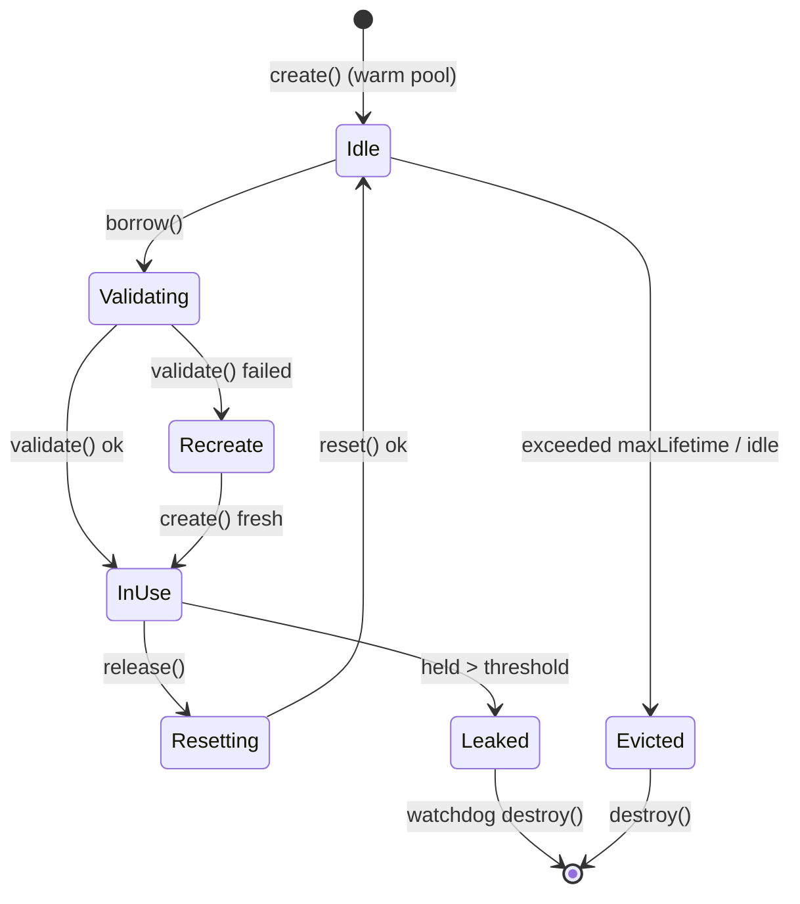
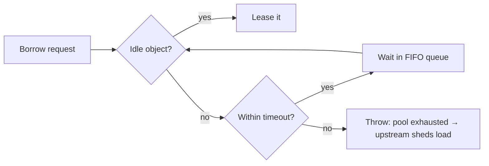

# Object Pool — Senior Level

> **Category:** [Object & State Patterns](../README.md) — own the pool as a piece of system architecture: its sizing, fairness, leak detection, exhaustion policy, and failure modes under load.

---

## Table of Contents

1. [Introduction](#introduction)
2. [Sizing: The Hardest Knob](#sizing-the-hardest-knob)
3. [Exhaustion Policy](#exhaustion-policy)
4. [Validation, Eviction, and Lifetime](#validation-eviction-and-lifetime)
5. [Leak Detection](#leak-detection)
6. [Fairness and Starvation](#fairness-and-starvation)
7. [Thread-Safety of the Pool Itself](#thread-safety-of-the-pool-itself)
8. [Code Examples — Advanced](#code-examples-advanced)
9. [Liabilities](#liabilities)
10. [Observability](#observability)
11. [Diagrams](#diagrams)
12. [Related Topics](#related-topics)

---

## Introduction

> Focus: **Architecture** and **optimization**

At the senior level a pool is not a data structure — it is a **shared, contended, bounded resource with its own SLO**. The interesting decisions are not `borrow()`/`release()`; they are: how big, what happens at the ceiling, how you reclaim objects that died while idle, how you find the borrower who never returned, and how you keep one greedy caller from starving the rest.

Senior decisions:

- What is the *right* max size, derived from concurrency and resource cost — not a round number?
- On exhaustion: **block-with-timeout**, **grow**, or **fail fast**? (Almost always the first.)
- How do you detect and surface a **leak** (borrowed and never returned)?
- Is the pool **fair** (FIFO) or does it permit starvation?
- How does the pool degrade under overload, and does that degradation produce a clean, observable signal?

---

## Sizing: The Hardest Knob

The instinct "more connections = more throughput" is wrong. A connection pool is a queue in front of a fixed-capacity backend; oversizing just moves the queue from your app into the database, where it's slower to drain and harder to see.

### The connection-pool sizing formula

HikariCP's well-known guidance, derived from queueing theory:

```
connections = ((core_count * 2) + effective_spindle_count)
```

For an SSD/cloud-DB-backed service, this lands surprisingly small — often **fewer than 20** connections per *instance*, even at high throughput. A pool of 10 saturating a fast database can out-throughput a pool of 100 thrashing it.

### The global-budget constraint

Pool size is per-process, but the backend limit is global:

```
total_connections = pods × pool_max_per_pod
must satisfy:  total_connections ≤ db.max_connections − reserved_for_admin
```

50 pods × `maxPoolSize=20` = 1,000 connections against Postgres `max_connections = 200` is a production incident waiting to happen. Either shrink per-pod pools, or front the DB with a **transaction-mode multiplexer** (PgBouncer), which lets thousands of app-side "connections" share a few hundred real ones.

### Min-idle vs max

- `minIdle` — warm spares that absorb a burst without paying handshake latency.
- `max` — the ceiling that protects the backend.
- Setting `minIdle == max` (a fixed-size pool) is often *better* in steady high traffic: no churn, predictable footprint. HikariCP explicitly recommends a fixed-size pool for most production services.

---

## Exhaustion Policy

When every object is in use and a new borrow arrives, you must choose. There are exactly three answers, and the choice defines your service's behavior under overload.

| Policy | Behavior | When it's right | Danger |
|---|---|---|---|
| **Block with timeout** | Wait up to `T`, then throw | Almost always — bounded wait, clean backpressure | `T` too long → cascading timeouts upstream |
| **Grow** | Create a new object beyond max | Soft limits, cheap-ish objects | Defeats the cap; can melt the backend |
| **Fail fast** | Throw immediately if none idle | Latency-critical paths that prefer shedding load | Sheds load aggressively under bursts |

**Block-with-timeout is the production default.** It turns overload into a bounded queue with an explicit deadline, which is exactly the backpressure you want: requests fail fast *after* a fair wait, the failure is observable (a borrow-timeout metric), and it protects the backend.

The timeout must be **shorter than the upstream request deadline**, or you'll hold a doomed request hostage in the borrow queue.

---

## Validation, Eviction, and Lifetime

Pooled resources rot. A connection idle for an hour may have been killed by the DB's `idle_in_transaction_session_timeout`, a firewall, or a failover. Three mechanisms keep the pool healthy:

### Test-on-borrow vs background eviction

- **Test-on-borrow:** validate every object before handing it out. Correct, but adds latency to *every* borrow (a `SELECT 1` round-trip).
- **Background eviction (test-while-idle):** a sweeper thread validates idle objects and discards dead ones off the hot path. Lower borrow latency; a small window where a just-died object slips through. HikariCP favors this plus a cheap `Connection.isValid()`.

### Max lifetime

Even healthy connections should be retired periodically (`maxLifetime`, e.g. 30 min, set *below* the DB/firewall idle timeout). This rolls the pool gracefully, avoids server-side resource creep, and plays nicely with rolling failovers — connections drift to the new primary instead of pinning the old one.

### Validate → repair, never poison

If validation fails, `destroy` the object and `create` a replacement. Returning a known-dead object to the idle set poisons the next borrower.

---

## Leak Detection

A **leak** is an object borrowed and never returned — usually a missing `finally`/`defer`, or an exception path that skips the return. Leaks are silent until the pool is exhausted and *everything* blocks, often far from the buggy code.

### Detection strategy

Record a timestamp (and ideally a stack trace) at borrow. A watchdog flags any object held longer than a threshold:

```java
// HikariCP
cfg.setLeakDetectionThreshold(30_000);   // log a stack trace if held > 30s
```

The logged stack trace points at the borrow site — the line that should have returned. This is the single most valuable diagnostic a pool can offer; turn it on in any non-trivial service.

### Defense in depth

- Make return **structural** (`try-with-resources`, `defer`, context manager) so it can't be forgotten.
- Cap borrow hold time; a watchdog can forcibly reclaim and `destroy` a leaked object (last resort — it may break the leaker mid-use).

---

## Fairness and Starvation

A pool backed by a stack (LIFO) can starve waiters: a hot thread that borrows and returns rapidly may keep reclaiming the same object, while a thread that arrived earlier waits indefinitely.

- **FIFO wait queue** (a fair `BlockingQueue` / fair lock) guarantees borrowers are served in arrival order — no starvation, slightly more context-switching.
- **LIFO object selection** (hand out the most-recently-returned object) keeps a small working set hot in cache and lets idle objects age out for eviction — but the *waiter queue* should still be FIFO.

The senior nuance: **fair waiter ordering, LIFO object reuse** is often the best combination — nobody starves, yet the cache stays warm and surplus objects go idle long enough to be evicted.

---

## Thread-Safety of the Pool Itself

The pool is concurrent state: multiple threads borrow and return simultaneously. The pool's *internal* synchronization must be correct and cheap, because it's on every hot-path request.

- A naive `synchronized` around the whole pool serializes all borrows — the pool becomes the bottleneck it was meant to relieve.
- High-performance pools use a **lock-free or sharded idle store** (HikariCP uses a custom `ConcurrentBag` with thread-local lists + steal-on-miss) to cut contention.
- The *borrowed object* is exclusively owned by one thread between borrow and return — but only if nobody returns it twice. A double-return places one object in the idle set twice; two threads then borrow the same object and corrupt each other's state. Guard against it (see [find-bug.md](find-bug.md)).

---

## Code Examples — Advanced

### Java — leak-detecting, fair, validating pool core

```java
import java.util.concurrent.*;
import java.util.concurrent.atomic.AtomicLong;

public final class LeasePool<T> {
    private final BlockingQueue<T> idle;     // fair queue → FIFO waiters
    private final Lifecycle<T> lc;
    private final ConcurrentMap<T, Long> leasedAt = new ConcurrentHashMap<>();
    private final long leakMillis;

    public LeasePool(int size, long leakMillis, Lifecycle<T> lc) {
        this.idle = new ArrayBlockingQueue<>(size, /* fair */ true);
        this.lc = lc; this.leakMillis = leakMillis;
        for (int i = 0; i < size; i++) idle.add(lc.create());
        startLeakWatchdog();
    }

    public T borrow(long t, TimeUnit u) throws InterruptedException {
        T obj = idle.poll(t, u);
        if (obj == null) throw new PoolExhaustedException();
        if (!lc.validate(obj)) { lc.destroy(obj); obj = lc.create(); }
        leasedAt.put(obj, System.nanoTime());
        return obj;
    }

    public void release(T obj) {
        if (leasedAt.remove(obj) == null)        // double-return guard
            throw new IllegalStateException("returned an object that wasn't leased");
        lc.reset(obj);
        if (!idle.offer(obj)) lc.destroy(obj);   // pool full → discard
    }

    private void startLeakWatchdog() {
        var exec = Executors.newSingleThreadScheduledExecutor(r -> {
            var th = new Thread(r, "pool-leak-watchdog"); th.setDaemon(true); return th;
        });
        exec.scheduleAtFixedRate(() -> {
            long now = System.nanoTime();
            leasedAt.forEach((obj, since) -> {
                if (TimeUnit.NANOSECONDS.toMillis(now - since) > leakMillis)
                    log.warn("possible leak: object held > {}ms", leakMillis);
            });
        }, leakMillis, leakMillis, TimeUnit.MILLISECONDS);
    }
}
```

The `leasedAt` map does double duty: leak detection *and* a double-return guard.

### Python — borrow with deadline tied to the request context

```python
import time, queue
from contextlib import contextmanager

class LeasePool:
    def __init__(self, size, lc):
        self._idle = queue.Queue(size)
        self._lc = lc
        for _ in range(size):
            self._idle.put(lc.create())

    @contextmanager
    def borrow(self, deadline: float):
        timeout = max(0.0, deadline - time.monotonic())   # tie to request deadline
        try:
            obj = self._idle.get(timeout=timeout)
        except queue.Empty:
            raise TimeoutError("pool exhausted before request deadline")
        if not self._lc.validate(obj):
            self._lc.destroy(obj); obj = self._lc.create()
        try:
            yield obj
        finally:
            self._lc.reset(obj)
            self._idle.put(obj)
```

### Go — sizing `database/sql` with lifetimes

```go
db.SetMaxOpenConns(15)                 // small, per HikariCP-style math
db.SetMaxIdleConns(15)                 // == MaxOpen → fixed-size, no churn
db.SetConnMaxLifetime(25 * time.Minute) // retire before DB/firewall idle timeout
db.SetConnMaxIdleTime(5 * time.Minute)  // shed surplus during quiet periods

// Always pass a context with a deadline so a borrow can't block forever:
ctx, cancel := context.WithTimeout(r.Context(), 2*time.Second)
defer cancel()
rows, err := db.QueryContext(ctx, q)   // borrow is bounded by ctx
```

`context` *is* Go's borrow-timeout-and-leak-prevention mechanism: a cancelled context releases the connection back to the pool.

---

## Liabilities

### Symptom 1: Pool sized by superstition
`maxPoolSize=100` "to be safe" floods the DB and *lowers* throughput. Size from the formula; verify with a load test.

### Symptom 2: Borrow timeout longer than request timeout
A request that already missed its deadline still occupies a borrow slot, amplifying the backlog. Borrow timeout < upstream deadline.

### Symptom 3: No leak detection in production
The first sign of a leak is a total outage (pool exhausted), with no clue where. Always enable leak/long-hold logging.

### Symptom 4: Reset that doesn't fully reset
A connection returned mid-transaction, a buffer not zeroed, a thread-local not cleared — stale state crosses the borrow boundary. Reset must restore the object to *as-created*.

### Symptom 5: Pooling spreading where it shouldn't
A pool for cheap objects added "for consistency" introduces contention and bugs for zero benefit. Pools are for expensive resources only.

---

## Observability

A pool without metrics is a black box that fails opaquely. Export:

- **active / idle / total** counts (saturation = active/total).
- **borrow wait time** (p50/p99) — rising p99 means you're near exhaustion.
- **borrow timeouts / s** — the load-shedding signal.
- **creation & destruction rate** — high churn means lifetime/validation is too aggressive.
- **pending borrowers** — the queue depth in front of the pool.

Alert on sustained saturation and on any borrow-timeout rate above zero. These metrics turn "the app is slow" into "the connection pool is saturated at 100%, p99 borrow wait 1.8s" — an actionable diagnosis.

---

## Diagrams

### Object lifecycle with validation and eviction



### Exhaustion → backpressure



---

## Related Topics

- **Next:** [Object Pool — Professional](professional.md)
- **Practice:** [Tasks](tasks.md) · [Find-Bug](find-bug.md) · [Optimize](optimize.md) · [Interview](interview.md)
- **System context:** [Thread Pool](../../../design-patterns/04-concurrency-patterns/05-thread-pool/junior.md), connection sizing in [database/backend performance](../../../anti-patterns/06-performance/README.md).
- **Adjacent patterns:** [Memoization & Caching](../03-memoization-and-caching/junior.md), [Lazy Initialization](../02-lazy-initialization/junior.md).

---

[← Middle](middle.md) · [Object & State](../README.md) · [Coding Patterns](../../README.md) · **Next:** [Professional](professional.md)
