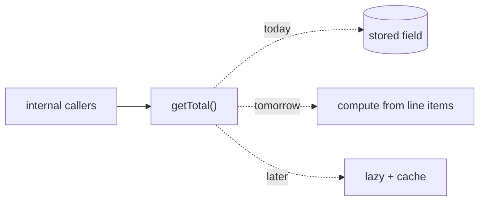
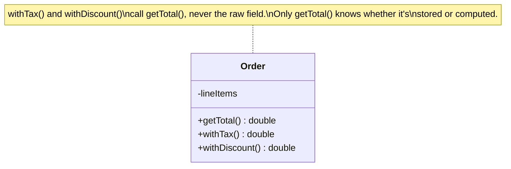

# Self-Encapsulation — Junior Level

> **Category:** [Object & State Patterns](../README.md) — a class reaches its own fields through accessor methods instead of touching the raw storage, so the representation can change without rewriting every internal call site.

---

## Table of Contents

1. [Introduction](#introduction)
2. [Prerequisites](#prerequisites)
3. [Glossary](#glossary)
4. [Core Concepts](#core-concepts)
5. [Real-World Analogies](#real-world-analogies)
6. [Mental Models](#mental-models)
7. [Pros & Cons](#pros-cons)
8. [Use Cases](#use-cases)
9. [Code Examples](#code-examples)
10. [Coding Patterns](#coding-patterns)
11. [Clean Code](#clean-code)
12. [Best Practices](#best-practices)
13. [Edge Cases & Pitfalls](#edge-cases-pitfalls)
14. [Common Mistakes](#common-mistakes)
15. [Tricky Points](#tricky-points)
16. [Test Yourself](#test-yourself)
17. [Cheat Sheet](#cheat-sheet)
18. [Summary](#summary)
19. [Further Reading](#further-reading)
20. [Related Topics](#related-topics)
21. [Diagrams](#diagrams)

---

## Introduction

> Focus: **What is it?** and **How to use it?**

**Self-Encapsulation** (named by Kent Beck, popularized by Martin Fowler) is a small but load-bearing habit: **a class accesses its own fields through accessor methods (`getX`/`setX`) rather than touching the raw fields directly** — even from inside its own other methods.

The usual reflex is the opposite. We assume "encapsulation" only matters at the class boundary: outsiders go through accessors, but *inside* the class we freely read and write the raw fields. Self-encapsulation says: route the *inside* through accessors too.

Why bother? Because the moment every internal read of `temperature` goes through `getTemperature()`, you can change what that field *is* — compute it, cache it, validate it, let a subclass override it — by editing **one method** instead of hunting down twenty call sites.

```java
// NOT self-encapsulated — internal code touches the raw field
class Order {
    private double total;
    double withTax()      { return total * 1.2; }   // raw field
    double withDiscount() { return total * 0.9; }   // raw field
}
```

If `total` ever becomes a *computed* value (sum of line items), you must edit `withTax`, `withDiscount`, and every other method that read it.

```java
// Self-encapsulated — internal code goes through the accessor
class Order {
    private double total;
    double getTotal()     { return total; }
    double withTax()      { return getTotal() * 1.2; }
    double withDiscount() { return getTotal() * 0.9; }
}
```

Now turning `total` into a computed sum is a one-method change in `getTotal()`. Nothing else moves.

---

## Prerequisites

- **Required:** Classes, fields, and methods (basic OOP).
- **Required:** Getters and setters (accessor methods).
- **Helpful:** [Encapsulation & information hiding](../../clean-code/22-abstraction-and-information-hiding/README.md).
- **Helpful:** [Lazy Initialization](../02-lazy-initialization/junior.md) — the classic payoff of self-encapsulation.

---

## Glossary

| Term | Definition |
|------|-----------|
| **Field** | A raw stored variable on an instance (`private double total;`). |
| **Accessor** | A method that reads (`getter`) or writes (`setter`) a field. |
| **Self-encapsulation** | Accessing your *own* fields through accessors, not the raw field. |
| **Self-Encapsulate Field** | Fowler's named refactoring that introduces this. |
| **Derived / computed field** | A "field" that is actually calculated on demand, not stored. |
| **Uniform Access Principle** | Meyer's rule: callers shouldn't be able to tell stored from computed. |
| **Invariant** | A rule the object's state must always satisfy (e.g., `0 ≤ percent ≤ 100`). |

---

## Core Concepts

### 1. Read through a getter, write through a setter — even internally

The whole pattern is one rule: inside the class, say `getTotal()` not `total`, and `setTotal(x)` not `total = x`.

### 2. The accessor becomes a seam

A *seam* is a place you can change behavior without editing callers. Once internal code goes through `getTotal()`, that method is a seam: you can drop computation, caching, or validation behind it.

### 3. Three things you can now do behind the accessor

- **Compute instead of store** — `getArea()` returns `width * height` with no `area` field.
- **Lazy-initialize** — `getConnection()` opens the connection the first time it's asked for.
- **Validate on write** — `setPercent(p)` rejects values outside `0..100`.

### 4. Subclasses can override the "field"

If subclasses call `getRate()` instead of the raw `rate`, a subclass can override `getRate()` to change behavior — impossible if everyone reads the raw field.

---

## Real-World Analogies

| Concept | Analogy |
|---|---|
| **Raw field** | The actual cash in your wallet. |
| **Accessor** | An ATM card — you always go through the bank, never reach into the vault. |
| **Computed field** | Your "available balance" — the bank calculates it (cash minus pending), you never see the vault. |
| **Override** | A premium account that computes available balance differently — same card, different bank logic. |
| **Uniform Access** | You ask "what's my balance?" the same way whether it's stored or computed live. |

---

## Mental Models

**The intuition:** *"Talk to your own fields the way an outsider would."*

```
   other methods of the class
            │
            ▼
       getTotal() / setTotal()   ← the seam
            │
   ┌────────┼─────────┐
   ▼        ▼         ▼
 stored   computed   lazy/validated
 field    on demand  behind the call
```

The raw field sits behind a method. Today the method just returns the field. Tomorrow it can do anything — and no caller notices.

---

## Pros & Cons

| Pros | Cons |
|------|------|
| Change representation without touching call sites | Extra method per field (boilerplate) |
| Enables lazy-init / memoization later, for free | Marginal value for dumb data holders |
| Subclasses can override a "field" | Accessor side-effects can surprise readers |
| One place to enforce invariants (the setter) | Easy to over-apply (Java getter/setter cargo cult) |
| Supports the Uniform Access Principle | A no-op getter reads as noise if it never grows |

### When to use:
- A field is likely to become computed, lazy, or validated.
- Subclasses may need to override the value.
- You want one chokepoint for invariants.

### When NOT to use:
- A pure, never-overridden data record (a DTO). The accessor adds noise.
- In Python, where `@property` lets you start with a plain attribute and upgrade later — see below.

---

## Use Cases

- **Lazy connection / resource** — `getConnection()` opens on first access.
- **Derived totals** — `getTotal()` sums line items instead of storing a stale number.
- **Validated state** — `setTemperature(t)` enforces a physical floor.
- **Override hooks** — a `TaxedOrder` subclass overrides `getTotal()`.
- **Framework base classes** — template methods call `getX()` so subclasses can substitute.

---

## Code Examples

### Java — internal access through accessors

```java
public class Rectangle {
    private double width;
    private double height;

    public Rectangle(double width, double height) {
        setWidth(width);     // route construction through the setter too
        setHeight(height);
    }

    public double getWidth()  { return width; }
    public double getHeight() { return height; }

    public void setWidth(double w) {
        if (w < 0) throw new IllegalArgumentException("width >= 0");
        this.width = w;
    }
    public void setHeight(double h) {
        if (h < 0) throw new IllegalArgumentException("height >= 0");
        this.height = h;
    }

    // Internal code uses the getters, not the raw fields.
    public double area()      { return getWidth() * getHeight(); }
    public double perimeter() { return 2 * (getWidth() + getHeight()); }
}
```

Because `area()` and `perimeter()` call the getters, a subclass could override `getWidth()` (e.g., to apply a scale factor) and both methods would honor it automatically.

---

### Python — `@property` makes it free

```python
class Rectangle:
    def __init__(self, width: float, height: float) -> None:
        self.width = width        # plain attribute — no ceremony yet
        self.height = height

    def area(self) -> float:
        return self.width * self.height

# Later, you need validation. Upgrade the attribute to a property —
# callers and internal code are UNCHANGED.
class Rectangle:                  # noqa: F811 (illustrative redefinition)
    def __init__(self, width: float, height: float) -> None:
        self.width = width
        self.height = height

    @property
    def width(self) -> float:
        return self._width

    @width.setter
    def width(self, value: float) -> None:
        if value < 0:
            raise ValueError("width >= 0")
        self._width = value

    @property
    def height(self) -> float:
        return self._height

    @height.setter
    def height(self, value: float) -> None:
        if value < 0:
            raise ValueError("height >= 0")
        self._height = value

    def area(self) -> float:
        return self.width * self.height
```

> **Pythonic note:** in Python you do **not** pre-emptively write getters/setters. You start with a plain `self.width` and only convert to `@property` when you actually need validation, computation, or laziness. The conversion is invisible to every caller. Writing Java-style `get_width()` up front is an anti-idiom here.

---

### Go — methods, used deliberately

```go
package geometry

import "errors"

type Rectangle struct {
    width  float64
    height float64
}

func (r *Rectangle) Width() float64  { return r.width }
func (r *Rectangle) Height() float64 { return r.height }

func (r *Rectangle) SetWidth(w float64) error {
    if w < 0 {
        return errors.New("width >= 0")
    }
    r.width = w
    return nil
}

// Internal code goes through the accessor.
func (r *Rectangle) Area() float64 { return r.Width() * r.Height() }
```

> **Go note:** Go has no getter/setter *convention* — you do not name methods `GetWidth`. Add accessor methods only when they earn it (validation, a future computed value, an interface contract). Most small structs expose fields directly; reach for accessors deliberately, not reflexively.

---

## Coding Patterns

### Pattern 1: Construct through the setter

```java
public Rectangle(double width, double height) {
    setWidth(width);    // validation runs at construction, not just later
    setHeight(height);
}
```

Routing the constructor through setters means the invariant is enforced from the very first assignment.

### Pattern 2: Replace a stored field with a computed one

```java
// Before: stored
private double total;
public double getTotal() { return total; }

// After: computed — only getTotal() changes
public double getTotal() {
    return lineItems.stream().mapToDouble(LineItem::amount).sum();
}
```



---

## Clean Code

| ❌ Bad | ✅ Good |
|---|---|
| `return total * 1.2;` (raw field inside class) | `return getTotal() * 1.2;` |
| Getter/setter on every field "just in case" (Python/Go) | Accessor only where it earns its keep |
| Setter that silently clamps bad input | Setter that validates and rejects loudly |
| `get_width()` in Python | plain attribute, `@property` later |

The goal is not "accessors everywhere." It is *consistency*: if a field has an accessor, the class uses it internally too.

---

## Best Practices

1. **Be consistent.** If a field has an accessor, never bypass it inside the class.
2. **Construct through setters** so invariants hold from creation.
3. **In Python, prefer plain attributes**; upgrade to `@property` only when needed.
4. **In Go, add accessors deliberately**, not by reflex.
5. **Keep accessors cheap and predictable** — a getter shouldn't have surprising side effects.
6. **Use the setter as the single place** to enforce a field's invariant.

---

## Edge Cases & Pitfalls

- **Constructor bypasses the setter** — validation never runs at creation. Route the constructor through the setter.
- **A getter with side effects** (lazy init that mutates) surprises readers and breaks "read is safe to repeat." Document it.
- **Over-encapsulating a DTO** — a record whose only job is to carry data gains nothing from accessors.
- **Setter that mutates more than its field** (e.g., recomputes a cache) hides cost behind an innocent-looking assignment.

---

## Common Mistakes

1. **Reading the raw field in some methods, the getter in others** — the inconsistency defeats the seam.
2. **Writing getters/setters in Python** instead of plain attributes + later `@property`.
3. **Adding `GetX`/`SetX` to every Go struct** — non-idiomatic noise.
4. **A setter that "fixes" bad input silently** instead of rejecting it.
5. **Believing self-encapsulation is the same as a public getter** — it's about *internal* access, regardless of visibility.

---

## Tricky Points

- **Self-encapsulation ≠ exposing the field.** The accessor can be `private`. The point is internal *routing*, not external visibility.
- **It is the enabler for lazy-init and memoization.** Both work *because* internal code already goes through the accessor — see [Lazy Initialization](../02-lazy-initialization/junior.md).
- **Construction is the classic exception** — some authors deliberately set raw fields in the constructor to avoid running an overridable setter during construction (a real Java/C# hazard). More on this at the senior level.

---

## Test Yourself

1. What is self-encapsulation in one sentence?
2. Why does routing internal reads through a getter make a field easy to change?
3. Why is self-encapsulation "free" in Python?
4. How does it enable a subclass to change a "field"?
5. When is it *not* worth it?

<details><summary>Answers</summary>

1. A class accesses its own fields through accessor methods rather than the raw fields.
2. Because the field's representation lives behind one method; changing it (compute/lazy/validate) edits that method, not every caller.
3. `@property` lets you start with a plain attribute and convert to an accessor later with zero caller changes — no up-front getters needed.
4. Internal code calls `getX()`; a subclass overrides `getX()`, so all that internal code transparently uses the new value.
5. For pure data holders/DTOs, or in languages (Python/Go) where reflexive getters are noise.

</details>

---

## Cheat Sheet

```java
// Java: internal code uses the getter
double area() { return getWidth() * getHeight(); }
```

```python
# Python: plain attribute now, @property only when needed
self.width = w          # today
@property                # tomorrow, callers unchanged
def width(self): return self._width
```

```go
// Go: deliberate accessor, no Get prefix
func (r *Rectangle) Area() float64 { return r.Width() * r.Height() }
```

---

## Summary

- Self-encapsulation = access your **own** fields through accessors, even internally.
- The accessor becomes a **seam**: swap stored → computed → lazy → validated behind it.
- It is the **enabler** for [lazy initialization](../02-lazy-initialization/junior.md) and [memoization](../03-memoization-and-caching/junior.md).
- **Python** makes it free with `@property`; **Go** uses accessors deliberately; **Java/C#** rely on it most.
- Don't over-apply: dumb data holders gain nothing.

---

## Further Reading

- Martin Fowler, *Refactoring* — "Self-Encapsulate Field."
- Kent Beck, *Smalltalk Best Practice Patterns* — the origin of the idea.
- Bertrand Meyer, *Object-Oriented Software Construction* — the Uniform Access Principle.

---

## Related Topics

- **Next:** [Self-Encapsulation — Middle](middle.md)
- **Enables:** [Lazy Initialization](../02-lazy-initialization/junior.md), [Memoization & Caching](../03-memoization-and-caching/junior.md).
- **Principle:** [Abstraction & Information Hiding](../../clean-code/22-abstraction-and-information-hiding/README.md).
- **Cautionary:** [Object-Orientation Misuse anti-patterns](../../anti-patterns/02-design/01-oo-misuse/junior.md) (Anemic Domain Model, Object Orgy).

---

## Diagrams



[Object & State](../README.md) · [Coding Patterns](../../README.md) · **Next:** [Self-Encapsulation — Middle](middle.md)
